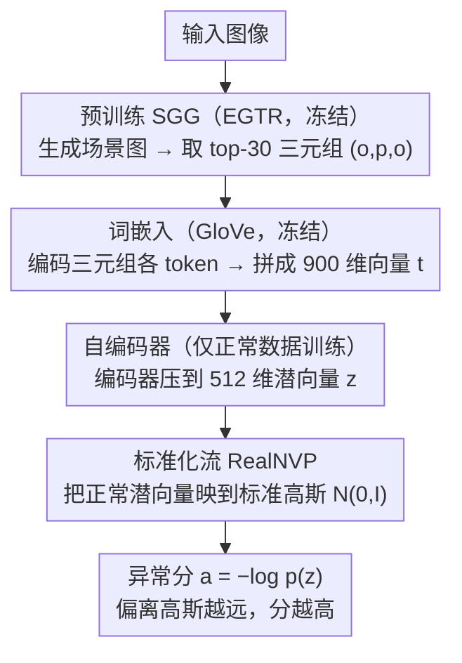

# BUSSARD: Normalizing Flows for Bijective Universal Scene-Specific Anomalous Relationship Detection

**会议**: CVPR2026  
**arXiv**: [2603.16645](https://arxiv.org/abs/2603.16645)  
**代码**: [github.com/mschween/BUSSARD](https://github.com/mschween/BUSSARD)  
**领域**:目标检测  
**关键词**: 场景图异常检测, 标准化流, 语义嵌入, 关系异常, 多模态

## 一句话总结
提出 BUSSARD，首个基于学习的场景特定异常关系检测方法，利用预训练语言模型嵌入场景图三元组 + 自编码器降维 + 标准化流进行似然估计，在 SARD 数据集上 AUROC 提升约 10%，且对同义词变化鲁棒。

## 研究背景与动机
1. 图像异常检测不仅包括工业缺陷，还涉及场景上下文理解——如物体出现在不该出现的位置或异常的人-物关系
2. 现有方法多关注人体姿态等单一组件，忽略了更广泛的上下文信息和物体关系
3. SARD 任务及数据集关注场景图中的关系异常检测（如"盘子在椅子上"），但现有方法是基于计数的，无学习能力
4. 计数方法受长尾分布影响严重——少量高频三元组主导，大量正常但低频三元组被误判为异常
5. 计数方法对词汇变化（同义词）不鲁棒——"person" vs "human" 被视为完全不同实体
6. 需要能利用语义知识泛化到罕见或未见词汇的学习方法

## 方法详解

### 整体框架

BUSSARD 要解决的是"场景特定的异常关系检测"——给一张图，判断里面的物体关系（比如"盘子在椅子上"）在当前场景里是否反常。它把这件事拆成一条无监督似然估计流水线：先用预训练 SGG 把图像变成场景图、抽出一个个三元组，再用 GloVe 把三元组的词编码成语义向量交给自编码器压到低维，最后用标准化流在正常数据上学出潜向量的分布；推理时谁偏离这个分布，谁的异常分就高。整条链路只在正常样本上训练，不需要任何异常标注。其中 SGG 与 GloVe 均冻结复用预训练权重，可学习的只有自编码器和标准化流两个模块。

### 关键设计

**1. 词嵌入：用语义空间天然吸收同义词差异**

旧的计数方法把 "person" 和 "human" 当成两个完全不同的实体，词汇一变结果就抖。BUSSARD 改用 GloVe（$d=300$）把三元组 $(o_i, p_{i,j}, o_j)$ 的每个 token 编码成向量，拼成 $\mathbf{t} \in \mathbb{R}^{900}$。语义相近的词在嵌入空间里本就靠得近，所以同义词替换几乎不改变输入表示，长尾里那些低频但正常的三元组也能借语义泛化被正确识别，而不是因为没数到就被判异常。

**2. 自编码器：为标准化流铺一个稳定的低维空间**

标准化流要求输入输出维度严格匹配（双射），而直接在 900 维上训流很不稳定。这里插一个 4 层全连接 + ReLU 的自编码器，仅用正常数据训练，把 900 维压到 $d_z=512$ 维潜向量。降维既满足了双射性的前提，又滤掉高维噪声，让后续的密度估计落在一个紧凑、好建模的流形上。

**3. 标准化流（RealNVP）：用似然把"正常"量化成可比的分数**

把正常三元组的潜向量分布映射到标准高斯 $\mathcal{N}(0, I)$ 后，异常程度就能用负对数似然直接读出：

$$a = -\log p(\mathbf{z}) = -\log p(\mathbf{u}) - \log\left|\det\frac{\partial f_{flow}}{\partial \mathbf{z}}\right|$$

落在高斯中心附近的潜向量似然高、分数低，偏离的三元组似然骤降、分数高。相比计数法只能给"见过/没见过"的硬判断，似然给的是连续、可排序的异常度，对罕见但正常的关系也更宽容。

### 损失函数

- 自编码器：$\mathcal{L}_{AE} = \frac{1}{|\mathcal{T}|}\sum\|\mathbf{t} - \hat{\mathbf{t}}\|^2$
- 标准化流：$\mathcal{L}_{flow} = -\frac{1}{2}\|\mathbf{u}\|_2^2 + \log|\det\frac{\partial f_{flow}}{\partial \mathbf{z}}|$（最大化正常数据似然）

## 实验关键数据

### 主实验：SARD 数据集对比

| 方法 | 办公室 AUROC↑ | 餐厅 AUROC↑ | 训练需求 | 速度 |
|------|-------------|------------|---------|------|
| SARD-o (计数基线) | ~75% | ~70% | 无训练 | 较慢 |
| SARD-c (修正数据) | ~77% | ~72% | 无训练 | 较慢 |
| **BUSSARD** | **~87%** | **~80%** | 学习 | **5x 更快** |

### 消融实验：鲁棒性与通用性

| 测试条件 | SARD 基线偏差 | BUSSARD 偏差 |
|---------|-------------|-------------|
| 原始词汇 | 基准 | 基准 |
| 同义词替换 | 17.5% 性能波动 | 稳定（接近 0%） |

### 潜空间维度消融

| $d_z$ | 性能 |
|-------|------|
| 256 | 次优 |
| **512** | **最优** |
| 768 | 略降 |

### 关键发现
- BUSSARD AUROC 高出基线约 10%，同时推理速度快 5 倍
- 语义嵌入使模型对同义词高度鲁棒（基线偏差 17.5% vs BUSSARD 近 0%）
- 自编码器降维对标准化流训练稳定性至关重要

## 亮点与洞察
- 首个基于学习的 SARD 方法，证明了学习方法在关系异常检测上的巨大优势
- 多模态设计思路：场景图（结构化视觉信息）+ 语言模型嵌入（语义知识），两种模态互补
- 利用预训练word embedding 天然解决长尾和同义词问题，简洁有效

## 局限性
- SARD 数据集规模较小（~120 张图像），方法在更大规模数据上的表现待验证
- 依赖 EGTR 场景图生成器——SGG 本身的质量会直接限制下游检测性能
- 仅在室内场景（办公室/餐厅）验证，开放世界场景的泛化性未知

## 相关工作与启发
- 与 ComplexVAD 的区别：后者用场景图做视频异常检测，BUSSARD 专注图像级关系异常
- 标准化流+自编码器的组合在工业异常检测中常见（如 FastFlow），但用于场景图三元组是新应用
- 启发：预训练嵌入 + 标准化流的范式可推广到其他结构化数据的异常检测

## 评分
- 新颖性: ⭐⭐⭐⭐ (首个学习方法解决 SARD，标准化流用于场景图新颖)
- 实验充分度: ⭐⭐⭐ (数据集小，仅 2 个场景，消融充分)
- 写作质量: ⭐⭐⭐⭐ (方法描述清晰，流水线图示直观)
- 价值: ⭐⭐⭐ (任务领域较窄，但方法框架有推广潜力)

<!-- RELATED:START -->

## 相关论文

- [\[CVPR 2026\] RC-NF: Robot-Conditioned Normalizing Flow for Real-Time Anomaly Detection in Robotic Manipulation](rc-nf_robot-conditioned_normalizing_flow_for_real-time_anomaly_detection_in_robo.md)
- [\[CVPR 2026\] Prompt-Free Universal Region Proposal Network](prompt-free_universal_region_proposal_network.md)
- [\[CVPR 2026\] Object-Generalized Re-Identification: A Step Towards Universal Instance Perception](object-generalized_re-identification_a_step_towards_universal_instance_perceptio.md)
- [\[NeurIPS 2025\] Multimodal Generative Flows for LHC Jets](../../NeurIPS2025/object_detection/multimodal_generative_flows_for_lhc_jets.md)
- [\[CVPR 2026\] UniSpector: Towards Universal Open-set Defect Recognition via Spectral-Contrastive Visual Prompting](unispector_towards_universal_open-set_defect_recognition_via_spectral-contrastiv.md)

<!-- RELATED:END -->
