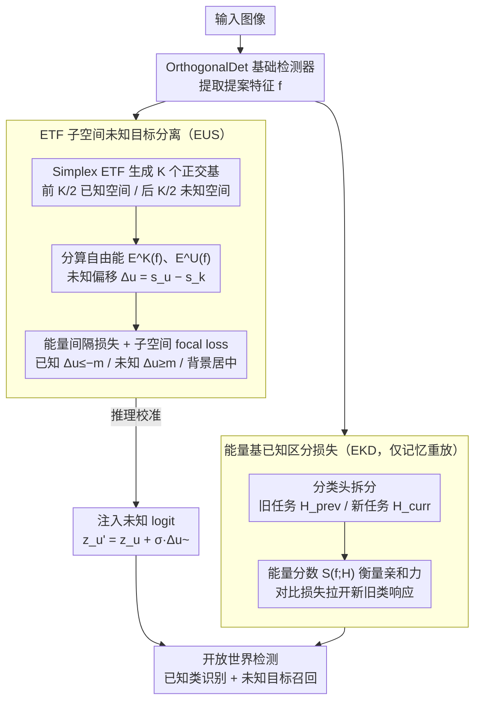

# Detecting Unknown Objects via Energy-Based Separation for Open World Object Detection

**会议**: CVPR 2026  
**arXiv**: [2603.29954](https://arxiv.org/abs/2603.29954)  
**代码**: 无  
**领域**: Object Detection  
**关键词**: 开放世界目标检测, 能量函数, 未知目标检测, 增量学习, 灾难性遗忘

## 一句话总结

提出 DEUS 框架，通过 ETF 子空间未知目标分离（EUS）在几何正交的已知/未知子空间中利用能量分数有效分离已知、未知和背景提案，并设计能量基已知区分损失（EKD）减少增量学习中新旧类的交叉干扰，在 OWOD 基准上大幅提升未知目标召回率。

## 研究背景与动机

开放世界目标检测（OWOD）是一个极具挑战性的设置，要求检测器：
1. **增量学习已知类**：不断扩展可识别类别
2. **检测未知目标**：在没有标注的情况下识别未见过的物体
3. **避免灾难性遗忘**：学习新类时不丢失旧类知识

现有 OWOD 方法存在两个核心问题：

**问题一：未知目标表示学习不足**
- 现有方法（包括能量方法）严重依赖检测器的**已知类预测**来检测未知目标
- 仅在已知空间建模能量，将非已知对象推离已知区域，但缺乏约束防止未知与背景混淆
- 结果：特征空间中已知、未知、背景三者纠缠，很多未知被遗漏或误分类

**问题二：记忆重放中新旧类交叉干扰**
- 记忆重放（memory replay）能缓解旧类遗忘，但缺乏显式正则化防止新旧类互相影响
- 随着任务增多、类别增加，交叉干扰更严重
- 结果：保持旧类知识和学习新类之间存在权衡

DEUS 的两个设计分别对应解决这两个问题。

## 方法详解

### 整体框架

以 OrthogonalDet 为基础检测器，在此之上添加两个模块：
- **EUS（ETF-Subspace Unknown Separation）**：构建正交的已知/未知子空间，引导提案特征分离
- **EKD（Energy-based Known Distinction）**：在记忆重放时分离新旧分类器的能量响应

两个模块共享同一份提案特征 $f$：EUS 在训练时做三类（已知/未知/背景）分离、在推理时把子空间偏移校准进检测器原有的未知 logit；EKD 只在增量任务的记忆重放阶段激活，用同一套能量语言把旧类和新类的分类器响应拉开。

### 关键设计

**1. ETF 子空间未知目标分离（EUS）：给未知目标一个专属表示空间，而不只是把它推离已知**

以往方法只在已知空间建能量、把非已知样本往外推，缺乏约束，结果未知和背景在特征空间里纠缠不清。EUS 改为显式造出两个几何正交的子空间：用 Simplex ETF（等角紧框架）生成 $K$ 个等角基向量，前 $K/2$ 个组成已知空间 $W_\mathcal{K}^E$、后 $K/2$ 个组成未知空间 $W_\mathcal{U}^E$（$K=128$），基向量固定不可学习，从而保证两空间正交。对每个提案特征 $f$ 分别算两个子空间的 Helmholtz 自由能：

$$E^\mathcal{K}(f) = -\log \sum_{i=1}^{K/2} \exp(W_{\mathcal{K},i}^E \cdot f)$$
$$E^\mathcal{U}(f) = -\log \sum_{i=1}^{K/2} \exp(W_{\mathcal{U},i}^E \cdot f)$$

再用未知偏移量 $\Delta_u(f) = s_u(f) - s_k(f)$（未知分数减已知分数）刻画归属，正值越大越像未知。训练时让已知提案满足 $\Delta_u \leq -m$、未知提案满足 $\Delta_u \geq m$、背景落在边界区域，靠一个能量间隔损失（对 $\Delta_u$ 的 margin loss）做主分离、再加子空间 focal loss 稳住训练。推理时把这套子空间信息校准进检测器已有的未知 logit：$z_u' = z_u + \sigma_{z_u} \tilde{\Delta}_u(f)$（$\tilde{\Delta}_u$ 为标准化后的偏移量），既补强未知判别又不改动原检测流水线。正交子空间让"未知"有了自己的几何位置，而不是已知空间的残差，这是召回率几乎翻倍的关键。

**2. 能量基已知区分损失（EKD）：在记忆重放时按能量把新旧类拉开**

记忆重放能缓解旧类遗忘，但缺少显式正则时新旧类会互相干扰、随任务增多越来越严重。EKD 把已知类分类头拆成旧任务子分类器 $H_{prev}$ 和新任务子分类器 $H_{curr}$，用能量分数 $S(f;H) = \log \sum_{c=1}^{C_H} \exp(z_c(f;H))$ 衡量某提案对某分类器的亲和力（越大越亲和），再用对比损失逼着旧类提案在旧分类器上高分、新分类器上低分，反之亦然：

$$\mathcal{L}_{prev} = \log(1 + \exp[S(f_{prev};H_{curr}) - S(f_{prev};H_{prev})])$$
$$\mathcal{L}_{curr} = \log(1 + \exp[S(f_{curr};H_{prev}) - S(f_{curr};H_{curr})])$$

它只在记忆重放阶段（增量任务训练时）激活，用同一套能量语言把"保旧"和"学新"分到两个分类器上，从而在不牺牲未知检测的前提下稳住已知类性能。

### 损失函数 / 训练策略

总损失：
$$\mathcal{L}_{total} = \mathcal{L}_{cls} + \mathcal{L}_{bbox} + \mathcal{L}_{EUS} + \mathcal{L}_{EKD}$$

- $\mathcal{L}_{cls}$：sigmoid focal loss
- $\mathcal{L}_{bbox}$：L1 + GIoU loss
- $\mathcal{L}_{EUS} = \mathcal{L}_{energy} + \mathcal{L}_{subspace}$（EUS 权重 1.0）
- $\mathcal{L}_{EKD}$（权重 1.0，仅在增量任务时启用）
- ETF 空间维度 $K=128$（已知/未知各 64 向量）
- 基于 MMDetection 实现
- 改进了伪标签策略：动态缩放伪标签数量并过滤噪声检测

## 实验关键数据

### 主实验

**M-OWODB 基准**：

| 方法 | T1 U-Rec | T1 H-Score | T2 U-Rec | T2 H-Score | T3 U-Rec | T3 H-Score | T4 Known mAP |
|------|---------|-----------|---------|-----------|---------|-----------|-------------|
| OrthogonalDet | 36.3 | 46.6 | 30.2 | 38.0 | 28.7 | 35.7 | 44.7 |
| O1O | 49.3 | 56.1 | 50.3 | 51.6 | 49.5 | 47.4 | 42.4 |
| **DEUS** | **65.1** | **65.6** | **66.2** | **59.0** | **69.0** | **58.0** | **46.0** |

**S-OWODB 基准**：

| 方法 | T1 U-Rec | T1 H-Score | T2 U-Rec | T3 U-Rec | T4 Known mAP |
|------|---------|-----------|---------|---------|-------------|
| OrthogonalDet | 24.6 | 36.6 | 27.9 | 31.9 | 46.2 |
| O1O | 49.8 | 59.1 | 51.1 | 48.1 | 45.9 |
| **DEUS** | **68.7** | **70.1** | **62.9** | **60.7** | **48.8** |

DEUS 的 U-Rec 几乎翻倍（如 M-OWODB T1: 36.3→65.1），同时维持竞争性已知 mAP。

**RS-OWODB（遥感数据）**：

| 方法 | T1 H-Score | T2 H-Score | T3 H-Score | T4 mAP |
|------|-----------|-----------|-----------|--------|
| OrthogonalDet | 34.8 | 15.6 | 16.2 | 64.2 |
| **DEUS** | **62.5** | **39.4** | **40.9** | **68.3** |

### 消融实验

| EUS | EKD | T1 U-Rec | T1 H-Score | T2 Known mAP | T3 H-Score | T4 Known mAP | 说明 |
|-----|-----|---------|-----------|-------------|-----------|-------------|------|
| ✗ | ✗ | 36.8 | 47.2 | 52.0 | 37.6 | 44.7 | Baseline |
| ✗ | ✓ | 36.8 | 47.2 | 52.6 | 43.9 | 45.9 | EKD 提升已知 |
| ✓ | ✗ | 65.1 | 65.6 | 51.9 | 57.5 | 43.5 | EUS 大幅提升U-Rec |
| ✓ | ✓ | **65.1** | **65.6** | **53.3** | **58.0** | **46.0** | 组合最优 |

### 关键发现

1. **EUS 是未知目标检测的关键**：U-Rec 从 36.8 跳至 65.1，几乎翻倍，证明双子空间建模远优于仅用已知空间
2. **EKD 独立提升已知类性能**：无论有无 EUS，EKD 都能一致提升各任务 mAP
3. **两者互补**：EUS 提升未知检测，EKD 保护已知性能，组合后 H-Score 全面最优
4. **开销极小**：推理时间增加仅 1.9%，FLOPs +0.5%，训练时间 +6.2%
5. **泛化到遥感**：RS-OWODB 上 H-Score 从 34.8 提升到 62.5，证明方法不限于自然图像
6. **PCA 可视化**清晰显示：baseline 中已知/未知/背景严重纠缠，DEUS 实现了清晰的三类分离

## 亮点与洞察

1. **双子空间能量建模**：首次在 OWOD 中显式建模未知目标的表示空间，而非仅从已知空间排除。ETF 保证正交性是关键——避免两个空间重叠
2. **能量函数的统一使用**：用能量函数既做已知/未知分离（EUS），又做新旧类区分（EKD），形成统一的能量框架
3. **ETF 的几何优势**：等角紧框架提供固定的、均匀分布的正交基向量，无需学习即保证空间分离
4. **校准推理**：将子空间偏移量注入已有 logit 的方式简洁高效，不影响检测流水线
5. **伪标签改进**：动态缩放+噪声过滤虽是辅助贡献，但对基线性能也有实际帮助

## 局限性 / 可改进方向

1. **已知与未知的语义重叠**：论文承认当已知和未知类别语义相近时分离仍有困难
2. **ETF 维度选择**：$K=128$ 是一个超参数，不同数据集可能需要调整
3. **EUS 可能略降已知 mAP**：消融显示 EUS 单独使用时 T4 Known mAP 从 44.7 降到 43.5，因更多提案被标为未知
4. **仅在 Faster R-CNN 体系验证**：是否适用于 DETR 系列开放世界检测器未知
5. **伪标签质量仍有提升空间**：当前依赖动态匹配器选择，可考虑引入自训练或一致性正则化

## 相关工作与启发

- **OrthogonalDet**：基础模型，通过正交化解耦 objectness 和分类预测
- **PROB (Zohar et al.)**：用正态分布建模类无关 objectness
- **Du et al. (Unknown-Aware OD)**：能量不确定性正则化，但仅在已知空间
- **Neural Collapse / ETF**：ETF 在分类中的几何特性被巧妙地用于构建分离子空间
- 启发：双子空间+能量的范式可推广到其他开放世界任务（如开放世界分割、开放世界跟踪）

## 评分

- 新颖性: ⭐⭐⭐⭐⭐ — ETF 双子空间+能量分离是全新设计，EKD 的新旧类能量区分也是创新点
- 实验充分度: ⭐⭐⭐⭐⭐ — 三个 benchmark（M-OWODB/S-OWODB/RS-OWODB），全面消融+分析+可视化
- 写作质量: ⭐⭐⭐⭐ — 动机和方法阐述清晰，但符号较多，需要仔细跟读
- 价值: ⭐⭐⭐⭐⭐ — OWOD 未知检测 U-Rec 接近翻倍是显著贡献，对开放世界学习有实际推动

<!-- RELATED:START -->

## 相关论文

- [\[CVPR 2026\] EW-DETR: Evolving World Object Detection via Incremental Low-Rank DEtection TRansformer](ew-detr_evolving_world_object_detection_via_incremental_low-rank_detection_trans.md)
- [\[CVPR 2026\] ElasticFormer: Detecting Objects in HRW Shots via Elastic Computing Vision Transformer](elasticformer_detecting_objects_in_hrw_shots_via_elastic_computing_vision_transf.md)
- [\[AAAI 2026\] CountVid: Open-World Object Counting in Videos](../../AAAI2026/object_detection/open-world_object_counting_in_videos.md)
- [\[CVPR 2026\] Anomaly as Non-Conformity via Training-Free Graph Laplacian Energy Minimization](anomaly_as_non-conformity_via_training-free_graph_laplacian_energy_minimization.md)
- [\[CVPR 2026\] WeDetect: Fast Open-Vocabulary Object Detection as Retrieval](wedetect_fast_open-vocabulary_object_detection_as_retrieval.md)

<!-- RELATED:END -->
