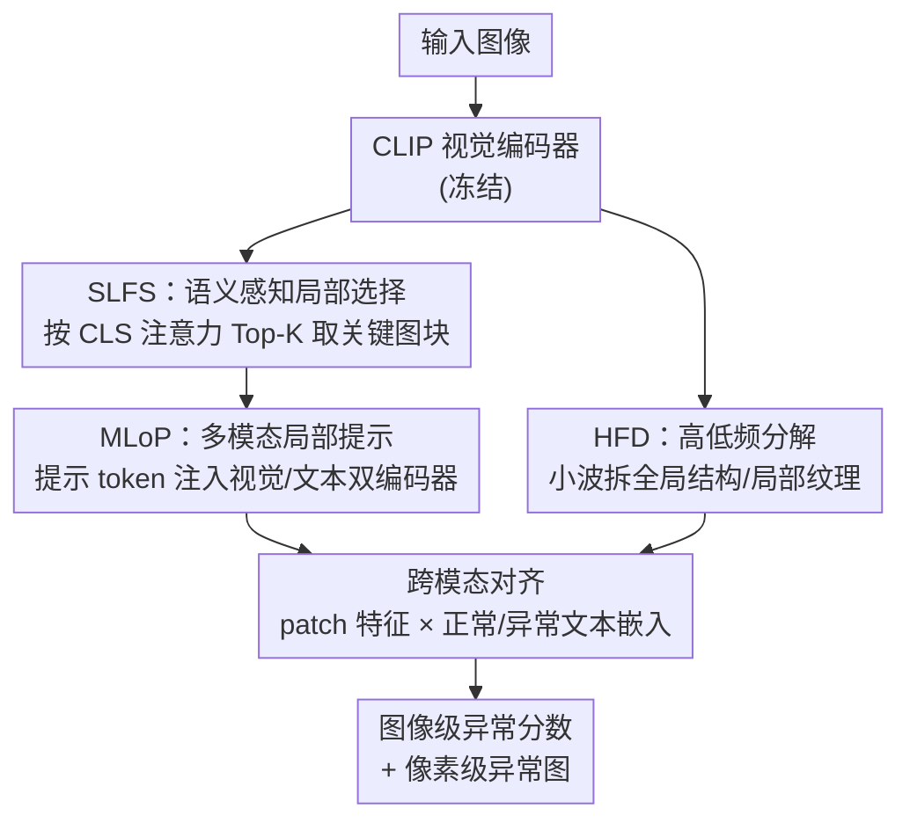

# DLVP-CLIP: Enhancing Fine-Grained Zero-Shot Anomaly Detection via Dynamic Local Visual Prompting

**会议**: CVPR 2026  
**论文**: [CVF Open Access](https://openaccess.thecvf.com/content/CVPR2026/html/Zhang_DLVP-CLIP_Enhancing_Fine-Grained_Zero-Shot_Anomaly_Detection_via_Dynamic_Local_Visual_CVPR_2026_paper.html)  
**代码**: 无  
**领域**: 零样本异常检测 / 多模态VLM  
**关键词**: 零样本异常检测, CLIP, 动态视觉提示, 局部特征, 小波频率分解  

## 一句话总结
针对 CLIP 只对全局语义敏感、抓不住局部细节这一与异常检测天然矛盾的痛点，DLVP-CLIP 用注意力图动态挑出图像里的关键局部块当作"视觉提示"注入视觉/文本双编码器，并用小波频率分解单独强化高频纹理，在 13 个工业+医学数据集上把零样本异常检测/分割推到新 SOTA。

## 研究背景与动机
**领域现状**：零样本异常检测（ZSAD）希望用辅助数据训练一个能直接泛化到未见类别的模型，在工业质检、医学诊断里价值很大。CLIP 凭借强大的零样本泛化能力成了主流底座——通过文本提示描述"正常/异常"，与图像特征对齐，无需逐类别训练。代表工作有 WinCLIP、AnomalyCLIP（object-agnostic 提示）、AdaCLIP / VCP-CLIP（把全局图像特征塞进文本提示）、TPS（双层文本提示）等。

**现有痛点**：CLIP 的预训练目标是图像与文本的**整体语义对齐**，这让它倾向于抽取物体级的全局语义，而对局部区域的细微视觉特征关注不足。可异常检测恰恰高度依赖对局部细节的精确捕捉——这是 CLIP 与异常检测之间一个**内在矛盾**。

**核心矛盾**：现有改进各走极端但都没解决局部感知。文本驱动派（AnomalyCLIP / AA-CLIP / TPS）靠预先设计的文本提示去"描述"局部，难以动态适配复杂多变的异常形态；视觉增强派（AdaCLIP / VCP-CLIP）往文本里注入全局 CLS 特征，反而进一步强化全局表示、削弱了对细微局部异常的刻画。两条路都没真正补上"局部感知不足"这个洞。

**本文目标**：让模型在保持零样本泛化的同时，显式地把图像里的**关键局部视觉线索**纳入跨模态对齐，并对抗 ViT 自注意力的"低通滤波"效应（它会把高频细纹理平滑掉）。

**切入角度**：CLS token 的注意力权重本质上编码了"每个图像区域对整体语义的贡献"——那高注意力的图块就是语义上的关键局部。与其费力设计文本去描述局部，不如**直接从图像里挑出这些关键局部块当提示**。

**核心 idea**：用**动态局部视觉提示**代替预定义文本提示来注入细粒度语义——SLFS 按 CLS 注意力挑关键图块、MLoP 把它们当 prompt 同时注入视觉与文本编码器做联合编码，HFD 再用小波分解单独强化高频纹理。

## 方法详解

### 整体框架
DLVP-CLIP 以冻结的 CLIP（ViT-L/14）为底座，整条 pipeline 串三步：先用 **SLFS** 从原始 CLIP 视觉编码器的 CLS 注意力图里挑出 K 个高注意力图块、取其特征作为"动态视觉提示 token"；再用 **MLoP** 把这些提示 token 注入视觉和文本编码器的 Transformer 层——在视觉侧引导模型聚焦关键局部细节，在文本侧把文本表征锚定到具体图像细节上；同时用 **HFD** 对中间视觉特征做小波分解，把全局结构（低频）与局部纹理（高频）拆开单独处理再融合。最终视觉 patch 特征与"正常/异常"文本嵌入对齐，同时输出图像级异常分数和像素级异常图。

### 关键设计

**1. 语义感知局部特征选择器 SLFS：让"哪里重要"由注意力自己说，而不是文本去猜**

痛点很直接：CLIP 在全局图文对齐层面优化，难以捕捉关键局部细节；AdaCLIP 那种把 CLS token 全局特征当提示的做法，注入的还是全局信息。SLFS 反其道而行——**显式注入局部视觉语义**。具体地，取视觉 Transformer 最后一层的注意力矩阵 $A \in \mathbb{R}^{(N+1)\times(N+1)}$，抽出 CLS token 对应的注意力向量 $A_{cls} \in \mathbb{R}^{N}$，其每个元素就是某个图块对整体语义的重要性分数。按分数选出 Top-K 个图块索引 $T = \{t_i \mid A_{cls}[t_i] \in \mathrm{Topk}(A_{cls}, K)\}_{i=1}^{K}$，再从视觉特征里取 $P = V[T] \in \mathbb{R}^{K\times C}$，这 K 个语义关键的局部特征就是后续提示学习的输入。注意力本来就是"全局语义贡献度"的天然打分器，拿它来定位关键局部，等于免费得到了一个无需额外学习的局部选择器；论文里 $K=4$ 最优（见消融），太大反而引入背景噪声。

**2. 多模态局部提示 MLoP：把同一组局部特征同时喂给视觉和文本，逼两个空间在细粒度上对齐**

只挑出局部还不够，得让文本空间也"知道"这些局部细节。MLoP 把局部视觉特征矩阵 $P$ 投影成提示 token $P' \in \mathbb{R}^{M\times C}$（$M \ll N$），双向注入：视觉编码器里，$P'$ 沿序列维拼到常规 token $T$ 后面，前 $J$ 层只前传不更新提示、$J$ 层之后让提示也随层演化：

$$[T_{j+1},\, \cdot] = L^P_j([T_j, P']),\ j \le J; \qquad [T_{j+1}, P'_{j+1}] = L^P_j([T_j, P']),\ j > J$$

文本侧则把 $P'$ 过一个投影层 $F_\theta$，再加上一个静态可学习向量 $E_j$ 得到文本提示 token $P^t_j = F_\theta(P') + E_j$，同样拼到文本 token $S_j$ 后注入文本 Transformer。这一手的关键在于"同源双注入"：视觉侧引导模型在抽特征时盯住关键局部，文本侧把文本表征**锚定到具体图像细节**而非泛泛的"object"，从而在跨模态特征空间里建立细粒度语义关联，缓解了预定义文本提示捕捉不到细粒度对应的毛病。

**3. 高低频分解 HFD：用小波把被 ViT 平滑掉的高频纹理单独捞回来**

ViT 的自注意力在全局聚合特征时相当于一个**低通滤波器**——它计算每个 patch 与所有 patch 的相似度再融合，会平滑掉高频信号（细纹理），强化低频的全局一致模式。可异常往往就表现为细微的局部纹理变化，正好被抹掉了。HFD 用离散小波变换（DWT）显式分解：对层 $i$ 的输入特征先线性投影成空间感知特征 $\tilde F^V_i = F_v(F^V_i)$，再拆成低频分量 $F^L_i = \mathrm{DWT}_{ll}(\tilde F^V_i)$（编码全局结构）和高频分量 $F^H_i = [\mathrm{DWT}_{lh}, \mathrm{DWT}_{hl}, \mathrm{DWT}_{hh}](\tilde F^V_i)$（编码边缘纹理等细节），各自线性处理后用逆变换重建 $F^D_i = \mathrm{IDWT}(F^L_i + F^H_i)$，最后残差回原特征 $F^o_i = F^V_i + F^D_i$。独立建模高频分支让那些本会被压制的细粒度异常线索得以保留；消融显示它优于只取梯度的 Sobel 滤波（DWT 做的是结构化多频带分解，高频表示更丰富）。

### 损失函数 / 训练策略
训练同时优化分类损失与分割损失：$L_{total} = L_{cls}(S_p, y) + \sum_{l=1}^{L} L^l_{seg}$。分类损失对图像级异常分数 $S_p$ 与真值 $y$ 用二元交叉熵；分割损失对像素级异常图 $M_i$ 与异常掩码 $S_{gt}$，组合 Dice 与 Focal：$L_{seg} = \mathrm{Dice}(M^a_l, S_{gt}) + \mathrm{Dice}(M^n_l, I-S_{gt}) + \mathrm{Focal}(M^a_l, S_{gt})$。图像级分数由全局 CLS 特征 $X_c$ 与多尺度局部特征经 GAP+线性压缩得到的 $X_p$ 融合（$X = X_p + X_c$）后与文本特征对齐 $S_p = \mathrm{Softmax}(\tilde X \tilde F_T)$。推理时取多层异常图均值 $M = \frac{1}{L}\sum_l (M^a_l + I - M^n_l)/2$。底座为 OpenCLIP ViT-L/14，输入 $518\times518$，取第 6/12/18/24 层 patch 嵌入，局部提示数 4、提示深度 9，Adam 学习率 $1.5\mathrm{e}{-4}$，单张 RTX 4090；遵循 AnomalyCLIP 在 MVTec-AD 上微调（测 MVTec 时改在 VisA 上微调，保证训练/测试类别不重叠）。

## 实验关键数据

### 主实验
13 个真实数据集：工业 6 个（MVTec-AD / VisA / BTAD / SDD2 / DAGM / DTD-Synthetic），医学 7 个（HeadCT / BrainMRI / Br35H / Endo / Kvasir / ISIC / RESC）。指标为图像级与像素级 AUROC。对比 5 个 SOTA。

图像级 AUROC（部分数据集，Ours vs 上一代 SOTA Bayes-PFL）：

| 数据集 | 类型 | WinCLIP | AnomalyCLIP | AdaCLIP | TPS | Bayes-PFL | 本文 |
|--------|------|---------|-------------|---------|-----|-----------|------|
| MVTec-AD | 工业 | 91.8 | 91.5 | 91.1 | 90.1 | 92.3 | **94.2** |
| VisA | 工业 | 78.1 | 82.1 | 84.5 | 83.3 | 87.0 | **87.9** |
| BTAD | 工业 | 68.2 | 88.3 | 90.5 | 88.1 | 90.5 | **92.6** |
| DAGM | 纹理 | 91.8 | 97.5 | 97.1 | 97.0 | 98.9 | **99.3** |
| DTD-Synthetic | 纹理 | 93.2 | 93.5 | 94.7 | 93.4 | 95.1 | **96.8** |
| Br35H | 脑 | 80.5 | 94.6 | 95.6 | 96.2 | 94.0 | **98.1** |
| BrainMRI | 脑 | 86.6 | 90.3 | 96.0 | 92.4 | 91.2 | **96.2** |

像素级 AUROC 上同样整体领先（如 DAGM 96.8、DTD-Synthetic 98.9、ISIC 92.1、RESC 95.7），少数数据集（MVTec-AD 像素级 90.4 略低于 Bayes-PFL 91.8）非全面最优，但在纹理缺陷和医学病灶这类细粒度场景优势明显。

### 消融实验

| 配置 | MVTec I-AUROC | MVTec P-AUROC | VisA I-AUROC | VisA P-AUROC | 说明 |
|------|------|------|------|------|------|
| w/o SLFS & MLoP | 89.5 | 89.0 | 84.2 | 95.0 | 去掉整个 DLVP |
| + SLFS only | 91.0 | 89.3 | 86.3 | 95.2 | 只挑局部 |
| + MLoP only | 90.4 | 89.6 | 85.1 | 95.1 | 只双向注入 |
| + SLFS & MLoP (无HFD) | 92.8 | 89.5 | 85.8 | 95.3 | DLVP 完整 |
| Full (DLVP + HFD) | **94.2** | **90.4** | **87.9** | **95.7** | 完整模型 |

补充消融：SLFS（87.9/95.7）优于直接用 Global token（85.6/95.6）；HFD（87.9/95.7）优于 Sobel 高频提取（86.7/95.2）。Top-K 消融见下表，K=4 最优。

| Top-K | MVTec I-AUROC | VisA I-AUROC |
|-------|------|------|
| 1 | 92.1 | 84.5 |
| 2 | 92.4 | 85.7 |
| 3 | 92.9 | 86.7 |
| **4** | **94.2** | **87.9** |
| 5 | 92.7 | 85.7 |

### 关键发现
- **SLFS 与 MLoP 是互补而非冗余**：单加任一模块都只小涨（MVTec I-AUROC 89.5→91.0/90.4），两者合用才跳到 92.8——SLFS 提供局部语义"原料"，MLoP 才能把它和文本空间动态耦合，缺一不可。
- **Top-K 存在甜点**：K 从 1 增到 4 单调上升（覆盖更多与异常强相关的局部），K=5 反而回落（低注意力区开始引入背景噪声/正常纹理），说明"挑多了不如挑准"。
- **结构化频率分解 > 简单边缘算子**：HFD 用 DWT 做多频带分解，高频表示比 Sobel 的单一梯度响应更丰富，这是它在细微异常上更强的原因。

## 亮点与洞察
- **把"注意力图"重新用作局部定位器**：CLS 注意力本是全局语义贡献度，作者直接拿它的 Top-K 当关键局部选择器，零额外学习成本就完成了"哪里重要"的判断——这个复用思路可迁移到任何需要无监督定位关键区域的 CLIP 下游任务。
- **同源双注入打破"文本描述局部"的死循环**：以往要么靠文本硬描述局部、要么靠全局视觉特征污染文本，DLVP 把同一组真实局部特征同时注入视觉和文本两侧，让对齐发生在细粒度层面，逻辑上比"用语言转述像素"更直接。
- **直面 ViT 低通本质**：明确指出自注意力是低通滤波、会平滑高频细纹理，再用小波高频分支补偿——这种"先诊断架构缺陷再对症补丁"的写法很有说服力，HFD 也是可即插即用的通用细节增强模块。

## 局限与展望
- **依赖 CLS 注意力质量**：SLFS 的关键局部完全由 CLS 注意力图决定，若注意力本身偏向背景或被低对比度医学图误导，Top-K 选区会失准，论文未讨论注意力失效时的兜底。
- **Top-K 是固定超参**：每张图都取固定 K=4 个局部块，但不同图像/不同异常的关键区域数量天然不同，固定 K 可能在简单图上冗余、复杂图上不足，未来可做自适应 K。
- **像素级并非全面领先**：MVTec-AD 像素级 AUROC（90.4）仍落后 Bayes-PFL（91.8），说明在某些已被充分研究的工业基准上，纯文本分布建模仍有竞争力；本方法的优势更集中在跨域纹理/医学细粒度场景。
- **训练/微调设置略绕**：测 MVTec 时改在 VisA 微调、反之亦然，虽为保证类别不重叠，但也使"真零样本"的成色依赖具体数据划分。

## 相关工作与启发
- **vs AnomalyCLIP**：它用 object-agnostic 的静态文本提示做域迁移，本文认为静态提示难适配跨域异常形态；DLVP 改用从图像动态抽取的局部视觉提示，让提示随输入变化，在医学数据上优势尤其明显。
- **vs AdaCLIP / VCP-CLIP**：它们把**全局** CLS 特征注入文本提示来增强类别语义，本文指出这会进一步强化全局表示、削弱局部异常刻画；DLVP 注入的是**局部** Top-K 特征，方向相反。
- **vs FE-CLIP**：同样引入频率信息，但 FE-CLIP 用双适配器注入频率，HFD 则用 DWT 显式分解高/低频并独立建模高频分支，定位更聚焦于"找回被 ViT 平滑掉的高频纹理"。
- **vs MaPLe / PromptSRC**：这些通用提示学习也做双模态联合调节，但提示是可学习的静态向量；DLVP 的提示来自每张图的真实局部特征，是输入依赖的动态提示。

## 评分
- 新颖性: ⭐⭐⭐⭐ 把 CLS 注意力复用为局部选择器 + 同源双向注入 + 小波高频补偿，组合清晰且针对 CLIP 局部短板对症下药。
- 实验充分度: ⭐⭐⭐⭐⭐ 13 个工业+医学数据集、图像/像素双指标、SLFS/MLoP/HFD/Top-K 多组消融齐全。
- 写作质量: ⭐⭐⭐⭐ 动机推导（CLIP 全局 vs 异常局部的矛盾）讲得透，方法公式完整。
- 价值: ⭐⭐⭐⭐ ZSAD 在工业质检/医学诊断落地价值高，HFD 与注意力选区思路可复用。

<!-- RELATED:START -->

## 相关论文

- [\[CVPR 2026\] FB-CLIP: Fine-Grained Zero-Shot Anomaly Detection with Foreground-Background Disentanglement](fb-clip_fine-grained_zero-shot_anomaly_detection_with_foreground-background_dise.md)
- [\[CVPR 2026\] MoECLIP: Patch-Specialized Experts for Zero-shot Anomaly Detection](moeclip_patch-specialized_experts_for_zero-shot_anomaly_detection.md)
- [\[CVPR 2025\] AA-CLIP: Enhancing Zero-Shot Anomaly Detection via Anomaly-Aware CLIP](../../CVPR2025/object_detection/aa-clip_enhancing_zero-shot_anomaly_detection_via_anomaly-aware_clip.md)
- [\[CVPR 2026\] GS-CLIP: Zero-shot 3D Anomaly Detection by Geometry-Aware Prompt and Synergistic View Representation Learning](gs-clip_zero-shot_3d_anomaly_detection_by_geometry-aware_prompt_and_synergistic_.md)
- [\[ICML 2025\] FG-CLIP: Fine-Grained Visual and Textual Alignment](../../ICML2025/object_detection/fg-clip_fine-grained_visual_and_textual_alignment.md)

<!-- RELATED:END -->
