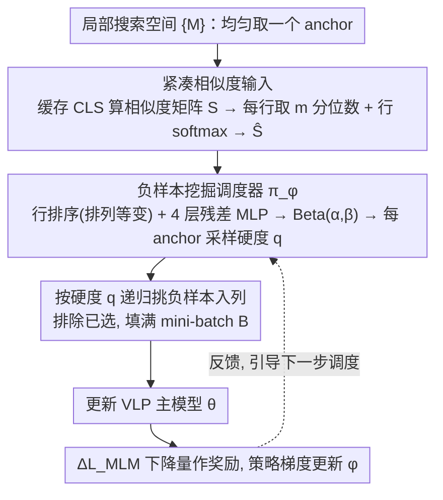

# FALCON: False-Negative Aware Learning of Contrastive Negatives in Vision-Language Alignment

**会议**: CVPR2026  
**arXiv**: [2505.11192](https://arxiv.org/abs/2505.11192)  
**代码**: 待确认  
**领域**: 目标检测 / 视觉语言预训练  
**关键词**: 假负样本, 对比学习, 视觉语言预训练, 负样本挖掘, mini-batch构造, 调度器

## 一句话总结

提出 FALCON，一种**基于学习的 mini-batch 构造策略**，通过负样本挖掘调度器自适应平衡硬负样本与假负样本之间的权衡，显著提升视觉语言预训练的跨模态对齐质量。

## 研究背景与动机

**假负样本是VLP的核心挑战**：大规模网络爬取数据集中图文存在多对多对应关系，对比学习中高相似度的"负样本"很可能其实是真正匹配的正样本（假负样本），引入矛盾监督信号。

**硬负样本挖掘的两难困境**：选择与anchor高度相似的负样本能加速学习，但相似度越高，假负样本风险越大；选择低相似度负样本则信息量不足。

**最优相似度范围是动态的**：不同anchor的语义复杂度不同，简单anchor的正样本分布紧凑，可安全挖掘更硬的负样本；复杂anchor的嵌入噪声大，需要更保守的挖掘策略。这一最优范围随训练进程不断变化。

**预训练模型辅助并非万能**：MAFA等方法用固定预训练模型的ITM分数过滤假负样本，但对复杂语义对存在低分误判问题（即使语义匹配也给低ITM分数），固定阈值要么过于保守要么不足。

**启发式调度策略缺乏灵活性**：固定硬度（如GRIT-VLP的q=1.0）或渐进式课程策略（Progressive-Hardening/Softening）无法捕捉实例级、训练阶段级的动态变化。

**现有方法依赖超参数且泛化性受限**：两阶段选负样本+过滤框架对阈值高度敏感，假负样本率最高可达60%。

## 方法详解

### 整体框架

FALCON 想解决的是对比式视觉语言预训练里一个老大难：挖硬负样本能加速对齐，但越硬越容易挖到"其实是匹配的"假负样本，反而注入矛盾监督。它的做法是把"该挖多硬"从人工启发式（固定分位数、课程式退火）变成一个可学习的决策——训练一个轻量的**负样本挖掘调度器** $\pi_\phi$，让它读当前 batch 的相似度分布、现场为每个 anchor 决定挖掘硬度。

整体沿用 GRIT-VLP 的分组思想，把数据集切成若干局部搜索空间 $\{M\}$。构造一个 mini-batch 时：先从某个 $M$ 里均匀取一个 anchor；调度器读入当前归一化相似度分布 $\widehat{\mathbf{S}}$、输出一个硬度分位数 $q\in[0,1]$（$q=1.0$ 退化为 GRIT-VLP 的"最硬"，$q=0.0$ 取最简单负样本）；按这个 $q$ 从候选池取对应相似度档位的样本入列，每步排除已选样本，递归到 batch 填满 $B$。之后用这个 batch 更新 VLP 主模型 $\theta$，并把更新前后 MLM 损失的下降量当作奖励、用策略梯度更新调度器 $\phi$，让下一步调度更准——整条链路因此构成一个闭环。

### 关键设计

**1. 可学习的硬度调度器：把"挖多硬"交给优化而不是启发式**

最优挖掘硬度其实是实例相关、且随训练漂移的——简单 anchor 的正样本分布紧凑、能安全地挖更硬的负样本，复杂 anchor 噪声大、得保守。固定 $q$ 或预设课程都抓不住这种动态。FALCON 用一个轻量的 4 层残差 MLP 把相似度分布映射成 Beta 分布参数 $(\alpha,\beta)$，再从 Beta 分布采样得到硬度分位数 $q$。Beta 分布天然落在 $[0,1]$、能表达从保守到激进的连续偏好，采样形式也让后面的策略梯度可用。

**2. 紧凑的相似度输入与行级归一化：抹掉尺度漂移、且零额外开销**

调度器不能直接吞整个相似度矩阵——太大，而且数值尺度随训练一直在变。FALCON 把 I2T、T2I 的余弦相似度矩阵相加得到统一矩阵 $\mathbf{S}$（直接复用已有的 CLS 嵌入队列来算，不需要额外前向传播），每行只取 $m$ 个均匀间隔的分位数（$m \ll |M|$）做压缩表示，再对每行做 softmax 归一化得到 $\widehat{\mathbf{S}}$。这样无论训练到哪一步、相似度整体被拉大还是压缩，调度器看到的都只是分布形状而非绝对数值。配合调度器本身只是个小 MLP，整套机制的计算开销可以忽略，不会成为训练瓶颈。

**3. 排列等变 + 实例级调度：每个 anchor 各调各的**

batch 内样本顺序不该影响决策，但用 Transformer 实现等变又太重。FALCON 在送入 MLP 前先对 $\widehat{\mathbf{S}}$ 的行排序，用极轻的方式拿到排列等变性。同时硬度是为每个 anchor 单独预测的，而非整 batch 共享一个阈值——消融显示实例级（TR R@1 61.72）明显优于 batch 级（58.78），印证了最优硬度确实是 anchor-dependent 的。

### 损失函数 / 训练策略

调度器的奖励信号选的是 **MLM 损失的下降量**，作为"跨模态对齐是否改善"的代理。策略梯度更新写作

$$\phi_{k+1} = \phi_k + \gamma \cdot \mathbb{E}_{\pi_{\phi_k}}\left[\Delta_k^{V,T} \cdot \nabla_{\phi_k} \log \pi_{\phi_k}(V,T|\widehat{\mathbf{S}})\right]$$

其中 $\Delta_k^{V,T} = \mathcal{L}_{\text{MLM}}(V,T;\theta_k) - \mathcal{L}_{\text{MLM}}(V,T;\theta_{k+1})$ 是这一步更新带来的 MLM 损失改善。为什么不用 ITC/ITM 而用 MLM？因为对比目标会诱导调度器去挖 trivial 负样本来"作弊"地最小化损失，反而损害对齐；生成式的 MLM 不吃这一套，消融里只用 $\mathcal{L}_\text{MLM}$（TR R@1 61.72）显著好于含对比项的组合（57.64 / 57.80）。

## 实验

### 主实验：与启发式负样本挖掘方法对比（MSCOCO预训练）

| 方法 | TR R@1 | TR R@5 | IR R@1 | IR R@5 | VQA test-dev | NLVR2 dev |
|------|--------|--------|--------|--------|-------------|-----------|
| ALBEF | 55.60 | 81.92 | 41.16 | 70.63 | 70.46 | 72.98 |
| GRIT-VLP | 60.60 | 83.52 | 44.61 | 69.54 | 71.04 | 74.63 |
| MAFA | 60.96 | 83.24 | 44.77 | 69.49 | 71.13 | 75.16 |
| **FALCON** | **62.28** | **86.18** | **46.18** | **74.65** | **71.24** | **75.17** |

### 跨框架兼容性（BLIP-2 & SigLIP-2）

| 框架 | 基线 COCO TR R@1 | +FALCON TR R@1 | 基线 COCO IR R@1 | +FALCON IR R@1 |
|------|------------------|----------------|------------------|----------------|
| BLIP-2 | 75.22 | **75.56** | 57.98 | **58.52** |
| SigLIP-2 | 69.96 | **72.96** | 54.21 | 54.15 |

### 消融实验关键发现

**搜索空间大小影响**：

- |M|=480 → TR R@1: 58.48；|M|=5664 → 61.72；|M|=28320 → 61.94
- FALCON对大搜索空间鲁棒，而基线方法（如GRIT-VLP）因假负样本增多而退化

**训练目标选择**：

- 仅 $\mathcal{L}_\text{MLM}$：TR R@1 = 61.72（最佳）
- $\mathcal{L}_\text{ITC}+\mathcal{L}_\text{ITM}$：TR R@1 = 57.64（显著下降）
- $\mathcal{L}_\text{ITC}+\mathcal{L}_\text{ITM}+\mathcal{L}_\text{MLM}$：TR R@1 = 57.80
- 结论：对比目标会诱导调度器选择trivial负样本，生成目标（MLM）作为代理更合理

**调度粒度**：

- 实例级调度（61.72）远优于Batch级（58.78），证实最优硬度是anchor-dependent的，统一阈值不足以覆盖不同语义复杂度的样本

### 训练动态与泛化

- **自适应调度行为**：训练早期FALCON倾向采样高分位数（硬负样本）加速嵌入学习；随嵌入空间成熟、假负样本在高分位聚集，调度器自动降低分位数规避假负样本风险
- **4M标准数据集**：在包含CC、SBU等web噪声数据的4M设置上也取得最佳性能（COCO zero-shot TR R@1: 74.1 vs MAFA 72.6 vs ALBEF 68.7）
- **收敛效率**：收敛时间为ALBEF的0.83C，略高于GRIT-VLP(0.65C)和MAFA(0.76C)，但性能-时间曲线（Recall@1 vs wall-clock）始终优于所有基线
- **对搜索空间鲁棒**：FALCON在|M|从480扩大到28320时性能稳步提升后趋于稳定，而GRIT-VLP在大搜索空间下因假负样本增多而性能退化

## 亮点

- **首个学习型负样本调度方法**：将硬/假负样本权衡从手动启发式提升为可学习优化问题，是对比学习中负样本管理的新范式
- **设计精巧且高效**：4层残差 MLP + Beta分布参数化 + 行排序实现等变性，调度器计算开销极小，不成为训练瓶颈
- **理论动机清晰**：用 MLM 损失下降作为跨模态对齐代理，通过实验验证对比目标会诱导 trivial 负样本陷阱，设计选择有充分理据
- **广泛适用性**：在ALBEF、BLIP-2、SigLIP-2三种不同架构（融合型/Q-Former/双塔型）上均有效，证明方法的通用性
- **详尽的可视化分析**：提供了调度器行为随训练变化的可视化、分位数采样示例、相似度分布演变图等，直观展示自适应机制

## 局限性

- SigLIP-2上文本端改善有限（IR R@1几乎无提升），因辅助生成损失仅经过视觉编码器，调度信号偏向视觉侧
- 在噪声严重的web数据集上增益减小（相比干净MSCOCO的增益更小），语义不对齐的原始caption干扰硬度估计
- 调度器需要额外前向传播和更新，每epoch训练成本略高于GRIT-VLP和MAFA（0.83C vs 0.65C/0.76C）
- 依赖缓存的CLS嵌入构建相似度矩阵，嵌入的滞后性可能影响早期训练精度
- 代理信号需要与两个模态编码器都有关联才能充分发挥作用，纯视觉侧或纯文本侧的生成目标效果受限
- 当前仅在检索、VQA、NLVR等任务上验证，尚未在更广泛的下游任务（如visual grounding、图像生成）上测试

## 相关工作

- **硬负样本挖掘**：GRIT-VLP（q=1.0固定最硬挖掘，搜索空间分组策略）、DiHT（去偏对比学习）、SRCL（自正则化对比学习）
- **假负样本处理**：MAFA（预训练模型ITM阈值过滤+重标签）、FFF（修复对比预训练的缺陷基础）、VL-Match（token级和实例级匹配增强）
- **学习优化/元学习**：Learning to learn by gradient descent、Neural optimizer search（用RL搜索优化器）
- **视觉语言预训练**：ALBEF（动量蒸馏+ITC/ITM/MLM）、BLIP系列（统一理解与生成）、SigLIP-2（sigmoid对比+生成目标）、CLIP/ALIGN（大规模对比预训练）

## 评分

- 新颖性: ⭐⭐⭐⭐ — 首次将负样本硬度调度建模为可学习优化问题，Beta分布参数化和MLM代理信号设计新颖
- 实验充分度: ⭐⭐⭐⭐⭐ — 三种VLP框架、多种下游任务、详尽消融、训练动态可视化、wall-clock对比
- 写作质量: ⭐⭐⭐⭐ — 动机论证充分（图2的假负样本率分析很有说服力），公式推导完整，图表清晰
- 价值: ⭐⭐⭐⭐ — 方法通用、即插即用，假负样本问题在大规模VLP中普遍存在，实用性强

<!-- RELATED:START -->

## 相关论文

- [\[CVPR 2026\] Saliency-R1: Enforcing Interpretable and Faithful Vision-language Reasoning via Saliency-map Alignment Reward](saliency-r1_enforcing_interpretable_and_faithful_vision-language_reasoning_via_s.md)
- [\[CVPR 2026\] CrossVL: Complexity-Aware Feature Routing and Paired Curriculum for Cross-View Vision-Language Detection](crossvl_complexity-aware_feature_routing_and_paired_curriculum_for_cross-view_vi.md)
- [\[CVPR 2026\] DA-Mamba: Learning Domain-Aware State Space Model for Global-Local Alignment in Domain Adaptive Object Detection](da-mamba_learning_domain-aware_state_space_model_for_global-local_alignment_in_d.md)
- [\[ICML 2025\] Causality-Aware Contrastive Learning for Robust Multivariate Time-Series Anomaly Detection](../../ICML2025/object_detection/causality-aware_contrastive_learning_for_robust_multivariate_time-series_anomaly.md)
- [\[AAAI 2026\] MovSemCL: Movement-Semantics Contrastive Learning for Trajectory Similarity (Extension)](../../AAAI2026/object_detection/movsemcl_movement-semantics_contrastive_learning_for_trajectory_similarity_exten.md)

<!-- RELATED:END -->
