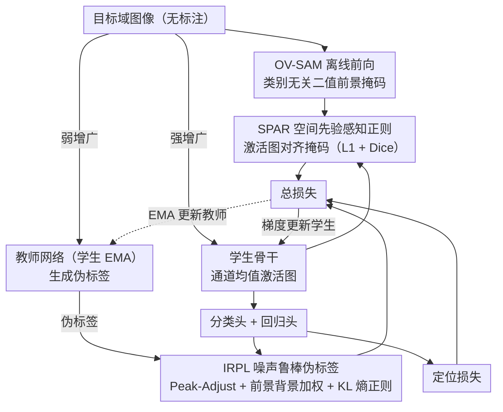

# Foundation Model Priors Enhance Object Focus in Feature Space for Source-Free Object Detection

**会议**: CVPR2026  
**arXiv**: [2512.17514](https://arxiv.org/abs/2512.17514)  
**代码**: 待确认  
**领域**: 目标检测  
**关键词**: 无源域自适应目标检测, 基础模型先验, 特征空间正则化, 噪声鲁棒伪标签, Mean-Teacher

## 一句话总结

提出 FALCON-SFOD 框架，通过基础模型（OV-SAM）生成的类别无关二值掩码正则化检测器特征空间（SPAR），结合不平衡感知的噪声鲁棒伪标签损失（IRPL），在无源域目标检测中增强目标聚焦表征，多个基准上达到 SOTA。

## 背景与动机

1. **无源域目标检测 (SFOD)** 要求将源域训练的检测器适配到无标注目标域，且适配时不可访问源数据，在自动驾驶、监控等场景极具实用价值
2. **主流方法的局限**：当前 SOTA 方法（IRG、PETS、Simple-SFOD、DRU）均采用 Mean-Teacher 自标注框架，但主要聚焦于**伪标签筛选/精炼**，忽视了特征层面的根本问题
3. **域偏移削弱目标聚焦**：作者发现域偏移导致检测器特征激活从前景目标扩散到背景杂波区域，使通道均值激活图变得空间弥散，目标边界模糊——这是伪标签质量差的**根因**
4. **特征层面的问题被忽视**：现有工作几乎未关注如何从特征空间层面增强结构化、以目标为中心的表征
5. **基础模型的潜力**：大规模视觉基础模型（如 DINOv2、SAM）具有强跨域泛化能力，但在线使用计算开销大（如 DINO Teacher 需在线对齐）
6. **前景-背景严重不平衡**：检测中正样本稀少、背景区域丰富，加上教师网络产生的类标签噪声，使训练极不稳定

## 方法详解

### 整体框架

FALCON-SFOD 想解决无源域检测里一个被忽视的根因：域偏移让检测器的特征激活从前景目标扩散到背景，目标边界变糊，伪标签自然就差。它在标准 Mean-Teacher 自标注框架上挂两个互补模块——**SPAR**（空间先验感知正则化）从特征层面把激活"收"回目标上，**IRPL**（不平衡感知噪声鲁棒伪标签）从损失层面对抗类不平衡和教师标签噪声——再配常规定位损失端到端训练。两个模块一个治特征、一个治标签，恰好对应理论分析里检测风险的不同来源。

### 关键设计

**1. SPAR：借基础模型的离线掩码把特征激活拉回目标**

域偏移下学生网络的特征激活弥散到背景，是伪标签质量差的根因，但在线用 DINO/SAM 对齐又太贵。SPAR 把基础模型的成本挪到离线：先用冻结的 OV-SAM 对每张目标域图像做一次前向，得到类别无关的二值前景掩码 $A_G$（丢掉类别信息，任何分割区域记 1、其余 0）。训练时取学生骨干最后一层特征的通道均值 $A_S$，resize 后用 **L1 + Dice** 损失逼它对齐 $A_G$：

$$\mathcal{L}_{\text{SPAR}} = \frac{\lambda_1}{H'W'}\sum_{j,k}|A_S[j,k] - A_G[j,k]| + \lambda_2 \cdot \text{DiceLoss}(A_S, A_G)$$

基础模型只在预处理跑一次，训练和推理零额外开销（超参 $\lambda_1=1, \lambda_2=2$）。从理论看，SPAR 清理了特征激活，直接压低检测风险上界里的定位偏差 $\eta_{\text{reg}}$ 和漏检率 $\zeta$。

**2. IRPL：用噪声鲁棒损失对冲教师标签错误和前景-背景失衡**

检测里正样本稀少、背景泛滥，叠加教师网络的类标签噪声，训练极不稳定。IRPL 三招齐下：**Peak-Adjust 变换**对学生预测概率 $\mathbf{p}$ 的峰值加 margin $m$ 后归一化——教师-学生一致（$\hat{c}=t$）时梯度被 $p_{\hat{c}}/(p_{\hat{c}}+m) \ll 1$ 压缩，相当于内置软早停、防止过拟合已对的标签；不一致（$\hat{c} \neq t$）时梯度保持标准 CE，完整保留对错误教师标签的修正信号。再用**前景-背景加权** $w_{\hat{c}}$ 缓解正负样本失衡，用 **KL 散度熵正则**把所有 proposal 的平均类别分布拉向均匀分布、压制头部类主导：

$$\mathcal{L}_{\text{IRPL}} = \sum_{(\hat{b},\hat{c})} w_{\hat{c}}[\alpha(-\log p'_{\hat{c}}) + \beta(1-p_{\hat{c}})] + \gamma D_{\text{KL}}(\bar{\mathbf{p}} \| \mathcal{U}_K)$$

理论上，标准 Mean-Teacher 的风险上界含一个分类项 $1/\lambda$ 的乘性膨胀（Theorem 1），IRPL 把它换成加性项 $2\delta + 2w\delta/a$（Theorem 2），当 $\delta \to 0$ 时可任意紧、严格更紧——这正是它对长尾低频类提升明显的原因。

## 实验关键数据

### 主实验（4 个域偏移场景）

| 场景 | 方法 | mAP/AP |
|------|------|--------|
| Cityscapes→Foggy (C→F) | Simple-SFOD | 45.0 |
| C→F | DRU | 43.7 |
| **C→F** | **FALCON-SFOD** | **46.9 (+1.9)** |
| Sim10k→Cityscapes (S→C) | Simple-SFOD | 55.4 |
| **S→C** | **FALCON-SFOD** | **58.8 (+3.4)** |
| KITTI→Cityscapes (K→C) | DRU | 45.1 |
| **K→C** | **FALCON-SFOD** | **50.1 (+5.0)** |
| Cityscapes→BDD100k | Simple-SFOD | 34.3 |
| **C→BDD100k** | **FALCON-SFOD** | **36.9 (+2.6)** |

### 极端域偏移实验

| 场景 | Baseline | FALCON-SFOD | Δ |
|------|----------|-------------|---|
| PascalVOC→Clipart (艺术风格) | 33.6 | 35.5 | +1.9 |
| FLIR Visible→Infrared (热红外) | 56.7 | 58.5 | +1.8 |
| FLIR Infrared→COCO (热到RGB) | 19.4 | 20.9 | +1.5 |

### 消融实验

| 组件 | C→F mAP | S→C AP |
|------|---------|--------|
| Baseline | 45.0 | 55.4 |
| + SPAR | 46.1 | 57.5 |
| + IRPL | 45.8 | 56.8 |
| + SPAR + IRPL (完整) | **46.9** | **58.8** |

**长尾类别分析**：改进集中在低频类（train +4.1, truck +4.0, bus +2.9），Pearson 相关 $r_\Delta = -0.90$，头部类无退化。

**掩码来源消融**：OV-SAM > ESC-Net > GSAM > Source maps，验证更强基础模型带来更好空间先验。

## 亮点

- **问题洞察独到**：首次识别并论证 SFOD 中特征空间的目标聚焦退化问题，从特征层面而非伪标签层面切入
- **设计轻量优雅**：基础模型仅离线使用一次，训练和推理零额外开销
- **理论支撑扎实**：提供完整的检测风险分解与上界分析，SPAR 和 IRPL 各自对应理论中的具体项
- **长尾友好**：IRPL 显著提升低频类性能（train/truck/bus），不损害头部类

## 局限与展望

- 对 OVSAM 掩码质量有依赖，若基础模型在极端域（如热红外）分割不佳，SPAR 效果可能打折
- 分类精度提升相对有限（person/car 类 AP 几乎不变），主要收益来自稀有类
- 仅在 Faster R-CNN 系列（单阶段 YOLO 仅有 SF-YOLO 对比）上验证，未扩展到 DETR 等 Transformer 检测器
- 理论分析中 transition matrix $T$ 的对角下界 $\lambda>0$ 假设在极端域偏移下可能不成立
- 端到端适配阶段仍需调多个超参（$\lambda_1, \lambda_2, \alpha, \beta, \gamma, m$），敏感性分析仅在补充材料
- SPAR 的 L1+Dice 组合虽简单有效，但未探索更精细的区域级对齐或多尺度特征正则
- BDD100k 上 mAP 仅 36.9%，与 UDAOD 方法 MTM (37.3%) 仍有差距，说明无源设定的天花板仍存在

## 与相关工作的对比

| 方法 | 核心策略 | 是否关注特征空间 | 是否用基础模型 | C→F mAP |
|------|---------|:---:|:---:|:---:|
| IRG (CVPR'23) | 实例关系图精炼伪标签 | ✗ | ✗ | 37.1 |
| PETS (ICCV'23) | 周期性教师-学生交换 | ✗ | ✗ | 35.9 |
| Simple-SFOD (ECCV'24) | 精心设计的自训练 | ✗ | ✗ | 45.0 |
| DRU (ECCV'24) | 动态重训更新教师 | ✗ | ✗ | 43.7 |
| DINO Teacher (UDAOD) | 在线 DINO 特征对齐 | ✓ | ✓(在线) | — |
| **FALCON-SFOD** | 离线掩码正则+噪声鲁棒损失 | **✓** | **✓(离线)** | **46.9** |

## 评分

- 新颖性: ⭐⭐⭐⭐ — 首次将特征空间目标聚焦与基础模型先验引入 SFOD，切入角度新颖
- 实验充分度: ⭐⭐⭐⭐ — 4+域偏移场景、极端域实验、完整消融，长尾分析有说服力
- 写作质量: ⭐⭐⭐⭐ — 理论+实验结构清晰，动机图（Fig.1）直观有力
- 价值: ⭐⭐⭐⭐ — 对 SFOD 社区有实际推动，离线先验思路可广泛迁移

<!-- RELATED:START -->

## 相关论文

- [\[AAAI 2026\] Beyond Boundaries: Leveraging Vision Foundation Models for Source-Free Object Detection](../../AAAI2026/object_detection/beyond_boundaries_leveraging_vision_foundation_models_for_so.md)
- [\[CVPR 2026\] DA-Mamba: Learning Domain-Aware State Space Model for Global-Local Alignment in Domain Adaptive Object Detection](da-mamba_learning_domain-aware_state_space_model_for_global-local_alignment_in_d.md)
- [\[NeurIPS 2025\] Test-Time Adaptive Object Detection with Foundation Model](../../NeurIPS2025/object_detection/test-time_adaptive_object_detection_with_foundation_model.md)
- [\[ICCV 2025\] SFUOD: Source-Free Unknown Object Detection](../../ICCV2025/object_detection/sfuod_source-free_unknown_object_detection.md)
- [\[ICLR 2026\] CGSA: Class-Guided Slot-Aware Adaptation for Source-Free Object Detection](../../ICLR2026/object_detection/cgsa_class-guided_slot-aware_adaptation_for_source-free_object_detection.md)

<!-- RELATED:END -->
