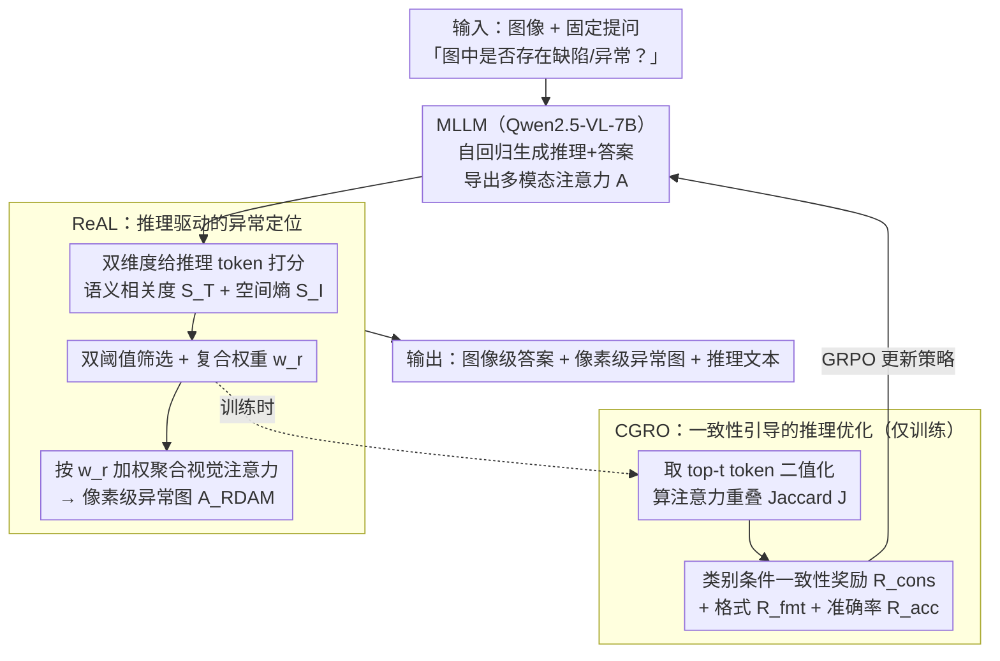

# Reasoning-Driven Anomaly Detection and Localization with Image-Level Supervision

**会议**: CVPR 2026  
**arXiv**: [2603.27179](https://arxiv.org/abs/2603.27179)  
**代码**: [GitHub](https://github.com/YizhouJin313/ReADL)  
**领域**:目标检测  
**关键词**: 异常检测与定位, 推理驱动, 图像级监督, MLLM注意力, 强化学习

## 一句话总结

提出 ReAL 和 CGRO 两个模块，通过提取 MLLM 自回归推理过程中的异常相关 token 并聚合其视觉注意力来生成像素级异常图，再通过一致性引导的强化学习对齐推理与视觉证据，实现仅凭图像级监督的端到端异常检测、定位与可解释推理。

## 研究背景与动机

工业异常检测面临多重挑战：
- **传统方法局限**：需要大量正常样本训练产品特定模型，部署成本高，跨产品线泛化能力差
- **MLLM 现有方案**：多数方法仅能做图像级检测和文本推理，像素级定位仍依赖外部视觉模块（如 AnomalyGPT 用预训练视觉专家，EIAD 用 SAM），导致误差传播、推理-定位不对齐、部署复杂度增加
- **端到端方案（如 OmniAD）**的问题：依赖稠密像素级标注和高质量推理标注，获取代价高且引入领域偏差

核心观察（Fig. 1）：在 MLLM 生成推理文本时，**仅有少量 token 的注意力聚焦于真实异常区域**，且这些 token 往往与异常相关语义（如"scratch"、"mark"）关联。大多数推理 token 的注意力分散或聚焦无关区域，会稀释定位精度。

## 方法详解

### 整体框架

给定图像 $\mathbf{X}_v$ 和固定文本提问（"Are there any defects or anomalies in the image?"），单个 MLLM 自回归生成「推理过程 + 最终答案」的输出序列，同时导出贯穿视觉 / 文本 / 输出 token 的多模态注意力矩阵 $\mathbf{A}$。整套系统的定位能力完全从这个注意力里「读」出来——不外挂任何视觉专家或 SAM，训练也只用图像级标签（正常 / 异常）这种最廉价的标注，从而避免了误差传播、推理-定位错位和部署复杂度。围绕这条主线有两个核心模块：

- **ReAL（推理驱动的异常定位）**：推理阶段就在跑，从一串推理 token 里筛出真正盯着异常看的那几个，把它们的视觉注意力加权聚合成像素级异常图 $\mathbf{A}_{\text{RDAM}}$；
- **CGRO（一致性引导的推理优化）**：仅训练阶段介入，用「推理-定位一致性」奖励驱动强化学习，把「模型说的」和「模型看的」对齐，再通过 GRPO 把梯度回灌 MLLM。

### 关键设计

**1. ReAL（推理驱动的异常定位）：从一堆推理 token 里挑出真正盯着异常看的那几个**

核心观察是 MLLM 生成推理文本时，只有少量 token 的注意力真正聚焦在异常区域，大多数 token 注意力分散、会稀释定位精度。ReAL 从两个互补维度给每个推理 token 打分：跨模态语义相关度 $S_T^r$ 是该 token 对输入文本里异常相关词（"defect"/"anomaly"/"abnormal"）的注意力权重之和，衡量它语义上跟异常概念多相关；模态内注意力集中度 $S_I^r$ 是把视觉注意力图二值化后提连通分量、算空间熵——低熵说明注意力聚在某块区域（可能是异常），高熵说明注意力散了。两维度经双阈值筛选（$\hat{S}_T^r > \tau_t$ 且 $\hat{S}_I^r > \tau_i$）保留候选 token，再用复合权重 $w_r = \alpha\hat{S}_T^r + \beta\hat{S}_I^r$ 加权聚合它们的视觉注意力图 $\mathbf{A}_{r,I}$，得到推理驱动的异常图 $\mathbf{A}_{\text{RDAM}}$。这样像素级定位完全从模型内部注意力里「读」出来，不需要外部分割模块。

**2. CGRO（一致性引导的推理优化）：让「说的」和「看的」对齐**

有限监督下 MLLM 常出现推理不一致——回答「存在异常」但推理文本却把图像描述成正常，注意力也跟着乱。CGRO 复用 ReAL 算出的权重 $w_r$，取 top-$t$ 推理 token，把每个 token 注意力图按 95 分位阈值二值化得到支撑区域 $\Omega_r$，再用 Jaccard Index 度量这些区域的空间重叠 $\mathcal{J}$。在此之上设计类别条件一致性奖励 $R_{\text{cons}}$：对异常图像（$y=1$）鼓励高一致性（$\mathcal{J} > \delta_1$）以促成对缺陷的集中定位，对正常图像（$y=0$）鼓励低一致性（$\mathcal{J} < \delta_2$）以压住在良性区域的虚假聚焦。它和格式奖励、准确率奖励一起组成总奖励 $\mathcal{R}_{\text{total}} = \mathcal{R}_{\text{fmt}} + \mathcal{R}_{\text{acc}} + \mathcal{R}_{\text{cons}}$，通过 GRPO（采样一组响应、按归一化优势更新策略）优化，把推理质量和视觉证据绑在一起训练，使模型学会自我约束推理过程。

### 损失函数 / 训练策略

- 基于 Qwen2.5-VL-7B，LoRA 适配语言和跨模态层，视觉编码器冻结
- 训练数据：4K 工业图像（来自 VisA、GoodsAD、Vision、PR-REAL 等），仅图像级标注
- 每批 16 样本，每输入采样 8 个候选生成（GRPO）
- 图像统一缩放至 420×420
- 零样本评估（训练集与测试集无领域重叠）

## 实验关键数据

### 主实验

四个基准平均（MVTec-AD、WFDD、SDD、DTD），图像级 AUROC/ACC：

| 方法 | 参数量 | 监督类型 | 图像级 AVG(AUROC,ACC) | 像素级 AVG(AUROC,ACC) | 推理(ROUGE-L,SBERT) |
|------|--------|----------|----------------------|---------------------|---------------------|
| GPT-4.1 | — | — | 87.2, 88.4 | N/A | 20.8, 69.9 |
| Qwen2.5-VL+CGRO* | 7B | I | **83.9, 86.9** | **80.7, 97.1** | **27.1, 74.7** |
| Qwen2.5-VL+R1* | 7B | I | 80.0, 82.0 | 78.5, 96.7 | 26.3, 73.8 |
| AnomalyGPT | 7B | T+I+P | 71.1, 53.9 | 77.8, 98.4 | 11.9, 36.7 |
| Triad | 7B | T+I | 85.5, 83.8 | N/A | 8.6, 35.9 |

亮点：仅用图像级监督即达到与使用像素级密集标注的 AnomalyGPT 可比的定位性能。

### 消融实验

ReAL + CGRO 消融（Qwen2.5-VL-7B，四数据集平均）：

| 配置 | 图像级 AUROC | 像素级 AUROC | 像素级 ACC |
|------|-------------|-------------|-----------|
| Vanilla | 63.4 | 64.7 | 73.0 |
| Vanilla + ReAL | 63.4 | 61.7 | 85.6 |
| Vanilla + CGRO | 83.9 | 72.7 | 92.6 |
| **Full (ReAL+CGRO)** | **83.9** | **80.7** | **97.1** |

token 选择策略消融（像素级）：
- 仅 $S_I$: AUROC 74.1
- 仅 $S_T$: AUROC 76.7
- $S_T + S_I$（完整）: AUROC **80.7**

### 关键发现

- ReAL 和 CGRO 具有互补作用：CGRO 提升图像级检测（+20.5 AUROC），ReAL 提升像素级定位精度（+8.0 AUROC）
- 一致性奖励消除了推理-回答矛盾：不加 CGRO 时模型常"判异常但推理说正常"，注意力分散
- 从 3B 到 7B 参量模型，CGRO 增益一致（图像级 +15-20 AUROC）
- 推理质量和定位精度的提升相辅相成

## 亮点与洞察

- **核心洞察深刻**：发现 MLLM 推理过程中天然存在异常感知的注意力模式，只需正确地筛选和利用（而非引入外部模块）
- **监督效率极高**：仅用图像级标签（最廉价的标注）即达到像素级密集标注方法的可比性能
- **三维度统一**：一个模型同时完成检测、定位、可解释推理，无需外部模块
- **一致性奖励设计精巧**：通过 Jaccard Index 的类别条件约束，将推理质量和空间聚焦对齐

## 局限与展望

- 定位精度仍有提升空间（像素级 AUPR 13.3%，远低于专用分割方法）
- 推理 token 筛选依赖阈值超参数 $\tau_t, \tau_i$，不同产品可能需要调整
- 训练数据为其他公开 AD 数据集图像，可能引入域偏差
- GRPO 训练成本较高（每输入 8 个候选生成）
- 注意力机制的解释性虽强，但对复杂多缺陷场景的表现未知

## 相关工作与启发

- **与 LISA 对比**：LISA 用 [SEG] token + SAM 做推理分割，本文完全去掉外部分割模块
- **GRPO/R1 范式**：延续 DeepSeek-R1 的强化学习推理优化路线，但创新引入一致性奖励
- **与 OmniAD 对比**：OmniAD 需要密集标注做端到端，本文仅需图像级标注
- **启发**：注意力聚合策略可推广到其他需要 MLLM 空间定位的任务（如 referring segmentation、visual grounding）

## 评分

- **新颖性**: ⭐⭐⭐⭐⭐ — 激活 MLLM 内在推理潜能实现像素级定位的思路极具创新性，一致性奖励设计自然优雅
- **实验充分度**: ⭐⭐⭐⭐⭐ — 四个基准、多种 MLLM 对比（含 GPT-4 系列）、详细消融，说服力强
- **写作质量**: ⭐⭐⭐⭐ — 动机阐述清晰，但公式符号较多需要仔细跟踪
- **价值**: ⭐⭐⭐⭐⭐ — 显著降低工业异常检测的标注成本，为 MLLM 在工业质检中的应用打开新路径

<!-- RELATED:START -->

## 相关论文

- [\[ICCV 2025\] VisRL: Intention-Driven Visual Perception via Reinforced Reasoning](../../ICCV2025/object_detection/visrl_intention-driven_visual_perception_via_reinforced_reasoning.md)
- [\[CVPR 2026\] Online Data Curation for Object Detection via Marginal Contributions to Dataset-level Average Precision](online_data_curation_for_object_detection_via_marginal_contributions_to_dataset-.md)
- [\[CVPR 2026\] Spike-driven Discrete Aggregation for Event-based Object Detection](spike-driven_discrete_aggregation_for_event-based_object_detection.md)
- [\[CVPR 2026\] Black-Box Domain Adaptation for Object Detection with Retention-Driven Knowledge Compression](black-box_domain_adaptation_for_object_detection_with_retention-driven_knowledge.md)
- [\[CVPR 2026\] UniMMAD: Unified Multi-Modal and Multi-Class Anomaly Detection via MoE-Driven Feature Decompression](unimmad_unified_multi-modal_and_multi-class_anomaly_detection_via_moe-driven_fea.md)

<!-- RELATED:END -->
