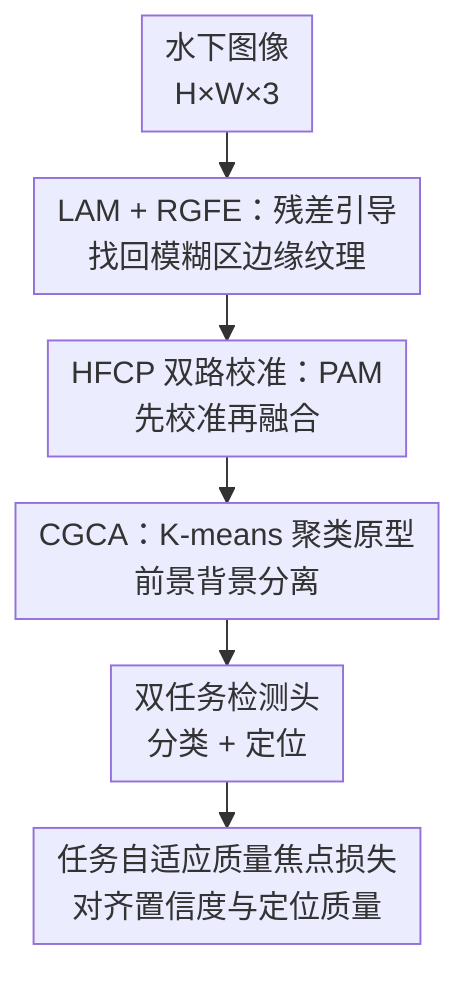

# RHCNet: Residual-Guided Hierarchical Calibration Network for Robust Underwater Object Detection

**会议**: CVPR 2026  
**论文**: [CVF Open Access](https://openaccess.thecvf.com/content/CVPR2026/html/Wang_RHCNet_Residual-Guided_Hierarchical_Calibration_Network_for_Robust_Underwater_Object_Detection_CVPR_2026_paper.html)  
**代码**: https://github.com/YitengGuo/RHCNet  
**领域**: 目标检测 / 水下视觉  
**关键词**: 水下目标检测、残差引导、特征校准、聚类原型、质量焦点损失

## 一句话总结
针对水下图像"前景背景难分、结构细节丢失、对比度低"三大顽疾，本文在 ResNet-50 上嵌入残差引导增强模块（RGFE）找回模糊区的边缘纹理，再用分层特征校准金字塔（HFCP）以"先校准再融合"的方式做跨尺度对齐，并用 K-means 聚类原型把前景从混乱背景里抠出来，最终在 DUO / UTDAC 两个水下基准上把 AP 刷到 70.53% / 53.35%，全面超过此前最好方法。

## 研究背景与动机
**领域现状**：水下目标检测（UOD）目前主流是把陆地检测器（Faster R-CNN、FCOS、YOLO 系列）直接搬到水下，靠卷积特征编码局部纹理来捕捉边缘和轮廓，近年又叠加多分支特征融合、注意力增强、自适应调整等机制来提性能。

**现有痛点**：水下成像里，光的散射相当于一个物理低通滤波器，把高频信息（边缘、纹理）压没了，导致目标边界模糊、结构细节缺失；同时前景目标和背景在颜色、纹理、光照分布上高度相似，检测器很难在训练中聚焦到真正的目标区域——作者直接点名 Faster R-CNN 的 ROI Pooling 特征里混进了大量背景，造成"语义错位"。而通用注意力（CBAM、SE）靠的是隐式特征重加权，在这种严重结构退化下基本失效。

**核心矛盾**：作者把水下检测的难点归纳成三条：(1) 对模糊目标区缺少**显式的结构建模**；(2) 在强烈前景背景干扰下**难以做到语义聚焦**；(3) 多尺度特征传递时存在**对齐偏差**，阻碍跨尺度融合。而过去的提升大多靠"堆网络复杂度"，恰恰忽略了特征聚焦和语义一致性建模这两件根本的事。

**本文目标**：不靠堆结构，而是把"特征聚焦 → 语义校准 → 尺度对齐"做成一个三级协同机制，系统性地缓解边界模糊、语义错位、结构不均三个问题。

**切入角度**：作者把模糊看成"信号退化"问题——既然散射滤掉了高频，那就把浅层保留的高频结构线索**主动注入回**深层语义特征里去补偿；同时在融合前先做语义对齐，而不是像 FPN/BiFPN 那样假设特征已经空间对齐再直接相加。

**核心 idea**：用"残差引导"恢复结构，用"分层校准（先校准再融合 + 聚类原型）"保证语义一致和跨尺度对齐。

## 方法详解

### 整体框架
RHCNet 是一个端到端的单阶段检测器，整体仍是 Backbone → Neck → Head 三段式，但在 Backbone 和 Neck 上各做了一次关键改造。输入一张水下图像 $\in \mathbb{R}^{H\times W\times 3}$，先过改造后的 ResNet-50：在 backbone 的若干 stage 嵌入 **Location-Aware Module（LAM）** 提供早期位置先验，并嵌入 **RGFE** 把浅层高频结构线索注入深层语义特征，输出多尺度特征 $F_1{\sim}F_5$。这些特征送进 **HFCP**——它不直接做多尺度相加，而是先用 **PAM（Position-Aware Module）** 走"自底向上语义增强 + 自顶向下细粒度补偿"的双路校准，再用 **CGCA（Cluster-Guided Calibrated Attention，K-means 聚类引导校准）** 做语义过滤，把前景从背景里分离出来。校准后的多尺度特征喂给**双任务检测头**（采用 AutoAssign 式标签分配）同时做分类和定位，训练用任务自适应质量焦点损失 + GIoU 监督。

### 关键设计

**1. LAM + RGFE：用残差注入找回模糊区的边缘纹理**

针对痛点(1)——模糊区缺少结构建模。作者把水下模糊看成散射造成的高频丢失，于是在"信号恢复"的范式下设计 RGFE，思路是把浅层保留的高频结构线索主动注入深层语义流来补偿边界模糊。具体三步：先用 **Semantic Convolution Transform（SCT）** $H_{SCT}(\cdot)$ 当高频提取器，用深度可分离卷积显式捕获局部梯度异常（即边缘线索）、再用逐点卷积做跨通道映射，得到结构先验 $F_{SCT} = W_{pw}\circledast\sigma(W_{dw}\circledast F)$，其中 $\sigma$ 是 ReLU；接着 $F_{SCT}$ 进入**双路修正单元**，用通道注意力 $A_c$ 和空间注意力 $A_s$ 做**动态信号调制**（而非静态选择）以防背景噪声被放大，得到残差特征 $F_{RGFE} = \Phi\big(F_{SCT} \,\|\, (A_c(F_{SCT})\otimes A_s(F_{SCT})\otimes F)\big)$，$\|$ 是通道拼接、$\otimes$ 是逐元素乘；最后通过残差校准把恢复出的结构注回语义流：

$$F_{RF} = H_{SCT}\big(D_{\downarrow s}(F)\big) \oplus \lambda\cdot H_{RGFE}\big(U_{\uparrow s}(D_{\downarrow s}(F))\big),$$

其中 $D_{\downarrow s}$/$U_{\uparrow s}$ 是尺度因子 $s$ 的下/上采样，$\oplus$ 是逐元素相加，$\lambda$ 是**可学习的强度系数**，动态更新以稳定梯度流、抵消水下模糊效应。LAM 则在更早阶段提供位置先验，和 RGFE 配合增强局部对比与纹理感知。和 CBAM/SE 那种隐式重加权的区别在于：RGFE 是显式地"提取高频 → 注意力净化 → 残差注回"，所以在严重结构退化下仍能补回边界。

**2. HFCP 双路校准：先校准再融合的金字塔**

针对痛点(3)——多尺度对齐偏差。标准金字塔 FPN/BiFPN 假设各层特征空间已对齐再直接求和，但水下的折射和散射破坏了这个假设，造成边界模糊、空间抖动，直接相加会带来语义错位和前景污染。HFCP 改成 **calibrate-then-fuse（先校准再融合）** 范式，采用双路框架：**自底向上语义增强路**集成通道分支和多尺度分支，逐层累积全局语义、强化跨层一致性；**自顶向下细粒度补偿路**通过 **PAM** 用一个空间分支处理前景遮挡和空间错位——水下遮挡常把低层目标特征打碎，PAM 就用保留了全局目标上下文的高层语义当"结构模板"，通过级联多维注意力把全局上下文向下投影，补全碎裂的响应并和全局语义原型对齐。三条分支融合写成：

$$F_{PA} = G\Big(\underbrace{\text{Sigmoid}(W_2\cdot\text{ReLU}(W_1\cdot\text{GAP}(F_{RF})))\odot F_{RF}}_{\text{通道分支}\uparrow} \oplus \underbrace{\textstyle\sum_{i=1}^{3}\beta_i\cdot\text{Conv}_{k_i}(F_{RF})}_{\text{多尺度分支}\uparrow} \oplus \underbrace{\text{SPC}(F_{RF})\odot F_{RF}}_{\text{空间分支}\downarrow}\Big),$$

其中 $k_i$ 是感受野、$\beta_i$ 是可学习尺度权重、SPC 在空间维度建模。这样自底向上和自顶向下两路协同，保证融合后的特征在强干扰下仍结构连贯。

**3. CGCA：K-means 聚类原型把前景从背景里"抠"出来**

针对痛点(2)——前景背景干扰下难以语义聚焦。经过 PAM 空间校正后的 $F_{PA}$ 还要做一次语义过滤。标准 non-local 块算的是像素到像素的亲和度，既贵又对噪声敏感；CGCA 换成 **K-means 聚类抽语义原型（即聚类中心）**：按全局上下文把像素特征分到 $K$ 个簇，显式地把前景目标从混乱背景里分开。原型 $\mu_k = \frac{1}{|c_k|}\sum_{F_{PA}\in c_k} F_{PA}$；再算每个像素 $p_i$ 和各原型 $v_k$ 的点积 $p_i^T v_k$ 当语义相似度，过 Softmax 得权重并加权求和所有原型，得到注意力增强特征：

$$\alpha_{i,k} = \frac{\exp(p_i^T v_k)}{\sum_{j=1}^{K}\exp(p_i^T v_j)},\qquad F_{att} = \sum_{k=1}^{K}\alpha_{i,k}\cdot v_k.$$

关键是设 **$K=2$**，把特征解耦成前景原型和背景原型两类。实现上 K-means 在 detached（断开梯度）的特征上做实例级聚类以绕开不可微的硬分配，再用聚类统计量经可学习权重调制生成可微注意力图，保证端到端训练。和静态注意力相比，聚类是按内容相似度对齐而非空间邻近，所以更能适应环境变化引起的动态语义漂移、并压住高响应背景噪声。

**4. 任务自适应质量焦点损失：让分类置信度对齐定位质量**

针对常见的"分类置信度和定位质量不一致"问题（IoU/Dice 损失对边缘模糊和目标位移不敏感）。总损失 $L_{total} = \lambda_{cls}L_{cls} + \lambda_{reg}L_{reg}$，$\lambda_{cls}{=}1$、$\lambda_{reg}{=}2$。分类用**连续质量标签**代替离散二值标签，质量标签由预测 IoU 和 centerness 的几何加权构成 $\hat{y}_i = \text{IoU}_i^{\rho}\cdot\text{Centerness}_i^{1-\rho}$（$\rho{=}0.5$），逼网络优先关照和 GT 几何重叠更高的样本；分类损失带一个聚焦因子 $|\hat{y}_i - p_i|^{\gamma}$ 动态压低易样本权重、聚焦到困难的错位样本（$\gamma$ 只控制聚焦强度，不当分类权重）；回归用 GIoU 损失 $L_{reg} = \frac{1}{N_{pos}}\sum_i L_{GIoU}(B_i^{pred}, B_i^{gt})$。该设计灵感来自 GFL/ATSS 的质量感知公式，但定制了软标签构造来处理水下的模糊性，从而抑制背景干扰造成的低质量误检。

### 损失函数 / 训练策略
训练用 MMDetection 框架，ResNet-50 backbone，共 35 个 epoch，初始学习率 0.001，在第 27、32 epoch 做两段阶梯衰减；优化器为 SGD（momentum 0.9，weight decay 0.0001）。硬件为单张 RTX 4070 SUPER。损失即上文的任务自适应质量焦点损失 + GIoU（$\lambda_{cls}{=}1,\lambda_{reg}{=}2$）。

## 实验关键数据

### 主实验
在 DUO（7,782 张）和 UTDAC（5,643 张）两个水下基准上，所有通用检测器统一用 ResNet-50 backbone 重训以保证公平。RHCNet 在两个数据集的全部 6 项指标上都拿第一：

| 数据集 | 方法 | AP | AP50 | AP75 | APS | APM | APL |
|--------|------|----|----|----|----|----|----|
| DUO | CIDNet (KBS'25) | 68.83 | 86.56 | 75.78 | 56.52 | 70.63 | 67.34 |
| DUO | RTMD-R (TITS'25) | 68.23 | 86.38 | 75.69 | 55.40 | 70.48 | 67.23 |
| DUO | **RHCNet (本文)** | **70.53** | **87.56** | **77.29** | **56.63** | **71.70** | **69.94** |
| UTDAC | YOLOv11 (2024) | 49.75 | 85.58 | 54.96 | 23.53 | 45.84 | 56.23 |
| UTDAC | CIDNet (KBS'25) | 49.57 | 85.38 | 54.53 | 23.11 | 45.74 | 56.08 |
| UTDAC | **RHCNet (本文)** | **53.35** | **86.93** | **58.97** | **27.23** | **48.90** | **59.29** |

DUO 上 AP 比此前最好的 CIDNet 高 1.7 个点；UTDAC（背景干扰更强、类内变化更大的"极端环境"）上 AP 领先更明显（53.35 vs 49.75，+3.6 点），且小目标 APS 从 ~23 跳到 27.23。RHCNet 参数 70.04M、FLOPs 145.16G，比 CIDNet（82.50M / 324.48G）更省。

### 跨场景泛化（COCO）
为验证在非水下自然场景的泛化性，在 COCO（118,287 张，80 类）上评测，RHCNet 同样取得最高 AP：

| 方法 | Backbone | AP | AP50 | AP75 | APS |
|------|----------|----|----|----|----|
| YOLOv11 (2024) | C3K2 | 44.18 | 62.43 | 47.78 | 27.44 |
| RTMD-R (TITS'25) | CSPNeXt | 43.27 | 61.72 | 47.57 | 27.03 |
| SqNet (NC'25) | ResNet-50 | 43.16 | 61.99 | 47.23 | 26.82 |
| **RHCNet (本文)** | ResNet-50 | **45.68** | **63.51** | **49.36** | **28.33** |

说明残差引导 + 分层校准的设计不是只针对水下"过拟合"，在陆地通用检测上也能涨点。

### 消融实验
在 DUO 上用同样训练设置做消融（Table 2，分两部分）：

| 组别 | 配置 | AP | AP50 | 说明 |
|------|------|----|----|------|
| Part I | Baseline (RetinaNet, R-50+FPN) | 57.06 | 78.33 | 起点 |
| Part I | 换更强 backbone (R-101, 全模块) | 70.03 | 87.29 | 堆 backbone 收益有限（< 完整 R-50 模型） |
| Part I | 换通用 neck (BiFPN) | 66.45 | 84.20 | 不如 HFCP，验证"先校准"必要 |
| Part I | CGCA 换成 vanilla self-attention | 68.12 | 85.64 | 聚类机制比自注意力更抗水下噪声 |
| Part II | w/o LAM | 66.45 | 84.46 | 掉 4.08，局部对比受损 |
| Part II | w/o RGFE | 66.90 | 84.42 | 掉 3.63，纹理感知受损 |
| Part II | w/o LAM & RGFE | 65.26 | 83.83 | 掉 5.27，二者联合贡献 |
| Part II | w/o PAM | 66.74 | 84.27 | 掉 3.79，对齐受损 |
| Part II | w/o CGCA | 65.86 | 83.81 | 掉 4.67，融合稳定性受损 |
| Part II | w/o PAM & CGCA | 65.24 | 82.34 | 掉 5.29，跌幅最大 |
| Part II | **RHCNet (完整)** | **70.53** | **87.56** | 四个模块互补 |

### 关键发现
- **结构设计比堆 backbone 更值**：把 backbone 从 R-50 换到 R-101（且带全部模块）只到 70.03，反而略低于完整 R-50 版的 70.53，说明性能来自校准设计而非参数量。
- **HFCP 的"先校准"是关键**：通用 BiFPN 只有 66.45，比 HFCP 低 4 个点，印证了水下场景必须先做语义对齐再融合。
- **CGCA 与 PAM 的组合最关键**：同时去掉 PAM+CGCA 跌幅最大（-5.29），且单独去 CGCA（-4.67）比去 PAM（-3.79）掉得更多，聚类原型分离前景背景是涨点主力；CGCA 换成 vanilla self-attention 也会掉到 68.12，证明聚类比像素级自注意力更抗噪。
- **RGFE+LAM 联合补结构**：分别去掉各掉 3~4 点，一起去掉 -5.27，二者在恢复边缘纹理上是互补的。

## 亮点与洞察
- **把"水下模糊"重新表述为信号恢复问题**：散射 = 物理低通滤波器，这个视角直接导出"显式提高频 + 残差注回深层"的 RGFE，比通用注意力的隐式重加权更对症——是一个可迁移到任何"高频丢失"退化任务（如去雾、低光）的思路。
- **K=2 聚类原型当前景/背景分离器很巧**：用 K-means 抽两个语义原型替代昂贵的 non-local 像素亲和度，既省算又抗噪，而且"按内容相似度对齐而非空间邻近"恰好对治水下前景背景同色同纹理的根本难题。
- **detached 特征上做聚类绕开不可微**：K-means 硬分配本不可微，作者在断梯度特征上聚类、再用聚类统计量经可学习权重生成可微注意力图，是个干净的端到端工程解法。
- **"先校准再融合"是对 FPN 假设的一次正面修正**：明确指出 FPN/BiFPN 假设空间已对齐，而水下折射散射破坏了这个前提，因此在融合前插入 PAM 空间校正 + CGCA 语义过滤，这个"calibrate-then-fuse"范式可推广到任何特征本就空间错位的场景。

## 局限与展望
- **作者承认的局限**：不同水况（如浊度差异）之间仍存在固有的 domain gap，跨水况泛化是未来挑战。
- **依赖固定 backbone 与单卡规模**：实验都在 ResNet-50 + 单张 RTX 4070 上做，35 epoch，未报告更大模型/更长训练下的表现，也未给推理 FPS（虽然 FLOPs 比 CIDNet 低）。
- **CGCA 固定 $K=2$**：前景/背景二分对多类密集场景或多实例重叠是否够用、$K$ 增大是否有增益，论文未消融。⚠️ 以原文为准。
- **超参敏感性未充分披露**：$\rho{=}0.5$、$\lambda$ 可学习系数、$\lambda_{reg}{=}2$ 等设置未给敏感性曲线，复现时可能需要调参。

## 相关工作与启发
- **vs FPN / PANet / BiFPN**：它们靠 top-down 或更精细的双向路径提融合效率，但都在"特征已空间对齐"的假设下直接聚合，忽略跨层结构对齐；RHCNet 用 HFCP 先校准（PAM 空间 + CGCA 语义）再融合，专门处理水下的空间抖动与语义漂移。
- **vs CBAM / SE 等通用注意力**：它们靠隐式特征重加权，在严重结构退化下失效；RGFE 用"显式提高频 + 双路注意力净化 + 残差注回"显式补结构。
- **vs GFL / ATSS（质量感知损失）**：本文损失受其启发，但定制了软标签构造（IoU 与 centerness 的几何加权）来专门应对水下模糊，更强调对错位困难样本的聚焦。
- **vs 早期水下增强/去雾预处理**：那类方法常破坏结构一致性、对检测精度提升有限；RHCNet 直接在检测网络内部做结构恢复与语义校准，端到端优化。

## 评分
- 新颖性: ⭐⭐⭐⭐ 把模糊建模为信号恢复、用 K=2 聚类原型分离前景背景、先校准再融合，组合有新意，但都是已有思想的水下定制化。
- 实验充分度: ⭐⭐⭐⭐ DUO/UTDAC/COCO 三数据集 + 详尽两部分消融，对比方法多达 16+；缺推理速度与 K 值消融。
- 写作质量: ⭐⭐⭐⭐ 动机—方法—公式链条清晰，三大痛点对应三大设计，可读性好。
- 价值: ⭐⭐⭐⭐ 在水下检测上刷新 SOTA 且开源、参数 FLOPs 更省，对该子领域有直接实用价值。

<!-- RELATED:START -->

## 相关论文

- [\[CVPR 2026\] CHAL: Causal-guided Hierarchical Anomaly-aware Learning for Moving Infrared Small Target Detection](chal_causal-guided_hierarchical_anomaly-aware_learning_for_moving_infrared_small.md)
- [\[CVPR 2026\] Distribution-Aligned Multimodal Fusion for Robust Object Detection](distribution-aligned_multimodal_fusion_for_robust_object_detection.md)
- [\[CVPR 2026\] BDNet: Bio-Inspired Dual-Backbone Small Object Detection Network](bdnetbio-inspired_dual-backbone_small_object_detection_network.md)
- [\[CVPR 2026\] Balanced Hierarchical Contrastive Learning with Decoupled Queries for Fine-grained Object Detection in Remote Sensing Images](balanced_hierarchical_contrastive_learning_with_decoupled_queries_for_fine-grain.md)
- [\[CVPR 2026\] When Transformers Meet Mamba: A Hybrid Transformer-Mamba Network for Video Object Detection](when_transformers_meet_mamba_a_hybrid_transformer-mamba_network_for_video_object.md)

<!-- RELATED:END -->
