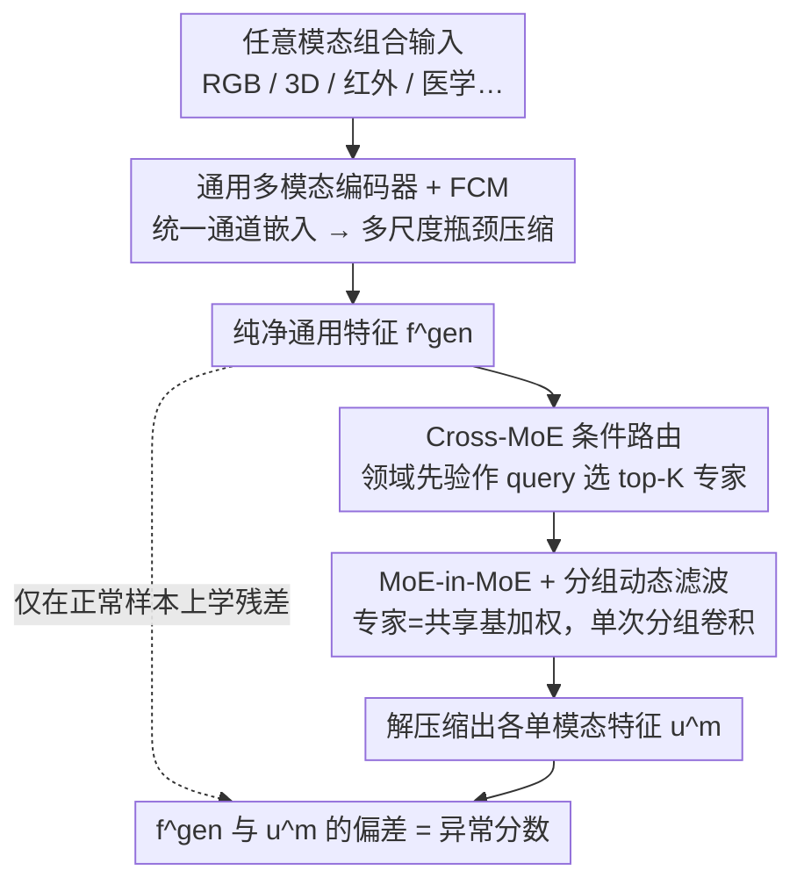

# UniMMAD: Unified Multi-Modal and Multi-Class Anomaly Detection via MoE-Driven Feature Decompression

**会议**: CVPR2026  
**arXiv**: [2509.25934](https://arxiv.org/abs/2509.25934)  
**代码**: [yuanzhao-CVLAB/UniMMAD](https://github.com/yuanzhao-CVLAB/UniMMAD)  
**领域**:目标检测  
**关键词**: 异常检测, 多模态融合, Mixture-of-Experts, 特征解压缩, 统一框架, 多类别异常检测

## 一句话总结

提出 UniMMAD，首个用单一参数集同时处理多模态、多类别异常检测的统一框架，核心是基于 MoE 的特征解压缩机制，将通用多模态编码特征自适应分解为领域特定的单模态重建，在 9 个数据集（3 个领域、12 种模态、66 个类别）上达到 SOTA。

## 研究背景与动机

**现有方法碎片化严重**：当前异常检测方法将模态和类别视为独立因素，不同模态组合需要单独训练专用模型，导致模型部署困难和显存开销巨大。

**多类别方法的共享解码器瓶颈**：UniAD、MambaAD 等多类别方法使用共享解码路径，但面对跨域大变异时（外观、光照、尺度、背景等差异），正常性边界被扭曲，产生严重的领域干扰和高误报率。

**工业场景需要多传感器协同**：实际产品质量检测中，不同产品需要不同的传感器组合（红外相机检测内部损伤、RGB+3D 检测颜色和几何缺陷），为每种组合定制模型不切实际。

**统一视觉模型浪潮的启示**：SegGPT、Spider 等模型展示了单一架构处理多任务的可能性，启发了将该范式迁移到异常检测领域的尝试。

**领域异质性挑战**：多模态多类别场景中，外观、光照、尺度和异常语义差异极大，一致的表征学习和异常判别非常困难。

**效率与持续学习需求**：实用的统一 AD 模型需要高精度、快推理、稀疏计算，以及不发生灾难性遗忘地适应新类别/模态的能力。

## 方法详解

### 整体框架

UniMMAD 要用单一参数集同时处理多模态、多类别异常检测，核心是「General → Specific」范式：把通用多模态特征**解压缩**为多个单模态特征 $f^{\text{gen}} \rightarrow \{u^m\}_{m=1}^M$。模型只在正常样本上学习预测 $f^{\text{gen}}$ 与各 $u^m$ 之间的残差；推理时异常区域无法被正确解压缩，偏差即作为异常指标。整体流程是：**通用多模态编码器 + FCM** 先把任意模态组合压出纯净的通用特征 $f^{\text{gen}}$，再经 **Cross-MoE 条件路由**按领域条件自适应地解压回各单模态特征 $u^m$，而路由专家又用 **MoE-in-MoE + 分组动态滤波**实现以保稀疏、压参数和延迟——这种「压缩通用、解压专用」的非对称设计天然规避了捷径重建。

### 关键设计

**1. 通用多模态编码器 + 特征压缩模块 FCM：把任意模态组合压成纯净通用特征**

碎片化的旧方法给每种模态组合单独训一个模型，部署和显存都吃不消。UniMMAD 的编码器用输入嵌入层把任意模态输入填充到统一通道维度 $C$，支持任意模态组合；三个残差块结合模态间先验平均值逐步提取并精炼特征；FCM 再用分层瓶颈结构压缩——内部多尺度瓶颈用并行 $1\times1$、$3\times3$、$5\times5$ 卷积保留正常模式同时抑制尺度敏感的异常，外部瓶颈在更高语义层级做更细粒度压缩，最终输出纯净的通用特征 $f_1^{\text{gen}}, f_2^{\text{gen}}, f_3^{\text{gen}}$，为后续按领域解压打好基础。

**2. Cross Mixture-of-Experts 的条件路由：按领域上下文选专家、抑制异常泄漏**

多模态多类别下外观、光照、尺度、异常语义差异极大，共享解码路径会被跨域大变异扭曲正常性边界、抬高误报。C-MoE 的条件路由器把通用特征投影为 key/value、领域先验投影为 query，再用卷积 + 全局平均池化得到全局统计量 $g_l^m$，封装领域特定上下文并抑制异常泄漏；门控函数据此产生 top-K 专家索引与分数，并配退火式负载均衡损失 $\mathcal{L}_{\text{MoE}}$（以 $(1-e/E)^2$ 衰减）实现「早期广泛激活、后期稳定路由」。专家分两类——固定专家捕获共享知识、减少冗余，路由专家由 top-K 门控选中、提供任务特定能力。

**3. MoE-in-MoE + 分组动态滤波：保稀疏的同时把参数和延迟压下来**

朴素堆专家会让参数量和推理延迟爆炸。每个路由专家（MoE-Leader）被设计成共享基础专家 $W \in \mathbb{R}^{N_{\text{exp}} \times O \times I \times K_s \times K_s}$ 的加权组合，MoE-Leader 仅存储组合权重 $S \in \mathbb{R}^{N_{\text{exp}} \times O}$，**参数量减少约 75%**；推理时把值张量复制并重塑、令 groups $= K_{\text{route}}+1$，用单次分组卷积并行执行所有专家滤波，大幅降低延迟。于是统一框架既稀疏又快。

### 损失函数 / 训练策略

- **解压缩一致性损失** $\mathcal{L}_{\text{DeC}}$：基于负余弦相似度度量解压缩特征与原始单模态特征的偏差，引入 focal loss 调制因子 $\gamma=2$ 增强对少数类的关注
- **总损失**：$\mathcal{L} = \mathcal{L}_{\text{DeC}} + \mathcal{L}_{\text{MoE}}$，端到端优化

## 实验

### 主要结果

在 9 个数据集上全面评估，涵盖工业（MVTec-3D, Eyecandies, MulSen-AD）、医学（BraTs, UniMed）和传统工业（MVTec-AD, VisA）场景：

| 数据集 | 指标 | 最强专用模型 | UniMMAD | 对比 |
|--------|------|------------|---------|------|
| MVTec-3D | AUC_I / AUC_P | 92.4 / 98.9 (CFM) | **92.5 / 99.1** | 超越专用模型 |
| Eyecandies | AUC_I / AUC_P | 81.8 / 95.8 (CFM) | **85.6 / 96.9** | AUC_I +3.7% |
| MulSen-AD | AUC_I / AUC_P | 78.9 / 97.8 (TripleAD) | **85.5 / 97.9** | AUC_I +6.6% |
| BraTs | AUC_I / AUC_P | 91.8 / 95.7 (PatchCore+MMRD) | **95.8 / 97.5** | AUC_I +4.0% |
| UniMed | AUC_I / AUC_P | 96.1 / 92.7 (INP-Former) | **96.3 / 92.0** | 基本持平 |
| MVTec-AD | AUC_I / AUC_P | 99.2 / 98.2 (INP-Former) | **99.4 / 98.1** | AUC_I +0.2% |
| VisA | MF1_P | 44.4 (INP-Former) | **47.2** | +2.8%（复杂多实例场景） |

### 消融实验

| 组件 | Mean AUC_I | Mean AUC_P | Mean MF1_P |
|------|-----------|-----------|-----------|
| Baseline | 75.6 | 86.6 | 28.5 |
| + FCM | 77.4 | 86.7 | 28.9 |
| + General→Specific | 84.3 | 96.1 | 37.1 |
| + C-MoE (完整) | **91.1** | **96.7** | **42.9** |
| w/o Cross-condition | 85.1 | 95.7 | 37.9 |
| w/o Routed Experts | 85.4 | 96.0 | 37.8 |
| w/o Fixed Expert | 89.4 | 96.5 | 41.5 |
| w/o Multi-scale Exp. | 88.9 | 96.4 | 41.2 |

### 关键发现

- **General→Specific 范式贡献最大**：引入后 AUC_I 提升 8.9%、AUC_P 提升 10.9%，证明了非对称解压缩的有效性
- **C-MoE 进一步带来 8.1% 的 AUC_I 平均提升**，cross-condition 路由和 routed experts 是最核心的设计
- **持续学习能力出色**：仅微调不到 10% 参数（MoE-leader、条件路由器、聚合卷积），新任务性能接近联合训练，旧任务退化 < 8%
- **相比通才模型（AdaCLIP、MVFA、AA-CLIP）优势明显**：在各数据集上全面领先，尤其在多模态场景中差距巨大

## 亮点

- **首个统一多模态多类别异常检测框架**：单一参数集覆盖 3 个领域、12 种模态、66 个类别，实用性极强
- **MoE-in-MoE 参数效率设计精巧**：路由专家仅存储 $N_{\text{exp}} \times O$ 组合权重，参数减少 75%，同时保持稀疏激活和快速推理
- **分组动态滤波加速推理**：通过张量重塑和分组卷积将多个专家的滤波合并为单次操作，工程实现高效
- **退火式负载均衡损失**：$(1-e/E)^2$ 衰减系数实现"先探索后稳定"的路由策略，比固定权重更优雅
- **实验极为充分**：9 个数据集、详尽的消融、持续学习实验、定性分析，覆盖面在 AD 领域罕见

## 局限性

- 先验生成器依赖 WideResNet50 预训练模型，在非自然图像域（如工业 X 光、某些医学模态）的先验质量可能受限
- 持续学习仍需 1% 旧数据混入，不是完全无回放的方案
- 输入固定 resize 到 256×256，对需要高分辨率定位的微小缺陷可能造成信息损失
- MoE-Leader 数量（32 个）和 base expert 数量（8 个）在更大规模场景下的扩展性未充分验证
- 像素级 MF1_P 指标整体偏低（40-50%），说明精细分割能力仍有较大提升空间

## 相关工作

- **多模态异常检测**：M3DM (CVPR2023) 用 patch 对比学习融合 RGB+点云；CFM (CVPR2024) 提出轻量跨模态映射；MMRD 引入法线模态做逆蒸馏 → UniMMAD 用统一编码器替代参数无关融合
- **多类别异常检测**：UniAD (NeurIPS2022) 开创共享模型多类别范式；ViTAD/MambaAD 改进骨干网络；INP-Former (CVPR2025) 达到最强单模态多类别性能 → UniMMAD 通过 MoE 解决共享解码器的域干扰问题
- **MoE 在视觉中的应用**：V-MoE 将 MoE 嵌入 ViT；DeepSeekMoE 强调参数效率 → UniMMAD 的 Cross-condition 路由和 MoE-in-MoE 是针对 AD 异质性的新设计

## 评分

- 新颖性: ⭐⭐⭐⭐⭐ （首个统一多模态多类别 AD 框架，General→Specific 范式和 C-MoE 均为新颖设计）
- 实验充分度: ⭐⭐⭐⭐⭐ （9 数据集、3 领域、12 模态、66 类、完整消融+持续学习）
- 写作质量: ⭐⭐⭐⭐ （结构清晰，图表丰富，但公式较密集）
- 价值: ⭐⭐⭐⭐⭐ （统一框架思路对工业 AD 部署有直接实用价值，MoE 设计可迁移）

<!-- RELATED:START -->

## 相关论文

- [\[AAAI 2026\] SM3Det: A Unified Model for Multi-Modal Remote Sensing Object Detection](../../AAAI2026/object_detection/sm3det_a_unified_model_for_multi-modal_remote_sensing_object_detection.md)
- [\[CVPR 2026\] A Semantically Disentangled Unified Model for Multi-category 3D Anomaly Detection](a_semantically_disentangled_unified_model_for_multi-category_3d_anomaly_detectio.md)
- [\[CVPR 2026\] GPFlow: Gaussian Prototype Probability Flow for Unsupervised Multi-Modal Anomaly Detection](gpflow_gaussian_prototype_probability_flow_for_unsupervised_multi-modal_anomaly_.md)
- [\[CVPR 2026\] Bidirectional Multimodal Prompt Learning with Scale-Aware Training for Few-Shot Multi-Class Anomaly Detection](bidirectional_multimodal_prompt_learning_with_scale-aware_training_for_few-shot_.md)
- [\[CVPR 2025\] Mr. DETR++: Instructive Multi-Route Training for Detection Transformers with MoE](../../CVPR2025/object_detection/mr_detr_instructive_multi-route_training_for_detection_transformers.md)

<!-- RELATED:END -->
