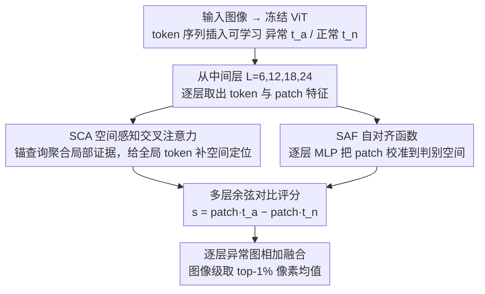

# VisualAD: Language-Free Zero-Shot Anomaly Detection via Vision Transformer

**会议**: CVPR 2026  
**arXiv**: [2603.07952](https://arxiv.org/abs/2603.07952)  
**arXiv**: [2603.07952](https://arxiv.org/abs/2603.07952)  
**代码**: 无  
**领域**:目标检测  
**关键词**: 零样本异常检测, Vision Transformer, 无语言分支, 可学习token, 工业+医学  

## 一句话总结

重新审视零样本异常检测（ZSAD）中文本分支的必要性，提出 VisualAD——一个纯视觉框架：在冻结 ViT 中插入两个可学习 token（anomaly/normal），配合 Spatial-Aware Cross-Attention 和 Self-Alignment Function，去掉文本编码器仍在 13 个工业+医学基准上取得 SOTA。

## 研究背景与动机

- **ZSAD 挑战**：需要在未见过的类别上检测异常，无法依赖每类正常样本训练
- **主流方法依赖 CLIP 文本分支**：AnomalyCLIP 等通过可学习文本提示生成 normal/abnormal 原型，再用图文相似度判断
- **核心质疑**：如果最终决策仅由"正常"和"异常"两组向量决定，文本模态是否真的不可或缺？
- **探索性实验**：去掉 AnomalyCLIP 的文本编码器，直接优化两个视觉向量
    - 检测性能无明显下降
    - 可训练参数减少 99%+
    - 训练曲线更稳定（文本分支版本波动剧烈）
- **结论**：文本提示可能仅是"间接塑造视觉原型"的通道，并非必须

## 方法详解

### 整体框架

VisualAD 要回答一个质疑——ZSAD 里 CLIP 的文本分支是否必要。它给出一个纯视觉框架：在冻结 ViT 的 token 序列里插入两个可学习 token（异常 $t_a$、正常 $t_n$），$z_0 = [t_a, t_n, t_c, p_1, \ldots, p_N]$（$t_c$ 为原始 class token）；从中间层 $\mathcal{L} = \{6, 12, 18, 24\}$ 提取特征，**双路并行**——SCA 给全局 token 补空间定位、SAF 把 patch 校准到判别空间，两路再汇合做余弦对比评分，逐层异常图相加融合，全程不需要文本编码器。

### 关键设计

**1. Spatial-Aware Cross-Attention (SCA)：给全局 token 补上空间定位能力**

两个可学习 token 是全局的，缺乏定位异常的空间信息。SCA 用少量锚查询 $Q_{\text{anchor}} \in \mathbb{R}^{m \times d}$（$m=4$）聚合局部空间证据：$A_\ell = \text{softmax}\left(\frac{Q_{\text{anchor}} (P_\ell^{\text{pos}})^\top}{\sqrt{d}}\right),\ U_\ell = A_\ell P_\ell$，再用 token 引导的门控 $g(t) = \sigma(W_g t) \in \mathbb{R}^m$ 自适应调制 $\tilde{t}_\ell = t + \alpha \sum_{i=1}^{m} g_i(t) \cdot a_i$。SCA 在每层独立实例化，按图像动态调整 token 的空间敏感性，让全局 token 也能「看见」局部异常。

**2. Self-Alignment Function (SAF)：逐层校准 patch 特征**

冻结 ViT 各层的 patch 特征未必直接适配异常判别。SAF 在每层用一个单隐层 MLP 校准：$\hat{P}_\ell = \mathcal{F}_\ell(P_\ell)$。它是消融里最关键的组件——去掉后 Pixel AP 从 28.4 崩到 3.5，说明把 patch 特征对齐到 token 所在的判别空间，是纯视觉路线能成立的前提。

**3. 多层余弦对比评分：用两个 token 的相似度差直接判异常**

有了校准后的 patch 和增强后的 token，异常分数取 L2 归一化后的余弦对比差：$s_i^{(\ell)} = \langle \bar{\hat{p}}_i^{(\ell)}, \bar{t}_a^{(\ell)} \rangle - \langle \bar{\hat{p}}_i^{(\ell)}, \bar{t}_n^{(\ell)} \rangle$，即 patch 离「异常」原型比离「正常」原型更近就判异常。多层结果直接相加融合 $H = \sum_{\ell \in \mathcal{L}} H_\ell$，图像级分数取 top-1% 像素均值。决策只由两组视觉向量完成，印证了文本分支可被省去。

### 损失函数 / 训练策略

$$\mathcal{L} = \mathcal{L}_{\text{cls}} + \mathcal{L}_{\text{seg}} + \mathcal{L}_{\text{ctr}}$$

- $\mathcal{L}_{\text{cls}}$：图像级 BCE
- $\mathcal{L}_{\text{seg}}$：每层 Focal + Dice
- $\mathcal{L}_{\text{ctr}}$：余弦间距惩罚，确保 $t_a$ 和 $t_n$ 角距 > 120°

仅更新 $t_a, t_n$、SCA、SAF，ViT 主干冻结。

## 实验关键数据

### 工业域图像级 AUROC

| 方法 | MVTec-AD | VisA | BTAD | KSDD2 | DAGM |
|------|----------|------|------|-------|------|
| WinCLIP | 90.4 | 75.6 | 68.2 | 93.5 | 91.8 |
| AnomalyCLIP | 91.6 | 81.0 | 88.7 | 91.9 | 98.0 |
| AdaCLIP | 92.0 | 79.7 | 90.0 | 94.9 | 98.3 |
| **VisualAD(CLIP)** | **92.2** | **84.7** | **94.9** | **98.0** | **99.5** |

### 医学域图像级 AUROC

| 方法 | OCT17 | BrainMR1 | Brain_AD | HIS |
|------|-------|----------|----------|-----|
| AnomalyCLIP | 63.7 | 96.4 | 69.0 | 55.2 |
| **VisualAD(CLIP)** | **88.9** | **96.7** | **80.8** | **60.1** |
| **VisualAD(DINOv2)** | **91.2** | 93.8 | **87.1** | 60.1 |

医学域提升尤为显著：OCT17 上 AUROC 从 63.7→91.2（+27.5）。

### 消融实验

| 模块 | Image AUROC | Pixel AP |
|------|------------|----------|
| 无 SCA | 82.3 | 27.4 |
| 无 SAF | 50.5 | 3.5 |
| 无 SCA + 无 SAF | 48.0 | 0.8 |
| **完整** | **84.7** | **28.4** |

SAF 是关键组件，缺失导致性能崩塌。

### 骨干灵活性

同一框架可无缝适配 CLIP 和 DINOv2 骨干，DINOv2 版在像素级分割上更强，CLIP 版在图像级分类上更优。

## 亮点与洞察

1. **大胆质疑文本必要性**：通过实验证明 CLIP 文本分支在 ZSAD 中"可能仅是塑造视觉原型的间接通道"，参数减少 99%
2. **极简优雅的设计**：仅两个可学习 token + 轻量 SCA/SAF，训推同一管线
3. **跨域零样本泛化**：在工业训练 → 医学推理的设置下表现优异
4. **骨干无关性**：CLIP 和 DINOv2 均可适配，扩展性好

## 局限性

- 在部分医学数据集（如 HIS）上提升有限，组织病理异常的视觉先验较弱
- 锚查询数量 $m=4$ 的选择缺乏深入分析
- 需要辅助训练集（VisA 的正常+异常样本），并非完全无训练
- 像素级分割在部分数据集上仍与一些特化方法有差距

## 评分

| 维度 | 评分 |
|------|------|
| 新颖性 | ⭐⭐⭐⭐⭐ |
| 实验 | ⭐⭐⭐⭐⭐ |
| 写作 | ⭐⭐⭐⭐ |
| 价值 | ⭐⭐⭐⭐⭐ |

<!-- RELATED:START -->

## 相关论文

- [\[CVPR 2026\] AnomalyVFM -- Transforming Vision Foundation Models into Zero-Shot Anomaly Detectors](anomalyvfm_--_transforming_vision_foundation_models_into_zero-shot_anomaly_detec.md)
- [\[CVPR 2026\] MoECLIP: Patch-Specialized Experts for Zero-shot Anomaly Detection](moeclip_patch-specialized_experts_for_zero-shot_anomaly_detection.md)
- [\[CVPR 2026\] Back to Point: Exploring Point-Language Models for Zero-Shot 3D Anomaly Detection](back_to_point_exploring_point-language_models_for_zero-shot_3d_anomaly_detection.md)
- [\[CVPR 2026\] FB-CLIP: Fine-Grained Zero-Shot Anomaly Detection with Foreground-Background Disentanglement](fb-clip_fine-grained_zero-shot_anomaly_detection_with_foreground-background_dise.md)
- [\[CVPR 2026\] DLVP-CLIP: Enhancing Fine-Grained Zero-Shot Anomaly Detection via Dynamic Local Visual Prompting](dlvp-clip_enhancing_fine-grained_zero-shot_anomaly_detection_via_dynamic_local_v.md)

<!-- RELATED:END -->
