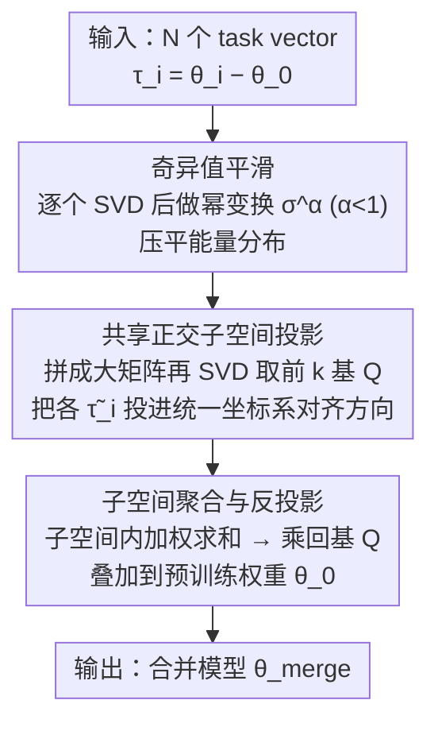

# DC-Merge: Improving Model Merging with Directional Consistency

**会议**: CVPR 2026 (Main Track)  
**arXiv**: [2603.06242](https://arxiv.org/abs/2603.06242)  
**代码**: [https://github.com/Tobeginwith/DC-Merge](https://github.com/Tobeginwith/DC-Merge)  
**领域**:优化  
**关键词**: model merging, task vector, singular value decomposition, directional consistency, LoRA

## 一句话总结
DC-Merge 发现模型合并的关键在于保持合并后多任务向量与原始单任务向量之间**奇异空间方向的一致性**，通过奇异值平滑 + 共享正交子空间投影两步操作，在 Vision 和 Vision-Language 任务上均取得 SOTA 合并效果。

## 研究背景与动机

### 领域现状
模型合并旨在将多个任务适配模型整合为一个统一模型，继承各任务知识。现有方法如 Task Arithmetic、TIES、DARE 等通过对 task vector（微调参数 - 预训练参数）进行加权平均/剪枝来实现合并。

### 现有痛点

**能量分布不均**：Task vector 的 SVD 分解中，少数大奇异值主导了总能量（如前 5% 的奇异值可能占 90%+ 能量），合并时弱但语义重要的分量被忽略

**几何方向不一致**：不同任务的 task vector 在参数空间的几何方向相互冲突，直接合并会扭曲各 task vector 的方向结构

### 核心矛盾
简单的加权平均或裁剪在处理高维参数空间中的方向性信息时过于粗糙——它们无法保证合并结果在奇异空间的方向与各个单独 task vector 保持一致。

### 核心 idea
通过两步操作保持**方向一致性（Directional Consistency）**：先平滑各 task vector 的奇异值以平衡能量分布，再将能量平衡后的 task vector 投影到共享正交子空间以对齐几何方向。

## 方法详解

### 整体框架
DC-Merge 要解决的是：把 $N$ 个单任务模型合并成一个多任务模型时，怎么不让强势任务的参数压垮其余任务。它的输入是 $N$ 个 task vector $\{\boldsymbol{\tau}_i\}_{i=1}^N$，每个 $\boldsymbol{\tau}_i = \boldsymbol{\theta}_i - \boldsymbol{\theta}_0$ 是微调权重减去预训练权重。整条流水线先对每个 task vector 单独做一次 SVD 并把奇异值压平，让大小分量的能量更接近；再求一个所有 task vector 共享的正交子空间，把它们都投影进去对齐几何方向；最后在这个统一坐标系里加权聚合，再投影回原参数空间得到合并权重。三步的核心都是同一件事——让合并结果在奇异空间的方向尽量贴合每个原始 task vector，即作者所说的「方向一致性（Directional Consistency）」。

### 关键设计

**1. 奇异值平滑：压平能量分布，别让大奇异值一家独大**

task vector 的 SVD 里，前 5% 的大奇异值往往占了 90%+ 的总能量，合并时这些强分量会盖过那些能量弱却语义重要的分量。DC-Merge 先对每个 $\boldsymbol{\tau}_i$ 做 SVD 分解 $\boldsymbol{\tau}_i = \mathbf{U}_i \boldsymbol{\Sigma}_i \mathbf{V}_i^\top$，再对奇异值逐个做幂变换 $\sigma_j \leftarrow \sigma_j^\alpha$（取 $\alpha<1$，如 $\alpha=0.5$）。因为 $\alpha<1$ 时幂函数对大数压得多、对小数压得少，变换后大奇异值被拉低、小奇异值被相对抬高，整体能量分布更均匀。这一步只动奇异值、不碰奇异向量方向，所以几乎零计算开销，却让弱分量在后续聚合中拿回话语权——这正是 Task Arithmetic 直接平均、TIES 只做向量级裁剪都没触及的奇异空间层面。

**2. 共享正交子空间投影：给所有 task vector 一个统一坐标系来对齐方向**

不同任务的奇异基 $\mathbf{U}_i, \mathbf{V}_i$ 朝向各异，直接平均会把彼此的方向结构搅乱。这一步不再各管各的方向，而是找一组所有任务共用的正交基 $\mathbf{Q}$，让平滑后的 task vector $\tilde{\boldsymbol{\tau}}_i$ 投影到该子空间后重构误差最小：

$$\min_{\mathbf{Q}} \sum_{i=1}^N \|\tilde{\boldsymbol{\tau}}_i - \mathbf{Q}\mathbf{Q}^\top \tilde{\boldsymbol{\tau}}_i\|_F^2$$

实际求解就是把所有 $\tilde{\boldsymbol{\tau}}_i$ 拼成一个大矩阵再做一次 SVD，取前 $k$ 个奇异向量当作 $\mathbf{Q}$。这样得到的子空间在「尽量不丢各任务信息」的约束下提供了统一坐标系，各 task vector 投进来后方向就被对齐到同一组基上，而不会像直接平均那样互相扭曲。

**3. 子空间聚合与反投影：在对齐后的坐标系里合并，再回到参数空间**

方向对齐之后，聚合就变得安全：在子空间内对各 task vector 的投影坐标 $\mathbf{Q}^\top\tilde{\boldsymbol{\tau}}_i$ 做加权求和，再乘回基 $\mathbf{Q}$ 投影回原参数空间并叠加到预训练权重上：

$$\hat{\boldsymbol{\tau}} = \lambda \sum_{i=1}^N \mathbf{Q}^\top \tilde{\boldsymbol{\tau}}_i, \qquad \boldsymbol{\theta}_{merge} = \boldsymbol{\theta}_0 + \mathbf{Q}\hat{\boldsymbol{\tau}}$$

因为聚合全程发生在那个统一子空间里，合并结果天然落在与各 task vector 方向一致的空间上，不需要额外的方向约束或后处理来纠偏。

### 损失函数 / 训练策略
DC-Merge 是**完全无训练（training-free）**的后处理方法——不需要任何额外数据或微调。超参仅有平滑指数 $\alpha$ 和子空间维度 $k$，均通过小规模验证集选取。

## 实验关键数据

### 主实验：Vision 任务（8 任务合并，ViT-B/32）

| 方法 | 平均准确率 (%) | 对比 Pretrained |
|------|---------------|-----------------|
| Pretrained | 48.3 | — |
| Task Arithmetic | 55.4 | +7.1 |
| TIES | 56.3 | +8.0 |
| DARE | 57.0 | +8.7 |
| Consensus | 57.8 | +9.5 |
| **DC-Merge** | **59.6** | **+11.3** |

### 消融实验

| 配置 | 平均准确率 (%) | 说明 |
|------|---------------|------|
| Full DC-Merge | 59.6 | 完整方法 |
| w/o SVD Smoothing | 57.8 | 去掉平滑后降 1.8% |
| w/o Subspace Projection | 56.5 | 去掉子空间投影后降 3.1% |
| w/o Both (baseline) | 55.4 | 等价于 Task Arithmetic |

### LoRA 合并实验

| 方法 | Vision-Language Avg (%) |
|------|------------------------|
| LoRA Arithmetic | 72.1 |
| DARE-LoRA | 73.5 |
| **DC-Merge-LoRA** | **75.8** |

### 关键发现
- 子空间投影是最关键的模块（贡献 3.1%），SVD 平滑贡献 1.8%，两者互补
- $\alpha \in [0.3, 0.6]$ 范围内效果稳定，对超参不敏感
- DC-Merge 在 LoRA 和 Full Fine-tuning 两种场景下都一致优于 baseline
- 方法在 Vision-Language（如 CLIP 微调）场景的提升更显著

## 亮点与洞察
- **从奇异空间方向一致性角度理解模型合并**——这个视角比"裁剪冲突参数"或"权重平均"更深刻，提供了理论基础
- **SVD 平滑的简洁优雅**——一个幂变换就能有效平衡能量分布，几乎没有计算开销
- **共享子空间投影的思路可推广**——不仅限于 task vector 合并，任何需要"在保持方向的前提下合并多个高维向量"的场景都可以借鉴
- **Training-free**——无需额外数据或计算，纯后处理，即插即用

## 局限与展望
- 子空间维度 $k$ 需要通过验证集选取，对于没有验证数据的场景不够方便
- SVD 分解在极大规模模型（如 70B+ LLM）上的计算开销可能较高
- 仅在 ViT 和 CLIP 系列上验证，未扩展到 decoder-only LLM
- 当任务数量很多（>20）时，共享子空间可能无法同时满足所有 task vector 的方向约束
- 未讨论 task vector 质量差异大（如某些任务微调很差）的鲁棒性

## 相关工作与启发
- **vs Task Arithmetic**：Task Arithmetic 简单平均 task vector，不考虑奇异空间结构。DC-Merge 在此基础上加入方向约束，提升 4+ 个百分点
- **vs TIES/DARE**：TIES/DARE 通过裁剪/随机丢弃处理冲突，属于"减法"策略。DC-Merge 是"变换"策略——不丢弃参数，而是变换到方向一致的空间
- **vs RegMean/Fisher Merging**：这些方法需要额外数据做正则化，DC-Merge 不需要
- **启发**：奇异值平滑的思路可以迁移到 LoRA 的初始化中——如果训练 LoRA 时就限制奇异值分布均匀，可能天然更适合后续合并

## 评分
- 新颖性: ⭐⭐⭐⭐ 从方向一致性角度统一理解模型合并是新颖的，但两个技术模块（SVD平滑、子空间投影）本身不新
- 实验充分度: ⭐⭐⭐⭐ Vision + VL 两大场景，Full FT + LoRA 两种设置，消融齐全
- 写作质量: ⭐⭐⭐⭐ 问题定义清晰，从分析到方案到实验逻辑连贯
- 价值: ⭐⭐⭐⭐ 解决了模型合并的核心问题，training-free 属性实用价值高

<!-- RELATED:START -->

## 相关论文

- [\[CVPR 2026\] Model Merging in the Essential Subspace](model_merging_in_the_essential_subspace.md)
- [\[CVPR 2026\] BD-Merging: Bias-Aware Dynamic Model Merging with Evidence-Guided Contrastive Learning](bd-merging_bias-aware_dynamic_model_merging_with_evidence-guided_contrastive_lea.md)
- [\[CVPR 2026\] ACE-Merging: Data-Free Model Merging with Adaptive Covariance Estimation](ace-merging_data-free_model_merging_with_adaptive_covariance_estimation.md)
- [\[CVPR 2026\] Defending Unauthorized Model Merging via Dual-Stage Weight Protection](defending_unauthorized_model_merging_via_dual-stage_weight_protection.md)
- [\[CVPR 2025\] Model Poisoning Attacks to Federated Learning via Multi-Round Consistency](../../CVPR2025/optimization/model_poisoning_attacks_to_federated_learning_via_multi-round_consistency.md)

<!-- RELATED:END -->
