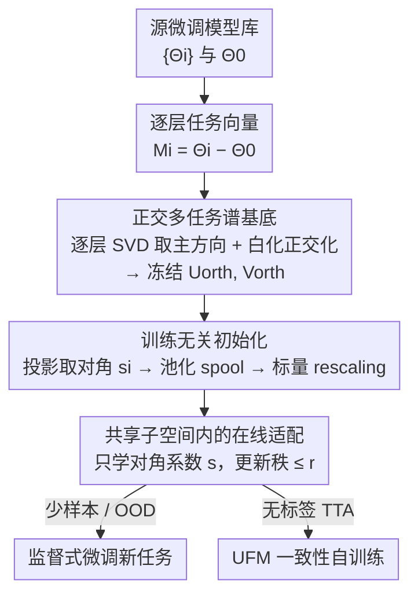

# Basis-Oriented Low-rank Transfer for Few-Shot and Test-Time Adaptation

**会议**: CVPR 2026  
**论文**: [CVF Open Access](https://openaccess.thecvf.com/content/CVPR2026/html/Park_Basis-Oriented_Low-rank_Transfer_for_Few-Shot_and_Test-Time_Adaptation_CVPR_2026_paper.html)  
**代码**: 待确认  
**领域**: 迁移学习 / 参数高效微调  
**关键词**: 低秩迁移, 任务向量, 谱基底, 少样本, 测试时自适应

## 一句话总结
BOLT 把一批已经微调好的源模型的"任务向量"做逐层 SVD 并正交化，得到一组共享的正交谱基底；面对全新任务时冻结这组基底，只训练每层极少的对角系数（约 8k 参数），从而在不做任何元训练的前提下，给少样本、OOD 和无标签测试时自适应提供一个强初始化与参数高效微调路径。

## 研究背景与动机
**领域现状**：把大型预训练模型（如 CLIP）适配到新任务，主流有两条路。一条是梯度元学习（MAML 等），显式学一个"易于快速适配"的初始化；另一条是直接复用现成的微调模型，把每个微调 checkpoint 表示成"任务向量"$\Delta_i = \Theta_i - \Theta_0$，再做加权合并（task arithmetic / model merging）。

**现有痛点**：元学习要额外做一轮覆盖大量任务的双层优化（bi-level optimization），训练昂贵且不稳定，而且新任务不断涌现时，每次都重新元训练并不现实。模型合并这一侧虽然便宜，但 $\Theta_{agg} = \Theta_0 + \sum_i \alpha_i \Delta_i$ 本质上只是在"已知任务解"之间插值——当不同任务的主更新方向彼此不对齐时，朴素相加会把互相冲突的方向缠在一起（interference），导致行为不可预测；更关键的是，对完全没见过的目标任务，没有任何原则性的办法去选系数 $\alpha_i$，也没有真正的"针对新任务的适配步骤"。

**核心矛盾**：合并方法把任务向量当作"要叠加的成品权重"，所以只能在源任务张成的解之间插值、对未见任务必然过拟合到训练任务；而它们缺的恰恰是一个**干净、解耦、可在其上做适配**的坐标系。

**切入角度**：作者观察到，任务向量在每一层上的更新 $M_i^{(\ell)}$ 其实是**低秩**的——能量集中在少数几个主奇异方向上。那么与其把整条任务向量当成品叠加，不如把多个源任务的主奇异方向收集起来、跨任务正交化，构成一组共享的"谱坐标系"，再让新任务只学"在每个坐标轴上走多远"。

**核心 idea**：用一组从源模型抽取并正交化的**任务感知谱基底**替代"合并权重"，把未见任务的更新约束成"该基底下的对角矩阵"，于是适配只需学每层很少的对角系数——既给出训练无关的强初始化，又是一条参数极省的微调路径。

## 方法详解

### 整体框架
BOLT（Basis-Oriented Low-rank Transfer）分两个阶段。**离线阶段**：给定预训练权重 $\Theta_0$ 与一批源任务微调模型 $\{\Theta_i\}_{i=1}^N$，先算出每层的任务向量更新 $M_i^{(\ell)}$，对每个做 thin-SVD 取 top-$k_i$ 主奇异方向，把这些方向跨任务堆叠成 $U_{stack}^{(\ell)}, V_{stack}^{(\ell)}$，再用一步白化（whitening）正交化成共享基底 $U_{orth}^{(\ell)}, V_{orth}^{(\ell)}$。这组基底一旦构造好就**永久冻结**。**在线阶段**：面对未见任务，把每个源任务更新投影到共享基底取对角，平均得到一个 data-free 初始化 $s_{pool}$，再用一次全局标量 rescaling 校准尺度；然后只训练每层的对角系数向量 $s^{(\ell)}$，新任务的权重更新被限制为 $\Delta_{new}^{(\ell)} = U_{orth}^{(\ell)} \, \mathrm{diag}(s^{(\ell)}) \, V_{orth}^{(\ell)\top}$。整套流程下来，新任务可训练参数被压到约 8k 量级，且更新的有效秩被显式控制在 $\le r$。

### 关键设计

**1. 正交多任务谱基底：把源任务的主奇异方向洗成一组解耦坐标系**

朴素 task arithmetic 的根病在于：不同任务的更新方向彼此相关、相加就互相干扰。BOLT 的做法是先承认"每层更新是低秩的"这一经验事实——对层更新做 thin-SVD $M_i^{(\ell)} = U_i^{(\ell)} \Sigma_i^{(\ell)} V_i^{(\ell)\top}$，只有少数大奇异值，说明 $M_i^{(\ell)}$ 几乎落在少数主方向张成的低维子空间里。于是逐层只保留每个源任务的 top-$k_i$ 左右奇异方向，跨 $N$ 个任务横向拼接成 $U_{stack}^{(\ell)} \in \mathbb{R}^{m_\ell \times r}$、$V_{stack}^{(\ell)} \in \mathbb{R}^{n_\ell \times r}$，其中 $r = \sum_i k_i$。这些堆叠方向还互相相关，所以用一步白化把它们正交化：

$$U_{orth}^{(\ell)} = U_{stack}^{(\ell)} \left( U_{stack}^{(\ell)\top} U_{stack}^{(\ell)} + \varepsilon I \right)^{-\frac{1}{2}}, \quad \varepsilon > 0$$

$V$ 侧同理。等价地，作者按前人做法对 $U_{stack}=\Psi_u\Sigma_u\Phi_u^\top$ 取 $U_{orth}=\Psi_u\Phi_u^\top$（丢掉奇异值只留正交因子）。正交化之后，$U_{orth}, V_{orth}$ 列/行正交，成为"所有后续目标任务更新都在其中表达"的共享谱坐标。这一步把"互相纠缠的方向"变成"互不干扰的坐标轴"，是后面所有对角化操作能成立的前提。

**2. 对角重建的闭式解：把任意更新最优压成基底上的一条对角线**

有了正交基底，关键问题变成：在这个子空间里，用一个**对角矩阵** $D$ 去重建源更新 $M$，最优的 $D$ 是什么？作者求解最小二乘 $\min_D \|M - UDV^\top\|_F^2$（$D$ 限定对角）。利用 $U,V$ 的正交性，先把 $M$ 投影到坐标系得到完整系数矩阵 $S = U^\top M V \in \mathbb{R}^{r\times r}$（Eq.7，度量 $M$ 在每对方向上的激活强度）；插入并相减 $USV^\top$ 后，交叉项因正交而消失（$U^\top(M-USV^\top)V = S - S = 0$），范数可分解，问题化简到 $\min_D \|S - D\|_F^2$。展开后离对角项与 $D$ 无关，于是最优解就是**直接抄 $S$ 的对角线**：

$$D^\star = \mathrm{diag}(s), \quad s := \mathrm{diag}(S) \in \mathbb{R}^r$$

这意味着每个源任务在共享基底下，只需保留一个 $r$ 维向量 $s_i$ 就能最优地表达它（在对角约束下）。这把"一整个层更新矩阵"压缩成"一条对角线"，是参数从百万级降到 8k 的数学根据，也保证了后续在线只学对角系数不是拍脑袋的简化，而是带闭式最优性的。

**3. 训练无关初始化：池化源系数 + 一次标量 rescaling，先白送一个好起点**

既然每个源任务都被压成同一坐标系下的对角向量 $s_i = \mathrm{diag}(U^\top M_i V)$，那它们就**可比、可平均**。对未见任务，一个无需任何数据的初始化就是逐分量取均值 $s_{pool} = \frac{1}{N}\sum_i s_i$（Eq.19）。但池化后的整体尺度未必匹配目标任务，所以再加一步极轻量的标量校准：在一个小候选集 $\alpha \in \{1,3,5,7,10\}$ 里，用训练集的几个 mini-batch 评估 $\Theta_0 + \sum_\ell U_{orth}^{(\ell)} \mathrm{diag}(\alpha\, s_{pool}^{(\ell)}) V_{orth}^{(\ell)\top}$ 的精度，选最高的 $\hat\alpha$，令初始 $s_0^{(\ell)} = \hat\alpha\, s_{pool}^{(\ell)}$。这步不改基底、几乎零成本，却能把对角更新的整体量级对齐到目标任务，稳定早期适配。这正是 BOLT 与元学习"殊途同归"之处——都想给新任务一个好初始化，但 BOLT 是**解析地**从已有模型库里算出来，而不是再跑一轮元优化。

**4. 共享子空间内的在线适配：冻结基底只学对角，显式控秩防过拟合**

适配时基底全程冻结，唯一可学的是每层对角系数 $s^{(\ell)}$，新任务的容许更新被参数化为

$$\Delta_{new}^{(\ell)}(s^{(\ell)}) = U_{orth}^{(\ell)} \, \mathrm{diag}(s^{(\ell)}) \, V_{orth}^{(\ell)\top}, \qquad \Theta(s) = \Theta_0 + \sum_\ell \Delta_{new}^{(\ell)}(s^{(\ell)})$$

由构造可知 $\mathrm{rank}(\Delta_{new}^{(\ell)}) \le r$，并且更新被强制留在源任务张成的任务感知子空间内。和 LoRA"凭空注入低秩因子、方向也要从头学"不同，BOLT 的方向来自源任务的真实主奇异方向、且已正交解耦，所以学习只在"每个轴上走多远"这一个自由度上发生。这种把更新锁进既有谱子空间的做法，显式控制了有效秩、把可训练参数压到极低，从而在数据稀缺、分布偏移的场景下大幅降低过拟合到伪相关模式的风险。

### 损失函数 / 训练策略
少样本与 OOD 设定下用标准监督损失只优化对角系数 $s$。无标签测试时自适应（TTA）采用离线 transductive 协议（假设可访问完整无标签目标集，而非严格流式），用一个为 BOLT 定制的无监督 FixMatch（UFM）变体：对每张图生成弱/强增广，从弱视图产出锐化伪标签、高置信样本作为固定目标，其余样本用置信度掩码的一致性损失优化几个 epoch，配 cosine 学习率。整个过程仍只更新低维谱系数，编码器结构不动。每层最多保留 12 个奇异方向，约 8k 可训练参数；谱基底由域内全部源任务向量聚合而成。

## 实验关键数据

主干为 CLIP 的 ViT-B/32、ViT-B/16、ViT-L/14；评测分三条线：少样本分类（$k\in\{1,2,4,8,16\}$）、ImageNet 系 OOD 鲁棒性、无标签 TTA。数据集分"通用域"（DTD、GTSRB、CIFAR、Food101…共 17 个）与"遥感域"（AID、EuroSAT、RESISC45…共 15 个）两族，因二者视觉统计差异大、遥感与 CLIP 预训练表征域差更大，是低秩适配的硬骨头。

### 主实验

少样本精度（三主干、域内全部数据集平均，%）：

| 域 / shot | Zero-shot | LoRA | TIP | LP++ | aTLAS | BOLT |
|-----------|-----------|------|-----|------|-------|------|
| 通用 1-shot | 60.74 | 60.97 | 61.49 | 43.34 | 66.34 | **71.30** |
| 通用 16-shot | 60.74 | 69.57 | 63.78 | 72.09 | 74.44 | **78.46** |
| 遥感 1-shot | 58.59 | 70.12 | 60.36 | 51.85 | 69.87 | **80.77** |
| 遥感 16-shot | 58.59 | 90.76 | 73.26 | 88.47 | 86.24 | **91.86** |

BOLT 在两域全部 shot 上都是最优，且**样本越少优势越大**（通用 1-shot 比次优 aTLAS 高近 5 个点，遥感 1-shot 高近 11 个点），说明谱基底适配特别契合数据极稀缺场景。相比 aTLAS（在已有任务向量上学各向异性缩放、需把所有任务向量一起存储并联合优化），BOLT 只建一次共享正交基底就反复复用，内存效率更高。

OOD 鲁棒性（ViT-B/32, 16-shot, %）：

| Method | ImageNet-A | ImageNet-R | ImageNet-S | ImageNet-V2 |
|--------|-----------|-----------|-----------|-----------|
| Zero-shot CLIP | 14.76 | 50.95 | 38.92 | 52.91 |
| LoRA | 10.28 | 42.16 | 36.76 | 54.51 |
| aTLAS | 14.87 | 52.21 | 39.83 | 55.29 |
| BOLT | **15.88** | **53.85** | **41.26** | **55.69** |

四个 OOD 变体上 BOLT 全部最高。LoRA 因参数多、在低数据 OOD 下最易过拟合，掉得最惨（ImageNet-A 仅 10.28）；BOLT 的逐层谱参数化跨分布迁移更稳。

无标签 TTA（通用域平均精度，%）：

| Method | ViT-B/32 | ViT-B/16 | ViT-L/14 |
|--------|----------|----------|----------|
| Zero-shot CLIP | 56.87 | 61.55 | 67.90 |
| Layer Norm | 62.68 | 67.63 | 74.08 |
| aTLAS | 56.87 | 61.56 | 67.92 |
| BOLT | **67.74** | **69.92** | **74.11** |

配 UFM 目标后 BOLT 在三主干上都超过 zero-shot 与基线，**最小的 ViT-B/32 增益最大**（+10.9），说明谱对角适配能借无标签目标数据补偿小模型容量不足。

### 消融实验

| 配置 | 现象 | 说明 |
|------|------|------|
| 改变保留秩 $r$ | 精度随 $r$ 上升后在 $r\approx 12$ 饱和 | 小模型 ViT-B/32 在低秩时最敏感；大模型即便小 $r$ 也稳 |
| 改变源任务向量数 | 加入前几个源时快速涨、随后 plateau | 紧凑但多样的源集合就够把子空间张满 |

### 关键发现
- **秩不必大**：$r\approx 12$ 即饱和，印证"任务更新本质低秩"，也解释了为何 8k 参数足够；ViT-B/32 对低秩最敏感，大模型本身冗余多、对 $r$ 不敏感。
- **源任务数也很省**：少数几个多样源任务就能把共享子空间张满，再加更多收益递减——基底的价值在"覆盖方向多样性"而非"数量"。
- **越缺数据越能打**：少样本、OOD、小主干 TTA 三个最艰难的设定恰是 BOLT 相对提升最大的地方，说明把更新锁进任务感知子空间的抗过拟合收益在低数据下最值钱。

## 亮点与洞察
- **把"合并权重"换成"在解耦坐标系里学走多远"**：这是全文最妙的视角切换——任务向量不再是要叠加的成品，而是用来抽取一组正交坐标轴，新任务只学对角系数。一个视角转换同时解决了干扰、过拟合、参数量三个问题。
- **对角重建有闭式最优解**：把"在正交基底下重建更新"约化到 $\min_D\|S-D\|_F^2$、最优解就是抄 $S$ 的对角，给"只学对角系数"提供了严格依据而非工程近似，这个推导干净且可复用。
- **训练无关初始化几乎白送**：池化源系数 + 单标量 sweep 就能拿到一个强初始化，把元学习的"学初始化"换成"算初始化"，可直接迁移到任何已有微调模型库的场景。
- **可迁移性强**：只要你手上有一批同主干的微调 checkpoint，这套"抽方向→正交化→对角适配"几乎可即插即用到 NLP/多模态的 PEFT 上。

## 局限与展望
- **依赖现成源模型库**：BOLT 的基底质量直接取决于是否已有一批同主干、覆盖足够方向的微调模型；若源任务稀少或方向单一，子空间张不满，未见任务可能恰好落在基底覆盖不到的方向上。
- **TTA 用的是离线 transductive 协议**，需要访问完整无标签目标集，并非严格流式单遍处理，落地到真正在线流式场景的表现未验证（作者已明确说明）。
- **只在 CLIP 视觉分类上验证**：跨架构（如纯语言模型、检测/分割等结构化输出任务）是否同样成立未知；正交化的白化步含 $\varepsilon$ 等数值细节，超大层上的稳定性与开销值得进一步考察。
- **改进思路**：可探索"按层自适应选秩 $r$"、对源任务做方向覆盖度感知的挑选，以及把对角放宽成块对角以在更难任务上换取容量。

## 相关工作与启发
- **vs LoRA**：LoRA 凭空往线性层注入低秩因子，方向和系数都要从头学；BOLT 的方向直接来自源任务真实主奇异方向并已正交解耦，只学对角系数，参数更少、抗 OOD 过拟合更强（OOD 上 LoRA 掉点最惨即佐证）。
- **vs aTLAS**：aTLAS 在已有任务向量上学各向异性缩放，是在"已有方向"里重新加权、且需联合存储优化所有任务向量；BOLT 先把方向正交化成新坐标系再适配，内存只需存一组共享基底，方向解耦也减轻了干扰。
- **vs 模型合并 / task arithmetic**：合并只能在已知任务解间插值、对未见任务无原则可言；BOLT 把任务向量当"基底来源"而非"成品叠加"，并真正保留了一个针对新任务的对角适配步骤。
- **vs MAML 类元学习**：二者都想给新任务好初始化，但元学习要昂贵不稳的双层优化与专门元训练阶段；BOLT 从已有模型库解析地池化谱系数得到初始化，无需任何元训练。

## 评分
- 新颖性: ⭐⭐⭐⭐⭐ 把任务向量从"合并成品"重构为"正交谱坐标系 + 对角适配"，视角新且推导干净。
- 实验充分度: ⭐⭐⭐⭐ 三主干、两数据族、少样本/OOD/TTA 三线全覆盖且一致领先；但缺非 CLIP 架构与流式 TTA 验证。
- 写作质量: ⭐⭐⭐⭐ 推导逐步、动机清晰；部分核心实现细节推到补充材料。
- 价值: ⭐⭐⭐⭐⭐ 8k 参数即可强适配、可即插用于已有微调模型库，落地价值高。

<!-- RELATED:START -->

## 相关论文

- [\[CVPR 2026\] Neural Collapse in Test-Time Adaptation](neural_collapse_in_test-time_adaptation.md)
- [\[CVPR 2026\] WiTTA-Bench: Benchmarking Test-Time Adaptation for WiFi Sensing](witta-bench_benchmarking_test-time_adaptation_for_wifi_sensing.md)
- [\[NeurIPS 2025\] Test-Time Adaptation by Causal Trimming](../../NeurIPS2025/others/test-time_adaptation_by_causal_trimming.md)
- [\[CVPR 2026\] Dance Across Shifts: Forward-Facilitation Continual Test-Time Adaptation through Dynamic Style Bridging](dance_across_shifts_forward-facilitation_continual_test-time_adaptation_through_.md)
- [\[ICLR 2026\] Consistent Low-Rank Approximation](../../ICLR2026/others/consistent_low-rank_approximation.md)

<!-- RELATED:END -->
