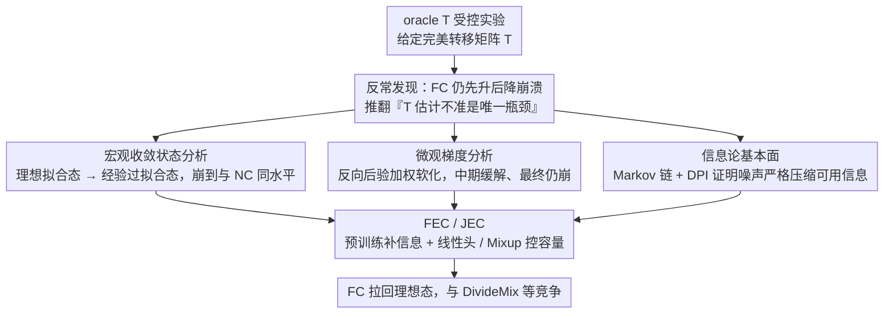

# Deconstructing the Failure of Ideal Noise Correction: A Three-Pillar Diagnosis

**会议**: CVPR2026  
**arXiv**: [2603.12997](https://arxiv.org/abs/2603.12997)  
**代码**: 待确认  
**领域**: 其他  
**关键词**: 噪声标签学习, 噪声转移矩阵, 前向校正, 统计一致性, 信息论

## 一句话总结

本文通过受控实验证明，即使给定完美的噪声转移矩阵 T，前向校正方法仍会在训练后期发生性能崩溃，并从宏观收敛状态、微观优化动力学、信息论三个层面系统诊断了这一失败的根本原因。

## 研究背景与动机

**噪声标签学习（LNL）是基础性挑战**：人工标注或自动标注不可避免引入标签噪声，会严重偏移模型训练并损害泛化能力。

**统计一致方法的理论优势**：基于噪声转移矩阵 T 的前向/后向校正方法理论上保证渐近一致性，即收敛到最优干净数据分类器。

**理论-实践悖论长期存在**：实践中，这些理论优美的方法常被经验驱动的样本选择方法（如 Co-teaching、DivideMix）大幅超越。

**传统归因：T 估计不准**：学术界主流观点长期将此归因于噪声转移矩阵 T 的估计精度不够，认为若有完美 T 即可恢复理论优势。

**本文的关键实验发现**：在给定 oracle T（完美转移矩阵）的理想条件下进行受控实验，发现 FC 仍表现出"先升后降"的性能崩溃——这彻底推翻了"估计 T 是唯一瓶颈"的假说。

**诊断而非修补**：本文的目标不是提出新的校正启发式方法，而是提供全面的理论分析，系统解释为何这些原则性方法即使拥有完美信息仍会失败。

## 方法详解

### 整体框架

这篇论文不提新方法，而是诊断一个长期悖论：理论上保证渐近一致性的前向校正（FC）为什么实践中打不过 Co-teaching、DivideMix 这类经验驱动的样本选择方法。它先用 oracle T（完美转移矩阵）做受控实验，发现即便给了完美 T，FC 仍会"先升后降"地崩溃，从而推翻了"T 估计不准是唯一瓶颈"的主流归因；随后从宏观收敛、微观梯度、信息论三个互补层面逐层解剖崩溃的根因，最后基于诊断给出两个轻量补救方案 FEC/JEC。整套逻辑是「一个反常实验 → 三根诊断支柱并行解剖 → 补救方案收口」的分叉-汇合结构。

### 关键设计

**1. 宏观收敛状态分析：刻画 FC 最终崩到哪里**

要解释"FC 为什么先升后降"，得先看它两端的收敛态。理想拟合态（Theorem 4.2）下 FC 达到贝叶斯最优精度 $\text{ACC}(f_{FC}) = 1 - \mathbb{E}_X[\delta(X)]$ 且完美校准 $\text{ECE}=0$，与 NC 的精度差 $\Delta$ 局限在误差集 $\mathcal{X}_{\text{error}}$（噪声强到足以翻转最优决策边界的区域）且 $\Delta \geq 0$——这解释了训练初期 FC 的明确优势（早期峰值）。但高容量深度网络把经验风险驱动到全局最小时进入经验过拟合态（Theorem 4.3），FC 也会把预测崩成硬顶点 $\hat{p}_{FC}(x) = \mathbf{e}_{k^*_{FC}(x)}$（T 的列最大值方向）；对称噪声下 $C_{Y^*}(X) = T_{Y^*,Y^*}(X)$，可证 FC 与 NC 的精度差 $\Delta\text{ACC} \approx 0$，两者崩到同一水平，且校准崩溃为 $\text{ECE} = 1 - \text{ACC}$——既不准确又极度过度自信。

**2. 微观梯度分析：解释中期为何能缓一缓、最终还是崩**

宏观状态之外，还要看优化过程中的逐样本动力学。NC 梯度直接推向噪声标签方向 $\partial \ell_{NC}/\partial f_k = \hat{p}_k - \mathbb{I}\{y^n=k\}$；FC 梯度则引入反向后验加权 $\partial \ell_{FC}/\partial f_k = \hat{p}_k - q_k$，其中 $q_k$ 是噪声标签到真标签的逆映射概率。这个"软化效应"在训练中期缓解过拟合（对应早期峰值），但最终收敛行为仍由 Theorem 4.3 确定的全局最小值主导——软化只是暂态动力学，救不了最终崩溃。

**3. 信息论基本面：证明信息本身被噪声压没了**

前两层说明 FC 会崩，这一层回答"为什么完美 T 也救不回来"。噪声通道形成 Markov 链 $M \to (X,Y) \to (X,Y^n)$，数据处理不等式保证 $I_{\text{noisy}}(x) \leq I_{\text{clean}}(x)$；Theorem 4.4 进一步证明非平凡噪声下信息压缩严格成立 $I_{\text{noisy}}(x) < I_{\text{clean}}(x)$。也就是说，模型过拟合不仅因为损失函数允许，更因为数据本身缺乏足够信息把优化引向正确解——这是信息层面的根本瓶颈。

**4. FEC / JEC：把 FC 推回理想态的轻量补救**

诊断结论指向"信息不足 + 容量过大导致过拟合"，于是用预训练特征补信息、用线性头与 Mixup 控容量。FEC（Feature-Enhanced Correction）冻结预训练编码器 + 线性分类器 + Mixup + FC；JEC（Joint-Enhanced Correction）则联合微调预训练编码器 + 线性分类器 + Mixup + FC。两者都只用预训练 + Mixup 这两个轻量组件，就把 FC 拉回到能与 DivideMix 等复杂方法竞争的水平。

## 实验

### 主实验结果

| 方法 | CIFAR-10 Sym-50% | CIFAR-10 Sym-80% | CIFAR-10 Sym-90% | CIFAR-100 Sym-50% | CIFAR-100 Sym-80% | Clothing1M |
|------|:-:|:-:|:-:|:-:|:-:|:-:|
| CE（无校正） | 79.4 | 62.9 | 42.7 | 46.7 | 19.9 | 69.03 |
| Forward [Patrini17] | 79.8 | 63.3 | 42.9 | 46.6 | 19.9 | 69.84 |
| DivideMix | **94.6** | **93.2** | 76.0 | **74.6** | **60.2** | 74.76 |
| FEC (本文) | 87.3 | 85.6 | **82.5** | 58.6 | 52.7 | 61.85 |
| JEC (本文) | 88.8 | 78.5 | 68.5 | 64.9 | 50.1 | **72.24** |

### 消融与关键发现

- **理想状态验证（线性分类器+预训练特征）**：FC 在准确率和 ECE 上均明显优于 NC，且噪声比越高优势越大——验证了 Theorem 4.2。
- **多标签信息缩放实验**：从单标签扩展到 10 标签/样本，FC 的 ACC 稳步提升并接近理想样本选择——验证了 Theorem 4.4（信息量是关键瓶颈）。
- **校准优势**：即使 FC 在 ACC 上未必领先，其 ECE 始终显著低于样本选择方法，表明噪声校正在后验质量（校准）上具有独特优势。
- **对称噪声下的收敛合并**：长时间训练后 FC 和 NC 收敛到相同差性能，与 Theorem 4.3 的理论预测完全一致。

## 亮点

- **打破学术界长期假说**：通过 oracle T 实验，令人信服地证明 T 估计精度不是噪声校正失败的根本原因。
- **三层诊断框架深刻且系统**：从宏观到微观到信息论，逐层剥开悖论本质，使读者获得完整认知。
- **理论推导严谨且不依赖简化假设**：放弃了常见的类条件噪声（CCN）和确定性后验假设，结论适用于更一般的实例依赖噪声（IDN）。
- **简单正则化即可大幅提升噪声校正**：FEC/JEC 仅用预训练+Mixup 两个轻量组件就与 DivideMix 等复杂方法竞争。
- **强调校准指标（ECE）**：提醒社区不应仅用 ACC 评估 LNL 方法，校准质量同等重要。

## 局限性

- **FEC/JEC 依赖预训练编码器的质量**：分析虽通用，but 所提方案的实际效果受限于预训练特征的表征能力。
- **仍假设已知或准确的 T**：虽然证明了完美 T 不够，但所提方案仍需 oracle T，未涉及 T 估计不准时的行为。
- **缺乏大规模实验验证**：仅在 CIFAR 和 Clothing1M 上验证，未覆盖 WebVision、ImageNet-N 等更大规模基准。
- **未与最新 SOTA 方法对比**：如 PLS、SOP 等近两年的前沿方法未纳入对比。
- **诊断导向、解决方案较初步**：FEC/JEC 定位为"proof of concept"，距实用还有距离。

## 相关工作

- **噪声转移矩阵方法**：Forward Correction [Patrini17]、Backward Correction、T-Revision [Xia19]、DualT [Yao20]、体积最小化等——本文直接挑战这一方向的核心假设。
- **鲁棒损失函数**：GCE、MAE、SCE 等通过对称性条件绕开 T 建模，但缺乏对 IDN 的系统分析。
- **样本选择方法**：Co-teaching、DivideMix、PropMix 等——本文证明在理想条件下噪声校正可与之竞争。
- **信息论视角的噪声分析**：本文的 Theorem 4.4 与数据处理不等式相关，为 LNL 提供了新的分析范式。

## 评分

- 新颖性: ⭐⭐⭐⭐⭐ — 打破长期假说，三层诊断框架前所未有
- 实验充分度: ⭐⭐⭐⭐ — 理论验证充分，但大规模实验偏少
- 写作质量: ⭐⭐⭐⭐⭐ — 叙事结构清晰，从悖论到诊断到验证逻辑严密
- 价值: ⭐⭐⭐⭐⭐ — 对 LNL 社区具有范式转变意义

<!-- RELATED:START -->

## 相关论文

- [\[CVPR 2026\] Mitigating Instance Entanglement in Instance-Dependent Partial Label Learning](mitigating_instance_entanglement_in_instance-dependent_partial_label_learning.md)
- [\[CVPR 2026\] Shoe Style-Invariant and Ground-Aware Learning for Dense Foot Contact Estimation](shoe_style-invariant_and_ground-aware_learning_for_dense_foot_contact_estimation.md)
- [\[CVPR 2026\] What Is Wrong with Synthetic Data for Scene Text Recognition? A Strong Synthetic Engine with Diverse Simulations and Self-Evolution](what_is_wrong_with_synthetic_data_for_scene_text_recognition_a_strong_synthetic_.md)
- [\[CVPR 2026\] Debiased Sample Selection for Learning with Noisy Labels](debiased_sample_selection_for_learning_with_noisy_labels.md)
- [\[CVPR 2026\] DiffBMP: Differentiable Rendering with Bitmap Primitives](diffbmp_differentiable_rendering_with_bitmap_primitives.md)

<!-- RELATED:END -->
