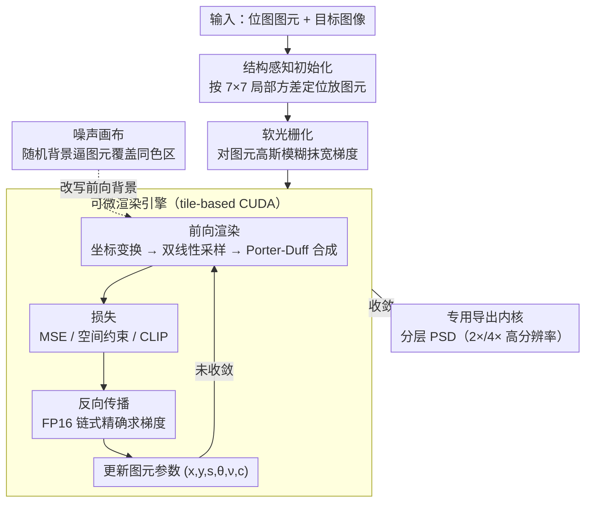

# DiffBMP: Differentiable Rendering with Bitmap Primitives

**会议**: CVPR2026  
**arXiv**: [2602.22625](https://arxiv.org/abs/2602.22625)  
**代码**: [diffbmp.com](https://diffbmp.com)  
**领域**: others (可微渲染 / 计算机图形学)  
**关键词**: differentiable rendering, bitmap primitives, CUDA kernel, soft rasterization, alpha compositing, creative workflow

## 一句话总结

提出 DiffBMP——首个面向**位图图元**的通用可微渲染引擎，通过自定义 CUDA 并行管线实现对数千张位图图元的位置、旋转、缩放、颜色和透明度的高效梯度优化，填补了 2D 可微渲染仅限矢量图形的空白。

## 研究背景与动机

**可微渲染的核心需求**：大规模优化问题依赖一阶梯度方法，要求渲染过程对场景参数可微；3D 领域（NeRF、3DGS）已有成熟方案，但 2D 领域仍局限于矢量图形。

**现有方法仅支持矢量基元**：DiffVG 及其后续工作在矢量路径上表现出色，但现实世界绝大多数 2D 素材是位图（bitmap），无法直接参与梯度优化。

**位图可微渲染的难度**：位图是离散的高维像素数组，存在巨大的内存和计算开销；STN 虽引入了可微图像采样，但未被推广到通用位图组合优化。

**已有位图方法局限**：Reddy et al. 唯一尝试过位图可微渲染，但不支持透明度、无并行加速，仅能处理重复不透明图案等窄任务。

**DiffVG 无法处理复杂图元**：实验表明 DiffVG 在面对复杂 SVG 曲线时 PSNR 急剧下降、运行时间骤增，即使先矢量化再用 DiffVG 也不可行。

**创意工作流缺失**：缺乏一个能将优化结果导出为分层 PSD 文件、可无缝接入设计师工作流的位图可微渲染工具。

## 方法详解

### 整体框架

DiffBMP 要解决的是 2D 可微渲染长期只能处理矢量图形、碰不了位图的空白。核心是一套自定义的 tile-based CUDA **可微渲染引擎**：输入一组位图图元和目标图像后，先做结构感知初始化、对图元做软光栅化模糊，再进入优化循环——可微前向渲染（坐标变换 + 双线性插值采样 + Porter-Duff alpha 合成）得到渲染结果 → 计算损失 → CUDA 反向传播精确求梯度 → 更新每个图元的 $(x_i, y_i, s_i, \theta_i, \nu_i, \mathbf{c}_i)$，循环到收敛后由专用导出内核生成分层 PSD 文件。噪声画布等技巧在过程中改写前向背景以稳定优化。

### 关键设计

**1. 可微渲染引擎：前向 + 反向全程可微的 tile-based CUDA 管线**

位图是离散的高维像素数组，直接组合渲染既不可微、又有巨大的内存和计算开销——这是位图可微渲染一直做不起来的根本卡点。DiffBMP 的核心就是一套端到端可微的自定义 CUDA 引擎，把前向、反向、并行三件事一并解决。**前向**：对画布像素 $(x,y)$，先经旋转矩阵和平移/缩放变换映射到图元的归一化坐标 $(u,v)\in[-1,1]^2$（Eq.1），再转成离散坐标 $(U,V)$ 后用双线性插值采样得到图元贡献 $M_i(x,y)$，让空间变换完全可微；每个图元的 alpha $=\alpha_{\max}\cdot\sigma(\nu_i)\cdot M_i(x,y)$，按 Porter-Duff over 合成逐层累积透射率 $T_k$ 与最终颜色 $I(x,y)$（Eqs.3–5）。**反向**：位置/缩放/旋转的梯度通过链式法则从 $I$ 经 $M_i$、$(u,v)$ 精确传播到各参数（Eq.7），全程无需任何近似。**并行**：把画布切成 $T\times T$ 的 tile（默认 $T=32$），CPU 端按包围盒把图元 bin 到与之重叠的 tile，GPU 端每个 tile 交给一个 thread block、块内 $T\times T$ 线程做像素级完全并行，并以 FP16（`__half2` 打包 + `atomicAdd`）累积梯度，大幅压低带宽与显存。此外配一个专用导出 CUDA 内核以图元级并行渲染出可编辑的分层 PSD，做到"低分辨率优化、高分辨率（2×/4×）导出"；并提供可选颜色约束 $\mu_{\text{blend}}$（Eq.6），按比例保留图元原色，用于品牌 logo 拼图这类需要保留原始配色的场景。

**2. 软光栅化（Soft Rasterization）：把稀疏梯度抹宽**

双线性插值的梯度只在图元边界附近非零、其余几乎为零，极其稀疏，优化很容易卡死。DiffBMP 在优化前对每个图元施加高斯模糊，平滑图元边缘、扩展梯度的空间作用范围，让远离边界的像素也能回传方向一致的梯度。这一步几乎不增加计算量，却让梯度更丰富、更连贯，消融实验里稳定提升 PSNR（Tab.3）。

**3. 结构感知初始化（Structure-aware Init）：按目标复杂度放图元**

随机初始化会把图元放错位置、拖慢收敛。DiffBMP 用目标图像 $7\times7$ 滑窗的局部方差（归一化为 $\mathrm{NLV}\in[0,1]$）指导放置：高方差（细节多）区域以更高概率密集放小图元、低方差（平坦）区域稀疏放大图元（$s_i$ 随 NLV 反向缩放），颜色按目标像素值加噪初始化 $c_i\sim\mathcal{N}(I(x_i,y_i),\sigma_c^2)$，透明度固定在 $\nu_i=-2.0$（≈12%）以保证各层都有梯度流。如此初始布局就贴合目标结构，是消融里另一项稳定增益。

**4. 噪声画布（Noisy Canvas）：逼图元去覆盖同色区域**

当目标某区域与画布背景同色时，图元会"偷懒"不去覆盖、留下空洞。DiffBMP 把背景设成均匀随机噪声 $\mathbf{b}(x,y)\sim\mathcal{U}[0,1]^3$ 并改写前向合成 $I_{\text{FG+BG}}=I_{\text{FG}}+T_N\odot\mathbf{b}$（Eq.8），迫使图元去铺满那些与背景同色的区域；相比所借鉴的三角网格渲染做法每轮采样 5 次噪声，这里每轮只采一次。

### 损失函数

- **基础损失**：$\| I - I^{\text{target}} \|_2^2$（像素级 MSE）。
- **空间约束损失**（Eq. 9）：$\mathcal{L} = \|(I_\alpha^{\text{target}} > 0) \odot (I - I^{\text{target}})\|_2^2 + \lambda_\alpha \|I_\alpha - I_\alpha^{\text{target}}\|_2^2$，用于前景渲染，约束背景区域图元消失。
- **CLIP 损失**：可结合 CLIP 实现文本驱动的位图组合创作。

## 实验

### 主要结果

| 实现方式 | 分辨率 512² | 分辨率 1024² (tile=32) | 分辨率 2048² |
|---|---|---|---|
| PyTorch (RTX 3090) | 1360/2337 ms, 6.4 GB | 1393/2477 ms, 5.0 GB | 5405/9483 ms, 9.0 GB |
| CUDA-FP32 (RTX 3090) | 3.9/11.6 ms, 1.0 GB | 7.6/9.3 ms, 2.0 GB | 16.1/10.0 ms, 6.1 GB |
| CUDA-FP16 (RTX 3090) | **2.3/6.2 ms, 1.1 GB** | **4.3/5.5 ms, 1.6 GB** | **9.0/6.4 ms, 3.8 GB** |

> CUDA-FP16 比 PyTorch 基线快 **约 350–600×**，显存降低 **约 2.5–6×**。

### 消融实验

| 软光栅化 | 结构感知初始化 | Scenario 1 (PSNR) | Scenario 2 | Scenario 3 |
|---|---|---|---|---|
| ✗ | ✗ | 24.4 | 20.6 | 25.9 |
| ✓ | ✗ | 24.7 | 21.5 | 26.5 |
| ✗ | ✓ | 25.5 | 21.0 | 27.1 |
| ✓ | ✓ | **25.7** | **21.7** | **27.4** |

两项技术叠加后在所有场景上取得最佳 PSNR。

### 关键发现

- **DiffVG 在复杂 SVG 上失效**：面对 bitmap 级复杂度的矢量图元，DiffVG 的 PSNR 显著下降、运行时间骤增，证明了 DiffBMP 的必要性。
- **动态视频**：结合序列初始化 + 移除卡住图元 + 冻结未变区域三项策略，在 17 段视频上实现最佳时间一致性（tOF=1.84）同时保持竞争性帧保真度（PSNR=24.38）。
- **噪声画布**有效消除了同色区域的图元覆盖空洞问题。
- **空间约束**中结合 opacity loss + 重新初始化低透明度图元可获得最干净的前景渲染。

## 亮点

- **填补空白**：首次实现面向任意位图图元的通用、高效可微渲染引擎，是 DiffVG 的位图对应物。
- **极致工程**：自定义 tile-based CUDA 内核 + FP16 混合精度，在消费级 GPU 上 1 分钟内优化数千图元。
- **实用性强**：支持 PSD 分层导出、Python 接口、CLIP 文本驱动创作，可直接融入设计师工作流。
- **优化技巧完备**：软光栅化、结构感知初始化、噪声画布等技术各有消融验证，组合效果显著。
- **应用丰富**：品牌 logo 拼图、视频建模、前景约束渲染、文本驱动创作等多样化展示。

## 局限性

- **强依赖 GPU**：不同于 DiffVG 可在 CPU 运行，DiffBMP 基于 CUDA 实现，必须有 NVIDIA GPU。
- **超参数敏感**：通用性使得超参数选择和初始化策略对结果影响大，容易陷入局部最优，缺乏自动调参机制。
- **未探索自回归/RL**：论文指出位图可微渲染可为自回归绘画和强化学习提供基础，但本文未实际实现。
- **视频场景仍有权衡**：动态 DiffBMP 的防闪烁与帧保真度存在 trade-off，尚未完美平衡。

## 相关工作

- **矢量可微渲染**：DiffVG [Li et al., 2020] 及其扩展（图像矢量化、文本驱动 SVG 生成）；Bézier Splatting [Liu et al., 2025] 也限于矢量。
- **位图可微渲染**：STN [Jaderberg et al., 2015] 引入可微空间变换；Reddy et al. 将其用于图案组合但无并行、无透明度。
- **3D 可微渲染**：NeRF、3DGS 及其加速变体（Plenoxels、3D Convex Splatting）为 DiffBMP 的 tile-based 并行提供了参考。
- **神经绘画**：Paint Transformer [Liu et al., 2021]、CLIPDraw [Frans et al., 2022] 等基于 RL 或前馈网络的绘画方法，DiffBMP 提供了梯度优化的替代路径。

## 评分

- 新颖性: ⭐⭐⭐⭐⭐ — 填补了位图可微渲染的空白，问题定义清晰且无前人解决
- 实验充分度: ⭐⭐⭐⭐ — 性能对比、消融实验、多场景应用均覆盖，但缺少与更多 baseline 的定量对比
- 写作质量: ⭐⭐⭐⭐⭐ — 结构清晰、公式推导完整、图表丰富且直观
- 价值: ⭐⭐⭐⭐ — 打开了位图梯度优化的新范式，工具实用性强，但实际影响取决于社区采纳度

<!-- RELATED:START -->

## 相关论文

- [\[CVPR 2025\] Locally Orderless Images for Optimization in Differentiable Rendering](../../CVPR2025/others/locally_orderless_images_for_optimization_in_differentiable_rendering.md)
- [\[CVPR 2026\] NeuroRule: Bridging Vision and Logic with Differentiable Rule Induction](neurorule_bridging_vision_and_logic_with_differentiable_rule_induction.md)
- [\[CVPR 2026\] Differentiable Stroke Planning with Dual Parameterization for Efficient and High-Fidelity Painting Creation](differentiable_stroke_planning_with_dual_parameterization_for_efficient_and_high.md)
- [\[ICML 2026\] DisjunctiveNet: Neural Symbolic Learning via Differentiable Convexified Optimization Layers](../../ICML2026/others/disjunctivenet_neural_symbolic_learning_via_differentiable_convexified_optimizat.md)
- [\[CVPR 2025\] TensoFlow: Tensorial Flow-based Sampler for Inverse Rendering](../../CVPR2025/others/tensoflow_tensorial_flow-based_sampler_for_inverse_rendering.md)

<!-- RELATED:END -->
