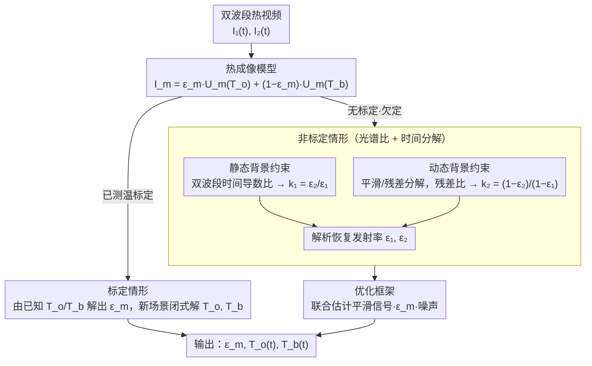

# Dual-Band Thermal Videography: Separating Time-Varying Reflection and Emission Near Ambient Conditions

**会议**: CVPR 2026  
**arXiv**: [2509.11334](https://arxiv.org/abs/2509.11334)  
**代码**: [dual-band-thermal.github.io](https://dual-band-thermal.github.io)  
**领域**: Others (Computational Imaging)  
**关键词**: 热成像, 双波段, 反射-发射分离, 热辐射, 发射率估计

## 一句话总结

提出一种双波段长波红外视频分析框架，利用光谱线索（双波段发射率比恒定）和时间线索（物体辐射平滑变化、背景辐射突变）联合约束，首次实现近环境温度条件下动态场景中反射与发射分量的逐像素分离，并恢复物体发射率和温度场。

## 研究背景与动机

热成像相机捕获的长波红外（LWIR, 8-14 µm）辐射包含两个分量：

**发射分量**：物体自身温度和发射率决定的热辐射

**反射分量**：来自周围环境的背景辐射的反射

分离这两个分量是热成像领域的长期挑战，核心困难在于：

- **欠约束问题**：即使使用多波段，没有发射率先验信息，问题仍然是不可确定的
- **近环境温度条件**：当物体温度接近环境温度时，发射和反射信号幅度相当，分离更加困难
- **现有假设太强**：工业场景假设背景可忽略（物体远高于环境温度）；控制环境假设背景时空均匀；灰体假设（发射率在 LWIR 内恒定）等

本文的两个关键洞察打破了这些限制：

**光谱线索**：物体在 LWIR 子波段内发射率可以随波长变化（违反灰体假设），但两波段的发射率比值 $k_1 = \epsilon_2/\epsilon_1$ 是固定常数

**时间线索**：物体温度受热传导控制，变化平滑；而背景反射因人或物体运动可突变

## 方法详解

### 整体框架

这篇论文要解决热成像里长期欠约束的难题——长波红外辐射同时混着物体自身的发射分量和环境的反射分量，近环境温度下两者幅度相当、极难分开。输入两个光谱波段的热视频 $\{I_m^1, \ldots, I_m^N\}$（$m \in \{1,2\}$），目标输出三个量：每波段发射率 $\epsilon_m$、时变物体温度 $T_o(t)$、时变有效背景温度 $T_b(t)$。方法靠两个物理洞察破题——双波段发射率比恒定（光谱线索）、物体辐射平滑而背景辐射可突变（时间线索）。整条 pipeline 先用**热成像模型**把像素辐射写成发射 + 反射的线性混合，再按是否有先验测温分成两条路：**标定情形**直接闭式求解；**非标定情形**用光谱比 $k_1$ 与时间分解 $k_2$ 补足约束、解析恢复发射率，再交由**优化框架**在含噪信号上稳定地联合求解。

### 关键设计

**1. 热成像模型：把像素辐射写成发射 + 反射的线性混合**

要分开两个分量，先得有一个能显式表达它们的成像方程。每个像素的辐射受 Kirchhoff 定律约束 $\epsilon(\lambda) + \tau(\lambda) + r(\lambda) = 1$；经增益/偏移校正后，像素强度表示为 $I_m(t) = \epsilon_m U_m(T_o(t)) + (1-\epsilon_m) U_m(T_b(t))$，其中 $U_m(T)$ 为 Sakuma-Hattori 模型，在近环境温度下可线性近似为 $U_m(T) = a_m T + b_m$。这就把问题化成发射项与反射项的线性混合，为后续约束铺路。

**2. 标定情形：用已知温度直接闭式解**

若能预先测温，就不必硬解欠定问题。用热电偶测量物体表面温度、已知温度的黑体作为背景，发射率可解析计算 $\epsilon_m = \frac{I_m - U_m(T_b)}{U_m(T_o) - U_m(T_b)}$；到新场景就用双波段线性方程组直接闭式求解 $T_o$ 和 $T_b$。

**3. 非标定情形：用光谱比 + 时间分解补足约束（核心贡献）**

没有标定时，双波段方程组 $\mathbf{I} = \mathbf{E}\mathbf{T}$ 里 $\mathbf{E}$ 虽是 $2\times2$ 但在环境温度附近近似退化（Sakuma-Hattori 函数近线性），必须额外约束。论文给出两条：静态背景约束——在背景辐射不变的像素处，双波段时间导数之比给出常数 $k_1 = \epsilon_2/\epsilon_1$；动态背景约束——把信号分解为平滑分量 $\tilde{I}_m(t)$（发射主导）和残差（反射），双波段残差之比给出常数 $k_2 = (1-\epsilon_2)/(1-\epsilon_1)$。有了 $k_1$ 和 $k_2$ 就能解析恢复发射率 $\epsilon_1 = \frac{k_2-1}{k_2-k_1}$、$\epsilon_2 = k_1 \cdot \frac{k_2-1}{k_2-k_1}$。

**4. 优化框架：联合估计平滑信号、发射率与噪声**

实际信号含噪，需要把上面的约束稳定地解出来。联合优化四组变量 $\tilde{I}_1(t)$（平滑信号）、$\tilde{I}_2(0)$（偏移）、$\epsilon_m$（发射率）、$I_m^\varepsilon(t)$（噪声模型）：用 $k_1$ 约束递推构造平滑信号 $\tilde{I}_2(t) = \tilde{I}_2(t-1) + k_1 \frac{a_2}{a_1}(\tilde{I}_1(t) - \tilde{I}_1(t-1))$，再用 $k_2$ 构造重建信号 $\hat{I}_2(t) = \tilde{I}_1(t) + k_2 \frac{a_2}{a_1}(\ddot{I}_1(t) - \tilde{I}_1(t))$。

### 损失函数 / 训练策略

非学习方法，采用传统优化（非神经网络）：

$$\arg\min \; \gamma_1 \mathcal{L}_{smooth} + \gamma_2 \mathcal{L}_{Huber} + \gamma_3 \mathcal{L}_{MSE} + \gamma_4 \mathcal{L}_{noise}^{L2} + \gamma_5 \mathcal{L}_{noise}^{M}$$

- $\mathcal{L}_{smooth}$：二阶平滑先验 $\|\tilde{I}_m(t-1) - 2\tilde{I}_m(t) + \tilde{I}_m(t+1)\|^2$
- $\mathcal{L}_{Huber}$：归一化 Huber 损失（对背景突变鲁棒）
- $\mathcal{L}_{MSE}$：重建与观测之间的 MSE
- $\mathcal{L}_{noise}$：噪声模型正则化（L2 + 零均值约束）

**硬件设置**：
- 两台 FLIR Boson 热相机（≤40 mK / ≤20 mK NETD），640×512 分辨率
- 光谱滤波器：8.5/9.5/10.6/12.1 µm，安装在 FW103H/M 电动滤波轮上
- 地面真值：TC-08 数据记录器 + Type-T 热电偶

## 实验关键数据

### 主实验

**仿真实验（温度恢复误差）**：

| 方法 | 说明 | 温度误差 |
|------|------|---------|
| BCP | 黑体通道先验 | 较大（冷物体时假设失效） |
| 双波长测温法 | 忽略背景辐射 | 噪声高时退化 |
| Naive LS | 最小二乘（5次随机初始化取最优） | 不稳定 |
| **Ours** | 双波段+时间约束 | **在中等噪声下显著优于所有baseline** |

**真实实验温度估计**：

| 场景 | 本文(uncalib) | 本文(calib) | BCP | Naive | 说明 |
|------|-------------|------------|-----|-------|------|
| Wineglass | **1.72%** | 5.04% | 14.6% | 31.68% | 峰值 63.6°C |
| Coffee Pot | 5.34% | **0.36%** | 6.62% | 45.5% | 峰值 63.1°C |

**发射率标定对比**：

| 材料 | 参考值 | 反射板法 | 本文方法 |
|------|-------|---------|---------|
| Chrome Ball | 0.10 | 0.43 | **0.12** |
| Al. Cup | 0.05 | 0.16 | **0.10** |
| Blue Paint | 0.87 | 0.88 | **0.88** |
| Glass Jar | 0.95 | 0.93 | **0.93** |
| Wineglass | 0.95 | 0.97 | **0.96** |

低发射率材料上本文方法显著优于 FLIR 推荐的反射板法。

### 消融实验

| 损失项 | 去除后温度误差增加 | 说明 |
|--------|-----------------|------|
| 重建项 $\mathcal{L}_{MSE}$ | 90.10% | 最关键 |
| 平滑项 $\mathcal{L}_{smooth}$ | 56.73% | 时间平滑先验重要 |
| Huber 损失 | 11.31% | 对突变鲁棒 |
| 噪声项 | 11.64% | 高噪声下更有用 |

### 关键发现

1. **非标定方法在酒杯场景仅 1.72% 温度误差**，已接近实用水平
2. **低发射率材料**（如镀铬球、铝杯）上优势尤为明显——现有方法严重失败
3. **光谱滤波器选择**：9.5 µm 滤波器给出最高条件数，最适合与全波段配对
4. **成功分离了视觉上不可见的热信号**：如玻璃上的指印热消散 vs 手指反射、咖啡壶缓慢散热 vs 移动人体反射

## 亮点与洞察

1. **物理驱动的优雅建模**：不依赖神经网络，而是基于热辐射物理推导，利用双波段+时间先验约束欠定问题
2. **标定+非标定双模式**：标定模式精度高但需前期工作，非标定模式完全自动但精度稍低，覆盖不同使用场景
3. **首次在动态近环境温度场景实现分离**：此前没有方法能在反射和发射可比的条件下工作
4. **展示了热成像的丰富信息**：在人眼和可见光相机完全无法感知的维度上揭示了场景信息
5. **噪声显式建模**：光谱滤波后 SNR 降低，显式建模每像素每帧噪声提高了鲁棒性

## 局限与展望

1. **假设背景与物体温度变化不相关**：如房间整体均匀升温时该假设不成立
2. **低成本微测辐射热计+滤波器的灵敏度限制**：低发射率物体的微小温差难以检测
3. **需要两台相机**：未使用分束器（因 SNR 损失），但双相机引入视差问题
4. **仅 LWIR 波段**：扩展到 MWIR 或多波段可能进一步提升精度
5. **非实时**：优化框架的计算效率未讨论

## 相关工作与启发

- **BCP（黑体通道先验）**：CV 领域最近的反射消除方法，但假设局部最亮像素近似黑体，在冷物体场景失败
- **双波长测温法（Pyrometry）**：传统工业方法，假设灰体且忽略背景
- **Shape from Heat Conduction（ECCV 2024）**：利用热传导恢复形状，本文补充了反射分量的处理
- 启发：热成像中反射/发射分离类似于可见光中的漫反射/镜面反射分离，但额外涉及热传导，是光传输和热传输的交叉领域

## 评分

- 新颖性: ⭐⭐⭐⭐⭐ — 双波段+时间约束的组合是全新思路，优雅地解决了长期未决的欠约束问题
- 实验充分度: ⭐⭐⭐⭐ — 仿真+真实实验+标定/非标定对比+消融；但真实场景有限
- 写作质量: ⭐⭐⭐⭐⭐ — 物理推导严谨清晰，从成像模型到约束推导到优化一气呵成
- 价值: ⭐⭐⭐⭐ — 打开热成像的新分析维度，对计算热成像/非接触测温/热 NLOS 等领域有启发

<!-- RELATED:START -->

## 相关论文

- [\[CVPR 2026\] Inter-Photon-Limited Videography](inter-photon-limited_videography.md)
- [\[ACL 2025\] Learning to Reason Over Time: Timeline Self-Reflection for Temporal Reasoning](../../ACL2025/others/tiser_timeline_self_reflection_temporal.md)
- [\[CVPR 2026\] Differentiable Stroke Planning with Dual Parameterization for Efficient and High-Fidelity Painting Creation](differentiable_stroke_planning_with_dual_parameterization_for_efficient_and_high.md)
- [\[CVPR 2026\] Neural Collapse in Test-Time Adaptation](neural_collapse_in_test-time_adaptation.md)
- [\[CVPR 2026\] Global Underwater Geolocation from Time-Lapse Polarization Imagery](global_underwater_geolocation_from_time-lapse_polarization_imagery.md)

<!-- RELATED:END -->
