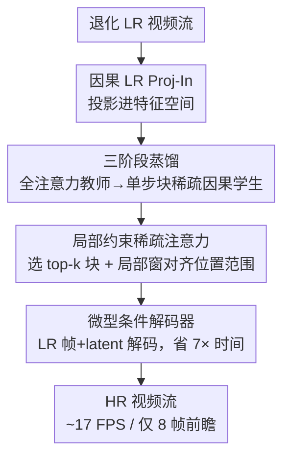

# FlashVSR: Towards Real-time Diffusion-Based Streaming Video Super Resolution

**会议**: CVPR 2026  
**论文**: [CVF Open Access](https://openaccess.thecvf.com/content/CVPR2026/html/Zhuang_FlashVSR_Towards_Real-time_Diffusion-Based_Streaming_Video_Super_Resolution_CVPR_2026_paper.html)  
**代码**: https://zhuang2002.github.io/FlashVSR/ （项目页，承诺开源代码/模型/数据集）  
**领域**: 视频超分 / 图像视频复原  
**关键词**: 视频超分辨率, 扩散模型, 一步蒸馏, 稀疏注意力, 流式推理

## 一句话总结
FlashVSR 把基于扩散的视频超分（VSR）做成第一个「一步 + 流式」框架：用三阶段蒸馏把全注意力教师压成单步块稀疏因果学生、用局部约束稀疏注意力消除训练/推理分辨率鸿沟、再加一个吃 LR 帧做条件的微型解码器替掉占 70% 耗时的 VAE 解码，在单张 A100 上做到 768×1408 视频约 17 FPS、比最快的一步扩散 VSR 还快 11.8×，且能稳定泛化到 1440p。

## 研究背景与动机
**领域现状**：视频超分要从退化视频里恢复高质量帧，是手机摄影、直播、AIGC 内容的刚需。近两年扩散模型（Upscale-A-Video、STAR、SeedVR、DOVE 等）把 VSR 的画质拉得很高，靠的是视频扩散先验和强大的 3D 时空注意力来保证时序一致。

**现有痛点**：但「高分辨率 + 高画质 + 实时 + 任意长」这四个目标对扩散式 VSR 还远未解决，作者归纳出三座大山——（1）**前瞻延迟高**：受显存限制，长视频被切成有重叠的片段独立处理，既冗余又带来等于一个片段长度（约 80 帧）的 lookahead 延迟；（2）**稠密 3D 注意力太贵**：全时空注意力随分辨率二次增长，高分辨率/长视频下贵到不可接受；（3）**训练-测试分辨率鸿沟**：在中等分辨率上训练的注意力模型在 1440p 这类高分辨率上明显退化，只能靠推理时空间分块（tiling）硬扛，又制造了新的冗余计算。

**核心矛盾**：扩散 VSR 的画质来自「稠密 3D 注意力 + 多步去噪 + 整段处理」，而效率/实时/可扩展恰恰被这三件事拖死——画质和部署可行性之间存在尖锐 trade-off。更隐蔽的是，作者发现分辨率鸿沟的根因不在网络容量，而在 **RoPE 位置编码的周期性**：推理时位置范围远超训练范围，某些 RoPE 维度开始重复模式，自注意力被污染，于是出现重复纹理和模糊。

**本文目标**：同时干掉这三座山——把多步降成一步、把整段处理改成流式、把稠密注意力改成稀疏，并且不靠分块就泛化到超高分辨率。

**切入角度**：作者抓住一个 VSR 区别于视频生成的关键观察——**VSR 强条件于 LR 帧**。视频生成需要干净的历史帧来保证运动合理，而 VSR 的运动信息本就写在 LR 输入里，所以「干净历史 latent」对 VSR 不是必需的。这条观察让它能甩掉自回归生成里代价高昂的「逐帧串行展开」，改成全帧并行训练。

**核心 idea**：用一条「全注意力教师 → 块稀疏因果学生 → 一步学生」的三阶段蒸馏，配上对齐训练/推理位置范围的局部稀疏注意力和吃 LR 条件的微型解码器，把扩散 VSR 压成可流式、近实时、能上超高分辨率的实用系统。

## 方法详解

### 整体框架
FlashVSR 建在 Wan 2.1-1.3B 视频扩散模型之上（用 LoRA rank 384 微调），整条 pipeline 由三件互补的创新拼成：一个**三阶段蒸馏管线**负责把贵教师逐步压成单步流式学生；一个**局部约束稀疏注意力**在压注意力成本的同时对齐训练/推理的位置编码范围、消除分辨率鸿沟；一个**微型条件解码器（TC Decoder）**替掉单步 DiT 之后变成新瓶颈的 3D VAE 解码器。训练数据则来自作者自建的 VSR-120K（12 万视频 + 18 万图像）。

推理时，输入退化的 LR 视频流，经因果 LR Proj-In 投影进特征空间，单步 Sparse-Causal DiT 用块稀疏因果注意力 + KV-cache 流式产出干净 latent，最后 TC Decoder 结合 LR 帧把 latent 解成 HR 帧——全程只引入 8 帧前瞻延迟。

### 关键设计

**1. 三阶段蒸馏管线：把贵教师逐步逼成可并行训练的单步流式学生**

直接训一个单步、稀疏、因果、流式的 VSR 极不稳定，作者把它拆成三步递进。**Stage 1（视频-图像联合 SR 训练）**：把预训练的 Wan2.1 视频扩散适配成超分教师，把图像当成单帧视频（$f=1$）统一进 3D 注意力，用块对角分段掩码限制注意力只在同一段内进行，注意力权重为

$$\alpha_{ij}=\frac{\exp\!\big(q_i k_j^\top/\sqrt{d}\big)\,\mathbb{1}[\mathrm{seg}(i)=\mathrm{seg}(j)]}{\sum_l \exp\!\big(q_i k_l^\top/\sqrt{d}\big)\,\mathbb{1}[\mathrm{seg}(i)=\mathrm{seg}(l)]}$$

这一阶段**不加块稀疏约束**，让教师保留完整时空先验；同时引入轻量 LR Proj-In 层把 LR 直接投影进特征空间（而非走 VAE 编码器），用标准 flow matching 损失训练。**Stage 2（块稀疏因果注意力适配）**：把全注意力 DiT 改造成 Sparse-Causal DiT——加因果掩码（每个 latent 只看当前和过去）、把 LR Proj-In 改成因果版以支持流式，并把注意力换成块稀疏（细节见设计 2），只用视频数据继续 flow matching 训练。**Stage 3（分布匹配一步蒸馏）**：把 Stage 2 的学生再精炼成单步模型 $G_{one}$，用 DMD（分布匹配蒸馏）框架——Stage 1 的全注意力 DiT 当真实教师 $G_{real}$、它的拷贝 $G_{fake}$ 学习假 latent 分布，学生只吃 LR 帧 + 高斯噪声、所有 latent 在统一 timestep 下用块稀疏因果掩码训练。

这套设计真正的杀手锏是**全帧并行训练**：以往自回归视频扩散靠 student forcing 缓解误差累积，但必须「预测上一帧→串行展开」，训练吞吐低、优化慢。FlashVSR 因为认定 VSR 不需要干净历史 latent（运动写在 LR 里），可以一次性并行训所有帧，时序一致性交给后层网络通过 KV-cache 去精修，于是训练既高效又彻底消除了训练-推理鸿沟。总损失结合分布匹配蒸馏、flow matching 和像素重建（$\lambda=2$）：

$$L=\underbrace{L_{DMD}(z_{pred},G_{one},G_{real},G_{fake})}_{\text{分布匹配蒸馏}}+\underbrace{L_{FM}(z_{pred},G_{fake})}_{\text{flow matching}}+\underbrace{\|x_{pred}-x_{gt}\|_2^2+\lambda L_{lpips}(x_{pred},x_{gt})}_{\text{解码重建}}$$

**2. 块稀疏因果注意力：把稠密 3D 注意力砍到 10-20% 又不掉点**

稠密 3D 自注意力随分辨率二次增长是效率的元凶。FlashVSR 把 query/key 切成不重叠的 $(2,8,8)$ 块、reshape 成 $(B,\text{block\_num},128,C)$（$\text{block\_num}=L/128$），块内平均池化得到紧凑的块级特征，先算一张粗粒度的「块对块」注意力图，只对其中 **top-k 最相关的块对**施加完整的 $128\times128$ 注意力（用原始 $Q,K,V$）。这把注意力成本降到稠密基线的 10-20%、却几乎不掉性能——本质是承认时空注意力里绝大多数交互是冗余的，先用便宜的粗筛定位真正相关的区域，再把昂贵的精算只花在它们身上。这也是据作者所知**首个在扩散式 VSR 上用稀疏注意力**的工作。

**3. 局部约束稀疏注意力：用局部窗对齐位置编码范围，消除超高分辨率鸿沟**

这是对「为什么高分辨率会崩」的根因式回答。作者分析发现，中分辨率训练的模型到 1440p 会出现重复纹理和模糊，根源是 **RoPE 的周期性**：推理位置范围远超训练范围时，某些 RoPE 维度开始重复其模式，自注意力被污染。既然 RoPE 是相对位置编码，只要在推理时把每个 query 的注意力**限制在一个局部空间邻域**，有效位置范围就和训练时一致，鸿沟自然消失——而且完全不需要空间分块（tiling）。作者给出两种局部窗规则：**Boundary-Preserved**（边界保留，保真度更好）和 **Boundary-Truncated**（边界截断，感知质量略高），最终的稀疏注意力掩码在这两类局部掩码之内计算。这一招让 FlashVSR 在 2688×1536 这种超高分辨率上仍能输出细节丰富的结果。

**4. 微型条件解码器（TC Decoder）：吃 LR 帧做条件，把占 70% 耗时的 VAE 解码砍掉 7×**

当 DiT 被加速到单步后，因果 3D VAE 解码器反而成了新瓶颈——在 768×1408 下吃掉近 70% 推理时间。直觉做法是直接缩小原 VAE 解码器，但那样会掉画质。作者的关键洞察是：解码不必只靠 latent，**LR 帧本身就携带了大量高频结构信息**。于是 TC Decoder 把 LR 帧和 latent 一起作为条件输入（LR 经 pixel shuffle 进入），让 HR 重建大幅简化，从而能用更紧凑的网络。训练时结合像素监督和对原 Wan 解码器的蒸馏：

$$L=\|x_{pred}-x_{gt}\|_2^2+\lambda L_{LPIPS}(x_{pred},x_{gt})+\|x_{pred}-x_{wan}\|_2^2+\lambda L_{LPIPS}(x_{pred},x_{wan})$$

结果：解码快约 7×，画质几乎和原 Wan 解码器无异；同样参数预算下还稳定优于「无条件」的微型解码器变体，证明「条件于 LR」这一步是有效的，不是单纯压模型。

### 损失函数 / 训练策略
全程在 VSR-120K 上训练，LR-HR 配对由 RealBasicVSR 退化管线合成。在 32 张 A100-80G 上训练（评测统一在单卡 A100），三阶段 batch size 均为 32，分别约耗 2/1/2 天；Stage 1 用 89 帧片段（768×1280）+ 配对图像，Stage 2/3 只用视频。AdamW，学习率 $1\times10^{-5}$，weight decay 0.01。TC Decoder 在 61 帧 384×384 片段上单独训练约 2 天。

## 实验关键数据

### 主实验
在合成（YouHQ40 / REDS / SPMCS）、真实（VideoLQ）、AIGC（AIGC30）五个数据集上对比，FlashVSR 在感知指标（MUSIQ / CLIPIQA / DOVER）上全面领先；保真指标（PSNR/SSIM）略低，作者指出这类指标偏好更平滑的输出，而视觉上 FlashVSR 明显更锐利更真实。

| 数据集 | 指标 | SeedVR2-3B(最强一步基线) | DOVE | Ours-Tiny |
|--------|------|------|------|------|
| YouHQ40 | CLIPIQA ↑ | 0.4909 | 0.4437 | 0.5221 |
| YouHQ40 | MUSIQ ↑ | 62.31 | 61.60 | 66.63 |
| REDS | MUSIQ ↑ | 61.83 | 65.51 | 67.43 |
| VideoLQ | CLIPIQA ↑ | 0.2593 | 0.2906 | 0.3601 |
| AIGC30 | CLIPIQA ↑ | 0.4767 | 0.4665 | 0.5087 |

效率才是真正的卖点（101×768×1408 视频）：

| 指标 | STAR | DOVE | SeedVR2-3B | Ours-Full | Ours-Tiny |
|------|------|------|------|------|------|
| 峰值显存 (GB) | 24.86 | 25.44 | 52.88 | 18.33 | **11.13** |
| 运行时 (s) / FPS | 682.5 / 0.15 | 72.8 / 1.39 | 70.6 / 1.43 | 15.5 / 6.52 | **5.97 / 16.92** |
| 参数 (M) | 2492.9 | 10548.6 | 3391.5 | 1780.1 | 1752.2 |

即比最快一步模型 SeedVR2-3B 快 11.8×、显存只用 1/5；前瞻延迟仅 8 帧（STAR 32 帧，其余 101 帧）。

### 消融实验

| 配置 | 关键指标 | 说明 |
|------|---------|------|
| 13.6% Sparse vs Full Attention (REDS) | PSNR 24.11 vs 24.65；MUSIQ 67.43 vs 65.77 | 稀疏注意力质量几乎持平甚至感知更好，计算降约 7.4× |
| TC Decoder vs Wan vs 无条件 (PSNR) | 31.08 vs 32.58 vs 29.96 | 条件解码器明显优于无条件变体，逼近原 Wan |
| 局部注意力：Global vs Boundary-Truncated vs Boundary-Preserved | PSNR 24.21 / 24.60 / 24.87 | 两种局部窗在所有指标上都超全局，超高分辨率泛化更稳 |

### 关键发现
- **稀疏注意力几乎免费**：13.6% 稀疏度在 768×1408 上把每 8 帧推理从 1.105s 降到 0.355s（3.1× 加速），质量几乎无损，说明时空注意力里大量交互确实冗余。
- **TC Decoder 是解锁实时的关键一环**：单步化后解码占 70% 耗时，把它从 11.13s 砍到 1.60s（约 7×），且「条件于 LR」稳定优于「单纯缩小」，证明加速来自更聪明的条件设计而非牺牲容量。
- **局部窗专治超高分辨率**：在 1536×2688、平均 305 帧的视频上，两种局部窗全面超越全局注意力，验证了「分辨率鸿沟源于 RoPE 周期性、局部约束即可对齐」这一根因诊断。

## 亮点与洞察
- **「VSR 不需要干净历史 latent」这条观察价值连城**：正是它把 VSR 从自回归视频扩散的串行展开里解放出来，换来全帧并行训练，是单步流式得以成立的根本前提——可迁移到任何「强条件于输入」的视频复原/翻译任务。
- **把高分辨率崩坏归因到 RoPE 周期性，是少见的根因式诊断**：多数工作用空间分块硬补，FlashVSR 反过来用一个零成本的局部窗约束彻底消除鸿沟，思路干净且省算力。
- **三件创新各打一个瓶颈、互补叠加**：蒸馏管线打多步、稀疏注意力打 3D 注意力成本、TC Decoder 打解码瓶颈——典型的「先 profiling 找瓶颈、再逐个击破」工程方法论，值得复用。
- **TC Decoder 让 LR 帧第二次发挥作用**：LR 既是超分输入、又是解码条件，等于把已有的高频信息复用了两遍，免费简化重建。

## 局限与展望
- **保真指标（PSNR/SSIM）系统性偏低**：虽然作者论证这是感知-保真 trade-off 且视觉更优，但在对保真度严格的场景（如医学/取证）可能不占优。
- **依赖大规模自建数据 VSR-120K + 32 卡训练**：训练成本高，复现门槛不低；蒸馏管线对教师质量和退化合成管线（RealBasicVSR）有依赖。
- **top-k 块稀疏的 k、局部窗大小（1152×1152）等是固定超参**：在更极端分辨率/运动下是否仍最优、是否需要自适应，论文未充分探讨。
- **改进思路**：把局部窗/稀疏度做成随分辨率与运动幅度自适应；探索把「条件解码」思想推广到其他扩散复原任务（去模糊、去噪、压缩伪影修复）。

## 相关工作与启发
- **vs SeedVR2-3B / DOVE（一步扩散 VSR）**：它们已是一步模型但仍整段处理、靠稠密 3D 注意力，导致高延迟、高显存；FlashVSR 加上流式 + 块稀疏 + 微型条件解码，质量更好的同时快 11.8×、显存仅 1/5，并把前瞻延迟从 101 帧降到 8 帧。
- **vs STAR / Upscale-A-Video（多步扩散 VSR）**：多步去噪 + chunk 推理，慢到 0.1–0.15 FPS；FlashVSR 单步 + 流式快 114–136×。
- **vs Diffusion Forcing 系流式视频生成**：它们为生成任务设计，靠 teacher/student forcing 处理误差累积、需串行展开；FlashVSR 抓住 VSR 强条件于 LR 的特性，改成全帧并行，训练效率显著更高。

## 评分
- 新颖性: ⭐⭐⭐⭐⭐ 首个一步 + 流式的扩散 VSR，RoPE 周期性诊断 + 局部窗解法很有洞见
- 实验充分度: ⭐⭐⭐⭐⭐ 五数据集对比 + 效率表 + 三组消融，覆盖合成/真实/AIGC/超高分辨率
- 写作质量: ⭐⭐⭐⭐⭐ 三座山 → 三创新对应清晰，瓶颈分析有数据支撑
- 价值: ⭐⭐⭐⭐⭐ 把扩散 VSR 推到近实时可部署，附带开源 VSR-120K 数据集

<!-- RELATED:START -->

## 相关论文

- [\[CVPR 2026\] PhysSkin: Real-Time and Generalizable Physics-Based Skin Simulation](physskin_real-time_and_generalizable_physics-based_animation_via_self-supervised.md)
- [\[ACL 2026\] Qayyem: A Real-time Platform for Scoring Proficiency of Arabic Essays](../../ACL2026/others/qayyem_a_real-time_platform_for_scoring_proficiency_of_arabic_essays.md)
- [\[CVPR 2026\] VideoMaMa: Mask-Guided Video Matting via Generative Prior](videomama_mask-guided_video_matting_via_generative_prior.md)
- [\[ECCV 2024\] Real-Data-Driven 2000 FPS Color Video from Mosaicked Chromatic Spikes](../../ECCV2024/others/real-data-driven_2000_fps_color_video_from_mosaicked_chromatic_spikes.md)
- [\[CVPR 2026\] VideoWorld 2: Learning Transferable Knowledge from Real-world Videos](videoworld_2_learning_transferable_knowledge_from_real-world_videos.md)

<!-- RELATED:END -->
