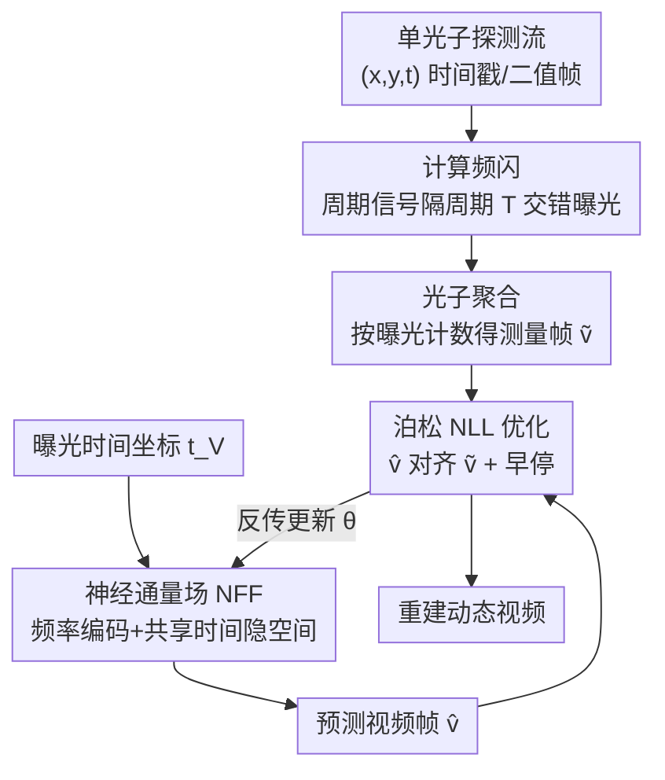

# Inter-Photon-Limited Videography

**会议**: CVPR 2026  
**论文**: [CVF Open Access](https://openaccess.thecvf.com/content/CVPR2026/html/Xie_Inter-Photon-Limited_Videography_CVPR_2026_paper.html)  
**代码**: [项目主页](https://www.dgp.toronto.edu/inter-photon)（未明确开源代码仓库）  
**领域**: 计算摄影 / 单光子成像 / 视频重建  
**关键词**: 单光子相机、光子受限成像、神经通量场、泊松似然、计算频闪

## 一句话总结
本文提出"光子间隔受限（inter-photon-limited）"这一被忽视的成像速度极限——当场景变化快于光子到达时像素会"失明"，并用一个把时间重参数化为"每光子周期数 $f_p$"的统一框架来刻画其难度，再用一个无需预训练的**神经通量场（Neural Flux Field, NFF）**结合泊松统计与空间-时间先验，从极稀疏的单光子探测中重建出此前无法企及的动态视频。

## 研究背景与动机
**领域现状**：所有视频采集——无论强光高速还是暗光单光子——都默认"光量足以支撑所设定的帧率与时长"。从百万帧/秒拍子弹、十亿帧/秒看光传播，到单光子雪崩二极管（SPAD）相机在黑暗中成像，这条假设贯穿各种照度与速度区间。

**现有痛点**：当光太弱或场景太快，以致一个像素在两次相邻光子之间无法收到第二个光子时，这个像素对"光子间隔时间窗内发生的外观变化"就是**完全失明**的——无论相机本身多快都没用。现有研究普遍把"光子受限成像"（绝对光量低、能逐个数光子）和"光子间隔受限"（光量相对于场景变化速度而言太低）混为一谈，而后者要难得多，现有重建方法在一般场景下直接失效。

**核心矛盾**：唯一能突破光子间隔极限的旧方法只适用于**周期信号**（靠跨多个重复周期累积光子来推断结构），对任意非周期场景无能为力；自监督图像/视频重建虽有强先验，却是为稠密像素阵列设计的，无法直接处理跨长时间窗采集到的、可能上百万个的**异步光子事件**。burst 类方法要求通量变化远慢于光子到达，CNN/扩散类方法单次前向只能吃有限光子、无法利用长程时空依赖。

**本文目标**：(1) 给出一个能跨照度、跨时间尺度统一比较成像难度的参数化；(2) 造一个在光子间隔受限区也能稳健重建任意（周期+非周期）动态场景的方法。

**切入角度**：作者的关键观察是——描述"重建不确定性"的天然变量不是绝对时间，而是**相对光子到达节奏的频率**。一个"亮且快"和一个"暗且慢"的正弦通量，只要每周期平均收到相同数量光子，其光子时间戳分布就完全一致，对相机来说"同样不确定"。

**核心 idea**：把时间按"每像素平均光子探测数"重新计时（$p = t/\tau(x)$，每个像素跑自己的"光子时钟"），从而得到时间尺度无关的**光子间隔频率 $f_p$（每光子周期数）**；再用一个无需训练的神经通量场去拟合"与单光子到达时间戳一致"的通量函数。

## 方法详解

### 整体框架
方法分两层。**分析层**给出光子间隔重参数化：把瞬时通量 $\phi(x,t)$ 改写到"光子时钟"域 $\psi(x,p)$，定义光子间隔频率 $f_p = f\,\tau(x)$（单位：每光子周期数），$f_p=1$ 是一道软的物理速度墙——超过它像素在一个周期内连一个光子都收不全。**重建层**就是 Neural Flux Field：给每一帧曝光 $\mathcal{V}_k$ 关联一个时间坐标 $t_{\mathcal{V}_k}$，喂进网络预测该帧通量积分 $\hat v$，再把预测帧和"按曝光把光子计数得到的测量帧" $\tilde v$ 用泊松负对数似然对齐，端到端优化网络参数（单场景自监督、无大规模训练）。对周期信号，额外用**计算频闪**把曝光设计成隔周期 $T$ 交错的多段区间，等效"补光"以降低 $f_p$。

### 关键设计

**1. 光子间隔重参数化：用"每光子周期数 $f_p$"把成像难度变成时间尺度无关的统一量**

痛点是：用绝对的时间、频率、帧率、功率来描述通量，会把问题死死绑在某个具体硬件上，遮蔽"可用光子量"与"可达速度"之间的本质关系。作者改用相对单位——按平均光子探测数重新计时 $p=t/\tau(x)$，其中 $\tau(x)=\big(\frac{1}{T}\int_0^{T}\phi(x,t)\,dt\big)^{-1}$ 是该像素的平均光子间隔。在这个"光子时钟"下，通量写作 $\psi(x,p)=\phi(x,p\,\tau(x))\,\tau(x)$，对应的光子间隔频率为

$$f_p = f\,\tau(x).$$

它的妙处在于：$f_p$ 直接把"光子到达有多快"和"场景变化有多快"耦合进一个频率——$f_p$ 越大越光子饥饿。作者据此把横跨近 14 个数量级的 14 个视频数据集（从强光高速相机到 quanta 视频、瞬态成像）摆到同一张图上比较，发现几乎所有系统（哪怕单光子设计）都工作在"每周期到成千上万光子"的舒适区，真正在 $f_p\!>\!1$ 区作业的方法寥寥无几且都失效。这套参数化还揭示了不同采集策略的本质差异：**降低光照**会同时抬高光子间隔和 $f_p$，而**缩短曝光**不会；**频闪同步**到调制频率 $f_{\text{sync}}$ 相当于把时间在周期处折叠，整体把频率缩小 $f_{\text{sync}}$ 倍，等效"给场景补光"。

**2. 神经通量场（NFF）：用像素无关的共享时间隐空间，让"亮像素"教"暗像素"重建**

光子间隔受限重建的根本困难是单像素信号太稀疏。NFF 把网络 $\Phi_\theta$ 设计成"时间坐标 → 整帧通量积分"的映射 $\hat v = \Phi_\theta(t_{\mathcal V})$，由三段构成：先对归一化到 $[-1,1]$ 的时间坐标做**时间频率编码**

$$\gamma(t_{\mathcal V}) = \big[\,t_{\mathcal V},\ \sin(\boldsymbol\omega t_{\mathcal V}),\ \cos(\boldsymbol\omega t_{\mathcal V})\,\big]^{T},\quad \boldsymbol\omega=[2,2^2,\dots,2^{L}]^{T},\ L=16,$$

以增强对高频变化的表达；编码经一个**与像素位置无关**的四层 MLP，产出高维隐向量后 reshape 成 $16\times16\times256$ 的空间张量，再经四个残差块＋$2\times$ 双线性上采样的卷积网络（改自隐式视频表示），最后 softplus 得到预测帧。关键在于前几层强制"像素无关"，逼网络学到一个**所有像素共享的时间隐空间**：因为同一个时间频率 $f$ 在不同 $\tau(x)$ 下对应天差地别的 $f_p$，这种共享让低 $f_p$ 的"亮"像素所揭示的变化，去帮助同 $f$、却高得多 $f_p$ 的"暗"像素一起被推断出来——这正是从稀疏光子里抠出动态的先验来源。

**3. 泊松负对数似然自监督优化：把"和光子到达时间戳一致"当作唯一监督**

由于没有 ground-truth 视频，作者把光子探测建模为速率 $\hat v(x)$ 的非齐次泊松过程，监督信号就是把落入每帧曝光 $\mathcal V$ 的光子数出来的测量帧 $\tilde v(x)=\lvert\{(x_i,y_i,t_i)\mid (x_i,y_i)=\mathbf x,\ t_i\in\mathcal V\}\rvert$。优化目标是跨所有曝光的泊松 NLL：

$$\mathcal L(\theta)=\sum_{k=1}^{N}\sum_{\mathbf x}\big[\hat v_k(\mathbf x)-\tilde v_k(\mathbf x)\log \hat v_k(\mathbf x)\big].$$

这是一种深度图像先验式（deep-image-prior-like）做法——网络本身的结构充当空间-时间正则，单场景从头优化、不需任何外部训练数据，因而必须**早停**（固定 30 epoch）以免把网络拟合到光子的随机噪声上。

**4. 计算频闪：对周期信号设计隔周期交错曝光，等效降低 $f_p$**

对含周期成分的通量（灯闪、频闪灯、投影仪、ToF、脉冲激光等），作者用 harmonic probing 在原始光子数据的傅里叶谱里定位强峰、迭代精修出基频 $f$（周期 $T=1/f$），然后把帧曝光设计成**不连续**的多段区间，各段以周期 $T$ 间隔：

$$\mathcal V_k=\bigcup_{m=1}^{M}\big[t_{\mathcal V_k}+mT,\ t_{\mathcal V_k}+mT+\Delta t\big],$$

并取 $N=\lfloor T/\Delta t\rfloor$ 个曝光覆盖整个周期。这样每帧能跨多个重复周期累积光子、同时保留一个周期内的时间结构，把光子间隔频率大幅压低，使原本 $f_p>10^6$ 的瞬态级场景也进入可重建范围。

### 损失函数 / 训练策略
PyTorch 实现，Adam（学习率 $10^{-3}$），batch size 128 个时间坐标。典型数据集 10 万–13 万帧，固定训练 30 epoch 并早停，单场景在 NVIDIA RTX A6000 Ada 上约 3.5 小时收敛。

## 实验关键数据

### 主实验
在捕获与合成数据集上评测，覆盖 $f_p$ 从 $<1$ 到 $>10^6$，光子数据形式包含 quanta 图像序列与皮秒级时间戳流。

| 场景 / 对比方法 | $f_p$（含 thinning） | 现象 / 结论 |
|----------------|---------------------|-------------|
| 人跳进电梯 + 快闪灯（SPAD512，100 kfps） | 2.37 → 5284 | 即便稀释 3 个数量级，NFF 仍重建出动态外观 |
| 泡沫子弹 + 手部（aperiodic，极稀疏） | 0.447 → 309 | 子弹被稀释到不可见时，较慢较大的手仍被准确重建（印证 $f_p$ 理论） |
| 牛奶溅麦片（高速视频模拟光子流） | 比高速相机高 5 个数量级 | 在远高于常规高速相机（$f_p=10^{-6}\!\sim\!10^{-4}$）处达到可比画质 |
| 54 Hz 旋转风扇（40 光子/像素/秒） vs UWB [45] | 44.7 → 5188 | UWB 谐波跌到噪声底致结果模糊；NFF 重建清晰，且稀释后仍成立 |
| 风扇时间戳（free-running SPAD，计算频闪） | $>10^6$ | 用计算频闪恢复出优于 UWB 的慢动作与瞬态视频 |

### 消融实验

| 配置 | 现象 | 说明 |
|------|------|------|
| NFF（完整） | 各 $f_p$ 下稳健 | 共享时间隐空间 + 泊松 NLL + （周期时）计算频闪 |
| NFF w/o 计算频闪 vs UWB（风扇） | NFF 清晰，UWB 模糊 | 单像素方法忽略空间相关、谐波被噪声淹没 |
| QBP [24]（吉他，thinned 到 $f_p$=4.21 / 21.07） | QBP 塌缩成二值图样，NFF 恢复细弦运动 | 光子太少无法时间累积 |
| bit2bit [22]（钻头，$f_p$=2.82 → 1995 → 32359） | 原序列 OK，激进稀释后运动模糊 | 时间上下文窗太小、长程相关性消失 |

### 关键发现
- **$f_p$ 是可预测重建难度的统一标尺**：同一场景里慢且大的物体（手）天然产生更多光子、更易恢复，快且小的物体（子弹）更难——与 $f_p$ 参数化的预测一致。
- **空间相关性是突破口**：UWB 等单像素周期方法在极端 $f_p$ 下因忽略空间结构而失败，NFF 的像素无关隐空间正是靠跨像素信息制胜。
- **旧方法的失效模式各异但同源**：burst/QBP 缺光子可累、CNN/bit2bit 时间窗太短，本质都是无法在光子间隔尺度上利用长程时空依赖。

## 亮点与洞察
- **把"难度"重新定义成 $f_p$**：用"每光子周期数"这一时间尺度无关量，把横跨 14 个数量级、主被动混杂的成像系统统一到一张可比的地图上，并清晰区分"光子受限"与"光子间隔受限"两个长期被混淆的概念——这是概念层面的真正贡献。
- **无训练神经通量场**：单场景自监督、靠网络结构当先验 + 泊松 NLL，绕开了"百万异步光子事件无法喂进稠密重建网络"的工程墙。
- **可迁移的设计**：像素无关的共享时间隐空间这一招，可迁移到任何"信号在不同位置稀疏程度差异极大、想让稠密处反哺稀疏处"的逆问题（如低剂量 CT、稀疏光场）。
- **计算频闪**：把物理频闪同步搬进重建端（软件折叠时间），对任何已知周期成分的弱信号都有降噪/提速潜力。

## 局限与展望
- 作者承认：与其他 deep-image-prior 类方法一样需早停防过拟合；NFF 训练在短积分帧上，反复查询长曝光开销大；在训练时间索引之间**插值**时重建质量会下降。
- "是否应把光子间隔重参数化直接用进重建过程（而非仅作分析工具）"仍是开放问题。
- 自己看：单场景 3.5 小时优化、缺乏跨场景泛化，离实时/在线还有距离；评测多依赖对原始序列的人工 thinning 来制造高 $f_p$，真实极端低光采集的覆盖有限。
- 展望：结合生成模型学到的自然视频强统计先验、以及主动照明 / 计算频闪中照明与场景的交互，进一步推高可重建的 $f_p$。

## 相关工作与启发
- **vs UWB（passive ultra-wideband）[45]**：UWB 靠强周期先验、单像素处理，能进光子间隔受限区但忽略空间相关、且只对周期信号有效；NFF 同时处理周期与非周期、靠跨像素共享隐空间，在风扇等极端 $f_p$ 下不模糊。
- **vs Quanta Burst Photography [24]**：QBP 对齐并合并光子提升信噪比，但要求通量变化远慢于光子到达；一旦稀释到光子间隔受限，累积无从谈起、结果塌成二值图样。
- **vs bit2bit [22]**：bit2bit 用 CNN 从光子时间戳直接恢复通量，但时间上下文窗有限，$f_p$ 一高长程相关性消失即运动模糊；NFF 的神经场可在任意积分域上可微表示长程依赖。
- **vs 周期-only 旧方法 [28,45]**：仅能靠多周期重复推断结构，本文把能力扩展到任意非周期场景。

## 评分
- 新颖性: ⭐⭐⭐⭐⭐ 提出并形式化了"光子间隔受限"这一被忽视的成像速度极限，并给出时间尺度无关的 $f_p$ 统一框架，概念与方法双创新。
- 实验充分度: ⭐⭐⭐⭐ 覆盖真实+合成、$f_p$ 跨 6 个数量级、对比 UWB/QBP/bit2bit 多基线，但多靠人工 thinning 制造极端区，且无定量 PSNR 主表（以可视化为主）。
- 写作质量: ⭐⭐⭐⭐⭐ 概念递进清晰，$f_p$ 参数化与几张分析图把动机讲得极透。
- 价值: ⭐⭐⭐⭐⭐ 为光子饥饿成像提供了通用难度标尺与可落地的无训练重建范式，对单光子/瞬态成像社区有奠基意义。

<!-- RELATED:START -->

## 相关论文

- [\[CVPR 2026\] Dual-Band Thermal Videography: Separating Time-Varying Reflection and Emission Near Ambient Conditions](dual_band_thermal_videography_separating_time-varying_reflection_and_emission_ne.md)
- [\[CVPR 2025\] Image Reconstruction from Readout-Multiplexed Single-Photon Detector Arrays](../../CVPR2025/others/image_reconstruction_from_readout-multiplexed_single-photon_detector_arrays.md)
- [\[ICLR 2026\] A Scalable Inter-edge Correlation Modeling in CopulaGNN for Link Sign Prediction](../../ICLR2026/others/a_scalable_inter-edge_correlation_modeling_in_copulagnn_for_link_sign_prediction.md)
- [\[ICML 2026\] Spatial Priors via Space Filling Curves for Small and Limited Data Vision Transformers](../../ICML2026/others/spatial_priors_via_space_filling_curves_for_small_and_limited_data_vision_transf.md)
- [\[ACL 2025\] Inter-Passage Verification for Multi-evidence Multi-answer QA](../../ACL2025/others/inter-passage_verification_for_multi-evidence_multi-answer_qa.md)

<!-- RELATED:END -->
