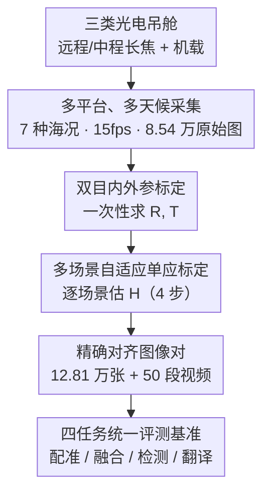

# MMVIP: A Visible-infrared Paired Dataset for Multi-weather Marine Vision

**会议**: CVPR 2026  
**论文**: [CVF Open Access](https://openaccess.thecvf.com/content/CVPR2026/html/Yin_MMVIP_A_Visible-infrared_Paired_Dataset_for_Multi-weather_Marine_Vision_CVPR_2026_paper.html)  
**代码**: https://github.com/yyppptjr/MMVIP  
**领域**: 多模态数据集 / 可见光-红外配准与融合 / 海事视觉感知  
**关键词**: 可见光-红外配对、海洋视觉、多天候、图像配准、跨模态融合

## 一句话总结
MMVIP 是第一个大规模、真实采集的海事可见光-红外配对数据集——用多平台光电吊舱在 7 种恶劣海况下采集 12.8 万张严格时空对齐的图像对和 50 段视频，并配套一条"内外参标定 + 多场景自适应单应标定"的对齐流水线，同时在配准、融合、检测、跨模态生成四个任务上系统评测了 SOTA 方法，揭示现有算法在海面低纹理、强反光、低光照等条件下普遍掉点。

## 研究背景与动机
**领域现状**：现代船舶普遍同时装可见光与红外相机——可见光纹理结构丰富但在弱光/恶劣天气下退化严重，红外靠热辐射在低光遮挡场景里能突出船只目标却缺乏纹理细节。两者天然互补，但互补的前提是**精确的跨模态配准**，配准+融合才能为下游的检测、跟踪提供一致的空间参考。

**现有痛点**：跨模态配对数据是整个方向的瓶颈。现有可见光-红外对齐数据集（TNO、RoadScene、MSRS、LLVIP 等）几乎全是城市道路场景；少数海事数据集（Tri-band、RGBT-Tiny、SMD、VAIS）要么**缺乏精确对齐**（无法做融合研究），要么**没有真实恶劣天气**，规模也偏小，没法支撑真实海洋环境下的多模态感知研究。

**核心矛盾**：海面是一个对配准格外不友好的场景——大片海域低纹理、低对比度，特征点稀疏，单应估计极易失败；而且海况和天气（晴/阴/夜/雨/雾/弱光/台风）会显著改变背景深度与光照，导致几何关系漂移。没有一个既精确对齐、又覆盖多天候的海事数据集，算法既无法训练也无法被公平评测。

**本文目标**：(1) 构建第一个覆盖多天候、多海况的大规模海事可见光-红外配对数据集；(2) 给出一条能在多种硬件平台、稀疏特征下稳健对齐的标定流水线；(3) 在四个核心视觉任务上建立可复现的 benchmark。

**核心 idea**：用多平台光电吊舱采集真实多天候海况配对数据，再用"逐场景自适应"的单应标定来破解海面稀疏特征带来的对齐难题，把数据集做成一个统一的跨模态海事评测平台。

## 方法详解

### 整体框架
MMVIP 本质是"一套数据采集与对齐流水线 + 一个四任务评测平台"。流程是：用三类光电吊舱（自研远程/中程长焦吊舱 + 大疆 Matrice 4 机载吊舱）在 7 种代表性海况下同步拍摄可见光与红外视频；对每个吊舱先做一次性的双目内外参标定得到旋转 $R$、平移 $T$；再针对每种场景做多场景自适应的单应标定，估计像素级对齐的单应矩阵 $H$；最后把对齐后的图像对组织成图像配准、图像融合、目标检测、可见光→红外翻译四个任务的统一 benchmark。最终得到 128,100 张精确对齐图像、50 段标注视频，并额外提供未配准原始数据以支持配准算法评测。

### 关键设计

**1. 多平台、多天候的真实配对采集：覆盖现有海事数据集缺失的恶劣海况**

针对现有海事数据集"要么缺天气、要么缺对齐、要么规模小"的痛点，作者用三类光电吊舱（球形吊舱、UAV 机载吊舱、远程吊舱）跨多个海域采集，所有设备的红外热像仪与可见光相机都**刚性固定**安装以保证平台间数据差异最小。红外热像仪波长 8–14 µm（分辨率 1280×1024 与 640×512），可见光 1920×1080，视频采样率 15 fps。最终在晴、阴、夜、雨、雾、弱光、台风 7 种天候下采到 85,400 张原始图像（统一为 960×770 或 640×512），经配准后累计 128,100 张精确对齐图，外加 50 段用于连续时序分析的标注视频。和 Tab. 1 里的同类数据集相比，MMVIP 是唯一同时满足"覆盖 A–G 全部 7 种天气 + 港口/海岸/外海多场景 + UAV/海岸固定/船载多视角 + 精确对齐"的，规模上 50 段序列、12.8 万帧、5 万张标注也明显领先海事同类。

**2. 双目内外参标定：在固定光路下建立一次性的几何基准**

每个吊舱的可见光与红外相机光路和安装位置固定，作者先对两台相机各做单目内参标定（焦距、主点、畸变系数），再做双目外参标定，估计两相机之间的旋转矩阵 $R$ 与平移向量 $T$，从而建立红外与可见光相机的几何对应关系。由于光学参数和安装位置固定，这一步通常只需一次静态标定即可，为后续逐场景的单应估计提供了稳定的物理几何先验。

**3. 多场景自适应单应标定：破解海面低纹理、稀疏特征下的逐场景对齐**

这是流水线的核心创新。海面大区域低纹理低对比，且不同海况下背景深度和光照变化会让几何关系漂移，固定一个单应矩阵根本对不准。作者设计了一套"逐场景估计+验证"的自适应单应标定，分四步：①**多场景数据采集**——在 7 种海况下同步采图，保证标定集覆盖多样海况以提升估计矩阵的鲁棒性与泛化；②**跨模态特征匹配**——用 MINIMA 算法提取两模态对应特征点，低纹理/低对比区域辅以人工精修，并让选取的点在整个视场均匀分布、剔除误匹配以保证几何一致性；③**单应估计**——基于匹配点对用 RANSAC 去外点 + 最小二乘拟合，使有效匹配点上 $H$ 的重投影误差最小；④**验证与场景映射**——每个代表性场景用多对同步图像反复估计 $H$，选平均重投影误差最小者，再做人工辅助的视觉一致性检查（重点对齐海平线、船体轮廓等关键区域）。单应可写成

$$\boldsymbol{x}' = H\boldsymbol{x}, \qquad H = K_2\left(R - \frac{T\boldsymbol{n}^\top}{d}\right)K_1^{-1}$$

其中 $\boldsymbol{x},\boldsymbol{x}'$ 是可见光与红外图像的齐次像素坐标，$K_1,K_2$ 是两相机内参，$R,T$ 是外参，$\boldsymbol{n},d$ 是主平面法向量与平面距离。由于海面动态、视点变化，$\boldsymbol{n},d$ 很难精确求得，作者改用数据驱动的特征点拟合方案，以平均重投影误差作精度指标、用外参约束保证几何一致与物理合理性。这套"逐场景自适应"取代固定单应，是它能在多平台、稀疏特征海况下稳健对齐的关键。

**4. 四任务统一评测基准：把数据集做成跨模态海事感知的评测平台**

对齐后的数据被组织成四个核心任务的统一评测流水线：图像配准（评配准鲁棒性，把方法分稀疏/半稠密/稠密三类）、图像融合（评跨模态信息融合与细节保持）、目标检测（船 Ship 与浮标 Buoy 两类小目标）、可见光→红外翻译（评跨模态生成在海事挑战下的泛化）。这让 MMVIP 不只是一堆图，而是一个能横向比较 SOTA、暴露各方法在真实海况下短板的 benchmark。

### 损失函数 / 训练策略
本文是数据集论文，不提出新模型，因此没有自有训练目标。检测任务上以 YOLO11 预训练权重为 baseline 在 MMVIP 上微调（90% 训练 / 10% 测试，100 epoch，batch size 16）；配准/融合/翻译任务均直接用各 SOTA 方法的官方预训练模型和默认参数评测。所有实验在单张 NVIDIA RTX 4090 上完成。

## 实验关键数据

### 图像配准（主实验）
在 9 种跨模态匹配算法上评测，用 8 个指标：失败率 Failed、不准率 Inaccurate、MSE/RMSE（像素级几何误差，越低越好）、SSIM/NCC/MI（全局一致性与信息保留，越高越好）、单对 960×770 图像的配准耗时。失败定义沿用 GLAMpoints（关键点/对应不足、镜像翻转、缩放因子越界）；MSE > 0.01 或 SSIM < 0.9 记为"不准"（阈值经经验复核设定）。

| 类别 | 方法 | Failed↓ | Inaccurate↓ | MSE↓ | RMSE↓ | SSIM↑ | NCC↑ | MI↑ | Time(ms) |
|------|------|---------|-------------|------|-------|-------|------|-----|----------|
| 稠密 | **MINIMA-RoMa** | **0%** | **49.64%** | **0.0039** | **0.0464** | **0.8822** | **0.8537** | **1.6406** | 2078.8 |
| 稠密 | RoMa | 0% | 62.86% | 0.0191 | 0.0917 | 0.8244 | 0.6940 | 1.4684 | 5042.6 |
| 稀疏 | MINIMA-LG | 5.14% | 58.14% | 0.0198 | 0.0921 | 0.8297 | 0.6860 | 1.4733 | **480.8** |
| 半稠密 | XoFTR | 1.29% | 71.57% | 0.0357 | 0.1359 | 0.7558 | 0.5804 | 1.2945 | 1035.7 |
| 半稠密 | ELoFTR | 14.86% | 66.07% | 0.0535 | 0.1799 | 0.6908 | 0.4123 | 1.0172 | 763.9 |
| 半稠密 | JamMa | 0.29% | 95.93% | 0.0888 | 0.2414 | 0.5555 | 0.2738 | 0.6713 | 630.5 |

结论：稠密匹配（RoMa/MINIMA-RoMa）显著优于半稠密和稀疏，但耗时高；微调后的 MINIMA-RoMa 在六个指标上全面最优（MSE 仅 0.0039、SSIM 0.8822），几何一致性最好、配准结果最接近真值；稀疏类的 MINIMA-LG 在性能-速度间取得平衡（480.8 ms 最快）。几乎所有算法在夜间、雾天等低光低纹理场景都明显退化——说明"又快又准的红外-可见光配准"仍是开放问题。

### 目标检测（消融/分析）
YOLO11 在可见光 vs 红外两种模态上分别微调，对船（Ship）和浮标（Buoy）做检测：

| 目标 | 模态 | Precision | Recall | mAP@0.5 | mAP@0.5:0.95 |
|------|------|-----------|--------|---------|---------------|
| Ship | 可见光 | **0.925** | **0.871** | **0.907** | **0.754** |
| Ship | 红外 | 0.901 | 0.813 | 0.854 | 0.590 |
| Buoy | 可见光 | 0.874 | 0.667 | **0.795** | **0.527** |
| Buoy | 红外 | **0.889** | 0.511 | 0.599 | 0.345 |

### 关键发现
- **可见光整体优于红外**：船类在可见光上 precision/mAP 都更高，说明更丰富的纹理和更清晰的目标边界有利于检测定位；浮标在红外上 precision 略高，但 mAP 显著更低，暴露红外在小目标、高 IoU 条件下的局限。
- **模态各有所长、随天候反转**：定性结果（Fig. 6）显示低能见度下可见光漏检/误检更多，红外能更稳健地凸显船与浮标；但雨天红外热对比减弱、检测性能反而明显下降——没有哪个模态在所有海况下都赢，这正是要做配对多模态数据集的理由。
- **融合算法各有偏向**：DCEvo、LUT-Fuse、TDFusion 偏重红外、目标突出但丢船体纹理；RFfusion、TG-ECNet、GIFNet 偏重可见光、背景细节丰富但弱光远距目标凸显不足——现有融合方法在"跨模态信息平衡 + 结构保持"上仍有明显短板。
- **跨模态翻译普遍泛化差**：可见光→红外翻译中，MINIMA 在低能见度下会生成不存在的"幻影"结构，sRGB-TIR 常把高温源错判为低强度区，ThermalGen 结果模糊缺乏热层次；DR-AVIT 相对稳定。整体说明现有方法在反光、盐雾、高动态范围等海事特有挑战下泛化能力有限。

## 亮点与洞察
- **把"对齐难"当成一等公民来解决**：海面低纹理导致特征稀疏、单应易失败，作者没有用一个全局固定单应糊弄过去，而是设计逐场景自适应标定 + 人工精修关键区域，这是它敢号称"精确对齐"的底气，也是海事跨模态数据集和城市道路数据集最本质的区别。
- **同时提供已配准与未配准原始数据**：未配准原始数据让别人能真正评测配准算法本身，而不是被迫接受作者的对齐结果——这是一个对配准研究友好、容易被忽视但很重要的设计。
- **一套数据撑起四个任务**：配准/融合/检测/翻译共享同一批精确对齐对，使得跨任务、跨模态的横向结论（如"红外利于弱光检测但雨天失效"）能在同一数据基底上成立，可迁移到任何需要多天候多模态评测的感知场景（如无人机巡检、夜间监控）。

## 局限与展望
- **没有提出新方法**：贡献集中在数据与 benchmark，所有任务都是评测现成 SOTA，没有针对海事难点提出新模型或对齐网络。
- **检测评测较单薄**：仅用 YOLO11 单一检测器、只评船与浮标两类，且作者自述整体检测性能"只是一般"；融合与翻译任务以定性比较为主，缺乏统一的定量指标表（⚠️ 以原文为准）。
- **对齐流水线含人工环节**：跨模态特征匹配和验证步骤都依赖人工精修，规模化扩展和完全自动化仍是问题。
- **作者展望**：未来将扩充更具挑战的条件（如强烈的平台运动模糊、极小目标），并指出可见光→红外生成研究应重点抑制海面杂波、增强弱温度对比。

## 相关工作与启发
- **vs 城市道路 VI 数据集（LLVIP / RoadScene / FMB / KAIST）**：它们对齐精确但全是街道/行人场景、天气种类少（FMB 最多 A–E），无法覆盖海面反光、盐雾、台风等海事退化；MMVIP 把场景搬到港口/海岸/外海并覆盖 A–G 全部 7 种天候。
- **vs 海事 VI 数据集（Tri-band / RGBT-Tiny / SMD / VAIS）**：Tri-band、SMD、VAIS 的海事子集缺乏精确空间对齐（不适合融合研究），RGBT-Tiny 虽大但海事样本不足、缺复杂海洋天气；MMVIP 在"精确对齐 + 多天候 + 多平台视角"上同时补齐，是首个真正面向多天候海事融合的配对数据集。

## 评分
- 新颖性: ⭐⭐⭐⭐ 首个大规模多天候海事可见光-红外精确配对数据集，自适应单应标定有针对性
- 实验充分度: ⭐⭐⭐⭐ 四任务、覆盖 20+ SOTA 方法横向评测，但融合/翻译偏定性、检测器单一
- 写作质量: ⭐⭐⭐⭐ 动机清晰、数据集对比表与标定流程讲得明白
- 价值: ⭐⭐⭐⭐ 填补海事跨模态配对数据空白，提供可复现 benchmark 与开放数据，下游价值高

<!-- RELATED:START -->

## 相关论文

- [\[CVPR 2026\] Customized Fusion: A Closed-Loop Dynamic Network for Adaptive Multi-Task-Aware Infrared-Visible Image Fusion](customized_fusion_a_closed-loop_dynamic_network_for_adaptive_multi-task-aware_in.md)
- [\[CVPR 2026\] EXOTIC: External Vision-driven Incomplete Multi-view Classification](exotic_external_vision-driven_incomplete_multi-view_classification.md)
- [\[CVPR 2026\] Computer Vision with a Superpixelation Camera](computer_vision_with_a_superpixelation_camera.md)
- [\[CVPR 2026\] NeuroRule: Bridging Vision and Logic with Differentiable Rule Induction](neurorule_bridging_vision_and_logic_with_differentiable_rule_induction.md)
- [\[CVPR 2026\] Towards Knowledge-augmented Bayesian Deep Learning For Computer Vision](towards_knowledge-augmented_bayesian_deep_learning_for_computer_vision.md)

<!-- RELATED:END -->
