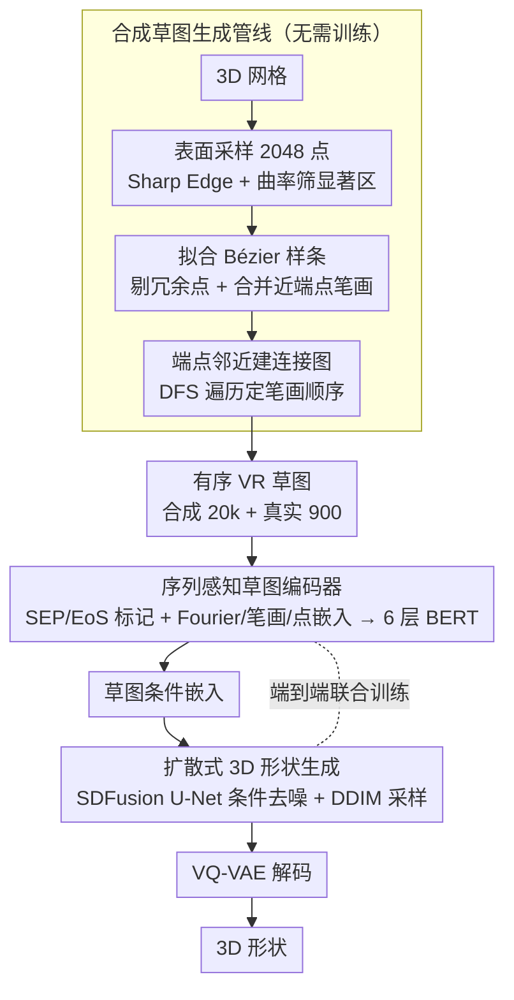

# Order Matters: 3D Shape Generation from Sequential VR Sketches

**会议**: CVPR 2026  
**arXiv**: [2512.04761](https://arxiv.org/abs/2512.04761)  
**作者**: Yizi Chen, Sidi Wu, Tianyi Xiao, Nina Wiedemann, Loic Landrieu (ETH Zurich, LIGM/ENPC/IP Paris)
**代码**: [VRSketch2Shape](https://chenyizi086.github.io/VRSketch2Shape_website/)  
**领域**: 其他  
**关键词**: VR sketching, 3D shape generation, stroke order, diffusion model, sketch-to-shape

## 一句话总结
提出 VRSketch2Shape 框架，首次建模 VR 草图的笔画时序信息，通过序列感知的 BERT 编码器与基于扩散的 3D 生成器（SDFusion），从有序 VR 草图生成高保真 3D 形状，同时贡献了包含 20k 合成 + 900 真实草图的多类别数据集。

## 研究背景与动机

创建高质量 3D 内容是建筑和工业设计的核心需求。传统 CAD 工具（如 Blender）学习曲线陡峭，不适合快速构思和早期探索。文本引导的 3D 生成虽有进展，但自然语言过于模糊，难以精确指定复杂几何体。

VR 草图绘制让用户直接在 3D 空间中探索和迭代想法，消除了 2D 草图固有的透视歧义和遮挡问题。然而，现有 VR 草图到形状的方法面临三大挑战：

- **数据稀缺**：唯一的公开基准 3DVRChair 仅包含 1,005 对椅子类别的草图-形状对
- **几何错位**：手绘草图自然存在透视和深度感知误差，与目标形状不完全对齐
- **时序信息丢失**：现有方法将 VR 草图视为无序点云，丢弃了笔画顺序和长度等关键信号——而这些信号编码了连接性、结构和设计意图的重要信息

核心洞察：**笔画顺序很重要**。人类绘画时先画全局轮廓再添加细节，这种从粗到细的顺序蕴含了丰富的结构先验。

## 方法详解

### 整体框架

论文的核心主张就一句话：笔画顺序很重要。人画图时先勾全局轮廓再补细节，这种从粗到细的次序蕴含了结构先验，而以往把 VR 草图当无序点云的方法把它全丢了。VRSketch2Shape 据此搭了一条三段链路——先用一条无需训练的几何管线从 3D 网格批量造出带时序的合成草图解决数据稀缺，再用序列感知的 BERT 编码器把有序笔画编码成条件，最后用扩散式生成器 SDFusion 从该条件生成 3D 形状，编码器与扩散器端到端联合训练。

### 关键设计

**1. 无需训练的合成草图生成管线：用纯几何启发式批量造时序草图，绕开标注稀缺**

唯一公开基准 3DVRChair 只有 1,005 对椅子草图，远不够训练。该管线从任意 3D 网格自动生成带笔画顺序的 VR 草图，约 10 小时产出 20,838 个样本：先在网格表面均匀采 2048 点，用 Sharp Edge Sampling 和曲率阈值（15）保留高曲率结构显著区；再用 EMAP 拟合 Bézier 样条（最大阶 2、最小段长 12），剔除近线性冗余点（余弦距离阈值 0.04）、合并端点距离小于形状尺寸 2% 的笔画；最后按端点空间邻近建连接图做深度优先遍历定序，并以 10% 概率跳过最近连接引入随机性。配套的真实草图则在 Unity VR 界面下由 15 名参与者绘制 900 张（300 椅/200 桌/200 柜/200 飞机），界面带表面吸附机制把绘制点投影到模型表面保证几何对齐。

**2. 序列感知的草图编码器：把笔画顺序和长度真正编码进 token**

要让"顺序"起作用，得在 token 层面就带上次序信息。编码器先把草图标记化为有序笔画序列，插入 SEP（笔画结束）和 EoS（草图结束）特殊标记：
$$\mathcal{S} = [p_1^1, \cdots, p_{n_1}^1, \text{SEP}, \cdots, p_1^S, \cdots, p_{n_S}^S, \text{SEP}, \text{EoS}]$$
每个 3D 坐标 $(x, y, z)$ 用 Fourier 特征编码（$L=10$ 频率）后过 2 层 MLP 得空间嵌入 $E_{\text{spa}}(p) = \text{MLP}_{\text{spa}}([\Phi_{\text{spa}}(x), \Phi_{\text{spa}}(y), \Phi_{\text{spa}}(z)])$；笔画索引 $s$ 和点索引 $i$ 各用正弦编码加线性投影得 $E_{\text{stroke}}(s) = \text{Lin}_{\text{stroke}}(\Phi_{\text{seq}}(s))$、$E_{\text{point}}(i) = \text{Lin}_{\text{point}}(\Phi_{\text{seq}}(i))$，三者求和成最终 token 嵌入 $E(p_i^s) = E_{\text{spa}}(p_i^s) + E_{\text{stroke}}(s) + E_{\text{point}}(i)$，再过 6 层、8 头的 BERT。相比 SketchBERT，它用空间 Fourier 特征而非原始坐标、用可学习笔画分隔符而非拼接 one-hot、用连续 Fourier 编码替代固定查找表，从而灵活处理变长 3D 草图。训练时还配三种增强提鲁棒性：随机遮蔽 15% 笔画、遮蔽剩余笔画中 30% 的点、随机交换 20% 的笔画顺序。

**3. 扩散式 3D 形状生成：以草图编码为条件去噪生成形状**

有了草图条件，生成端用 SDFusion 潜在扩散模型。真值 3D 形状体素化后由预训练 3D VQ-VAE 编码成紧凑潜在表示，U-Net 在 BERT 编码器输出的条件下预测去噪潜在向量，推理时用 100 步 DDIM 从随机噪声生成形状。训练时 VQ-VAE 冻结，U-Net 与草图编码器端到端联合优化，使条件编码直接服务于生成质量。

## 实验关键数据

### Table 2: 定量主结果——草图到形状生成

| 方法 | 3DVRChair (chair only) | | VRSketch2Shape (chair) | | VRSketch2Shape (all) | |
|---|---|---|---|---|---|---|
| | F-score ↑ | CD ↓ | F-score ↑ | CD ↓ | F-score ↑ | CD ↓ |
| LAS-Diffusion⋆ | 26.1 | 66.0 | 37.0 | 51.1 | 40.2 | 27.1 |
| Luo et al. | 26.6 | 35.5 | 42.2 | 13.4 | 48.8 | 13.0 |
| **VRSketch2Shape (ours)** | **31.1** | **25.8** | **64.3** | **4.0** | **69.8** | **4.8** |

VRSketch2Shape 在所有设置下大幅领先：
- 3DVRChair 上 CD 降低 **27%**（25.8 vs 35.5）
- VRSketch2Shape 全类别上 F-score 提升 **43%**（69.8 vs 48.8），CD 降低 **63%**（4.8 vs 13.0）

### Table A-1: DDIM 步数与速度-精度权衡

| DDIM 步数 | F-score ↑ | CD×1000 ↓ | 推理时间 (s/样本) |
|---|---|---|---|
| 10 | 69.24 | 5.04 | 2.26 |
| 25 | 69.70 | 4.82 | 3.06 |
| 50 | 69.74 | 4.89 | 4.47 |
| 100 | 69.80 | 4.78 | 6.33 |

仅 10 步 DDIM 即可达到接近最优性能，推理速度提升 **3 倍**，适合交互式设计场景。

### 消融实验关键发现（零样本，chair 子集）
- **去除序列信息**（w/o ordering）：性能显著下降，证实"顺序确实重要"
- **去除数据增强**：明显退化，简单增强有效提升鲁棒性
- **去除合成预训练**：模型坍缩为平凡解，仅用 200 张真实草图远远不够
- **替换为 SketchBERT 编码器**：准确度大幅下降，3D 适配设计至关重要
- **草图作为点云**（PointNet++）：性能明显退化，证明序列建模而非仅扩散生成器带来了核心提升
- **草图作为图像**（VGG + 多视图渲染）：遮挡导致几何缺失，效果显著变差

### Few-shot 合成到真实迁移
仅 50 张/类别的真实草图微调即可接近最优性能。零样本（不微调）设置下模型已表现强劲，验证了合成草图管线的有效性。

### 部分草图形状补全
仅保留草图前 50% 的点即可达到接近完整草图的性能，反映了人类"先画轮廓再加细节"的绘画习惯。

## 亮点与洞察

- **首次建模 VR 草图时序**：将草图从无序点云提升为有序笔画序列，证明了笔画顺序对形状生成的关键作用
- **无需训练的合成管线**：基于纯几何启发式自动生成时序草图，10 小时产出 2 万+ 样本，有效替代昂贵的人工标注
- **强泛化能力**：合成数据训练 → 真实草图零样本/少样本迁移均有效；对无吸附草图、自由手绘草图、甚至未见类别均有合理输出
- **跨模态形状补全**：利用绘画的时序先验，仅从部分草图即可推断完整 3D 形状，可加速交互式设计流程
- **端到端单阶段训练**：不同于需要多阶段训练或模态对齐的方法，草图编码器和扩散模型联合优化

## 局限性

- **SDF 分辨率受限**：使用冻结的 3D VQ-VAE（$64^3$ SDF 分辨率），限制了细粒度几何细节的重建，生成结果有时偏平滑
- **训练类别多样性不足**：仅在 ShapeNet 的 4 个类别（椅子、桌子、柜子、飞机）上训练，面对差异较大的未见类别（如卡车、床）可能退化为训练类别的形状先验
- **推理速度**：100 步 DDIM 需 ~6.6 秒/样本，其中 99% 时间在潜在去噪，虽可减少步数但仍有实时性瓶颈
- **表面吸附依赖**：真实草图收集依赖吸附工具确保几何对齐，无吸附场景下虽仍可用但精度有所下降

## 相关工作

- **2D 草图 → 3D**：学习确定性映射或扩散模型（Doodle Your 3D、LAS-Diffusion），但受限于单视角歧义和遮挡
- **VR 草图 → 3D**：Luo et al. 和 Chen et al. 将 VR 草图视为无序点云用 PointNet++ 编码，丢弃笔画时序；VRSketch2Gaussian 用 3D 高斯但同样忽略顺序
- **草图合成**：CLIPasso/DiffSketcher 等优化参数化曲线但需要预训练模型指导；本文的纯几何启发式管线完全无需训练
- **草图编码**：SketchBERT 在 2D 草图上建模序列，但直接扩展到 3D 效果不佳；本文的 Fourier 特征 + 可学习分隔符设计更适配 3D 场景
- **3D 生成**：SDFusion 等潜在扩散模型在文本/图像条件下表现出色，本文首次将其拓展到序列 VR 草图条件

## 评分
- 新颖性: ⭐⭐⭐⭐ — 首次系统性地将笔画时序引入 VR 草图到 3D 形状生成，问题 formulation 清晰有说服力
- 实验充分度: ⭐⭐⭐⭐⭐ — 两个数据集、多个基线、详尽消融（设计选择+草图格式+DDIM步数）、零样本/少样本/部分草图/无吸附/自由手绘/未见类别全面评估
- 写作质量: ⭐⭐⭐⭐ — 结构清晰，图文并茂，方法描述严谨，合成管线和编码器设计讲解透彻
- 价值: ⭐⭐⭐⭐ — 为 VR 草图驱动的 3D 设计提供了完整的数据+模型+管线解决方案，数据集和代码开源，可推动该领域发展

<!-- RELATED:START -->

## 相关论文

- [\[CVPR 2026\] Modeling the Visual Ambiguity of Human Sketches](modeling_the_visual_ambiguity_of_human_sketches.md)
- [\[CVPR 2026\] Progressive Neural Architecture Generation](progressive_neural_architecture_generation.md)
- [\[AAAI 2026\] Higher-Order Responsibility](../../AAAI2026/others/higher-order_responsibility.md)
- [\[ECCV 2024\] High-Fidelity 3D Textured Shapes Generation by Sparse Encoding and Adversarial Decoding](../../ECCV2024/others/high-fidelity_3d_textured_shapes_generation_by_sparse_encoding_and_adversarial_d.md)
- [\[NeurIPS 2025\] MetaFind: Scene-Aware 3D Asset Retrieval for Coherent Metaverse Scene Generation](../../NeurIPS2025/others/metafind_scene-aware_3d_asset_retrieval_for_coherent_metaverse_scene_generation.md)

<!-- RELATED:END -->
