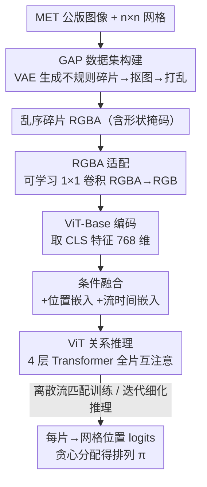

# The Missing GAP: From Solving Square Jigsaw Puzzles to Handling Real World Archaeological Fragments

**会议**: CVPR 2026  
**论文**: [CVF Open Access](https://openaccess.thecvf.com/content/CVPR2026/html/Shahar_The_Missing_GAP_From_Solving_Square_Jigsaw_Puzzles_to_Handling_CVPR_2026_paper.html)  
**代码**: 无（论文称接收后公开数据集、VAE 模型与评测脚本）  
**领域**: 拼图重组 / 文化遗产重建  
**关键词**: 拼图重组、考古碎片、离散流匹配、ViT、数据集基准

## 一句话总结
针对"现有拼图求解器只会拼方块碎片、一碰真实考古碎片就崩"的鸿沟，本文同时给出两件东西：用 VAE 学真实考古碎片形状分布造出的不规则碎片拼图基准 GAP，以及一个用 ViT + 离散流匹配做排列学习的求解框架 PuzzleFlow——靠全片整体视觉关系而非边界匹配来拼，在 GAP 上显著超过经典与近期 SOTA。

## 研究背景与动机
**领域现状**：拼图求解（jigsaw puzzle solving）从 1960 年代就被当作计算机视觉的经典任务，近年从手工优化（贪心、遗传算法、松弛标注）一路演进到 CNN、ViT、扩散、强化学习等数据驱动框架，在 JPwLEG、Deepzzle 等基准上分数越刷越高。

**现有痛点**：几乎所有这些方法都共享一个被刻意简化的设定——**只处理严格的正方形碎片**，碎片之间要么没有缝隙，要么是固定均匀的缝（如 JPwLEG 的 44px 固定 gap）。可这个领域被反复拿来当卖点的"杀手级应用"恰恰是**考古文物重建**：真实陶片、壁画碎片形状极不规则、边缘被严重侵蚀、碎片间缝隙又宽又非线性。学术基准和真实场景之间存在一条没人填的鸿沟（the missing GAP）。

**核心矛盾**：主流求解器的成功建立在**边界连续性匹配**上——靠碎片接缝处的纹理/颜色能不能接上来判断相邻。可一旦边缘被侵蚀，原本的边界信息直接消失，"沿边界拼"这条路就断了。同时真实考古碎片数据稀缺（RePAIR 仅几百块扫描碎片），无法支撑大规模训练和系统比较。

**本文目标**：（1）造一个既贴近真实考古碎片几何复杂度、又能大规模生成、还兼容现有方法输入格式的基准；（2）设计一个不依赖边界匹配、能处理任意形状碎片的求解框架。

**切入角度**：作者观察到，与其靠局部边界，不如让模型对**整片碎片表面**做整体关系推理——全局视觉模式、颜色分布、结构连贯性这些"超越局部边界"的特征，在边缘被侵蚀后依然存在。

**核心 idea**：用 VAE 学真实碎片形状分布来"伪造"大规模不规则碎片拼图（GAP），再把拼图重组形式化为**排列学习**问题，用离散流匹配 + ViT 做迭代式整体推理（PuzzleFlow）。

## 方法详解

### 整体框架
本文是"数据集 + 求解器"双贡献，两条流水线串起来看：**GAP 生成管线**负责造题——从大都会博物馆（MET）公共版权图像出发，叠一个 $n\times n$ 规则网格，在每个格子中心用 VAE 生成一块不规则碎片掩码、抠出带纹理的碎片，再随机打乱，得到 9 片（GAP-3，$3\times3$）或 25 片（GAP-5，$5\times5$）的不规则碎片拼图；**PuzzleFlow 求解管线**负责解题——把 $N$ 块乱序碎片（存成带 alpha 通道的 RGBA 图）经一个可学习 $1\times1$ 卷积投影成 RGB，送入 ImageNet-21K 预训练的 ViT-Base 取 [CLS] 特征，叠加位置嵌入和流时间嵌入后过 4 层 Transformer 做碎片间关系推理，最后 MLP 头对每块碎片预测它该放到哪个网格位置（$N$ 维 logits）。训练用离散流匹配让模型学"逐步细化"而非一次到位，推理时从随机排列出发迭代 20 步贪心分配。

### 关键设计

**1. GAP 数据集：用 VAE 把"真实考古碎片的形状分布"批量复制成拼图基准**

痛点是真实考古碎片（RePAIR 仅 958 块 Pompeii 扫描碎片）太少，没法大规模训练和公平比较，而现有合成基准又只会造方块或固定缝。作者训练一个 VAE 去学真实碎片掩码的形状分布：编码器四层卷积（通道 32/64/128/256）把 $128\times128$ 输入压到 $256\times8\times8$，再投到 64 维潜空间并重参数化，对称解码器还原成 $128\times128$ 二值掩码，用 Adam（lr=$10^{-4}$）训 44 epoch，损失是重建（二值交叉熵）+ KL 正则。生成的连续掩码再经一套形态学后处理（0.5 阈值二值化、填补内部空洞、取最大连通域、半径 2 像素圆盘闭运算平滑边界）保证是单块连续碎片。生成时对每张 MET 图叠 $3\times3$ 或 $5\times5$ 网格、在格子中心放 VAE 碎片掩码抠纹理、随机打乱，得到 GAP-3（$384\times384$ 画布）与 GAP-5（$640\times640$）各 20,000 个拼图。

之所以有效，是因为它在"保真"和"可控大规模"之间找到了平衡：几何验证显示生成碎片与真实碎片在核心形状特征上几乎一致（面积差 $<1\%$：10,617 vs 10,716 px²；长宽比差 3%；solidity 差 2%），边缘复杂度特征因 VAE 平滑有中等差异（周长差 12%、圆度 18%、顶点数 22%、凹陷 19%），PCA 投影（解释 63.2% 方差）显示真实/合成碎片分布大幅重叠且无模式坍塌。同时它保留网格拓扑，兼容现有方法的输入格式，让 GAP 成为"对现有方法够难、但用对架构可解"的基准。

**2. 离散流匹配做排列学习：把"一步到位猜排列"换成"逐步细化"**

把重组形式化为：给定 $N$ 块乱序碎片 $X=\{x_1,\dots,x_N\}$（来自 $k\times k$ 网格，$N=k^2$），求最优排列 $\pi^\*\in S_N$ 使 $\pi^\*=\arg\max_{\pi\in S_N} p_\theta(\pi\mid X)$。直接在 $N!$ 的组合空间里硬猜既难优化又是离散输出。作者借鉴流匹配并扩展到离散排列：定义随时间 $t\in[0,1]$ 演化的分布，$t=0$ 时 $\pi_0\sim\text{Uniform}(S_N)$（纯随机），$t=1$ 时 $\pi_1=\pi^\*$（真值），中间用线性调度的随机插值——每块碎片 $i$ 以概率 $t$ 取真值位置 $\pi_1^{(i)}$、以概率 $1-t$ 取随机位置 $\pi_0^{(i)}$。训练目标是在当前状态 $\pi_t$ 和时间 $t$ 条件下预测每块的目标位置：

$$\mathcal{L}_{\text{CFM}}=\mathbb{E}_{t,\pi_0,\pi_t}\Big[-\sum_{i=1}^{N}\log p_\theta(\pi_1^{(i)}\mid x_i,\pi_t,t)\Big]$$

这样模型学的是"在已有部分摆放基础上做增量修正"，而非单次盲猜。消融显示换成单步交叉熵直接预测会掉 5.9 个 PA 点，证明迭代细化对那些视觉锚点弱的碎片尤其有用。

**3. RGBA 适配：用可学习 $1\times1$ 卷积把形状掩码"喂"进 ViT，而不是简单丢掉 alpha**

不规则碎片的边界几何本身就是关键空间线索，而方块拼图方法习惯直接丢掉 alpha 通道只留 RGB。本文把碎片存成 $128\times128$ 的 RGBA（alpha 编码不规则形状掩码），在送入 ViT 前过一个可学习的 $1\times1$ 卷积把 RGBA 投影成 RGB——它自适应地把四个通道融合，让形状信息得以保留，而不是粗暴丢弃。这一步对不规则拼图至关重要：消融里把它换成训练后直接 RGB 切片（标准方块做法），所有指标都大幅下降（PA 掉 19.3 点）。作者强调这不是"作弊式"的不公平优势，而是面对"形状本身就重要"的新任务时的必要适配——方块拼图不需要显式形状编码，不规则碎片则非要不可。

**4. ViT 全片关系推理 + 迭代贪心推理：靠整体视觉关系而非边界匹配**

碎片经 $1\times1$ 卷积后插值到 $224\times224$ 过 ViT-Base，取 [CLS] token 作为全局摘要特征 $h_i\in\mathbb{R}^{768}$。再叠加两路条件嵌入：当前位置索引经查找表得位置嵌入 $e_{\text{pos}}(p_i)$，流时间 $t$ 经 192 维正弦嵌入 + 两层 SiLU MLP 得时间嵌入 $e_{\text{time}}(t)$，残差相加成 $z_i=h_i+e_{\text{pos}}(p_i)+e_{\text{time}}(t)$，同时编码"长什么样、现在在哪、流到第几步"。随后 $L=4$ 层预归一化 Transformer（12 头、隐层 768、FFN 3072）让每块碎片注意到其余所有碎片，学到跨越局部边界的全局视觉关系（颜色分布、结构连贯性）。MLP 头（$768\to3072\to N$）输出位置 logits，softmax 给出 $p_\theta(\pi_1^{(i)}=j\mid x_i,\pi_t,t)$。推理时从随机排列出发，$S=20$ 步、每步 $t=s/S$ 重算 logits 并对未占用位置做贪心分配 $\arg\max_{j\in P_{\text{avail}}}\ell_i[j]$，复杂度 $O(N^2)$，远低于穷举 $O(N!)$ 或匈牙利匹配 $O(N^3)$。

### 损失函数 / 训练策略
训练目标即上面的条件流匹配损失 $\mathcal{L}_{\text{CFM}}$。优化用 AdamW（lr=$10^{-5}$，weight decay 0.01），OneCycleLR 调度 10% warmup，dropout 0.1，FP16 混合精度，30 epoch、batch size 8，单卡 RTX4090。

## 实验关键数据

### 主实验
GAP-3（$3\times3$，9 片）与 GAP-5（$5\times5$，25 片）各 3,000 测试拼图。指标：Perfect Accuracy（PA，完全拼对的拼图比例）、Absolute Accuracy（AA，碎片放对的比例）、Spatial Relationship Accuracy（SRA，真值邻居对在预测中保持同向相邻的比例，公式见原文式 6——衡量是否学到局部空间结构）。对比 7 个方法（经典贪心/遗传 + FCViT、JPDVT、DiffAssemble、JigsawGAN、PuzLM 五个深度方法，均在 GAP 上以相近预算重训）。

| 数据集 | 指标 | PuzzleFlow | 次优 | 提升 |
|--------|------|-----------|------|------|
| GAP-3 | PA (%) | **28.5** | 25.2 (FCViT) | +3.3 |
| GAP-3 | AA (%) | **62.9** | 60.7 (FCViT) | +2.2 |
| GAP-3 | SRA (%) | **55.7** | 47.6 (FCViT) | +8.1 |
| GAP-5 | PA (%) | **0.3** | 0.0 | +0.3 |
| GAP-5 | AA (%) | **29.1** | 21.9 (DiffAssemble) | +7.2 |
| GAP-5 | SRA (%) | **19.8** | 14.7 (DiffAssemble) | +5.1 |

GAP-3 上经典法（贪心/遗传）和部分深度法（JPDVT、PuzLM）PA 直接 0%、AA 仅 11–15%（近随机），印证不规则几何 + 边缘侵蚀击穿了边界匹配类方法的假设。PuzzleFlow 的 SRA 优势（+8.1 / +12.3 点）尤其明显，说明它捕捉到了更好的空间连贯性。GAP-5 把组合复杂度从 $9!\approx3.6\times10^5$ 拉到 $25!\approx1.55\times10^{25}$，多数 baseline 退化到近随机，PuzzleFlow 与最强 baseline 的差距反而从 GAP-3 到 GAP-5 拉大，说明其整体视觉推理在更大配置下"部分存活"。

### 消融实验
全部在 GAP-3 上，相同训练协议。

| 配置 | PA | AA | SRA | ΔPA | 说明 |
|------|----|----|----|-----|------|
| Full Model | 28.5 | 62.9 | 55.7 | – | 完整模型 |
| Direct Prediction | 22.6 | 57.9 | 50.0 | -5.9 | 流匹配换单步交叉熵 |
| Frozen ViT | 7.4 | 42.2 | 34.5 | -21.1 | 冻结预训练 ViT，掉点最多 |
| Fixed Slicing (RGB-only) | 9.2 | 44.4 | 34.6 | -19.3 | 丢掉 alpha 形状信息 |
| 0 Layers | 10.1 | 45.1 | 35.3 | -18.4 | 无任务专用 Transformer 层 |
| 2 Layers | 23.5 | 58.8 | 50.6 | -5.0 | 层数 L=2 |
| 6 Layers | 24.7 | 59.5 | 52.2 | -3.8 | L=6 不再提升 |

### 关键发现
- **微调 ViT 是头号功臣**：冻结预训练 ViT 掉 21.1 个 PA 点，是所有消融里最大的——ImageNet 特征必须适配才能学到跨边界连续性、抗侵蚀和全局连贯模式。作者据此建议后续工作优先研究迁移学习策略。
- **RGBA 形状适配次之**：丢掉 alpha 掉 19.3 点，证明对不规则碎片"形状必须显式编码"。
- **层数 $L=4$ 够用**：$L=0$ 仅 10.1% PA（光靠预训练特征不行），$L=2$ 跳到 23.5%，$L=4$ 附近趋于平台，$L=6$ 无增益，故选 $L=4$ 平衡精度与效率。
- **流匹配带来稳定但温和的增益**（+5.9 PA），作者认为更好的推理算法（如祖先采样）可能解锁更大收益。
- GAP-3 仍有约 71%、GAP-5 几乎全部拼图未被解出，留下充足提升空间，使 GAP 成为长期有效的基准。

## 亮点与洞察
- **"造数据"和"造方法"双管齐下**：用 VAE 学真实碎片分布来低成本生成大规模逼真不规则碎片，绕开了考古数据稀缺的死结——这种"用生成模型把稀缺真实分布复制成可控基准"的思路可迁移到任何真实样本难收集的领域（医学、遥感损毁数据等）。
- **把组合排列问题接到流匹配上**：离散流匹配让模型学"逐步修正排列"而非一次硬猜，把 $N!$ 的搜索压成 $O(N^2)$ 的迭代贪心，是连续生成范式向离散结构化输出迁移的一个干净示例。
- **SRA 指标补上了 PA/AA 的盲区**：PA/AA 只看绝对位置对错，分不清"保住了局部结构但整体平移"和"纯随机"，SRA 用同向相邻保持率把"是否学到空间关系"量化出来——这个指标设计本身对评测拼图/布局类任务很有借鉴价值。
- **最反直觉的点**：边界侵蚀后传统"沿缝拼"全线崩溃，但靠 ViT 对整片表面做整体关系推理反而能拼，说明全局视觉语义比局部边界更鲁棒。

## 局限与展望
- **绝对性能仍低**：GAP-3 PA 仅 28.5%、GAP-5 PA 几乎为 0，离实用的考古重建还很远；作者自己也强调留下了 74% 的 PA 缺口。
- **合成≠真实**：GAP 碎片由 VAE 生成 + 形态学平滑，边缘比真实断裂"干净"（周长/顶点/凹陷差 12–22%），真实文物的纹理磨损、缺片、3D 翘曲都未建模；作者承认真实考古材料才是最终金标准。
- **仍假设网格拓扑且无缺片**：当前设定保留 $n\times n$ 规则网格、碎片数已知且无缺失，真实场景常是碎片数未知、有缺片、非网格排布。
- **流匹配收益偏小**：+5.9 PA 相比微调（+21.1）和形状编码（+19.3）显得温和，作者指出更优推理（祖先采样等）或许能放大收益，是直接的改进方向。

## 相关工作与启发
- **vs 边界匹配类（贪心 / 遗传 / DNN-Buddies / Deepzzle）**：它们靠碎片接缝处的边界相似度拼，本文转向全片整体关系推理，区别在于侵蚀消除边界信息后前者退化到近随机、后者仍可工作。
- **vs FCViT**：FCViT 用 ViT 回归碎片连续坐标，是 GAP-3 上最强 baseline；本文同样基于 ViT 但把输出建模成离散排列 + 流匹配迭代，SRA 高出 8.1 点，空间连贯性更好。
- **vs DiffAssemble / JPDVT（扩散类）**：它们用扩散/图去噪做重组，本文用离散流匹配，推理只需 20 步贪心、$O(N^2)$，在 GAP-5 大配置下退化更慢。
- **vs RePAIR 等真实碎片数据集**：RePAIR 提供真实扫描碎片但规模有限（数百块），本文用 VAE 学其分布生成 4 万拼图，在保真与规模之间取得平衡。

## 评分
- 新颖性: ⭐⭐⭐⭐ 把"VAE 造考古碎片基准"和"离散流匹配解排列"组合起来填补真实场景鸿沟，角度新但两个组件都基于成熟技术。
- 实验充分度: ⭐⭐⭐⭐ 7 个 baseline、两规模数据集、四组消融 + 新指标 SRA，较扎实；但绝对性能低、缺真实考古碎片上的验证。
- 写作质量: ⭐⭐⭐⭐ 动机清晰、数据集与方法两条线交代完整，公式与消融自洽。
- 价值: ⭐⭐⭐⭐ GAP 作为公开基准 + SRA 指标对拼图/文化遗产重建社区有持续价值，留有大量提升空间。

<!-- RELATED:START -->

## 相关论文

- [\[CVPR 2026\] VideoWorld 2: Learning Transferable Knowledge from Real-world Videos](videoworld_2_learning_transferable_knowledge_from_real-world_videos.md)
- [\[CVPR 2026\] UniMERNet: A Universal Network for Real-World Mathematical Expression Recognition](unimernet_a_universal_network_for_real-world_mathematical_expression_recognition.md)
- [\[CVPR 2026\] Clair Obscur: an Illumination-Aware Method for Real-World Image Vectorization](clair_obscur_an_illumination-aware_method_for_real-world_image_vectorization.md)
- [\[CVPR 2026\] Multi-view Crowd Tracking Transformer with View-Ground Interactions Under Large Real-World Scenes](multi-view_crowd_tracking_transformer_with_view-ground_interactions_under_large_.md)
- [\[CVPR 2025\] Zero-Shot Head Swapping in Real-World Scenarios](../../CVPR2025/others/zero-shot_head_swapping_in_real-world_scenarios.md)

<!-- RELATED:END -->
