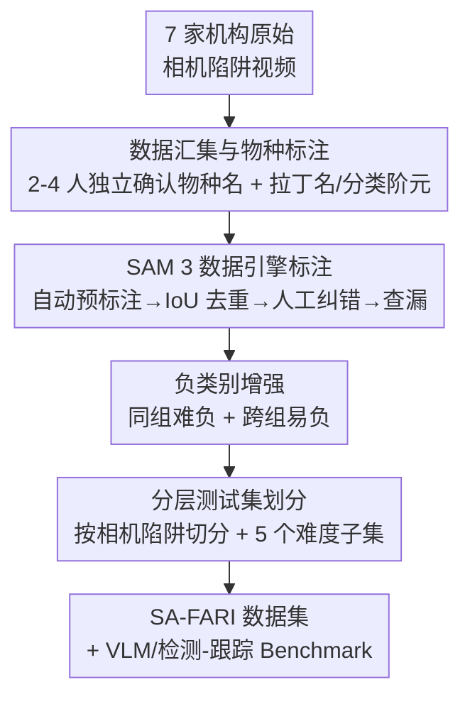

# The SA-FARI Dataset: Segment Anything in Footage of Animals for Recognition and Identification

**会议**: CVPR 2026  
**论文**: [CVF Open Access](https://openaccess.thecvf.com/content/CVPR2026/html/Wasmuht_The_SA-FARI_Dataset_Segment_Anything_in_Footage_of_Animals_for_CVPR_2026_paper.html)  
**代码**: https://conservationxlabs.com/SA-FARI （数据集主页）  
**领域**: 视频分割 / 多目标跟踪  
**关键词**: 多动物跟踪、视频分割、相机陷阱、野生动物保护、masklet 标注

## 一句话总结
SA-FARI 是迄今最大的野外多动物跟踪（MAT）数据集——汇集横跨 4 大洲、741 个站点、99 个物种、长达 10 年的 11,609 段相机陷阱视频，并首次提供大规模**人工核验的时空分割 masklet**（16,224 条个体轨迹、94 万个框/掩码），实验证明用它训练能让 SAM 3 在 HOTA 类指标上提升 20 点以上。

## 研究背景与动机
**领域现状**：野生动物保护越来越依赖自动视频分析，而其底层基石是「多动物跟踪」（multi-animal tracking, MAT）——在时间与空间上定位每一只个体动物，再支撑物种识别、个体 re-ID、行为识别、种群数量估计等下游任务。相机陷阱（camera trap, CT）等原位传感器产出的数据量已远超人工处理能力，自动化方法因此变得迫切。

**现有痛点**：尽管物种分类、re-ID 等方向已有大规模数据集，MAT（尤其是野外场景）却严重欠发展。作者梳理了现有数据集的四类硬伤：(i) 专为 MAT 设计的（AnimalTrack、GMOT、TAO）**规模太小**（标注时长 < 1 小时），且不含相机陷阱/无人机这类生态实采素材；(ii) 较大的数据集**物种极少**（≤5 种），最全的也不超过 10 小时标注；(iii) 基于无人机的野外跟踪数据集**地理与时间跨度窄**，往往局限于单个保护区、单一行为场景（如交配季）；(iv) 多数只给**边界框**，少数有掩码也是**自动生成、无人工后处理**，质量存疑。

**核心矛盾**：方法进步与数据可得性强绑定，但「物种多样性 × 地理/时间广度 × 标注精度（像素级掩码）」这三者从未在同一个数据集里同时满足——缺一个，训出来的模型就无法泛化到真实保护场景。

**本文目标**：造一个同时满足高物种多样性、多区域多年份覆盖、高质量人工时空标注的大规模 MAT 数据集，并配套给出 SOTA 视觉-语言模型的标准 benchmark。

**核心 idea**：把 7 家保护组织十年间的相机陷阱视频统一整合，借 SAM 3 数据引擎做「自动预标注 + 人工在环精修」的半自动流水线，产出像素级、带个体身份的 masklet，从而第一次为「通用野外 MAT 模型」提供训练与评测的土壤。

## 方法详解

### 整体框架
SA-FARI 本质是一条**数据构建流水线**，而非一个新模型：输入是 7 家机构散落各地的原始相机陷阱视频，输出是一个可训练/可评测的 MAT 数据集（视频 + 物种类别标签 + 个体 masklet + 框/掩码 + 负类别 + 划分）。整条管线分四步走：先做**数据汇集与物种标注**，再用 **SAM 3 数据引擎**做时空分割掩码的半自动标注，接着做**负类别增强**与**测试集分层划分**，最后在数据集上跑一整套 VLM/检测-跟踪 **benchmark** 验证其价值。其中分割掩码标注是最核心、最体现工作量的一步，它本身又是一条「自动→人工→查漏」的子流水线。

### 关键设计

**1. 十年跨洲的相机陷阱数据汇集：用真实生态传感器素材打破「窄域」魔咒**

野外 MAT 数据集最大的短板是地理/时间/物种跨度太窄，训出的模型一换场景就崩。SA-FARI 直接从源头解决：整合 Osa Conservation、IREC、Pan African Programme、Conservation X Labs 等 7 家机构、横跨中非/南美/中美/南欧四大生态区的相机陷阱录像，覆盖 741 个独立采样点、约 10 年（2014–2024）。素材本身极其「脏且真实」——多品牌相机、分辨率从 320×194 到 2688×1234、帧率 10–60 FPS、时长 0.5–90 秒、含夜间红外、甚至 2,790 段来自 8–24 米高树冠的树栖相机陷阱。最终 99 个物种类别覆盖 4 个纲（哺乳 67.7%、鸟 27%、爬行 4%、两栖 1%）、23 目 53 科。正是这种「多设备 × 多区域 × 多年份 × 长尾物种」的天然多样性，让它比任何现有 MAT 数据集**总标注时长大 5 倍、物种多样性宽 2 倍**，从而首次具备训练通用模型的资格。

**2. SAM 3 数据引擎的「自动预标注 + 人工在环」分割流水线：把像素级时空标注做到可规模化又可信**

像素级 masklet 标注成本极高，这也是过去数据集要么只给框、要么用纯自动掩码（质量存疑）的根本原因。SA-FARI 用 SAM 3 数据引擎在 6 fps 上分三阶段攻克：① **自动阶段**——SAM 3 对每个「视频-物种类别」对做伪标注生成初始 masklet，再按 masklet 间的 IoU 去重，剔除冗余轨迹；② **人工纠错阶段**——第一位标注员先判断动物是否清晰可分割（剔除过糊/混在兽群里的个体），第二位标注员删除错误 masklet，并用 online SAM 2 在环（in-the-loop）补充或改进 masklet；③ **查漏阶段**——做一轮 exhaustivity check，确认所有应有的 masklet 都被收录。边界框不单独人工标，而是直接从掩码的空间范围**平凡导出**。这条流水线的关键在于「自动管召回、人工管精度、查漏管完整性」的分工，使它既保住了大规模产量，又是该领域**第一个大规模人工核验**的时空掩码集，标注质量不再是黑箱。

**3. 负类别增强（难负/易负）：为开放词表检测器的精度评测补上「不该出现什么」的标签**

只标注视频里出现了哪些物种（正类别）不足以评测检测器的精度——模型可能对没出现的物种乱报框却无从惩罚。作者利用「标注是穷尽式」这一前提（每段视频里出现的物种都已被完整标注），为每个「视频-物种类别」对自动构造两类负样本：先把 99 个物种按科归组（科内物种太少则上提到目/纲），得到 29 个组；然后**在同一组内随机选一个未出现的物种作为难负**（如同为犬科但视频里没有），**在不同组里随机选一个未出现的物种作为易负**。难/易两档负类别让检测精度（尤其 cgF1）的评测既能查近缘混淆又能查远缘误报，训练时也能借此压低假阳性。

**4. 相机陷阱感知的划分 + 五维难度分层测试集：让评测既无泄漏又能细粒度归因**

如果同一台相机陷阱的视频被同时分进训练和测试，背景/光照会造成信息泄漏，评测虚高。SA-FARI 的划分以**相机陷阱为最小单位**，保证同一台机器的所有视频落在同一侧；并贪心地优先把「物种类别/视频比」高的相机陷阱选入测试集（每选一台就降权已覆盖物种的机器），从而在 ≤1,000 段的预算内最大化测试集物种多样性。更进一步，作者把测试集切成五个分析子集：**challenging**（masklet 平均帧间 IoU<0.7 即动得厉害，或遮挡次数≥2）、**night**（夜拍）、**multi-masklet**（≥2 只动物）、**large-masklet / small-masklet**（平均掩码尺寸高于 75 分位 / 低于 25 分位）。这套分层让 benchmark 不止给一个总分，而能定位模型到底栽在「小目标、遮挡运动、还是夜间」哪一类难点上。

## 实验关键数据

### 主实验
作者沿用 SAM 3 的「可提示概念分割（PCS）」协议，分**物种特定提示**（给定物种名做检测/分割/跟踪）和**物种无关提示**（统一用 "animal" 查询）两套评测，指标为 cgF1、pHOTA、TETA（物种特定）与 IDF1、HOTA（物种无关）。

物种特定提示下，SAM 3 本就强于开放词表检测器 GLEE 和检测专用的 LLMDet；而**加入 SA-FARI 训练或微调后提升巨大**：

| 配置 | cgF1 | pHOTA(Total) | TETA | 说明 |
|------|------|------|------|------|
| GLEE | -0.2 | 7.5 | 22.0 | 开放词表检测+跟踪，野外几乎失效 |
| LLMDet + SAM 3 跟踪器 | 2.6 | 41.3 | 30.4 | 检测专用模型配 SAM 3 tracker |
| SAM 3（零样本） | 14.0 | 48.5 | 39.6 | 未见 SA-FARI 的基线 |
| SAM 3 (SA-FARI，按比例混训) | 39.0 | 63.1 | 52.1 | 混入 SA-FARI |
| **SAM 3 FT (SA-FARI，微调)** | **46.9** | **68.1** | **58.7** | 域内微调，最佳 |

微调版相比零样本 SAM 3，在 cgF1 / pHOTA / TETA 上分别 **+32.9 / +19.6 / +19.1**，直接印证了「大规模高质量域内数据」对 SOTA 模型的增益。

物种无关（"animal" 提示）评测中，SAM 3 (SA-FARI) 也大幅领先「MegaDetector + 经典跟踪器」组合：

| 方法 | IDF1 | HOTA(Total) | 说明 |
|------|------|------|------|
| MD + ByteTrack | 38.6 | 39.5 | 检测器+经典跟踪 |
| MD + OCSort | 33.9 | 45.5 | |
| MD + BoostSort++ | 47.2 | 38.3 | 最强 vision-only 基线 |
| **SAM 3 (SA-FARI)** | **71.1** | **64.4** | IDF1 +23.9、HOTA +18.9 |

注意：SAM 3 训练时只见过物种特定提示，"animal" 查询仅在推理时使用，仍大幅胜出。

### 消融实验
作者用 SAM 3 (SA-FARI) 在五个测试子集上做难度归因（物种特定提示）：

| 测试子集 | cgF1 | pHOTA(Total) | 关键发现 |
|----------|------|------|----------|
| Large masks | 63.4 | 81.4 | 大目标最易 |
| Small masks | 25.3 | 52.2 | 小目标最难，pHOTA 比大目标低 29.2 |
| Multiple animals | 45.9 | 67.8 | 与全集相当（被「多动物常伴随大掩码」抵消） |
| Challenging | 36.8 | 61.7 | 检测略降，但关联(Ass)难度显著上升 |
| Night | 44.1 | 66.0 | 夜间检测略难，整体仍接近全集 |
| All | 46.9 | 68.1 | 全集基准 |

### 关键发现
- **目标尺寸是头号难点**：大掩码 pHOTA 比小掩码高 **29.2 点**，小动物的检测与跟踪是最大瓶颈。
- **遮挡/运动主要伤「关联」而非「检测」**：challenging 子集检测仅比全集低 4.1 pHOTA-Det，但跟踪关联低 9.3 pHOTA-Ass——动得厉害、互相遮挡时，难的是把同一只动物跨帧连起来。
- **多动物没想象中难**：multi-masklet 子集（67.8 pHOTA）几乎和全集持平，因为多动物场景往往同时是大掩码场景，两个因素相互抵消。
- **域内数据 >> 模型本身**：同一个 SAM 3，微调前后 cgF1 从 14.0 跳到 46.9，说明在野外 MAT 上「有没有对的数据」比「换更强的模型」影响更大——这正是数据集论文要论证的核心。

## 亮点与洞察
- **规模与质量的双突破**：741 站点 / 99 物种 / 46 小时 / 16k masklet，且首次大规模**人工核验**像素级时空标注——把「多样性、广度、精度」三者第一次塞进同一个 MAT 数据集，填补了野外通用跟踪的训练空白。
- **半自动标注范式可复用**：「SAM 3 自动伪标 → IoU 去重 → 人工删错+SAM 2 在环补全 → 穷尽查漏」这套分工，是任何想做大规模视频实例分割标注的项目都能借鉴的高性价比流水线。
- **负类别 + 难度分层的评测设计**：用穷尽标注前提构造难/易负样本评测精度，用五维子集做难度归因，把 benchmark 从「一个总分」升级成「能定位模型短板」的诊断工具。
- **以相机陷阱为单位的无泄漏划分**：贪心最大化测试集物种多样性的同时严格隔离机位，是处理「同机位强相关背景」泄漏的一个干净做法。

## 局限与展望
- **音频未利用**：所有视频都带音频，但本工作完全没用，声学线索对夜间/遮挡场景的跟踪可能大有帮助。
- **长尾极端不均**：29 个物种贡献了 90% 数据，前三名（蜘蛛猴、领西猯、刺豚鼠）占比极高，尾部物种样本稀少，开放世界设定下（如 Saki 猴只出现在测试集）对罕见物种的评测可信度有限。
- **标注依赖 SAM 3 自身**：自动预标注用的是 SAM 3，再用 SAM 3 系列做 benchmark，存在一定「数据引擎与被评模型同源」的潜在偏好，对非 SAM 系方法是否同样友好需谨慎。
- **改进方向**：引入音频多模态、对小目标/夜间设计专门增强、补充个体级 re-ID 与行为识别的下游标准评测，把数据集从「跟踪」延展到完整的「识别-个体-行为」链路。

## 相关工作与启发
- **vs AnimalTrack / GMOT / TAO-BURST**：这些是经典 MAT/MOT benchmark，但物种少、时长短（<1 小时量级）、多为 YouTube 素材且无相机陷阱实采；SA-FARI 在站点数、物种数、时长、masklet 数上全面碾压，并独家提供人工核验掩码。
- **vs 无人机野外数据集（BuckTales / BaboonLand / KABR / WildLive）**：它们提供宝贵的野外素材，但几乎都局限于单一保护区、单一行为场景、3–5 个物种，掩码（若有）多为自动生成；SA-FARI 的优势在跨洲多年份与人工标注质量。
- **vs 行为/re-ID 附带跟踪标注的数据集（PanAf500 / CCR / MammAlps / LoTE）**：这些为行为或身份识别而建，跟踪标注是副产物，物种覆盖与时空广度不足；SA-FARI 专为通用 MAT 而生。
- **vs SAM 3 / SAM 2**：本文不改模型，而是把 SAM 3 当作既是标注引擎又是被评测对象，证明「喂对数据」能让同一个 SOTA 模型在野外 MAT 上跨越式提升。

## 评分
- 新颖性: ⭐⭐⭐⭐ 不在模型而在数据——首个同时满足高物种多样性、多区域多年份、人工核验像素级标注的野外 MAT 数据集。
- 实验充分度: ⭐⭐⭐⭐⭐ 物种特定/无关双协议 + 多模型对比 + 五维难度分层归因，benchmark 设计扎实。
- 写作质量: ⭐⭐⭐⭐ 动机、数据构建、评测协议交代清晰，限制（音频/长尾）也较坦诚。
- 价值: ⭐⭐⭐⭐⭐ 直击野生动物保护刚需，为通用野外多动物跟踪提供了训练与评测基座。

<!-- RELATED:START -->

## 相关论文

- [\[CVPR 2026\] ImmerIris: A Large-Scale Dataset and Benchmark for Off-Axis and Unconstrained Iris Recognition in Immersive Applications](immeriris_a_large-scale_dataset_and_benchmark_for_off-axis_and_unconstrained_iri.md)
- [\[CVPR 2026\] Upsample Anything: A Simple and Hard to Beat Baseline for Feature Upsampling](upsample_anything_a_simple_and_hard_to_beat_baseline_for_feature_upsampling.md)
- [\[CVPR 2026\] DREAM: Document Recognition with Explicit Adaptive Memory](dream_document_recognition_with_explicit_adaptive_memory.md)
- [\[CVPR 2026\] Confusion-Aware Spectral Regularizer for Long-Tailed Recognition](confusion-aware_spectral_regularizer_for_long-tailed_recognition.md)
- [\[ACL 2025\] Segment-Based Attention Masking for GPTs](../../ACL2025/others/segment-based_attention_masking_for_gpts.md)

<!-- RELATED:END -->
