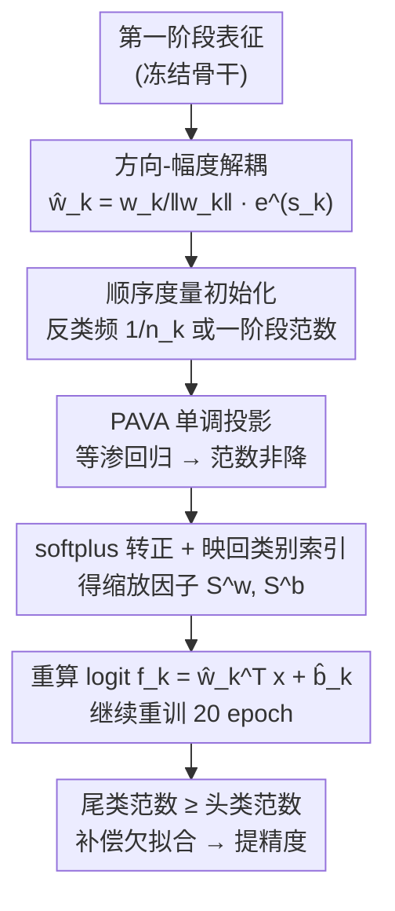

# Why Not Hyperparameter-Friendly Optimisation? A Monotonic Adaptive Norm Rescaling Approach For Long-Tailed Recognition

**会议**: CVPR 2026  
**论文**: [CVF Open Access](https://openaccess.thecvf.com/content/CVPR2026/html/Zhang_Why_Not_Hyperparameter-Friendly_Optimisation_A_Monotonic_Adaptive_Norm_Rescaling_Approach_CVPR_2026_paper.html)  
**代码**: https://github.com/Zhangshuojackpot/SAMN  
**领域**: 长尾识别 / 图像分类 / 表示学习  
**关键词**: 长尾识别、权重范数重缩放、单调约束、PAVA等渗回归、无超参

## 一句话总结
针对长尾识别中"分类器范数重缩放严重依赖超参"的痛点，本文提出 SAMN——用 Pool Adjacent Violators 算法（PAVA）直接把各类权重范数强制成"从头类到尾类单调不减"，从而完全去掉正则化超参，在 CIFAR/ImageNet/iNaturalist 四个长尾基准上即插即用地把 CE/SLAS/GLMC 等方法刷到 SOTA。

## 研究背景与动机
**领域现状**：长尾识别（Long-Tailed Recognition, LTR）里"两阶段解耦"已是公认的强基线范式——第一阶段学表征，第二阶段冻结骨干、单独重训分类器。而分类器重训的核心套路是**调整各类权重范数（norm rescaling）**：因为大量工作都观测到稀有类的权重范数 $\|w_{rare}\|_2$ 明显小于头类 $\|w_{head}\|_2$，于是用 τ-normalization、weight decay、MaxNorm、类平衡正则等手段把尾类范数"补"回来。

**现有痛点**：几乎所有范数重缩放方法都是通过**参数正则化**来实现的，这必然引入连续超参（如正则系数、margin τ、平滑系数 ε），而 LTR 对这些超参出了名地敏感。论文在实证里直接给出证据：weight decay 的超参从 1e-4 改到 1，精度变化 4.1%；SLAS 改超参精度变化 5.6%——也就是说调参没调好，方法就废了，而且不同数据集/不平衡度下还得逐个重调。

**核心矛盾**：① 实践层面——"补尾类范数"这件事本身要靠超参实现，超参又极敏感，于是好方法被埋在调参里；② 理论层面——大家都看到"尾类范数小"，但对**为什么**意见分裂：一派认为尾类是**欠拟合**（underfitting，表征没学好），另一派认为尾类是**过拟合**（overfitting）。这个根本分歧没解决，"该不该、该怎么放大尾类范数"就缺乏理论支撑。

**本文目标**：(1) 从概率分布角度判定尾类到底是欠拟合还是过拟合，给范数重缩放一个站得住脚的理论基础；(2) 设计一个**无需连续超参**、又能即插即用增强已有方法的范数重缩放策略。

**切入角度**：作者注意到"补尾类范数"的本质诉求其实是一句很简单的话——**让权重范数随类别从头到尾单调递增**。既然目标是一个单调序列，那就别再绕道正则化/调参，直接对范数施加单调约束即可。而"把任意序列投影到最接近的单调序列"恰好是经典的**等渗回归（isotonic regression）**问题，有无超参的精确解法 PAVA。

**核心 idea**：用 PAVA 把各类权重范数**直接强制成单调**，把"调正则超参"换成"解一个无超参的等渗回归"，得到 hyperparameter-friendly 的 SAMN。

## 方法详解

### 整体框架
SAMN 作用在两阶段解耦的**第二阶段（分类器重训）**：第一阶段照常学好表征；进入第二阶段后，把分类器每个类的权重 $w_k$ 拆成"方向 + 幅度"，幅度由一个可学习的类级标量 $s_k^w$ 经指数函数给出；训练中用一个**顺序度量**（反类频 $1/n_k$ 或第一阶段学到的范数）给类别排序，再用 PAVA 把这串可学习标量投影成"按该顺序单调不减"的序列，最后映回原类别索引得到缩放因子，重算 logit 并继续重训。整条链路里没有任何需要细调的连续超参，唯一的"选择"是顺序度量这个**离散（类别型）超参**，且各选项效果都接近 SOTA。

### 关键设计

**1. 类条件分布视角：把长尾退化判定为"尾类表征欠拟合"**

这是全文的理论地基，也是回答"该不该放大尾类范数"的依据。作者从 logit 展开 $f_k(\mathbf{x})=\|w_k\|_2\cdot\|\mathbf{x}\|_2\cdot\cos\alpha_k+b_k$ 出发，指出权重收到的累计梯度幅度近似正比于类频 $n_k$（更新次数更多），于是 $\|w_k\|_2$ 与 $b_k$ 都会随 $n_k$ 增长，决策边界被推向稀有类一侧。接着用全概率公式把后验改写为类条件分布形式 $p(k|\mathbf{x})\propto \mathcal{D}_x^k(\mathbf{x})\propto e^{f_k(\mathbf{x})}$。关键一步：若把某类权重范数缩小为原来的 $\alpha$ 倍（$0<\alpha<1$），归一化后该类的隐式类条件分布变成

$$\mathcal{D'}_x^k(\mathbf{x})=\frac{[\mathcal{D}_x^k(\mathbf{x})]^{\alpha}}{\int [\mathcal{D}_x^k(\mathbf{x})]^{\alpha}\,d\mathbf{x}}$$

这是一种"幂律收缩"：$\alpha$ 越小（范数越小，对应越稀有的类），分布越平、越弥散，极端情况下趋近**均匀分布**——意味着模型几乎没从该类样本里学到知识。也就是说尾类范数小所对应的是**欠拟合（学得太平、没峰）而非过拟合**。实证上（Fig.3）头类 Airplane 的类条件分布尖锐、尾类 Truck 的分布平坦且在测试集上散开，正好印证这点。结论很硬：既然是欠拟合，就应该**放大尾类范数**去补偿——这给后面的单调约束提供了正当性。

**2. 方向-幅度解耦 + 指数缩放：把"补范数"变成对一个标量的可学习操作**

要施加单调约束，先得有一个"干净的幅度变量"可操作。SAMN 把分类器权重解耦成方向与幅度，logit 用修正参数 $\hat{w}_k,\hat{b}_k$ 计算：

$$\hat{w}_k=\frac{w_k}{\|w_k\|_2}\cdot e^{s_k^w},\qquad \hat{b}_k=e^{s_k^b}+b_k$$

其中 $s_k^w,s_k^b$ 是每个类各自的可学习标量。这样权重方向（语义）和幅度（范数大小）彻底分离，单调约束只压在 $e^{s_k}$ 这个**正的幅度**上，不会扰动已学好的方向。用指数函数有两个用意：保证最终范数恒正且大于 1；并在第二阶段**放大稀有类的梯度**，让尾类得到更有效的补偿。这一步把"如何重缩放范数"这个原本要靠正则项隐式调控的事，化成"如何安排一串标量 $\{s_k\}$"的显式问题。

**3. PAVA 单调投影：用无超参的等渗回归直接强制范数单调**

这是 SAMN 去掉超参的核心机关。目标很明确：缩放因子应当随"从头类到尾类"单调不减。作者把它写成一个**等渗回归**：给定任意原始可学习标量 $R=[r_1,\dots,r_n]$，求最接近的非降序列 $S$，

$$\min_{s_1\le s_2\le\cdots\le s_n}\sum_{i=1}^{n}(r_i-s_i)^2$$

并用 **Pool Adjacent Violators Algorithm (PAVA)** 求精确解——它无超参、高效。算法流程（Algorithm 1）：先按顺序度量给类排序，对重排后的 $R$ 做 PAVA 投影（遇到违反单调的相邻块就"池化合并"取均值，直到整体非降），再用 softplus 映到正值，最后用逆排列映回原类别索引，得到 $S^w,S^b$。

之所以选 PAVA 而非更"硬"的递归构造（如 $s_{k+1}=s_k+p_{k+1}^2$），有两点理由：① **局部可塑性**——递归构造会让 $s_{k+1}$ 把前面所有项纠缠进来，整串过于刚性；PAVA 的池化是局部的，每个 $s_k$ 只和相邻被池化的类发生关系，单调约束下仍尽量保留各范数的可学习自由度。② **利用先验**——PAVA 给出的是与输入序列欧氏距离最近的等渗投影，而初始 $R$ 用了有价值的先验（类频或一阶段范数）初始化，PAVA 能在强制单调的同时最大限度保住这份先验。此外 PAVA 是**非扩张算子**，虽然是对范数的"突兀手动调整"，却不会破坏收敛——实验里 SAMN 的 loss 曲线和 CE/WD 一样平滑（Fig.2）。

**4. 顺序度量的选择：把唯一残留的"超参"降级为好设的类别型选项**

PAVA 需要一个"按什么顺序单调"的排序依据，本文给两个：① **反类频** $1/n_k$（先验分析表明范数随类频增长，故用反类频对齐 PAVA 的非降输出）；② **第一阶段权重范数的逆**——直接用模型自己学出来的范数不平衡状态当排序依据，更自适应。作者诚实地承认顺序度量的选择本身算一个超参，但它是**离散/类别型**的，相比此前方法里的连续超参好设太多；而且消融显示两种度量整体效果相近、都逼近甚至超过多数 SOTA，所以 SAMN 整体仍远比依赖连续超参的方法 hyperparameter-friendly。

## 实验关键数据

### 主实验
CIFAR10-LT / CIFAR100-LT 上 SAMN 作为即插即用模块加到 CE、SLAS、GLMC 三种方法上（IF=不平衡因子）：

| 数据集 | IF | 基线方法 | 基线 | +SAMN | 提升 |
|--------|----|----------|------|-------|------|
| CIFAR100-LT | 100 | CE | 47.4 | 54.0 | ↑6.6 |
| CIFAR100-LT | 100 | SLAS | 52.7 | 54.1 | ↑1.4 |
| CIFAR100-LT | 100 | GLMC | 56.8 | 57.7 | ↑1.1 |
| CIFAR10-LT | 100 | CE | 80.0 | 84.1 | ↑4.1 |
| CIFAR10-LT | 100 | GLMC | 88.2 | 88.5 | ↑0.3 |

ImageNet-LT / iNaturalist2018（ResNeXt50，GLMC 第一阶段 + SAMN 第二阶段）：

| 数据集 | 指标 | GLMC | GLMC+SAMN |
|--------|------|------|-----------|
| ImageNet-LT | All Acc | 56.3 | **57.7** |
| ImageNet-LT | Medium | 52.4 | 56.1 |
| iNaturalist2018 | All Acc | 72.2 | **72.7** |

GLMC+SAMN 在所有测试设定下都取得最佳。计算开销很小：ResNet32/CIFAR100 每 epoch +12.8%（3.9s→4.4s），ResNeXt50/ImageNet 仅 +2.9%（前后向传播主导，PAVA 开销可忽略）。

### 消融实验
作用于 weight vs bias、以及顺序度量的选择（CIFAR100-LT，IF=100，CE 基线 47.4）：

| 配置 | 顺序度量 | 关键指标 | 说明 |
|------|----------|---------|------|
| 仅 bias | 类频 | 50.6 | 比基线 ↑3.2，改 bias 收益有限 |
| 仅 weight | 类频 | 53.9 | 比基线 ↑6.5，改 weight 是主力 |
| weight+bias | 类频 | 54.0 | 两者同改最好（再 ↑0.6 左右） |
| weight+bias | 一阶段范数 | 53.9 | 与类频度量效果相近 |

### 关键发现
- **改权重 > 改偏置**：单调约束加在权重范数上贡献最大（CIFAR100 IF=100 上 weight 带来 6.6% 提升 vs bias 3.2%）；weight 与 bias 同时约束取得全场最优，故论文推荐两者都加。
- **越不平衡越管用**：SAMN 增益与数据集不平衡因子 IF 正相关，IF 越高提升越大；且在更难、更细粒度的 CIFAR100 上提升一致大于 CIFAR10，说明它擅长处理高度不平衡且困难的分布。
- **顺序度量不敏感**：类频与一阶段范数两种度量整体相当，最优解分散在两者，说明 SAMN 对这个唯一残留的类别型超参很鲁棒。
- **代价换取**：ImageNet-LT 上 "Many"（头类）精度略降（70.1→69.7），但被 Medium/Few 的更大涨幅盖过，整体仍升——作者计划未来用数据增强缓解这个 head 的小退让。

## 亮点与洞察
- **把"调超参"问题转译成"解一个有精确解的优化问题"**：这是最巧的一步。范数重缩放的本质诉求是"单调序列"，而单调投影=等渗回归=PAVA 有无超参的闭式算法——一旦看穿这层对应，连续超参的烦恼直接消失。这种"把工程调参还原成经典数学问题"的思路可迁移到其他需要施加序约束的场景（如有序类别、置信度校准）。
- **先用理论钉死"欠拟合 vs 过拟合"之争，再让方法顺理成章**：很多 LTR 方法直接堆 trick，本文先用类条件分布的幂律收缩论证"尾类是欠拟合、该放大范数"，让"强制单调放大"这个动作有了理论正当性，不是拍脑袋。
- **非扩张算子保证收敛**：PAVA 看似是对权重的"突兀手术"，但作为非扩张投影不破坏 SGD 收敛，loss 曲线平滑——这点让"硬约束"在实践中安全可用，是值得借鉴的细节。
- **即插即用 + 几乎零开销**：作为第二阶段模块挂到 CE/SLAS/GLMC 上都涨点，大模型上开销 <3%，工程友好度高。

## 局限与展望
- **作者承认**：头类（"Many"）精度会有轻微下降，是 head-tail 此消彼长的残留，计划用数据增强缓解。
- **顺序度量仍是先验依赖**：两种度量都需要类频或一阶段范数这类先验，类频未知或不可靠（如在线/流式长尾）时如何排序值得探讨；论文也坦承这是一个（虽弱）的类别型超参。
- **理论假设的边界**：幂律收缩的推导基于"梯度幅度 ∝ 类频""范数随类频单调增长"等近似（详细推导在附录 A），在强增广、强正则或非 CE 损失下这些近似是否仍稳健，正文未充分检验（⚠️ 公式细节以原文附录为准）。
- **单调假设的刚性**：强制全局严格单调对"中频类局部反转更优"的情形可能过约束，PAVA 的局部池化部分缓解但未完全消除。

## 相关工作与启发
- **vs τ-normalization / cRT [18]**：cRT 系列同样在第二阶段重训分类器、调范数，但 τ-norm 依赖 margin 超参 τ；SAMN 用 PAVA 直接施加单调约束，免去连续超参。
- **vs WD + MaxNorm [2]、类平衡正则 [42]、IWB [10]**：这些都通过参数正则化隐式控制范数，引入对结果极敏感的连续超参；SAMN 把范数重缩放从"正则调参"换成"等渗投影"，是范式上的去超参化。
- **vs SLAS [48] / GLMC [11]**：它们是更强的损失/一致性方法，SAMN 并不与之竞争而是**叠加增强**——挂上去后三者都进一步涨点，定位为通用插件。
- **vs Reframing Long-Tailed Learning via Loss Landscape Geometry（同会，self_supervised/）**：同样关注尾类退化，但那篇从损失景观几何（尖锐极小值）+ 持续学习视角切入用 SAM 风格优化；本文从类条件分布判定欠拟合、用 PAVA 直接约束分类器范数，两者动机互补、可对照阅读。

## 评分
- 新颖性: ⭐⭐⭐⭐ 把范数重缩放转译成 PAVA 等渗回归、并用幂律收缩理论坐实"尾类欠拟合"，视角新颖且自洽
- 实验充分度: ⭐⭐⭐⭐ 四个长尾基准 + 三种基线即插即用 + 超参敏感性/开销/消融齐全，但多为分类精度单一指标
- 写作质量: ⭐⭐⭐⭐ 理论—方法—实验逻辑顺，公式与算法清晰；个别符号需对照附录
- 价值: ⭐⭐⭐⭐ 去超参 + 即插即用 + 低开销，对长尾识别落地很实用

<!-- RELATED:START -->

## 相关论文

- [\[CVPR 2026\] Confusion-Aware Spectral Regularizer for Long-Tailed Recognition](confusion-aware_spectral_regularizer_for_long-tailed_recognition.md)
- [\[CVPR 2026\] DREAM: Document Recognition with Explicit Adaptive Memory](dream_document_recognition_with_explicit_adaptive_memory.md)
- [\[CVPR 2026\] Adaptive Data Augmentation with Multi-armed Bandit: Sample-Efficient Embedding Calibration for Implicit Pattern Recognition](adaptive_data_augmentation_with_multi-armed_bandit_sample-efficient_embedding_ca.md)
- [\[CVPR 2026\] A Difference-in-Difference Approach to Detecting AI-Generated Images](a_difference-in-difference_approach_to_detecting_ai-generated_images.md)
- [\[CVPR 2026\] UniMERNet: A Universal Network for Real-World Mathematical Expression Recognition](unimernet_a_universal_network_for_real-world_mathematical_expression_recognition.md)

<!-- RELATED:END -->
