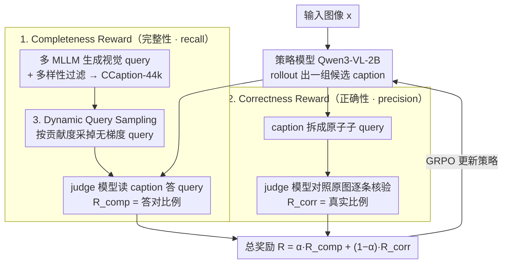

# CCCaption: Dual-Reward Reinforcement Learning for Complete and Correct Image Captioning

**会议**: CVPR 2026  
**arXiv**: [2602.21655](https://arxiv.org/abs/2602.21655)  
**代码**: [https://github.com/ZhijiangTang/CCCaption](https://github.com/ZhijiangTang/CCCaption)  
**领域**: 强化学习  
**关键词**: 图像描述, 强化学习, 完整性, 正确性, 双奖励

## 一句话总结
提出 CCCaption 双奖励强化学习框架，通过 completeness reward（基于多 MLLM 生成的视觉 query 集）和 correctness reward（基于 caption 分解后的子 query 幻觉检测）联合优化图像描述的完整性和正确性，2B 模型超越 32B 基线。

## 研究背景与动机
图像描述（image captioning）是视觉-语言理解的基础任务，但现有模型训练严重依赖人工标注的参考描述。人工标注不可避免带有主观偏好和专业水平差异，导致 ground-truth caption 本身就不完整甚至不正确。作者认为，高质量 caption 应满足两个客观属性：**完整性**（是否覆盖了图像中所有显著视觉事实）和 **正确性**（描述是否与图像事实一致）。

现有 RL 方法如 CapRL 仅用单一 MLLM 生成 query 来衡量 completeness，存在单模型偏差和覆盖不足的问题。更关键的是，仅优化 completeness 的无约束奖励会鼓励模型描述更多细节以最大化奖励，但这往往引入更多幻觉——实验显示训练后期 reward 持续上升但 correctness 显著下降。因此，一个鲁棒的描述目标必须同时强制 completeness 和 correctness。

核心 idea：设计对称的双奖励机制，completeness 用多 MLLM query 覆盖率衡量（类似 recall），correctness 用 caption 分解后的子 query 在图像中的 grounding 程度衡量（类似 precision），联合优化。

## 方法详解

### 整体框架
CCCaption 的目标是在没有可靠人工参考的情况下，让模型自己学会写出既"全"又"对"的图像描述。它把描述质量拆成两个可计算的客观属性——完整性和正确性——各自设计成一个奖励，再用 GRPO 在 Qwen3-VL-2B 上做强化学习。整体流程是：对一张图，先用多个 MLLM 离线生成一组覆盖图像事实的视觉 query 作为"该图应该被描述到什么"的代理；训练时模型 rollout 出若干 caption，completeness reward 看 caption 能答对多少图像 query（覆盖率，类似 recall），correctness reward 把 caption 拆成原子 query 再回查原图看有多少是真实的（类似 precision），两者凸组合成总奖励喂给 GRPO。为提升效率，还用 dynamic query sampling 砍掉那些几乎不产生梯度的"太简单"query。生成 query 的这套流程最终沉淀为 CCaption-44k 训练集。

### 关键设计

**1. Completeness Reward：用多 MLLM 的 query 覆盖率近似"描述全不全"**

完整性的难点在于无法直接度量"图里所有显著事实是否都被写到"。作者把图像的基本信息集 $\mathcal{B}_\mathbf{x}$ 用一组视觉 query $\mathcal{Q}_\mathbf{x}$ 来近似，奖励就定义为 caption 能回答的 query 比例：

$$\mathcal{R}_\text{comp}(\mathbf{x}, \hat{\mathbf{y}}) = \frac{1}{|\mathcal{Q}_\mathbf{x}|}\sum_{\mathbf{q} \in \mathcal{Q}_\mathbf{x}} \mathbb{I}(M_J(\hat{\mathbf{y}}, \mathbf{q}))$$

其中 $M_J$ 是一个冻结的第三方 judge 模型，只读 caption 文本判断能否答出某个 query，本质上是在算 caption 对图像事实的 recall。这里和只用单个 MLLM 生成 query 的 CapRL 拉开差距：单模型生成的 query 有自己的偏好盲区，覆盖不全，模型就算答满分也漏掉一大块事实。CCCaption 改用多个 MLLM 协同生成 query，并显式约束 query 集的多样性——把多样性 $\mathcal{V}(\mathcal{Q}_\mathbf{x})$ 定义为 query embedding 之间余弦相似度的方差，通过迭代生成、过滤掉贡献低（与已有 query 太相似）的 query，让最终 query 集既不冗余又尽量覆盖全图。这套生成过程产出的就是 CCaption-44k（44k 样本、每图平均 10 个 query）。

**2. Correctness Reward：把 caption 拆成原子 query 回查原图，专治"为了答更多 query 而编"**

只奖励 completeness 会有一个隐患：模型发现写越多细节、答对越多 query 奖励就越高，于是开始堆砌图里根本没有的内容——实验里能看到训练后期 reward 一直涨但 correctness 直线下降的 reward hacking。Correctness reward 正是为堵这个口子。它把生成的 caption 反过来拆成一组子 query $\mathcal{Q}_{\hat{\mathbf{y}}}$（每个对应 caption 里的一条原子事实），再让 judge 模型对照原图逐条打分：

$$\mathcal{R}_\text{corr}(\mathbf{x}, \hat{\mathbf{y}}) = \frac{1}{|\mathcal{Q}_{\hat{\mathbf{y}}}|}\sum_{\mathbf{q} \in \mathcal{Q}_{\hat{\mathbf{y}}}} M_J(\mathbf{x}, \mathbf{q})$$

注意它和 completeness 的 $M_J$ 输入正好反过来：completeness 是"图的 query 去对 caption"（recall），correctness 是"caption 的 query 回查图"（precision）。这种对称结构让两个奖励天然互补——一个逼模型多写真东西，一个逼它别写假东西，联合约束下"答更多 query"和"少编幻觉"被同时强制，避免任一方向被单独刷分。

**3. Dynamic Query Sampling：把不产生梯度的"简单"query 采样掉，省算力**

在 GRPO 里，advantage 来自一组 rollout caption 之间的相对差异。如果某个 query 几乎所有 rollout 都能答对（或都答不对），它在组内没有区分度，advantage 趋近于零、贡献的梯度极小，却照样要消耗一次 judge 调用——纯属浪费。Dynamic query sampling 按贡献度 $c(\mathbf{q})$ 对 query 做伯努利采样，只保留有信息量的：

$$\tilde{\mathcal{Q}} = \{\mathbf{q} \in \mathcal{Q}_c \mid u_\mathbf{q} \sim \text{Bernoulli}(c(\mathbf{q}))\}$$

$c(\mathbf{q})$ 是归一化后的贡献度，初值取 $1 - \frac{1}{m}\sum \mathbb{I}(M_J(\mathbf{x}, \mathbf{q}))$（即一开始就被普遍答对的 query 起点低），之后按每个 query 在 rollout 上的准确率方差逐 epoch 更新——方差大说明这个 query 还在"分化"模型行为，值得多采；方差小说明已经被学会或学废，降低采样概率。这样把算力集中到真正推动学习的 query 上。

### 损失函数 / 训练策略
总奖励是两个奖励的凸组合 $\mathcal{R}(\mathbf{x}, \hat{\mathbf{y}}) = \alpha \mathcal{R}_\text{comp} + (1-\alpha) \mathcal{R}_\text{corr}$，超参 $\alpha$ 控制"全"与"对"的权衡，代入标准 GRPO 目标优化。基座为 Qwen3-VL-2B，训练数据为前述 CCaption-44k。

## 实验关键数据

### 主实验

| 评估框架 | 指标 | CCCaption-2B | Qwen3-VL-2B | Qwen3-VL-32B | CapRL-3B | 提升 |
|---------|------|-------------|-------------|-------------|---------|------|
| CapArena | Avg. ELO | **46.39** | 41.39 | - | 17.56 | +5.0 vs 2B基线 |
| Prism | Avg. | **52.80** | 50.05 | 52.26 | 51.07 | +0.54 vs 32B |
| Hallucinations | Avg. | **70.57** | 70.19 | 69.87 | 66.91 | +0.70 vs 32B |

### 消融实验

| 配置 | 效果 | 说明 |
|------|------|------|
| Completeness only | reward ↑ 但 correctness ↓ | 后期幻觉激增 |
| + Correctness reward | 显著提升 | 有效控制幻觉 |
| + Dynamic Query Sampling | 最佳 | 进一步提升训练效率 |
| 单 MLLM vs 多 MLLM query | 多 MLLM 更优 | query 多样性提升覆盖率 |

### 关键发现
- 2B 模型 CCCaption-2B 在全部三个评估框架中均超越 Qwen3-VL-32B，证明双奖励 RL 的有效性
- 仅优化 completeness 会导致后期幻觉激增（correctness 持续下降），correctness reward 有效遏制了这一趋势
- 动态 query 采样通过增大高方差 query 的采样概率，显著提升了训练效率

## 亮点与洞察
- completeness 和 correctness 的对称定义非常优雅——前者衡量 recall，后者衡量 precision，天然互补
- 多 MLLM query 生成 + 多样性过滤是解决单模型偏差的有效方案
- 揭示了 RL captioning 中"reward 上升但质量下降"的 reward hacking 现象，并提供了实用解决方案

## 局限与展望
- query 生成和 correctness 评估依赖冻结的 judge MLLM，其偏差会传递到奖励信号中
- CCaption-44k 规模相对较小，更大规模的多样化 query 数据集可能进一步提升
- 目前仅在图像描述任务上验证，能否推广到视频描述或多轮对话有待探索

## 相关工作与启发
- CapRL 提出用 VQA 能力作为 caption 质量指标，本文在此基础上增加 correctness 约束
- GRPO 算法为 RL captioning 提供高效的组内相对优化框架
- 双奖励（completeness + correctness）范式可推广到其他生成任务的质量评估
- Show and Tell 等早期 encoder-decoder 方法依赖人工标注，本文通过 RL 摆脱了这一限制
- 与 SC-Captioner 仅检查关键词的粗粒度方法相比，query-based 评估更全面

## 补充细节
- 训练数据 CCaption-44k 覆盖 44k 图像，每图平均 10 个 query，由多种 MLLM（包括 Claude、CogVLM2、MiniCPM-V）生成
- 在 CapArena 评估中，Qwen3-VL-32B 作为 judge 模型，CCCaption-2B 在 Claude/CPMV/Cog2 三个子评估上全面领先
- 案例分析显示 CCCaption-2B 能有效避免幻觉和遗漏，优于 32B 级别模型
- 多样性度量 $\mathcal{V}$ 使用 query embedding 的余弦相似度方差，阈值 $\tau$ 控制 query 集的最低多样性要求
- α 在 completeness 和 correctness 之间的平衡是关键超参数

## 评分
- 新颖性: ⭐⭐⭐⭐ 双奖励框架的对称设计和动态 query 采样有新意，但整体是对 CapRL 的改进
- 实验充分度: ⭐⭐⭐⭐⭐ 三个评估框架、多模型对比、消融分析完善
- 写作质量: ⭐⭐⭐⭐ 动机清晰，方法描述完整，图表丰富
- 价值: ⭐⭐⭐⭐ 2B 超 32B 的结果有说服力，双奖励范式对社区有启发意义

## 关键术语
- **Query Coverage**: 用 query 集合的覆盖率衡量 caption 完整性
- **Sub-caption Query**: 将长 caption 分解为原子语义事实的 query
- **Reward Hacking**: RL 中奖励上升但实际质量下降的现象
- **GRPO**: Group Relative Policy Optimization，组内相对优势估计

<!-- RELATED:START -->

## 相关论文

- [\[ICLR 2026\] Reasoning as Representation: Rethinking Visual Reinforcement Learning in Image Quality Assessment](../../ICLR2026/reinforcement_learning/reasoning_as_representation_rethinking_visual_reinforcement_learning_in_image_qu.md)
- [\[CVPR 2026\] MSRL: Scaling Generative Multimodal Reward Modeling via Multi-Stage Reinforcement Learning](msrl_scaling_generative_multimodal_reward_modeling.md)
- [\[CVPR 2026\] Incentivizing Generative Zero-Shot Learning via Outcome-Reward Reinforcement Learning with Visual Cues](incentivizing_generative_zero-shot_learning_via_outcome-reward_reinforcement_lea.md)
- [\[ICLR 2026\] Dual Goal Representations](../../ICLR2026/reinforcement_learning/dual_goal_representations.md)
- [\[NeurIPS 2025\] Global Convergence for Average Reward Constrained MDPs with Primal-Dual Actor-Critic](../../NeurIPS2025/reinforcement_learning/global_convergence_for_average_reward_constrained_mdps_with_primal-dual_actor_cr.md)

<!-- RELATED:END -->
