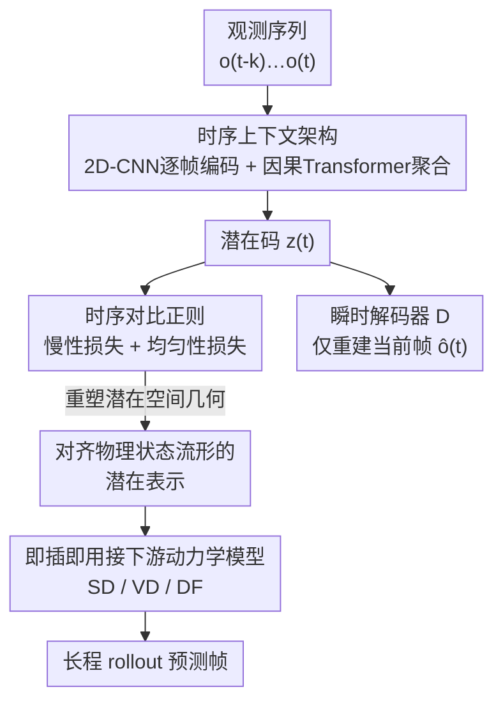

# Cloning Deterministic Worlds: The Critical Role of Latent Geometry in Long-Horizon World Models

**会议**: CVPR 2026  
**论文**: [CVF Open Access](https://openaccess.thecvf.com/content/CVPR2026/html/Xia_Cloning_Deterministic_Worlds_The_Critical_Role_of_Latent_Geometry_in_CVPR_2026_paper.html)  
**代码**: [项目页](https://xiafire.github.io/grwm-project-page)  
**领域**: 强化学习 / 世界模型  
**关键词**: 世界模型, 长程预测, 对比学习, 潜在空间几何, 确定性环境

## 一句话总结
作者用一个"oracle"诊断实验证明：在确定性环境里，世界模型长程崩溃的瓶颈不是动力学模型而是潜在表示的几何结构，进而提出 GRWM——把时序对比学习当作几何正则项，重塑自编码器潜在空间使其对齐环境真实状态流形，作为即插即用模块显著拉长各类世界模型的保真预测视野。

## 研究背景与动机

**领域现状**：世界模型（world model）是智能体"在脑子里模拟世界如何演化"的内部模型，给定过去观测和动作就预测未来物理状态，是规划、推理、强化学习的基础。当前主流世界模型几乎都聚焦**开放世界**设定——每次模拟生成一个不一样的随机环境，用多样性提升泛化。典型做法是"潜在生成"两段式：先用自编码器把图像压成潜在向量，再在潜在空间里建模转移、预测未来帧。

**现有痛点**：开放世界的"随机性"带来不稳定的动力学，做不了需要**可靠预测和精确规划**的固定任务（固定地图迷宫、静态空间机器人导航、静态地图游戏 AI）。这些场景要的不是"看起来合理（plausible）"的未来，而是"忠实（faithful）"的唯一真实轨迹。作者发现：即便在最简单的确定性环境里，所有 SOTA 基线都守不住长程保真——小误差迅速累积，几步之后轨迹就和真实分道扬镳。

**核心矛盾**：精确世界模拟要同时啃下两个**互相纠缠**的难题——表示学习（高维像素到低维物理状态的非线性映射，一个简单的空间平移在像素空间是高度非线性的轨迹）和动力学建模（要统一刻画 3D 变换、逻辑规则、因果依赖、时序记忆）。差的表示逼着动力学模型在嘈杂纠缠的潜在空间里工作；好的表示又会被弱动力学模型浪费。但到底哪个才是长程崩溃的**主要瓶颈**？过去工作几乎一边倒地去加强动力学模型，自编码器只被当"工程件"——用小 KL 权重 + 感知/对抗损失训出来，目标是重建质量，没人管潜在空间的几何。

**切入角度**：作者构造一个"作弊"的 oracle 模型——绕过感知问题，让动力学模型**直接吃环境真实状态变量**（智能体位姿 $(x,y,\theta)$）。oracle 和普通 VAE 世界模型架构完全一样，只差潜在状态的来源。结果 oracle 长程几乎零误差，VAE 世界模型误差却急速累积。架构相同、唯一差异是"状态从哪来"，这就把责任钉死在表示上：**高保真长程克隆是可行的，限制它的不是动力学模型而是表示的几何结构**。

**核心 idea**：既然瓶颈在表示几何，那就用**时序对比学习原理当几何正则项**，把自编码器的潜在空间重塑成对齐环境真实状态流形的形状——作者称之为 GRWM（Geometrically-Regularized World Models）。一个轻量、可无缝插进标准自编码器的几何正则模块，就能系统性地为各类 SOTA 世界模型解锁长程保真度。

## 方法详解

### 整体框架

GRWM 的工作分两步走。**第一步（诊断）**先用 oracle 实验把"瓶颈在表示而非动力学"这件事量化坐实——这是全文的立论基石，也决定了后面只去改表示、不动动力学。**第二步（方法）**只改自编码器：在标准 VAE 上叠两件事——(a) 时序上下文架构，用因果编码器聚合一个滑动窗口内的多帧来对抗"感知混叠"（不同状态看起来几乎一样）；(b) 时序对比正则，用"慢性损失 + 均匀性损失"把潜在嵌入约束到对齐物理状态流形的几何上。重塑后的潜在空间被原封不动地喂给**任意**下游动力学模型（论文配了 SD / VD / DF 三种扩散类世界模型），动力学部分完全不改。所以 GRWM 是一个**即插即用的表示模块**：输入是观测序列，输出是几何良好的潜在码，下游谁用都涨点。

### 关键设计

**1. Oracle 诊断实验：把"瓶颈在表示"从猜测变成证据**

世界模型长程失效时，到底该怪动力学模型还是它脚下的表示？过去没人把这两者干净地拆开过。作者的做法是构造一个 oracle 世界模型，它有三件套：编码器把历史观测映到上一时刻**真实状态** $\hat{s}_{t-1}=f_{enc}(o_{t-k:t-1})$、动力学模型从上一状态加动作预测当前状态 $\hat{s}_t=f_{dyn}(\hat{s}_{t-1},a_t)$、解码器从预测状态重建当前观测 $\hat{o}_t=f_{dec}(\hat{s}_t)$。关键在于 oracle 的潜在状态就是 ground-truth 位姿 $(x,y,\theta)$，而对照的 VAE 世界模型架构一模一样、只是潜在状态自己从图像学。两者逐帧 MSE 一对比：oracle 长程几乎零误差，VAE 急速发散。因为两个模型**只差潜在状态的来源**，这就排除了动力学模型的嫌疑——高保真长程克隆本身可行，崩溃来自表示。作者进一步给出机制解释：纯重建训练出的潜在空间不保证保留真实状态空间的邻域结构和全局布局，真实动力学里相邻的点在潜在空间可能离很远（**几何错位 / geometric mismatch**），即便最简单的动力学也因此变得难以稳定外推。这个诊断不是花絮，它直接为"只改表示几何"这一整套方法论奠基。

**2. 时序上下文架构：用一段历史而非单帧来破解感知混叠**

确定性环境里有个隐患叫**感知混叠（perceptual aliasing）**——不同的真实状态会给出几乎一样的观测（迷宫里两个不同位置长得一模一样）。oracle 能赢一部分正因为它拿的是坐标（直接编码全局状态），而单张图像只给局部信息，根本没法唯一确定全局位置。要从图像里恢复真实状态，模型必须跨时间聚合信息——一段观测序列才能构成底层全局状态的唯一"签名"。于是作者设计了**因果编码器 $E$ + 瞬时解码器 $D$**：编码器把最近一段观测 $(o_{t-k},\dots,o_t)$ 映成潜在码 $z_t=E(o_{t-k},\dots,o_t)$，解码器只重建**当前**这一帧 $\hat{o}_t=D(z_t)$。具体实现是在 VAE 上加时序聚合——每帧先用 2D CNN 独立编码，再用带**滑动时间窗的因果 Transformer** 聚合帧级特征，保证 $z_t$ 只关注到含当前时刻在内的有限过去帧。这样 $z_t$ 既是"当前状态的紧凑表示"，又被过去上下文充实，既能消混叠又保持因果性。

**3. 时序对比正则：慢性损失 + 均匀性损失，把潜在空间掰成物理流形的形状**

光有时序上下文还不够：只在最后一帧上做重建，模型可能学到"偷懒"解——干脆无视上下文、只靠最后一帧。要真正逼出对齐物理状态流形的几何，得显式约束潜在空间。作者把编码器输出 $z\in\mathbb{R}^{B\times L\times\cdots}$ 先过一个线性投影头得到嵌入 $p\in\mathbb{R}^{B\times L\times D}$，再 L2 归一化到单位超球面 $p'=p/\lVert p\rVert_2$，然后施加两个互补约束。

**慢性损失（Temporal Slowness）** 来自"环境真实状态随时间缓慢演化"的直觉：同一条轨迹上下文窗口内的所有帧，在超球面上都应该彼此靠近，从而把整段轨迹映成潜在空间里一条紧凑连续的路径。形式上最小化同轨迹内所有嵌入对的平均 L2 距离：

$$\mathcal{L}_{slow}=\mathbb{E}_{b\sim D}\Big[\mathbb{E}_{(p_i',p_j')\sim P_b'\times P_b'}\big[\lVert p_i'-p_j'\rVert_2\big]\Big]$$

其中 $P_b'=\{p_{b,t}'\}_{t=0}^{L-1}$ 是轨迹 $b$ 的归一化嵌入集合。

但光有慢性会**特征坍缩**——所有输入都被映到潜在空间一小块。于是加 **均匀性损失（Latent Uniformity）** 把不同轨迹的嵌入推开、让它们在超球面上均匀分布：

$$\mathcal{L}_{uniform}=\log\mathbb{E}_{(p_i',p_j')\sim P_{neg}}\big[e^{-2\lVert p_i'-p_j'\rVert_2^2}\big]$$

其中 $P_{neg}$ 是 batch 内**不同轨迹**嵌入对的分布。一拉一推之下，潜在空间被掰成"真实物理上相邻的状态在潜在空间也相邻、不相邻的被推开"的几何——正是 oracle 凭坐标天然拥有、而纯重建 VAE 缺失的那种结构。和以往时序对比工作（CLTT 等）的区别在于：他们直接拿对比目标**做表示学习**，而本文是把对比原理当成世界模型自编码器上的**几何正则项**，揭示对比约束可以作为稳定世界建模的强归纳偏置。

### 损失函数 / 训练策略

整个自编码器端到端训练，总损失把 VAE 的重建项、KL 项和两个正则项加权合在一起：

$$\mathcal{L}_{total}=\mathcal{L}_{recon}+\beta\mathcal{L}_{KL}+\lambda_{slow}\mathcal{L}_{slow}+\lambda_{uniform}\mathcal{L}_{uniform}$$

其中 $\beta$、$\lambda_{slow}$、$\lambda_{uniform}$ 是平衡各项的超参数。训练只发生在表示阶段，下游动力学模型沿用各 SOTA 基线原本的配置，不做修改。

## 实验关键数据

### 主实验

**数据集与协议**：作者自建三个确定性环境数据集——$\text{M3}\times\text{3-DET}$（3×3 迷宫）、$\text{M9}\times\text{9-DET}$（9×9 迷宫）、MC-DET（Minecraft，视觉更丰富）。轨迹是第一人称视角的（动作, 观测）序列，地图布局固定因而轨迹完全确定。**俯视地图不给智能体看**，输入只有第一人称观测。**指标**用逐帧 MSE：$\text{MSE}(t)=\lVert o_t-\hat{o}_t\rVert_2^2$（图像归一化到 $[0,1]$，可换算 PSNR），逐步揭示误差如何随时间累积。**基线**选三个 SOTA 潜在生成世界模型——Standard Diffusion (SD)、Video Diffusion (VD)、Diffusion Forcing (DF)；GRWM 只换表示模块、动力学沿用它们各自的，记作 GR-SD / GR-VD / GR-DF。

**潜在探测（Latent Probing，定量主结果）**：冻结训好的自编码器，用其编码器取所有观测的潜在向量，再训一个小 MLP 探针从潜在向量回归真实状态 $(x,y,\theta)$，报留出集回归 MSE（越低说明潜在空间越对齐真实状态流形）。

| 模型 | M3×3-DET | M9×9-DET | MC-DET |
|------|----------|----------|--------|
| VAE-WM | 0.082 | 0.106 | 0.137 |
| **GRWM** | **0.031** | **0.058** | **0.081** |

GRWM 在三个数据集上探测 MSE 全面下降（如 M3×3 从 0.082 → 0.031），且不随环境复杂度变化而失效，说明几何正则确实让潜在表示对真实状态更线性可预测。

**Rollout 长程保真度（Figure 3，曲线）**：在三个数据集、三套动力学模型上，GRWM（实线）逐帧 MSE 一致低于对应 VAE 基线（虚线），且**视野越长差距越大**——基线误差迅速累积导致轨迹发散，GRWM 的误差曲线则平坦得多，在 63 步内显著逼近 oracle 下界（黑点线）。⚠️ 论文只给曲线未给逐点数值表，下表为从 Figure 3 纵轴**近似读出**的量级，仅供对照：

| 数据集 | VAE 基线 ~63 步 MSE | GRWM ~63 步 MSE | oracle 下界 |
|--------|--------------------|-----------------|-------------|
| M3×3-DET | 高（曲线快速上扬） | 显著更低、更平 | ≈0 |
| M9×9-DET | 高 | 显著更低 | ≈0 |
| MC-DET | 最高（达 ~0.25 量级） | 大幅压低 | ≈0 |

> ⚠️ 上表数值为读自曲线图的近似量级，精确数值以原文 Figure 3 为准。

**超长程定性结果**：选最强的 DF 做极端长程生成——从单一起点连续生成 **10,000 帧**。基线 VAE-WM 出现关键失效模式：**模式坍缩**，陷进重复循环、连续上千帧渲染同一面单色墙（如粉墙、绿墙、蓝墙），在视觉相似但因果不连通的区域之间"瞬移（teleport）"。作者解释：像素重建损失逼模型把"视觉相似的观测（同色不同墙）"映到潜在空间相近点、无视它们真实距离与因果连通性，制造出"吸引子状态"和纠缠流形；动力学模型在这种坏空间里学到"在相近潜点之间跳跃成本最低"，于是不去走世界真实复杂的拓扑，而是在低重建误差的"安全港"之间瞬移。GRWM 因表示被正则到对齐真实状态流形，能在 100、400 帧仍保持高保真，长 rollout 里清晰展现连续移动与探索，后期出现的黄墙不是随机合理图像，而是潜在空间里一条物理可行路径的连续遍历证据。

**潜在聚类（Figure 7）**：对潜在向量做 k-means（$k=20$），按帧的真实 $(x,y)$ 位置画点、按潜在簇 ID 上色。基线 VAE 产生嘈杂破碎的簇——同一颜色散落在地图相距很远的区域，说明表示高度纠缠、把因果不同的状态错映到一起；GRWM 则产生空间连续、与环境真实拓扑对齐的簇，每种颜色大致对应一段走廊或一个房间。

### 消融实验

作者考察四个方面（论文正文给结论、详细数值在补充材料）：

| 配置 | 考察对象 | 结论 |
|------|---------|------|
| 完整 GRWM | — | 长程保真 + 潜在探测/聚类俱佳 |
| 去掉某个核心损失项 | 慢性损失 / 均匀性损失的必要性 | 二者缺一不可：只剩慢性会**特征坍缩**，只剩均匀性失去时序连续性 |
| 去掉投影头 | projection head 的作用 | 影响潜在几何质量 |
| 改变潜在维度 | latent dimension 的影响 | 维度影响表示容量与对齐效果 |
| 其他关键设计选择 | design choices | 对性能有影响 |

> ⚠️ 消融的具体数值原文置于补充材料，此处仅复述正文给出的定性结论，精确数字以补充材料为准。

### 关键发现
- **瓶颈定位是全文最大贡献**：oracle 与同架构 VAE-WM 的对照直接证明"长程崩溃来自表示几何而非动力学"，把研究焦点从"造更强动力学"扭向"修表示几何"。
- **慢性与均匀性必须配对**：慢性损失保证轨迹在潜在空间是连续紧凑路径，但单用会坍缩；均匀性损失负责防坍缩，两者一拉一推才能掰出对齐物理流形的几何。
- **"瞬移/吸引子"失效模式**：像素重建损失会把同色不同墙映到相近潜点，制造吸引子，让动力学学会低成本跳跃而非走真实拓扑——这是 VAE 世界模型长程坍缩的根因诊断。
- GRWM 在三套动力学模型上一致涨点，证明它是**与动力学无关**的即插即用表示增强，而非针对某个模型的 trick。

## 亮点与洞察
- **用 oracle 做"控制变量"诊断**：两个架构完全相同、只换潜在状态来源的模型一对比，就干净地把"表示 vs 动力学"的责任拆开了——这种实验设计本身比方法更有启发性，是任何"组件 A 还是组件 B 才是瓶颈"问题的可复用范式。
- **把对比学习从"表示学习目标"降格为"几何正则项"**：以往时序对比直接拿来学表示，本文只把它当世界模型自编码器上的一个正则项，主目标仍是重建——这个视角转换揭示了对比约束作为"稳定世界建模归纳偏置"的新角色，可迁移到任何需要潜在空间几何对齐的生成式预测任务。
- **确定性克隆作为"可严格评测的实验台"**：因为没有随机性、存在唯一真实未来，逐帧 MSE 才能干净度量保真度——作者把"克隆确定性世界"既当任务又当方法论显微镜，用来理解长程保真的根本限制因素。
- **轻量、即插即用**：几何正则模块能无缝塞进标准自编码器、不碰下游动力学，工程落地成本低。

## 局限与展望
- **环境过于简单**（作者承认）：评测限于简单可控环境，向部分可观测、随机、照片级真实环境扩展仍未解决。
- **视觉伪影**（作者承认）：GRWM 仍有细微伪影、恢复不了细粒度场景细节（尤其 Minecraft-DET），说明潜在表示没完全捕获高频/语义结构。
- **计算开销**（作者承认）：时序聚合用了 Transformer，序列越长开销越大，比标准 VAE 世界模型更重。
- **与 oracle 仍有显著差距**（作者承认）：即便在确定性环境，学到的表示离"恢复完整状态信息"还远，缩小这道沟需要更强的表示学习方法。
- **自己看到的**：探针/聚类用的真实状态是 $(x,y,\theta)$ 这类低维位姿，结论能否推广到状态本身高维或语义化的环境（如可交互物体、动态光照）未验证；消融的关键数值放在补充材料、正文只给定性结论，复现时需谨慎核对超参 $\beta,\lambda_{slow},\lambda_{uniform}$ 的敏感性。

## 相关工作与启发
- **vs 视频世界模型（SD / VD / DF 等）**：它们主攻动力学建模（更强的潜在转移、因果/关系归纳偏置），自编码器只当压缩工程件、训练目标是重建质量；本文反其道，证明**表示几何才是长程瓶颈**，并把这三者当下游动力学直接复用、只换表示就涨点。
- **vs 时序对比学习（CLTT 等）**：它们直接用对比目标做表示学习；本文把时序对比原理当成世界模型自编码器上的**几何正则项**（主损失仍是重建），从而把对比约束定位为"稳定世界建模的归纳偏置"。
- **vs 开放世界 / 随机世界模型**：主流追求多样性与"看似合理"；本文聚焦确定性环境，目标是**可复现的忠实克隆**，把研究范式从 plausible generation 转向 reproducible fidelity，并自建三个确定性数据集作为评测基准。

## 评分
- 新颖性: ⭐⭐⭐⭐ oracle 诊断 + 把对比学习重定位为几何正则，视角新颖；但单个组件（VAE+时序对比+均匀性）多为已有零件的组合。
- 实验充分度: ⭐⭐⭐⭐ 三数据集×三动力学一致涨点、探测/聚类/超长程多角度验证；但消融数值藏补充材料、环境偏简单。
- 写作质量: ⭐⭐⭐⭐⭐ 诊断→机制解释→方法的逻辑链非常清晰，"瞬移/吸引子"的失效分析尤其精彩。
- 价值: ⭐⭐⭐⭐ "表示几何是长程瓶颈"这一论点对世界模型社区有方向性启发，即插即用模块易于落地。

<!-- RELATED:START -->

## 相关论文

- [\[CVPR 2026\] GeoWorld: Geometric World Models](geoworld_geometric_world_models.md)
- [\[CVPR 2026\] DreamSAC: Learning Hamiltonian World Models via Symmetry Exploration](dreamsac_learning_hamiltonian_world_models_via_symmetry_exploration.md)
- [\[ACL 2026\] Understanding Generalization in Role-Playing Models via Information Theory](../../ACL2026/reinforcement_learning/understanding_generalization_in_role-playing_models_via_information_theory.md)
- [\[ICML 2026\] Long-Horizon Model-Based Offline Reinforcement Learning Without Explicit Conservatism](../../ICML2026/reinforcement_learning/long-horizon_model-based_offline_reinforcement_learning_without_explicit_conserv.md)
- [\[NeurIPS 2025\] Dynamics-Aligned Latent Imagination in Contextual World Models for Zero-Shot Generalization](../../NeurIPS2025/reinforcement_learning/dynamics-aligned_latent_imagination_in_contextual_world_models_for_zero-shot_gen.md)

<!-- RELATED:END -->
