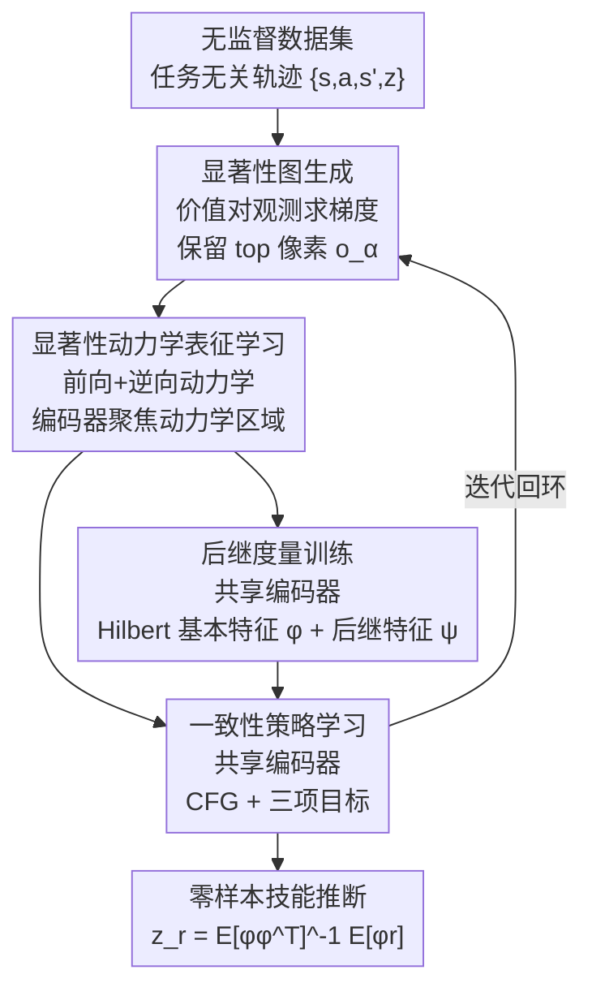

# Saliency-Guided Representation with Consistency Policy Learning for Visual Unsupervised Reinforcement Learning

**会议**: CVPR 2026  
**论文**: [CVF Open Access](https://openaccess.thecvf.com/content/CVPR2026/html/Sun_Saliency-Guided_Representation_with_Consistency_Policy_Learning_for_Visual_Unsupervised_Reinforcement_CVPR_2026_paper.html)  
**代码**: https://github.com/bofusun/SRCP  
**领域**: 强化学习 / 无监督强化学习 / 零样本泛化  
**关键词**: 后继表征, 视觉URL, 显著性引导表征, 一致性策略, 零样本泛化

## 一句话总结
针对后继表征（SR）方法在高维视觉无监督强化学习（URL）中失效的问题，SRCP 用显著性引导的动力学任务把表征学习从 SR 目标中解耦出来、让编码器专注于动力学相关区域，并用带分类器自由引导的一致性策略建模多模态技能，在 ExORL 的 16 个视觉控制任务上取得了 SOTA 零样本泛化。

## 研究背景与动机

**领域现状**：无监督强化学习（URL）想在无奖励数据上预训练出能零样本迁移到新任务的通用智能体。其中后继表征（SR）方法——包括后继特征 SF 和前向-后向表征 FB——通过把奖励学习与环境动力学解耦（后继特征因式分解），可以从少量含奖励信号的数据里推断出近似最优技能 $z_r$，因而在零样本泛化上很突出。

**现有痛点**：SR 在低维状态输入下表现优异，但一搬到高维视觉输入（图像观测）性能就断崖式下跌。作者通过实证分析定位了两个根因：（1）视觉 SR 里编码器和后继网络是**联合优化**的，SR 目标会把表征带偏到与动力学无关的区域（注意力热图显示模型盯着背景而非智能体本体），导致后继度量（successor measure）估计不准；（2）这种劣质表征进一步拖累策略学习——视觉 URL 需要从学到的潜在表征里学技能条件策略，劣质表征让策略既难建模多模态技能，又难保证技能可控性。

**核心矛盾**：编码器和 SR 训练的**纠缠优化**是病灶。作者用 HILP 的三个变体（HILP-state、HILP-pixel、HILP-SDE-pixel）在 Walker Stand 上对比发现：所有方法的**基本特征**（reward 估计）都还不错，但只有状态输入和加了显著性编码器的版本能让**价值估计**跟随轨迹回报，纯视觉的 HILP-pixel 价值-回报相关性明显偏弱。也就是说，劣质表征主要损害的是后继度量而非基本特征。理论上，策略 $\pi_{z_r}$ 偏离最优价值的程度被后继特征逼近误差所界定：

$$\|\hat V^{\pi_{z_r}} - V^\star\|_\infty \le \frac{3\|z_r\|_*}{1-\gamma}\sup_{s,a}\|\epsilon\|,\quad \epsilon = \hat\psi^{z_r}(s,a) - \psi^{\pi_{z_r}}(s,a)$$

后继特征质量直接决定泛化上限。

**本文目标**：把表征学习从 SR 目标中解耦出来，让编码器专注动力学相关特征；同时给视觉 URL 配一个既能建模多模态技能、又能保证可控性、推理还要快的策略网络。

**切入角度**：表征侧——既然 SR 目标会把表征带偏，那就额外引入一个监督编码器关注「哪些像素对动力学/价值有影响」的任务；策略侧——传统策略网络在多模态表达和可控性之间难两全，扩散模型表达力强但推理慢，**一致性模型**正好是轻量又能表达多模态的折中。

**核心 idea**：用「显著性引导的动力学表征学习」替 SR 目标承担表征任务、用「带 URL 专用分类器自由引导的一致性策略」替传统策略，二者共享同一个编码器，组成可即插即用到各种 SR 方法的统一框架 SRCP。

## 方法详解

### 整体框架
SRCP 是一个视觉 SR 预训练框架，由五个组件在一个迭代训练回环里协同：（1）**无监督数据集**提供任务无关轨迹；（2）**显著性图生成**——每轮根据价值函数对输入观测的梯度算出显著性图，标出编码器真正该关注的区域；（3）**表征学习**——用显著性引导的前向/逆向动力学任务更新编码器，迫使它聚焦动力学相关特征；（4）**后继度量训练**——用更新后的编码器联合优化基本特征 $\varphi$ 和后继特征 $\psi$；（5）**一致性策略学习**——训练一个技能条件的一致性策略，配分类器自由引导来建模多模态技能并保证可控性。关键点在于编码器被「表征学习」专门训练好后，**共享**给后继度量训练和策略学习两路使用，从而既改善后继度量、又支撑富有表现力的策略行为。

### 关键设计

**1. 显著性图生成：让编码器知道「该看哪儿」**

视觉 SR 的核心病灶是编码器在 SR 目标下盯着与动力学无关的区域（背景、纹理），于是作者用价值函数的梯度来定位真正重要的像素。给定观测 $o$，编码器 $f$ 抽出表征 $s = f(o)$，进而算出基本特征 $\varphi(f(o))$ 和后继特征 $\psi(f(o),a,z)$，价值函数定义为 $Q = \psi(f(o),a,z)^\top z$。对 $Q$ 关于输入观测 $o$ 求梯度，只保留梯度幅值最大的 top 像素、把其余区域遮掉，得到显著性遮罩观测 $o_\alpha$。这一步不引入额外标注，纯靠模型自身价值梯度做无监督的「注意力定位」，为下一步表征学习提供监督信号。

**2. 显著性引导的动力学表征学习：把表征从 SR 目标里解耦出来**

光有显著性图还不够，得有个任务逼编码器去学动力学相关特征——作者用前向+逆向动力学模型。前向模型 $D$ 从当前表征和动作预测下一状态表征，逆向模型 $I$ 从当前和下一表征反推动作：

$$\mathcal{L}_{D1} = \|D(f(o),a)-s'\|^2,\qquad \mathcal{L}_{I1} = \|I(f(o),s')-a\|^2$$

关键的「显著性引导」在于：把上面两个任务的输入观测换成显著性遮罩观测 $o_\alpha$，得到 $\mathcal{L}_{D2} = \|D(f(o_\alpha),a)-s'\|^2$ 和 $\mathcal{L}_{I2} = \|I(f(o_\alpha),s')-a\|^2$。即「只给智能体看显著区域，也要能预测动力学」，这就强制编码器把信息都压进动力学相关的那部分像素。总表征损失为

$$\mathcal{L}_{\text{rep}} = \mathcal{L}_{D1} + \mathcal{L}_{I1} + \beta(\mathcal{L}_{D2}+\mathcal{L}_{I2})$$

$\beta$ 控制显著性项的权重。这一损失完全独立于 SR 目标，所以表征学习不再被后继训练带偏，从根上修复了后继度量估计不准的问题。

**3. 后继度量训练：用解耦后的好编码器学后继特征**

表征模块训练好的编码器被共享过来。基本特征 $\varphi$ 采用 Hilbert 空间表征（HILP 那套），再用它去更新后继特征 $\psi$，后者通过 Bellman 一致性约束训练：

$$\mathcal{L}_\psi = \|\psi(s,a,z) - \varphi(s') - \gamma\bar\psi(s',a',z)\|^2$$

其中 $\bar\psi$ 是目标后继特征网络。由于编码器已经被显著性任务调好，后继度量估计质量随之提升，这一路本身是 SR 的标准训练，但「站在好表征肩膀上」是它有效的前提。SRCP 对这一路是即插即用的——把 HILP 换成 FB 同样成立。

**4. 一致性策略学习：用一致性模型 + URL 专用分类器自由引导建多模态可控技能**

视觉 URL 的策略要从潜在表征里建模多模态技能条件动作分布并保持可控性，传统策略网络两头难顾，扩散策略推理太慢。作者用**一致性策略**：网络 $g_\theta(s,a_t,z)\approx a_0$ 学会从任意噪声水平 $a_t$ 一步恢复干净动作 $a_0$，从而快速采样并建模条件分布 $p(a_0\mid s,z)$。为平衡多样性与可控性，引入 URL 专用的分类器自由引导（CFG）：

$$a = g_\theta(s,a_t,\varnothing) + \omega\big(g_\theta(s,a_t,z) - g_\theta(s,a_t,\varnothing)\big)$$

$\varnothing$ 是无条件技能输入、$\omega$ 是引导强度。**关键细节**：状态 $s$ 同时进无条件和有条件两支，使模型既能捕捉状态依赖的多模态动作分布、又保证动作主要由技能 $z$ 驱动。策略用三项目标训练：技能条件价值目标 $\mathcal{L}^\pi_Q = \mathbb{E}[-\psi(s,\pi(s,z),z)^\top z]$ 鼓励最大化技能回报、提升可控性；技能条件行为一致性 $\mathcal{L}^\pi_{bc1}$ 对数据集动作加高斯噪声、要求不同噪声水平输出一致以稳定离线训练、缓解分布漂移；无条件行为一致性 $\mathcal{L}^\pi_{bc2}$ 对随机技能策略采的动作做一致性约束、促进多模态表达。三者合为

$$\mathcal{L}_\pi = \mathcal{L}^\pi_Q + \lambda_1\mathcal{L}^\pi_{bc1} + \lambda_2\mathcal{L}^\pi_{bc2}$$

### 损失函数 / 训练策略
预训练阶段三套损失并行迭代：表征 $\mathcal{L}_{\text{rep}}$（含显著性权重 $\beta$）、后继度量 $\mathcal{L}_\psi$、策略 $\mathcal{L}_\pi$（含 CFG 引导权重 $\omega$ 与一致性权重 $\lambda_1,\lambda_2$）。零样本部署时直接用 $z_r = \mathbb{E}_\rho[\varphi\varphi^\top]^{-1}\mathbb{E}_\rho[\varphi r]$ 从少量含奖励数据推断技能向量，无需再训练。

## 实验关键数据

### 主实验
ExORL/URL Benchmark，16 个视觉连续控制任务跨 4 个域，每个域用 RND/PROTO/APS/APT 4 个数据集预训练，每个结果是 4 数据集 × 4 随机种子共 16 次运行的平均。SRCP 用 Hilbert 表征做基本特征。

| 域（4 任务均值） | FB | HILP | FDM | AE | SRCP | 相对最强 baseline |
|--------|------|------|------|------|------|------|
| Walker | 115 | 238 | 401 | 317 | **453** | +13% |
| Quadruped | 183 | 232 | 231 | 234 | **355** | +33% |
| Cheetah | 184 | 454 | 303 | 218 | **543** | +11% |
| Jaco | 40 | 32 | 32 | 25 | **41** | 持平/略升 |

SRCP 在几乎所有任务上取得最优或接近最优，对数据集变化也鲁棒。

### 消融实验
RND 数据集 4 个域、每域 4 任务 × 4 种子均值：

| 配置 | Walker | Quadruped | Cheetah | Jaco | 说明 |
|------|--------|-----------|---------|------|------|
| HILP | 231 | 305 | 599 | 34 | 编码器与后继联合训练的基线 |
| SRCP w/o SE | 345 | 352 | 600 | 44 | 去掉显著性表征，只保留一致性策略 |
| SRCP w/o CP | 396 | 406 | 598 | 43 | 去掉一致性策略，只保留显著性表征 |
| SRCP（Full） | **439** | **485** | 602 | **50** | 完整模型 |

两个组件单独加都能超过 HILP，合在一起最好，说明「好表征 + 强策略建模」缺一不可。

### 关键发现
- **病灶定位很扎实**：HILP-pixel 的价值-回报相关性弱、基本特征却正常，证明纠缠优化主要伤的是后继度量，正好对应理论里后继特征误差界定泛化上限。
- **显著性表征 vs 通用对比表征**：把 HILP 换成 SOTA 对比表征 TACO/Premier-TACO 只在部分域有效、其他域反而掉点，说明「解耦表征学习」必须配动力学相关的显著性任务，而不是随便换个表征方法就行。
- **可迁移到 FB**：SRCP(FB) 在 Walker/Quadruped 八个任务上全面超过原 FB（部分任务 +200% 以上），证明 SRCP 是通用框架而非绑定 HILP。
- **超参敏感性**：引导权重 $\omega$ 在 3 附近最佳（$\omega=0$ 即无引导时大幅掉点，$\omega$ 过大也回落）；显著性权重 $\beta=0.5$ 最佳，验证了多样性-可控性、表征聚焦都存在最优折中点。

## 亮点与洞察
- **用价值梯度做无监督显著性，再回灌给表征学习**：不需要任何额外标注就能告诉编码器「该看哪」，把「注意力跑偏」这个抽象问题转成一个可优化的遮罩-动力学预测任务，思路干净且自洽。
- **CFG 里把状态放进两支**这个细节很关键：保证动作主要被技能驱动、同时保留状态依赖的多模态性，这是把扩散界的 CFG 正确移植到 URL 技能条件策略的非显然一步。
- **诊断驱动设计**：先用三个 HILP 变体 + 理论界把「表征→后继度量→泛化」的因果链坐实，再对症下药，这种「先证病灶再开药」的写法比直接堆模块有说服力。
- **即插即用**：表征/策略两个模块都不绑定具体 SR 算法，HILP 和 FB 都能套，迁移成本低。

## 局限与展望
- 作者承认 SRCP 是**首个**专门针对视觉 URL 零样本泛化的框架，意味着可比 baseline 大多是状态 URL 方法的视觉移植，横向比较的成熟度有限。
- 显著性图依赖价值函数梯度，而价值估计在训练早期本身就不准，存在「鸡生蛋」式的冷启动风险，论文未深入讨论这一耦合的稳定性。
- 实验都在 DMC/ExORL 仿真域（Walker/Quadruped/Cheetah/Jaco），未涉及真实机器人或更复杂视觉场景，泛化到真实世界仍待验证。
- 一致性策略虽比扩散快，但三项损失 + CFG 引入了 $\omega,\beta,\lambda_1,\lambda_2$ 多个超参，调参成本和敏感性（如 $\omega$ 偏离 3 即掉点）是实用化的隐忧。

## 相关工作与启发
- **vs HILP/FB（SR 方法）**: 它们在状态 URL 强、视觉 URL 弱，根因是编码器与 SR 联合训练带偏表征；SRCP 把表征学习解耦出来、用显著性动力学任务专门训练编码器，并能直接套在 HILP/FB 之上。
- **vs USD（无监督技能发现）**: USD 靠最大化技能-平均状态分布散度学多样技能，但技能与任务目标不对齐导致零样本泛化差；SR/SRCP 路线把技能与奖励关联，泛化更直接。
- **vs 扩散策略**: 扩散模型表达力强但推理慢；SRCP 用一致性模型一步采样，兼顾多模态表达与低延迟，并补上 URL 专用 CFG 解决技能可控性。
- **vs TACO/Premier-TACO（对比表征）**: 同样想解耦表征，但用通用时序对比学习，在视觉 URL 上效果不稳定；SRCP 证明必须用「动力学相关 + 显著性引导」的表征任务才能稳定受益。

## 评分
- 新颖性: ⭐⭐⭐⭐ 首个专攻视觉 URL 零样本泛化，显著性引导表征 + URL 专用一致性策略组合新颖
- 实验充分度: ⭐⭐⭐⭐ 16 任务 4 数据集 4 种子，消融/超参/可迁移性都覆盖，但仅限仿真域
- 写作质量: ⭐⭐⭐⭐ 诊断-理论-方法链条清晰，图表完整
- 价值: ⭐⭐⭐⭐ 即插即用框架，对推动 SR 方法走向高维视觉有实际意义

<!-- RELATED:START -->

## 相关论文

- [\[ICLR 2026\] Reasoning as Representation: Rethinking Visual Reinforcement Learning in Image Quality Assessment](../../ICLR2026/reinforcement_learning/reasoning_as_representation_rethinking_visual_reinforcement_learning_in_image_qu.md)
- [\[CVPR 2026\] Incentivizing Generative Zero-Shot Learning via Outcome-Reward Reinforcement Learning with Visual Cues](incentivizing_generative_zero-shot_learning_via_outcome-reward_reinforcement_lea.md)
- [\[CVPR 2026\] TSTM: Temporal Segmentation for Task-relevant Mask in Visual Reinforcement Learning Generalization](tstm_temporal_segmentation_for_task-relevant_mask_in_visual_reinforcement_learni.md)
- [\[ICML 2025\] Sliding Puzzles Gym: A Scalable Benchmark for State Representation in Visual Reinforcement Learning](../../ICML2025/reinforcement_learning/sliding_puzzles_gym_a_scalable_benchmark_for_state_representation_in_visual_rein.md)
- [\[ICLR 2026\] Stackelberg Coupling of Online Representation Learning and Reinforcement Learning](../../ICLR2026/reinforcement_learning/stackelberg_coupling_of_online_representation_learning_and_reinforcement_learnin.md)

<!-- RELATED:END -->
