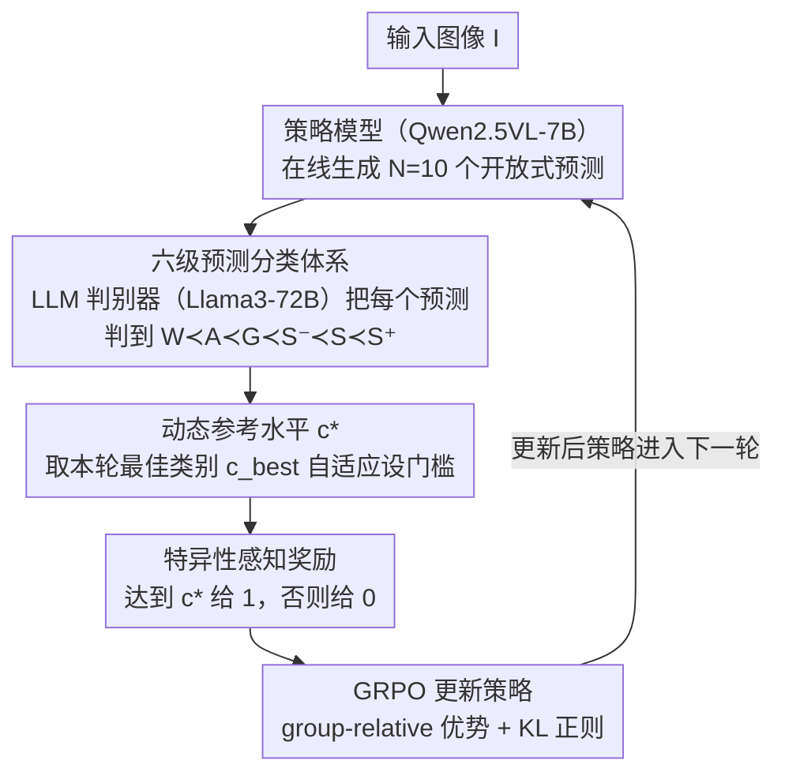

# Specificity-aware Reinforcement Learning for Fine-grained Open-world Classification

**会议**: CVPR2026  
**arXiv**: [2603.03197](https://arxiv.org/abs/2603.03197)  
**代码**: [s-angheben/SpeciaRL](https://github.com/s-angheben/SpeciaRL)  
**领域**: 强化学习  
**关键词**: 开放世界分类, 细粒度识别, 强化学习, 大型多模态模型, GRPO, 特异性感知奖励

## 一句话总结

提出 SpeciaRL——一种特异性感知的强化学习框架，通过基于在线 rollout 最佳预测的动态奖励信号，引导推理型大型多模态模型在开放世界细粒度图像分类中同时提升预测的特异性和正确性。

## 研究背景与动机

**开放世界分类需求日益增长**：传统图像分类在封闭词表下运行，但真实场景需要处理新兴类别和新概念，固定词表假设不再成立。

**LMM 推理能力强但倾向泛化**：最新的推理型大型多模态模型（如 Qwen2.5VL）在视觉理解上很强，但面对细粒度分类任务时常给出过于宽泛的预测（如输出 "flower" 而非 "daisy"）。

**朴素提升特异性会损害正确性**：直接在 prompt 中要求"更具体"或使用 SFT/标准 RFT 微调虽能提高特异性，但同时会增加错误预测比例，二者存在非平凡的权衡关系。

**模型并非缺乏知识**：Best-of-N 分析表明，Qwen2.5VL-7B 在 64 次 rollout 中最佳预测的正确性和特异性远超单次推理，说明模型已具备细粒度先验知识，只是无法在单次采样中可靠地表达。

**现有 RLVR 方法不适配开放世界**：标准 RLVR 使用精确匹配的二值奖励，无法对"正确但不够具体"的预测给予适当信号，容易将模型推向过度自信。

**缺乏系统研究**：在开放世界设定下，如何在不损害正确性的前提下提升特异性，是一个被严重低估且几乎未被探索的问题。

## 方法详解

### 整体框架

SpeciaRL 想解决开放世界细粒度分类里的一个具体矛盾：推理型多模态模型知识够、但单次采样时倾向给出过宽的预测（说 "flower" 而不是 "daisy"），而硬逼它「更具体」又会把正确率带崩。它基于 GRPO 在线策略优化：对每张图像 $I$ 让策略模型（Qwen2.5VL-7B）生成 $N{=}10$ 个开放式预测 → 用一个 LLM 判别器（Llama3-72B）把每个预测与 ground-truth 的关系判到六级类别 → 根据本轮 $N$ 个 rollout 里的最佳类别动态设定一个「动态参考水平」$c^*$（即最低特异性门槛）→ 达到 $c^*$ 的预测给正奖励、否则为零 → 用 GRPO 更新策略，把模型推向它能力范围内能稳定表达的最大特异性。关键在于门槛是随每个样本自适应的，而不是一刀切；下一轮 rollout 在更新后的策略上重新生成，形成训练回环。

### 关键设计

**1. 六级预测分类体系：先把「对不对 + 够不够具体」量化出来**

标准 RLVR 的二值奖励只会判对错，无法区分「正确但太泛」。SpeciaRL 定义一组有序类别 $W \prec A \prec G \prec S^- \prec S \prec S^+$（错误、拒答、泛化、较不具体、具体、更具体），用 LLM-as-a-judge 自动把每个预测归到某一级，从而把特异性变成可比较、可奖励的量。

**2. 动态参考水平：门槛跟着模型当前能力走，而非固定值**

如果对所有样本都要求最高特异性，遇到模型本就只能答对到 Generic 的难样本，就会逼它瞎猜、反而制造错误。SpeciaRL 让最低要求 $c^*$ 随本轮 rollout 的最佳类别 $c_{best}$ 自适应：

$$c^* = \begin{cases} S, & \text{if } c_{best} = S^+ \\ A, & \text{if } c_{best} = W \\ c_{best}, & \text{otherwise} \end{cases}$$

即模型这次最好也只到某个层级，就以那个层级（或略低）为准，不强求做不到的特异性。

**3. 特异性感知奖励函数：在能力范围内奖励最大特异性**

有了动态门槛，奖励就简单了——预测类别达到或超过 $c^*$ 给 1，否则给 0：

$$r_I^*(p, y) = \begin{cases} 1, & \text{if } c_y(p) \succeq c^* \\ 0, & \text{otherwise} \end{cases}$$

这条设计的核心直觉是：若某样本的最佳预测本就是 Generic，就不该因为它不够具体而惩罚，否则会把模型推向输出更多错误；动态奖励保证只在模型够得着的范围内鼓励最大特异性，从而让特异性和正确性能同时往上走。

### 损失函数

采用标准 GRPO 目标函数，将上述动态奖励嵌入 group-relative 优势估计中，附加 KL 散度正则项（$\lambda = 0.01$）防止策略偏移。训练时 $N=10$ 个 rollout 同时用于奖励计算和策略更新，无需额外推理开销。

## 实验

### 主要结果

**跨域细粒度分类（训练域: CUB 鸟类 → 测试域: 花/食物/宠物/汽车/飞机）**：

| 方法 | 特异性↑ | 正确性↑ | HM↑ |
|------|---------|---------|-----|
| Qwen2.5VL-7B（零样本） | 0.742 | 0.846 | 0.790 |
| Qwen2.5VL-7B（"Be specific"） | 0.816 | 0.832 | 0.822 |
| Qwen2.5VL-7B（SFT） | 0.935 | 0.807 | 0.866 |
| Qwen2.5VL-7B（RFT） | 0.875 | 0.785 | 0.825 |
| **SpeciaRL-7B** | **0.920** | **0.848** | **0.883** |
| BoN-64（上界） | 0.889 | 0.984 | 0.933 |

在极细粒度集（StanfordCars、FGVCAircraft）上，SpeciaRL 同样取得最佳 HM（0.830），超越 SFT（0.814）和 RFT（0.821）。

### 消融实验

**静态 vs 动态奖励**：与4种静态奖励方案对比，SpeciaRL 动态奖励 HM=0.883 全面最优。标准二值奖励仅 HM=0.825，说明对"正确但不够具体"的预测给予分级奖励至关重要。

**Rollout 数量 $N$**：$N=5$ 和 $N=10$ 表现接近（HM=0.883），$N=15$ 时性能下降（HM=0.824），可能由于 batch-based grouping 策略的局限性。

**跨 RL 算法兼容性**：在 GRPO、Dr.GRPO、DAPO 三种在线策略优化算法上，SpeciaRL 动态奖励均一致提升 HM（+1.5%~+5.8%），证明方法的通用性。

### 关键发现

- SpeciaRL 在细粒度集上同时提升了特异性（+0.178）和正确性（+0.002），是唯一做到二者共同提升的方法
- SFT 虽特异性极高（0.935），但正确性严重下降（0.807），不如 SpeciaRL 的 HM
- 仅用单域（鸟类）3000 样本训练即可泛化到花、食物、宠物、汽车、飞机等完全不同的领域
- 在 [10] 的通用评估协议（TI/LI/SS/CS）上，SpeciaRL 在 8 个指标中有 6 个取得最佳

## 亮点

1. **问题定义清晰且新颖**：首次系统性地将开放世界分类中的"特异性-正确性权衡"识别为独立的研究问题
2. **动态奖励设计精巧**：基于在线 rollout 自适应调整奖励门槛，既利用了 GRPO 已有的多次采样，又无需额外计算开销
3. **跨域泛化出色**：仅在鸟类数据上训练就能泛化到食物、汽车等截然不同的领域，说明方法学到的是推理策略而非领域知识
4. **六级分类体系实用**：$\{W, A, G, S^-, S, S^+\}$ 类别体系全面覆盖开放世界预测的可能关系，评估协议可复用

## 局限性

1. **依赖 LLM 判别器质量**：奖励信号来自 LLM-as-a-judge，若判别器在某些细粒度领域出错（如混淆近似物种），可能传播错误信号
2. **仅验证分类任务**：未扩展到检测、分割等更复杂的视觉任务
3. **基座模型受限**：仅在 Qwen2.5VL-7B 上验证，未探索更大或不同架构的模型
4. **训练数据规模小**：仅用 3000 样本训练，在极细粒度集上仍与 BoN-64 上界有差距（HM 0.830 vs 0.868）
5. **Rollout 数量敏感**：$N=15$ 时性能反而下降，说明方法对 GRPO 的 batch grouping 策略有一定依赖

## 相关工作

- **Visual-RFT [34]**：将 RLVR 应用于封闭集分类，使用精确匹配的二值奖励——SpeciaRL 扩展到开放世界并引入分级奖励
- **Conti et al. [10]**：提出开放世界分类评估基准，揭示 LMM 泛化倾向——本文在此基础上提出解决方案
- **DeepSeek-R1 [16]**：GRPO 算法的经典应用——SpeciaRL 在此框架上融入特异性感知奖励
- **Hierarchical precision/recall [44]**：基于显式分类树评估预测质量——本文不假设预定义层次结构，使用 LLM 判别器替代
- **CaSED [9]**：基于 CLIP 检索的开放世界分类——特异性好但正确性不如推理型 LMM

## 评分

- 新颖性: ⭐⭐⭐⭐ （动态奖励设计新颖，问题定义清晰）
- 实验充分度: ⭐⭐⭐⭐ （跨域评估+多消融+多 RL 算法验证，但基座模型仅一种）
- 写作质量: ⭐⭐⭐⭐⭐ （分析→洞察→方法→验证的逻辑链完整流畅）
- 价值: ⭐⭐⭐⭐ （开放世界细粒度分类的实用框架，跨域泛化能力强）

<!-- RELATED:START -->

## 相关论文

- [\[ICLR 2026\] DiVE-k: Differential Visual Reasoning for Fine-grained Image Recognition](../../ICLR2026/reinforcement_learning/dive-k_differential_visual_reasoning_for_fine-grained_image_recognition.md)
- [\[ICLR 2026\] RewardMap: Tackling Sparse Rewards in Fine-grained Visual Reasoning via Multi-Stage Reinforcement Learning](../../ICLR2026/reinforcement_learning/rewardmap_tackling_sparse_rewards_in_fine-grained_visual_reasoning_via_multi-sta.md)
- [\[ACL 2026\] Beyond Majority Voting: Towards Fine-grained and More Reliable Reward Signal for Test-Time Reinforcement Learning](../../ACL2026/reinforcement_learning/beyond_majority_voting_towards_fine-grained_and_more_reliable_reward_signal_for_.md)
- [\[AAAI 2026\] Object-Centric World Models for Causality-Aware Reinforcement Learning](../../AAAI2026/reinforcement_learning/object-centric_world_models_for_causality-aware_reinforcement_learning.md)
- [\[ICLR 2026\] From Observations to Events: Event-Aware World Model for Reinforcement Learning](../../ICLR2026/reinforcement_learning/from_observations_to_events_event-aware_world_model_for_reinforcement_learning.md)

<!-- RELATED:END -->
