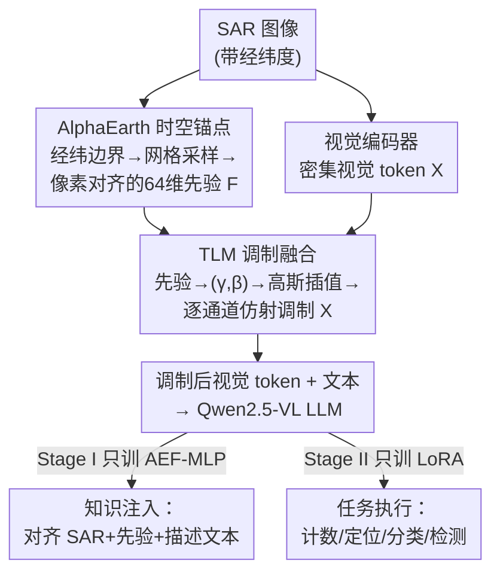

# FUSAR-GPT: A Spatiotemporal Feature-Embedded and Two-Stage Decoupled Visual Language Model for SAR Imagery

**会议**: CVPR 2026  
**论文**: [CVF Open Access](https://openaccess.thecvf.com/content/CVPR2026/html/Zhang_FUSAR-GPT_A_Spatiotemporal_Feature-Embedded_and_Two-Stage_Decoupled_Visual_Language_Model_CVPR_2026_paper.html)  
**代码**: 无  
**领域**: 遥感 / SAR 视觉语言模型  
**关键词**: SAR 解译, 视觉语言模型, 地理空间先验, 条件调制, 两阶段 SFT

## 一句话总结
FUSAR-GPT 在 Qwen2.5-VL-7B 上为 SAR（合成孔径雷达）图像定制了一个视觉语言模型：把全球遥感基座模型 AlphaEarth 的多源时空特征当作"世界知识"先验，通过"时空锚点"对齐后用 Token-wise 线性调制（TLM）注入视觉 backbone，以补偿 SAR 图像稀疏、信息极化的表征，再用"知识注入 / 任务执行"解耦的两阶段 SFT 训练，在计数、定位、分类、检测四类 SAR 解译任务上比主流 VLM 高出 10% 以上。

## 研究背景与动机
**领域现状**：SAR 是全天候、全天时的微波主动成像手段，对遥感至关重要。近年通用视觉语言模型（CLIP、BLIP、Qwen-VL 等）在自然 RGB 图像上展现了强大的开放世界理解能力，遥感界也开始把 VLM 迁过来（EarthGPT、GeoChat、EarthDial 等），但绝大多数工作面向光学/多光谱 RGB 影像。

**现有痛点**：直接把 RGB 预训练的 VLM 用到 SAR 上性能会严重崩塌。作者把症结拆成三点：（a）**SAR-光学模态鸿沟**——SAR 成像机理与可见光根本不同，预训练得到的特征分布与 SAR 数据失配，迁移范式失效；（b）**忽视地理空间先验**——现有 SAR 解译沿用为自然图像设计的框架，缺乏空间感知，把地理场景先验浪费掉，导致高层语义推理出错（把城市建筑当成金属物体）、幻觉加剧；（c）**信息稀疏与极化**——SAR 的相干成像对几何/介电属性极度敏感，动态范围极高，人工目标（如角反射器）产生过饱和强散射、自然地物（如水面）变成大片暗区，模型注意力被少数亮点主导，暗区里丰富的上下文语义被系统性忽略。

**核心矛盾**：SAR 单模态信息本身又稀疏又极化，无法支撑 VLM 的高层语义理解；而强行用单阶段微调同时优化"多模态融合（SAR+先验+文本）"和"指令驱动的任务执行"，两个目标会互相冲突、互相拖累。

**本文目标**：(1) 给 SAR 补充一种稳定、全局一致的外部语义；(2) 用一种不破坏视觉 backbone 已学结构的方式把这种外部先验注进去；(3) 让"学会看 SAR"和"学会做任务"在训练上分开，互不干扰。

**切入角度**：作者注意到存在一个全球遥感基座模型 **AlphaEarth（AEF）**——它把光学、SAR、LiDAR 等异源数据融合成一个覆盖全球的 64 维连续时空嵌入场。一张 SAR 图有真实经纬度，就能去这个嵌入场里"查"出对应位置的地理语义向量，作为稳定的世界知识先验来补 SAR 的稀疏表征。

**核心 idea**：建立"SAR 图像-文本-地理特征"三元组范式，用**时空锚点**把 AEF 的地理先验精确对齐到 SAR 像素，用**TLM 条件调制**注入视觉 token，再用**两阶段解耦 SFT**把知识注入和任务执行分离。

## 方法详解

### 整体框架
FUSAR-GPT 以 Qwen2.5-VL-7B 为骨架，核心做两件事：**多源时空特征嵌入** 与 **两阶段解耦 SFT**。

输入是一张带地理坐标的 SAR 图像。先根据图像的经纬度边界框去 AlphaEarth 嵌入场采样一组 64 维地理语义向量，并通过线性映射把每个地理坐标对应到 SAR 图像的像素坐标，得到一组"地理-像素-语义"严格对齐的稀疏先验（时空锚点）。然后视觉编码器把 SAR 图编成密集视觉 token，**TLM 模块**把稀疏的 AEF 先验转成逐通道的仿射调制参数 $(\gamma,\beta)$，经高斯空间插值对齐到视觉特征图后，逐 token 调制视觉表征——这一步只"微调"视觉 token，不改 backbone 的空间编码。调制后的视觉 token 与文本一起喂给 LLM。训练分两阶段：Stage I 只训 AEF 嵌入 MLP，学会把"SAR+地理先验"和描述性文本对齐（知识注入）；Stage II 冻结前面、只训 LoRA，学会做具体任务（任务执行）。

### 关键设计

**1. SAR 图像-文本-地理特征三元组 + 时空锚点对齐：给稀疏 SAR 补一层稳定的"世界知识"**

SAR 的微波相干成像导致内容严重不均衡、语义稀疏，模型很难只靠图像本身理解暗区场景。作者引入全球遥感基座模型 AlphaEarth（AEF）作为第三模态——它把光学/SAR/LiDAR 等异源多源数据压成一个全球覆盖、64 维的连续时空嵌入场，等于一份现成的地理"世界知识"。

要用它就得把这份外部知识**精确钉到 SAR 图像的具体空间位置**上，这就是"时空锚点"。对任意 SAR 图，先确定其时空边界框 $B=[lon_{min},lat_{min},lon_{max},lat_{max},y]$（$y$ 是成像年份），在 $B$ 上构造 $N_{lon}\times N_{lat}$ 规则网格，节点坐标 $lon_i=lon_{min}+i\cdot\Delta lon$、$lat_j=lat_{min}+j\cdot\Delta lat$；在每个地理节点查询 AEF 得到该年份的 64 维向量 $a_{ij}=I_y(lon_i,lat_j)\in\mathbb{R}^{64}$，再把地理坐标线性映射到 SAR 像素坐标 $(x_{ij},y_{ij})$，最终组织成同时含"地理坐标-像素索引-语义嵌入"的对齐集合 $F(B,y)=\{(lon_{ij},lat_{ij},x_{ij},y_{ij},a_{ij})\}_{i,j}$。这样跨模态先验就能被准确注入到 SAR 图的特定空间位置。作者特别强调：AEF 虽然带时间维，但这里**不显式建模时间动态**，而是把它当作年尺度上相对稳定的宏观地理语义先验来用——稳定正是它能补偿 SAR 噪声/镜面散射区的关键（如对农田弱特征做增强、对镜面散射噪声区给出干净稳定的物体表征）。

**2. Token-wise 线性调制 TLM：把异质稀疏先验"调"进视觉 token，而不破坏 backbone**

AEF 先验是稀疏采样的地理语义向量，视觉 token 是稠密的深度图像特征，二者在形式和模态上都异质。简单拼接或直接相加会带来对齐错位、增加计算、还可能破坏视觉 backbone 已学好的空间结构。TLM 借鉴条件归一化思路：不把 AEF 当额外输入特征，而当作**条件信号去生成调制参数**，对视觉 token 做逐通道仿射变换。

具体三步。**先验→调制映射**：每个 AEF 向量 $v_i\in\mathbb{R}^D$ 经一个带 SiLU 的两层 MLP 投到 $2C$ 维，产出一对缩放/平移系数：$h_i=\phi(W_1 v_i+b_1)$，$(\gamma_i,\beta_i)=W_2 h_i+b_2$，堆成矩阵 $\Gamma,B\in\mathbb{R}^{S\times C}$（$S$ 是有效先验数，$C$ 是视觉隐维）。**高斯空间对齐**：把归一化的 AEF 坐标投到 $H\times W$ 特征图上得到连续位置 $(\tilde y_i,\tilde x_i)$，在每个空间位置 $(h,w)$ 用距离高斯核 $\tilde w_i(h,w)=\exp(-\frac{(h-\tilde y_i)^2+(w-\tilde x_i)^2}{2\sigma^2})$ 定义插值权重，并沿先验维做列归一化使 $\sum_i w_i(h,w)=1$，得到权重矩阵 $W\in\mathbb{R}^{S\times HW}$。**加权聚合并调制**：把稀疏位置上的调制参数按 $W$ 加权聚合到每个空间格点 $\Gamma_{hw},B_{hw}=W^\top(\Gamma,B)$，再通过空间格点到 token 索引的双射 $\pi$ 把调制场作用到视觉 token 上：

$$x'_{\pi(h,w)}=x_{\pi(h,w)}\odot\big(1+\gamma(h,w)\big)+\beta(h,w)$$

这样先验只在空间和通道维度"微调"视觉 token，主视觉通路结构不变，既注入了跨模态先验又保住了 backbone 已学的空间编码，提升了 SAR 表征的稳定性和可判别性。

**3. 解耦的两阶段 SFT：把"学会看 SAR"和"学会做任务"在参数层面分开**

通用 VLM 因光学预训练在 SAR 上有巨大域差。若单阶段同时优化"多模态融合（SAR+AEF+文本）"和"指令驱动任务执行"，两类目标会冲突、互相拖累。作者把参数集 $\Theta=\theta_v\cup\theta_{ae}\cup\theta_{llm}$（视觉编码器 / AEF 嵌入 MLP / LLM 骨架）分组，做分阶段优化。

**Stage I（跨模态对齐与知识注入）**：用描述性语料数据集 $D_1=\{(I_{sar},F_{ae},T_{desc})\}$（$T_{desc}$ 主要是地形地貌、空间分布等综合性地理描述，来自 FUSAR-GEOVL-1M），**冻结视觉编码器 $\theta_v$ 和 LLM 骨架 $\theta_{llm}$，只训 AEF 嵌入 MLP $\theta_{ae}$**，目标是最大化描述文本似然 $L_1(\theta_{ae})=-\mathbb{E}_{D_1}[\log P(T\mid E_v(I;\theta_v^{frozen}),E_{ae}(F;\theta_{ae});\theta_{llm}^{frozen})]$——逼着 MLP 学会高效融合多源语义并和描述文本对齐。**Stage II（任务推理与 LLM 激活）**：用指令数据集 $D_2=\{(I_{sar},F_{ae},T_{inst},T_{ans})\}$（指令含定位、分类、计数、检测），冻结视觉编码器、Stage I 训好的 $\theta_{ae}^*$、以及 LLM 原权重，**只更新注入的 LoRA 参数 $\theta_{lora}$**，最大化任务答案似然 $L_2(\theta_{lora})$。由于输入特征在 Stage I 已完成 SAR 域适配和跨模态对齐，Stage II 的 LLM 可以专心解析指令、做复杂分析与推理。

> ⚠️ 关于训练分工有一处文图不一致：正文 3.3 明确写 Stage I **只训** AEF-MLP $\theta_{ae}$、Stage II **只训** LoRA；但 Fig.2 图注写的是 "Stage-1 jointly updates LoRA and the TLM-MLP"。本笔记以正文公式 (12)-(15) 为准，具体以原文为准。

### 损失函数 / 训练策略
两阶段都用 AdamW + warm-up 比例 0.05、FlashAttention-2、DeepSpeed ZeRO Stage-2、BFloat16、rank-8 LoRA（$\alpha=32$，作用于所有线性层）。Stage I 训 30 epoch、学习率 $10^{-4}$ 做跨模态语义对齐；Stage II 训 5 epoch、学习率 $10^{-5}$ 做稳定的任务级适配。因 Qwen2.5-VL 用绝对坐标编码，所有框标注先对齐到其统一分辨率；推理用 vLLM 加速。全部实验在 4 张 A100 上完成。

## 实验关键数据

数据来自 FUSAR-KLIP 中保留真实经纬度的 FUSAR-GEOVL 子集（满足 AEF 地理定位需求）：初始选 10k 图文对、按坐标抽 AlphaEarth 向量，构成 10k AEF-图-文三元组；再从中选含精确目标标注的 2k 子集做下游任务训练与评测。评测四类主流 SAR 解译任务：目标计数、空间定位、目标分类、目标检测；baseline 覆盖 Qwen2/2.5/3-VL、LLaVA、InternVL 系列。

### 主实验

计数 + 空间定位（节选 Table 2，单位 %）：

| 模型 | 规模 | 计数 @Acc | 定位 Acc@100 | 定位 Acc@50 | 定位 Top1 |
|------|------|-----------|--------------|-------------|-----------|
| Qwen2.5-VL | 7B | 34.85 | 30.81 | 57.07 | 78.28 |
| Qwen3-VL | 4B | 45.45 | 43.94 | 71.21 | 82.32 |
| Qwen3-VL | 8B | 41.41 | 42.93 | 71.72 | 85.86 |
| LLaVA-1.6 | 7B | 44.44 | 39.90 | 70.20 | 85.86 |
| InternVL-3.5 | 4B | 40.40 | 39.90 | 70.20 | 83.84 |
| **FUSAR-GPT** | 7B | **52.53** | **52.02** | **79.29** | **91.41** |

- 计数任务 baseline 多在 30%-40%，FUSAR-GPT 52.53%，超最佳 baseline 7% 以上；且通用模型"做大"没用（Qwen3-VL 8B 的 41.41% 反不如 4B 的 45.45%），说明扩参数解决不了 SAR 的强噪声/弱纹理。
- 定位是把图切 3×3 网格、判目标所在格；FUSAR-GPT 在 Acc@100/Acc@50/Top1 三指标各超最佳 baseline 8-12%，Top1 91.41% 的明显领先说明它在多目标场景下识别关键区域更稳。

检测（Table 4，F1，IoU=0.25/0.50，单位 %）：

| 模型 | All F1@0.25 | Plane F1@0.25 | Ship F1@0.25 | All F1@0.50 |
|------|-------------|---------------|--------------|-------------|
| Qwen2.5-VL-7B | 47.1 | 47.5 | 38.5 | 27.7 |
| **FUSAR-GPT** | **74.8** | **75.7** | **57.1** | **58.7** |

- 检测在 IoU=0.25 下整体 F1 从 47.1% 拉到 74.8%（提升近 28 个点），飞机 47.5→75.7、舰船 38.5→57.1，对小尺度、低对比目标也更鲁棒；更严格的 IoU=0.50 仍保持明显领先。
- 分类（Table 3，给定框判类别，仅与 Qwen2.5-VL 系列公平对比）：粗粒度飞机/舰船均超 Qwen2.5-VL-7B 12% 以上（76.85 vs 64.66、67.42 vs 55.19），细粒度优势更明显（多个细类从 0%/低分跳到 70%-100%）。

### 消融实验
论文未提供"去掉某模块"的标准模块级消融表，而是用 Fig.5 给出四个任务在**不同训练阶段**的精度动态作为分析（⚠️ 以下为按 Fig.5 文字描述整理，非数值表）：

| 配置 | 现象 | 说明 |
|------|------|------|
| 通用 VLM 基线 | 四任务均显著落后 | RGB 预训练无法适配 SAR |
| FUSAR-GPT（Stage I 后） | 早期即大幅领先 | Stage 1 注入的地理先验带来更快收敛、更高数据效率 |
| FUSAR-GPT（Stage II 后） | 维持并扩大领先 | 解耦后 LLM 专注任务推理 |

### 关键发现
- **先验注入带来的不只是终点更高，还有更快收敛、更高数据效率**：FUSAR-GPT 从训练初期就远超所有 baseline，作者归因于 SFT Stage 1 注入的稳健先验知识。
- **通用 VLM 扩参数对 SAR 无效**：Qwen3-VL 8B 计数反而不如 4B，说明 SAR 的强噪声/弱纹理是结构性瓶颈，靠堆规模解决不了，必须针对模态做适配。
- **小目标/低对比场景受益最大**：检测中舰船这类小尺度、低对比目标的 F1 提升幅度可观，说明地理先验对暗区/弱特征的补偿有效。

## 亮点与洞察
- **把"全球遥感基座模型"当外部世界知识查询表用**：不是再训一个先验，而是直接复用 AlphaEarth 的 64 维全球时空嵌入场，按经纬度"查"先验——这是一个很省力又有物理含义的跨模态补偿思路，可迁移到其他缺纹理/缺标注的遥感模态（高光谱、夜光、InSAR）。
- **TLM 用条件归一化范式做"非破坏式"先验注入**：把异质稀疏先验转成 $(\gamma,\beta)$ 调制场、再用高斯插值对齐到视觉格点，既保住 backbone 空间编码又能逐通道注入语义，比拼接/相加更优雅，思路可借给"稀疏外部条件 → 稠密特征"的一般融合场景。
- **训练解耦的"先对齐世界、再学任务"**：先只训融合 MLP 把多模态对齐好，再只训 LoRA 学任务，避免两类目标互相打架——对任何"域适配 + 任务适配"双重负担的微调都有借鉴价值。

## 局限与展望
- **强依赖精确地理坐标**：时空锚点必须有真实经纬度才能查 AEF，没有地理元数据或定位不准的 SAR 图无法用本方法；这也限制了在历史/匿名数据上的适用。
- **不显式建模时间动态**：作者明确只把 AEF 当年尺度稳定先验，对快速变化场景（如汛情、施工、移动目标）的时序信息没有利用，是潜在改进点。
- **缺标准模块级消融**：论文没给"w/o AEF / w/o TLM / w/o 两阶段"的对照表，无法量化各组件单独贡献；正文与图注在"Stage I 训哪些参数"上还有不一致，复现需谨慎。
- **评测规模偏小**：下游任务训练/评测仅用 2k 标注子集，类别与场景覆盖有限，结论的普适性有待更大基准验证。

## 相关工作与启发
- **vs SARCLIP / SARLANG-1M**: 它们做 SAR 的基础模态对齐和零样本泛化，但停留在特征级对齐，既没处理 SAR 的模态特异性、也系统性忽略了地理先验；FUSAR-GPT 用 AEF 地理先验 + TLM 注入 + 两阶段 SFT 把解译推到多任务、开放式理解。
- **vs EarthGPT / GeoChat / EarthDial**: 这些遥感 VLM 主要面向光学/多光谱（EarthDial 虽支持多时相多传感器含 SAR，但仍是通用对话框架）；FUSAR-GPT 专门针对 SAR 的稀疏/极化特性做先验补偿，是 SAR 专用 VLM。
- **vs 直接微调 Qwen2.5-VL-7B**: 同样 7B 骨架，FUSAR-GPT 在四任务上全面大幅领先，差距来自地理先验注入和训练解耦，而非模型规模——印证"通用模型做大不如针对模态做对"。

## 评分
- 新颖性: ⭐⭐⭐⭐ 首个把全球遥感基座模型当世界知识、用条件调制注入 SAR-VLM 的工作，三元组范式 + TLM 思路新颖
- 实验充分度: ⭐⭐⭐ 四任务多 baseline 对比扎实，但缺模块级消融、评测子集偏小、文图有一处不一致
- 写作质量: ⭐⭐⭐⭐ 动机三点拆解清晰、方法公式完整，仅训练分工的文图描述需读者自行辨析
- 价值: ⭐⭐⭐⭐ 为信息稀疏的 SAR 解译提供了可复用的"外部地理先验 + 非破坏式注入 + 训练解耦"范式

<!-- RELATED:START -->

## 相关论文

- [\[CVPR 2026\] Exploring Spatiotemporal Feature Propagation for Video-Level Compressive Spectral Reconstruction](exploring_spatiotemporal_feature_propagation_for_video-level_compressive_spectra.md)
- [\[CVPR 2026\] GeoDiT: A Diffusion-based Vision-Language Model for Geospatial Understanding](geodit_a_diffusion-based_vision-language_model_for_geospatial_understanding.md)
- [\[CVPR 2026\] UniChange: Unifying Change Detection with Multimodal Large Language Model](unichange_unifying_change_detection_with_multimodal_large_language_model.md)
- [\[CVPR 2026\] GeoViS: Geospatially Rewarded Visual Search for Remote Sensing Visual Grounding](geovis_geospatially_rewarded_visual_search_for_remote_sensing_visual_grounding.md)
- [\[CVPR 2026\] APEX: A Decoupled Memory-based Explorer for Asynchronous Aerial Object Goal Navigation](apex_a_decoupled_memory-based_explorer_for_asynchronous_aerial_object_goal_navig.md)

<!-- RELATED:END -->
