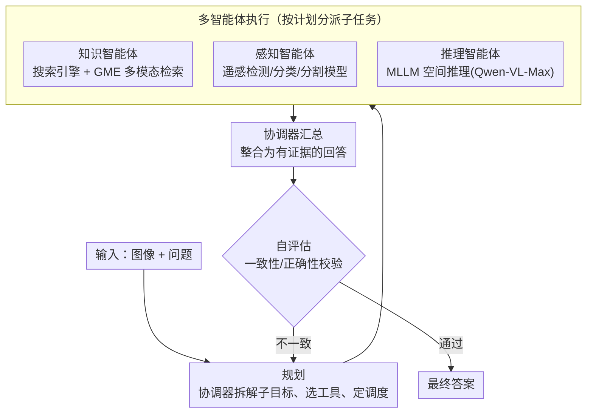

# GeoMMBench and GeoMMAgent: Toward Expert-Level Multimodal Intelligence in Geoscience and Remote Sensing

**会议**: CVPR 2026 Highlight  
**arXiv**: [2604.08896](https://arxiv.org/abs/2604.08896)  
**代码**: [https://geo-mm-agi.github.io](https://geo-mm-agi.github.io)  
**领域**: 遥感 / 多模态基准  
**关键词**: geoscience, remote sensing, benchmark, multi-agent, MLLM evaluation

## 一句话总结

提出 GeoMMBench（1053 道专家级地球科学多选题）和 GeoMMAgent（检索-感知-推理多智能体框架），系统评估 36 个 MLLM 在遥感领域的能力，揭示领域知识、感知接地和推理方面的系统性不足。

## 研究背景与动机

MLLMs 在通用领域快速发展，但在地球科学和遥感领域的评估仍然有限。现有 RS 基准范围狭窄，主要聚焦感知任务（分类、检测、分割），且通常局限于光学影像。而地球科学需要多传感器数据融合、时空推理和跨学科知识整合，现有基准无法充分评估这些能力。

GeoMMBench 是首个专家级、知识驱动的地球科学多模态基准，跨越多学科、多传感器和多任务层级。

## 方法详解

### 整体框架

这篇论文有两个产物：GeoMMBench 是专家级地球科学多模态评测基准，含 1053 道带图的多选题；GeoMMAgent 则是配套的多智能体框架，按「规划→执行→自评估」（plan–execute–evaluate）组织起检索、感知、推理三类专用工具，把通用 MLLM 接上领域知识库和遥感专用模型，去补它们在地球科学上的短板。前者负责「量出差距」，后者负责「补上差距」。下图是 GeoMMAgent 的工作流：统一协调器先做规划，再把子任务分派给三类智能体执行，汇总后交自评估模块校验，发现不一致就回到规划重跑。

### 关键设计

**1. 三维覆盖：让基准能真正逼出地球科学的专业能力**

现有遥感基准大多只考感知任务（分类、检测、分割），还基本局限在光学影像，根本测不出地球科学需要的跨传感器、跨学科能力。GeoMMBench 沿三个维度铺开题目：多学科上覆盖遥感、摄影测量、GIS、GNSS 以及数学、物理、地理等基础学科；多传感器上覆盖光学、SAR、多光谱/高光谱、LiDAR、DEM、热成像等；多任务层级上从理论概念、数据预处理一路到感知任务和高级地空间应用。三个维度交叉，才能把模型在「知识 / 接地 / 推理」上的缺口同时暴露出来。

**2. 专家级问题设计：保证基准的权威与可比**

要测「专家级」能力，题目本身就得有专家水准。所有题目由地球科学领域的 PhD 研究者和博士生经过广泛讨论制定范围与内容，素材取自教育资源、学术文献等权威参考。数据划分上，val 集 37 题用来评估人类专家表现并做模型选择，test 集 1016 题作为最终评测，使分数既可信又可比。

**3. plan–execute–evaluate 编排：把通用 MLLM 组织成能自查的专家流程**

通用 MLLM 缺的是领域知识和对复杂传感器数据的理解，单靠模型本身堆不出来。GeoMMAgent 没有把检索、感知、推理简单串成一条流水线，而是走「规划→执行→自评估」（plan–execute–evaluate）的回环。给定「图像+问题」，规划阶段由一个统一协调器（coordinator）内置的规划器把复杂问题拆成子目标，确定每步该调哪个智能体/工具以及执行顺序与依赖；执行阶段协调器按计划把子任务分派给检索、感知、推理三个专用智能体，再把它们的结构化输出汇总成一份有证据支撑的回答；自评估阶段复核推理链与答案是否与原计划一致、是否正确，一旦发现矛盾就触发选择性重跑或修正。正是这条「能自己发现错误、回头重来」的回环，让它区别于「直接问一个 MLLM」——任务被显式分解、工具被按需调用、答案还经过一道自查。

**4. 专用工具库：知识 / 感知 / 推理三类能力即插即用**

执行阶段的三个智能体各自背后是一个按能力划分的工具库。知识工具负责取外部信息：接 Wikipedia、Google 等搜索引擎做通用知识检索，并用 GME 做多模态检索，把图文证据与输入的图像-问题对齐，返回带出处的证据片段，保证回答有据可循；感知工具是一批传统遥感专用模型（目标检测、场景分类、土地利用/覆盖分割），在领域数据上有监督训练，专门读通用 MLLM 读不懂的 SAR、高光谱等复杂数据；推理工具则是先进 MLLM（实现里用 Qwen-VL-Max），在协调器判断需要解决复杂逻辑时被调用，做空间推理与综合分析。所有工具都按 Model Context Protocol（MCP）实现，新工具能即插即用——这正是它能不断扩展、覆盖更多遥感任务的底子。

### 损失函数 / 训练策略

GeoMMBench 为评估基准，无训练过程。GeoMMAgent 基于现有 LLMs 的零样本能力，通过工具调用增强。

## 实验关键数据

### 主实验

| 模型类别 | 代表模型 | GeoMMBench 准确率 | 说明 |
|---------|---------|----------------|------|
| 开源 MLLM | InternVL2.5, Qwen2.5-VL | 中等水平 | 领域知识不足 |
| 商用 MLLM | GPT-4o, Gemini | 较高但仍有差距 | 推理能力占优 |
| GeoMMAgent | 基于 LLM + 工具 | 显著提升 | 工具增强有效 |

val 集 37 题用于评估人类专家性能和模型选择，test 集 1016 题作为最终评估。问题由地球科学领域 PhD 研究者和博士生通过广泛讨论制定，来源包括教育资源、学术文献等权威参考。GeoMMAgent 走「规划→执行→自评估」回环，执行阶段的三类专用智能体分工：知识智能体从外部知识库获取光谱学、测绘学等领域知识，感知智能体利用遥感专用模型分析 SAR/高光谱等复杂数据，推理智能体进行空间推理和综合分析。

### 关键发现

- 所有 36 个测试的 MLLM 在地球科学领域都存在系统性不足
- 领域知识（如光谱学、测绘学）是最大短板
- GeoMMAgent 通过工具增强显著优于独立 LLM
- 多传感器理解（特别是 SAR、高光谱）远不如光学影像
- GeoMMBench 覆盖 4 个核心学科（遥感、摄影测量、GIS、GNSS）及数学、物理、地理等基础学科
- 任务层级从理论概念和数据预处理到感知任务和高级地空间应用，提供全面评估

## 亮点与洞察

- 首个专家级地球科学多模态基准，跨学科跨传感器跨任务层级
- 36 个模型的大规模评估建立了当前性能基线
- GeoMMAgent 证明工具增强对弥合领域差距的有效性
- 问题由领域专家精心设计，确保质量和权威性

## 局限与展望

- 1053 题的规模仍有限，部分子领域覆盖可能不够
- 多选题形式可能无法完全反映开放式推理能力
- GeoMMAgent 的工具集需要持续扩展以覆盖更多任务
- 对多时相分析和变化检测等时间序列任务的覆盖仍不足
- 开源和闭源 MLLM 间的性能差距显著，提示 RS 领域仍需专门领域微调

## 评分

- 新颖性：⭐⭐⭐⭐⭐ — 首个专家级地球科学多模态基准
- 技术深度：⭐⭐⭐⭐ — 多智能体框架设计合理
- 实验充分度：⭐⭐⭐⭐⭐ — 36个模型的全面评估
- 实用价值：⭐⭐⭐⭐⭐ — 为RS-AI发展提供标准化评估

<!-- RELATED:START -->

## 相关论文

- [\[CVPR 2026\] ChangeBridge: Spatiotemporal Image Generation with Multimodal Controls for Remote Sensing](changebridge_spatiotemporal_image_generation_with_multimodal_controls_for_remote.md)
- [\[CVPR 2026\] MM-OVSeg: Multimodal Optical-SAR Fusion for Open-Vocabulary Segmentation in Remote Sensing](mm-ovseg_multimodal_optical-sar_fusion_for_open-vocabulary_segmentation_in_remot.md)
- [\[CVPR 2026\] WRIVINDER: Towards Spatial Intelligence for Geo-locating Ground Images onto Satellite Imagery](wrivinder_towards_spatial_intelligence_for_geo-locating_ground_images_onto_satel.md)
- [\[CVPR 2026\] IMAIA: Interactive Maps AI Assistant for Travel Planning and Geo-Spatial Intelligence](imaia_interactive_maps_ai_assistant_for_travel_planning_and_geo-spatial_intellig.md)
- [\[CVPR 2026\] GeoCoT: Towards Reliable Remote Sensing Reasoning with Manifold Perspective](geocot_towards_reliable_remote_sensing_reasoning_with_manifold_perspective.md)

<!-- RELATED:END -->
