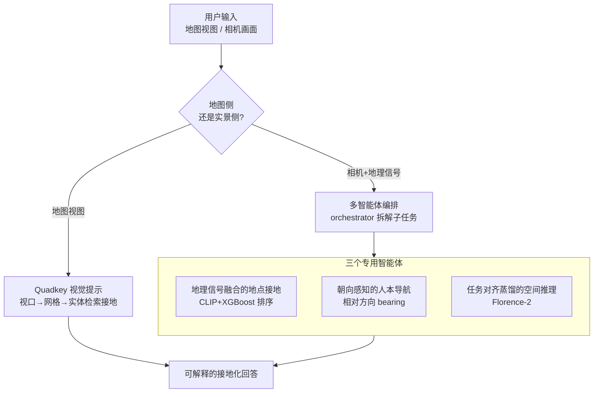

# IMAIA: Interactive Maps AI Assistant for Travel Planning and Geo-Spatial Intelligence

**会议**: CVPR 2026  
**论文**: [CVF Open Access](https://openaccess.thecvf.com/content/CVPR2026/html/Deng_IMAIA_Interactive_Maps_AI_Assistant_for_Travel_Planning_and_Geo-Spatial_CVPR_2026_paper.html)  
**代码**: 无  
**领域**: 多智能体 / 地理空间智能 / 多模态VLM  
**关键词**: 交互式地图、多智能体编排、视觉提示、地点接地、模型蒸馏

## 一句话总结
IMAIA 把"桌面端看地图"和"到达目的地最后 100 米的实景导航"统一进一个由轻量多智能体编排器协调的框架：地图侧用 quadkey 网格把视口变成结构化视觉提示让 VLM 做视图条件推理（地点检测从 <43% 提到 ~90%），实景侧由编排器调度"地点理解 / 朝向导航 / 空间推理"三个专用 agent，其中蒸馏出的 Florence-2 空间推理模块以 84% 准确率换来比 agent 流水线 7.3× 的提速。

## 研究背景与动机
**领域现状**：现代地图应用本质上还是"点-击"式交互——用户平移、缩放，然后发一些受限的固定查询。LLM/VLM 的兴起让"对话式、多模态地图助手"成为可能：模型能把模糊请求转成精确坐标、能描述图像。

**现有痛点**：两类场景被现有工具卡住。一是**地图侧的视图条件查询**，比如"我正在看的右上角公园旁那个花形建筑叫什么？"——纯文本 LLM 给不出基于当前视口的空间答案，普通 VLM 能描述图像但没有跟地图状态（视口、缩放、附近实体）和地理信号（经纬度、朝向、距离）显式接地，碰到模糊视觉线索就很脆。二是**实景侧的最后 100 米导航与就地探索**：人站在陌生建筑前，需要把相机看到的东西和周围地理上下文连起来，而旅行规划、导航、本地发现通常被做成彼此孤立的模块，交接生硬。

**核心矛盾**：地图空间推理、实景自我中心感知、人本导航这三件事在真实使用里是连续发生的，却在系统里被割裂处理；同时强空间 VLM（ASMv2、SpatialVLM、SpatialRGPT）要么延迟高、要么训练目标是 benchmark 而非具身导航任务，无法直接落地。

**本文目标**：造一个端到端、可部署的交互式地理空间助手，统一三种能力——(1) 以地图为中心的空间理解，(2) 相机到地点的接地，(3) 人本的、朝向感知的导航。

**切入角度**：不追求单个大模型解决一切，而是**做系统设计**——把地图视口离散成 quadkey 网格当作 VLM 的结构化视觉提示；把实景理解拆给一个多智能体后端；并把昂贵的空间推理蒸馏进一个小模型以满足实时性。VLM/视觉后端可热插拔，不改变系统行为。

**核心 idea**：用"quadkey 视觉提示 + 多智能体编排 + 任务对齐蒸馏"把地图探索和相机接地的最后 100 米导航缝进同一个 model-agnostic 框架。

## 方法详解

### 整体框架
IMAIA 由两个可互操作的组件构成，外加一个轻量多智能体编排层。**Maps Plus** 负责桌面式的地图交互：把当前视口转成 quadkey 索引网格、给每块瓦片附上视觉与语义属性、形成结构化视觉提示，让 VLM 在矢量图/卫星图上做视图条件推理，并用地理索引（Azure Maps）检索实体来接地回答。**PAISA**（Places AI Smart Assistant）负责 AR 式的实景交互：以一个 orchestrator 为核心，调度三个专用 agent——地点理解接地（Location Intelligence）、朝向感知导航（Interactive Navigation）、空间推理（Spatial Understanding）——把相机画面与位置、朝向、距离等地理信号融合，理解眼前场景并给出人本导航。整套系统模块化：换掉 VLM/视觉后端不影响系统行为。

### 关键设计

**1. Quadkey 视觉提示：把地图视口变成 VLM 看得懂的结构化空间提示**

痛点是 VLM 直接看一张地图截图做"右上角那个湖叫什么"这类视图条件查询时，没有显式的空间索引，定位全靠猜。Maps Plus 先确定用户当前视图的地理焦点和缩放级别，再把视口转成 **quadkey 索引网格**叠在简化地图上，每块 quadkey 瓦片被当作视觉提示里的一个结构化元素喂给多模态 LLM，让模型识别哪些瓦片含道路、公园、水体等显著实体。这种 quadkey 离散化把检测到的实体跟地图上精确的空间位置绑定，使瓦片级关系的空间相关分析成为可能；复杂版面被切成可管理的单元，"右上角"这种指示性空间词也能被定位到具体瓦片。最后用 Azure Maps API 按指定区域检索地理实体（如 Bonnet Lake、Abi's Park），把检测到的实体拼回用户查询、再次喂给 GPT-4o 做上下文推理给出精确答案。整条链路不微调 LLM，仅靠"把检索到的地理实体注入 LLM 上下文 + 把查询拆成子问题"，就把地点检测准确率从 <43% 拉到 89.83%。

**2. 多智能体编排：把割裂的"搜索-比较-导航"拼成一条端到端指令**

现代地图应用处理"找最近的奶茶店"这类用户中心查询时很拉胯——用户得手动发起搜索、按距离排序、再点导航，是好几步离散动作。PAISA 后端组织成一个多智能体系统：**orchestrator** 先分析查询并拆成更简单的子查询，转给**地点理解 agent** 检索候选实体及属性，再把富化后的信息转给**导航 agent** 生成最优路线，最后把导航方案返回 orchestrator 交付用户。论文强调这不是 LLM 幻觉——系统的内部决策可被审查（在目标区域做实体搜索、算用户到候选地点的距离、按距离排名，比如 "Boba Express" 因 1.6 英里最近而胜出），从而保证接地、可解释的推理。每个 agent 都由一个 LLM 驱动、配一套功能工具，三者分工承接整体框架里点名的三种能力。

**3. 地理信号融合的地点接地 + XGBoost 重排：让"相机拍到的店"对上真实 venue**

只靠图文相似度或只靠距离都不稳。地点理解 agent 把用户拍的图用 CLIP 视觉编码器编码，每个候选地点用 CLIP 文本编码器编码一个"地名+类别+经纬度"的结构化描述子，然后构造特征向量：(i) 图像与地点 embedding 的余弦相似度，(ii) 用户与地点的距离，(iii) **朝向一致性项**——用户设备朝向与"用户→地点"方位角的绝对角度差。再补上从 Azure Maps 搜索活跃度推出的本地热度先验作为数据质量信号。这些特征喂给 **XGBoost 排序模型**给相关性打分、对初检集合重排，top 候选再交给下游 LLM agent，提供紧凑、高召回的上下文。把"看着像 + 离得近 + 朝着它 + 当地热门"四类信号一起学，比单一信号鲁棒，Top-3 召回提升最明显。

**4. 朝向感知的人本导航：用相对方向代替死板的逐路口指令解决最后 100 米**

传统 turn-by-turn（TBT）导航跟着地图拓扑和预定义道路图走，常引入绕路；而行人会穿广场、抄近道。导航 agent（INA）针对最后 100 米，用用户经纬度、朝向和目的地坐标算出**方位角**：

$$\theta = \arctan\!\big(\sin(\Delta\lambda)\cdot\cos(\phi_2),\ \cos(\phi_1)\cdot\sin(\phi_2) - \sin(\phi_1)\cdot\cos(\phi_2)\cdot\cos(\Delta\lambda)\big)$$

其中 $\phi_1,\phi_2$ 是用户与目的地纬度、$\Delta\lambda=\lambda_2-\lambda_1$ 是经度差。再用用户朝向 $\alpha$ 调整成相对方向 $\text{Relative Direction} = \theta - \alpha$，并把结果归一到 $0\text{–}360°$ 罗盘友好区间。AR 界面用一个圆形罗盘叠加层实时画出指向目的地的红色箭头（相对正北的绿色），用户照着第一人称相机视角的指向走即可；还能触发目的地的街景预览。这种朝向感知引导比固定路径更贴合人自然的空间认知，实测显著减少绕路。

**5. 任务对齐蒸馏的空间推理：把 GPT-4o 蒸成 Florence-2，换实时性**

现有空间 VLM 要么慢、要么跟细粒度城市线索不对齐。空间理解 agent 用一条三阶段流水线把 **GPT-4o 蒸馏进 Florence-2**：阶段 (i) 用 GPT-4o-mini 对 4 万张街景图抽候选关键实体、保留最高频元素作为显著锚点；阶段 (ii) 用 YOLO-World 和 Depth Anything V2 提供 2D 定位与深度线索、GPT-4o 用 Set-of-Mark 式提示生成成对空间关系；阶段 (iii) 把每张标注图与反映真实城市导航需求的多样关系查询配对，构成监督微调集，以 Florence-2 的密集描述（dense captioning）格式微调，得到紧凑、响应快的空间推理模块。该 agent 输入单张街景图，抽取显著物体（招牌、立面、结构特征）及其空间关系（场景图或自然语言），支持两种系统功能：检索目的地缓存街景时生成关系描述（"咖啡馆入口就在红色雨棚左边"）帮用户确认位置；用户上传照片时转成结构化空间记录供下游接地、匹配、消歧。这种"目的地侧 + 用户侧"双向空间接地提升了最后一米导航的可解释性与可靠性。

## 实验关键数据

### 主实验
**Maps Plus 的 POI 检测准确率**：在 10 个美国城市、各取市中心 20 公里半径内 POI、由 GPT-4o 生成共 4,300 条合成查询（如"地图左上角那个湖是什么"）上评测，同一 LLM backbone、不微调。

| 方法 | POI 检测准确率 |
|------|----------------|
| Single Model（只给查询+地图截图） | 39.30% |
| Model + Location（加经纬度） | 41.46% |
| Model + Verbose Location（加城市/地标描述） | 42.74% |
| **Maps Plus（quadkey 视觉提示+实体接地）** | **89.83%** |

**空间理解模块（蒸馏 Florence-2）**：400 张街景图测试集，o1 作 LLM-as-judge。

| 对比对象 | 准确率/指标 | 本文蒸馏模型 |
|----------|------------|--------------|
| Florence-VL 8B（~10× 参数的通用多模态 LLM） | 27% 准确率 | **84%** 准确率 |
| ASM v2（场景图模型） | 平均每场景 ~4 个物体 | 平均 ~7 个物体 |
| Agent 流水线（V100 32GB） | 12.4s / 图 | **1.7s / 查询（7.3× 提速）** |

### 消融/对比实验
**地点候选排序（XGBoost ranker）**：500 张图查询训练、50 张留出评测。

| 排序方法 | P@Top-1 | R@Top-1 | P@Top-3 | R@Top-3 |
|----------|---------|---------|---------|---------|
| **XGBoost Ranker** | **80.4%** | **72.5%** | **36.2%** | **92.8%** |
| 仅距离排序 | 76.1% | 69.2% | 30.4% | 77.5% |
| 仅相似度排序 | 65.2% | 58.3% | 25.4% | 68.1% |

**人本导航 vs TBT 步行导航**（10 个最后 100 米场景，4 个需转向且目的地不可见、6 个可见但可能临时遮挡，时间相对标准 TBT 衡量）：

| 场景 | TBT 步行用时 | 人本引导用时 | 占 TBT |
|------|-------------|-------------|--------|
| 需转向（目的地不可见） | 3.28 min | 2.08 min | 63.5% |
| 直接可见 | 3.36 min | 1.07 min | 32.1% |

### 关键发现
- **接地数据注入是 Maps Plus 涨点主因**：单纯给 LLM 坐标或地名只带来 ~2-3% 提升，而把"地理索引检索到的实体"塞进上下文 + 把查询拆子问题，准确率直接翻倍到 ~90%，说明结构化空间接地比单纯堆位置文本有效得多。
- **任务对齐蒸馏 > 参数堆量**：84% vs Florence-VL 8B 的 27%，小模型靠任务对齐的蒸馏数据反超近 10× 参数的通用 VLM；同时 1.7s vs 12.4s 的 7.3× 提速是落地实时导航的关键。
- **XGBoost ranker 在 Top-3 召回上增益最大**（92.8% vs 距离排序 77.5%），即多信号融合主要提升"早期把多个正确候选都召回"的广度，而不牺牲 top-1 精度。
- **可见场景下人本导航收益更大**（用时仅 TBT 的 32.1%），因为 TBT 受路网拓扑约束会绕路，而直接朝向引导能让行人抄直线。

## 亮点与洞察
- **quadkey 当视觉提示**是最巧的一招：地图本就有现成的 quadkey 瓦片索引体系，把它直接复用成 VLM 的结构化网格提示，几乎零额外建模就把"右上角"这类指示词锚定到精确坐标——把已有地理基础设施借给了多模态推理。
- **可解释性当卖点**：论文专门论证 PAISA 的回答不是幻觉（展示"按距离排名、Boba Express 1.6 英里最近"的内部决策链），对面向用户部署的助手，这种可审查的推理路径比单纯准确率更重要。
- **model-agnostic 模块化**值得迁移：VLM/视觉后端可热插拔不改系统行为，意味着随基座模型升级整套系统自动受益，这种"系统设计为主、模型为辅"的思路可复制到其他多模态助手。
- **朝向一致性项**这个小特征很实用：把"用户朝向 vs 用户→地点方位角"的角度差当排序特征，把人到底"朝着不朝着"这家店的物理直觉编码进了接地，是纯图文相似度给不了的。

## 局限与展望
- **评测规模偏小且偏合成**：POI 检测用 GPT-4o 生成的合成查询，导航只测 10 个场景、空间理解 400 张图、排序仅 50 条留出，外加 ~15 人的非正式反馈——更像工程验证而非大规模严格 benchmark，泛化性存疑。
- **重度依赖闭源/商业组件**：GPT-4o、Azure Maps、CLIP、YOLO-World、Depth Anything 等环环相扣，复现成本高、且地理索引质量直接决定接地上限。
- **"准确率"用 LLM-as-judge（o1）衡量**空间描述对错，本身可能引入评测偏差，84% 这个数要打个问号（⚠️ 具体判定细节以原文为准）。
- **方位角导航假设设备朝向可靠**：手机指南针在城市峡谷、磁干扰下漂移会让相对方向失准，而这恰是最后 100 米最需要它的地方；论文未深入讨论该鲁棒性。
- 可改进方向：把蒸馏空间推理与地图侧 quadkey 提示打通成统一表征、引入在线学习更新地点热度先验、用真实用户轨迹替代合成查询做大规模评测。

## 相关工作与启发
- **vs 地理空间 LLM 工作（map search/对话式检索）**：前人证明 LLM 能从内部记忆或外部工具回答"X 有哪些景点"，但很少解决"怎么把现有地理索引系统的信息高效喂进 LLM"这个接口问题；IMAIA 的 quadkey 视觉提示 + 实体注入正是补这一环。
- **vs 空间 VLM（ASMv2 / SpatialVLM / SpatialRGPT）**：它们靠合成空间 QA、场景图、度量距离估计增强空间推理，但延迟高、训练目标 benchmark 导向而非具身任务；IMAIA 的蒸馏 Florence-2 牺牲一点通用性换来 7.3× 提速和任务对齐，更适合实时导航落地。
- **vs 传统 TBT 导航**：TBT 跟道路图走、会绕路；IMAIA 的朝向感知人本引导用第一人称相机+设备朝向算相对方向，贴合行人抄近道的真实行为。

## 评分
- 新颖性: ⭐⭐⭐⭐ quadkey 视觉提示 + 多智能体地理助手的系统组合很实用，但单个组件多为已有技术的工程缝合
- 实验充分度: ⭐⭐⭐ 各模块都有对比、提升明显，但数据集规模小、含合成查询与 LLM-as-judge，更像 demo 级验证
- 写作质量: ⭐⭐⭐⭐ 三能力分层清晰、图文配套、可解释性论证到位
- 价值: ⭐⭐⭐⭐ 面向真实部署的交互式地图体验，工程落地与产品化指引强

<!-- RELATED:START -->

## 相关论文

- [\[CVPR 2026\] WRIVINDER: Towards Spatial Intelligence for Geo-locating Ground Images onto Satellite Imagery](wrivinder_towards_spatial_intelligence_for_geo-locating_ground_images_onto_satel.md)
- [\[CVPR 2026\] RoadGIE: Towards A Global-Scale Aerial Benchmark for Generalizable Interactive Road Extraction](roadgie_towards_a_global-scale_aerial_benchmark_for_generalizable_interactive_ro.md)
- [\[CVPR 2026\] Orthogonal Spatial-Aware Multi-View Anchor Graph Clustering for Incomplete Remote Sensing Data](orthogonal_spatial-aware_multi-view_anchor_graph_clustering_for_incomplete_remot.md)
- [\[ICML 2025\] MapEval: A Map-Based Evaluation of Geo-Spatial Reasoning in Foundation Models](../../ICML2025/remote_sensing/mapeval_a_map-based_evaluation_of_geo-spatial_reasoning_in_foundation_models.md)
- [\[CVPR 2026\] NeighborMAE: Exploiting Spatial Dependencies between Neighboring Earth Observation Images in Masked Autoencoders Pretraining](neighbormae_exploiting_spatial_dependencies_between_neighboring_earth_observatio.md)

<!-- RELATED:END -->
