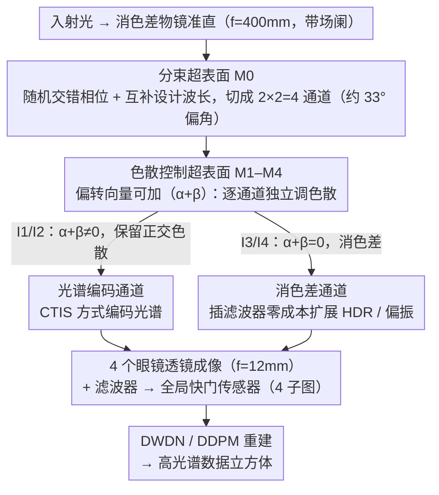

# MetaSpectra+: A Compact Broadband Metasurface Camera for Snapshot Hyperspectral+ Imaging

**会议**: CVPR 2026  
**arXiv**: [2603.09116](https://arxiv.org/abs/2603.09116)  
**代码**: [https://meta-imaging.qiguo.org](https://meta-imaging.qiguo.org)  
**领域**: 遥感 / 计算高光谱成像  
**关键词**: 超表面成像, 高光谱重建, 快照成像, HDR, 偏振成像

## 一句话总结

MetaSpectra+ 提出超表面-折射透镜混合光学范式，通过双层超表面独立控制4通道色散/曝光/偏振，实现250nm宽带、17mm最短光程的快照式高光谱+HDR/偏振多功能成像，在KAUST基准上PSNR达33.31dB全面超越现有快照高光谱系统。

## 研究背景与动机

**领域现状**：快照高光谱成像（Snapshot HSI）旨在从单次拍摄的2D传感器测量中恢复3D高光谱数据立方体。现有方案包括基于采样的方法（编码孔径、透镜阵列、光谱滤波阵列）和基于编码的方法（通过波长相关PSF将光谱信息嵌入空间域，利用DOE/光栅/棱镜等实现光谱编码）。同时，多功能超表面因能在单目形态下同时获取深度、偏振、光谱等多模态信息而受到关注。

**现有痛点**：超表面光学器件存在严重色差，绝大多数多功能超表面系统只能在10-100nm的极窄波段内工作，远远无法覆盖完整可见光谱。此外，现有方案将光束分裂和成像功能耦合在单一超表面上实现，导致F数偏大、系统不够紧凑。

**核心矛盾**：超表面的强色散是一把双刃剑——它是光谱调控的物理基础，但同时也严格限制了可用带宽。在多功能成像中，既要利用色散来编码光谱信息，又要能在需要时消除色散（如HDR/偏振通道需要消色差），这两者在传统单层超表面设计中不可兼得。

**本文目标** (1) 如何将多功能超表面的工作带宽从几十nm拓展到250nm以覆盖整个可见光谱？(2) 如何在同一系统中独立控制每个通道的色散量——部分通道有可控色散用于光谱编码，部分通道消色差用于HDR/偏振？(3) 如何在保持紧凑性的同时降低F数？

**切入角度**：作者观察到色散的本质是两层光学元件偏转向量的代数和（$\Delta \mathbf{x}_i(\lambda) = \frac{\lambda f}{\lambda_c}(\boldsymbol{\alpha}_i + \boldsymbol{\beta}_i)$），因此如果将光束分裂和色散控制分配到两层超表面，就可以通过调节第二层偏转向量 $\boldsymbol{\beta}_i$ 来独立控制每个通道的色散。当 $\boldsymbol{\alpha}_i + \boldsymbol{\beta}_i = 0$ 时完全消色差，否则保留可控色散。同时将成像功能交给折射透镜，实现功能解耦。

**核心 idea**：用双层超表面分别负责分束和色散控制，加折射透镜负责成像，通过偏转向量的可加性实现各通道色散独立可调，从而在紧凑形态下实现宽带多功能高光谱成像。

## 方法详解

### 整体框架

MetaSpectra+ 想在一颗 17mm 总光程的紧凑相机里同时拿到宽带高光谱和 HDR/偏振，核心思路是把"分束""色散控制""成像"三件事拆给不同光学元件去做，而不是像传统多功能超表面那样全压在一片超表面上。光沿着五级流水线走：先经过焦距 400mm、带场阑的消色差双胶合物镜准直；再打到分束超表面 M0，被切成 2×2=4 个约 33° 偏角的独立通道；每个通道各自穿过一片色散控制超表面 M1–M4，由它决定这一路是消色差还是保留可控色散；之后由 4 个 12mm 焦距的消色差双胶合"眼镜透镜"分别成像；最后经光学滤波器落到 7.1mm×7.1mm 的全局快门传感器上。4 路里 I1/I2 带正交方向色散、按 CTIS 方式编码光谱，I3/I4 消色差、留作 HDR 或偏振扩展。传感器上的 4 张子图最终由 DWDN 或 DDPM 重建出完整高光谱数据立方体。

### 关键设计

**1. 双层超表面 + 折射透镜的功能解耦：用偏转向量可加性把色散变成可调旋钮**

单层超表面的根本困境是分束、成像、色散全耦合在一处，强色散既是光谱编码的本钱又把可用带宽锁死在几十纳米。MetaSpectra+ 的关键观察是：PSF 随波长的位移本质上只是两层光学元件偏转向量的代数和。分束超表面给通道 $i$ 施加偏转 $\boldsymbol{\alpha}_i$，色散控制超表面再叠一个 $\boldsymbol{\beta}_i$，于是该通道的波长位移为

$$\Delta \mathbf{x}_i(\lambda) = \frac{\lambda f}{\lambda_c}(\boldsymbol{\alpha}_i + \boldsymbol{\beta}_i).$$

这一步把原本要靠波光学优化才能解决的色差问题，降维成了一道向量代数题：令 $\boldsymbol{\alpha}_i + \boldsymbol{\beta}_i = 0$，PSF 就不再随波长漂移，得到消色差聚焦（I3/I4）；让两者之和非零，就保留一段可控的、方向可设的色散（I1/I2 的正交色散正是这样配出来的）。每个通道的色散量和方向都能独立设定，再把"成像"这件事整体交给折射透镜，系统就同时摆脱了单层超表面的带宽上限和大 F 数，这也是它能在 17mm 内塞下宽带多功能成像的根本原因。

**2. 分束超表面 M0：随机交错相位 + 互补设计波长，把带宽撑到覆盖整个可见光谱**

要分出 4 路 33° 大偏角通道，最直接的做法是规则 2×2 马赛克排列，但大偏角下规则排列会激起很强的高阶衍射伪影。M0 的对策是让 4 个子相位轮廓按等权多项式分布随机交错采样：每个通道单独看是线性相位 $M_{0,i}(\mathbf{x}, \lambda_c) = \exp(j\frac{2\pi}{\lambda_c} \boldsymbol{\alpha}_i \cdot \mathbf{x})$，整片 M0 则是 $M_0(\mathbf{x}, \lambda_c) = M_{0,k}(\mathbf{x}, \lambda_c),\ k \sim \text{Multinomial}(1/4)$。色散虽让非设计波长产生多级衍射，但实测只有 0 级和 1 级显著，而 0 级会被后续场阑挡掉，于是有效调制可近似为 $M_{0,i}(\mathbf{x}, \lambda) \approx a_1(\lambda) M_{0,i}(\mathbf{x}, \lambda_c)$。随机交错以损失少量光效率为代价压住了伪影；与此配套，4 个通道刻意用不同设计波长 $\lambda_{c,1:4} = \{450, 550, 600, 750\}$ nm，让整个可见光谱在任意波长上至少被一个高效通道覆盖，从而把工作带宽从几十纳米拓到约 250nm。

**3. 消色差通道的零成本模态扩展：插一片滤波器就换出 HDR 或偏振**

因为 I3/I4 本身消色差、成像质量最接近常规相机，它们天然适合承担除光谱外的额外模态，而且只需在通道前插滤波器、完全不改光学设计。HDR 模式下给 I1–I3 插 OD=0.3、I4 插 OD=0.9 的 ND 滤波器，形成约 4:1 功率比的曝光包围，再用 Debevec–Malik 方法融合 I3、I4，相比单曝光多出约 11dB 动态范围；偏振模式则在 I3 前放 0°、I4 前放 90° 线偏振器，直接算水平-垂直线偏振度 $\text{DoLP}_{HV} = |I_3 - I_4| / |I_3 + I_4|$，而 I1+I2 不受偏振影响、继续干光谱编码的活。同一套硬件因此能在不增加光学复杂度的前提下切换"高光谱 + HDR"或"高光谱 + 偏振"。

### 损失函数 / 训练策略

从 4 张子图重建高光谱立方体有两条路：**DWDN** 先在特征域做维纳去卷积、再用多尺度前馈卷积网络精炼；**DDPM** 把子图分块后用扩散模型逐 patch 重建，每步额外估计归一化因子 $a^{k,t}$ 和偏置 $b^{k,t}$ 以保持跨 patch 的空间一致性（这是对 Hazineh 等人方法的改进）。训练数据取自 Harvard 和 ICVL 高光谱数据集，用 D-Flat 仿真器按实际光学设计合成子图，噪声水平 $\sigma$ 在 $[0.001, 0.01]$ 上均匀采样。

## 实验关键数据

### 主实验

在KAUST基准数据集上与现有快照高光谱成像系统对比（450-700nm波段）：

| 方法 | 会议 | 光学类型 | 子图像数 | TTL(mm) | PSNR(dB)↑ | SSIM↑ | SAM↓ |
|------|------|----------|---------|---------|-----------|-------|------|
| **Ours (DDPM)** | – | MS+Lens | 4 | **17** | **33.31** | 0.92 | 0.23 |
| **Ours (DWDN)** | – | MS+Lens | 4 | **17** | 32.92 | **0.94** | **0.17** |
| 2-in-1 Cam | SIG'24 | DOE+Lens | 2 | 50 | 31.14 | 0.86 | 0.24 |
| SfD | arXiv'25 | Lens | 5 | 44.5 | 27.54 | 0.82 | 0.40 |
| Array-HSI | SIG Asia'24 | DOE+CFA | 4 | 20 | 27.44 | 0.89 | 0.20 |
| SCCD | Optica'21 | DOE+CCA | 1 | 50 | 26.78 | 0.81 | 0.36 |
| Baek et al. | ICCV'21 | DOE | 1 | 50 | 26.68 | 0.74 | 0.39 |
| HRNet | CVPRW'20 | Lens | 1 | – | 23.03 | 0.76 | 0.31 |
| MST++ | CVPRW'22 | Lens | 1 | – | 21.85 | 0.68 | 0.32 |

### 消融实验

| 配置 | PSNR(dB) | SSIM | SAM | 说明 |
|------|----------|------|-----|------|
| 完整系统 (DDPM) | 33.31 | 0.92 | 0.23 | 扩散模型恢复，PSNR最优 |
| 完整系统 (DWDN) | 32.92 | 0.94 | 0.17 | 非扩散恢复，SSIM和SAM更优 |
| 仅消色差通道 (RGB→HSI) | 21-23 | ~0.7 | >0.3 | 无色散编码，退化为RGB升维，严重不足 |
| 规则2×2交错 M0 | – | – | – | 大偏角下产生强高阶衍射伪影 |
| HDR模式 (I3+I4融合) | – | – | – | 动态范围增加约11dB |

### 关键发现

- MetaSpectra+ 在KAUST基准上**所有指标全面超越**现有快照高光谱系统：PSNR比次优(2-in-1 Cam) 高2.17dB，同时TTL仅17mm（次优Array-HSI为20mm，其余均≥44.5mm）
- DWDN和DDPM各有优势：DDPM的PSNR更高（33.31 vs 32.92），但DWDN的SSIM（0.94 vs 0.92）和SAM（0.17 vs 0.23）更优，说明DDPM在重建锐度上更强但光谱保真度略逊
- 消色差至关重要：去除色散编码仅用RGB升维重建高光谱，PSNR暴跌约10dB，证明可控色散提供的光谱信息是高精度重建的关键
- 不同设计波长的互补覆盖策略有效：4通道 $\lambda_c = \{450, 550, 600, 750\}$ nm 确保整个450-700nm波段被高效采集
- 真实世界实验验证了HDR模式增加11dB动态范围和偏振模式的DoLP测量，均在保持高光谱重建质量的前提下实现

## 亮点与洞察

- **超表面-折射混合范式的根本创新**：将分束和成像功能解耦，分别由超表面和折射透镜完成，突破了单一超表面设计的带宽和F数限制。这一范式可推广到其他衍射/超表面光学系统
- **偏转向量可加性的优雅利用**：$\Delta \mathbf{x} \propto (\boldsymbol{\alpha} + \boldsymbol{\beta})$ 这个简洁的数学关系是整个系统的核心，将复杂的波光学色散控制简化为向量代数，使得消色差/可控色散的切换变得trivial
- **多功能扩展的零成本设计**：消色差通道天然适合HDR和偏振扩展，只需插入滤波器即可，不需要修改光学设计，体现了良好的模块化思想

## 局限与展望

- **景深有限**：原型系统景深仅0.2-0.7m，受限于400mm物镜焦距，远场应用需要更换光学元件
- **超表面制造门槛高**：SiN纳米柱阵列（300nm宽、775nm高）依赖专业纳米加工，量产成本和一致性是产业化瓶颈
- **随机交错牺牲光效率**：虽然抑制了高阶伪影，但随机采样意味着每个通道只获得约1/4的入射光，低光场景性能可能受限
- **DDPM推理速度慢**：扩散模型逐patch重建且需多步去噪，实时应用场景不现实
- **仅验证450-700nm**：虽然称宽带，但未覆盖近红外（700-1000nm），限制了在农业表型、遥感等需要NIR的应用

## 相关工作与启发

- **vs 2-in-1 Cam (SIGGRAPH'24)**：最接近的工作，也使用DOE+Lens混合方案，但仅2个子图像、50mm TTL、PSNR 31.14dB。MetaSpectra+ 通过超表面实现4通道+更紧凑+更高精度，优势全面
- **vs Array-HSI (SIGGRAPH Asia'24)**：同为4子图像，但用DOE+CFA、TTL 20mm、PSNR 27.44dB。MetaSpectra+ 在TTL更短的情况下PSNR高出5.5dB，说明超表面的色散可控能力优于DOE+CFA方案
- **vs SCCD/Baek (Optica'21/ICCV'21)**：单子图像DOE方案，PSNR仅26-27dB，MetaSpectra+的多通道+宽带策略优势明显

## 评分

- 新颖性: ⭐⭐⭐⭐⭐ 超表面-折射混合范式+偏转向量可加性色散控制是光学设计层面的根本创新
- 实验充分度: ⭐⭐⭐⭐ 仿真对比+真实原型+HDR/偏振演示全面，但缺少室外/动态场景验证
- 写作质量: ⭐⭐⭐⭐⭐ 光学模型推导完整严谨，从物理原理到系统设计逻辑清晰
- 价值: ⭐⭐⭐⭐⭐ 同时实现最紧凑形态和最高重建精度，为快照多功能成像定义了新标杆

<!-- RELATED:START -->

## 相关论文

- [\[CVPR 2026\] Orthogonal Spatial-Aware Multi-View Anchor Graph Clustering for Incomplete Remote Sensing Data](orthogonal_spatial-aware_multi-view_anchor_graph_clustering_for_incomplete_remot.md)
- [\[CVPR 2026\] MM-OVSeg: Multimodal Optical-SAR Fusion for Open-Vocabulary Segmentation in Remote Sensing](mm-ovseg_multimodal_optical-sar_fusion_for_open-vocabulary_segmentation_in_remot.md)
- [\[CVPR 2026\] ChangeBridge: Spatiotemporal Image Generation with Multimodal Controls for Remote Sensing](changebridge_spatiotemporal_image_generation_with_multimodal_controls_for_remote.md)
- [\[CVPR 2026\] Prompt-Free Unknown Label Generation for Open World Detection in Remote Sensing](prompt-free_unknown_label_generation_for_open_world_detection_in_remote_sensing.md)
- [\[CVPR 2026\] RECS4R: Bridging Semantics and Geometry for Referring Remote Sensing Interpretation](recs4r_bridging_semantics_and_geometry_for_referring_remote_sensing_interpretati.md)

<!-- RELATED:END -->
