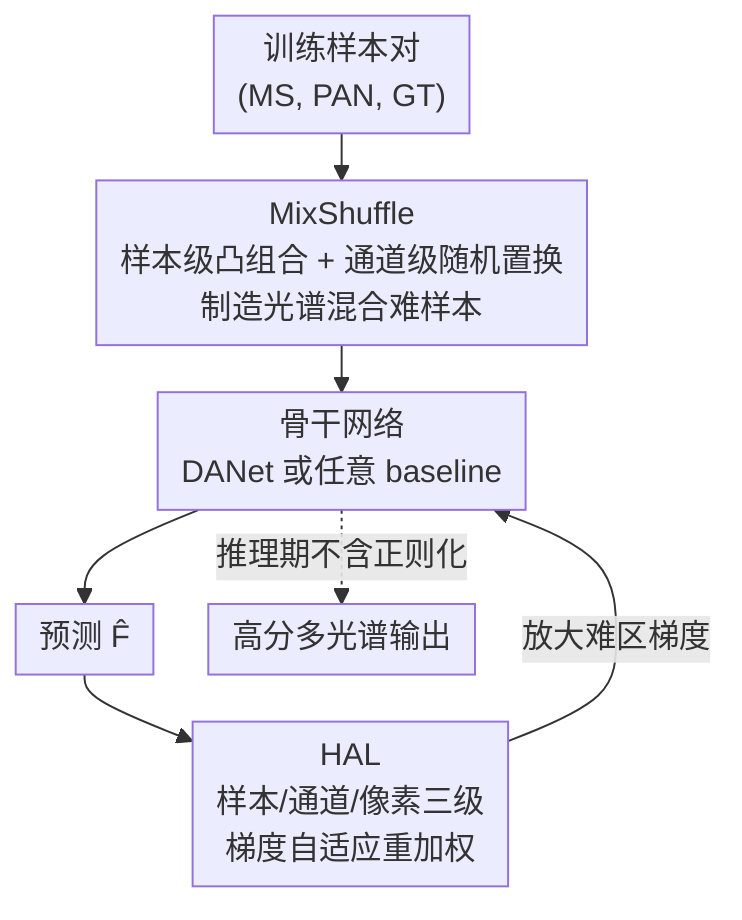

# Regulating Rather than Constraining: Adaptive Guidance for Complex Spectral Reconstruction in Pansharpening

**会议**: CVPR 2026  
**论文**: [CVF Open Access](https://openaccess.thecvf.com/content/CVPR2026/html/Wen_Regulating_Rather_than_Constraining_Adaptive_Guidance_for_Complex_Spectral_Reconstruction_CVPR_2026_paper.html)  
**代码**: https://github.com/Geo-Tell/DANet  
**领域**: 遥感 / 全色锐化 (Pansharpening)  
**关键词**: 全色锐化, 光谱重建, 数据增广, 梯度重加权, 正则化

## 一句话总结
针对全色锐化中"光谱混合区"（地物边界、内部纹理）重建效果差的问题，本文提出一套**架构无关的正则化框架**：数据侧用 MixShuffle 跨样本+跨光谱通道做凸组合制造"难样本"，损失侧用 HAL 在样本/通道/像素三级自适应放大难区梯度，并配套一个双尺度注意力网络 DANet 作骨干，在 WV3/GF2/QB 上取得 SOTA 且能即插即用地涨各类 baseline。

## 研究背景与动机

**领域现状**：全色锐化（pansharpening）要把高分辨率全色图 PAN 和低分辨率多光谱图 MS 融合成高分辨率多光谱图。和自然图像超分追求"看起来像"不同，遥感融合要求**数值上精确**的光谱保真。现有深度学习方法走两条路：一是不断堆架构（CNN/Transformer/Mamba，如可学习卷积核 ARConv），二是往网络里塞**物理约束**（小波分解、轮廓波分解、傅里叶域先验等）来强化特定特征。

**现有痛点**：这些方法在**同质地物**（一大片同类地表）上重建得不错，但一到**光谱混合区**——地物边界、建筑屋顶与地面的过渡带、复杂内部纹理——误差就显著上升，边缘糊、光谱失真。原因是这类像素结构复杂、却只占整图很小比例，在常规优化里被"平均"掉了。

**核心矛盾**：作者认为根因在于**优化过程对所有区域一视同仁**，导致占比小的混合区得不到足够的关注和学习。而两条主流路线各有死穴：只靠网络归纳偏置，很难直接学到泛化的混合规律；预设的物理约束虽能强化特定特征，却**把模型框死**在先验里，限制了它探索约束之外光谱组合的能力——这就是标题"Regulating Rather than Constraining"（要"调节引导"而非"硬性约束"）的由来。

**本文目标**：在不改动（甚至不依赖具体）网络架构的前提下，让模型把学习重心**自适应地**倾斜到难重建的光谱混合区，从而提升跨数据集、跨架构的泛化稳定性。

**切入角度**：基于数据和损失函数的正则化方式，能以更灵活的形式注入归纳假设，并**按训练需要动态调节强度**——这正好补上"架构/物理约束太刚性"的短板。

**核心 idea**：把"关注难区"这件事拆到**数据**和**损失**两端去做——数据端主动制造更多更难的光谱混合样本（MixShuffle），损失端主动把梯度重新分配给难区（HAL），二者都是"调节器"而非"约束器"，对训练几乎零额外开销、对推理零开销。

## 方法详解

### 整体框架
方法是一套**训练期正则化框架 + 一个骨干网络**。给定训练样本对，先在数据侧经 MixShuffle 制造富含光谱混合的增广样本，喂给骨干网络（可以是任意 baseline，也可用本文专门设计的 DANet）得到预测；在损失侧用 HAL 替代普通 L1，按样本/通道/像素三级对误差做多项式加权，把梯度自适应地放大到难重建区域。整套正则化即插即用、训练几乎零额外成本、推理无任何额外开销，因此能挂到各种现有网络上涨点；而 DANet 则通过跨尺度的空间-光谱注意力交互，为这套正则化提供一个更稳的结构地基。三者关系如下：

### 关键设计

**1. MixShuffle：跨样本又跨光谱通道的凸组合增广，专造光谱混合难样本**

痛点直接：训练集里光谱混合样本天然稀少，curriculum learning 只会"调度难度"却不"创造难度"，而经典 Mixup 只在样本间做线性混合、不动光谱维，造不出全色锐化真正缺的那种"跨地物光谱混合响应"。MixShuffle 把混合做成两步。第一步是**样本级**：对两个样本 $(M^\alpha,P^\alpha,F^\alpha)$ 和 $(M^\beta,P^\beta,F^\beta)$ 做凸组合，$M^{\alpha\beta}=\lambda_1 M^\alpha+(1-\lambda_1)M^\beta$，PAN 与 GT 同步混，$\lambda_1\sim\mathrm{Beta}(\theta_1,\theta_1)$。第二步是**光谱通道级**：在初步混合样本内部，对每个通道 $i$ 再与一个随机置换 $\pi$ 选中的通道 $\pi(i)$ 做凸组合，

$$\tilde m_i=\lambda_2 m_i^{\alpha\beta}+(1-\lambda_2)m_{\pi(i)}^{\alpha\beta},\quad \tilde f_i=\lambda_2 f_i^{\alpha\beta}+(1-\lambda_2)f_{\pi(i)}^{\alpha\beta}$$

其中 $\lambda_2\sim\mathrm{Beta}(\theta_2,\theta_2)$，$\pi\sim\mathrm{Uniform}(S_C)$（$S_C$ 是 $1{\sim}C$ 的全部随机排列）。两步合起来等价于"Mixup 的样本混合"叠加"Channel Shuffle 的通道乱序混合"：前者扩了地物的空间分布多样性，后者直接模拟了不同地物之间的光谱混合响应。MS 与 GT 用同一组 $\lambda,\pi$ 同步变换，保证增广后样本对仍然自洽可监督。这样网络就能在大量人工合成的"难样本"上反复练习混合区重建，而不是被动等真实数据里偶现的边界像素。

**2. 分层注意力损失 HAL：在样本/通道/像素三级把梯度重新分配给难区**

光有难样本还不够——常规 L1 损失对所有像素等权，混合区在 loss 里依旧被淹没。HAL 的思路是给误差**按大小加权**：误差越大（越难）的地方权重越高。它先定义三个粒度的 MAE：像素级 $e_{i,j}^{(c)}=|f_{i,j}^{(c)}-\hat f_{i,j}^{(c)}|$、通道级 $e^{(c)}=\frac{1}{HW}\sum_{i,j}e_{i,j}^{(c)}$、样本级 $e=\frac{1}{C}\sum_c e^{(c)}$（普通 L1 就等于 $e$）。再对三级误差各套一个多项式加权函数 $W(x)=x(1+x)^\gamma,\ \gamma\ge 0$，得到 $L_{\text{pixel}},L_{\text{channel}},L_{\text{sample}}$，最后凸组合：

$$L_{\text{HAL}}=\lambda_{\text{pixel}}L_{\text{pixel}}+\lambda_{\text{channel}}L_{\text{channel}}+\lambda_{\text{sample}}L_{\text{sample}}$$

关键在梯度行为：对 $\Omega$ 求导后，每一级梯度都多乘了一个权重项 $\varphi(x)=(1+x)^\gamma\!\left(1+\frac{\gamma x}{1+x}\right)$。这带来两个很妙的自适应性质：**训练早期误差大**时，$\varphi$ 显著放大梯度，难区更新被特别加强；**训练后期误差变小**时，$\varphi\to 1$，HAL 自动退化回标准 L1，不会过度抠难区而伤了整体收敛。三级一起作用，意味着模型能同时在"哪个样本难/哪个光谱通道难/哪个像素难"三个维度上重分配学习力度，恰好对上全色锐化"既要保空间细节又要保光谱保真"的双重诉求。

**3. DANet：跨尺度直接做空间-光谱注意力交互，给正则化一个稳的骨干**

前两个设计是架构无关的"外挂"，但作者还想要一个本身就强、能配合正则化把上限拉满的骨干。痛点是：MS 和 PAN 的空间结构与光谱过渡处在不同尺度，现有网络在上/下采样对齐特征时容易**空间-光谱错位**，导致边界模糊。DANet（Dual-scale Attention Network）由卷积层、级联的双尺度注意力交互模块 DAIM 和双尺度注意力融合模块 DAFM 组成，核心是让不同尺度的空间-光谱特征**直接做注意力交互**而非靠重采样硬对齐。DAIM 内部先用 Swin Transformer 块（ST）做自注意力精炼，再把每个 token 拆成两个子 token，分别走 ST 自交互和 SCT 跨模态交互，逐级渐进融合。其中 SCT（Shared Cross Transformer）是个省参数的巧设计：标准交叉注意力要为两路特征各配 query/key 矩阵，SCT 改用**共享的 query-key 矩阵** $I_m,I_p$，注意力矩阵直接写成 $A_m=\mathrm{Softmax}(I_m I_p^\top/\sqrt{C})$、$A_p=\mathrm{Softmax}(I_p I_m^\top/\sqrt{C})$，用一组共享矩阵算出互为转置的双向注意力，在不掉性能的前提下显著减少参数。DANet 单独看是个简洁高效的融合网络，配上 MixShuffle+HAL 后达到全场 SOTA。

### 损失函数 / 训练策略
训练损失即 HAL（式 6），由像素/通道/级别三项加权 L1 凸组合而成，多项式幂次 $\gamma$ 控制对难区的放大强度（$\gamma=0$ 退化为标准 L1）。MixShuffle 仅作用于训练数据增广，混合系数 $\lambda_1,\lambda_2$ 由 $\mathrm{Beta}(\theta,\theta)$ 采样、通道置换 $\pi$ 均匀采样。两项正则化都只在训练期生效，推理期完全不引入额外计算。

## 实验关键数据

### 主实验
在 WV3（8 波段，WorldView-3）、GF2（4 波段，GaoFen-2）、QB（4 波段，QuickBird）三个经典数据集上，对比 14 个 baseline（2 个传统 + 12 个深度方法，覆盖 CNN/Transformer/Mamba）。下表为 WV3 与 GF2 上完整模型（Proposed = DANet + MixShuffle + HAL）与代表性 SOTA 的对比（缩减分辨率指标）：

| 数据集 | 方法 | SAM↓ | ERGAS↓ | Q2n↑ | SCC↑ |
|--------|------|------|--------|------|------|
| WV3 | FusionMamba | 2.82 | 2.11 | 0.920 | 0.989 |
| WV3 | ARNet | 2.89 | 2.14 | 0.910 | 0.989 |
| WV3 | **Proposed** | **2.69** | **1.91** | **0.921** | **0.991** |
| GF2 | FusionMamba | 0.71 | 0.62 | 0.984 | 0.995 |
| GF2 | ADWM | 0.68 | 0.60 | 0.984 | 0.996 |
| GF2 | **Proposed** | **0.58** | **0.53** | **0.987** | **0.998** |

相比次优方法，SAM 在 WV3/GF2 上分别提升 4.6% / 14.7%，ERGAS 分别提升 3.5% / 5.4%。

**即插即用泛化性**：把 MixShuffle+HAL 挂到各类 baseline 上（QB 数据集，`*` 表示加了本文方法）均稳定涨点，例如 LAGNet 的 ERGAS 从 3.87→3.69、Invformer 的 SAM 涨 4.7%，证明正则化能适配不同架构的归纳偏置。

**边界区专项**（Table 4，光谱混合最严重的区域）——本文方法在边界 ERGAS 上提升尤为显著：

| 方法 | WV3 整体提升% | WV3 边界提升% | QB 边界提升% |
|------|------|------|------|
| FusionNet* | 11.02 | 18.74 | 19.03 |
| FusionMamba* | 6.70 | 15.13 | 4.21 |
| Invformer* | 6.69 | 7.24 | 8.41 |

边界提升普遍大于整体提升，与"专攻光谱混合区"的动机高度吻合。

### 消融实验
在 DANet 上逐一拆解 MixShuffle 与 HAL（缩减分辨率指标）：

| 数据集 | MixShuffle | HAL | SAM↓ | ERGAS↓ | Q2n↑ | SCC↑ |
|--------|:---:|:---:|------|--------|------|------|
| WV3 | | | 2.85 | 2.07 | 0.912 | 0.988 |
| WV3 | ✓ | | 2.74 | 1.96 | 0.918 | 0.990 |
| WV3 | | ✓ | 2.78 | 1.99 | 0.916 | 0.989 |
| WV3 | ✓ | ✓ | **2.69** | **1.91** | **0.921** | **0.991** |
| QB | | | 4.60 | 4.10 | 0.926 | 0.979 |
| QB | ✓ | ✓ | **4.38** | **3.67** | **0.935** | **0.984** |

### 关键发现
- **两个正则化各自独立有效、联用最优**：单加 MixShuffle 或单加 HAL 都能在三个数据集全指标上稳定涨点，二者联用进一步把 WV3 的 ERGAS 从 2.07 压到 1.91。两者一个补数据、一个补损失，互不冲突。
- **收益集中在难区**：边界/纹理区的提升幅度（最高 ~19%）远大于整体提升，定性误差图也显示本文方法在屋顶-地面、屋顶-墙体等过渡带误差最低，验证了"把学习力度倾斜到光谱混合区"这一核心假设。
- **几乎零成本**：两项正则化训练开销可忽略、推理零额外开销，却能给从 CNN 到 Mamba 的各类骨干稳定涨点，泛化面很广。

## 亮点与洞察
- **"调节而非约束"的方法论很有迁移价值**：与其往网络里硬塞物理先验把模型框死，不如把先验放到数据增广和损失加权里——可按训练需要动态调强弱，还天然架构无关。这个思路对其他"难区占比小、易被平均掉"的低层视觉任务（去噪、去雾、超分边缘）都可借鉴。
- **MixShuffle 的"通道维混合"是点睛之笔**：普通 Mixup 只在样本间混、造不出跨光谱的混合响应；加一步 Channel Shuffle 式的随机通道凸组合，恰好对症全色锐化最缺的那类难样本，且 MS/GT 同步变换保证监督自洽。
- **HAL 的自退化性质很优雅**：权重项 $\varphi$ 在早期放大难区梯度、后期自动趋于 1 回到标准 L1，相当于内置了一个"先抠难区、后整体收敛"的隐式课程，不需要手工设难度调度表。
- **SCT 的共享 query-key 矩阵**：用一组共享矩阵算出互为转置的双向跨模态注意力，在不掉点的前提下省参数，是个可复用的轻量交叉注意力 trick。

## 局限与展望
- 论文未给出 MixShuffle 的 $\theta_1,\theta_2$ 与 HAL 的 $\gamma$、$\lambda_{\text{pixel/channel/sample}}$ 等关键超参的敏感性分析（正文称见补充材料），实际部署时这些权重的调参成本和稳健性尚不明确。
- MixShuffle 的"凸组合"假设光谱混合近似线性可叠加，对强非线性混合响应（如某些材质的复杂反射）是否仍成立，论文未深入讨论。
- 方法专为全色锐化设计并以遥感数值保真为目标，是否能迁移到非数值保真的自然图像低层任务、以及在更多传感器/波段配置上的泛化，仍待验证。
- 评测主要在 WV3/GF2/QB 三个经典数据集的缩减+全分辨率协议下进行，跨域/跨传感器的真实泛化（而非同分布测试）还需更多 benchmark 支撑。

## 相关工作与启发
- **vs 架构改进派（ARConv / FusionMamba / 各类 Transformer）**：他们靠堆更强的网络结构提特征，本文不依赖特定架构、用数据+损失正则化引导，且能即插即用地反过来增强这些骨干——是正交且互补的方向。
- **vs 物理约束派（GPPNN / CDFInet / FAFNet，小波/轮廓波/傅里叶先验）**：物理约束在特定特征上有效但把模型框死、跨域易失效；本文用"软"的、可动态调节的正则化替代"硬"约束，换取更好的跨数据集泛化。
- **vs Mixup / Channel Shuffle**：MixShuffle 是二者的任务化结合——既继承 Mixup 的样本凸组合、又借 Channel Shuffle 思想做光谱通道随机混合，专门制造全色锐化所需的光谱混合难样本。
- **vs 对抗数据增广 / 课程学习**：对抗增广多造通用扰动、课程学习只调度难度不创造难度；本文强调"为任务定制地创造难样本（MixShuffle）+ 自适应放大难区梯度（HAL）"，更契合全色锐化对空间细节与光谱保真的双重要求。

## 评分
- 新颖性: ⭐⭐⭐⭐ "调节而非约束"的正则化范式+MixShuffle 跨光谱通道混合，思路清晰且对症
- 实验充分度: ⭐⭐⭐⭐ 3 数据集×7+ 架构验证泛化性，边界专项+消融到位，唯超参敏感性留给补充材料
- 写作质量: ⭐⭐⭐⭐ 动机推导扎实、公式完整、图表清楚
- 价值: ⭐⭐⭐⭐ 即插即用、近零成本、可迁移到其他难区占比小的低层视觉任务

<!-- RELATED:START -->

## 相关论文

- [\[CVPR 2026\] Exploring Spatiotemporal Feature Propagation for Video-Level Compressive Spectral Reconstruction](exploring_spatiotemporal_feature_propagation_for_video-level_compressive_spectra.md)
- [\[AAAI 2026\] M3SR: Multi-Scale Multi-Perceptual Mamba for Efficient Spectral Reconstruction](../../AAAI2026/remote_sensing/m3sr_multi-scale_multi-perceptual_mamba_for_efficient_spectral_reconstruction.md)
- [\[CVPR 2026\] Cross-Scale Pansharpening via ScaleFormer and the PanScale Benchmark](cross-scale_pansharpening_via_scaleformer_and_the_panscale_benchmark.md)
- [\[CVPR 2026\] Semantic-Adaptive Diffusion for Dynamic Spatiotemporal Fusion](semantic-adaptive_diffusion_for_dynamic_spatiotemporal_fusion.md)
- [\[CVPR 2026\] CrossEarth-Gate: Fisher-Guided Adaptive Tuning Engine for Efficient Adaptation of Cross-Domain Remote Sensing Semantic Segmentation](crossearth-gate_fisher-guided_adaptive_tuning_engine_for_efficient_adaptation_of.md)

<!-- RELATED:END -->
