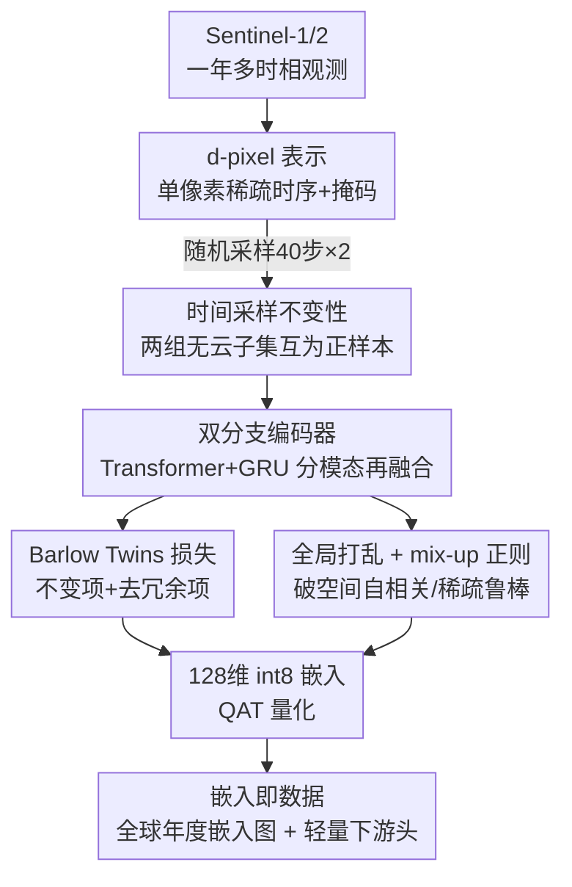

# TESSERA: Temporal Embeddings of Surface Spectra for Earth Representation and Analysis

**会议**: CVPR 2026  
**论文**: [CVF Open Access](https://openaccess.thecvf.com/content/CVPR2026/html/Feng_TESSERA_Temporal_Embeddings_of_Surface_Spectra_for_Earth_Representation_and_CVPR_2026_paper.html)  
**代码**: https://github.com/ucam-eo/tessera  
**领域**: 遥感 / 地球观测基础模型  
**关键词**: 地球观测、像素级基础模型、时间采样不变性、Barlow Twins、嵌入即数据

## 一句话总结
TESSERA 把每个 10m 地表像素的多年 Sentinel-1/2 时间序列编码成一个 128 维 int8 嵌入向量，靠"对随机时间采样保持不变"的自监督目标学到鲁棒的物候表征，发布成覆盖全球的"嵌入即数据"产品，下游只需挂一个轻量 MLP/UNet 头就能在分类、分割、回归任务上达到 SOTA，且在极低标注下优势巨大。

## 研究背景与动机
**领域现状**：卫星地球观测（EO）数据是连续不断的光学（Sentinel-2）和雷达（Sentinel-1）时间序列。近年遥感基础模型（RSFM）大量涌现，主流做 patch-based 的对比学习或掩码重建（SatMAE、CROMA、SkySense 等），并把这些模型当 backbone 在每个下游任务上微调。

**现有痛点**：卫星受云层遮挡、轨道重访不规则、不同传感器分辨率与周期各异，导致原始时间序列高度稀疏、缺测严重。主流做法靠 **compositing（合成无云镶嵌图）** 或时间平均来"补齐"，但这一步把物候动态（植被随季节的演变）和瞬态事件全都拍平了——而这恰恰是农业、林业、环境监测最需要的信号。结果是 RSFM 学到的表征偏向"理想化的无云条件"，对真实的不规则采样很脆弱。而且按 patch 训练、每个任务都要微调 backbone，对普通 EO 用户来说算力和标注成本都高。

**核心矛盾**：信息保真度 vs 数据规整性之间存在 trade-off——要让模型好训练就得 compositing 把数据规整成稠密无云，但规整的代价是丢掉时间相位信息；要保留物候就得直面又稀疏又不规则的原始序列。

**本文目标**：学到一种像素级、对采样不规则鲁棒、且标注高效的 EO 嵌入，并以"现成产品"形式发布，让下游不必碰原始卫星数据、不必微调 backbone。

**切入角度**：与其"过滤掉不完美的观测"，不如"逼模型对观测子集的选择保持不变"。作者的观察是：同一地点的物理过程是一致的，那么从这个地点随机抽两组无云观测子集，得到的嵌入就应该一样。把这个不变性当训练信号，模型自然学会跨传感器、跨季节、跨区域泛化。

**核心 idea**：用 Barlow Twins + 稀疏随机时间采样构造"时间采样不变性"，把每个像素的稀疏多模态时序压成一个鲁棒的 128 维嵌入——以"嵌入即数据（Embeddings-as-Data）"的方式发布，而不是发布又一个需要微调的 backbone。

## 方法详解

### 整体框架
TESSERA 的输入是某个 10m 地表位置一整年的 Sentinel-1（雷达 backscatter）和 Sentinel-2（光学波段）观测，输出是一个 128 维 int8 嵌入向量，代表这个像素一年的物候特征。整条管线分四步：先把时空对齐后的多时相影像在单个像素位置抽成一条带掩码的稀疏时间序列（即 **d-pixel**）；训练时对同一个 d-pixel 独立随机采两次（各取 40 个有效时间步）得到两个增强视图，分别送进光学/雷达**双分支编码器**融合成 128 维嵌入；用 **Barlow Twins + mix-up 正则 + 全局打乱**三个目标把两个视图的嵌入逼成一致且去冗余；推理时冻结编码器，对全球每个像素跑一遍生成嵌入图，下游任务只在冻结嵌入上挂一个轻量头。

### 关键设计

**1. d-pixel 与时间采样不变性：把"缺测"从缺陷变成训练信号**

痛点是云遮挡和不规则重访让时间序列又稀疏又对不齐，传统做法靠 compositing 补齐却丢了物候。TESSERA 的做法是直接定义 **d-pixel**——某个空间位置 $(i,j)$ 把所有光谱通道在整段时间上的取值收成一个集合 $P_{i,j}(c)=S(i,j,c)$，并配一个长度为 $T$ 的掩码向量 $m_{i,j}$ 标记哪些时间步有效。d-pixel 天然保留完整物候相位、又能优雅容纳不规则采样。关键的训练信号是：对同一个 d-pixel **独立随机采样两次**，各取 40 个有效时间步，得到两个增强视图 $(Y_A, Y_B)$，强迫模型对"到底选了哪批无云观测"保持不变。因为同一地点的物理过程是一致的，这个不变性逼模型只编码稳定的物候规律、丢掉对采样选择敏感的噪声，从而跨传感器/季节/区域泛化——这就把"缺测/采样不规则"从需要清洗的缺陷，反过来用成了自监督的增强来源。

**2. 双分支时序编码器：光学与雷达分编码再融合**

光学（S2）和雷达（S1）成像机理完全不同，硬塞一个编码器会互相干扰。TESSERA 用一个简单但高效的双分支结构分别处理两种模态。每个分支收到带掩码的时间序列，先把每个有效观测做线性投影 $\phi: \mathbb{R}^C \to \mathbb{R}^d$，再注入可学习的 **Day-of-Year 位置编码** $\psi(\text{DoY}(t))$ 表达"这一观测发生在一年中的哪一天"：$e_t = \phi(P^{(t)}_{i,j}) + \psi(\text{DoY}(t))$。序列被填充/重采样到固定长度 $L=40$，过一个 4 层 Transformer 编码器，再用 **GRU pooling** 聚合成定长向量 $z_{\text{mod}} \in \mathbb{R}^{128}$。两个模态的 $z_{S2}$ 和 $z_{S1}$ 拼接后过一个 2 层 MLP 融合成最终 $z \in \mathbb{R}^{128}$。DoY 位置编码是这里的巧点：它让 Transformer 知道每个观测的真实日历位置，即便观测在时间轴上稀疏散落，模型也能对齐物候相位，而不是把它们当成等间隔序列。

**3. Barlow Twins + mix-up 正则 + 全局打乱：三件套撑起稀疏下的鲁棒不变性**

这是把"采样不变性"真正落地的训练目标组合。基础是 **Barlow Twins 损失**，它对两个视图嵌入的互相关矩阵 $C$（batch-normalized 后计算）做约束：

$$\mathcal{L}_{BT} = \sum_i (1 - C_{ii})^2 + \lambda_{BT}\sum_i \sum_{j \neq i} C_{ij}^2$$

第一项（不变项）逼对角线趋近 1，即同一像素两个视图的嵌入要一致；第二项（去冗余项）逼非对角线趋近 0，让不同嵌入维度彼此去相关、提高信息效率（$\lambda_{BT}=5\times10^{-3}$）。但光有 Barlow Twins 在极端稀疏下容易过拟合，于是加 **mix-up 正则** $\mathcal{L}_{MIX}$：把一组视图沿 batch 维打乱得 $Y_S$，按系数 $\alpha_{mix}\sim U(0,1)$ 线性混合 $Y_M = \alpha_{mix}Y_A + (1-\alpha_{mix})Y_S$，要求输入空间的线性插值对应嵌入空间（互相关矩阵）的线性插值，惩罚实际互相关 $C^{MA}, C^{MS}$ 与目标值的偏差。总损失为 $\mathcal{L}_{total} = \mathcal{L}_{BT} + \lambda_{mix}\mathcal{L}_{MIX}$（$\lambda_{mix}=1.0$）。第三件套是 **全局打乱（global shuffling）**：在组 batch 之前把所有地理 tile 的 d-pixel 全局随机打散，破坏空间自相关——否则一个 batch 全是相邻像素、内容高度冗余，会让损失曲线毛糙、泛化变差。消融显示这三者是互补的：去掉打乱或 mixup 各掉 9.2/11.1 个 F1，两个都去掉掉 14.7。

### 损失函数 / 训练策略
预训练在约 8 亿个 d-pixel 上进行，采样自全球 3012 个 MGRS tile（2017–2024 年），用 16 张 AMD MI300X（每张 192GB）。每个 d-pixel 独立采两组 40 步视图，只训 **1 个 epoch**，全局 batch 高达 32,768，AdamW（$\eta=0.002$，weight decay $10^{-6}$），线性 warmup + 余弦衰减。训练时 $z$ 经一个深 projector MLP 升到 16,384 维算损失，推理时丢弃 projector。最终对 $z$ 做 **量化感知训练（QAT）** 压成 8-bit 整数，存储省约 4×、几乎不掉点。推理时冻结双编码器，对全球每个 10m 像素从年度 S1/S2 序列采 40 步生成嵌入；不足 40 个有效观测就有放回采样补齐以保证无缝输出。

## 实验关键数据

### 主实验
在 6 个跨任务基准（分类/分割/回归）上对比一大批 RSFM（CROMA、Prithvi、SkySense、Galileo、Presto、Google AlphaEarth 等），所有下游任务只在冻结嵌入上训轻量头（MLP / UNet）。

| 任务 / 数据集 | 指标 | TESSERA | 次优 (AlphaEarth) | 强微调基线 |
|--------------|------|---------|------------------|-----------|
| 分类 TreeSatAI-TS (全标注) | F1 ↑ | **77.96** | 76.90 | UNet 73.30 |
| 分类 TreeSatAI-TS (1% 标注) | F1 ↑ | **60.58** | 52.79 | — |
| 分类 Austrian Crop (1% 标注) | F1 ↑ | **66.15** | 37.22 | Presto 32.74 |
| 分割 PASTIS-R (全标注) | mIoU ↑ | 50.68 (第二) | **51.08** | ViT 42.57 |
| 分割 Austrian Crop (全标注) | mIoU ↑ | **53.12** | 25.70 | ViT 31.77 |
| 回归 Biomassters (全标注) | RMSE ↓ | **27.43** | 29.59 | SkySense 30.78 |
| 回归 Borneo CHM (全标注) | RMSE ↓ | **12.21** | 16.11 | SkySense 15.58 |

关键看点：在**极低标注**下优势最夸张——Austrian Crop 仅 1% 标注时 TESSERA 66.15 F1，比 AlphaEarth 高出 28.9 个点、比 Presto 高 33.4 个点；few-shot 每类只给 4 个样本仍能到 ~0.5 F1，而其他模型都在 0.4 以下。Biomassters 上裁掉 >500 t/ha 异常值后 TESSERA 用 4% 标注（26.61 t/ha）几乎追平赢了 1000+ 队竞赛的任务专用监督模型（25.90 t/ha）。而且 TESSERA 编码器仅 45.7M / 30.2M 参数，远小于 AlphaEarth 的 480M / 30.1M（注：原文两处参数数字略有出入，⚠️ 以原文为准）。

### 消融实验
在 Austrian Crop 分类上验证各设计（报 Validation F1 与 RankMe，越高越好）：

| 配置 | Val. F1 ↑ | RankMe ↑ | 说明 |
|------|----------|----------|------|
| Baseline (Full Model) | 77.3 | 0.963 | 完整模型 |
| w/o 全局打乱 | 68.1 (−9.2) | 0.847 | 空间自相关未破坏，泛化变差 |
| w/o mix-up 正则 | 66.2 (−11.1) | 0.857 | 稀疏下特征过拟合 |
| w/o Sentinel-1 数据 | 74.2 (−3.1) | 0.931 | 雷达模态有贡献但非主力 |
| w/o 打乱 & mixup | 62.6 (−14.7) | 0.867 | 两个一起去掉掉最多 |
| w/o int8 量化 | 77.9 (+0.6) | 0.972 | 量化几乎不掉点 |
| w/o 预训练 | 43.8 (−33.5) | — | 自监督预训练是命根 |

### 关键发现
- **预训练贡献最大**：去掉预训练直接掉 33.5 个 F1，是所有因素里最致命的。而且预训练后**微调反而无益**——冻结编码器和微调编码器效果一样，说明嵌入已是高度泛化的表征，省掉了 backbone 微调的算力。
- **打乱+mixup 互补**：两者单独去掉各掉 9~11 点，一起去掉掉 14.7 点，说明它们解决的是不同问题（空间自相关 vs 稀疏过拟合）。
- **量化几乎免费**：int8 量化只损失 0.6 F1，却把存储压到 fp32 的 ~25%，对全球级产品和边缘设备很划算。
- **云鲁棒性有阈值**：当一年有效无云观测掉到 ≤10~20 个时 Macro-F1 才急剧下降；但全球大多数地方每个轨道每年有 70+ 次观测，所以实际很鲁棒。
- **全局模型够用**：区域专门重训只带来微乎其微的提升，单个全球模型就能跨地理高性能，印证"嵌入即数据"范式不需要昂贵的区域定制。
- **L=40 是甜点**：在 $L\in\{20,40,96,365\}$ 中 40 步是精度-效率最优，且重复随机采样结果方差很小（印证采样不变性目标确实起作用）。

## 亮点与洞察
- **把数据缺陷变成自监督增强**：最妙的是"对随机时间采样保持不变"这个目标——别人把云遮挡当噪声去清洗，TESSERA 直接拿稀疏采样的随机性当数据增强，缺测越多反而提供越多的视图多样性，思路非常对症。
- **"嵌入即数据"产品化思维**：不发布一个又要微调的 backbone，而是直接发布全球、年度、10m、int8、像素级的现成嵌入图 + GeoTessera Python 库，下游 `pip install` 后挂个 MLP 就能用。这把 RSFM 的使用门槛从"会训练大模型"降到"会跑一个小 MLP"，FAIR 原则落地得很彻底。
- **冻结即最优**：消融发现预训练后微调毫无收益，这个反直觉结论说明自监督学到的物候表征已足够通用，对实际部署是巨大利好——可迁移到任何"先发布通用嵌入、下游只训轻量头"的场景。
- **DoY 位置编码处理不规则时序**：用一年中的天数而非序列下标做位置编码，是处理稀疏不规则时间序列的简洁解法，可迁移到任何带真实时间戳的稀疏序列建模。

## 局限与展望
- **像素级、无空间上下文**：预训练是纯像素级的，单个 d-pixel 之间无空间结构。虽然下游加 UNet 头能补回空间上下文（且标注越多增益越大），但这意味着分割/回归任务仍要靠下游头来学空间关系，PASTIS-R 上 TESSERA 也确实只排第二（略逊 AlphaEarth）。
- **年度嵌入的时间粒度粗**：默认产品是"一年一个嵌入"，对需要捕捉年内细粒度变化或跨年趋势的任务可能不够；论文提到可用更短的季节窗口推理，但这部分细节在补充材料里。
- **依赖 Sentinel-1/2 双模态可得**：方法构建在 S1+S2 配对上，若某区域某模态长期缺失，双分支融合的优势会打折（消融显示去掉 S1 掉 3.1 F1，影响不算大但确实存在）。
- **大量分析推到补充材料**：全局打乱、季节窗口、L 的选择、空间头细节等都 defer 到补充材料，正文可复现性有限。
- **改进方向**：把像素级预训练扩展到轻量的局部时空块预训练，或许能在不大幅增加成本下原生编码空间上下文，缓解分割任务上的劣势。

## 相关工作与启发
- **vs patch-based RSFM (SatMAE / CROMA / SkySense)**: 它们按 patch 训练、隐式假设输入已 compositing 去云、且每个下游任务都要微调 backbone；TESSERA 按像素时序训练、直接吃稀疏原始观测、下游冻结只训轻量头。区别在于 TESSERA 不丢物候、不需 backbone 微调，代价是预训练阶段没有空间上下文。
- **vs Presto / Google AlphaEarth (嵌入即数据范式)**: 同属"发布现成嵌入"路线，但 Presto/AlphaEarth 要么没全球像素级粒度、要么没完全开源、要么没显式处理不规则时间采样。TESSERA 补上这三个缺口：全球 10m 像素级、全开源（权重+代码+库）、且把时间采样不变性做成核心训练目标。在低标注下 TESSERA 大幅领先 AlphaEarth（且编码器小一个数量级）。
- **vs Lisaius et al.（本文的直接前身）**: 前作只用 Sentinel-2 单模态做 Barlow Twins EO 嵌入；TESSERA 在四点上扩展——融合 S1+S2 双模态新架构、引入全局打乱 + mix-up 两个互补正则、发布全球 int8 像素级嵌入产品、并做了跨分类/分割/回归的全面评测。

## 评分
- 新颖性: ⭐⭐⭐⭐ 时间采样不变性 + 嵌入即数据的组合很对症，但底层 Barlow Twins/mixup 都是已有部件的巧妙组装。
- 实验充分度: ⭐⭐⭐⭐⭐ 6 个跨任务基准、多标注比例、十余个 SOTA 对比、详尽消融与缩放分析，还自建两个新基准。
- 写作质量: ⭐⭐⭐⭐ 动机清晰、Q&A 式消融好读；但大量关键分析推到补充材料，正文略有信息缺口。
- 价值: ⭐⭐⭐⭐⭐ 全球开源像素级嵌入产品 + 极低标注下的碾压级表现，对遥感社区是实打实可直接用的资源。

<!-- RELATED:START -->

## 相关论文

- [\[CVPR 2026\] RAMEN: Resolution-Adjustable Multimodal Encoder for Earth Observation](ramen_resolution-adjustable_multimodal_encoder_for_earth_observation.md)
- [\[CVPR 2026\] OlmoEarth: Stable Latent Image Modeling for Multimodal Earth Observation](olmoearth_stable_latent_image_modeling_for_multimodal_earth_observation.md)
- [\[ICLR 2026\] Earth-Agent: Unlocking the Full Landscape of Earth Observation with Agents](../../ICLR2026/remote_sensing/earth-agent_unlocking_the_full_landscape_of_earth_observation_with_agents.md)
- [\[CVPR 2026\] Sparsely Timing the Change: A Spiking Temporal Framework for Remote Sensing Interpretation](sparsely_timing_the_change_a_spiking_temporal_framework_for_remote_sensing_inter.md)
- [\[AAAI 2026\] TDCNet: Spatio-Temporal Context Learning with Temporal Difference Convolution for Moving IRSTD](../../AAAI2026/remote_sensing/spatio-temporal_context_learning_with_temporal_difference_convolution_for_moving.md)

<!-- RELATED:END -->
