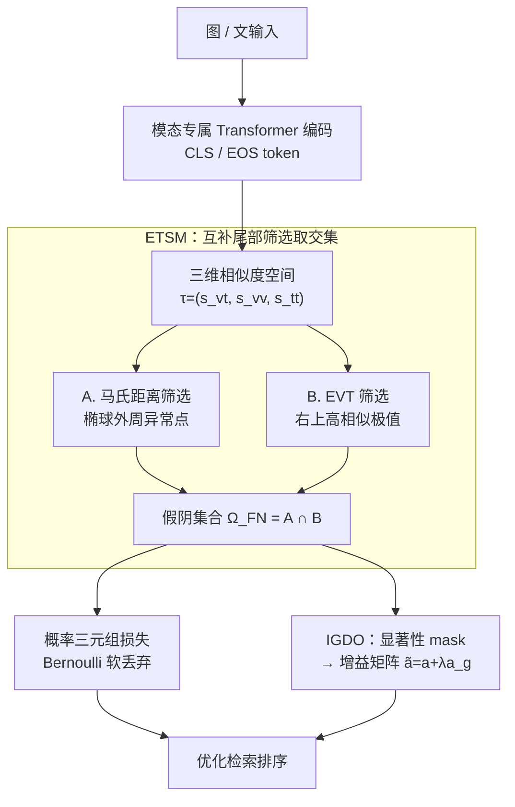

# TriSim: Tri-Dimensional Similarity Modeling with Extreme Value Theory for False-Negative Mitigation in Remote Sensing Image-Text Retrieval

**会议**: CVPR 2026  
**论文**: [CVF Open Access](https://openaccess.thecvf.com/content/CVPR2026/html/Zheng_TriSim_Tri-Dimensional_Similarity_Modeling_with_Extreme_Value_Theory_for_False-Negative_CVPR_2026_paper.html)  
**代码**: 无  
**领域**: 遥感图文检索 / 跨模态检索  
**关键词**: 遥感图文检索, 假阴样本, 极值理论, 三维相似度空间, 对比学习

## 一句话总结
针对遥感图文检索里"靠单一跨模态相似度阈值判假阴样本太脆弱"的问题，TriSim 把每对样本映射到 ⟨图-文, 图-图, 文-文⟩ 三维相似度空间，用马氏距离 + 极值理论（EVT）两条互补的尾部检测策略找出真正的假阴样本，再配一个 intra-modal 显著性引导的增益矩阵细化判别区域，在 RSICD / RSITMD 上 mR 分别超过最强基线 1.51% / 2.25%。

## 研究背景与动机

**领域现状**：遥感图文检索（RSITR）主流是对比学习——把锚点（anchor）和正样本拉近、和负样本推远。但遥感影像本身视觉/语义同质性极高（一片农田、一段海岸长得都差不多），mini-batch 里大量"负样本"其实和锚点语义相关，是被错标成负样本的**假阴样本（False Negative Samples, FNS）**。盲目把它们当负样本推远，会把语义相近的样本越推越散，破坏表示一致性。

**现有痛点**：现有缓解 FNS 的做法几乎都依赖**一个跨模态相似度阈值**——给负对算图文相似度，超过阈值就当 FNS、以一定概率丢弃。但单阈值在遥感数据上非常不可靠，根源是两类内禀属性：① **跨模态语义重叠**——不匹配的图文对共享部分语义（都含"建筑""道路"），相似度被抬高，于是真负样本被误判成 FNS 丢掉；② **跨模态语义鸿沟**——匹配的图文特征本身没对齐好，相似度偏低，于是漏掉的 FNS 被当真负样本继续推远。一刀切阈值同时制造"误删真负"和"漏检假阴"。

**核心矛盾**：判断一对图文是不是假阴，**只看图-文这一个维度信息不够**。作者的关键观察是：图文相似度异常高，往往不是因为它们真匹配，而是被强烈的**模态内**相关（图-图很像 / 文-文很像）带高的。单看跨模态相似度，看不到这层内在原因。

**本文目标**：构造一个能同时刻画跨模态与模态内关系的空间，在里面更稳健地把 FNS 从真负样本里挑出来，并进一步细化这些 FNS 的判别特征。

**切入角度**：把每对样本表示成三维相似度三元组 $\tau_{ij}=(s^{vt}_{ij}, s^{vv}_{ij}, s^{tt}_{ij})$。在这个三维空间里，FNS 不再是"某一维超阈值"，而是整体分布**长尾右上角的异常点（anomaly）**——既偏离主簇，又在多维上同时偏高。这正好可以用**异常检测 / 极值理论**来刻画。

**核心 idea**：用"三维相似度空间里的尾部异常检测"代替"单一跨模态阈值"来识别 FNS，并用模态内显著性差异引导一个增益矩阵来放大判别区域。

## 方法详解

### 整体框架
TriSim 的输入是一个 batch 的图文对，输出是优化后的检索模型（更准的图文相似度排序）。流程分三大块串行：① **编码**——图、文各过一个模态专属 Transformer（基于 RemoteCLIP backbone），取图的 CLS token 和文的 EOS token 算相似度；② **ETSM 模块**（EVT-guided Tri-dimensional Similarity Modeling）——把每对样本投到三维相似度空间，用马氏距离筛选 + EVT 筛选两条互补策略取**交集**得到假阴集合 $\Omega_{FN}$，再按概率做 Bernoulli 采样、驱动一个概率化三元组损失；③ **IGDO 模块**（Intra-modal Guided Discrimination Optimization）——对选出的 FNS，算模态内显著性差异生成 mask，监督学习一个增益矩阵，放大判别区域、压抑模糊区域。两个损失（概率三元组损失 + mask 损失）联合优化。

### 关键设计

**1. 三维相似度空间：把"为什么相似度高"显式建模出来**

痛点直指单阈值的盲区——只看图-文相似度，无法分辨"高相似是因为真匹配还是被模态内相关带高的"。TriSim 对每个候选对构造三元组 $\tau_{ij}=(s^{vt}_{ij}, s^{vv}_{ij}, s^{tt}_{ij})$：先用余弦算跨模态相似度 $s^{vt}_{ij}=s(v_i,t_j)$，再以它为索引算图-图 $s^{vv}_{ij}=s(v_i,v_j)$ 和文-文 $s^{tt}_{ij}=s(t_i,t_j)$ 两个模态内相似度。由于跨模态相似度量级通常低于模态内，先做归一化 $s^{vt}_{ij}=s^{vt}_{ij}/s^{vt}_{ii}$。作者观察到：FNS 在这个三维空间里集中在**右上角的重尾区域**——三个维度同时偏高。这把"判假阴"从一维阈值问题，重构成了"三维分布的尾部异常检测"问题，保留了样本间的成对关系结构，从根上缓解语义重叠/鸿沟带来的误判。

**2. 马氏距离 + EVT 两条互补尾部策略，取交集才算假阴**

光说"找尾部异常"还不够具体，TriSim 用两条针对性不同的策略，各管一类尾部样本，再交集求稳。

第一条是 **马氏距离筛选**，负责揪出偏离稠密椭球中心的**外周异常点**。算每个三元组到全体均值 $\mu$、协方差 $\Sigma$ 的马氏距离 $D_M(\tau_{ij})=\sqrt{(\tau_{ij}-\mu)^\top \Sigma^{-1}(\tau_{ij}-\mu)}$；其平方服从自由度为 3 的卡方分布，于是给定显著性水平 $\beta$，把 $D_M^2(\tau_{ij}) > \chi^2_{3,1-\beta}=c$ 的样本收进集合 $\Omega_M$。

第二条是 **EVT（极值理论）筛选**，专门盯**右上角的高相似极值**。先取每个三元组的最小分量 $\min(\tau_{ij})$，超过高分位阈值 $u$ 的进入候选 $\Upsilon$；对超出量 $y_{ij}=\min(\tau_{ij})-u$ 用广义帕累托分布（GPD）拟合：

$$f_{GPD}(y;\sigma,\xi)=\frac{1}{\sigma}\Big(1+\xi\frac{y}{\sigma}\Big)^{-1-1/\xi},\quad \xi\neq 0$$

通过极大化对数似然估出尺度 $\sigma$、形状 $\xi$，再算每个样本的尾部累积概率 $\hat F_{GPD}(y_{ij})$；超过 $1-p_g$ 的判为极值，构成 $\Omega_{EVT}$。最终假阴集合取**两者交集** $\Omega_{FN}=\Omega_M \cap \Omega_{EVT}$——既偏离主簇又是高相似极值，才算真正可信的 FNS，这比任一单条都更保守、更准（消融里 A+B 显著优于单策略）。

随后用 **概率三元组损失** 软处理这些 FNS：对 $\Omega_{FN}$ 内的对，按 $p^d_{ij}=(p_g+p_{ij}-1)/p_g$ 设丢弃概率，生成 Bernoulli 指示 $r_{ij}$，把它乘进三元组损失项（$\mathcal{L}_{v2t},\mathcal{L}_{t2v}$，margin 为 $\alpha$，取 hinge），$\mathcal{L}_{tri}=\frac{1}{2}(\mathcal{L}_{t2v}+\mathcal{L}_{v2t})$。这样高置信 FNS 大概率被"软丢弃"、不再被错误地当负样本推远，而非硬性一刀切。

**3. IGDO：用模态内显著性差异学一个增益矩阵，细化判别区域**

识别出 FNS 后还不够——有些 FNS 其实存在真正能区分它们的细节区域，应该被强调而非整体放过。IGDO 在最后一层 Transformer 前重新跑一遍 EVT 三维建模定位假阴对 $(v_i,t_j)$（$t_j$ 的正图为 $v_j$），然后改造最后一层的注意力相似度。具体先算图自相似 $a=s_{att}(v_i,v_i)$ 和跨图相似 $a'=s_{att}(v_i,v_j)$，沿列求和得 patch 级显著性向量 $b,b'$；在 $b$ 里高、在 $b'$ 里低的 patch（即 $v_i$ 独有、$v_j$ 没有的判别区）被记进掩码：$m_1=\mathbb{I}(b>\varepsilon)$，$m_2=\mathbb{I}(b'<\varepsilon')$，$m_{DSR}=(m_1\odot m_2)\cdot\mathbf{1}_{1\times N}$。

为了让这套筛选可训练而非硬阈值，作者把自掩码融进特征 $v_{gen}=m_1\odot v_i$，喂进轻量 MLP 预测潜在掩码 $m_g=\text{MLP}(v_{gen})\cdot\mathbf{1}_{1\times N}$，用 $m_{DSR}$ 做监督 $\mathcal{L}_{mask}=\lVert m_g - m_{DSR}\rVert_2$。$m_g$ 进一步引导学习增益矩阵 $a_g$ 并加回原相似度 $\tilde a=a+\lambda a_g$，替换 $a$ 参与 Transformer 训练，放大判别区、压抑模糊区。总损失 $\mathcal{L}=\mathcal{L}_{tri}+\gamma\mathcal{L}_{mask}$。这一步让模型"自适应地发现那些不代表通用语义类别、但对区分本样本至关重要的区域"。

### 损失函数 / 训练策略
总目标 $\mathcal{L}=\mathcal{L}_{tri}+\gamma\mathcal{L}_{mask}$。backbone 用预训练 RemoteCLIP，Transformer 层数 $L=2$；Adam 优化，初始学习率 $4\times10^{-4}$、衰减 0.7，batch size 700。两个筛选阶段超参不同：最后一层前 $q_u=0.9,\beta=0.1,p_g=0.1$；最后一层后 $q_u=0.99,\beta=0.01,p_g=0.01$。

## 实验关键数据

### 主实验
在 RSICD（10,921 张遥感图，每图 5 句描述）和 RSITMD（约 4,000 高分辨率图文对）上，对比 25 个基线（5 个通用检索、12 个遥感专用、11 个 CLIP-based）。指标为 R@1/5/10 和 mean recall（mR）。

| 数据集 | 指标(mR) | TriSim | 最强基线 | 提升 |
|--------|------|------|----------|------|
| RSICD | mR | 37.55 | GLISA 36.99 | +1.51% |
| RSITMD | mR | 51.35 | AIR 50.22 | +2.25% |

RSITMD 上文→图检索（T→I）全指标超越所有方法（R@1 26.95 / R@5 61.86 / R@10 78.58），图→文（I→T）提升较小——作者归因于文本描述多样性有限、更易产生假阴。

### 消融实验
均在 RSITMD 上进行。

模块消融（Table 2）：

| 配置 | mR | 说明 |
|------|---------|------|
| w/o all | 47.96 | 去掉 ETSM+IGDO 的基线 |
| w/o IGDO | 49.86 | 只加 ETSM，+1.90 |
| TriSim (full) | 51.35 | 再加 IGDO，再 +1.49 |

FNS 检测策略消融（Table 3）：

| 策略 | mR | 说明 |
|------|---------|------|
| CT（单跨模态阈值） | 48.54 | 最差，易受语义重叠/鸿沟影响 |
| AT（三维空间但按象限阈值） | 49.16 | 中等，仍不够精准 |
| A+B（马氏 ∩ EVT） | 51.35 | 最优，兼顾外周点与右上极值 |

### 关键发现
- **ETSM 是主力贡献**：单加 ETSM（EVT-guided 三维建模）就把 mR 从 47.96 拉到 49.86（文中另一处报 +3.96% 提升），证明"三维空间尾部检测"比单阈值识别 FNS 更有效；IGDO 在此之上再补判别细节。
- **两策略取交集胜过任一单策略**：CT→AT→A+B 单调上升，说明既要"偏离椭球中心"又要"右上高相似极值"双重条件，才能压住语义重叠/鸿沟造成的误判。
- **超参在两个位置各有最优**：$q_u,\beta,p_g$ 在最后一层前后取值不同（如 $q_u$ 前 0.9 / 后 0.99），均在峰值 51.35 附近呈先升后降，说明尾部分位阈值需要分位置独立调。

## 亮点与洞察
- **把"判假阴"重构成异常检测问题**：核心洞见是"图文相似度异常高常源于模态内相关"，于是引入图-图、文-文两维，让 FNS 在三维空间显形为长尾右上角异常点——这个视角转换比堆更复杂的注意力更本质。
- **马氏距离 + EVT 互补且统计可解释**：一个管椭球外周（卡方检验），一个管极值尾部（GPD 拟合），取交集自带"双重确认"的保守性，且都是有理论依据的统计量而非拍脑袋阈值，可迁移到任何"软标签找假阴"的对比学习场景。
- **显著性差异生成可训练 mask**：用"本图显著、参考图不显著"的 patch 差异定位判别区，再用轻量 MLP 把硬掩码变成可学增益，这套 intra-modal 引导思路对细粒度跨模态检索普遍适用。

## 局限性 / 可改进方向
- **只在两个相对小的遥感检索数据集验证**（RSICD/RSITMD），未在更大规模或更多模态（高光谱、SAR，引言提到却没用）上验证，泛化性待考。
- **超参偏多且需分位置独立调**：$q_u,\beta,p_g$ 在最后一层前后各一套，外加 $\lambda,\gamma,\varepsilon,\varepsilon'$，调参成本不低，文中也未给自动选取策略。
- **I→T 提升有限**：图→文方向改进明显小于文→图，作者归因于文本多样性不足，但这意味着方法对"文本侧假阴"的处理还不够，仍有空间。
- 消融 Table 2 中 w/o IGDO 的部分 R@K（如 I→T 的 R@1/R@5）反而高于 full model，说明 IGDO 主要提升 T→I 而非全面占优，全模型靠 mR 平均取胜，细看并非处处最优。

## 相关工作与启发
- **vs 单阈值软标签法（FNE [23]、[42, 53]）**：它们只用跨模态相似度设阈值给 FNS 打软标签，TriSim 引入图-图/文-文两维 + 统计尾部检测，能纠正"语义重叠误判真负""语义鸿沟漏检假阴"两类错误；图 4 直观展示了 TriSim 能把低跨模态相似但语义相关的对识别为 FNS、把高相似但真不匹配的对识别为真负。
- **vs 动态队列/记忆库扩负样本（[17, 59]）**：它们解决的是 mini-batch 内负样本太少的问题，TriSim 解决的是负样本"质量"问题（哪些是假阴），二者正交、可结合。
- **vs RemoteCLIP / GeoRSCLIP 等遥感预训练模型**：TriSim 以 RemoteCLIP 为 backbone，是在其表示之上做负样本优化与判别细化，属于互补增强而非替代。

## 评分
- 新颖性: ⭐⭐⭐⭐ 三维相似度空间 + EVT/马氏双策略检测 FNS 的视角新颖，把异常检测引入跨模态负样本优化。
- 实验充分度: ⭐⭐⭐⭐ 25 个基线、两数据集、模块/策略/超参三类消融齐全，但数据集规模偏小、模态单一。
- 写作质量: ⭐⭐⭐⭐ 动机—方法—实验逻辑清晰，公式与算法伪代码完整；部分符号（归一化、$m_2$ 阈值方向）需对照原文。
- 价值: ⭐⭐⭐⭐ 为遥感（及一般同质数据）跨模态检索的假阴问题提供了统计可解释的稳健方案，思路可迁移。

<!-- RELATED:START -->

## 相关论文

- [\[CVPR 2026\] Robust Remote Sensing Image–Text Retrieval with Noisy Correspondence](robust_remote_sensing_image-text_retrieval_with_noisy_correspondence.md)
- [\[CVPR 2026\] OlmoEarth: Stable Latent Image Modeling for Multimodal Earth Observation](olmoearth_stable_latent_image_modeling_for_multimodal_earth_observation.md)
- [\[CVPR 2026\] Cross-modal Fuzzy Alignment Network for Text-Aerial Person Retrieval and A Large-scale Benchmark](cross-modal_fuzzy_alignment_network_for_text-aerial_person_retrieval_and_a_large.md)
- [\[CVPR 2026\] ChangeBridge: Spatiotemporal Image Generation with Multimodal Controls for Remote Sensing](changebridge_spatiotemporal_image_generation_with_multimodal_controls_for_remote.md)
- [\[CVPR 2026\] GeoBridge: A Semantic-Anchored Multi-View Foundation Model Bridging Images and Text for Geo-Localization](geobridge_a_semantic-anchored_multi-view_foundation_model_bridging_images_and_te.md)

<!-- RELATED:END -->
