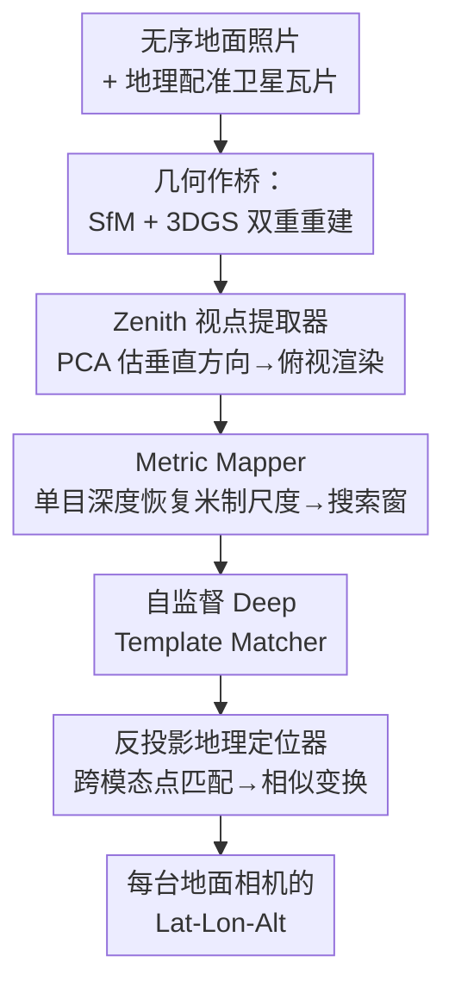

# WRIVINDER: Towards Spatial Intelligence for Geo-locating Ground Images onto Satellite Imagery

**会议**: CVPR 2026  
**论文**: [CVF Open Access](https://openaccess.thecvf.com/content/CVPR2026/html/Gudavalli_WRIVINDER_Towards_Spatial_Intelligence_for_Geo-locating_Ground_Images_onto_Satellite_CVPR_2026_paper.html)  
**代码**: https://github.com/Mayachitra-Inc/wrivinder  
**领域**: 遥感 / 跨视角地理定位 / 3D 重建  
**关键词**: 跨视角地理定位、零样本、3D Gaussian Splatting、SfM、卫星影像对齐

## 一句话总结
Wrivinder 把一组地面照片用 SfM+3DGS 重建成 3D 场景、渲染出俯视（zenith）视图，再用一个测试时自监督的模板匹配器把它对齐到地理配准的卫星影像上，从而在**完全零样本、无配对监督**的条件下反推出每台地面相机的 GPS 坐标，在 MC-Sat 上达到亚 30 米级定位精度。

## 研究背景与动机
**领域现状**：把地面图像和卫星地图对齐（cross-view geo-localization, CVGL）是导航、测绘、灾害响应、GPS 失效环境态势感知的核心能力。主流做法是用大量**配对、地理对齐**的 ground–satellite 数据做监督学习，把任务当成"检索"：给一张地面图，从卫星 crop 库里检索最相似的那块。Sample4Geo 在 CVUSA 上 Recall@1 已经做到 97.83%，Set-CVGL、SeqGeo 等还把检索扩展到多视图/序列输入。

**现有痛点**：这些方法有三个硬伤。其一，强依赖**配对监督**——而校园、工地、乡村这类真实非结构化场景里几乎拿不到配对地理对齐数据，导致分布漂移下泛化极差；它们也基本不是真正的零样本。其二，输出的是一张"最近邻卫星瓦片"，而不是**物理上有意义的相机位姿或 GPS 坐标**。其三，用的是 2D 特征表示，缺乏显式 3D 推理，在地面与高空之间巨大的视角、尺度、外观差异下很脆弱。

**核心矛盾**：地面视角和卫星俯视视角之间的鸿沟太大，同一区域在不同高度、朝向、遮挡下"长得完全不同"。要么靠海量配对数据硬学这种跨域对应（但数据稀缺、不泛化），要么换一种**不依赖跨域学习**的桥梁。

**本文目标**：在不做任何训练、不要配对数据、不假设地面是平面的前提下，从一组无序地面照片 + 一张卫星瓦片，恢复出所有地面相机的米制 GPS 坐标。

**切入角度**：作者主张用**几何**而不是学习来当桥梁——既然地面和卫星视角差异巨大，那就先把地面多视图重建成一个 3D 场景，把它"摆正"到俯视方向渲染出来，让它和卫星俯视图处在**同一个视角**，再做对齐就容易多了。多张地面照片聚合起来恰好提供了重建 3D 所需的多视约束。

**核心 idea**：**用几何重建 + 米制对齐代替检索学习**——把多视图地面照片重建成带真实外观的 3DGS 场景，渲染出俯视图，用单目深度恢复米制尺度框定卫星上的搜索窗，再用一个测试时自监督的模板匹配器完成对齐并反投影出每台相机的 GPS。

## 方法详解

### 整体框架
Wrivinder 是一条**零样本、训练自由**的五阶段流水线。输入是一组**无序的地面照片** + 一张**地理配准的卫星瓦片**，输出是每台地面相机的**经纬高（Lat-Lon-Alt）**。整条管线的核心思想是"先把地面场景摆成俯视、再和卫星比"：

先用标准 SfM（HLOC+COLMAP / GLOMAP / VGGT 风格）从无序照片估出相机内外参和稀疏点云，再用 3D Gaussian Splatting（Scaffold-GS / Octree-GS）在**同一坐标系**里加密成带真实外观的稠密场景（§4.1）。然后对稀疏点云做 PCA 估出场景的垂直方向，构造一个正交基把虚拟相机摆到场景正上方，渲染出一致的俯视（zenith）图（§4.2）。接着用单目深度（DepthPro / PatchFusion）给这个无尺度的 SfM 重建恢复**米制尺度**，算出俯视图覆盖的物理尺寸（宽高，单位米），结合卫星的地面采样距离（GSD）换算成卫星上的像素搜索窗（§4.3）。再用一个轻量级、**测试时自监督**的 Deep Template Matcher（Siamese ResNet-18）在这个搜索窗里找到俯视图对应的卫星位置（§4.4）。最后在该位置取一块卫星 patch 与 3DGS 俯视渲染做跨模态点匹配，把经纬度回灌给 3DGS 点、再经相似变换传播到所有 SfM 相机，得到全部相机的 GPS（§4.5）。

### 关键设计

**1. 几何作桥：SfM + 3DGS 双重重建，用真实感俯视图取代稀疏点云**

这一步直击"地面 vs 卫星视角鸿沟太大、2D 特征学不动跨域对应"这个痛点：与其学跨域映射，不如先把地面场景重建出来再换视角看。作者先用现成 SfM 求解器估出相机内外参和一个**任意相对坐标系**下的稀疏 3D 点云，再用 3DGS 在**同一坐标系**里加密。为什么非要 3DGS 而不是只用稀疏点云？经典几何方法（如 Kaminsky 等用边缘/自由空间线索匹配稀疏 SfM 点到卫星）的问题在于稀疏点云缺乏真实外观、在大视角差下很难匹配；3DGS 同时优化每个高斯基元的**几何与外观**，能抑制漂浮伪影、产出适合做稳定俯视渲染的高保真图像。相比 NeRF，3DGS 实时渲染、收敛快、高保真，又保留了 SfM 的几何精度。由于 SfM 和 3DGS 共享坐标系，后面无论从哪个表示渲染俯视图都几何一致。

**2. Zenith 视点提取器：用 PCA 估垂直方向，把场景"摆正"成俯视**

要把地面重建对齐到卫星俯视图，必须先确定"哪个方向是垂直向上"，才能渲染出真正的 top-down 视图。作者完全用几何解决：对所有 3D 点 $P=\{x_i\}_{i=1}^N$ 求质心 $c=\frac{1}{N}\sum_i x_i$，再对去心点做 PCA，协方差 $\Sigma=\frac{1}{N}\sum_i (x_i-c)(x_i-c)^\top$，取特征值降序的特征向量 $v_1,v_2,v_3$。**最小方差方向 $v_3$ 在户外场景里通常就是地平面法向**（因为场景在水平方向铺得开、垂直方向变化小），故取它为垂直轴。符号歧义用相机分布解决：若多数相机落在 $v_3$ 负半空间就翻转，最终 $\hat z=\mathrm{sign}\big((\bar c-c)^\top v_3\big)\,v_3$。再以最大方差方向 $v_1$ 为面内轴 $\hat x$、$\hat y=\hat z\times\hat x$ 构成旋转 $R_{\text{zenith}}=[\hat x,\hat y,\hat z]^\top$，把虚拟相机放到 $p=c+\delta\hat z$（$\delta$ 取点云 PCA 帧下 98 百分位半径，保证全场景覆盖），用 look-at 渲染。语义辅助上，作者还用 Mask2Former（BEiTv2 Adapter, COCO-Stuff 预训练，172 类）分割出 road/sidewalk/grass 等地面类，把语义标签传给 SfM 点，再联合"地面语义点 + 相机中心"拟合一致地平面（假设地面相机离地约 2 米内），让垂直/地平面估计更稳。

**3. Metric Mapper：用单目深度恢复米制尺度，把俯视图框成卫星上的搜索窗**

SfM 重建出来是**无量纲相对尺度**，没法直接和以米计的卫星影像对齐——这是这步要解决的痛点。作者用单目深度模型（DepthPro / PatchFusion）补上绝对尺度：对图像 $i$ 的 SfM 点深度 $z^{\text{sfm}}_k=e_3^\top(R_i X^{\text{sfm}}_k+t_i)$ 和预测米制深度 $d^{\text{pred}}_k=D_i(u_k,v_k)$，假设存在全局尺度 $s$ 使 $d^{\text{pred}}_k\approx s\,z^{\text{sfm}}_k$，用最小二乘求每图尺度 $s^\star_i=\frac{\sum_k z^{\text{sfm}}_k d^{\text{pred}}_k}{\sum_k (z^{\text{sfm}}_k)^2}$，再用 RANSAC 抗噪、取重建误差最低的图作为全局尺度 $\hat s$，统一缩放 $X^{\text{metric}}_k=\hat s\,X^{\text{sfm}}_k$。把米制点投到俯视坐标后，取 $(x,y)$ 的紧致包围盒得到物理尺寸 $W_m,H_m$；给定卫星地面采样距离 $g$（米/像素），换算成期望像素尺寸 $W_{px}\approx W_m/g$、$H_{px}\approx H_m/g$。**这个像素尺寸直接定义了后续匹配的搜索窗大小**——把全图盲搜变成有尺度先验的局部搜索，既降算力又提稳定性。

**4. 自监督 Deep Template Matcher + 反投影地理定位：粗到细对齐并回灌 GPS**

最后要把俯视渲染图和卫星图对上，但二者外观差异巨大（3DGS 渲染 vs 真实卫星），作者试过 RoMA、MatchAnything 等现成跨模态匹配器都不可靠。解法是一个**测试时自监督**的轻量匹配器（DTM）：Siamese ResNet-18，输入两块 crop、输出相似度。关键在于它**无需任何 ground–satellite 配对数据**就能训——直接从卫星图本身生成伪 GT：采样两块尺寸匹配俯视米制 footprint 的 crop，对其中一块加高斯模糊和局部强度扰动（"blobby jitter"）模拟 3DGS 渲染外观，网络去预测两块的 IoU，从而学到对视角/模态变化不变的相似度。推理时把 3DGS 俯视 crop 喂进一支、卫星搜索窗内所有候选 crop 喂进另一支，相似度形成热力图，**峰值即粗对齐位置**。这是"粗"。"细"在 §4.5：在峰值附近取稍大卫星 patch，用 MatchAnything-RoMA 做跨模态点匹配（局部匹配远比全图可靠），把经纬度赋给 3DGS 俯视像素 → 回灌 3DGS 点 → 每个 SfM 点继承最近 3DGS 邻居的地理坐标 → 用 RANSAC 相似变换把整个 SfM 重建对齐到世界坐标，输出所有相机 GPS。至此从"仅有地面图 + 卫星图"恢复出全部相机的地理位姿。

## 实验关键数据

### 主实验
在自建的 **MC-Sat** 基准（15 个多视图场景、约 20K 地面图，整合 ULTRAA/VisymScenes/ACC-NVS/JHU-Ames，卫星来自 NAIP 0.6–1.0 m/px 与 ESRI World Imagery）上零样本评测。报告三个定位指标（Haversine 距离，单位米，越低越好）和 SfM 对齐质量（World2Model RMSE）。下表摘录有代表性的几个场景：

| 场景 | 类型 | 卫星源 | 图数 | World2Model RMSE | 67% RMSE | 均值 RMSE | 质心误差 |
|------|------|--------|------|------------------|----------|-----------|----------|
| APL Front Door | Image Density | NAIP | 100 | 0.96 | 1.86 | 1.96 | 0.86 |
| APL Back Door | Image Density | NAIP | 100 | 1.13 | 2.56 | 2.82 | 0.76 |
| siteACC0003-finearts TR | Image Density | ESRI | 277 | 4.66 | 2.86 | 3.02 | 2.16 |
| siteSTR0003 (南美) | Reconstructed Area | ESRI | 2645 | NaN | 15.22 | 17.67 | 11.56 |
| MUTC A10 | Reconstructed Area | ESRI | 271 | 15.76 | 17.59 | 17.82 | 16.96 |
| siteSTR0008 (南美) | Reconstructed Area | ESRI | 2652 | NaN | 73.58 | 86.44 | 72.39 |

关键观察：**密集覆盖 / 紧凑布局**的 Image Density 场景表现最好（APL 两个门口 67% RMSE 仅 1.86–2.56 m，质心误差 < 1 m）；**大范围 Reconstructed Area** 场景误差显著上升，最差的 siteSTR0008 均值 RMSE 达 86.44 m。摘要给出的"亚 30 米级精度"是对密集与大范围场景的整体概括 ⚠️ 以原文为准。

### 误差来源分析

| 现象 | 关联指标 | 解释 |
|------|---------|------|
| 大范围场景误差高 | World2Model RMSE 偏高 / NaN | 屋顶、高耸结构从地面**永远观测不到**，俯视渲染出现空洞，模板匹配可靠性下降 |
| 定位强依赖重建稳定性 | World2Model RMSE↑ → 定位误差↑ | SfM 对齐差会传导到 3DGS 渲染与最终定位；若 < 67% 图能注册进主簇，该指标记为 NaN |
| 运行时间随图数近线性增长 | Run Time 272–2170 min | **SfM 阶段主导**计算开销 |
| 输出有抖动 | — | SfM 等多个环节用 RANSAC，结果有一定方差 |

### 关键发现
- **重建质量是天花板**：World2Model RMSE 高的场景定位误差最差，说明对齐精度被 SfM/3DGS 重建稳定性死死卡住。
- **观测覆盖决定成败**：地面拍不到的屋顶/高层在俯视图里变成空洞，是大场景误差升高的主因（Fig. 5 可见渲染图的 gap/模糊）。
- **算力瓶颈在 SfM**：运行时间随输入图数近线性增长，最大场景超 36 小时（2170 min），SfM 是主要成本。
- **改进方向**：把语义直接注入 3DGS（semantic Gaussians），用语义增强的 splat 减少俯视渲染伪影、提供更稳的对齐线索。

## 亮点与洞察
- **"几何当桥"绕开配对监督**：跨视角对齐最难的是跨域学习，作者干脆先重建 3D 再换成俯视视角，把"跨视角匹配"降维成"同视角匹配"，从根上摆脱了对配对地理数据的依赖——这是最核心的 aha。
- **纯几何估垂直方向**：用点云 PCA 的最小方差轴当地平面法向、再用相机分布消符号歧义，零学习、零标注就把场景"摆正"，简单且鲁棒，可直接迁移到任何需要 top-down 渲染的多视图场景。
- **从卫星图自造监督**：DTM 不用任何 ground–satellite 配对，直接在卫星图上裁两块 + 加 blobby jitter 模拟渲染外观、学 IoU，这种"用目标域自身造伪 GT"的思路对所有缺配对数据的跨模态匹配都有借鉴价值。
- **粗到细的两段匹配**：先用轻量 Siamese 热力图框定粗位置、再在局部用 RoMA 做精点匹配，规避了全图跨模态匹配不可靠的问题，是一个务实的工程折中。

## 局限与展望
- **强依赖观测完整性**：地面拍不到的屋顶/高层结构在俯视图里是空洞，直接拉高大场景误差；本质上"地面到天顶"的信息缺口无法靠几何补全。
- **算力昂贵**：SfM 主导、运行时间随图数近线性增长，最大场景需数十小时，离实时/在线定位还很远。
- **米制尺度依赖单目深度质量**：尺度恢复建立在"噪声但一致"的单目深度上，深度系统性偏差会整体污染米制对齐（虽有 RANSAC 缓解）。
- **基准仍是初版**：MC-Sat 目前只有三类定位 RMSE，缺 IoU 模板匹配精度、多分辨率卫星对比等更细评测；结果有 RANSAC 引入的方差。
- **改进思路**：语义增强 3DGS 减伪影；更鲁棒的跨视角/跨模态匹配器；引入学习到的几何先验填补未观测表面。

## 相关工作与启发
- **vs Sample4Geo / Set-CVGL / SeqGeo（监督检索式 CVGL）**: 它们靠海量配对数据学 ground–overhead 对应、输出最近邻卫星瓦片，在 road-centric 基准上接近饱和（CVUSA Recall@1 97.83%）但不泛化、非真零样本、无物理位姿；Wrivinder 不要配对、不微调、不限平面假设，直接输出米制 GPS，代价是依赖重建质量、算力大。
- **vs Kaminsky 等经典几何对齐**: 都走 SfM + 几何线索路线，但前者用稀疏点云 + 边缘/自由空间代价函数，外观缺失、大视角差难匹配；Wrivinder 用稠密 3DGS 提供真实外观，做光度对齐。
- **vs NeRF 系跨视角/航拍合成**: NeRF 慢、训练重；Wrivinder 用 3DGS 实时渲染、快收敛、高保真，同时保留 SfM 几何精度。
- **vs BEV / 基础模型映射**: BEV 模型靠配对监督且常假设平地，基础模型语义先验强但需任务适配；Wrivinder 用显式 3D 几何投影得到俯视图，支持真零样本部署、能容纳复杂 3D 结构。

## 评分
- 新颖性: ⭐⭐⭐⭐⭐ 用"几何重建 + 米制对齐"取代检索学习，把跨视角降维成同视角，路线新且自洽
- 实验充分度: ⭐⭐⭐⭐ 自建 MC-Sat 跨多源 15 场景系统评测、误差来源分析到位，但缺与监督 CVGL 的同基准直接对比、消融偏弱
- 写作质量: ⭐⭐⭐⭐⭐ 五阶段流水线讲得清楚，公式与图（Fig.3/4/5）配合到位，诚实交代失败场景
- 价值: ⭐⭐⭐⭐ 在无配对数据的真实场景里建立首个几何中心零样本 ground-to-satellite 基线，数据集+代码开源，应用与后续研究价值大

<!-- RELATED:START -->

## 相关论文

- [\[CVPR 2026\] IMAIA: Interactive Maps AI Assistant for Travel Planning and Geo-Spatial Intelligence](imaia_interactive_maps_ai_assistant_for_travel_planning_and_geo-spatial_intellig.md)
- [\[CVPR 2026\] GeoBridge: A Semantic-Anchored Multi-View Foundation Model Bridging Images and Text for Geo-Localization](geobridge_a_semantic-anchored_multi-view_foundation_model_bridging_images_and_te.md)
- [\[CVPR 2026\] Spectrally Distilled Representations Aligned with Instruction-Augmented LLMs for Satellite Imagery](spectrally_distilled_representations_aligned_with_instruction-augmented_llms_for.md)
- [\[CVPR 2026\] NeighborMAE: Exploiting Spatial Dependencies between Neighboring Earth Observation Images in Masked Autoencoders Pretraining](neighbormae_exploiting_spatial_dependencies_between_neighboring_earth_observatio.md)
- [\[CVPR 2026\] UniGeoRS: A Unified Benchmark for Tri-view Geo-Localization](unigeors_a_unified_benchmark_for_tri-view_geo-localization.md)

<!-- RELATED:END -->
