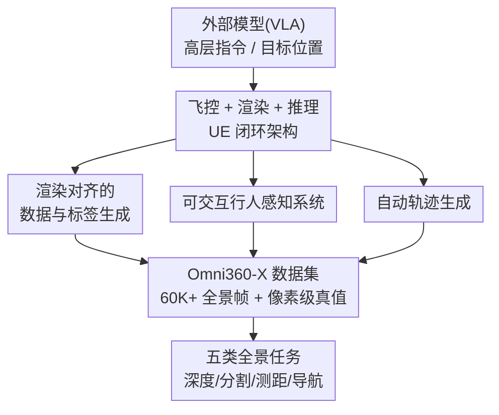

# AirSim360: A Panoramic Simulation Platform within Drone View

**会议**: CVPR 2026  
**论文**: [CVF Open Access](https://openaccess.thecvf.com/content/CVPR2026/html/Ge_AirSim360_A_Panoramic_Simulation_Platform_within_Drone_View_CVPR_2026_paper.html)  
**代码**: 待开源（作者承诺公开工具包、插件与数据集）  
**领域**: 机器人 / 具身智能  
**关键词**: 全景仿真、无人机、闭环模拟、全向感知、合成数据

## 一句话总结
基于 Unreal Engine（兼容 UE 4.27–5.6）搭一个面向无人机视角的 360° 全景闭环仿真平台 AirSim360，配套"渲染对齐的像素级标注、可交互行人系统、自动轨迹生成"三件套工具链，一口气合成 6 万多帧带深度/全景分割/3D 关键点的全向数据，并在深度估计、分割、行人测距、视觉语言导航等五类任务上证明合成数据能迁移到真实场景。

## 研究背景与动机
**领域现状**：全向（360°）感知对空间智能和具身智能（如无人机导航中的全向避障）价值很大，主流的全景表示是等距柱状投影（Equirectangular Projection, ERP），它能把多个透视视角压进一张连续图像里。

**现有痛点**：与海量的透视图像数据集相比，全景数据极度稀缺——日常生活中 360° 相机用得少，加上很多任务需要人工逐像素标注，成本高。结果是大多数全景方法被困在小数据集上，几乎没探索过数据规模化（data scaling）。

**核心矛盾**：一个看似直接的办法是"在仿真器里让 agent 绕多个角度转一圈拍全向视图"，但这条路有两个硬伤。其一是计算低效：反复渲染拖慢数据采集；其二是真值定义错位——全向深度沿视线方向是斜距（slant range），而透视投影下深度是沿光轴的正交 z 距离，直接照搬透视真值是错的。

**本文目标**：造一个原生支持全景、面向无人机视角的仿真平台，能高效、批量地产出像素级对齐的全向真值（深度、语义/实体分割、3D 人体关键点），并支持导航类任务。

**切入角度**：选无人机（UAV）当 agent，是因为它能比地面机器人探索更广的空间、采到更多样的数据；把全景仿真建模成静态高质量场景 + 可动行人组成的"4D 真实世界"。

**核心 idea**：用"六面立方体视图实时拼接成 ERP + GPU 侧纹理直拷"绕开多次渲染，配合渲染对齐的真值生成、行人行为系统和自动轨迹规划，把无人机全向数据的生产做成可规模化的自动流水线。

## 方法详解

### 整体框架
AirSim360 是一个在线闭环仿真器：外部模型（如 VLA 策略）输出高层控制指令或目标位置 → 自研飞控模块把它解析成四个旋翼的推力和力矩 → UE 渲染引擎实时渲染场景 → 各类虚拟传感器同步取数。围绕这个闭环，平台额外提供三个离线数据生成模块，把"采什么、怎么标、飞哪条线"都自动化：渲染对齐的数据与标签生成、可交互行人感知系统（IPAS）、自动轨迹生成。整套工具链兼容 UE 4.27 到 5.6，默认用 UE5（动态光照、几何细节、可扩展性更好）。

### 关键设计

**1. 渲染对齐的数据与标签生成：把六面立方体一次性拼成 ERP，并逐类型校正全向真值**

最核心的设计，针对"绕角度多次渲染又慢又错"的痛点。平台架了六台同样标定、朝六个方向（前后左右上下、各 90° 视场）的理想针孔相机，输出六张不重叠的立方体图 $I_c^{6\times H_c \times W_c}$，再拼成一张 ERP 图 $I_e^{H_e \times W_e}$（用球面投影作为输入输出之间的桥梁）。难点在于"同时拍六个方向"会让 GPU 渲染负载和存储压力暴增、高分辨率下帧率掉得厉害。作者从底层重做了多视角图像的合成机制：调用渲染硬件接口（Render Hardware Interface, RHI）的内部函数在 GPU 侧直接拷贝纹理资源，一次性完成六图拼接，避开了在材质节点（蓝图）里二次拼接的开销。

在真值上，每种数据都按全向语义重新定义：**深度**改成相机中心到点沿视线方向的斜距（而非透视的沿光轴距离），通过基于材质的流水线从 UE 预计算的 Z-Buffer 抽取深度、写进图像 alpha 通道，再结合已知的相机内外参算出精确距离；**语义分割**用图形管线的 Stencil Buffer 给静态网格分配 0–255 的整数，再经自定义后处理材质转成指定颜色输出；**实体分割**要覆盖整图所有实体，但 Stencil Buffer 只能容纳 256 类、远不够复杂场景用，于是作者专门设计了一套能给所有静态网格、骨骼网格、地形元素逐一打标的实体分割方法，拿到任意一帧的完整细粒度结果。最后用 Event Dispatcher 给所有传感器一个统一触发信号实现**同步渲染**，并关掉 Capture Every Frame 选项（相机一直在动，逐帧捕获很费 GPU），既省资源又保证多模态数据同时取到。

**2. 可交互行人感知系统（IPAS）：让行人自主交互并自动产出时序一致的 3D 关键点**

针对低空真实环境里"人是关键要素、但模拟真实人类行为 + 手工标关键点既难又不准"的痛点。IPAS 从三方面做：先允许用户在指定活动区生成任意数量行人并自动分配行为；再用 NPC 行为树（Behavior Tree）+ 状态机（State Machine）实现自主交互——靠多 actor 的消息分发/接收机制触发状态转移，比如两个 agent 相遇时从"行走"切到"聊天"，或行走中随机激活"打电话"状态；最后在行人交互时实时生成人体关键点，保证下游任务标注的时序一致性。生成关键点有两个难处：要有支持自主运动、容纳身体动作多样性的框架，还要把同一套骨骼关键点绑定到不同角色上避免手标误差。作者用基于蓝图的方法调用骨骼网格里已有的通用骨骼点，标准骨架里没有的点则用 Add Socket 加进骨骼树，让用户能读出所有设计好的人体关键点坐标。

**3. 自动轨迹生成：用 Minimum Snap 从稀疏航点合成符合无人机动力学的平滑轨迹**

针对以往平台轨迹真值"大多靠人工操控无人机"导致采集低效的痛点。作者把 Minimum Snap 轨迹规划引入仿真流水线：采集者只需在场景里指定几个关键航点，系统自动生成一条平滑、真实、满足无人机动力学约束的轨迹，并可通过调最大速度、加速度等参数改变结果。关键是生成轨迹的多项式系数能直接用到真实四旋翼上，让合成轨迹具备物理一致性——这也是 Omni360-WayPoint 数据集能为感知、状态估计、轨迹预测乃至 VLA 训练提供监督的前提。

> ⚠️ 关于"四个旋翼推力/力矩解析""飞控模块深度集成进 UE"等飞控实现细节，原文表示更多内容在附录、不属于其全向仿真主线，正文只点到为止，复现细节请以原文/附录为准。

### 一个完整示例：采一帧带全景全景分割真值的城市场景数据
以 Omni360-Scene 的 City Park（80 万 m²、25 个语义类）为例走一遍：先用自动轨迹生成在场景里给几个航点 → Minimum Snap 合成一条符合动力学的飞行路线 → 无人机沿线飞行，六台相机在 Event Dispatcher 统一触发下同步各拍一张立方体面 → RHI 在 GPU 侧一次拼成 ERP 全景图，同时从 Z-Buffer 算出斜距深度、从 Stencil Buffer 转出语义颜色、用专门方法给所有实体打实体标签 → 若场景里有 IPAS 行人则附带其 3D 关键点。一帧下来就同时拿到"全景 RGB + 深度 + 语义分割 + 实体分割（+人体关键点）"的对齐数据，经 SSCD 去重后并入 6 万帧规模的 Omni360-X。

### 数据集构建
基于 AirSim360 采集的 **Omni360-X** 含 60K 经 SSCD 去重的全景帧，分三个子集：

- **Omni360-Scene**：超 60K 张带深度 + 全景分割（语义 + 实体）的图，跨 4 个 UE5 城市场景（City Park / Downtown West / SF City / New York City），面积 44,800–800,000 m²、语义类 20–29 个，共 61,000 张；借鉴 ADE20K，先从 UE5 抽语义名词、再设计层级语义树保证跨场景一致，并把"树/建筑"等 stuff 类分解成单个实体。
- **Omni360-Human**：约 100K 样本，覆盖 10+ 种行人行为、约 6 个场景、多种相机距离和视角；每个样本含相机绝对位姿和行人关键点的位置/旋转角，用于 3D 单目人体定位。
- **Omni360-WayPoint**：超 10 万条无人机航点轨迹，跨 4 个室外场景，含不同最大平飞速度的路线变体，可用于轨迹预测、系统辨识、强化学习和 VLA 训练。

## 实验关键数据

### 平台性能消融（六相机渲染/传输优化）

| 设置 | 指标 | 值 | 说明 |
|------|------|----|----|
| Capture Every Frame = Enable | FPS / GPU Time | 20 / 54 ms | 逐帧捕获 |
| Capture Every Frame = Disable | FPS / GPU Time | 29 / 35 ms | 关掉后帧率↑、GPU 时间↓ |
| 六相机·未优化扫描 | FPS | 14 | 基线 |
| 六相机·AirSim360（RHI 重写 C++ 管线） | FPS | 18 | 优化后 |

优化后的场景扫描策略让单相机帧率提升约 45%；RHI 重做合成与传输管线把六相机系统帧率从 14 提到 18 FPS。

### 单目行人测距 MPDE（Table 6，加入 Omni360-Human 数据增强）

| 训练集 | 测试集 | Dist. Err ↓ | Ang. Err ↓ |
|--------|--------|------------|-----------|
| nuScenes | nuScenes | 1.078 | 31.90 |
| nuScenes | FreeMan | 0.260 | 17.00 |
| nuScenes + Omni360 | nuScenes | 1.068 | 30.70 |
| nuScenes + Omni360 | FreeMan | 0.228 | 11.60 |

加入 Omni360-Human 后，三个公开测试集上平均角度误差从 21.21° 降到 17.02°、平均距离误差从 0.484 m 降到 0.458 m；最大的测试集 FreeMan 提升最显著，角度误差 17° → 11.6°（合成数据用 20° 俯仰角以贴近真实相机配置）。

### 全景深度估计（Table 7，UniK3D 微调，Deep360 vs Omni360）

| 设置 | 训练数据 | 评测数据 | AbsRel ↓ | RMSE ↓ | δ1 ↑ |
|------|---------|---------|---------|--------|------|
| Out-of-Domain | Deep360 | SphereCraft | 8.2570 | 0.0566 | 0.3490 |
| Out-of-Domain | Omni360（本文） | SphereCraft | **5.4372** | **0.0435** | **0.3990** |
| Cross-Domain | Deep360 | Omni360 | 0.3600 | 0.0714 | 0.4896 |
| Cross-Domain | Omni360（本文） | Deep360 | **0.1762** | **0.0229** | **0.6672** |

域外（训练于 Deep360/Omni360、测于 SphereCraft）和跨域两种设置下，用 Omni360 训练都更好，说明合成数据泛化与可迁移表征更强。

### 全景分割（Table 8，加 Omni360-Scene 后）

| 任务 | 仅 WildPASS | + Omni360-Scene | 指标 |
|------|------------|-----------------|------|
| 语义分割 | 58.0 | **67.4** | mIoU |
| 实体分割 | 24.6 | **38.9** | mAP |

### 全景视觉语言导航（Table 9，多 VLM 零样本）

| 模型 | SR ↑ | SPL ↑ | NE ↓ |
|------|------|-------|------|
| qwen2.5-vl-72b-instruct | 0.4 | 0.3843 | 18099.73 |
| qwen3-vl-flash | 0.2 | 0.1945 | 9506.26 |
| doubao-seed-1-6 | 0.5 | 0.4813 | 10573.89 |

### 关键发现
- **数据增益普遍**：加入 AirSim360 合成数据后，测距、深度、分割三类任务都涨——实体分割从 24.6 到 38.9 mAP 涨幅最大，印证全景像素级理解极度受益于数据规模化。
- **跨域可迁移**：深度估计在域外和跨域两种"不可作弊"设置下都更优，说明涨点不是靠拟合同分布数据。
- **YOMO（You Only Move Once）**：当目标是显著物体且轨迹短时，全景无人机靠一次全向感知就能近最优地直奔目标、无需额外偏航或探索，Table 9 中 SPL 与 SR 接近正是这一点的体现——这是全景相比单目前视相机的核心优势（更大感知覆盖、更高效目标搜索、几乎不增加运动成本）。

## 亮点与洞察
- **把"全向真值定义错位"当一等公民处理**：不是简单拍六张拼一拼，而是逐类型重定义——深度改斜距、语义走 Stencil Buffer、实体分割专门绕开 256 类上限。这种"渲染对齐"的较真，是合成数据能真迁移的关键。
- **RHI GPU 侧纹理直拷**是很可复用的工程 trick：把六面拼接从蓝图材质节点的二次拼接挪到 GPU 纹理拷贝，直接换来帧率提升，对任何多相机实时渲染系统都有借鉴意义。
- **行为树 + 状态机 + 消息分发**模拟行人自主交互，配合 Add Socket 补全骨骼关键点，等于把"可控、可标注、时序一致的人体数据"做成了仿真原语。
- **首个面向无人机的全向导航平台**，并提出 YOMO 这一直觉清晰的论点：全景覆盖让贴近目标时的决策接近单步最优。

## 局限与展望
- **飞控/动力学细节被压进附录**，正文对"自定义动力学如何深度集成进 UE、四旋翼推力解析"讲得很省，复现门槛偏高。
- **VLN 实验偏初步**：只是用现成 VLM 零样本评测，且为论证 YOMO 刻意把目标设为显著物体、轨迹设得短，导航难度被简化，尚不能代表复杂长程导航能力。
- **真实性仍受 UE 资产与理想针孔相机假设限制**：六台无畸变针孔相机的理想拼接和真实 360° 相机的镜头畸变、曝光差异之间仍有 sim-to-real gap，论文主要靠下游任务迁移间接验证、未直接量化这一差距。
- 改进方向：引入真实相机畸变/噪声模型、扩展更大规模真实长程导航 benchmark、把动力学模块和外部物理引擎的开放接口文档化。

## 相关工作与启发
- **vs AirSim / Cosys-AirSim**：同样基于 UE 做无人机仿真，但 AirSim 官方最新只到 UE 4.27、只支持透视视图；本文支持全景 + 实体分割 + 3D 关键点，并兼容 UE 4.27–5.6，且支持运行时全交互、可生成视频级全景全景分割标注。
- **vs UnrealCV / UnrealZoo**：它们用 socket 接口取 RGB/深度/语义，但只支持透视视图、几何语义信息有限、帧率低、缺实体级区分；本文做全 360° 覆盖且实体级标注、高帧率。
- **vs CARLA / OmniGibson / OpenFly**：CARLA 偏地面自动驾驶无 UAV、无全景；OmniGibson 基于 IsaacSim 偏室内；OpenFly 是 UAV 但仅室外且无全景图。AirSim360 在"可配置动力学、Python/Blueprint 双接口、全景图、实体分割"几个维度上是表中唯一全勾选的。
- **启发**：渲染对齐的真值生成思路可迁移到任何需要规模化合成标注的全向/多相机任务；YOMO 论点提示在感知覆盖足够时可以用"更广视野"换"更少运动"，对具身导航的动作设计有参考价值。

## 评分
- 新颖性: ⭐⭐⭐⭐ 首个系统性建模无人机全向 4D 世界的仿真平台，真值对齐和实体分割上限突破有实打实的工程创新
- 实验充分度: ⭐⭐⭐⭐ 覆盖深度/分割/测距/导航五类任务 + 平台性能消融，但 VLN 偏初步、sim-to-real gap 未直接量化
- 写作质量: ⭐⭐⭐⭐ 三大模块叙述清晰、对比表充分；个别真值/动力学细节推到附录略影响自洽
- 价值: ⭐⭐⭐⭐⭐ 直击全向数据稀缺这一真实瓶颈，开源工具链+数据集对全景感知与无人机具身研究价值高

<!-- RELATED:START -->

## 相关论文

- [\[CVPR 2026\] Learning to Act Robustly with View-Invariant Latent Actions](learning_to_act_robustly_with_view-invariant_latent_actions.md)
- [\[CVPR 2026\] HQC-NBV: A Hybrid Quantum-Classical View Planning Approach](hqc-nbv_a_hybrid_quantum-classical_view_planning_approach.md)
- [\[CVPR 2026\] Hoi! - A Multimodal Dataset for Force-Grounded, Cross-View Articulated Manipulation](hoi_-_a_multimodal_dataset_for_force-grounded_cross-view_articulated_manipulatio.md)
- [\[CVPR 2026\] A Cross-view Fusion Framework for Robust 6-DoF Grasp Pose Estimation](a_cross-view_fusion_framework_for_robust_6-dof_grasp_pose_estimation.md)
- [\[CVPR 2026\] DiffuView: Multi-View Diffusion Pretraining for 3D-Aware Robotic Manipulation](diffuview_multi-view_diffusion_pretraining_for_3d_aware_robotic_manipulation.md)

<!-- RELATED:END -->
