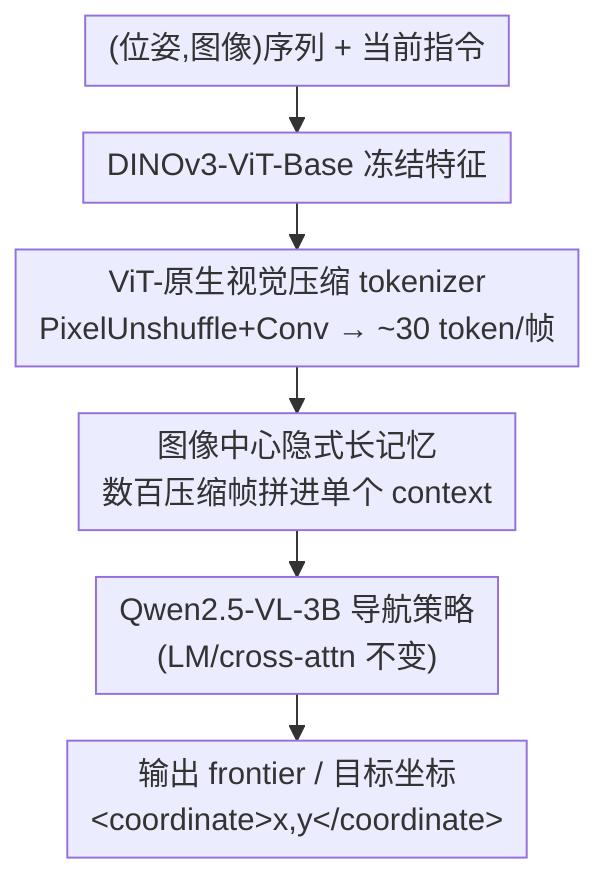

# AstraNav-Memory: Contexts Compression for Long Memory

**会议**: CVPR 2026  
**论文**: [CVF Open Access](https://openaccess.thecvf.com/content/CVPR2026/html/Hu_AstraNav-Memory_Contexts_Compression_for_Long_Memory_CVPR_2026_paper.html)  
**代码**: 待确认  
**领域**: 机器人 / 具身导航  
**关键词**: 具身导航, 长期记忆, 视觉上下文压缩, 视觉 token 压缩, VLN

## 一句话总结
AstraNav-Memory 把具身终身导航的"记忆"做成图像中心的隐式表示——用一个 ViT-原生的视觉压缩 tokenizer 把每帧从 598 个视觉 token 压到约 30 个（≈20×），让 Qwen2.5-VL-3B 能在单个 context 里塞进数百帧历史，从而在陌生环境探索得更高效、在熟悉环境复用记忆走更短的路，在 GOAT-Bench 和 HM3D-OVON 上刷到 SOTA。

## 研究背景与动机

**领域现状**：具身导航正从"单任务、单目标"走向"终身、长程"。真实场景（如家庭助理）里，agent 要跨任务携带记忆：第一次进陌生房间靠探索和推理找目标，之后在熟悉环境里凭记忆直奔目标。要做到这点，关键是把"长时视觉历史"高效地存下来、检索出来、转成导航优势。

**现有痛点**：主流记忆有两条路。物体中心记忆（object-centric）依赖检测/分割/重建管线把物体坐标和类别抠出来，建可查询的语义地图——可解释，但管线复杂、误差耦合、跨域泛化差。图像中心记忆（image-centric）更端到端，直接保留位姿和多视角图像让模型内部学空间结构，可它的死穴是**长期记忆的成本**：要真正受益于终身任务，模型得在 context 里保留数百帧；而原始视觉流空间/时间冗余极大，不压缩的话长 context 在计算和存储上都贵到离谱，注意力还会被噪声淹没、抓不住关键信息。

**核心矛盾**：图像中心记忆要"长"（保留几百帧）和"省"（算力/显存可控、注意力不被噪声冲垮）之间存在直接冲突——历史长度 × 每帧 token 数 就是长程瓶颈所在。

**切入角度**：作者注意到视觉压缩近来进展很快，尤其 DeepSeek-OCR 用窗口注意力 + 高度压缩的卷积特征把密集图像 patch 压成极少 token 而语义损失很小。受此启发，他们把"视觉上下文压缩"引入具身导航的长期记忆，目标是在更高压缩比下支撑更长历史，同时稳定保留可检索的空间-语义信息。

**核心 idea**：用一个**与导航策略端到端耦合、任务对齐的视觉压缩模块**，把每帧压到约 30 个 token，使图像中心的隐式记忆既长又省，成为物体中心记忆的有竞争力替代品。

## 方法详解

### 整体框架
AstraNav-Memory 把导航当成一个 seq2seq 问题。模型输入是

$$x = [\text{SYS};\ (P_1, I_1);\ (P_2, I_2);\ \dots;\ (P_T, I_T);\ \text{INSTR}]$$

其中 SYS 是系统提示、INSTR 是当前指令、$(P_t, I_t)$ 是第 $t$ 帧的相机位姿-图像对。位姿 $P_t$ 被序列化成文本 token，插在该帧视觉 token 之前，让文本编码器统一处理位姿。模型输出一句自然语言，描述下一个 frontier（探索前沿）或 target（目标），其 2D 坐标用特殊标签包住，如 `<coordinate>x, y</coordinate>`。

整条管线只动**视觉输入这一段**，后面的多模态投影、语言模型、cross-attention 全部不变。具体地：图像先过冻结的 DINOv3-ViT-Base 提特征，再过两级 PixelUnshuffle + 卷积压缩块，flatten 后接一个 2×2 patch-merger，得到每帧约 30 个 token，直接喂进 Qwen2.5-VL-3B 的第一个 ViT block。压缩后的紧凑视觉 token + 语言指令一起进 Qwen2.5-VL-3B，在低算力下对大规模视觉记忆做长程导航推理。

### 关键设计

**1. ViT-原生视觉压缩 tokenizer：用重排而非池化把每帧压到约 30 token**

这是全文的核心，针对的就是"每帧 token 太多 → 历史装不长"的痛点。作者不在 Qwen 自带的 patch embedding 上动手，而是另起一条压缩链：先用**冻结的 DINOv3-ViT-Base** 提特征（选 DINOv3 是因为它自监督语义强、对域偏移鲁棒、能在无标签下抓住地标/布局/可通行性这类中层空间线索；冻结则稳定语义、降训练成本、把压缩器和策略与编码器解耦，方便日后直接换 backbone）。

压缩的关键是用**重排（rearrangement）而不是池化**来缩短序列，避免池化把几何信息抹平。PixelUnshuffle 把每个局部 $2\times2$ 邻域搬进通道维：

$$\text{PU}_2:\ \mathbb{R}^{H\times W\times C} \to \mathbb{R}^{\frac{H}{2}\times \frac{W}{2}\times 4C}$$

每次 PixelUnshuffle（stride 2）后接一个 stride-1 的 $3\times3$ 卷积 + BatchNorm + SiLU，合称一个**压缩块**：$X^{(i)} = \mathrm{SiLU}(\mathrm{BN}(\mathrm{Conv}(X^{(i-1)})))$，把高宽各减半、空间 token 数降 $4\times$ 同时重映射通道。堆叠 $N$ 个压缩块得到总空间压缩 $r = 2^{2N} = 4^N$。主设置取 $N=2$（即 $16\times$ 空间压缩），再接一个 $2\times2$ patch-merger。以 $720\times640$ 输入、DINO patch=16 为例，$H_0\times W_0 = 45\times40$，padding 到 $48\times40$，过两块后到 $(12,10)$，merger 后 $L_t = \frac{12\cdot10}{4} = 30$ token。最后一块的 $3\times3$ 卷积把通道维对齐到 Qwen2.5-VL-3B ViT 的隐藏维 1280，于是 $\tilde Z_t \in \mathbb{R}^{30\times1280}$ 不带 CLS/register token 直接进第一个 ViT block。整体上每帧从 598 token 压到 30，约 $20\times$，而下游一切不变——这就是"即插即用、ViT-原生"的含义：它本质上是个通用压缩模块，导航之外的具身任务也能用。

**2. 图像中心的隐式长记忆：把数百压缩帧直接当 context 记忆**

有了 ~30 token/帧，记忆就不再需要外部检索库或显式语义地图——压缩后的历史帧**直接拼进 Qwen2.5-VL 的 context** 当隐式记忆，让感知、语言、决策端到端耦合。这正面解决了图像中心路线"想长但装不下"的矛盾：单个 context 里能保留数百帧，基本满足室内场景的长期隐式记忆需求。相比物体中心记忆，它不依赖上游检测/分割、没有误差耦合、跨域更鲁棒、工程更简单；相比已有图像中心方法，强压缩显著拉长了可维护的历史长度并提升了导航指标。机制上，长历史带来两种收益：陌生环境里 agent 用 frontier-based 探索逐步发现并把物体编码进图像中心记忆，做渐进式推理提高探索成功率；熟悉环境里调用这份长期隐式记忆，规划直达路径、缩短步数（SPL 提升尤其明显）。

**3. 任务对齐的端到端训练与终身导航数据构建：让压缩"为控制服务"而非"为感知服务"**

作者强调过去的压缩多是"感知驱动"（目标是重建/识别），对长程一致性和结构化可检索性约束很弱。AstraNav 把压缩目标**和导航策略一起端到端训练**，使压出来的 token 不仅小，还保留对规划有用的空间-语义线索。为此他们专门构建了两套数据：OVON 侧基于 OVON 数据、按 MTU3D 的生成方法把导航离散成 MOVE_FORWARD/TURN_LEFT/TURN_RIGHT/STOP 四个动作，维护 3D 占据地图区分"已探索/未知"，frontier 取两区边界点，下一子目标按到目标的最短路代价排序、大概率选最小代价 frontier、小概率随机采样以平衡效率与多样性，最终从 145 个场景采样得 OVON-500K。GOAT 侧用 GOAT-Bench 的终身设定——子任务完成后环境和 agent 状态不重置，agent 在持久记忆上接着执行下一条指令——按记忆长度 50/100/200/500 步切出 GOAT-1M-50L/100L/200L/500L 四套数据并做过滤防止短轨迹过度占比。训练即把 OVON-500K 与四套 GOAT 子集合成 1.5M 样本一起 fine-tune。

### 损失函数 / 训练策略
以 Qwen2.5-VL-3B 为基座做 fine-tune，训练集 1.5M（OVON-500K + GOAT-1M-50L/100L/200L/500L）。不同输入帧数的实验用历史长度匹配的 GOAT split。在 32 张 H20 上训练，学习率 $1\times10^{-5}$，warmup 比例 0.05，最多 2 个 epoch。评测用 SR（成功率，终点距目标 1m 内算成功）和 SPL（按路径长度加权的成功率）：

$$\text{SPL} = \frac{1}{N}\sum_{i=1}^{N} S_i \frac{L_i^*}{\max(L_i, L_i^*)}$$

其中 $S_i\in\{0,1\}$ 表示第 $i$ 个 case 是否成功、$L_i^*$ 是到目标的最短路、$L_i$ 是实际路径长，两者均越高越好。

## 实验关键数据

### 主实验

GOAT-Bench 多模态终身导航（SR/SPL，越高越好）：

| 方法 | Val-Seen SR | Val-Seen SPL | Val-Unseen SR | Val-Unseen SPL |
|------|------|------|------|------|
| Modular GOAT | 26.3 | 17.5 | 24.9 | 17.2 |
| SenseAct-NN Skill Chain | 29.2 | 12.8 | 29.5 | 11.3 |
| TANGO | - | - | 32.1 | 16.5 |
| MTU3D（之前最强） | 52.2 | 30.5 | 47.2 | 27.7 |
| **AstraNav-Memory** | **65.5** | **49.0** | **62.7** | **56.9** |

在最难的 Val-Unseen split 上达到 62.7 SR / 56.9 SPL，比之前 SOTA MTU3D（47.2/27.7）高 **+15.5 SR、+29.2 SPL**，比 Modular GOAT 高 2.4× SR / 3.3× SPL，显示出对陌生环境和指令的强泛化。

HM3D-OVON 开放词表物体导航：

| 方法 | Val-Unseen SR | Val-Unseen SPL |
|------|------|------|
| Uni-NaVid | 39.5 | 19.8 |
| MTU3D | 40.8 | 12.1 |
| **AstraNav-Memory** | **62.5** | **34.9** |

比之前最好的 MTU3D 高 +21.7 SR、+22.7 SPL（≈1.5× SR、1.7× SPL），说明在开放词表指令上同样泛化更好。

### 消融实验

固定 $16\times$ 压缩、变记忆长度的效率与精度（Tab. 3）：

| 配置 | SR | 训练(s/iter) | 显存(GB) | 推理(s/instr) |
|------|------|------|------|------|
| 50（原始，未压缩） | 60.2 | 26.4 | 90.6 | 10.3 |
| 50（16×） | 56.6 | 6.5 | 46.8 | 2.2 |
| 100（16×） | 57.5 | 9.2 | 68.5 | 4.2 |
| 200（16×） | 55.2 | 12.0 | 86.8 | 5.6 |

压缩极大提效：50 帧从 26.4s/iter 降到 6.5s、显存 90.6→46.8GB、推理 10.3→2.2s。精度上未压缩的 50 帧仍最好（60.2），说明激进压缩会带来小幅精度损失；压缩变体里 100(16×) > 200(16×) > 50(16×)——100 帧在"历史更长"与"context 不过载"之间取得最佳平衡，200 帧则因 context 过长、模型难以关注最近也最有信息量的帧而下滑。

压缩率 × 存储帧数 对 SR 的交互（Tab. 4，"-"表该预算下无法容纳）：

| 压缩率 \ 帧数 | 50 | 100 | 200 | 500 |
|------|------|------|------|------|
| 1× | 60.2 | - | - | - |
| 4× | 61.3 | **63.2** | - | - |
| 16× | 56.6 | 57.5 | 55.2 | - |
| 64× | 42.5 | 49.1 | 48.1 | 47.6 |

压缩率越高、同显存能装的历史越长（4× 可从 50 升到 100 帧，16× 进一步到 200 帧），但过度压缩有害：64× 时性能骤降（50 帧仅 42.5），说明 token 信息严重丢失。综合看 $16\times$ 在训练速度与可观察历史间取得不错折中，而 **4× + 100 帧（63.2）整体最佳**。作者还提醒最大帧数并非与压缩率成正比——因为 DINOv3 ViT 编码器仍需保留压缩前的 token，这部分主导显存、限制了有效 context 长度。

### 关键发现
- **压缩率有甜区，不是越狠越好**：4×/16× 表现好，64× 直接崩；30 token/帧（≈20×）在效率与保真间取得最佳折中。
- **长记忆的收益主要体现在"熟悉环境"**：长期隐式记忆缩短熟悉环境路径、降低步数（SPL 大涨），且没有牺牲陌生环境的探索成功率。
- **DINOv3 的盲区**：分类别看（Tab. 5），AstraNav 在 freezer(72→88)、piano(67→79)、book(66→73)、hanging clothes(63→80)、shower glass(53→92) 等"显著物体"上明显更好；但在 carpet(61→56)、island(97→76.3)、microwave(96→75) 等细纹理类别上不如原始 Qwen 编码器——特征可视化显示 DINOv3 难以把地毯和周围地板的纹理边界分清，提示这类边界敏感类别可能需要 SAM 这类 mask 级线索补充。

## 亮点与洞察
- **把"压缩"从感知目标改写成控制目标**：最关键的转变是让压缩模块和导航策略端到端共同训练，压出的 token 不只是"看得清"，而是"对规划有用"，这解释了它为何能在保留 ~30 token 的同时撑住长程导航指标。
- **重排优于池化的工程选择**：用 PixelUnshuffle 把空间信息搬进通道、再用卷积重映射，而非直接 pooling，保住了地标/布局/可通行性等中层几何线索——这是"压得狠又不丢导航关键信息"的技术支点。
- **即插即用、不动下游**：只改视觉输入这一段、冻结 DINOv3、Qwen 的 LM/projector/cross-attn 全不变，使该 tokenizer 成为可迁移到其他具身任务的通用压缩件，也便于日后直接升级 backbone。
- **图像中心 vs 物体中心的范式之争**：这篇给出了"图像中心隐式记忆在强压缩加持下可与物体中心记忆竞争"的实证，意味着终身具身 agent 的记忆接口或许可以更端到端、更省工程。

## 局限与展望
- **边界敏感类别表现下降**：DINOv3 对地毯/地面这类纹理边界分不清，导致部分细纹理目标反而不如原始编码器；作者建议融入 SAM 等分割/mask 线索。
- **激进压缩有精度上限**：64× 性能骤降，未压缩 50 帧精度仍最高——压缩本身是有损的，长历史带来的增益要和单帧保真损失权衡。
- **显存仍被压缩前 token 主导**：DINOv3 编码器要保留 pre-compression token，限制了有效 context 长度，最大可装帧数并不与压缩率线性增长。
- **评测局限于室内** GOAT-Bench/HM3D-OVON（Habitat 仿真），室外/真实机器人闭环、动态环境下的稳定性未验证。⚠️ 部分实现细节（如 padding/通道对齐的具体取值）以原文为准。

## 相关工作与启发
- **vs 物体中心记忆（如 MTU3D）**：MTU3D 用稀疏向量化的物体查询存历史语义，省去全重建但仍依赖上游检测、缺乏对端到端规划的紧耦合；AstraNav 直接把压缩图像帧当隐式记忆，端到端训练、跨域更鲁棒，在 GOAT/HM3D 上全面超过 MTU3D。
- **vs 显式外部记忆 + 检索（RAG/MemGPT 系）**：那类方法可解释、可控，但靠 chunking/索引启发式、对检索召回和延迟敏感、易割裂长程时间一致性；本文走隐式、token 融合路线，避免外部索引但需自行解决可检索性。
- **vs 通用视觉 token 压缩（PVC/VScan、SparseVLM/FocusLLaVA、DeepSeek-OCR）**：前两类多为感知驱动、对长程一致性约束弱或剪枝不稳；DeepSeek-OCR 极致压缩但面向文本识别、不保证具身场景的空间语义与规划可用性。AstraNav 的差异在于"任务对齐 + 与导航策略联合训练"，让压缩为控制服务。

## 评分
- 新颖性: ⭐⭐⭐⭐ 把视觉上下文压缩引入具身终身导航记忆、并端到端与策略联合训练，路线清晰且有说服力（压缩模块本身是已有组件的组合）。
- 实验充分度: ⭐⭐⭐⭐ 两大基准 SOTA + 压缩率/记忆长度/类别三类消融，效率与精度都量化；但仅限室内仿真。
- 写作质量: ⭐⭐⭐⭐ 动机推导和方法管线讲得清楚，公式与维度推导完整。
- 价值: ⭐⭐⭐⭐ 给出"图像中心隐式记忆可与物体中心竞争"的实证，对终身具身 agent 的记忆接口设计有参考价值。

<!-- RELATED:START -->

## 相关论文

- [\[CVPR 2026\] Affordance Field Intervention: Enabling VLAs to Escape Memory Traps in Robotic Manipulation](affordance_field_intervention_enabling_vlas_to_escape_memory_traps_in_robotic_ma.md)
- [\[CVPR 2026\] Predict Before You Explore: Predictive Planning with Specialized Memory for Embodied Question Answering](predict_before_you_explore_predictive_planning_with_specialized_memory_for_embod.md)
- [\[CVPR 2026\] Memory-Augmented Scene Understanding and Exploration for Open-World Aerial Object-Goal Navigation](memory-augmented_scene_understanding_and_exploration_for_open-world_aerial_objec.md)
- [\[ICML 2026\] RoboMME: Benchmarking and Understanding Memory for Robotic Generalist Policies](../../ICML2026/robotics/robomme_benchmarking_and_understanding_memory_for_robotic_generalist_policies.md)
- [\[CVPR 2026\] Global Prior Meets Local Consistency: Dual-Memory Augmented Vision-Language-Action Model for Efficient Robotic Manipulation](global_prior_meets_local_consistency_dual-memory_augmented_vision-language-actio.md)

<!-- RELATED:END -->
