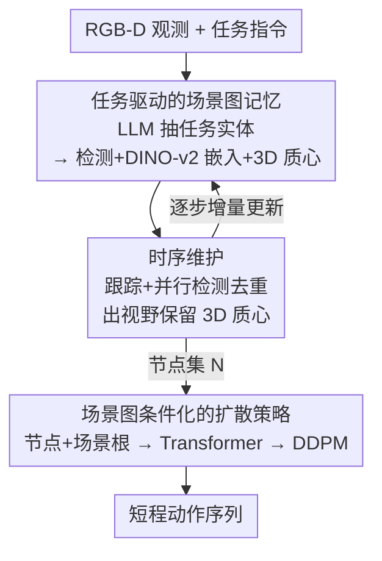

# Expanding Spatial and Temporal Context for Robotic Imitation Learning With Scene Graphs

**会议**: CVPR 2026  
**论文**: [CVF Open Access](https://openaccess.thecvf.com/content/CVPR2026/html/Qian_Expanding_Spatial_and_Temporal_Context_for_Robotic_Imitation_Learning_With_CVPR_2026_paper.html)  
**代码**: https://sites.google.com/view/objgraph （项目页，含代码与视频）  
**领域**: 机器人 / 具身智能  
**关键词**: 模仿学习, 场景图, 部分可观测, 长程任务, 扩散策略

## 一句话总结
针对家庭/办公等大空间下机器人"看不全、记不住"的部分可观测难题，本文把**任务相关的动态场景图**当作模仿学习策略的显式结构化记忆——只跟踪和任务有关的物体、维护它们随时间演化的外观与三维位置，再把整张图编码成 token 喂给扩散策略，从而在需要长程推理的移动操作和桌面操作任务上显著提升成功率。

## 研究背景与动机
**领域现状**：模仿学习（Diffusion Policy、ACT 等）已经能用几百条示范学会灵巧、多模态的物理技能，但绝大多数成果都集中在**小空间、短时程**的桌面操作上，那里部分可观测几乎不是问题。

**现有痛点**：一旦把场景放大到家庭、办公楼这种多房间甚至多楼层的尺度，或者任务需要跨越成百上千步、串联多个子任务，现有策略的表现就急剧退化。根本原因是**部分可观测**——机器人只有机载相机（移动平台的体载相机、桌面的腕载相机），视野极其有限，执行动作时往往看不到与决策相关的关键物体。比如"把微波炉门顶开再放杯子进去"这一步，强依赖几百步之前第一个子任务里微波炉是怎么被打开的，但那时的画面早已离开视野。

**核心矛盾**：要做好这类任务，机器人必须对**当前不在视野内**的信息进行推理，这就需要某种记忆。可记忆该长什么样？现代视觉可以构建聚合所有历史视角的稠密度量地图，但这种"过完备"记忆给策略学习带来新麻烦：如此庞大的地图在神经策略里怎么处理？又怎么做到样本高效地训练？

**本文目标**：设计一种**紧凑、可增量更新、且能直接作为神经策略输入**的场景记忆表征，使策略能基于场景中所有任务相关信息（哪怕是很久以前观察到的）做决策。

**切入角度**：作者借鉴认知科学的证据——人类完成长程任务时维护的是**抽象的、任务相关的语义记忆**，而非像素级地图。对应地，用**场景图**稀疏地存储大空间里的关键场景信息，图结构天然便于随环境变化增量更新，且只跟踪任务相关物体就能在杂乱大场景里高效学习。

**核心 idea**：构建并动态维护一张**任务相关的三维语义场景图**，把它直接编码成 token 序列喂给扩散策略——这是此前工作没做过的（已有工作要么把场景图用于规划/导航，要么用于把人类示范映射到机器人，没人把动态维护的场景图当作模仿学习的直接模型输入）。

## 方法详解

### 整体框架
方法分两大块：**(A) 任务驱动场景图的构建与时序维护**，把每一帧 RGB-D 观测转成一组以物体为中心的节点记忆；**(B) 场景图条件化的扩散策略**，把这组节点编码成 token 序列，条件化一个 Transformer + 扩散模型来生成短程动作。

具体地，给定自然语言任务描述，先用大语言模型抽出"任务相关名词实体"清单；首帧用 Grounding DINO 把清单里的物体检测、定位出来初始化节点；每个物体节点 $n_i = [e_i, b_i, c_i]$ 由三部分构成——DINO-v2 外观嵌入 $e_i$、当前可见时的 2D 包围框 $b_i$、以及世界坐标系下的 3D 质心 $c_i$。随后每个时间步并行做两件事：对已有节点用视觉跟踪器更新、对新观测做检测并按掩码重叠去重，保证物体跨帧的持久身份；物体一旦离开视野，把 $b_i$ 置零但**保留 $c_i$**（假定它没移动），重新出现时再更新。最后把所有节点连同一个全局"场景根节点"编码成 token，过 Transformer 自注意力做关系推理，聚合出紧凑场景表征 $R_{sg}$，条件化扩散策略输出动作序列。

### 关键设计

**1. 任务驱动的场景图记忆：只记任务相关物体，把"过完备地图"压成稀疏节点**

痛点直白说就是：稠密度量地图什么都记，既难塞进神经策略也难样本高效地训。本文反其道而行——**只跟踪任务相关的物体**。给定语言指令，用大语言模型（如 GPT-5）抽出一串可能重要的名词实体，再去场景里定位并跟踪匹配这些实体的物体。每个物体表示成节点 $n_i = [e_i, b_i, c_i]$：外观嵌入 $e_i$ 由 DINO-v2 特征在掩码区域内平均池化得到，$b_i$ 是 2D 包围框，$c_i$ 是通过深度反投影（结合相机内外参与里程计）估计的 3D 质心。整张图 $N = \{n_i\}$ 就是一个稀疏、紧凑、可解释的场景抽象。

为什么有效：作者**不显式参数化边**，但关系结构通过"共享坐标系 + 节点属性联合处理"被隐式编码——所有 $c_i$ 都落在同一个世界坐标系里，物体间的相对位置和距离就能直接从节点特征里推出来。这让图既保留了空间结构，又避免了显式建图/学边的复杂度，天生适合大空间下的增量更新（多房间乃至多楼层也只是多几个节点）。

**2. 时序维护：跟踪 + 并行检测，出视野时丢框留位置**

部分可观测的核心难点是"物体离开视野后还得记得它在哪"。本文的维护机制把两件事拼起来：对图里已有的每个节点初始化一个视觉跟踪器，保证跨帧的持久身份；同时**每一步并行跑物体检测**，新检测到的候选 $n_j$ 和已有节点按掩码重叠度比较，若与所有现有节点的重叠都不超过阈值 $\tau_m$，就当作新物体加入图中（对应部分可观测下"新物体会陆续出现"的现实）。

关键的小设计在出视野处理：当物体移出视野，把它的 2D 包围框 $b_i$ 置零，但**3D 质心 $c_i$ 原样保留**——默认它没动，直到被重新观测才更新 $b_i$ 和 $c_i$。正是这个"丢外观框、留空间位置"的选择，让策略在几百步之后还能定位到曾经见过、现已看不见的物体（如被搬走前的微波炉门）。这也是它和"一堆瞬时物体 token"的两点本质区别：节点有跨时间的持久身份并被增量更新，且空间关系通过共享坐标表征被保留下来。

**3. 场景图条件化的 Transformer + 扩散策略：把图当 token 序列，条件化 DDPM**

有了节点集还得让策略"吃进去"。每个节点编码成 $E_i = [e_i,\ \mathrm{MLP}(b_i),\ \mathrm{MLP}(c_i)]$，几何属性（2D 框、3D 质心）各过一个小 MLP。此外加一个**全局场景根节点**：用 DINO-v2 ViT 的 CLS token 当 $e_{scene}$，配上覆盖整图的框 $b_{scene}=[0,1,0,1]$ 和原点坐标 $c_{scene}=[0,0,0]$，得到 $E_{scene}$。完整场景图表征是 token 序列

$$R_{sg} = [E_{scene},\ E_1,\ \dots,\ E_i,\ \dots]$$

把它喂给 Transformer 编码器，用位置嵌入标记节点的结构角色（如区分场景根），自注意力让物体之间、物体与全局场景之间充分交互，再经 MLP head 聚合成紧凑表征去条件化下游策略。最后用扩散策略生成短程动作：训练时对专家动作做前向加噪，去噪网络 $\epsilon_\theta(a_k, R_{sg}, k)$ 在 DDPM 目标下预测注入的噪声

$$L(\theta) = \mathbb{E}_{a_0,\ k\sim U(1,K),\ \epsilon\sim\mathcal{N}(0,I)}\Big[\big\|\epsilon - \epsilon_\theta(a_k, R_{sg}, k)\big\|^2\Big]$$

测试时从高斯噪声出发，用 DDIM 采样器迭代反扩散生成动作序列。当前任务里场景图通常只是"场景根 + 物体节点"的浅层结构，但已足够刻画决策所需的以物体为中心的状态与空间关系。

### 损失函数 / 训练策略
策略训练即上面的 DDPM 去噪目标。值得一提的是移动操作里的**运动/操作模式切换**：示范采集时机器人任一时刻只处于移动模式（冻结手臂、控制腿速）或操作模式（固定腿、激活手臂），并记录一个模式指示。网络同时预测腿/臂关节目标和模式指示；采集时对原始模式信号过 sigmoid 得到平滑连续目标用于训练，执行时按预测模式做掩码激活对应的腿或臂控制输出，从而在移动与操作间平滑切换。

## 实验关键数据

实验回答三个问题：(1) 在长程任务上是否超过已有模仿学习基线？(2) 在多样的桌面/移动操作任务上泛化如何？(3) 各组件各贡献多少？原文成功率以堆叠柱状图呈现（无精确数值表），下面给出可从正文核对的任务规模、运行时与失败分析数据，成功率部分以定性对比表呈现并标注。

### 主实验

任务设置（仿真 Spot 移动操作 + 真机 Franka 桌面操作）：

| 设置 | 任务 | 时长(步) | 示范数 | 关键挑战 |
|------|------|---------|--------|---------|
| 仿真移动 | Throw Trash | ~100 | 400/任务 | 导航+抓取，位置随机 |
| 仿真移动 | Heat-up Tea | ~300 | 400/任务 | 开微波炉门+放杯，多子任务 |
| 仿真移动 | Heat-up Tea Long | ~1000 | 400/任务 | 微波炉与杯相距更远 |
| 真机桌面 | Pineapple-Bowl | — | 300/任务 | 抬起后碗离开腕相机视野 |
| 真机桌面 | Feed-Animals | — | 300/任务 | 记住初始动物选对水果 |
| 真机桌面 | Feed-Giraffe | — | 300/任务 | 扫货架定位+放对层 |
| 真机桌面 | Clean-Table | — | 300/任务 | 记住已清物体再关抽屉 |

各方法在长程任务上的定性表现对比（成功率原文为柱状图，⚠️ 具体数值以原文为准）：

| 方法 | 记忆机制 | 长程子任务表现 |
|------|---------|---------------|
| RGB（原版 DP） | 无，仅当前双相机 RGB+本体 | 碗/物体远离初始位置时频繁放错 |
| Visible-Objects | 仅当前视角物体中心表征 | 优于 RGB，但仍无历史记忆，常拿错水果 |
| PTP [52] | 加长历史（10 帧）+预测过去/未来动作 | 改善短程推理（第一子任务），不解决长程根本难题，真机几乎过不了第一阶段 |
| **本文** | 显式动态场景图（含 3D 质心） | 后续子任务与整任务成功率显著更高，长程更稳 |

### 消融实验

| 配置 | 节点表示 | 关键结果 |
|------|---------|---------|
| Full model | $[e_i, b_i, c_i]$ 外观+2D框+3D质心 | 完整模型，长程最稳 |
| w/o 3D | 去掉 3D 质心 $c_i$（不可见仅留 $e_i$） | 第一子任务几乎不掉；后续子任务与最终任务成功率**大幅下降** |
| w/o object locations | 仅留外观 $e_i$，去掉所有位置 | 同上，长程掉点更明显 |

### 关键发现
- **空间信息对长程是决定性的**：去掉 3D 质心（或同时去掉 3D+2D 位置）对**第一个子任务几乎无影响**，但后续子任务与整任务成功率急剧下滑——说明长程下显式提供 3D 质心+2D 框能让策略可靠地定位、跟踪任务相关物体。
- **加长时间窗 ≠ 长程记忆**：PTP 只是简单增加历史帧，能改善短程推理却无法解决长程操作的根本难题，真机里很少能推进过第一阶段，故真机对比直接排除了它。
- **瓶颈在策略而非感知**：真机 64 个 episode 中仅 4 例因遮挡/边界模糊导致分割失败，LLM 物体枚举和初始化后的跟踪**零失败**；绝大多数失败来自长程下的模仿策略本身。

运行时（单张 NVIDIA 3090，证明可实时闭环）：

| 组件 | 频率/耗时 | 调用频度 |
|------|----------|---------|
| LLM 物体枚举 | — | 每任务 1 次 |
| Grounding DINO | 0.53 s | 每 episode 1 次 |
| 掩码传播 | 0.19 s/帧 | 每帧（执行期主要开销） |
| 扩散策略 | 3.5–3.8 Hz（约 260–285 ms/步） | 每步 |

## 亮点与洞察
- **"只记任务相关物体"是把稠密地图变可学的关键一招**：用 LLM 把语言指令翻译成名词实体清单，再据此稀疏化场景，既绕开了过完备地图难塞进策略的问题，又天然支持大空间增量更新——这是一个很可迁移的"任务条件化记忆裁剪"思路。
- **不显式建边、靠共享坐标系隐式编码关系**：省去学边的复杂度，却仍能让 Transformer 从联合处理的节点属性里推出相对位置与距离，工程上简洁优雅。
- **出视野"丢框留位置"的小设计直击长程痛点**：$b_i$ 置零、$c_i$ 保留这一个选择，正是消融里证明对后续子任务最关键的部分，把"几百步后还记得物体在哪"落到了实处。
- **首次把动态维护的场景图当作模仿学习的直接输入**：相比 CLIO 等只做简单抓取或只用于规划/导航的工作，本文把场景图接进扩散策略的条件，填补了空白。

## 局限与展望
- **依赖准确的物体识别**：作者承认方法严重依赖物体枚举/检测/分割的准确性，在**高度杂乱或高度动态**的环境里可能失效（如真机里仍有遮挡导致的分割失败）。
- **场景图结构偏浅**：当前任务里图基本是"场景根+物体节点"的两层结构，论文没充分验证更深的层级化场景图（多房间、多层级空间关系）在策略学习里的效果。
- **静止假设的脆弱性**：出视野时假定物体"不动直到被重新观测"，对会被第三方或机器人自身意外移动的物体，这一假设可能引入记忆错误。
- **改进方向**：作者展望把任务相关场景图作为一种可解释记忆接入未来的 VLA 模型；也可探索把不确定性/动态性显式建模进节点，缓解静止假设。

## 相关工作与启发
- **vs CLIO [36]**：同样基于层级化 3D 场景图、按任务指令推断合适粒度与子图，但 CLIO 只演示简单物体抓取；本文聚焦**用 3D 语义场景图支撑长程任务执行**，并把图直接接进策略。
- **vs PTP [52]**：PTP 通过加长历史帧+预测过去/未来动作并加辅助损失来避免长上下文中的虚假相关；本文的记忆是**显式构建**的（不在空间和时间上隐式学习），实验显示加长时间窗解决不了长程操作的根本问题。
- **vs ControlNet 类状态注入 [34]**：[34] 学习用 ControlNet 融入状态信息；本文的场景记忆把大尺度**空间+时间**上下文显式编码为 DP 的输入表征。
- **vs 把场景图用于人→机器人映射的工作 [49]**：[49] 用场景图把人类示范映射到机器人示范；本文则**直接把场景图编码输入下游扩散策略**。

## 评分
- 新颖性: ⭐⭐⭐⭐ 首次把动态维护的任务相关场景图作为模仿学习策略的直接输入，切入点清晰
- 实验充分度: ⭐⭐⭐⭐ 仿真+真机、移动+桌面、含消融与失败/运行时分析，但成功率仅以柱状图呈现、缺精确数值表
- 写作质量: ⭐⭐⭐⭐ 动机与方法叙述清楚，认知科学类比贴切
- 价值: ⭐⭐⭐⭐ 为部分可观测下的长程模仿学习提供了简洁、可解释、可实时的记忆方案，对 VLA 有启发

<!-- RELATED:START -->

## 相关论文

- [\[CVPR 2026\] Learning Surgical Robotic Manipulation with 3D Spatial Priors](learning_surgical_robotic_manipulation_with_3d_spatial_priors.md)
- [\[CVPR 2026\] NIL: No-data Imitation Learning](nil_no-data_imitation_learning.md)
- [\[CVPR 2026\] Lifelong Imitation Learning with Multimodal Latent Replay and Incremental Adjustment](lifelong_imitation_learning_multimodal_latent_rep.md)
- [\[CVPR 2026\] DiffuView: Multi-View Diffusion Pretraining for 3D-Aware Robotic Manipulation](diffuview_multi-view_diffusion_pretraining_for_3d_aware_robotic_manipulation.md)
- [\[CVPR 2026\] Towards Training-Free Scene Text Editing](towards_training-free_scene_text_editing.md)

<!-- RELATED:END -->
