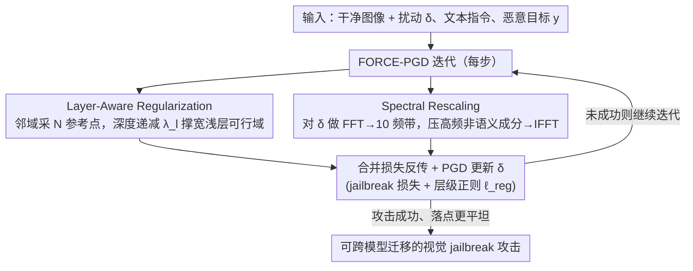

# FORCE: Transferable Visual Jailbreaking Attacks via Feature Over-Reliance CorrEction

**会议**: CVPR2026  
**arXiv**: [2509.21029](https://arxiv.org/abs/2509.21029)  
**代码**: [tmllab/2026_CVPR_FORCE](https://github.com/tmllab/2026_CVPR_FORCE)  
**领域**: 机器人  
**关键词**: visual jailbreaking, 对抗攻击, 可迁移性, loss landscape, MLLM safety, 红队测试

## 一句话总结

分析发现视觉 jailbreak attack 迁移性差的根因是 attack 处于 high-sharpness loss region——源于浅层特征过度依赖 model-specific 表示和高频信息过度影响；提出 FORCE 方法通过 layer-aware regularization 扩展浅层 feasible region + spectral rescaling 抑制高频非语义成分，引导 attack 进入 flatter loss landscape，显著提升跨模型迁移性。

## 背景与动机

多模态大语言模型（MLLM）在集成视觉等新模态时引入了额外的安全脆弱性。当前视觉 jailbreak 攻击的现状：

1. **文本 jailbreak 受限**：随着文本对齐强度增加（RLHF、DPO），纯文本攻击对 MLLM 的效果持续下降
2. **视觉 jailbreak 有效但局部**：基于优化的视觉攻击（PGD 及其变体）能以不可察觉的扰动可靠绕过开源 MLLM 的安全防线，source model 上近乎 100% 成功率
3. **迁移性极差**：在 source model 上生成的视觉攻击几乎无法迁移到其他 MLLM，尤其是闭源商业模型，93% 的攻击在 exhausting 100 次 query 后仍然失败

核心动机：要进行实际的 red-teaming 评估闭源 MLLM 的安全漏洞，必须提升基于优化的视觉 jailbreak 攻击的**跨模型迁移性**。作为首批研究此问题的工作之一，本文从 loss landscape 几何角度深入剖析迁移失败的原因。

## 核心问题

- 为什么视觉 jailbreak 攻击在 source model 上成功但无法迁移？
- 攻击的 loss landscape 形状如何影响迁移性？
- 特征表示中哪些因素导致了 model-specific 的依赖？

## 方法详解

### 整体框架

视觉 jailbreak 攻击在 source model 上几乎 100% 成功，却几乎无法迁移到别的 MLLM，尤其是闭源模型。FORCE 先做诊断、再开方子。诊断的核心结论是：迁移失败是因为攻击被困在一个极其尖锐（high-sharpness）的 loss 区域——在输入空间仅 0.03 像素的扰动就能把 loss 从约 0 抬到 0.28 以上、攻击随即失效，在权重空间仅 0.0002 的扰动（模拟换模型）就能把攻击推出可行域（feasible region）。进一步拆解发现两个制造尖锐区域的元凶：浅层特征过度依赖 model-specific 表示，以及优化后期攻击越来越依赖高频非语义捷径。对症下药，FORCE 用两个组件——layer-aware regularization 拓宽浅层的可行域、spectral rescaling 压住高频成分——整合进标准 PGD 的每一步迭代，把攻击引导进更平坦的 loss landscape，从而显著提升跨模型迁移性。

### 关键设计

**1. Layer-Aware Regularization：把浅层那条又窄又脆的可行域撑宽**

诊断显示问题集中在浅层：对每层做「对抗特征 ↔ 自然特征」的凸组合插值 $(1-\mu) \cdot f_{\theta}(\text{jail}) + \mu \cdot f_{\theta}(\text{nat})$ 时，深层（如第 31 层）即便掺 40% 自然特征攻击仍有效，浅层（如第 11 层）却要保留 90%+ 对抗特征、掺 30% 自然特征 loss 就飙到 1.2+——浅层可行域窄到一碰就碎。FORCE 的做法是在 jailbreak 样本邻域 $\eta=4/255$ 内采样 $N=10$ 个参考点，对每层 $l$ 最大化样本与参考点的特征 $L_2$ 距离 $d_l = \|f_{\theta,l}(\mathbf{x}_{\text{img}}+\delta, \mathbf{x}_{\text{txt}}) - f_{\theta,l}(\mathbf{x}_{\text{img}}+\delta+\eta, \mathbf{x}_{\text{txt}})\|_2^2$，同时约束参考点自己也落在可行域内（其损失 $\ell_{\text{ref}} = \ell(p_\theta(\mathbf{x}_{\text{img}}+\delta+\eta, \mathbf{x}_{\text{txt}}), \mathbf{y})$ 也要低）。

关键的一笔是让正则化强度随深度递减——浅层强、深层弱，正好对上「问题在浅层」的诊断：

$$\lambda_l = \lambda \cdot \max(1 - (2l/L)^2, 0)$$

合起来正则项为 $\ell_{\text{reg}} = \frac{1}{N}\sum_{n=1}^{N}\sum_{l=1}^{L} \lambda_l \cdot \frac{\ell_{\text{ref}}}{d_l}$。它鼓励攻击在浅层周围保持「一片都能用」的平坦邻域，可行域一宽，换个模型时攻击就不那么容易掉出去。

**2. Spectral Rescaling：掐掉优化偷偷学到的高频捷径**

另一个根因来自频域：把攻击做 Fourier 变换、逐个 mask 频带后发现，优化早期（150-250 iter）攻击靠低频语义成分，到后期（350-750 iter）却越来越依赖高频——750 iter 时只要移除第三高频带攻击就失效。高频是语义弱、model-specific 的捷径，正是迁移性的毒药。FORCE 对扰动 $\delta$ 做 FFT、划成 $M=10$ 个等宽频带，当第 $m$ 频带的影响超过相邻低频带 $\beta$ 倍时就把它压下来：

$$w_m = \min\left(\beta, \frac{\ell_{m-1}}{\ell_m} \cdot \beta\right), \qquad S = \sum_{m=1}^{M} (w_m \cdot \mathbb{1}_{B_m})$$

再把频率缩放矩阵 $S$ 乘到 FFT 幅度谱上、IFFT 重建扰动 $\delta_{\text{rescaled}} = \text{IFFT}((A \odot S) \odot e^{i\Phi})$。这样攻击被迫多用低频语义、少用高频捷径，落点更平坦也更可泛化。两个组件整合进标准 PGD：每步先做 spectral rescaling、再做 layer-aware regularization。

## 实验关键数据

### 跨 Adapter-Based MLLM 迁移（source: LLaVA-v1.5-7B, 多 query）

| Target Model | 方法 | MaliciousInstruct ASR | AdvBench ASR | HADES ASR |
|--------------|------|-----------------------|--------------|-----------|
| LLaVA-v1.6-mistral | PGD | 61.0 | 35.2 | 70.0 |
| | FORCE | **69.0** (+12.3%) | **43.8** (+24.6%) | **72.7** (+3.8%) |
| InstructBLIP-Vicuna | PGD | 84.0 | 25.6 | 48.7 |
| | FORCE | **92.0** (+9.5%) | **27.9** (+9.0%) | **49.2** (+1.1%) |
| Idefics3-8B | PGD | 53.0 | 29.8 | 63.1 |
| | FORCE | **64.0** (+20.8%) | **36.0** (+20.6%) | **66.0** (+4.6%) |

### 跨 Early-Fusion MLLM 迁移

| Target Model | 方法 | MaliciousInstruct ASR | AdvBench ASR | HADES ASR |
|--------------|------|-----------------------|--------------|-----------|
| LLaMA-3.2-11B | PGD | 1.0 | 1.2 | 6.3 |
| | FORCE | **2.0** (+100%) | **2.3** (+101%) | **10.3** (+63.6%) |
| Qwen2.5-VL-7B | PGD | 5.0 | 1.5 | 25.3 |
| | FORCE | **11.0** (+120%) | **2.7** (+74.7%) | **28.1** (+11.1%) |

### 跨商业 MLLM 迁移

| Target Model | 方法 | MaliciousInstruct ASR | HADES ASR |
|--------------|------|-----------------------|-----------|
| Claude-Sonnet-4 | PGD | 1.0 | 3.0 |
| | FORCE | **2.0** (+100%) | **5.0** (+66.7%) |
| GPT-5 | PGD | 1.0 | 1.0 |
| | FORCE | **2.0** (+100%) | **3.0** (+200%) |

### 组件消融（Idefics3, MaliciousInstruct）

| Layer Reg | Spectral Rescaling | ASR | Query ↓ |
|-----------|-------------------|-----|---------|
| ✗ | ✗ | 53.0 | 50.7 |
| ✓ | ✗ | 55.0 (+3.8%) | 48.5 (+4.7%) |
| ✗ | ✓ | 59.0 (+11.3%) | 44.0 (+15.2%) |
| ✓ | ✓ | **64.0** (+20.6%) | **39.6** (+28.1%) |

两组件产生协同效应，联合效果超过各自之和。

### 计算开销

| 方法 | 时间 (s/iter) | 显存 (GB) |
|------|--------------|----------|
| PGD | 2.17 | 32.64 |
| FORCE | 2.73 (+26%) | 36.48 (+12%) |

额外开销极小，因为正则化项利用标准前向传播的中间变量，多采样可并行。

## 亮点

- **分析深入且有说服力**：从 loss landscape 几何 → layer 空间 → spectral 域三个层面逐步揭示迁移性差的根因，分析-方法的逻辑链条完整
- **方法设计紧贴分析**：每个组件直接对应一个分析发现（浅层窄 feasible region → layer-aware reg；高频过度依赖 → spectral rescaling），不存在无动机的组件
- **渐减正则化设计优雅**：浅层强正则深层弱，符合"问题集中在浅层"的诊断，用一个简洁的二次衰减公式实现
- **评估覆盖面广**：三种架构类型（adapter-based、early-fusion、commercial）× 三个数据集 × 多种设置（多 query / zero-shot / blank init）

## 局限与展望

- 对 early-fusion MLLM 和商业模型的绝对 ASR 仍然很低（如 GPT-5 仅 2-3%），虽然相对提升大但距离实际 red-teaming 实用性仍有差距
- 仅在 LLaVA-v1.5-7B 和 InstructBLIP 两个 source model 上验证，source model 多样性有限
- Spectral rescaling 的频带数 $M=10$ 和缩放因子 $\beta=0.95$ 的超参数敏感性分析不足
- 方法假设可以对 source MLLM 做白盒梯度优化，对纯黑盒场景不适用
- 未探讨针对图像预处理防御（如 JPEG 压缩、图像缩放）的鲁棒性（仅测试了随机噪声）
- Early-fusion MLLM 使用 tokenised image representation，像素空间的扰动仅覆盖 token 空间漏洞的子集，这是方法论上的本质限制

## 与相关工作的对比

| 维度 | Standard PGD | Ensemble Opt | MI-FGSM/DI-FGSM | FORCE |
|------|-------------|--------------|-----------------|-------|
| 策略 | 直接梯度优化 | 多模型联合优化 | 动量/输入多样性 | 特征依赖矫正 |
| 需要多模型 | ✗ | ✓ | ✗ | ✗ |
| 理论基础 | 无 | 无 | 分类迁移性 | Loss landscape 分析 |
| Idefics3 ASR | 53.0 | 60.0 | 62-66 | **64.0** |
| Qwen2.5-VL ASR | 5.0 | 4.0 | 3-9 | **11.0** |

FORCE 无需多模型参与，仅在单 source model 上修正特征依赖即可实现与 ensemble 相当甚至更优的迁移性。与分类领域的迁移性增强方法相比，FORCE 专门针对 jailbreak 攻击的特性设计，效果更好。

## 启发与关联

- Loss landscape flatness 与迁移性的关系在分类对抗攻击中有先验研究（SAM 等），本文首次将此视角引入视觉 jailbreak 领域，揭示了问题本质的一致性
- "浅层依赖 model-specific 特征"的发现与 feature visualization、probing 文献呼应——不同模型的浅层表示差异大于深层
- Spectral rescaling 的思路（抑制优化中的高频捷径）可推广到其他对抗鲁棒性研究
- 方法虽以攻击为出发点，对防御也有指导——加强浅层特征的跨模型一致性或可提升安全对齐的鲁棒性
- 该工作属于 AI safety red-teaming 方向，揭示了 MLLM 视觉模态的安全脆弱性，对社区的安全评估实践有直接价值

## 评分

- 新颖性: 8/10 — 首次从 loss landscape 和 feature reliance 角度分析视觉 jailbreak 迁移性，分析深度和方法设计均有创新
- 实验充分度: 8/10 — 覆盖多架构、多数据集、多设置，消融清晰；但 source model 多样性和超参数分析可进一步补充
- 写作质量: 9/10 — 分析→动机→方法的逻辑链条极为清晰，图示直观，可读性强
- 价值: 7/10 — 指出了重要问题并提供了有效缓解，但绝对攻击成功率仍低，实际 red-teaming 应用价值有限

<!-- RELATED:START -->

## 相关论文

- [\[CVPR 2026\] FLARE: A Failure-Aware Framework for Autonomous Correction and Recovery in Visual-Language Robotic Manipulation](flare_a_failure-aware_framework_for_autonomous_correction_and_recovery_in_visual.md)
- [\[CVPR 2026\] ForceVLA2: Unleashing Hybrid Force-Position Control with Force Awareness for Contact-Rich Manipulation](forcevla2_unleashing_hybrid_force-position_control_with_force_awareness_for_cont.md)
- [\[NeurIPS 2025\] DynaNav: Dynamic Feature and Layer Selection for Efficient Visual Navigation](../../NeurIPS2025/robotics/dynanav_dynamic_feature_and_layer_selection_for_efficient_visual_navigation.md)
- [\[CVPR 2026\] Hoi! - A Multimodal Dataset for Force-Grounded, Cross-View Articulated Manipulation](hoi_-_a_multimodal_dataset_for_force-grounded_cross-view_articulated_manipulatio.md)
- [\[ICLR 2026\] Experience-based Knowledge Correction for Robust Planning in Minecraft](../../ICLR2026/robotics/experience-based_knowledge_correction_for_robust_planning_in_minecraft.md)

<!-- RELATED:END -->
