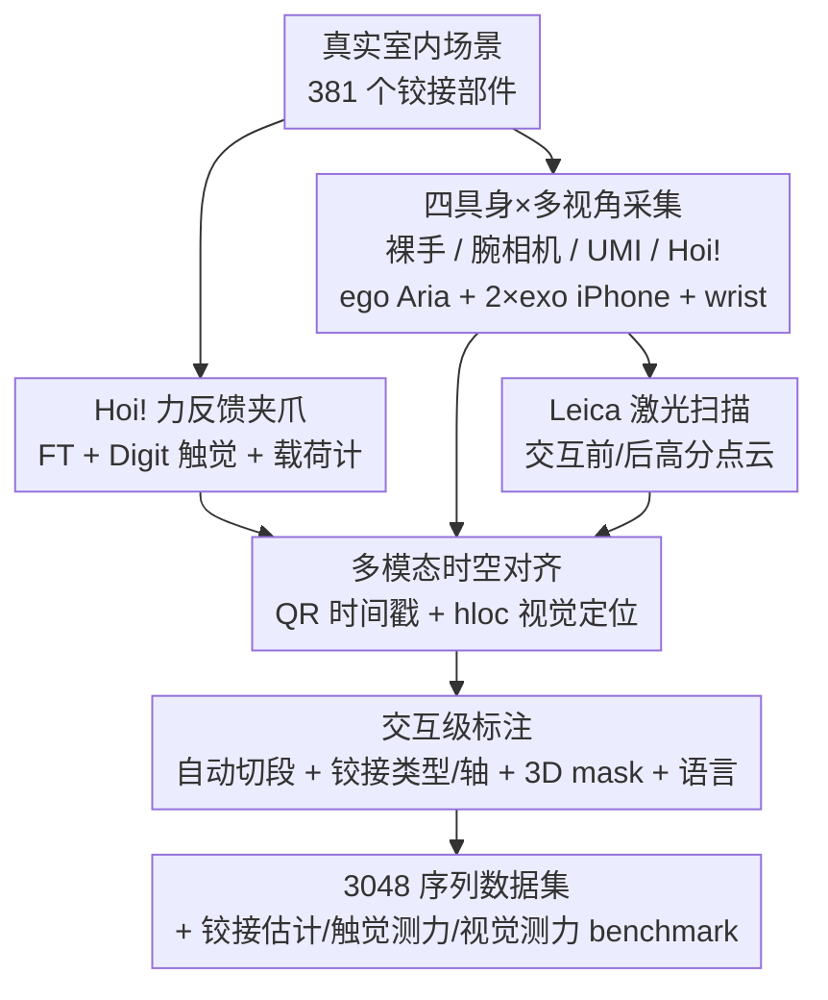

# Hoi! - A Multimodal Dataset for Force-Grounded, Cross-View Articulated Manipulation

**会议**: CVPR 2026  
**论文**: [CVF Open Access](https://openaccess.thecvf.com/content/CVPR2026/html/Engelbracht_Hoi_-_A_Multimodal_Dataset_for_Force-Grounded_Cross-View_Articulated_Manipulation_CVPR_2026_paper.html)  
**代码**: 项目页 https://hoi-dataset.ethz.ch （夹爪设计开源）  
**领域**: 机器人 / 具身操作 / 多模态数据集  
**关键词**: 铰接操作, 力接地, 跨视角, 多具身, 触觉感知

## 一句话总结
Hoi! 是一个面向"力接地、跨视角、跨具身"铰接家具操作的真实多模态数据集——用一把自研的手持力反馈夹爪，在 38 个真实室内场景里采集了人用四种具身（裸手 / 裸手+腕相机 / UMI 夹爪 / Hoi! 夹爪）操作 381 个抽屉门冰箱等铰接部件的 3048 条序列，每条序列时空对齐了 RGB-D、力/力矩、触觉、手部位姿和场景级激光点云，并配套了铰接估计、触觉测力、视觉测力三个 benchmark。

## 研究背景与动机

**领域现状**：计算机视觉正从"看懂"走向"看懂怎么用/怎么交互"，这一步主要靠大规模人–物交互数据集驱动。但仔细看会发现一个割裂：以人为中心的视频数据集（做饭、装配、运动）偏长时程活动，而机器人数据集主攻 pick-and-place、擦拭、开抽屉这类短时程原语。

**现有痛点**：铰接家具操作天天发生，但成体系的"人操作家具"视频数据极稀缺。现有铰接数据集（如 RBO、各类 part 数据库）要么是纯仿真、要么是静态扫描得来的模型，缺少把标注"接地"到真实交互的配对运动数据；更关键的是它们几乎都不带**力/触觉**，也不覆盖**多视角**和**多具身**。

**核心矛盾**：没有一份数据能同时把"看到了什么（what is seen）""做了什么（what is done）""感受到了什么力（what is felt）"在人和机器人两种具身上耦合起来。于是一连串迁移问题无法系统研究：从视频预测的交互力能泛化到人类视频吗？外视角机器人视角下铰接跟踪还有效吗？人手演示的技能能否重定向到二指夹爪？

**本文目标**：造一份**力接地、跨视角、跨具身**的铰接操作数据集，把视觉感知和触觉动作绑在一起。

**切入角度**：用一把人能手持、却带机器人级力/触觉传感的"夹爪在棍子上"装置，让人在野外像操作机器人末端执行器一样去开关家具，从而把人类演示和机器人形态拉到同一套传感空间里。

**核心 idea**：同一个铰接物体、同一套交互，用四种具身各做一遍并多视角同步录制，再用激光扫描提供场景级几何真值，构成一个能直接对比"人 vs 机器人视角""视觉 vs 力"的统一基底。

## 方法详解

### 整体框架
这篇论文的"方法"本质是一条**数据采集与对齐流水线**：在真实房间里让 7 名演示者用四种具身操作铰接部件，多套相机/力/触觉模块各跑各的时钟独立录制，事后再把所有模态在时间和空间上对齐到激光扫描建立的统一世界坐标系，最后做交互级标注并切出三个 benchmark。整条链路要解决的核心难题是：异构传感器如何在野外做到时空对齐，以及如何把"力/触觉"这种以往视频数据集完全缺失的模态可靠地记录并标注下来。

### 关键设计

**1. Hoi! 手持力反馈夹爪：在野外采到机器人级的力与触觉**

以往人–物交互视频之所以拿不到力，是因为人手上没法装力传感器、也没有统一的接触面。作者干脆设计并开源了一把"夹爪在棍子上"（gripper-on-a-stick）的二指平行夹爪：抓取由手柄里一个标定过的载荷计（load cell）驱动——人捏载荷计，测得的载荷被换算成夹持力，再由 Dynamixel XM430-W350-T 电机驱动对掌（antipodal，借鉴 ALOHA 设计）机构闭合。两枚相对的 GelSight Digit 传感器提供高分辨率触觉成像，腕部一枚 Bota SensONE 6 自由度力/力矩传感器测交互力，腕上的 ZED Mini 立体相机 + Project Aria 提供位姿与 RGB-D 腕视角。整套系统跑在背包里电池供电的 NVIDIA Jetson Orin Nano 上，且做了重力补偿和全标定，因此可以完全移动地在真实房间采集。这把夹爪让"人手演示"第一次带上了与机器人末端执行器同构的力/触觉读数，是整个数据集"力接地"的硬件根。

**2. 四具身 + 多视角同步：让同一交互在人与机器人形态间可直接对比**

每个铰接物体都被四种具身各操作一遍——(i) 裸手、(ii) 裸手 + 腕相机、(iii) 手持 UMI 夹爪、(iv) Hoi! 夹爪，另有一小部分用遥操作的 Spot 机器人（带机身相机 + 腕部 Aria）录制。所有具身下都同步多视角录制：一台 egocentric 的 Project Aria 提供 RGB、SLAM、视线（eye gaze）和手部位姿，两台静态第三人称 iPhone 13 Pro 提供 RGB + LiDAR 深度，外加腕视角。这样设计的意义在于：从裸手到二指夹爪，具身的"形态差"被显式录进同一物体的多条序列里，研究者可以直接问"人手怎么开，换成夹爪会怎样"，而不是在两个互不相干的数据集之间硬猜。Tab. 2 列出了每种条件下到底有哪些数据流——只有 Hoi! 夹爪同时具备腕深度、力/力矩、手指触觉和电机力矩。

**3. 多模态时空对齐：把各跑各时钟的异构流拉到同一时空**

野外采集最大的工程难点是各录制模块用独立内部时钟、各自 SLAM 各自漂移。时间上，作者在录制时把一个编码当前 Unix 时间戳的二维码以 25 Hz 显示进每路相机流，事后检测解码即可得到每路视频相对公共参考时间的偏移；对 30–60 Hz 的常见帧率，这套方法把时间对齐精度做到约 $10\!\sim\!25\,\text{ms}$。空间上，作者先用 Leica RTC360 在交互前后各扫一遍房间，得到稠密 3D 点云作为共享参考系；再假设各设备 SLAM 零漂移、全局一致，从而把全局配准问题约化成一次刚性 3D-3D 对齐——用扫描点云和全景图构造 2D-3D 对应库，对自动挑出的高质量关键帧用 hloc 估 6-DoF 位姿，最终为每条传感器轨迹稳健求出一个刚性变换 $T^{\text{query}}_{\text{world}}$。对齐精度用 Qualisys 动捕系统验证（经手眼标定把动捕体坐标与 Aria 设备坐标对齐），头/腕/夹爪轨迹的位置 RMSE 仅 $0.005\!\sim\!0.006\,\text{m}$、旋转 RMSE $0.012\!\sim\!0.016\,\text{rad}$（Tab. 3）。

**4. 交互级标注与三任务 benchmark：把数据变成可评测的研究基底**

原始流先靠二维码自动切段成单次交互，再用轻量标注工具人工核验；铰接类型（移动 prismatic / 转动 revolute）和轴用 ArtiPoint 的工具标注，并扩展该工具加上部件的 3D mask（在全景图上提示 SAMv2 得到 2D mask，再借点云升维到 3D）和语言描述。基于这套标注，作者定义了三个互补的"具身物体理解"benchmark：**铰接物体估计**（从图像/视频推断部件如何运动及其运动学参数）、**触觉测力**（仅凭 Digit 触觉图像回归接触法向/切向力）、**视觉测力**（给定 RGB-D 观测和操作目标，预测达成交互所需的 3D 力与 affordance）。这三个任务恰好把数据集的多模态价值串起来：视觉、触觉、力被同一套真值标定绑定，可以直接评测现有方法在野外真实交互上的迁移能力。

### 损失函数 / 训练策略
本文是数据集与 benchmark 论文，不训练新模型，benchmark 全部以 zero-shot 或沿用原方法的设置评测现成模型（GPT-5、ArtGS、ArtiPoint、Sparsh、ForceSight），重点是暴露它们在真实野外数据上的差距而非刷点。

## 实验关键数据

### 主实验：三个 benchmark

**铰接物体估计（Tab. 4）**：给一张交互前单图（GPT-5）或 egocentric 视频（ArtGS/ArtiPoint），预测铰接类型与 3D 轴。指标为类型召回 $R$、轴角误差 $\theta_{\text{err}}$、转动轴距离误差 $d_{L2}$。

| 数据集 | 方法 | $R_{\text{pris}}$[%] | $R_{\text{rev}}$[%] | $\theta_{\text{pris}}$[°] | $\theta_{\text{rev}}$[°] | $d_{L2}$[m] |
|--------|------|------|------|------|------|------|
| Hoi! | GPT-5 (ego) | 71.9 | 89.7 | - | - | - |
| Hoi! | GPT-5 (exo) | 65.6 | 89.7 | - | - | - |
| Hoi! | ArtGS | 100.0 | 0.00 | 58.39 | 49.11 | 0.321 |
| Hoi! | ArtiPoint | 26.90 | 57.10 | 47.06 | 63.76 | 0.540 |
| Arti4D | ArtiPoint | 68 | 98 | 14.54 | 17.14 | 0.07 |

结论：ArtGS 因依赖稳健分割、在杂乱真实场景里崩（转动召回为 0）；ArtiPoint 在 Hoi! 上因用缩放后的单目深度（含逐帧抖动噪声）导致 3D 升维和轨迹滤波严重退化，比在 Arti4D 上差很多；反倒是 GPT-5 仅做类型预测出奇地稳健。说明现有铰接估计方法要么过度依赖准确深度、要么扛不住杂乱与手部遮挡。

**触觉测力（Tab. 5）**：仅凭 Digit 触觉图像估计法向/切向力，RMSE（单位 N，含 95% CI）。

| 方法 | 切向 | 法向 | 合力 |
|------|------|------|------|
| Sparsh w/ DINO | 3.07 [2.87, 3.26] | 3.45 [3.24, 3.66] | 3.86 [3.62, 4.11] |
| Sparsh w/ DINOv2 | 3.18 [2.99, 3.38] | 3.79 [3.61, 3.96] | 4.11 [3.90, 4.33] |

Sparsh 在其原始 benchmark 上是毫牛级精度，到 Hoi! 上误差飙到数牛量级。作者归因于真实把手/边缘/家具部件的接触几何远比训练用的简单压头复杂（分布外接触几何），加上野外人为操作带来的分布外载荷区间。⚠️ 两个 setup 并非完全等价（Hoi! 是两枚对掌 Digit 聚合后的力），但误差量级的跳变仍很说明问题。

### 视觉测力消融（Tab. 6）：raw vs 运动对齐

给定 RGB-D 观测 + 操作目标（如"open the drawer"），ForceSight 零样本预测 3D 交互力，RMSE 越低越好。Projected 表示只评测与夹爪运动方向对齐的力分量（去掉操作者无关扰动）。

| 配置 / 地点 | RMSE Projected [N] | RMSE Raw [N] | 说明 |
|------|------|------|------|
| Hoi! 总体 | 2.23 | 2.57 | 投影后更准，说明对真实操作扰动不够鲁棒 |
| kitchen_7 | 3.53 | 3.64 | 含冰箱+烤箱，需大力，误差最高 |
| office_1 | 2.33 | 3.69 | 磁吸抽屉，raw 误差大 |
| livingroom_1 | 1.09 | 1.74 | 轻负载，误差最低 |
| ForceSight 原数据集 | – | 0.40 | 原 benchmark 上仅 0.40 N |

### 关键发现
- **方法普遍水土不服**：无论铰接估计、触觉测力还是视觉测力，在受控实验室刷得很好的 SOTA 一到 Hoi! 野外数据就大幅退化——这正是该数据集的价值所在。
- **力是高刚度物体的关键软肋**：ForceSight 在需要大力的部件（冰箱、烤箱、磁吸抽屉）上误差最高，说明现有方法/数据对"硬、费力"的铰接机构曝光严重不足。
- **运动对齐有效**：把测得力/力矩投影到夹爪线速度/角速度方向、去掉无关分量后，视觉测力 RMSE 从 2.57 降到 2.23 N，证明 raw 信号里混入了大量操作者引入的扰动。
- **VLM 做类型分类意外稳健**：GPT-5 仅判断 prismatic/revolute 时召回可达 89.7%（转动），但它不给精确的 3D 轴。

## 亮点与洞察
- **"力接地"的硬件创新最巧**：把机器人末端的力/力矩 + GelSight 触觉做成人能手持的"棍上夹爪"，让人类野外演示第一次带上与机器人同构的力读数——这是以往视频数据集结构性缺的一块，且夹爪设计开源，可复现可扩展。
- **同物体四具身多视角同步**是研究"人→机器人技能迁移"的理想控制变量设置：形态差被显式录进同一物体的多条序列，而非跨数据集硬比。
- **二维码时间戳 + 激光扫描刚性对齐**是一套朴素但可靠的野外多设备时空对齐 trick（25 Hz QR → 10–25 ms 时间精度；hloc 视觉定位 → 单刚性变换），值得迁移到任何异构传感器野外采集。
- **benchmark 设计诚实**：作者明确报告现成 SOTA 在自家数据上崩盘，并逐项归因（深度噪声、接触几何分布外、操作扰动），把数据集定位成"暴露差距、推动研究"而非刷榜。

## 局限与展望
- **混合具身仍非真机器人**：Hoi! 夹爪虽模仿机器人末端，但终究由人操作，无法完全捕捉真实机械臂的运动学/动力学约束，全身形态的真迁移仍是开放问题（作者承认）。
- **机制覆盖有限**：虽涵盖多种家用铰接物，但尚未覆盖全部机械复杂度和罕见边缘机构。
- **benchmark 偏感知、object-centric**：目前聚焦测力与铰接推理这类基础感知能力，尚未延伸到端到端策略学习（感知→动作闭环）。
- **自评补充**：触觉测力的人–机对比"不完全等价"（两枚 Digit 聚合 vs 原始单传感器），跨 setup 的误差量级不宜直接当作模型优劣的定论；规模虽达 48 h，相比 RH20T/AgiBot 这类千小时级遥操作数据仍偏小，更适合做评测基底而非大规模预训练。

## 相关工作与启发
- **vs RBO**: RBO 也提供真人操作铰接物的 RGB-D + 有限力测量，但规模小（~1 h、14 个物体）、单视角、单具身；Hoi! 在规模（48 h、381 部件、38 场景）、多视角（ego/exo/wrist）和四具身上全面扩展。
- **vs Arti4D / ArtiPoint**: Arti4D 提供野外铰接重建数据、ArtiPoint 从 egocentric RGB-D 推铰接；Hoi! 复用了 ArtiPoint 的标注工具但补上了力/触觉和跨具身，且实验显示这些方法在 Hoi! 更难的野外条件下性能明显下降。
- **vs EgoExo4D / EpicKitchens 等 egocentric 视频**: 它们语义覆盖广但只讲"发生了什么"，不带施加的力或接触反馈，难以迁移到物理操作；Hoi! 用"看到+做了+感受到的力"三者耦合补上这块。
- **vs ForceMimic / RH20T**: 二者证明了引入力测量能显著提升机器人操作，但局限于桌面、低域差设置；Hoi! 把多模态力/触觉带到野外铰接家具和人–机跨具身场景。

## 评分
- 新颖性: ⭐⭐⭐⭐⭐ 首个"力接地+跨视角+跨具身"的真实铰接操作数据集，配套开源手持力反馈夹爪
- 实验充分度: ⭐⭐⭐⭐ 三个 benchmark 覆盖铰接/触觉力/视觉力，诚实暴露 SOTA 差距；但偏感知评测、未做策略学习
- 写作质量: ⭐⭐⭐⭐ 动机清晰、对齐流程交代细致，Tab.1 横向对比一目了然
- 价值: ⭐⭐⭐⭐⭐ 填补人–机器人技能迁移与野外测力研究的关键数据空白，硬件+数据均开源

<!-- RELATED:START -->

## 相关论文

- [\[CVPR 2026\] ForceVLA2: Unleashing Hybrid Force-Position Control with Force Awareness for Contact-Rich Manipulation](forcevla2_unleashing_hybrid_force-position_control_with_force_awareness_for_cont.md)
- [\[CVPR 2026\] CLaD: Planning with Grounded Foresight via Cross-Modal Latent Dynamics](clad_planning_with_grounded_foresight_via_cross-modal_latent_dynamics.md)
- [\[CVPR 2026\] A Cross-view Fusion Framework for Robust 6-DoF Grasp Pose Estimation](a_cross-view_fusion_framework_for_robust_6-dof_grasp_pose_estimation.md)
- [\[CVPR 2026\] Physically Ground Commonsense Knowledge for Articulated Object Manipulation with Analytic Concepts](physically_ground_commonsense_knowledge_for_articulated_object_manipulation_with.md)
- [\[CVPR 2026\] INSIGHT Bench: Towards Grounded IN-SItu Guidance for Robotic Manipulation](insight_bench_towards_grounded_in-situ_guidance_for_robotic_manipulation.md)

<!-- RELATED:END -->
