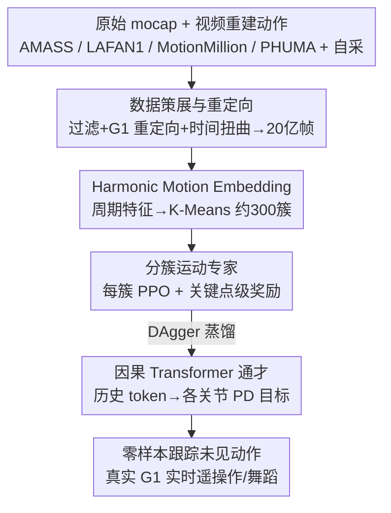

# Humanoid Generative Pre-Training for Zero-Shot Motion Tracking

**会议**: CVPR 2026  
**论文**: [CVF Open Access](https://openaccess.thecvf.com/content/CVPR2026/html/Qi_Humanoid_Generative_Pre-Training_for_Zero-Shot_Motion_Tracking_CVPR_2026_paper.html)  
**代码**: 无  
**领域**: 机器人 / 具身智能  
**关键词**: 人形机器人, 全身运动跟踪, 零样本泛化, 专家蒸馏, 缩放定律

## 一句话总结
把人形机器人的全身运动跟踪重新定义成「GPT 式因果序列建模」：先在 20 亿帧重定向运动语料上用 RL 训练约 300 个分簇运动专家，再用 DAgger 把它们蒸馏进一个带因果注意力的 Transformer（Humanoid-GPT），靠数据和模型规模同时打破「敏捷性 vs 泛化性」的取舍，在真实 Unitree-G1 上零样本跟踪舞蹈、功夫、跳跃等未见过的高动态动作。

## 研究背景与动机
**领域现状**：人形机器人运动跟踪（motion tracking）要把一段参考人体动作转成机器人各关节的低层控制指令，让机器人实时模仿。当前主流做法是用浅层 MLP 策略，在小规模 mocap 语料上训练——常用数据集（AMASS、LAFAN1 等）也就 10⁴ 量级的轨迹、约 720 万帧。

**现有痛点**：数据规模和模型容量的双重不足，逼出一个顽固的失败模式——**敏捷性和泛化性互相打架**。能把高动态敏捷动作（拳击、快速舞步）跟得很好的跟踪器（如 BeyondMimic、ASAP）往往在没见过的风格上直接崩；而泛化稍好的跟踪器（如 TWIST、UniTracker）又对复杂动力学欠拟合、跟踪不够锐利。

**核心矛盾**：作者主张这个取舍**不是本质的**，而是「规模不足 + 训练设计不匹配」的症状。但简单地往同一条旧 pipeline 里塞更多动作片段也不行——当规模提升几个数量级时，三个问题变得决定性：① 该用什么数据、怎么处理海量且带噪的数据？② 什么模型结构既匹配「在线跟踪不能看未来」的约束、又能随规模持续变好？③ 当数据集从百万级涨到十亿级，什么训练配方还能保持稳定？

**本文目标**：构建一个统一的、在线的、通用人形运动跟踪器，让敏捷性和零样本泛化同时拿到。

**切入角度**：把语言/视觉里被反复验证的「scale 是泛化最可靠的路径」搬到人形控制上——既然 GPT 靠规模解锁了涌现能力，运动跟踪也应该如此。但要让 scale 真正生效，必须重做数据、结构、训练三件事。

**核心 idea**：把运动跟踪重新表述为 GPT 式序列建模——先训一大批 RL 运动专家覆盖动力学分布，再把它们**蒸馏进单个因果 Transformer**，在 20 亿帧（比以往大 200×）的重定向语料上做生成式预训练。

## 方法详解

### 整体框架
Humanoid-GPT 是一条「数据 → 专家 → 蒸馏」的三阶段流水线。**阶段 a（数据策展）**：聚合所有主流 mocap 源 + 自采数据，重定向到 Unitree-G1 的 29 自由度关节空间，严格过滤+时间扭曲增广，得到 20 亿帧 G1 运动；同时用 Harmonic Motion Embedding（HME）把整个语料聚成约 300 个运动簇。**阶段 b（训练运动专家）**：在每个簇上用 PPO 训练一个专门的 RL 跟踪策略，靠关键点级奖励驱动机器人贴合参考姿态、同时保持平衡，得到约 300 个高保真专家组成的「运动先验库」。**阶段 c（蒸馏成通才）**：用 DAgger 把所有专家的行为蒸馏进单个因果 Transformer——把当前本体感知状态和参考姿态拼成 token，用因果时序注意力预测各关节 PD 目标，一次前向并行监督整段历史。推理时维护长度为 H 的历史 token 队列，取最后位置的输出作为当前控制目标，全身控制端到端延迟 < 1.5ms。

### 关键设计

**1. 20 亿帧语料策展：把跟踪器的训练规模拉高 200×**

以往跟踪器困在约 720 万帧的小语料里，这是「敏捷 vs 泛化」取舍的根因。作者把 AMASS、LAFAN1、MotionMillion、PHUMA 等所有公开 mocap 源 + 大规模自采数据聚合成统一语料，再用现成重定向框架把每条人体动作映射到 Unitree-G1 的 29-DoF 关节空间。处理上有两个关键动作：一是**过滤掉显式物体交互**（坐椅子、游泳、爬楼梯），保证动作在空旷场景下与机器人的驱动能力兼容；二是做**运动时间扭曲增广**（uniform 加速/减速每条序列），把数据集扩到约 5 倍，丰富速度变化、增强对运动速度的鲁棒性。最终得到 20 亿帧 G1 重定向 token，比以往跟踪训练集大 200× 以上。论文还给出第一份系统证据：当模型和训练集被适当放大时，**视频估计的运动也能实质性提升跟踪**——这意味着不再受限于昂贵的棚内 mocap。

**2. Harmonic Motion Embedding（HME）：用周期特征度量并平衡运动多样性**

更多数据不等于更好泛化——大语料里常见风格（走路、站立）会主导，罕见但重要的动作淹没在长尾里。直接对原始运动做多样性度量和聚类很难，作者提出 HME 作为表示学习工具。具体做法：先在不同数据划分上训练若干 Periodic Autoencoder，从每条序列里抽出**逐关节的周期振幅和频率**；对每条序列聚合这些关节级谐波特征的均值和标准差，得到一个紧凑的 HME 向量；最后在所有 HME 嵌入上用 K-Means（以两两距离为相似度）聚出约 300 个运动簇，每簇约 1k–2k 条序列，簇内一致性强、又保留全局覆盖。HME 还支撑了对数据集多样性的定量度量：在嵌入矩阵 $X=[x_1,\dots,x_N]^\top$ 上算协方差 $\Sigma$，定义

$$\text{gstd} = \exp\Big(\frac{1}{D}\sum_{j=1}^{D}\log\sigma_j\Big), \qquad \text{log-volume} = \frac{1}{2}\log\det(\Sigma+\epsilon I),$$

其中 $\sigma_j$ 是第 $j$ 维标准差，值越大说明数据在潜在流形上铺得越广越均匀。作者据此得到一条朴素却有力的结论：**多样性和平衡缺一不可**——只多样不平衡仍会过拟合高频模式，只平衡不多样则封顶能力上限。

**3. 分簇 RL 运动专家：用关键点级奖励产出物理可行的运动先验库**

要给通才蒸馏提供高质量监督，先得有一批能把动作跟到位的专家。在每个 HME 簇上训一个 PPO 策略 $\pi: G\times S\mapsto A$，把参考关节姿态 $g_t=q^{\text{ref}}_t$ 和机器人特权本体状态 $s^{\text{priv}}_t$（各关节位置/速度、根角速度、投影重力、上一步动作）映射成各关节动作 $a_t$，再经 PD 控制器转成力矩。奖励在**身体关键点级**计算（手臂、髋、脚、骨盆等关键部位的位置和速度一致性）：对每个关键点 $k$ 在 $t$ 时刻，记位置残差 $e^{\text{pos}}_{k,t}$、速度残差 $e^{\text{vel}}_{k,t}$、SO(3) log map 诱导的旋转误差 $\theta_{k,t}$，配权重 $w_k$ 和尺度因子，奖励为

$$R_{\text{kpt}}(t)=R_{\text{pos}}+R_{\text{rot}}+R_{\text{vel}}+R_{\text{penal}},\quad R_{\text{pos}}(t)=\sum_{k\in K} w_k\exp(-\alpha_{\text{pos}}\|e^{\text{pos}}_{k,t}\|_1),$$

旋转项和速度项同样取指数形式软惩罚偏差，$R_{\text{penal}}$ 含自碰撞、平滑度等惩罚。指数形式让位置/朝向/速度的偏离被柔性惩罚，既全局准确又局部稳定。训练后只保留**高保真且长时程稳定**的专家，形成覆盖异构运动域的先验库——这是后续蒸馏不被噪声拖垮的前提。

**4. DAgger 序列蒸馏成因果 Transformer：把上百专家压成一个零样本通才**

单个专家在自己簇内很准，但遇到分布外目标会急剧退化。蒸馏阶段用 DAgger 把所有专家的知识合并进单个通才策略 $G_\theta$，并把蒸馏**重新表述为序列建模问题**。每个时刻把本体状态 $s_t$ 和参考姿态 $q^{\text{ref}}_t$ 拼成 token 嵌入 $e_t$，长度 $H$ 的 token 序列 $\{e_{t-H+1},\dots,e_t\}$ 喂进带**时序因果掩码**的 Transformer，捕捉长时程依赖和时序一致性。一次前向后，所有输出位置的动作都由对应教师的历史输出监督，损失用 SmoothL1：

$$\hat{a}_{t-H+1:t}=\bigcup_{t_i\in T}\operatorname{concat}_{k\in[-H+1,0]} t_i(s^{\text{priv.}}_{t-k},g_{t-k}),\quad l=L(G_\theta(e_{t-H+1:t}),\hat{a}_{t-H+1:t}).$$

这套设计同时吃到 Transformer 的两个长处：**并行序列监督**（一次前向监督整段历史，比 HumanPlus 用标准 PPO 训 Transformer 高效得多）和**自回归时序预测**。因为不同位置的 token 注意到的历史长度不同，模型隐式学到「位置无关的时序预测」——即便在 episode 开头历史信息稀缺时，也能输出稳定、物理一致的控制目标。因果掩码还天然契合「测试时不能看未来观测」的在线部署约束，这正是它比非因果建模和容量受限 MLP 更能随规模扩展的原因。

## 实验关键数据

### 主实验
仿真用 MuJoCo、真机用 29-DoF Unitree-G1。指标：跟踪成功率 SR（不摔倒的轨迹占比）、各关节位置误差 MPJPE（rad）、各关节速度误差 MPJVE（rad/s）、根线速度误差 RootVelErr（m/s）、各关键点位置误差 MPKPE（mm）。测试集为训练时未见的 AMASS-test split，全部零样本。

| Backbone | 训练 token | 参数量 | SR ↑ | MPJPE ↓ | MPJVE ↓ | RootVelErr ↓ | MPKPE ↓ |
|----------|-----------|--------|------|---------|---------|--------------|---------|
| MLP (3层) | 2M | 0.25M | 76.89 | 0.1191 | 0.6081 | 0.2304 | 100.49 |
| TCN (8层) | 2M | 0.65M | 81.48 | 0.0885 | 0.5716 | 0.2266 | 79.75 |
| Humanoid-GPT-S | 2M | 5.7M | 83.26 | 0.0853 | 0.5492 | 0.2049 | 62.65 |
| Humanoid-GPT-S | 20M | 5.7M | 86.02 | 0.0802 | 0.5210 | 0.1868 | 46.49 |
| Humanoid-GPT-B | 200M | 22.1M | 88.27 | 0.0793 | 0.5076 | 0.1820 | 44.78 |
| Humanoid-GPT-B | 2B | 22.1M | 90.43 | 0.0768 | 0.4891 | 0.1756 | 41.49 |
| Humanoid-GPT-L | 2B | 80.4M | **92.58** | **0.0735** | **0.4820** | 0.1785 | **40.99** |

真机四段未见舞蹈动作上，Humanoid-GPT-B 的 MPJPE/MPJVE 普遍优于 GMT、TWIST、Any2Track（如 "Can Do Can Go!" MPJPE 0.0974 vs GMT 0.1087 / TWIST 0.1253），且真机结果与仿真高度吻合，证明零样本 sim-to-real 迁移稳健。

### 消融实验
表 2 本身就是一张「数据规模 × 模型规模 × 结构」的联合消融，可拆读为：

| 对照 | 关键变化 | 说明 |
|------|---------|------|
| MLP/TCN → Transformer（均 2M token） | SR 76.9/81.5 → 83.3，MPKPE 100→63 | 结构本身就拉开差距，MLP/TCN 只能处理短程动力学、长时程一致性差 |
| GPT-S 数据 2M → 20M | SR 83.3 → 86.0，MPKPE 62.6→46.5 | 数据缩放单独就显著涨点 |
| GPT-B 数据 200M → 2B | SR 88.3 → 90.4 | 同模型下数据继续放大持续受益 |
| GPT-B → GPT-L（均 2B token） | SR 90.4 → 92.6 | 模型缩放单独继续涨点，未见早饱和 |

### 关键发现
- **存在清晰的人形跟踪缩放定律**：数据规模和模型容量同时放大，SR/MPJPE/MPKPE 全线单调改善，且 MLP/TCN 早早饱和而 Transformer 不饱和——结构是能否吃到 scale 红利的前提。
- **多样性与平衡缺一不可**：在 HME 空间里，本文策展数据的 log-volume 比 AMASS 高约 4–5，潜在覆盖明显更广；只多样不平衡仍过拟合高频模式，只平衡不多样则封顶能力。
- **视频估计运动可用**：在模型/数据被适当放大时，视频重建的运动能实质性提升跟踪，松绑了对棚内 mocap 的依赖。
- **工程上 scale 不牺牲实时性**：ONNX + TensorRT + C++ 流式 pipeline，端到端延迟 < 1.5ms（单张 RTX 4090），比 TWIST 快约 5×。

## 亮点与洞察
- **把控制问题翻译成 GPT 预训练**：用因果 Transformer + DAgger 并行序列监督，既匹配「不能看未来」的在线约束，又一次前向监督整段历史，把训练效率和部署约束统一了——这是「为什么是 Transformer 而不是更大 MLP」的真正答案。
- **HME 是个可迁移的工具**：用 Periodic Autoencoder 的关节级振幅/频率构造运动嵌入，既能聚类分簇、又能用 gstd / log-volume 定量度量数据集多样性。这套「先把动作映射到周期特征空间再度量分布」的思路，可迁移到任何需要平衡采样的运动/时序数据集。
- **位置无关时序预测的涌现**：因为不同位置 token 看到的历史长度不同，模型隐式学会在历史稀缺的 episode 开头也输出稳定控制——这是序列建模带来的「免费」鲁棒性，值得在其他在线控制任务里复用。
- **「专家库 + 蒸馏通才」破解敏捷-泛化取舍**：分簇专家保证每种动作都被跟到位（敏捷），蒸馏统一成单策略保证跨域泛化，避免了单一策略既要敏捷又要泛化的两难。

## 局限与展望
- 作者承认目前只用了运动学/本体状态作为输入，未来要纳入更丰富模态（接触力、视觉、语言）。
- 数据策展阶段**主动过滤掉了物体交互动作**（坐、游泳、爬楼），所以当前系统只覆盖空旷场景的全身动作，不支持人-物交互——这是适用范围上的明显边界。
- 评测主要在 AMASS-test 和若干舞蹈/遥操作场景，缺乏对地形变化、外力扰动、负载等真实鲁棒性挑战的系统评估；真机定量表只有四段舞蹈，样本偏少。
- 展望里提到要耦合长时程规划或 VLA 式指令，走向更通用的具身基础模型——这意味着当前 Humanoid-GPT 仍是「跟踪给定参考」，本身不做高层决策。

## 相关工作与启发
- **vs SONIC**：同样走 scale 路线（100M 帧），但用 MLP 控制器，随数据增长容量饱和；本文用 Transformer + 2B 帧，结构不饱和，吃满缩放红利。
- **vs HumanPlus**：同样用 Transformer 控制器，但用标准 PPO 训练，错失了 Transformer 的并行监督优势；本文用 DAgger 序列蒸馏，一次前向并行监督整段历史。
- **vs GMT / UniTracker**：GMT 用 MoE + 自适应采样、UniTracker 用 CVAE 师生框架来扩覆盖，但仍受限于有限的运动规模；本文把规模本身当成一等公民，并用 HME 解决「多样性≠平衡」的长尾问题。
- **vs BeyondMimic / TWIST**：前者敏捷但零样本泛化差、后者泛化好但高动态动作吃力——正是本文要消解的取舍；Humanoid-GPT 论证这个取舍来自规模和设计不足，而非本质。

## 评分
- 新颖性: ⭐⭐⭐⭐⭐ 首个把上百 RL 专家蒸馏成 GPT 式因果跟踪器、并系统刻画人形跟踪缩放定律的工作
- 实验充分度: ⭐⭐⭐⭐ 数据/模型/结构联合缩放分析扎实、真机部署可信；但真机定量样本偏少、缺扰动鲁棒性评测
- 写作质量: ⭐⭐⭐⭐ 三阶段 pipeline 和动机链条清晰，HME 与缩放定律论证到位
- 价值: ⭐⭐⭐⭐⭐ 给通用全身控制提供了「scale + 蒸馏」的可复制路线图，真机零样本舞蹈很有冲击力

<!-- RELATED:START -->

## 相关论文

- [\[CVPR 2026\] Towards Motion Turing Test: Evaluating Human-Likeness in Humanoid Robots](towards_motion_turing_test_evaluating_human-likeness_in_humanoid_robots.md)
- [\[CVPR 2026\] TrajRAG: Retrieving Geometric-Semantic Experience for Zero-Shot Object Navigation](trajrag_retrieving_geometric-semantic_experience_for_zero-shot_object_navigation.md)
- [\[CVPR 2026\] InternData-A1: Pioneering High-Fidelity Synthetic Data for Pre-training Generalist Policy](interndata-a1_pioneering_high-fidelity_synthetic_data_for_pre-training_generalis.md)
- [\[CVPR 2026\] Iterative Closed-Loop Motion Synthesis for Scaling the Capabilities of Humanoid Control](iterative_closed-loop_motion_synthesis_for_scaling_the_capabilities_of_humanoid_.md)
- [\[NeurIPS 2025\] Zero-Shot Context Generalization in Reinforcement Learning from Few Training Contexts](../../NeurIPS2025/robotics/zero-shot_context_generalization_in_reinforcement_learning_from_few_training_con.md)

<!-- RELATED:END -->
