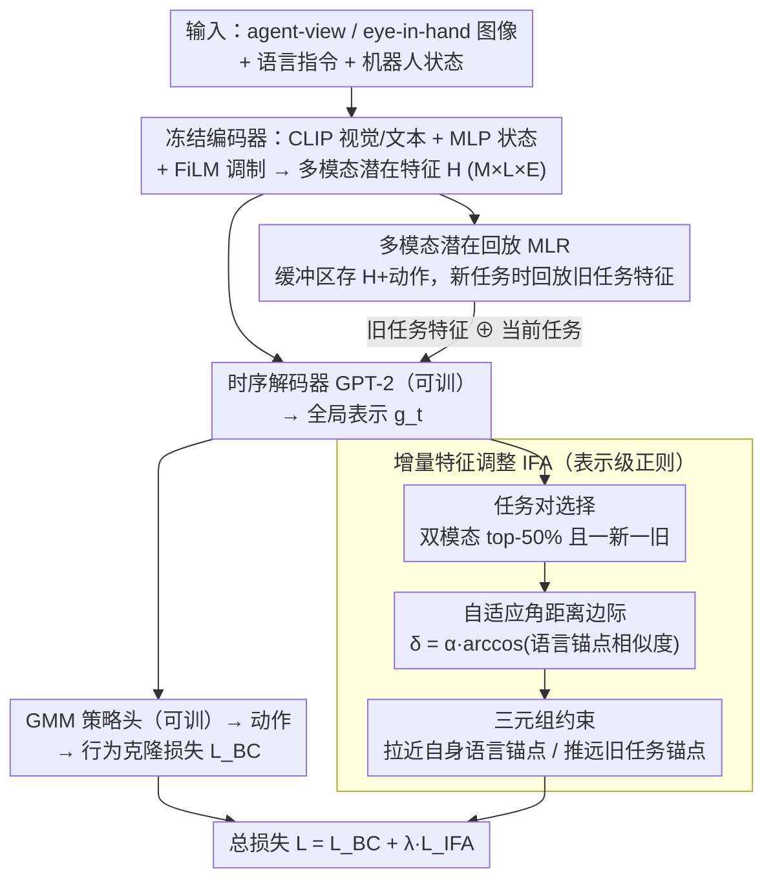

# Lifelong Imitation Learning with Multimodal Latent Replay and Incremental Adjustment

**会议**: CVPR 2026  
**arXiv**: [2603.10929](https://arxiv.org/abs/2603.10929)  
**代码**: [https://github.com/yfqi/lifelong_mlr_ifa](https://github.com/yfqi/lifelong_mlr_ifa)  
**领域**:机器人  
**关键词**: lifelong imitation learning, multimodal latent replay, incremental feature adjustment, catastrophic forgetting, LIBERO

## 一句话总结
提出终身模仿学习框架，通过多模态潜在回放（MLR）在冻结编码器的特征空间中存储和回放紧凑表示，并引入增量特征调整（IFA）机制用角距离约束维持任务间可分性，在LIBERO基准上AUC提升10-17点、遗忘降低最多65%。

## 背景与动机
模仿学习（IL）让机器人通过观察人类示范来学习行为，但现实环境是动态的——新物体、新目标、新上下文不断出现。标准IL假设固定任务集，不支持动态扩展。终身模仿学习（LIL）旨在让智能体持续学习新技能同时保留旧技能，核心挑战是灾难性遗忘。现有LIL方法主要有：(1) 经验回放法（如LOTUS存储原始轨迹，CRIL用GAN生成回放数据），但需大量内存且对新旧任务相似度敏感；(2) 渐进式模型扩展法（如TAIL为每个任务训练独立adapter），但需要测试时知道task ID；(3) 蒸馏法（如M2Distill），但pipeline复杂。这些方法要么存储效率低，要么依赖PEFT或task ID，要么需要复杂的蒸馏流程。

## 核心问题
终身模仿学习中有两个核心挑战：(1) **存储效率**——传统经验回放存储原始轨迹（高维图像+状态序列），内存开销大；(2) **表示干扰**——新任务的潜在表示可能与旧任务重叠，导致共享嵌入空间中的任务间干扰。如何在不使用PEFT、不依赖task ID、不需要知识蒸馏的前提下，用简单的pipeline实现高效的终身学习？

## 方法详解

### 整体框架

终身模仿学习要在不断来的新任务上学新技能、又不忘旧技能，本文的思路是「冻住编码器、只在特征空间里回放」。策略网络由三个模态编码器（CLIP 视觉、CLIP 文本、MLP 状态）+ FiLM 调制层 + GPT-2 时序解码器 + GMM 策略头组成。先做多任务预训练建立共享表示（所有模块可训，CLIP 用 LoRA rank-8 微调）；进入终身学习阶段后冻结所有编码器和 FiLM，只更新时序解码器和策略头。输入是 agent-view 图像、eye-in-hand 图像、语言指令和机器人状态，输出 5 分量 GMM 动作分布。在此之上加两件武器：**多模态潜在回放 MLR** 把旧任务的潜在特征存进缓冲区、新任务训练时一起回放以抗遗忘；**增量特征调整 IFA** 在全局表示 $g_t$ 上加一个角距离正则，把新旧任务在嵌入空间里推开。最终损失 $\mathcal{L}=\mathcal{L}_{BC}+\lambda_{IFA}\mathcal{L}_{IFA}$。整套设计刻意避开了 PEFT、task ID 和知识蒸馏，pipeline 尽量简单。

### 关键设计

**1. 多模态潜在回放 MLR：回放压缩后的特征而非原始轨迹**

传统经验回放存原始轨迹（高维图像+状态序列），内存开销大。MLR 改成存经冻结编码器和 FiLM 调制后的多模态潜在特征 $\mathbf{H} \in \mathbb{R}^{M \times L \times E}$（M=模态数，L=时间步，E=嵌入维度）及对应动作。新任务到来时，从缓冲区采样旧任务的潜在表示与当前数据一起训练。因为编码器已冻结，回放时直接喂特征、跳过前向传播，内存远小于存图像；缓冲区按任务均衡分配，每任务约存 5 个示范的特征量（概率采样 0.5）。

**2. 增量特征调整 IFA：用三元组约束维持任务间可分性**

只回放还不够——新任务的潜在表示可能和旧任务在共享嵌入空间里重叠，造成干扰。IFA 为每个任务维护一个参考嵌入，惩罚「当前任务表示离自己锚点比离旧任务锚点还远」的情况：

$$\mathcal{L}_{IFA} = \max(0, d(g_t(T_k), h^{(r)}(T_k)) - d(g_t(T_k), h^{(r)}(T_j)) + \delta)$$

本质是个三元组损失——拉近当前任务全局表示 $g_t(T_k)$ 与自身锚点、推远与旧任务锚点，从而在表示空间里给每个任务划出清晰边界，避免新旧任务挤在一起。

**3. 自适应角距离边际：让边际随任务相似度自动伸缩**

固定边际 $\delta$ 没法适配不同相似度的任务对。本文把边际定义为任务间参考嵌入角距离的比例 $\delta = \alpha \cdot \arccos(\text{cos\_sim})$。用角距离而非余弦距离的好处是高相似度区分辨率更高——两个表示非常接近时余弦距离趋于饱和、变化不敏感，而 arccos 仍能拉开差异，正好对应「最容易混淆的相似任务对最需要被推开」。缩放因子 $\alpha$ 按数据集取 0.1–0.7。锚点用语言嵌入而非全局均值，因为语言嵌入在冻结编码器下固定不变，不会像全局均值那样在训练中漂移。

**4. 任务对选择策略：只约束最容易混淆的任务对**

对所有任务对都施加 IFA 既浪费又会过度正则。本文先算任务间在 agent-view 和 language 两个模态上的平均余弦相似度，只挑**两个模态上同时进入前 50% 最相似**、且必须一新一旧的任务对来加约束——把正则火力集中在真正有干扰风险的地方。

### 损失函数 / 训练策略

总目标 $\mathcal{L} = \mathcal{L}_{BC} + \lambda_{IFA} \mathcal{L}_{IFA}$，$\lambda_{IFA}=0.1$，$\mathcal{L}_{BC}$ 为基于 GMM 策略头的行为克隆损失（负对数似然）。AdamW 优化器，学习率 $10^{-4}$，线性调度器，批量大小 10，训练 100 epochs；预训练和终身学习阶段配置一致。

## 实验关键数据

| 数据集 | 指标 | MLR+IFA (本文) | LOTUS (之前SOTA) | ISCIL | 提升 |
|--------|------|------|----------|------|------|
| LIBERO-OBJECT | FWT↑ | 84.6 | 74.0 | 71.7 | +10.6 vs LOTUS |
| LIBERO-OBJECT | NBT↓ | 11.4 | 11.0 | 11.9 | 相当 |
| LIBERO-OBJECT | AUC↑ | 79.4 | 65.0 | 66.3 | +14.4 vs LOTUS |
| LIBERO-GOAL | FWT↑ | 80.0 | 61.0 | 70.4 | +19.0 vs LOTUS |
| LIBERO-GOAL | NBT↓ | 6.9 | 30.0 | 19.4 | -64% vs ISCIL |
| LIBERO-GOAL | AUC↑ | 77.2 | 56.0 | 60.5 | +16.7 vs ISCIL |
| LIBERO-50 | FWT↑ | 60.8 | 39.0 | 47.8 | +13.0 vs ISCIL |
| LIBERO-50 | NBT↓ | 8.6 | 43.0 | 15.0 | -43% vs ISCIL |
| LIBERO-50 | AUC↑ | 56.1 | 45.0 | 37.7 | +11.1 vs LOTUS |

### 消融实验要点
- **MLR单独**已大幅超SOTA（AUC在OBJECT上77.6 vs LOTUS 65），加IFA进一步提升（79.4）
- **模态相似度选择**：language+agent-view组合最佳（AUC 79.4），单模态或其他组合都差
- **任务对比例**：选top 50%最优，33.3%不够充分，66.6%过度正则化导致NBT升高
- **参考选择**：语言嵌入作参考优于全局均值——语言嵌入固定不变，而全局均值在训练中漂移
- **缓冲区大小**：存储概率0.5→0.1，AUC从79.4降至76.6，说明充分存储很重要
- **角距离 vs 余弦距离**：角距离一致优于余弦距离，且方差更小
- **全参微调 vs LoRA**：全参微调时序解码器远优于LoRA（AUC 79.4 vs ≤54.2），说明时序解码器需要充分容量
- **FiLM层**：去掉FiLM大幅掉点（AUC从79.4降至41.6），任务条件化调制至关重要

## 亮点
- **极简pipeline**：冻结预训练编码器+只训时序解码器+潜在回放，不需要蒸馏/PEFT/task ID，简单有效
- **角距离IFA公式设计巧妙**：利用arccos在高相似度区域的放大特性，配合自适应边际，兼顾了不同难度的任务对
- **语言嵌入作锚点**：巧妙利用了语言描述在冻结编码器下的稳定性作为参考点，避免了训练过程中锚点漂移
- **存储效率**：潜在回放的内存消耗约188MB（OBJECT）/ 121MB（GOAL），远小于存储原始图像

## 局限与展望
- 仅在LIBERO模拟基准上验证，未在真实机器人上测试
- 预训练阶段用LoRA微调CLIP可能限制了在域外场景的泛化
- $\alpha$ 需要按数据集调整（0.1/0.3/0.7），且最优值差异大，自动选择 $\alpha$ 是一个开放问题
- 任务序列较短（OBJECT/GOAL只有4个新任务），更长任务序列的可扩展性有待验证
- 没有探索跨域（simulator→real）的迁移能力
- 潜在回放依赖冻结编码器的质量，如果编码器在某些任务上表征能力不够可能存在瓶颈

## 与相关工作的对比
- **vs LOTUS**：LOTUS存储原始轨迹+open-vocabulary视觉编码器做skill discovery，pipeline复杂；本文用冻结CLIP+latent replay，更简单且性能全面超越（AUC提升10-17点）
- **vs M2Distill**：M2Distill用多模态蒸馏维持一致潜在空间，需要额外的教师模型和GMM对齐；本文不需要蒸馏，用IFA直接在表示空间做正则化，更简洁且LIBERO-50上指标领先
- **vs TAIL**：TAIL需要task ID来选择正确的adapter，不适用task-agnostic场景；本文在相同评估协议下大幅超越

## 启发与关联
- 潜在回放的思路可以迁移到其他多模态持续学习场景（如VLM的持续微调）
- IFA的角距离自适应边际设计可应用于任何需要维护类间可分性的持续学习方法
- 语言嵌入作为稳定锚点的idea值得在其他跨模态学习任务中借鉴

## 评分
- 新颖性: ⭐⭐⭐⭐ MLR和IFA的结合在LIL领域是新的，angle-based自适应margin设计有洞察
- 实验充分度: ⭐⭐⭐⭐⭐ 消融实验非常详尽，覆盖了几乎所有设计选择，有UMAP可视化和计算效率分析
- 写作质量: ⭐⭐⭐⭐ 结构清晰，公式推导完整，图表信息量大
- 价值: ⭐⭐⭐⭐ 在LIBERO所有基准上刷新SOTA，开源代码，对终身机器人学习有实际参考价值

<!-- RELATED:START -->

## 相关论文

- [\[CVPR 2026\] NIL: No-data Imitation Learning](nil_no-data_imitation_learning.md)
- [\[CVPR 2026\] Arcadia: Toward a Full-Lifecycle Framework for Embodied Lifelong Learning](arcadia_toward_a_full-lifecycle_framework_for_embodied_lifelong_learning.md)
- [\[CVPR 2026\] Expanding Spatial and Temporal Context for Robotic Imitation Learning With Scene Graphs](expanding_spatial_and_temporal_context_for_robotic_imitation_learning_with_scene.md)
- [\[CVPR 2026\] Learning to Act Robustly with View-Invariant Latent Actions](learning_to_act_robustly_with_view-invariant_latent_actions.md)
- [\[CVPR 2026\] CoMo: Learning Continuous Latent Motion from Internet Videos for Scalable Robot Learning](como_learning_continuous_latent_motion_from_internet_videos_for_scalable_robot_l.md)

<!-- RELATED:END -->
