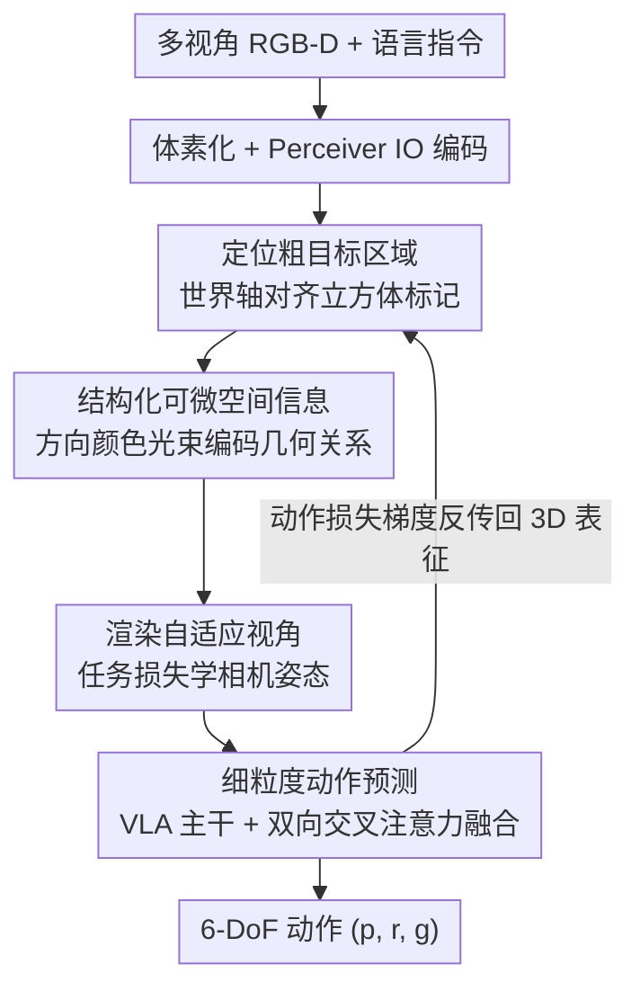

# Localizing, Structuring, and Rendering: Bridging 3D and 2D Vision-Language-Action Models for Robotic Manipulation

**会议**: CVPR 2026  
**论文**: [CVF Open Access](https://openaccess.thecvf.com/content/CVPR2026/html/Zhao_Localizing_Structuring_and_Rendering_Bridging_3D_and_2D_Vision-Language-Action_Models_CVPR_2026_paper.html)  
**代码**: https://github.com/zyl123456aB/DIFFVLA  
**领域**: 机器人 / 具身智能 / Vision-Language-Action  
**关键词**: VLA、可微渲染、机器人操作、空间推理、3D-2D 桥接  

## 一句话总结
DiffRender-VLA 用「可微渲染」当桥梁，把点云里的 3D 空间关系编码成带颜色光束的可微图像喂给 2D VLA，让 2D VLA 的动作损失能反传回 3D 表征里去优化目标定位和视角，从而在遮挡/杂乱/复杂空间操作任务上平均涨点 +12.1%。

## 研究背景与动机
**领域现状**：机器人操作的 VLA 模型沿两条互补路线发展。一条是 **3D VLA**（PerAct、VoxPoser、Act3D、3D Diffuser 等），用体素/点云做显式几何推理，能精确预测物理可达的动作；另一条是 **2D VLA**（RT-2、OpenVLA、PaLM-E、Pi0 等），靠大规模图文预训练拿到强语义泛化，从图像直接预测动作。

**现有痛点**：两条路各有致命短板。3D VLA「会算但不会看」——几何精度高，却丢掉了图像级的密集视觉语义和直觉，可解释性差；2D VLA「会看但不会算」——视觉直觉丰富、语义连续，但缺乏显式的全局 3D 空间 grounding，做细粒度操作时位置/朝向容易错。一个自然的补救是给 2D VLA 灌深度（Depth Helps、DepthVLA 这类 RGB-D 融合），但深度图只描述固定视角下的表面几何，**不编码物体与物体之间的相对空间关系**，而且多数融合发生在特征层，对「空间线索到底怎么被整合进来的」毫无可解释性。

**核心矛盾**：几何推理（3D）和语义感知（2D）被当成两个分立的系统在优化，二者之间没有一条能让梯度互通的通道——3D 的空间理解无法以图像可读、且对 2D VLA 训练友好的方式传递过去。

**本文目标**：不在「2D 图像」和「3D 推理」之间二选一，而是造一座可微的视觉桥，让 3D 的空间感知能力以图像形式注入 2D VLA，并且让 2D VLA 的损失能反向流回 3D 表征。

**切入角度**：作者观察到「渲染」天然就是几何与视觉感知之间的接口。如果把 3D 空间关系**画进图像**（而不是塞进特征），既保留了 2D VLA 能直接读的视觉可解释性，又能通过可微渲染让梯度从图像穿回 3D 几何。

**核心 idea**：用可微渲染生成「空间增强图像」——给下一个末端执行器目标插一个世界轴对齐的立方体标记、用颜色光束把周围几何相对该标记的空间关系编码进点云、再学一组自适应视角把这些关系投影成图像；这些可微图像既是 2D VLA 的输入，又让动作损失能反传回立方体位置与相机姿态，形成一个闭合的可微回路，把推理和感知统一起来。

## 方法详解

### 整体框架
DiffRender-VLA 的输入是一条语言指令 $I$ 和多视角 RGB-D 观测 $O=\{o_i\}$，输出是 6-DoF 末端执行器动作 $a=(p,r,g)$（位置、欧拉角旋转、夹爪开合）。整条管线是 **localizing（定位）→ structuring（结构化）→ rendering（渲染）→ fine-grained action（细粒度动作预测）** 四步串行：先把多视角点云体素化、用一个共享编码器同时预测「粗目标立方体」和「动态视角参数」；再把周围每个点按它相对立方体六个面的有向距离染上方向编码的颜色光束，得到可微点云；然后用学到的自适应相机姿态把可微点云栅格化成图像；最后把这些空间增强图像送进可训练的预训练 VLA 主干，和粗空间特征做双向交叉注意力融合后预测动作。

关键在于这是一个**闭合可微回路**：动作任务损失 $L_{task}$ 的梯度能沿 $\frac{\partial L_{task}}{\partial I}\to\frac{\partial I}{\partial c_{beam}}\to\frac{\partial c_{beam}}{\partial p_{coarse}}$ 一路反传回立方体位置，也能沿 $\frac{\partial L_{task}}{\partial I_i}\to\frac{\partial I_i}{\partial(R_i,t_i,\phi_i)}\to\frac{\partial(R_i,t_i,\phi_i)}{\partial\theta_{view}}$ 反传回相机姿态——于是「该往哪定位」「该编码什么关系」「该从什么视角看」三者都由最终动作任务端到端学出来，而非分阶段独立优化。

### 关键设计

**1. 定位粗目标区域：世界轴对齐立方体把空间信息「画」成纯几何线索**

2D VLA 没有显式的 3D grounding，得先给它一个空间锚点。作者把多视角点云重建后体素化成 $V\in\mathbb{R}^{D\times H\times W}$，用一个 Perceiver IO 编码器联合处理体素和语言嵌入，**一次性输出三样东西**：

$$(Q_{coarse}, Z_{coarse}, \theta_{view}) = \Phi_{enc}(V, e_{lang})$$

其中 $Q_{coarse}$ 是整个工作空间上的粗目标体素概率，$Z_{coarse}$ 是供后续融合的粗空间特征，$\theta_{view}$ 则参数化动态视角——让「目标在哪」和「该从哪看」在同一个编码器里联合推理。最高置信度位置 $p_{coarse}$ 通过对 $Q_{coarse}$ 做可微空间期望算出来，然后以它为中心、边长 $\ell_{cube}$ 放一个立方体 $B$。**关键是这个立方体对齐世界轴而非相机轴**：这样它在 2D 投影里的形状本身就携带空间信息——正方形投影说明相机垂直正对、矩形畸变暴露斜视角度、投影大小反比于距离。这些纯几何线索让 2D 模型不做显式 3D 推理就能读出隐含的深度和朝向。

**2. 结构化可微空间信息：颜色光束把「物体相对目标的方位与距离」染进点云**

立方体投影只揭示了相机与目标的关系，没说清周围物体相对目标的空间位置。Structuring 模块用「带颜色的深度梯度编码」把抽象 3D 关系变成可感知的视觉特征。对每个点 $x$，先算它到立方体六个面 $j$ 的有向距离 $d_j(x)$，每个面有一个表征轴向的特征色（$\pm X$ 红/青、$\pm Y$ 绿/品红、$\pm Z$ 蓝/黄），最终颜色把原始外观和方向线索混合：

$$c_{beam}(x) = (1-\alpha(x))\,c_{orig}(x) + \alpha(x)\sum_{j=1}^{6} c_j \exp\!\big(-k_{beam}\,w_j(d_j(x))\big)$$

其中 $d_j(x)=\text{sign}(n_j\cdot(x-p_c))\cdot\|x-\Pi_j(x)\|$ 是点到面 $j$ 的有向距离，混合权重 $\alpha(x)=\sigma_{sig}\big(\frac{r_{target}-\|x-p_c\|}{\sigma_{blend}}\big)$ 按到立方体的距离控制颜色混合，$k_{beam}$ 控制梯度锐度——于是形成「光束」效果：**强度编码距离、色相编码方向**。由于颜色随世界轴而非相机轴走，方向语义在不同视角下保持一致，对泛化的空间推理至关重要；而自适应混合 $\alpha(x)$ 保证即便场景里有花花绿绿的玩具，与目标相关的光束在视觉上仍占主导。最妙的是整个过程对 $p_{coarse}$ 可微，所以动作预测一变好，梯度就能穿过渲染图反传去微调立方体放置和光束编码。

**3. 渲染自适应视角：让相机姿态由任务损失学出来，主动避遮挡**

视角不对会严重劣化空间信息——遮挡藏住立方体面、刁钻角度模糊梯度、立方体太小看不清线索。本文不做昂贵的视角搜索，而是把视角参数 $\theta_{view}$（前面编码器已和 $Q_{coarse}$ 一起预测）通过动作损失端到端学出来。对每个动态相机 $i$，解码器 $D_{view}$ 输出合法的位姿 $(R_i,t_i,\phi_i)$（旋转、平移、视场角），用 6D 旋转表示保证梯度稳定。这样模型自己发现任务相关视角：多角度清晰露出颜色梯度、最小化对目标区域的遮挡、调 FOV 让立方体足够大。实验里 picking 任务的相机自发集中到 0°-45° 的俯视角，且这种专门化**无需任务标签**就涌现出来，验证了端到端可微的有效性。

**4. 细粒度动作预测：可训练 VLA 主干 + 双向交叉注意力把语义和空间脚手架耦合**

前三步造出空间增强图像后，用预训练 VLA 主干（从 OpenVLA 初始化，SigLIP+DinoV2+Llama-2-7B）当语义特征提取器：$Z_{VLA}^i=\psi_{VLA}(I_i, e_{lang})$。**主干是可训练的**，让它在保留预训练语义知识的同时学会解读光束标记和立方体投影。随后用双向交叉注意力把 VLA 语义特征和粗空间特征融合：

$$Z_{fused} = \text{CrossAttn}(Z_{coarse}, Z_{VLA}) + \text{CrossAttn}(Z_{VLA}, Z_{coarse})$$

第一项把 VLA 特征引向空间相关区域，第二项用语义理解精炼粗估计——空间脚手架没语义会脆、语义没空间 grounding 又不精确，双向融合让两者协同适配。最后从 $Z_{fused}$ 用独立预测头解码动作：位置上对每个视角精炼出 plane 概率 $Q_{trans}^i$ 取 argmax 投影到空间，再对立方体六个面平均 $p=\frac{1}{6}\sum_i p^{(i)}$；旋转离散成 5° 的欧拉角 bin、夹爪做二分类。

### 损失函数 / 训练策略
联合优化平移、旋转、夹爪三个动作分量，损失权重 $\lambda_{trans}=1.0,\ \lambda_{rot}=0.8,\ \lambda_{grip}=0.5$。仿真用每任务 100 条 demo、220×220 RGB-D、LAMB 优化器（lr=$2.4\times10^{-4}$、batch=32、100k 步）；真机用每任务 50 条 demo、同超参。VLA 主干从 OpenVLA 初始化，空间模块从零训。关键是**端到端联合训练**而非两阶段（先训空间模块再单独微调 VLA），消融显示两阶段训练会掉 4.3%，因为阶段间无法协同适配。

## 实验关键数据

### 主实验
仿真在 RLBench 12 个任务（Franka Panda）上评测，真机部署在 AgileX PIPER + Robotiq 2F-85 夹爪上，每任务 20 次试验。

| 数据集/平台 | 指标 | DiffRender-VLA | 之前最好 | 提升 |
|------------|------|----------------|----------|------|
| RLBench 仿真（12 任务平均） | 成功率 | **80.5%** | GWM 68.4% | +12.1% |
| RLBench 遮挡任务 | 成功率 | 91.7% | GWM | +7.6% |
| RLBench 杂乱&精度任务 | 成功率 | 69.4% | GWM | +24.0% |
| AgileX PIPER 真机（6 任务平均） | 成功率 | **78.3%** | VLA-Adapter 60.8% | +17.5% |

真机单任务上对最强 baseline 提升尤其明显：Place Stamp +25.0%、Place Banana / Press Button / Block Stacking 各 +20.0%。相比 3D 方法也全面领先：DP3 +16.5%、ManiGaussian +14.8%、Act3D +14.7%，说明可微渲染把 3D 空间语义嵌入 2D 表征，比直接 3D 处理更有效。

### 消融实验
组件消融与梯度流验证（数值为成功率 %）：

| 配置 | 平均成功率 | 说明 |
|------|-----------|------|
| Full Method | 80.5 | 完整模型 |
| w/o Coarse Cube | 68.4 | 去掉粗立方体定位，掉 12.1% |
| w/o Adaptive View | 71.6 | 去掉自适应视角，掉 8.9% |
| w/o Spatial Beams | 72.5 | 去掉颜色光束，掉 8.0% |
| Non-Diff. Beams | 74.8 | 光束不可微，掉 5.7% |
| Non-Diff. Viewpoint | 73.6 | 视角不可微，掉 6.9% |
| Two-Stage Training | 76.2 | 非端到端，掉 4.3% |
| Trajectory Traces（仿 TraceVLA） | 75.3 | 时序轨迹缺即时 3D 几何，掉 5.2% |
| Keypoint Markers（仿 RoboPoint） | 74.1 | 关键点缺方向关系，掉 6.4% |
| Fixed Multi-View（仿 RVT-2） | 77.4 | 固定视角无法为标记显现优化，掉 3.1% |

### 关键发现
- **粗立方体定位贡献最大**（去掉掉 12.1%），它是后续结构化和渲染的空间锚点，没有它整个空间脚手架塌掉。
- **可微性本身就值钱**：把光束/视角改成不可微会分别掉 5.7%/6.9%，两阶段训练掉 4.3%，证明「动作损失反传回 3D 表征」这条闭合梯度回路是性能来源而非可有可无的工程细节。
- **光束外观有甜点区**：3-5px 粗细 + 0.5-0.7 透明度时达 99% 峰值性能，偏离则掉到 85%，需平衡方向线索的可感知性与对原始外观的遮挡。
- **泛化优势更大**：零样本到新物体/新场景/新光照等 OOD 条件下平均仍有 73.6%，仅比域内掉 6.9%；且相对 RVT-2/OpenVLA 的领先幅度在泛化场景下不缩反扩（12.6%/27.1%），说明世界轴对齐的光束编码提供了更鲁棒、外观不变的空间特征。

## 亮点与洞察
- **把 3D 关系「画进图像」而非「塞进特征」**：这是最核心的洞察。颜色光束让物体相对目标的方位（色相）和距离（强度）变成 2D 视觉编码器能直接读的像素，既保留可解释性，又借可微渲染打通了 2D↔3D 的梯度通道——这条思路可迁移到任何「需要空间 grounding 又想用预训练 2D backbone」的任务。
- **世界轴对齐是点睛之笔**：立方体和光束颜色都对齐世界轴而非相机轴，于是投影形状本身携带相机视角信息、方向语义跨视角一致。这是个零成本却让 2D 模型「免费」读出几何的巧妙约束。
- **视角作为可学参数**：把相机姿态丢进端到端损失里学，picking 自发收敛到俯视、且无需任务标签，省掉了昂贵的视角搜索，是「让任务损失替你做超参/结构搜索」的漂亮范例。
- **闭合可微回路统一感知与推理**：动作损失同时塑造定位、编码、视角三者，避免了分阶段独立优化的局部最优，消融里的「两阶段训练掉 4.3%」直接量化了协同适配的价值。

## 局限与展望
- 依赖**多视角 RGB-D 输入**重建点云并体素化（503 网格），对单目或深度噪声大的廉价传感器场景适用性存疑。
- 立方体尺寸 $\ell_{cube}$（10-15cm，小目标缩到 0.8× 物体尺寸）和光束参数（粗细/透明度/采样点数）需要调，甜点区窄（偏离掉到 85%），换数据集/物体尺度可能要重调。
- 主干是 7B 的 OpenVLA + 体素编码器 + 可微渲染，推理与训练开销不小，论文未充分讨论实时性与算力成本。
- 评测任务集中在桌面级抓取/放置/按压/堆叠，对长时序、双臂、可形变物体等更复杂操作的可扩展性尚未验证。

## 相关工作与启发
- **vs 3D VLA（PerAct / VoxPoser / Act3D / 3D Diffuser）**：它们直接在体素/点云里做几何推理，精度高但丢视觉直觉和可解释性；本文保留 3D 几何精度的同时把它渲染成图像喂 2D backbone，兼得可解释性，仿真上对 DP3/Act3D 等领先 14-16%。
- **vs 2D / RGB-D VLA（RT-2 / OpenVLA / DepthVLA）**：它们靠图文预训练拿语义但缺显式 3D grounding，灌深度也只是固定视角的表面几何、且融合在特征层无可解释性；本文用世界轴光束显式编码物体间空间关系，且把空间信息留在图像层而非特征层。
- **vs 基于渲染的表征（RVT / NeRF / Gaussian Splatting / OmniManip）**：NeRF 和高斯泼溅需要场景特定优化、建模复杂；本文用点云做基础渲染，轻量、几何透明、天然适配基于梯度的机器人学习，是一座可微、可解释的 3D↔2D 桥。

## 评分
- 新颖性: ⭐⭐⭐⭐⭐ 「可微渲染当 2D-3D 桥 + 世界轴颜色光束编码空间关系 + 视角作为可学参数」三点组合很新，思路干净。
- 实验充分度: ⭐⭐⭐⭐⭐ 仿真 12 任务 + 真机 6 任务 + 组件/梯度流/编码方式三类消融 + 零样本泛化，对比覆盖主流 2D/3D VLA。
- 写作质量: ⭐⭐⭐⭐ localizing-structuring-rendering 三段叙事清晰，公式和梯度路径交代明确；个别符号（$\sigma_{blend}$ 单位、$r_{target}$ 定义）略简。
- 价值: ⭐⭐⭐⭐⭐ 给「如何把 3D 空间理解注入 2D VLA 又保可解释性」提供了可复用的可微渲染范式，真机验证扎实。

<!-- RELATED:START -->

## 相关论文

- [\[CVPR 2026\] ActiveVLA: Injecting Active Perception into Vision-Language-Action Models for Precise 3D Robotic Manipulation](activevla_injecting_active_perception_into_vision-language-action_models_for_pre.md)
- [\[CVPR 2026\] Bridging the 2D-3D Gap: A Hierarchical Semantic-Geometric Map for Vision Language Navigation](bridging_the_2d-3d_gap_a_hierarchical_semantic-geometric_map_for_vision_language.md)
- [\[CVPR 2026\] ACoT-VLA: Action Chain-of-Thought for Vision-Language-Action Models](acot-vla_action_chain-of-thought_for_vision-language-action_models.md)
- [\[CVPR 2026\] MoEActok: A MoE-based Action Tokenizer for Vision-Language-Action Models](moeactok_a_moe-based_action_tokenizer_for_vision-language-action_models.md)
- [\[CVPR 2026\] Language-Grounded Decoupled Action Representation for Robotic Manipulation (LaDA)](lada_robotic_manipulation.md)

<!-- RELATED:END -->
