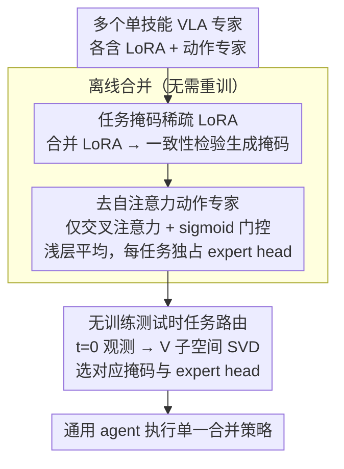

# MergeVLA: Cross-Skill Model Merging Toward a Generalist Vision-Language-Action Agent

**会议**: CVPR 2026  
**arXiv**: [2511.18810](https://arxiv.org/abs/2511.18810)  
**代码**: 无  
**领域**: 机器人/具身智能  
**关键词**: VLA模型合并, 多技能机器人, 稀疏LoRA掩码, 动作专家重设计, 测试时任务路由

## 一句话总结

首次系统诊断 VLA 模型不可合并的两大根因（LoRA 自私参数冲突 + 动作专家自注意力导致的任务耦合），提出 MergeVLA——通过任务掩码稀疏激活 LoRA、去自注意力动作专家、无训练测试时路由，将多个单技能 VLA 专家合并为一个通用 agent，在 LIBERO 上达 90.2% 成功率，真机 SO101 达 90%。

## 研究背景与动机

**领域现状**：Vision-Language-Action (VLA) 模型通过将大规模 VLM 在百万级机器人演示数据上微调，在单任务/单具身设定下表现出色。然而真实世界的通用 agent 需要支持多种技能、多种具身形态和多种环境，自然的想法是把多个独立微调的 VLA 专家合并为一个统一策略。

**核心痛点**：模型合并（Model Merging）在 LLM/VLM 领域已有成熟方法（Task Arithmetic、TIES、DARE 等），但直接应用于 VLA 时，合并后成功率直接降为 **0%**——这在 LLM 合并中从未出现过。

**根因诊断**（本文核心贡献之一）：

**LoRA 自私参数问题**：对 LIBERO 的4个任务做 LoRA 微调后，>75% 的参数属于"自私参数"（仅被单个任务掩码保留），说明不同任务将 LoRA 推向高度不相交的方向。直接平均/符号合并会激活不相关甚至矛盾的参数，破坏共享视觉-语言子空间。

**动作专家架构不兼容**：即使 VLM 完美合并，仅对动作专家做权重平均仍然得到 0% 成功率。根源在于动作专家从零训练、含自注意力层，自注意力使任务信息跨层累积传播，导致深层参数高度任务特化、不可重组。

**切入角度**：既然问题出在"架构天生不可合并"，那就从架构层面设计"天生可合并"的 VLA。

## 方法详解

### 整体框架

MergeVLA 的目标是把多个单技能 VLA 专家合并成一个通用 agent，难点在于 VLA「天生不可合并」——直接套用 LLM 的合并算法成功率会直接归零。它的对策是从架构层面动手，让 VLA 一开始就「为可合并而设计」：基座 VLM 用 Qwen2.5-0.5B，动作专家基于 VLA-Adapter 改造，总参数约 0.7B。整条流程分两段——离线把多个单技能专家合并成一个模型，在线推理时自动判断任务身份。三个组件正好对应三个根因——任务掩码稀疏 LoRA 解决 VLM 里的 LoRA 参数冲突，去自注意力动作专家解决动作专家的架构不兼容，无训练测试时路由解决推理时不知道任务身份的问题。

### 关键设计

**1. 任务掩码稀疏 LoRA：只激活对当前任务有益的合并参数**

对 LIBERO 四个任务做 LoRA 微调后，超过 75% 的参数是「自私参数」——只对单个任务有用，不同任务把 LoRA 推向高度不相交的方向，直接平均或符号合并会激活互相矛盾的参数、破坏共享的视觉-语言子空间。MergeVLA 为每个任务 m 构造二值掩码 $\mathbf{S}_m$，从合并参数里只挑出对任务 m 有益的部分：

$$\Theta_{\text{merge}}^{(m)} = \Theta_0 + \mathbf{S}_m \odot \tau_{\text{merge}}$$

掩码靠参数级一致性检验生成，$\mathbf{S}_m = \mathbb{I}\left[|\tau_m| > \lambda |\tau_{\text{merge}} - \tau_m|\right]$，即只保留任务自身更新幅度大、且方向与合并更新一致的参数（$\lambda=0.6$ 最佳）。它的副作用很妙——被滤掉的 LoRA 参数会回退到预训练权重，反而保护了原始视觉-语言表征不被冲突更新污染。

**2. 去自注意力动作专家：逼动作专家信任 VLM 而非自己从零学**

即便 VLM 完美合并，只对动作专家做权重平均仍然是 0% 成功率。根源在于 VLA-Adapter 的动作专家含 L 个 Transformer 块（自注意力 + 交叉注意力 + FFN）、从零训练，自注意力让任务依赖跨层传播，深层参数高度任务特化、参数距离爆炸式增长，根本无法重组。MergeVLA 索性去掉动作专家的自注意力、只留交叉注意力路径，迫使它依赖 VLM 提供的鲁棒共享特征而非自身从零学到的任务特化表征；同时把 tanh 门控换成 sigmoid，避免 tanh 的负值抑制 VLM 信号、保证 VLM 信息始终被正向传递。合并时按层分治：浅层块参数差异小直接权重平均，深层（通常仅最后 1 块，称 expert head）因回归目标高度特化，保留不合并、每个任务独占一个。这个改动还带来意外收益——在 OOD 场景 LIBERO-Plus 上比 VLA-Adapter 高出 **13.4%**，说明「信任 VLM」比「自主学习」更能继承预训练的鲁棒性。

**3. 无训练测试时任务路由：用 SVD 子空间从初始观测猜出任务身份**

推理时任务身份未知，路由器得从初始观测自动选对应的掩码和 expert head，又不能为此再训一个网络。MergeVLA 纯靠参数子空间分析：对每个候选任务 m 用掩码 $\mathbf{S}_m$ 跑一遍 VLM 拿隐状态，对合并动作专家第 $l$ 块的值投影矩阵做 SVD、取前 $k_r=8$ 个右奇异向量构成主子空间，把各任务隐状态投影上去算响应强度 $r_m$，softmax 选最高分的任务，然后整段 episode 固定用这个掩码和 expert head。这里特意选值投影（V）而非键投影（K）的子空间——V 编码实际行为语义、更容易坍缩到任务特化子空间，K 只定义查询相似性结构，实验里 V 路由 89.7% 远胜 K 的 53.6%。

### 损失函数 / 训练策略

每个任务独立微调（LoRA + 动作专家从零训练），50 条演示/任务，单卡 A6000（48GB）；合并阶段完全离线——合并 LoRA → 计算掩码 → 平均动作专家浅层 → 保留 expert head；路由器无需训练，纯基于 SVD 的参数子空间分析。默认 $l=L$, $k_r=8$, $\lambda=0.6$, $\alpha=1$。

## 实验关键数据

### 主实验：LIBERO 成功率 (%)

| 方法 | Spatial | Object | Goal | Long | 平均 |
|---|---|---|---|---|---|
| OpenVLA（独立微调） | 84.7 | 88.4 | 79.2 | 53.7 | 76.5 |
| VLA-Adapter（独立微调） | 99.6 | 99.6 | 98.2 | 96.4 | 98.5 |
| MergeVLA（独立微调） | 98.0 | 98.6 | 95.0 | 95.0 | 96.7 |
| OpenVLA + TA（全部合并） | 0.0 | 0.0 | 0.0 | 0.0 | 0.0 |
| OpenVLA + TA + 掩码 | 74.2 | 82.6 | 68.8 | 24.0 | 62.4 |
| VLA-Adapter + TA + 掩码 | 0.0 | 0.0 | 0.0 | 0.0 | 0.0 |
| **MergeVLA + TIES + 掩码** | **94.8** | **94.6** | **91.8** | **79.4** | **90.2** |
| MergeVLA + TA + 掩码 | 98.0 | 98.8 | 85.4 | 76.6 | 89.7 |

### OOD 鲁棒性：LIBERO-Plus 成功率 (%)

| 方法 | 背景 | 视角 | 指令 | 光照 | 布局 | 机器人状态 | 噪声 | 平均 |
|---|---|---|---|---|---|---|---|---|
| π₀（独立微调） | 81.4 | 13.8 | 58.8 | 85.0 | 68.9 | 6.9 | 79.0 | 56.3 |
| VLA-Adapter（独立微调） | 76.6 | 36.4 | 73.8 | 71.0 | 70.2 | 37.4 | 57.2 | 59.0 |
| MergeVLA（独立微调） | 92.7 | 62.4 | 75.7 | 92.7 | 73.7 | 46.4 | 74.7 | 72.4 |
| **MergeVLA + TIES 合并** | **85.7** | **50.7** | **66.0** | **84.2** | **68.1** | **30.3** | **66.0** | **62.5** |

### 消融：路由子空间选择（LIBERO 成功率 %）

| 子空间 | Spatial | Object | Goal | Long | 平均 |
|---|---|---|---|---|---|
| 仅 K | 98.0 | 0.0 | 39.6 | 76.6 | 53.6 |
| K & V | 98.0 | 0.0 | 85.8 | 76.6 | 65.1 |
| **仅 V** | **98.0** | **98.8** | **85.4** | **76.6** | **89.7** |

### 真机 SO101 成功率 (%)

| 方法 | Pick & Place | Push | Stack | 平均 |
|---|---|---|---|---|
| 独立微调 | 90.0 | 85.0 | 95.0 | 90.0 |
| MergeVLA + TA | 70.0 | 70.0 | 60.0 | 66.7 |
| **MergeVLA + TIES** | **90.0** | **90.0** | **90.0** | **90.0** |

### 关键发现

- **两个根因缺一不可**：仅加掩码不改架构（VLA-Adapter + TA + S）仍 0%；仅改架构不加掩码同样失败
- **去自注意力带来意外 OOD 收益**：MergeVLA 独立微调就比 VLA-Adapter 在 LIBERO-Plus 上高 13.4%
- **合并后 ≈ 独立微调**：TIES 合并在真机上完全匹配独立微调性能（90% vs 90%）
- **跨具身泛化**：RoboTwin 上 3 种双臂机器人 × 3 种任务，TIES 合并达 70.7%
- **路由精度**：值投影子空间路由远优于键投影（89.7% vs 53.6%）
- **掩码稀疏度**：$\lambda \in [0.6, 0.9]$ 最优，过小导致冲突参数涌入，过大丢失有用信息

## 亮点与洞察

1. **"VLA 不可合并"的系统诊断**——首次揭示 LoRA 自私参数（>75%）和自注意力任务耦合两个独立根因，诊断本身就是重要贡献
2. **架构即可合并性**——不是设计更好的合并算法，而是从架构层面消除不可合并性，思路优雅且可推广到其他多模态领域
3. **去自注意力的意外收益**——原本为了可合并性做的改动，却带来了更好的 OOD 泛化，说明让动作专家"信任 VLM"比"自主学习"更鲁棒
4. **无训练路由**——用 SVD 主成分做任务判别，既优雅又实用，无需额外训练数据或辅助网络
5. **从仿真到真机全链路验证**——LIBERO / LIBERO-Plus / RoboTwin / 真机 SO101 四重验证，覆盖跨任务、跨环境、跨具身三个维度

## 局限与展望

1. **无法在线增量合并**：新任务加入需重新计算掩码和合并，不支持即插即用
2. **VLM 规模受限**：仅验证了 Qwen2.5-0.5B，更大模型（如 7B+）是否同样适用待探索
3. **Expert head 数量线性增长**：每个任务保留独立的 expert head，任务数多时参数冗余
4. **去自注意力可能限制需要长时序推理的任务**：当前仅测试了相对短时序的桌面操作
5. **路由依赖初始观测**：仅用 t=0 的观测做路由，若初始帧不具区分性可能失败
6. **改进方向**：在线增量掩码更新；可学习的轻量路由器替代 SVD；大规模 VLM 验证；expert head 压缩或共享

## 相关工作与启发

- **vs Task Arithmetic / TIES**：这些方法对 LLM/VLM 有效但对 VLA 完全失败（0%），MergeVLA 通过架构改造使它们重新可用
- **vs 联合训练多任务 VLA**（OpenVLA、π₀）：联合训练需全部数据重训，MergeVLA 只需离线合并权重，且不访问原始训练数据
- **vs VLA-Adapter**：自注意力动作专家导致不可合并，MergeVLA 用交叉注意力替代并证明效果更好
- **vs ReVLA**：ReVLA 用合并解决视觉遗忘问题，MergeVLA 用合并实现多技能能力，目标不同
- **启发**：VLA 领域的模型合并远未成熟，架构设计对后期可合并性有决定性影响——这个教训对所有多模态模型的模块化设计都有参考价值

## 评分

- 新颖性: ⭐⭐⭐⭐⭐ 首次系统解决 VLA 合并问题，诊断+设计思路优雅
- 实验充分度: ⭐⭐⭐⭐⭐ 3 仿真基准 + 真机 + 大量消融 + OOD 评估
- 写作质量: ⭐⭐⭐⭐⭐ 诊断→方案→验证逻辑严密，图表清晰
- 价值: ⭐⭐⭐⭐⭐ 为具身 AI 多技能扩展提供了可行的轻量化路径

<!-- RELATED:START -->

## 相关论文

- [\[CVPR 2026\] Cross-Hand Latent Representation for Vision-Language-Action Models](cross-hand_latent_representation_for_vision-language-action_models.md)
- [\[CVPR 2026\] Evo-1: Lightweight Vision-Language-Action Model with Preserved Semantic Alignment](evo-1_lightweight_vision-language-action_model_with_preserved_semantic_alignment.md)
- [\[CVPR 2026\] Mantis: A Versatile Vision-Language-Action Model with Disentangled Visual Foresight](mantis_a_versatile_vision-language-action_model_with_disentangled_visual_foresig.md)
- [\[CVPR 2026\] QuantVLA: Scale-Calibrated Post-Training Quantization for Vision-Language-Action Models](quantvla_scale-calibrated_post-training_quantization_for_vision-language-action_.md)
- [\[CVPR 2025\] ShowUI: One Vision-Language-Action Model for GUI Visual Agent](../../CVPR2025/robotics/showui_one_vision-language-action_model_for_gui_visual_agent.md)

<!-- RELATED:END -->
