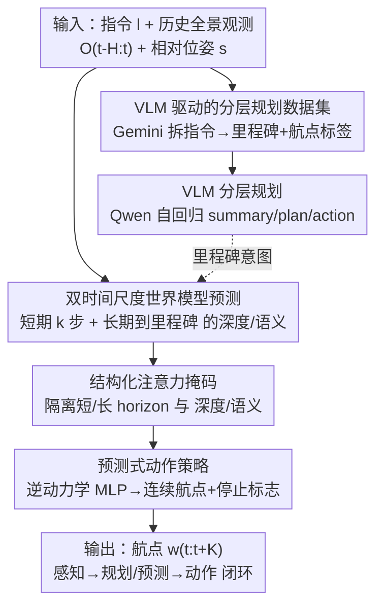

# NavForesee: A Unified Vision-Language World Model for Hierarchical Planning and Dual-Horizon Navigation Prediction

**会议**: CVPR 2026  
**论文**: [CVF Open Access](https://openaccess.thecvf.com/content/CVPR2026/html/Liu_NavForesee_A_Unified_Vision-Language_World_Model_for_Hierarchical_Planning_and_CVPR_2026_paper.html)  
**代码**: 待确认  
**领域**: 机器人 / 具身导航 / 视觉语言导航  
**关键词**: 视觉语言导航, 世界模型, 分层规划, VLM, 双时间尺度预测

## 一句话总结
NavForesee 把"高层语言规划"和"世界模型未来预测"统一进同一个 Qwen2.5-VL-3B 里——一边把长指令拆成里程碑子目标并跟踪进度，一边在隐空间预测短期（k 步）和长期（到下个里程碑）的深度/语义特征，再用一个 MLP 把这些"想象的未来"转成连续航点动作，在 R2R-CE 上达到 66.2% SR / 78.4% OSR，只用公开数据就接近 SOTA。

## 研究背景与动机

**领域现状**：视觉语言导航（VLN）让一个具身智能体读懂自然语言指令、感知周围环境、生成一连串动作走到目标点。大规模预训练 VLM 出现后，VLN 主流分两派：一派把 VLM 当**高层规划器**，自回归生成动作计划或文字轨迹；另一派把 VLM 当**端到端策略**，直接把观测映射成动作。还有一类"快慢系统"双系统架构，用慢系统做高层推理、快系统做低层执行。

**现有痛点**：长程任务（long-horizon）里这些 agent 频繁掉链子——走着走着就"迷路"、看不懂观测、做出错误决策，失败率很高。论文把根因归结为两点：（1）**规划与记忆缺陷**：可部署的 VLM 上下文窗口和规划能力有限，在导航环境里容易"迷失"；（2）**缺乏预见性**：现有模型本质是**反应式**的，看到什么才动什么，无法预判未来环境状态去主动指导动作。

**核心矛盾**：增强推理的那一派（CoT、精标数据）和构建世界模型预测未来的那一派，**长期是脱节的**。纯 VLM-centric 的 agent 会出现"语义幻觉"——计划脱离了视觉现实；而没有语言引导的世界模型会"语义漂移"——预测渐渐偏离指令目标。两条腿各走各的，谁也没把对方的能力补上。

**切入角度**：作者从人类导航的方式得到启发——人不是连续地做低层决策，而是**以里程碑为中心的分层过程**：朝着一连串有意义的地标走，基本忽略地标之间路径的细枝末节。既然如此，人造智能体也应该这么干。

**核心 idea**：VLM 规划与预测性预见**不该分家，而应在一个 VLM 内统一、互相强化**。NavForesee 让同一个 VLM 同时干两件事——分层语言规划（把指令拆成里程碑子目标）+ 双时间尺度世界模型预测（想象短期动态 + 长期里程碑），形成一个 感知→规划/预测→动作 的内部反馈闭环。

## 方法详解

### 整体框架

NavForesee 以 **Qwen2.5-VL-3B-Instruct** 为骨干，把两套互补能力塞进同一个模型：**VLM 分层规划** 和 **世界模型双时间尺度预测**，对应两个训练目标（分层规划训练 + 世界模型训练），通过**交错喂两类训练数据**统一优化，让模型既保住多模态规划能力、又长出生成视觉特征的能力。

问题设定上，时刻 $t$ 智能体拿到全景 RGB 观测 $o_t$，维护过去 $H$ 帧记忆 $O_{t-H:t-1}$，策略要输出 $K$ 个未来航点 $w_{t:t+K}\in\mathbb{R}^{K\times 5}$，每个航点 $w_t=[x_t,y_t,\sin\theta_t,\cos\theta_t,c_t]$——平面坐标、朝向角（正弦余弦编码）、以及一个二值停止标志 $c_t$。除非所有预测动作都标了停，智能体就沿生成的航点持续移动。

整条 pipeline 这么转：先用 **Gemini 2.5 Pro 离线把 R2R-CE/RxR-CE 的长指令拆成里程碑 + 航点级标签**，造出分层规划数据集；训练时，**分层规划分支**直接拿文字数据喂 Qwen 做自回归（用原生编码器，不改结构），让模型学会输出 `<think>
...
<plan>...</plan></think>` 这种带进度总结和下一步计划的结构化文本；**世界模型分支**则新增一个位姿编码器 + 一组"梦境查询"（dream queries，含短/长期的深度与语义子查询）+ 动作查询，把它们拼到多模态输入里，经过一个**结构化注意力掩码**后，喂给轻量卷积解码器吐出环境特征预测、喂给 MLP 头吐出导航动作。最后训练时用一个损失同时约束深度、语义、动作三件事，把规划→预测→动作的环闭上。

### 关键设计

**1. VLM 驱动的分层规划数据集：把长指令离线"嚼碎"成里程碑 + 航点标签**

VLN 的长程失败很大程度上是因为模型缺少"进度感"——不知道指令走到哪一步、下一个该奔哪。作者没法靠人手标海量轨迹，于是用 **Gemini 2.5 Pro 当标注器**：从公开的 R2R-CE（1 万 episode）和 RxR-CE（2 万 episode）出发，每个 episode 配一个定制 prompt 模板（规定角色、任务、分析步骤、强制输出格式），让 Gemini 把长指令**系统地拆成一串顺序子指令**，同时挑出一条**稠密的关键帧链**作为导航里程碑；遇到长距离或急转弯，强制插入中间里程碑保证视觉连续。每个标注 episode 标准化输出三件套：里程碑帧索引、已完成子指令的文字描述、即将执行的计划指令。后处理会过滤不完整标注、纠正 VLM 输出里的逻辑矛盾、把 episode 切成多个导航段，并在里程碑之间采样航点，给每个航点配一个规划标签——(1) 导航总结（已完成子指令）、(2) 未来计划（下一条指令）、(3) 语言动作（forward / left / right / stop）。这套管线从 RxR-CE 产出约 130 万、R2R-CE 约 20 万训练样本；作者还发现直走样本占 61.79%（转向 $<30^\circ$），于是**下采样过多的直走样本**做类别平衡。论文提到最后里程碑与终点不对齐的样本被剔除（约 16.7%）。这一步本质是把"分层进度跟踪"这件难标的事，外包给一个强 VLM 离线生成，给下游真正要训练的小模型提供了带画面、带进度、带动作的稠密监督。

**2. 双时间尺度世界模型预测：在隐空间"想象"短期动态与长期里程碑，而非渲染像素**

现有导航世界模型有两个坑：依赖大量轨迹采样评估的动作条件模型算力吃不消、没法部署；而且大多只学环境动态，不和 VLM 的语言推理结合。NavForesee 的世界模型刻意**避开昂贵的像素级生成**，转而预测一组紧凑的高层特征——深度、DINOv2、SAM 特征（思路同 DreamVLA），既抓住几何又抓住语义。具体地，引入两组可学习的梦境查询：短期 $Q_S\in\mathbb{R}^{L\times d}$ 和长期 $Q_L\in\mathbb{R}^{L\times d}$，分别对齐不同 horizon 的预测；再通过编码器 $h(\cdot)$ 把每帧的位姿-朝向状态 $s_{t-H:t}$ 编码进来增强时空相关性。这些查询和指令嵌入 $l$、观测序列 $O_{t-H:t}$ 拼在一起喂 Qwen 骨干 $f(\cdot)$，靠**因果注意力**保证自回归：先出短期、长期再以短期为条件：

$$E_S = f(l, O_{t-H:t}, h(s_{t-H:t})\,|\,Q_S),\quad E_L = f(l, O_{t-H:t}, h(s_{t-H:t}), Q_S\,|\,Q_L)$$

轻量解码器 $D$ 把 $E_S, E_L$ 翻成预测深度 $d_p$ 和高层语义 $c_p$。短期预测对应**固定 horizon $k$**，长期预测则**自适应外推 $M_t$ 步**——$M_t$ 不是预设的，而是取决于智能体到下个里程碑的进度：

$$p_{t+k}=D(E_S)=[d_p(t),c_p(t)],\quad p_{t+M_t}=D(E_L)=[d_p(t+M_t),c_p(t+M_t)]$$

妙在长期 horizon $M_t$ 的"该看多远"是由规划任务隐式喂进来的：子指令在分层规划里被隐式学到，**planning-aware 的隐状态自然编码了当前子目标意图**，而这种对齐正是靠规划与预测任务**交错训练、共享表征**实现的。这就把"语言规划"和"未来预测"真正缝在了一起——长期预测知道要朝哪个里程碑想象，短期预测保证局部避障和环境动态感知。

**3. 结构化注意力掩码：在一个序列里隔离短/长 horizon 与 深度/语义，防止串味**

把这么多查询（短期深度、短期语义、长期深度、长期语义、动作）塞进同一个注意力序列，最大的风险是不同类型信息互相污染。作者据此手工设计了一个**结构化注意力掩码**：长期预测天然依赖短期预测、把它当指引以保证时间连贯，所以允许长期 attend 短期；深度查询与语义查询之间的相互注意力被**屏蔽**，防止跨模态泄漏或特征乱混；而**动作查询能 attend 到所有可用信息**——过去上下文 + 两个 horizon 的梦境查询，从而做出全局一致的导航决策。这套掩码是让"双 horizon × 双模态 + 动作"在单序列里各司其职、又在该协同处协同的关键。

**4. 预测式动作策略：用逆动力学把"想象的未来"翻译成航点**

给定两个时序状态 $o_t, o_{t+1}$，中间动作 $\hat a(t)$ 可以由逆动力学推断。NavForesee 借这个原理学一个动作策略：条件于指令 $l$、历史观测 $O_{t-H:t}$、以及世界模型生成的双 horizon 预测特征 $E_S, E_L$。它再引入一个可学习的**动作查询 $Q_a$**，拼进梦境查询和多模态输入，经骨干 $f$ 得到动作嵌入 $E_a$，再投影到动作空间：

$$E_a=f(l,O_{t-H:t},h(s_{t-H:t}),Q_S,Q_L\,|\,Q_a),\quad \hat a_{t:t+k}=M_{inv}(E_S,E_L\,|\,E_a)$$

这里动作策略 head 实现上**只是一个 MLP**（$M_{inv}$ 为逆动力学模型）。关键点在于：动作嵌入 $E_a$ 虽然由骨干抽取，但动作预测**主要条件在双 horizon 预测特征上**——也就是说决策是被"过去观测 + 预测出的环境动态"共同驱动的，而不只是反应式地看当前帧。至此 感知→规划/预测→动作 的闭环被真正闭上。

### 损失函数 / 训练策略

VLM 规划训练单独以自回归方式 finetune Qwen2.5-VL，先建立一个能做分层导航的强规划器。世界模型预测 + 动作策略学习则联合训练三个任务：深度预测误差 $L_d$ 用 Scale-invariant Logarithmic Loss（SiLogLoss）在像素级度量；语义特征误差 $L_c$ 和动作误差 $L_a$ 用 MSE。总损失为

$$L = \alpha L_d + \beta L_c + L_a$$

其中 $\alpha, \beta$ 是平衡各任务的权重超参（⚠️ 原文用希腊字母表示，此处以 $\alpha,\beta$ 代替，以原文为准）。

## 实验关键数据

在 Habitat 模拟器上、R2R-CE 与 RxR-CE 数据集评测。R2R-CE 基于 Matterport3D，提供细粒度逐步指令，转向最小 $15^\circ$、水平视场 $90^\circ$；RxR-CE 约 12.6 万条人工多语种指令、轨迹更复杂，转向最小 $30^\circ$、视场更窄（$79^\circ$），更考验深思熟虑的规划。指标：成功率 SR、Oracle 成功率 OSR/OS、按路径长度加权的成功率 SPL、导航误差 NE。**全程只用 R2R-CE + RxR-CE 公开数据训练**，而很多对手用了大规模额外数据。

### 主实验

| 数据集 | 方法 | NE↓ | OSR↑ | SR↑ | SPL↑ |
|--------|------|------|------|------|------|
| R2R-CE Val-Unseen | HNR* | 4.42 | 67.0 | 61.0 | 51.0 |
| R2R-CE Val-Unseen | NaVILA | 5.22 | 62.5 | 54.0 | 49.0 |
| R2R-CE Val-Unseen | StreamVLN | 4.98 | 64.2 | 56.9 | 51.9 |
| R2R-CE Val-Unseen | CorrectNav | 4.24 | 67.5 | 65.1 | **62.3** |
| R2R-CE Val-Unseen | **NavForesee (Ours)** | **3.94** | **78.4** | **66.2** | 59.7 |
| RxR-CE Val-Unseen | HNR* | 5.50 | 56.3 | - | 46.7 |
| RxR-CE Val-Unseen | CorrectNav | 4.09 | - | **69.3** | **63.3** |
| RxR-CE Val-Unseen | **NavForesee (Ours)** | 4.20 | - | 66.3 | 53.2 |

R2R-CE 上 NavForesee 拿到最低 NE（3.94 m）、最高 OSR（78.4%）和最高 SR（66.2%）。论文称相比 SOTA 把 SR 提升 1.1%、OSR 提升 10.9%、NE 降低 0.3 m——OSR 的大幅领先说明世界模型预测帮助 agent 更好地探索、避障、捕捉环境动态。SPL 上略逊于 CorrectNav（59.7 vs 62.3），RxR-CE 上整体也略逊（SR 66.3 vs 69.3），作者归因于 RxR-CE 环境更复杂、且对手用了更大规模/更多样的数据，泛化更强；但 NavForesee 在两个数据集上都拿下最高 OSR。

### 消融实验

| 配置 | VLM规划 | 长期预测 | 短期预测 | SR↑ | OSR↑ | NE↓ | SPL↑ |
|------|:---:|:---:|:---:|------|------|------|------|
| 1 Full | ✓ | ✓ | ✓ | **66.2** | **78.4** | **3.94** | **59.7** |
| 2 w/o 短期 | ✓ | ✓ | | 48.8 | 75.5 | 5.61 | 39.4 |
| 3 仅 VLM 规划 | ✓ | | | 47.8 | 75.3 | 5.77 | 36.1 |
| 4 w/o VLM 规划 | | ✓ | ✓ | 58.6 | 76.4 | 4.47 | 50.1 |
| 5 全去（基线） | | | | 52.6 | 67.4 | 5.53 | 46.7 |

去掉任一关键模块都明显掉点。去掉 VLM 分层规划（配置 4），SR 从 66.2 跌到 58.6、SPL 掉约 9.6 点，说明显式的指令分解与进度跟踪对高效导航很关键（⚠️ 正文称"SPL 下降超过 16 点"与表中 59.7→50.1 的差值不一致，以原文表格为准）。去掉长期预测（配置 2 保留短期、配置 3 仅 VLM）后 SR 明显回落、NE 升高，凸显里程碑预见在长轨迹上的战略指引作用。三模块全去（配置 5）导航质量最差，OSR 只剩 67.4。

### 短期 horizon 消融

| 短期 horizon | SR↑ | OSR↑ | NE↓ | SPL↑ |
|------|------|------|------|------|
| k=5 | **66.2** | 78.4 | **3.94** | **59.7** |
| k=4 | 64.1 | **78.6** | 4.08 | 54.9 |
| k=3 | 56.5 | 77.2 | 4.85 | 48.5 |

短期 horizon $k$ 从 3 调到 5，**$k=5$（与动作空间航点长度匹配）最优**——SR 56.5→66.2 单调上升，说明短期预测窗口对齐动作步长很重要。

### 关键发现
- **VLM 分层规划是掉点最狠的模块**：单看消融，去掉它（配置 4）SR 掉 7.6 点、SPL 掉近 10 点；而只保留 VLM 规划（配置 3）SR 仅 47.8，说明规划和预测谁都离不开谁，二者协同才有 66.2。
- **OSR 全程领先但 SPL 偏弱**：OSR 高说明 agent 更容易"到过"目标附近（探索/想象帮了忙），但 SPL 略逊于 CorrectNav 暗示路径效率还有提升空间——想象未来帮你找到目标，但不一定走得最短。
- **隐空间预测够用**：定性结果（Fig. 4/5）显示预测的深度图虽然偏粗，但保住了全局几何与空间布局；语义预测（DINOv2 + 预训练分割头可视化）和 GT 高度对齐，甚至能从"瞥一眼房间"的少量观测里推断出床的形状位置和房间深度分布。

## 亮点与洞察
- **把"规划"和"世界模型"塞进同一个 VLM**：以往两派各搞各的，NavForesee 用共享表征 + 交错训练让分层规划的隐状态去**隐式决定**长期预测该看多远（自适应 horizon $M_t$），这是"语言引导预测、预测反哺动作"真正缝合的点，而不是简单拼两个模块。
- **结构化注意力掩码是个可复用的 trick**：当你要在单个 Transformer 序列里同时跑多种异质查询（短/长 horizon × 深度/语义 × 动作）时，靠手工掩码强制信息流向（长期看短期、深度语义互斥、动作看全部），能干净地避免串味——这套思路可迁到任何"多任务查询挤一个序列"的设定。
- **隐空间高层特征预测代替像素生成**：预测深度/DINOv2/SAM 特征而非渲染像素，既省算力又保住几何语义，让世界模型在资源受限的具身 agent 上变得可部署——这是相对 Sora 式视频生成世界模型的务实选择。
- **里程碑式分层 = 人类导航直觉**：朝地标走、忽略中间细节，这个先验直接落到数据构建（Gemini 标里程碑）和模型机制（长期预测对齐里程碑）两层，逻辑自洽。

## 局限与展望
- **RxR-CE 泛化偏弱**：作者承认在更复杂的 RxR-CE 上略逊 SOTA，且只训公开数据，泛化不如用大规模数据的对手。
- **SPL 不是最优**：能"找到"目标（OSR 高）但路径效率（SPL）逊于 CorrectNav，说明预测帮了探索却没充分优化路径长度。
- **预测精度受监督所限**：深度图偏粗，受 R2R-CE/RxR-CE 像素级监督质量限制；语义靠预训练分割头可视化，真实下游收益主要靠高层特征而非细节。
- **依赖强 VLM 离线标注**：分层规划数据集靠 Gemini 2.5 Pro 生成，标注质量和成本受限于这一外部模型；剔除了 16.7% 终点不对齐样本也意味着数据有筛选偏差。
- **可改进**：把 SPL 纳入训练目标（如加路径效率奖励）、引入在线 RL 对齐规划与执行、或把预测特征反过来纠正规划，进一步收紧闭环。

## 相关工作与启发
- **vs HNR / NavMorph（导航世界模型）**：HNR 预测多级语义特征而非像素、NavMorph 用 RSSM 在隐空间建模动态——都聚焦"学环境动态"，但**没把预测和 VLM 的高层语言推理结合**。NavForesee 的核心差异正是把语言规划缝进世界模型，避免世界模型"语义漂移"。
- **vs 纯 VLM 规划派（Instruct-Nav / 文字轨迹生成）**：这派推理强但逐步生成易误差累积、推理慢，且计划可能脱离视觉现实（语义幻觉）。NavForesee 用预测特征给规划提供视觉锚点。
- **vs 快慢双系统（Fast-and-Slow）**：双系统靠 RL 对齐慢推理和快执行，但长 CoT 不一定符合环境时空现实、频繁精细推理也未必必要。NavForesee 走里程碑式高层语义计划，更贴近人类导航。
- **vs DreamVLA**：借鉴其"预测深度 + DINOv2 + SAM 紧凑高层特征"的思路，但把它专门适配到双 horizon 导航预测 + 自适应里程碑 horizon。

## 评分
- 新颖性: ⭐⭐⭐⭐⭐ 首次把分层语言规划与双时间尺度世界模型预测统一进单个 VLM，自适应里程碑 horizon 设计巧妙。
- 实验充分度: ⭐⭐⭐⭐ R2R-CE/RxR-CE 双数据集 + 模块消融 + horizon 消融较完整，但只测两个 benchmark、训练细节放在补充材料。
- 写作质量: ⭐⭐⭐⭐ 动机和方法叙述清晰，配图详尽；个别数字（SPL 下降幅度）正文与表格略有出入。
- 价值: ⭐⭐⭐⭐ 只用公开数据接近 SOTA、隐空间预测可部署，对具身导航的"预见性 agent"方向有实际推动。

<!-- RELATED:START -->

## 相关论文

- [\[CVPR 2026\] Motus: A Unified Latent Action World Model](motus_a_unified_latent_action_world_model.md)
- [\[CVPR 2026\] FantasyVLN: Unified Multimodal Chain-of-Thought Reasoning for Vision-and-Language Navigation](fantasyvln_unified_multimodal_chain-of-thought_reasoning_for_vision-and-language.md)
- [\[ICML 2026\] Dual-Stream Diffusion for World-Model Augmented Vision-Language-Action Model](../../ICML2026/robotics/dual-stream_diffusion_for_world-model_augmented_vision-language-action_model.md)
- [\[CVPR 2026\] Bridging the 2D-3D Gap: A Hierarchical Semantic-Geometric Map for Vision Language Navigation](bridging_the_2d-3d_gap_a_hierarchical_semantic-geometric_map_for_vision_language.md)
- [\[CVPR 2026\] D3D-VLP: Dynamic 3D Vision-Language-Planning Model for Embodied Grounding and Navigation](d3d-vlp_dynamic_3d_vision-language-planning_model_for_embodied_grounding_and_nav.md)

<!-- RELATED:END -->
