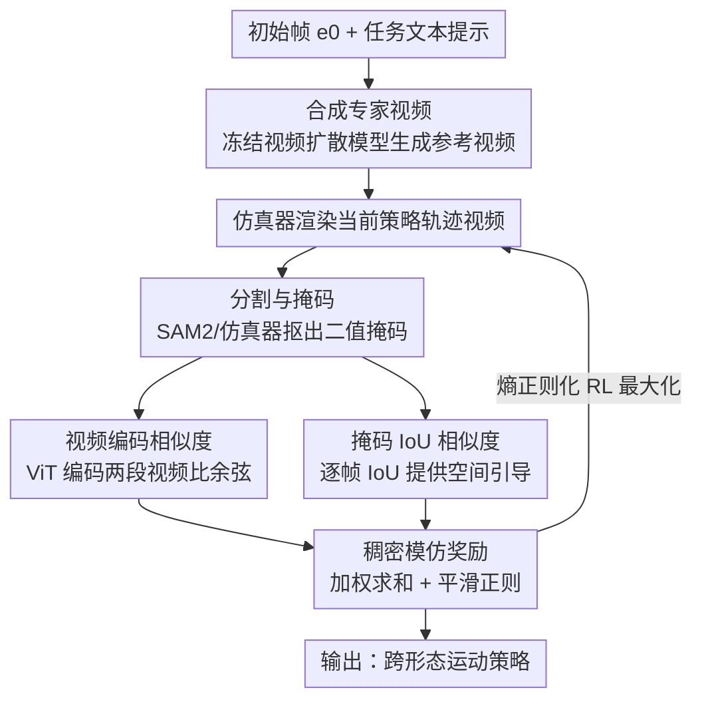

# NIL: No-data Imitation Learning

**会议**: CVPR 2026  
**论文**: [CVF Open Access](https://openaccess.thecvf.com/content/CVPR2026/html/Albaba_NIL_No-data_Imitation_Learning_CVPR_2026_paper.html)  
**代码**: https://nil.is.tue.mpg.de （项目页，含视频与代码）  
**领域**: 机器人 / 具身智能  
**关键词**: 模仿学习, 视频扩散模型, 物理仿真, 无数据, 运动技能

## 一句话总结
NIL 用预训练视频扩散模型从「一张初始帧 + 一句任务描述」生成一段参考视频，再在物理仿真器里训练 RL 策略去模仿这段视频——奖励完全来自「视频编码相似度 + 分割掩码 IoU」而非判别器，从而在**不收集任何 3D 动捕数据**的前提下，让人形/四足等多种机器人学会走路、坐、吊单杠等全身技能。

## 研究背景与动机
**领域现状**：让形态各异的智能体（人形、四足、动物）学会物理上合理的运动技能，主流有两条路。强化学习（RL）在物理仿真器里训练，行为天然满足物理规律，但每个「任务 × 形态」都要手工设计奖励函数，奖励没调好就会学出怪异行为。模仿学习（IL）绕开奖励工程，直接从专家示范学，但它依赖高质量 3D 数据——精确的关节位置和速度。

**现有痛点**：高质量 3D 动捕数据对非人形机器人和动物来说极其稀缺、昂贵，甚至根本采集不到。这把 IL 死死卡在「有动捕的少数形态」上，无法泛化到奇形怪状的本体。

**核心矛盾**：IL 想要免奖励工程，但代价是需要 3D 专家数据；而最缺数据的恰恰是最需要这套方法的非常规形态。与此同时，视频扩散模型已经能凭文本生成各种形态（从人到蚂蚁）的逼真视频——但这些视频「看起来合理、物理上不合理」，没有动作标注，还存在 2D→3D 的歧义，没法直接拿来学技能。

**本文目标**：能否用「按需生成的 2D 视频」彻底替换掉「人工采集的 3D 动捕」，同时还保证学到的技能物理上站得住？

**切入角度**：作者的关键洞察是把两种能力分工——**视频扩散模型提供视觉引导（动作长什么样），物理仿真器提供物理约束（动作怎样才合法）**。生成视频不必物理正确，因为仿真器会把不合理的运动「修」回物理可行的范围。

**核心 idea**：用「生成视频 + 物理仿真」替代「动捕数据 + 判别器」，把生成视频转成一个无判别器的稠密模仿奖励（视频嵌入相似度 + 掩码 IoU），在仿真器里用 RL 直接最大化它，实现真正「零数据」的模仿学习。

## 方法详解

### 整体框架
NIL 的目标：给定一个技能 $s_i$ 和一个本体 $b_j$，学到策略 $\pi_{s_i,b_j}$ 让仿真智能体完成该技能。整套流程分两阶段串行：**阶段一生成参考视频，阶段二在仿真器里训练策略去模仿它**。阶段一渲染机器人初始帧、抠掉背景，送进冻结的视频扩散模型，配上一句 `"The {bj} agent is {si}, camera follows the agent."` 的提示词，生成一段相机跟随的参考视频。阶段二把仿真器里 RL 智能体当前轨迹也渲染成视频，逐帧和参考视频比相似度，相似度（加平滑正则）就是奖励，用熵正则化 RL 优化策略。整个奖励计算分三步：分割掩码 → 视频编码 → 相似度计算。

### 关键设计

**1. 合成专家数据：用视频扩散模型即时生成示范，彻底去掉 3D 动捕依赖**

这是 NIL 解决「非常规形态无数据」的根。传统 IL 需要为每个本体准备带精确关节信息的 3D 动捕轨迹，而 NIL 直接用冻结的预训练视频扩散模型 $D$，输入仿真器在固定起始位姿渲染的初始帧 $e_0$ 和一句任务文本提示 $p_{s_i,b_j}$，输出一段彩色视频 $D(p_{s_i,b_j}, e_0) = F_{s_i,b_j} \in \mathbb{R}^{n\times H\times W\times 3}$。因为示范是「按需生成、条件在本体初始状态上」的，所以任何「任务 × 本体」组合都能拿到示范，不再受动捕可得性约束。作者坦承生成视频物理上常常不合理，但这正是分工设计的关键——视觉合理就够了，物理由后面的仿真器兜底。

**2. 无判别器的视频 + 掩码双路奖励：把 2D 视频转成稠密、稳定的模仿信号**

这是把「一段 2D 视频」变成「可优化奖励」的核心机制，也是论文取名 discriminator-free 的来源。对抗式 IL（GAIL/AMP 等）靠判别器学奖励，但判别器容易过拟合、训练不稳。NIL 改成直接比相似度，分两路互补：

- **视频编码相似度（时序+语义引导）**：把参考视频 $F$ 和仿真渲染视频 $E$ 都分割抠出身体（生成视频用 SAM2 加初始帧掩码提示，仿真视频由仿真器直接给掩码），再各自构造 $n_T$ 帧片段送进预训练视频 ViT 编码器 $T$（论文用 TimeSformer），取最后隐状态得到嵌入 $z^F_t, z^E_t$。奖励是两者余弦相似度 $S_{v,t} = \frac{z^F_t \cdot z^E_t}{\|z^F_t\|\,\|z^E_t\|}$，范围 $[-1,1]$。它捕捉的是整段运动的语义和时序，但缺乏逐帧精确的空间引导。

- **掩码 IoU 相似度（空间引导）**：单靠视频级相似度太「整体」，于是再算两段视频二值掩码逐帧的交并比

$$S_{M,t} = \frac{\sum_{k,l} M^F_t(k,l)\cdot M^E_t(k,l)}{\sum_{k,l} M^F_t(k,l) + M^E_t(k,l) - M^F_t(k,l)\cdot M^E_t(k,l)}$$

范围 $[0,1]$，提供帧对齐的空间位置反馈。两路一拍即合：视频编码给时序/语义、掩码 IoU 给空间，合起来无需判别器就能形成稳定的模仿信号。

**3. 物理正则 + 熵正则化 RL：仿真器兜底物理合理性，直接最大化奖励**

生成视频不物理，靠这一层把策略约束回物理可行域。正则项 $P_t = P_{J,t}+P_{A,t}+P_{V,t}+P_{F,t}+P_{S,t} \le 0$ 分别惩罚关节力矩、动作增量、角速度、脚滑、躯干倾斜，都是机器人控制里的标准项，保证动作平滑、不抖、不违反物理。最终每帧奖励是三者加权和 $R_t = \zeta S_{v,t} + \beta S_{M,t} + \eta P_t$。与「判别器 + RL」的 SOTA IL 不同，NIL 直接用熵正则化 RL（实现用 BRO）最大化期望折扣回报 $\max_\pi \mathbb{E}[\sum_t \gamma^t (R_t + \alpha H(\pi(\cdot|o_t)))]$，熵项鼓励探索，去掉了对抗训练，流程更简单稳定。观测 $o_t$ 是关节位置和速度，动作 $a_t$ 是关节力矩。

### 损失函数 / 训练策略
奖励权重在所有本体上固定为 $\zeta=\beta=\eta=1$，视频编码器固定用 Kinetics-400 预训练的 TimeSformer，片段长度 $n_T=8$，输入分辨率 224×224，控制频率 100 Hz。一个工程细节是**时序对齐**：仿真渲染是 100 Hz，而生成视频通常只有 24–30 Hz，作者用 RIFE 把生成视频 4× 插帧后再做模仿学习，避免帧率不匹配破坏逐帧对齐。

## 实验关键数据

### 主实验
在多种机器人本体的运动任务上对比，NIL 仅用**一段生成视频**，而所有基线（AMP/GAIfO/BCO）都用 LocoMujoco 的 25 条动捕轨迹训练（含完美关节对应）：

| 任务（环境奖励 ↑） | NIL (ours) | AMP | GAIfO | BCO | Expert |
|--------|------|------|------|------|------|
| Unitree H1（人形） | 396.1 | 393.5 | 347.8 | 72.0 | 400 |
| Talos（人形） | **352.8** | 231.1 | 204.4 | 26.6 | 400 |
| Unitree G1（人形） | 356.9 | **393.4** | 353.1 | 21.2 | 400 |
| Unitree A1（四足） | **290.3** | 286.9 | 260.8 | 30.3 | 300 |

NIL 在 H1、A1 上追平 AMP 且步态更自然平衡；在复杂形态 Talos 上明显超过所有基线；只有 G1 上 AMP 更稳。全身操作任务（坐椅、吊单杠、平衡板）上，NIL 与 RL 上界基线都达到 100% 成功率，归一化奖励持平——而 NIL 没用任何任务奖励工程或动捕数据。

### 消融实验
在 Unitree H1 走路任务上拆解奖励各项（环境奖励 ↑，Expert=400）：

| 配置 | Env. Reward | 说明 |
|------|---------|------|
| NIL（全部组件） | 396.1 | 完整模型，走得又快又稳 |
| w/o 正则 | 382.4 | 运动变抖 |
| w/o IoU | 381.4 | 行为轻微扭曲 |
| w/o 视频相似度 | 387.3 | 走得更慢且抖 |
| only 正则 | 363.6 | 走不直、腿部动作大而次优 |
| only IoU | 328.4 | 无法持续向前走 |
| only 视频相似度 | 369.6 | 抖且走到一半停下 |

### 关键发现
- **单项都不够，组合才稳**：只留任一项奖励都明显掉点（only IoU 最差 328.4），三项互补才接近 Expert——视频相似度给时序语义、IoU 给空间、正则给平滑，缺一不可。
- **参考视频「视觉合理」比「物理合理」更重要**：对比 Kling/Pika/Runway/Sora/SVD 五种生成器，Kling 视觉最逼真、NIL 表现最好；即使 Pika 物理合理性差，只要视觉可信，模仿分仍高。作者用生成视频与动捕视频的 LPIPS 度量视觉合理性，发现它与 NIL 性能正相关——因为物理由仿真器修正，生成器只需把「动作长什么样」说清楚。
- **生成器越强 NIL 越强**：Kling v1.6 比 v1.0 步态明显更自然平衡，说明 NIL 能随视频扩散模型进步「免费」受益。

## 亮点与洞察
- **分工解耦**最巧妙：把「动作语义」交给生成模型、「物理合法」交给仿真器，于是生成视频不物理也无所谓——这一刀切开了「视频扩散物理不可信」这个长期障碍，让生成视频第一次能直接当模仿奖励用。
- **无判别器的稠密奖励**值得复用：用「预训练视频编码器余弦 + 掩码 IoU」替代对抗判别器，既给了时序又给了空间引导，绕开了对抗训练不稳定，这套「双路感知相似度当奖励」的思路可迁移到其它从视频学控制的任务。
- 「视觉合理性 > 物理合理性」的实证发现很反直觉但符合其设计逻辑，对「该选哪个生成器」给了可操作的判据（看 LPIPS 视觉相似度而非物理评测）。

## 局限与展望
- **性能上限被生成视频质量锁死**：作者自己承认 NIL 表现与生成视频质量强绑定，复杂形态（如 Talos、G1）上仍不如理想，生成器画不好就学不好。
- **单段视频 + 单技能**：每次只从一段参考视频学一个技能-本体对，尚未展示长程、多技能组合或物体交互等更复杂任务（作者列为未来方向）。
- **依赖闭源生成器与固定相机**：最佳结果用的是闭源 Kling，相机固定跟随；对相机设置、插帧的鲁棒性放在补充材料，实际部署的可控性存疑。
- 改进思路：把 NIL 当**预训练**，再用少量动捕数据微调以攻克复杂形态；扩展到物体交互类全身任务。

## 相关工作与启发
- **vs AMP / GAIfO（对抗式 IL）**：它们靠判别器学奖励、且需要动捕专家数据；NIL 用无判别器的视频/掩码相似度奖励、且零动捕数据。优势是免数据、免对抗训练不稳；劣势是上限受生成视频质量限制，个别形态（G1）不如 AMP 稳。
- **vs UniPi / Track2Act / Gen2Act / RoboDreamer 等「用生成视频做规划/世界模型」**：这些方法把生成视频当开环计划或世界模型，且多数仍需部分动作标注或真实机器人轨迹；NIL 把生成视频当**仿真器内的稠密模仿奖励**，纯靠生成视频在物理仿真里学全身技能，是首个证明「仅生成视频即可学到跨形态物理合理运动技能」的框架。
- **vs 纯 RL（BRO 等上界）**：RL 需要为每个任务-本体手工设计奖励；NIL 用模仿奖励替代奖励工程，在全身操作任务上追平 RL 而无需任务特定奖励。

## 评分
- 新颖性: ⭐⭐⭐⭐⭐ 首个证明「仅生成 2D 视频」即可在仿真器里学到跨形态物理合理全身技能，分工解耦的视角很干净。
- 实验充分度: ⭐⭐⭐⭐ 覆盖 4 种本体 + 全身操作 + 三类消融，但主表多为单点环境奖励、缺方差/多任务长程验证。
- 写作质量: ⭐⭐⭐⭐⭐ 动机—洞察—方法逻辑清晰，奖励三步法和分工设计讲得透。
- 价值: ⭐⭐⭐⭐⭐ 把「无数据机器人技能获取」与「视频生成进步」挂钩，随生成模型变强而免费增益，开辟生成式建模 × 模仿学习的新路径。

<!-- RELATED:START -->

## 相关论文

- [\[CVPR 2026\] Expanding Spatial and Temporal Context for Robotic Imitation Learning With Scene Graphs](expanding_spatial_and_temporal_context_for_robotic_imitation_learning_with_scene.md)
- [\[CVPR 2026\] Video2Robo: 3DGS-based Synthetic Data from One Video Enables Scalable Robot Learning](video2robo_3dgs-based_synthetic_data_from_one_video_enables_scalable_robot_learn.md)
- [\[CVPR 2026\] Lifelong Imitation Learning with Multimodal Latent Replay and Incremental Adjustment](lifelong_imitation_learning_multimodal_latent_rep.md)
- [\[NeurIPS 2025\] EgoBridge: Domain Adaptation for Generalizable Imitation from Egocentric Human Data](../../NeurIPS2025/robotics/egobridge_domain_adaptation_for_generalizable_imitation_from_egocentric_human_da.md)
- [\[ICML 2025\] Action-Constrained Imitation Learning](../../ICML2025/robotics/action-constrained_imitation_learning.md)

<!-- RELATED:END -->
