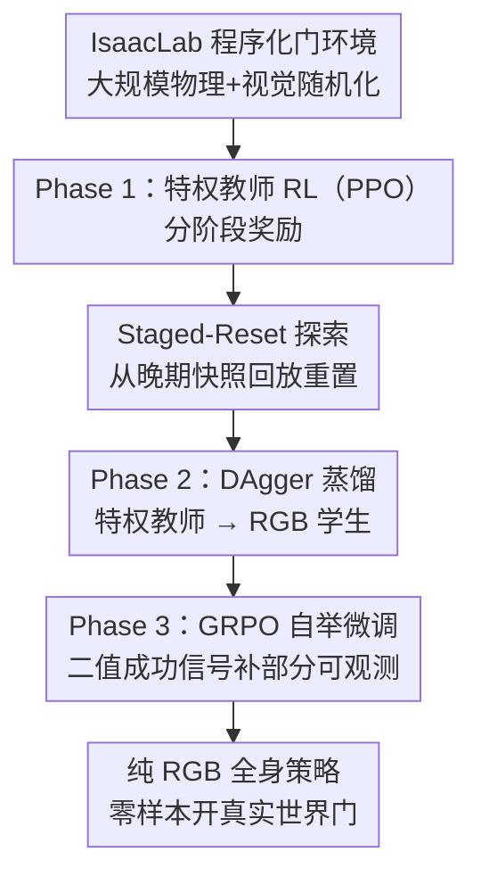

# Opening the Sim-to-Real Door for Humanoid Pixel-to-Action Policy Transfer

**会议**: CVPR 2026  
**论文**: [CVF Open Access](https://openaccess.thecvf.com/content/CVPR2026/html/Xue_Opening_the_Sim-to-Real_Door_for_Humanoid_Pixel-to-Action_Policy_Transfer_CVPR_2026_paper.html)  
**代码**: https://doorman-humanoid.github.io/ （项目页）  
**领域**: 机器人 / 具身智能  
**关键词**: 人形机器人, 全身操作, sim-to-real, 视觉强化学习, 教师-学生蒸馏

## 一句话总结
DoorMan 用一条「教师-学生-自举（teacher-student-bootstrap）」的三阶段管线，在 IsaacLab 里靠大规模物理+视觉随机化训练出一个**纯 RGB 输入**的人形全身开门策略，零样本迁移到真实世界开各种门，任务完成时间比人类遥操作还快最多 31.7%。

## 研究背景与动机
**领域现状**：人形机器人已经能做后空翻、打拳这类炫技动作，但「用一只眼睛（RGB 相机）打开一扇门」这种日常 loco-manipulation（移动+操作）反而还没解决。开门是个极强的压力测试：机器人要从晃动的第一视角相机里认出把手位置、拧动弹簧加载的门把、跟踪门板的圆弧运动、还要在铰链反作用力下维持全身平衡——感知、平衡、接触、导航四件事紧紧耦合在一起。

**现有痛点**：专门做开门的系统大多依赖深度传感器、物体中心特征或硬编码运动基元，且常跑在轮式底盘上；要么简化接触力学、要么要求精确的物体定位；DARPA 挑战赛时代的系统严重依赖脚本和人工干预；近期遥操作驱动的管线又很脆弱。这些都不是能泛化到日常环境的可扩展方案。

**核心矛盾**：把已有的 sim-to-real 经验（locomotion、运动模仿、灵巧操作里都成熟了）搬到 loco-manipulation 上时撞到两个根本难题——(i) **算法本身**要简单、可扩展、对部分可观测鲁棒，能产出协调视觉与全身控制（WBC）的自主策略，而这在已有工作里没被满足；(ii) **视觉 sim-to-real gap** 横跨巨大的外观和物理变化空间，需要广而异质的数据，而不是几个精心搭的场景。

**本文目标**：做一条可泛化的视觉人形 loco-manipulation 学习管线，用开门作为高难度代表性任务。

**核心 idea**：把「特权信息教师 RL → DAgger 蒸馏成 RGB 学生 → GRPO 自举微调」串成三阶段，配上 IsaacLab 里前所未有规模的程序化门资产随机化，让纯 RGB 学生策略能零样本开真实世界里没见过的门。

## 方法详解

### 整体框架
DoorMan 的输入是机器人本体感知（关节角、关节速度、根角速度）+ 一路第一视角 RGB 图像，输出是 Unitree G1 的高维目标关节角（29 个身体关节 + 14 个手部关节，动作维度 33），底层由一个预训练的全身控制器以 50 Hz 跟踪。整条管线分三个阶段，全程在 IsaacLab 里交互式完成：

- **Phase 1 教师 RL**：用「特权观测」（门的真实位姿、手到把手的变换、接触力矩、根速度）训一个 PPO 教师策略，配 stage-conditioned 分阶段奖励，并用 staged-reset 探索机制稳住长时序训练。
- **Phase 2 学生蒸馏**：用 DAgger 把教师蒸馏进一个只看 RGB+本体感知的学生策略，视觉编码器和策略联合微调，全程套激进的视觉随机化。
- **Phase 3 学生自举**：用 GRPO（只有 actor、无 value 的 PPO 变体）以二值成功信号继续微调学生，让它学会教师从没演示过的「补偿部分可观测」的动作（比如主动把操作区域保持在视野里）。

支撑这三阶段的是一条 **大规模程序化随机化** 管线，同时在物理（门类型/尺寸/铰链阻尼/闩锁动力学/把手位置/阻力扭矩）和外观（材质/光照/相机内外参）两个维度撑开多样性。

### 关键设计

**1. 教师-学生-自举三阶段管线：用特权教师领进门，再让 RGB 学生自己学会看路**

直接端到端训一个 RGB 全身开门策略几乎不可能：动作空间 33 维、要 50 Hz 推理、接触富、还得平衡。本文沿用经典 teacher-student 思路但补了关键一环。教师 $\pi_T(a|s)$ 拿到部署时拿不到的特权信息——根到门的变换 $\xi_{RD}$、左右手到把手的变换、18 个手部刚体上的净接触力矩 $\tau_H \in \mathbb{R}^{18\times 6}$、根线速度 $v_R \in \mathbb{R}^3$——用标准 PPO 训练，把「怎么开门」这件难事先在上帝视角下学会。然后用 DAgger 把它蒸馏成学生 $\pi_S(a|o)$：学生只有本体感知 + RGB，图像过一个视觉编码器，latent 拼上本体特征送进两层 LSTM（各 512 单元），再经三层 MLP（512/256/128）映成目标关节角，视觉编码器与策略联合微调。选 DAgger 而非行为克隆，是因为 DAgger 能在**学生自己的输入分布**上直接监督，而 BC 只覆盖教师分布，学生一偏离就没标签。但蒸馏到此为止还不够——这就引出了下面的第三阶段。

**2. Staged-reset 探索：用模拟器的「可回溯性」把长时序任务的后期状态喂给策略**

接触富的精确操作任务（开门）在 RL 探索上有个之前 WBC 文献没遇到的坑：抓住门把但还不会朝正确方向拧、或没配合好全身运动，会因为电机扭矩过大、接触力峰值、甚至摔倒而吃额外惩罚，结果策略干脆「忘掉」抓握行为、躲着不肯进入下一阶段。本文把任务拆成离散的子阶段（接近 Stage 1、开门 Stage 2……），这些阶段对应状态空间里不相交的子集 $\{S_1,\dots,S_K\}$，彼此由很窄的「桥」连接，跨桥概率 $p_{\text{bridge}} \ll 1$，所以从初始分布 $\rho_0$ 训出来的策略前期根本到不了下游阶段，长时序信用分配很差。解法是利用模拟器能完整存档/读档：每当某环境进入新阶段，一个滚动 buffer 缓存该步前后 100 个机器人+环境快照（场景里所有刚体/铰链的广义坐标）；reset 时，机器人以非零概率被随机重置到初始阶段或某个中间阶段。形式化成一个 staged reset 律 $\alpha = (\alpha_1,\dots,\alpha_K)$，$\sum_y \alpha_y = 1$，初始分布变成

$$\tilde{\rho}_\alpha = \sum_{y=1}^{K} \alpha_y \rho_y$$

对应的折扣占用测度 $d^\alpha_\pi(s) = (1-\gamma)\sum_t \gamma^t \Pr(s_t=s \mid s_0 \sim \tilde\rho_\alpha, \pi)$ 被重新加权到后期阶段，等于直接给晚期状态更高频、更大有效幅度的梯度更新。消融显示 buffer=100 时教师约 1700 次迭代就走完所有阶段，buffer=10 要 4000+ 迭代，完全不用（buffer=0）则卡在 Stage 2 进不去。

**3. GRPO 自举微调：让 RGB 学生学会教师没教过的「主动把目标保持在视野里」**

教师有特权观测，学生只有部分观测，遮挡会让学生丢掉关键特征，单靠 BC loss 到不了最优。学生需要在**自己的 rollout** 上自举，去发现补偿部分可观测的策略——比如调整身体位置让被操作区域留在相机视野内。本文用 GRPO 微调学生：它是 PPO 的 actor-only 变体，省掉 value 函数，改用一组轨迹分数估 baseline。采 $G$ 条 rollout $\{\tau_i\}$、各自回报 $R_i$，定义组内归一化相对优势

$$\hat{A}_i = \frac{R_i - \text{mean}(R)}{\text{std}(R)}$$

再用 clipped PPO surrogate 更新，$r_{i,t}(\theta) = \pi_\theta(a_{i,t}|o_{i,t}) / \pi_{\text{old}}(a_{i,t}|o_{i,t})$。微调时主要用**二值任务成功信号**，外加关节速度/加速度/动作率这些简单 shaping 项做正则。这一步让学生不再只是模仿教师，而是在自己的部分观测下直接优化行为，实测能学出教师从没演示过的补偿动作（把物体保持在画面中心、调末端位姿维持可见性）。因为只要基线策略成功率非零就能用，它实质上是个可即插即用、轻量稳定的强化微调阶段。

**4. 大规模程序化门随机化：不复刻真实场景，而是撑开足够宽的物理+外观变化包络**

视觉 sim-to-real gap 巨大，靠几个精心搭的场景（小规模 BC 文献那样、只能在采数据时同一背景/光照/时段评测）泛化不了。本文在 IsaacLab 里写了条程序化生成管线，刻意**不**复刻任何真实场景——所有真实评测场景训练时都没见过。物理上覆盖 5 种门、3 大类（旋转把手推门 / 旋转把手拉门 / 推杆门），随机化门尺寸、把手位置、铰链阻尼、把手阻力扭矩，尤其是用真实闩锁机制捕捉「开门瞬间全身动力学的突变」。视觉上从 IsaacLab 的 PBR 材质库随机抽纹理贴到所有表面，叠加 5233 张穹顶光贴图模拟不同地点/时段，用 RTX 实时渲染器（性能模式，开运动模糊和自动白平衡），相机内外参对齐并轻微随机。这套高保真渲染相比早期只用纯色材质的 RGB sim-to-real 工作能带来更强的视觉泛化。

## 实验关键数据

### 主实验：真实世界对比人类遥操作

| 评测 | 指标 | DoorMan | Expert 遥操 | Non-expert 遥操 |
|------|------|---------|-------------|-----------------|
| 全部开门任务 | 成功率 | **83%** | 80% | 60% |
| 全部开门任务 | 平均耗时(s, 越低越好) | **15.40** | 20.02 | 22.55 |

DoorMan 成功率与专家遥操持平、比非专家高 28 个百分点；任务流畅度（耗时）上比专家快 23.8%、比非专家快 31.7%。定性观察：遥操作者常判断不准弹簧门把/铰链的力度、机器人该倾斜多少来维持平稳开门速度，也常跟不上门板的旋转轨迹——这些反馈信息超出当前 VR 遥操作能力，但在模拟里可交互学到。

### 消融一：视觉随机化（120 次未见门试验，单位 %）

| Exp. | 外观随机化 | 穹顶光 | 推杆门 | 拉杆门 | 推杆门(bar) |
|------|-----------|--------|--------|--------|------------|
| 1 | 无随机化 | ✗ | 10.8 | 5.0 | 20.0 |
| 2 | 纯色随机 | ✓ | 67.5 | 65.8 | 70.0 |
| 3 | +10% 纹理 | ✗ | 58.3 | 50.8 | 76.7 |
| 4 | +10% 纹理 | ✓ | 79.2 | 77.5 | 77.5 |
| 5 | +100% 纹理 | ✗ | 73.3 | 55.8 | 76.7 |
| 6 | +100% 纹理 | ✓ | **85.8** | **80.8** | **85.0** |

### 消融二：staged-reset buffer 大小

| Buffer 大小 | 教师训练表现 |
|------------|-------------|
| 100 snapshots | 约 500 迭代到达多数阶段，约 1700 迭代走完全部阶段 |
| 10 snapshots | 需 4000+ 迭代才探索完 |
| 0（无重置） | 探索失败，卡在 Stage 2（抓门把）进不去 |

### 关键发现
- **穹顶光（光照）随机化贡献最大**：去掉它掉 15–30%，对最长时序、最难的拉杆门影响最大；完全不做视觉随机化成功率跌到 5–20%。
- **10% 纹理就够**：用全部纹理只比 10% 纹理高 4–8%，说明纹理多样性边际收益递减，但高保真渲染相比纯色（65.8–70%）仍有明显优势。
- **GRPO 把学生从「观测 gap」里拉回教师上界**：教师能稳到 80–90%，初始学生只有 50–70%（不可恢复的观测 gap），GRPO 自举后学生达到 80.8–85.8%，曲线明显贴到教师上界后平台化。
- **staged-reset 是教师能不能训出来的关键开关**：没有它教师根本进不了抓门把阶段。

## 亮点与洞察
- **「教师-学生」之外补的第三段 GRPO 自举很关键**：它精准回答了一个老问题——蒸馏出的部分可观测学生天花板在哪、怎么突破。用二值成功信号 + actor-only GRPO 让学生自己学补偿动作，而不是更聪明地模仿教师，思路干净且可即插即用。
- **staged-reset 把「模拟器可读档」这个常被忽视的能力变成探索利器**：长时序接触任务最怕策略「学会躲坑」，直接从晚期快照重置等于强行把后期状态塞进占用测度，理论（占用测度重加权）和实验（1700 vs 4000+ 迭代）都给得很实。
- **首个纯 RGB、端到端的人形多样化铰链 loco-manipulation 策略，还反超人类遥操作**：在效率上超过人类专家本身就说明遥操作的反馈带宽是瓶颈，而模拟里可交互学习能补上这块。
- **"不复刻场景、只撑开变化包络"的随机化哲学**可迁移到其他视觉 sim-to-real 任务：与其精确建模目标场景，不如把分布撑得足够宽。

## 局限与展望
- 任务局限在开门（铰链类铰接物体），虽说是代表性高难任务，但抽屉、旋钮、阀门等其它 loco-manipulation 技能是否同样吃这套管线还需验证。
- 依赖预训练的全身控制器作为底座，腿部 locomotion 不是从零学的，迁移到没有现成 WBC 的平台时这部分成本未计入。
- 高保真随机化（5233 张穹顶光、RTX 渲染、并行 RL）的算力门槛高，复现成本不低。
- 论文未给真实世界长期/多门连续操作的鲁棒性数据；评测都是「机器人放在门前 1 米、朝门心 ±0.3 弧度」的标准化起始位姿，更杂乱的实际导航接入后表现待考。

## 相关工作与启发
- **vs Dextrah-RGB / VBC 等视觉 sim-to-real 操作**：它们多聚焦孤立手臂、或把 locomotion 与 manipulation 解耦；本文做的是纯 RGB、端到端、需要全身能力的统一 loco-manipulation，且不用硬编码基元、不用深度/位姿先验。
- **vs 早期纯色材质 RGB sim-to-real（如 [39,51]）**：那类设定本文复现到 65.8–70% 成功率，高保真 PBR + 穹顶光随机化再往上推到 80%+，量化了现代渲染对视觉泛化的增量。
- **vs 遥操作驱动的 BC 管线（如 [22]）**：BC 上界被人类遥操作数据质量卡死，且只能在采集场景评测；本文用 sim-to-real RL 直接越过这个上界，在效率上反超人类专家。
- **vs InfinigenSim 等程序化资产生成**：本文 IsaacLab 原生实现显著提升物理真实度，支持并行 RL 所需的精确高效接触仿真。

## 评分
- 新颖性: ⭐⭐⭐⭐⭐ 首个纯 RGB、端到端的人形多样化铰链 loco-manipulation sim-to-real 策略，三阶段管线 + staged-reset + GRPO 自举组合扎实
- 实验充分度: ⭐⭐⭐⭐ 真实世界对比人类遥操作 + 视觉随机化/staged-reset/GRPO 三组消融齐全，但任务仅限开门、缺连续多任务长期鲁棒性数据
- 写作质量: ⭐⭐⭐⭐ 动机与方法讲得清晰，占用测度推导和消融图表都到位
- 价值: ⭐⭐⭐⭐⭐ 把「人形开门」这一长期难题用可扩展模拟数据解决并反超人类遥操作，对具身智能数据生成路线有示范意义

<!-- RELATED:START -->

## 相关论文

- [\[CVPR 2026\] VIRAL: Visual Sim-to-Real at Scale for Humanoid Loco-Manipulation](viral_visual_sim-to-real_at_scale_for_humanoid_loco-manipulation.md)
- [\[CVPR 2026\] GeCo-SRT: Geometry-aware Continual Adaptation for Cross-Task Sim-to-Real Transfer](geco-srt_geometry-aware_continual_adaptation_for_cross-task_sim-to-real_transfer.md)
- [\[NeurIPS 2025\] Generalizable Domain Adaptation for Sim-and-Real Policy Co-Training](../../NeurIPS2025/robotics/generalizable_domain_adaptation_for_sim-and-real_policy_co-training.md)
- [\[ICLR 2026\] D-REX: Differentiable Real-to-Sim-to-Real Engine for Learning Dexterous Grasping](../../ICLR2026/robotics/d-rex_differentiable_real-to-sim-to-real_engine_for_learning_dexterous_grasping.md)
- [\[CVPR 2026\] Towards Motion Turing Test: Evaluating Human-Likeness in Humanoid Robots](towards_motion_turing_test_evaluating_human-likeness_in_humanoid_robots.md)

<!-- RELATED:END -->
