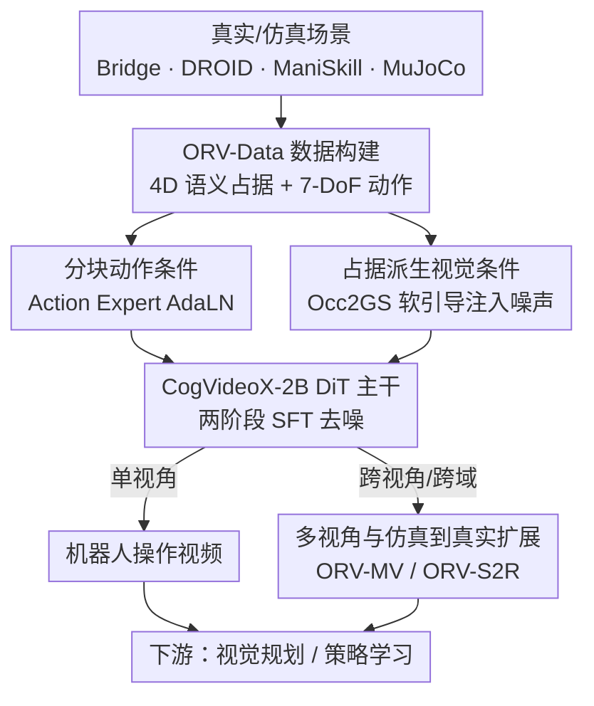

# ORV: 4D Occupancy-centric Robot Video Generation

**会议**: CVPR 2026  
**论文**: [CVF Open Access](https://openaccess.thecvf.com/content/CVPR2026/html/Yang_ORV_4D_Occupancy-centric_Robot_Video_Generation_CVPR_2026_paper.html)  
**代码**: 论文称接受后公开（Code, models, and data will be released upon acceptance）  
**领域**: 机器人 / 具身世界模型  
**关键词**: 机器人视频生成、4D语义占据、世界模型、动作条件扩散、仿真到真实

## 一句话总结
ORV 在预训练视频扩散模型（CogVideoX-2B）上，用「分块 7-DoF 动作条件」加「4D 语义占据渲染出的软视觉先验」共同驱动机器人操作视频生成，把稀疏控制信号和稠密像素之间的鸿沟补上，从而做到高保真、可控、跨视角一致、还能仿真到真实迁移的机器人世界模型，FVD 比 SOTA 低 18.8%，并能给视觉规划和策略学习当数据引擎。

## 研究背景与动机

**领域现状**：具身智能严重缺数据，而传统物理仿真器（ManiSkill、MuJoCo）虽然能安全训策略、低成本采数据，却缺乏视觉真实感。于是「可控视频生成」被当作有希望的数据引擎——给一个动作序列，让生成式世界模型预测未来的 RGB 观测，等价于一个会渲染逼真画面的神经仿真器。

**现有痛点**：现有动作条件视频生成（IRASim、HMA、AVID 等，多用 7-DoF 末端执行器位姿作控制）仍有三个硬伤：(p1) 视觉保真度和时序一致性不够；(p2) 未来预测会漂移、和真实操作控制对不齐；(p3) 只能单视角，没有多视角一致性约束。

**核心矛盾**：作者把 p2、p3 归因于一个根本性的「表征鸿沟」——输入是稀疏的低维控制（7 个自由度的位姿轨迹），输出却是稠密的高维像素动态，中间缺一个能把几何/语义信息显式传给生成器的桥梁。只靠动作或语言这类抽象条件，模型很难把控制忠实地翻译成像素变化。

**切入角度**：作者观察到 **4D 语义占据（occupancy）** 正好能当这个桥：它是坐标系下的体素表示，对几何噪声鲁棒（真实重建表面再脏、仿真参数化表面再干净，占据场都能稳定描述，见论文 Fig. 2），因此天然适合在仿真与真实之间迁移；同时它携带几何 + 语义，比光流/掩码/骨架等细粒度线索更完整。

**核心 idea**：用「占据派生的视觉先验」去补「动作先验」的不足——把 4D 语义占据渲染成 2D 图作为软引导注入扩散过程，再配上分块动作条件，在一个预训练视频基础模型上做两阶段微调，就得到既忠实又通用的机器人视频生成框架 ORV。

## 方法详解

### 整体框架
ORV 的任务被形式化为一个机器人操作世界模型：给定上下文 $(S, O, \phi, \rho)$，模型 $M$ 要预测未来状态 $s_{t:t+\Delta T}$ 和对应观测 $o_{t:t+\Delta t}$。传统文生视频条件是 $\rho_1:=\mathrm{Embed}(\text{text})$，动作条件视频生成进化到 $\rho_2:=\mathrm{Embed}(a_{t:t+\Delta t})$，而 ORV 进一步引入 $\rho_3:=\mathrm{Embed}(c_{t:t+\Delta t}\sim\pi'(s_{1:t}),\, a_{t:t+\Delta t}\sim\pi(s_{1:t}))$，其中 $a$ 是智能体动作、$c$ 是占据场，$\pi/\pi'$ 是非交互式（离线一次性采集）的先验提取过程，既可在真实环境（人遥操作）也可在仿真器里建立。

为了避开昂贵的大规模预训练、降低训练成本，ORV 直接构建在开源预训练视频模型 **CogVideoX-2B**（DiT 架构、双向扩散）之上，做**两阶段监督微调（SFT）**：第一阶段注入动作条件、第二阶段注入占据派生的视觉条件。整条流水线是：从真实/仿真场景离线提取占据 $\mathcal{C}$ 与动作 $\mathcal{A}$（由 ORV-Data 数据管线构建）→ 把动作经 Action Expert AdaLN 分块注入每个 DiT 块、把占据渲染成 2D 软图注入初始噪声 → DiT 去噪生成视频；在此基础上派生出单视角、多视角（ORV-MV）、仿真到真实（ORV-S2R）三种模式，最终服务视觉规划与策略学习等下游任务。

### 关键设计

**1. ORV-Data 数据构建：先造出机器人场景的 4D 语义占据，方法才有先验可用**

ORV 的整套思路依赖占据先验，但具身场景几乎没有现成的占据数据，所以作者先设计了一条四步数据管线，从现有机器人数据集（BridgeData V2、DROID、RT-1）里「凭空」造出 4D 语义占据。第一步**语义空间构建**：用 VLM 对关键帧做 caption，对约 15 万条标签做 K-means 聚类，得到一个约 50 类的数据集级语义标签集（table、countertop、towel、spoon、pan…）；再用 Grounding DINO + SAM2 在帧间提取时序一致的实例并映射到语义。第二步**占据构建**：用 MonST3R 重建稀疏 4D 点（有深度通道的视频则跳过重建），用 NKSR 致密化以补洞、抗噪，体素化到规范坐标系，每个体素内对投影进来的语义标签做多数投票赋语义。第三步**语义赋予**完成「占据 + 语义」的绑定。第四步在实际使用时做 **bullet-time 占据→高斯渲染**。最后用 RAFT 过滤帧间一致性差的渲染数据。正是这条管线把广度足够的机器人数据「升维」成可作条件的几何/语义先验，是后面所有设计能落地的前提。

**2. 分块动作条件：用 Action Expert AdaLN 把 7-DoF 控制对齐进视频隐变量**

7-DoF 末端执行器位姿序列 $A\in\mathbb{R}^{T\times D_a}$（$D_a=7$）是高层控制信号，难点在于它的时间分辨率和视频隐变量对不齐、且直接逐帧注入开销大。ORV 借鉴 IRASim 的做法，用**自适应层归一化（Action Expert AdaLN）**在每个 DiT 块内直接调制视频隐变量，但加了一个**分块（chunk）**机制做时序对齐：先按 3D VAE 的时间压缩，给参考帧补零动作占位，再用一个浅层 MLP（$\varepsilon_{action}$）把连续 $r$ 个动作压成一个 token：$A\in\mathbb{R}^{T\times D_a}\to \mathrm{MLP}(\mathrm{Pad}(A))\in\mathbb{R}^{(\frac{T}{r}+1)\times D}$，$r$ 为 chunk 大小、$D$ 为特征维。更省的是，Action Expert AdaLN **复用预训练 Vision Expert AdaLN 的参数**，因为每个 AdaLN 约占总参数的 1/3，复用能省下大量冗余计算。消融显示去掉分块（直接编码离散动作）PSNR 掉 3.2%、成功率掉 5.5%，把动作硬塞进 Text/Vision Expert 则性能崩坏（成功率从 74.7 掉到 52.9），证明这套专用、对齐、复用参数的注入方式是必要的。

**3. 占据派生视觉条件：把占据渲染成软的 2D 图注入噪声，而不是逐层硬控制**

把抽象的 3D 动作翻成 2D 像素很难，所以作者引入像素级的软视觉条件来补位。但直接把体素投影到 2D 平面会让相邻帧/视角的像素发生突变，于是 ORV 给每个体素格赋一个**非可学习的高斯泼溅（Gaussian Splatting）**，再从指定视角渲染（即 Occ2GS），既提升条件质量又省显存。为解决渲染时的透视畸变，作者提出**自适应缩放规则**：高斯尺度 $\sigma = k_2\cdot \hat{z}^{\,k_1}$，其中 $\hat{z}\in[1,2)$ 是规范空间归一化深度，指数项 $k_1$ 和基准尺度 $k_2$ 分别控制近/远平面的缩放行为。注入方式上，用一个编码 MLP（$\varepsilon_{visual}$）加上输入图，再经零初始化投影器把视觉条件加到输入噪声：$z_{in}=\text{Zero-MLP}(z_{in}+\mathrm{MLP}(\mathcal{C}))+z_{in}$。关键区别在于：以往 ControlNet 式的逐层控制注入计算开销大，且当条件是「软的」（不与真值像素级对齐）时反而会污染视频隐变量；ORV 把软条件只加到初始噪声、当成引导而非硬约束，既便宜又稳。消融里 ControlNet 注入的 FVD 是 20.069，而 ORV 注入到噪声做到 16.525。

**4. 多视角与仿真到真实扩展：同一套占据先验复用出 ORV-MV 与 ORV-S2R**

占据是 4D、视角无关、对几何噪声鲁棒的，这让同一框架可以低成本派生两种能力。**ORV-MV** 在单视角时序注意力（singleview module，处理 $F_P\in\mathbb{R}^{B_P\times S_P\times D}$，$S_P=THW$，跨时间的 token）之前加了一层**视角注意力（multiview module，处理 $F_V\in\mathbb{R}^{B_V\times S_V\times D}$，$S_V=VHW$，跨视角的 token）**，两者都继承预训练模型的 3D(2D+1D) 注意力；并且做差异化条件——单视角模块吃文本/动作/占据图，多视角模块**剔除动作先验**，只专注视角对应关系，从而生成跨视角一致的视频，弥补以往方法只捕捉单一表面、在切换视角时出现空洞/伪影的缺陷。**ORV-S2R** 则利用占据派生先验（如深度图）外观无关的特性：仿真器能廉价给出这类先验，配合一个额外的图像生成器（ControlNet）先造多样初始帧、再扩成逼真视频，从而在显著的域差距下完成仿真到真实迁移。两者本质都是「同一占据先验 + 不同条件/注意力布置」的复用，所以放在一个设计点里讲。

### 损失函数 / 训练策略
训练沿用扩散去噪损失（denoising loss），在 CogVideoX-2B 上做两阶段 SFT：动作条件基模型约 30K 步，占据图引导微调与多视角生成额外约 20K 步。消融显示「从 CogVideoX2B 微调」远好于「从零训练」（FVD 17.682 vs 84.831），说明站在预训练视频基础模型肩膀上对保真度（FID/FVD）至关重要。

## 实验关键数据

### 主实验

条件视频生成在 BridgeV2 / DROID / RT-1 三个真实数据集上评测，给一帧观测预测后续 15 帧。下表摘自论文 Table 1（BridgeV2 与 RT-1 的 FVD 等核心列）：

| 数据集 | 设置 | 方法 | PSNR↑ | SSIM↑ | FID↓ | FVD↓ |
|--------|------|------|-------|-------|------|------|
| BridgeV2 | 动作条件 | IRASim | 25.276 | 0.833 | 10.510 | 20.910 |
| BridgeV2 | 动作条件 | **ORV** | 25.631 | 0.873 | 3.821 | **17.682** |
| BridgeV2 | 占据+动作 | IRASim† | 27.352 | 0.862 | 9.413 | 22.503 |
| BridgeV2 | 占据+动作 | **ORV** | **28.258** | **0.899** | **3.418** | **16.525** |
| RT-1 | 动作条件 | IRASim | 26.048 | 0.833 | 5.600 | 25.580 |
| RT-1 | 动作条件 | **ORV** | 27.086 | 0.863 | 4.210 | 20.031 |

ORV 在多数指标上领先；论文宣称的「FVD 比 SOTA 低 18.8%」对应 BridgeV2 动作条件下 IRASim 20.910 → ORV 17.682（约 −15.4%，⚠️ 18.8% 的口径以原文为准，可能对应不同基线/数据集组合）。把同样的占据+动作条件也加给 IRASim†，ORV 依然更优，说明优势来自框架设计而不仅是多了占据信息。

下游两项任务：视觉规划在 VP2 基准（论文 Table 2），ORV 平均成功率 66.0（按仿真器归一化后 74.7），优于 iVideoGPT 的 63.9（72.2），对应约 +3.5% 的提升口径；策略学习在 SimplerEnv-WidowX（论文 Table 3，作为数据引擎增广约 25% 合成数据）：

| 策略模型 | Spoon on Towel | Carrot on Plate | Stack Cube | Eggplant in Basket | 平均成功率 |
|----------|---------------|-----------------|------------|--------------------|-----------|
| RoboVLM +Finetune | 27.6% | 26.7% | 12.1% | 52.8% | 29.8% |
| RoboVLM **+ORV** | 32.2% | 29.6% | 15.7% | 57.9% | **33.9%** |
| SpatialVLA +Finetune | 12.8% | 26.1% | 26.5% | 79.3% | 36.2% |
| SpatialVLA **+ORV** | 14.7% | 28.4% | 27.8% | 83.0% | **38.5%** |

RoboVLM 平均 +4.1（相对 ~13.7%），SpatialVLA 平均 +2.3（相对 ~6.5%）。⚠️ 摘要/teaser 里的「+6.4% 策略学习」应是 SpatialVLA 的**相对**增益口径（≈6.5%），不是绝对百分点，以原文为准。

### 消融实验

动作条件与占据条件注入方式（论文 Table 4，BridgeV2）：

| 配置 | PSNR↑ | SSIM↑ | FID↓ | FVD↓ | Success↑ |
|------|-------|-------|------|------|----------|
| CogVideoX（纯文本基线） | 19.432 | 0.752 | 7.509 | 83.561 | - |
| 动作塞进 Text Expert | 20.424 | 0.772 | 4.104 | 23.586 | 52.9 |
| 不分块（直接编码离散动作） | 24.813 | 0.850 | 3.793 | 19.944 | 70.6 |
| Ours（动作条件 base） | 25.631 | 0.873 | 3.821 | 17.682 | 74.7 |
| 占据用 ControlNet 注入 | 26.974 | 0.865 | 3.613 | 20.069 | - |
| Ours（占据 full，注入噪声） | 28.258 | 0.899 | 3.418 | 16.525 | - |

条件资源与训练策略（论文 Table 5，Fine=像素级精条件，Coarse=占据渲染粗条件）：

| 配置 | 来源 | PSNR↑ | FID↓ | FVD↓ |
|------|------|-------|------|------|
| 无条件（base） | - | 25.631 | 3.821 | 17.682 |
| 加深度 | Fine | 30.288 | 3.061 | 14.321 |
| 加深度 | Coarse | 28.031 | 4.522 | 18.548 |
| 全条件 | Fine | 30.431 | 2.998 | 14.301 |
| 全条件 | Coarse | 28.258 | 3.418 | 16.525 |
| 从零训练 | - | 23.518 | 19.357 | 84.831 |
| 从 CogVideoX2B 微调 | - | 25.631 | 3.821 | 17.682 |

### 关键发现
- **占据视觉先验贡献巨大**：加全条件相对 base 提升 PSNR 18.72%（25.621→30.431，Fine）和 10.24%（→28.258，Coarse）；粗条件已逼近精条件，意味着不必苛求像素级对齐就能拿到大部分收益。
- **注入位置 > 注入信息**：同样是占据条件，注入初始噪声（ORV）比 ControlNet 式逐层注入 FVD 更低（16.525 vs 20.069），印证软条件逐层硬注入会污染隐变量的判断。
- **鲁棒性是核心卖点**（论文 Table 7 零样本跨粒度）：用粗条件训练的模型在精/粗条件上都稳（Coarse→Fine 仅 −1.423 PSNR）；而用精条件训练的模型一旦遇到粗输入就崩（Fine→Coarse PSNR −11.240、FVD +109.792）。这正好说明依赖像素级精条件的 Cosmos-Transfer / RoboTransfer 类方法对条件不准很敏感，而 ORV 的占据软条件不敏感——这是它能仿真到真实迁移的根。
- **多视角**（论文 Table 6，3 视角、view0 为锚）：加视觉先验改善了 view1/view2 的跨视角生成（如 view1 FVD 16.36→13.67）。⚠️ 表中「with / without」标注顺序与部分数值方向看似不一致，具体口径以原文为准。

## 亮点与洞察
- **把「占据」从自动驾驶搬到机器人操作做视觉先验**：作者点破了动作→像素的表征鸿沟，并用对几何噪声鲁棒、视角无关、带语义的 4D 占据当桥，一招同时缓解了对齐漂移（p2）、单视角（p3）和仿真到真实三个问题，思路统一且优雅。
- **软条件就该软着注入**：发现 ControlNet 式逐层硬注入会在条件不精时污染隐变量，转而把占据渲染图只加到初始噪声当引导，既省算力又更稳——这条「条件质量决定注入方式」的经验可迁移到其他可控生成任务。
- **参数复用的小巧思**：Action Expert AdaLN 直接复用 Vision Expert AdaLN 参数，省掉约 1/3 的冗余 AdaLN 计算，是工程上很实在的省钱设计。
- **用粗条件训练换泛化**：Table 7 揭示「训得越精、迁移越脆」，主动用粗占据条件训练反而获得跨粒度鲁棒，这个反直觉发现对想做 sim-to-real 的人很有价值。

## 局限与展望
- **依赖一条重型数据管线**：ORV-Data 串了 MonST3R、NKSR、Grounding DINO、SAM2、VLM、RAFT 等多个大模型，占据质量受这些组件误差累积影响；论文也用 RAFT 过滤一致性差的数据，说明管线产物并非全可用。
- **重建质量是上限**：从单/多目视频重建 4D 占据本身有噪声，对透明/反光/快速形变物体可能失效，⚠️ 论文未充分量化这类极端情形。
- **基座绑定 CogVideoX-2B**：保真度高度依赖预训练视频基础模型（从零训 FVD 84.831），更大基座/更新世界模型上的收益是否保持未验证。
- **下游增益偏温和**：策略学习绝对提升约 +2.3~+4.1 个百分点，作为数据引擎有效但非颠覆性；多视角仍存在原始数据光照不一致等问题。

## 相关工作与启发
- **vs IRASim / HMA / AVID（动作条件视频生成）**：它们只用 7-DoF 动作当条件，受限于稀疏控制→稠密像素的鸿沟，保真和对齐都弱；ORV 额外注入占据派生视觉先验补上几何/语义，把同样的占据+动作也喂给 IRASim† 后 ORV 仍更优，证明优势在框架而非信息量。
- **vs Cosmos-Transfer / RoboTransfer（场景图条件迁移）**：它们用深度/法向等多模态图做条件、对条件精度敏感；ORV 的占据软条件对几何噪声鲁棒，跨粒度零样本不崩，更适合仿真到真实。
- **vs UniScene 等自动驾驶占据生成**：把「占据作场景表示」的成功经验迁移到机器人操作世界模型，并解决了具身场景缺占据数据的问题（自建 ORV-Data）。
- **vs TesserAct / EnerVerse / iVideoGPT（具身世界模型）**：ORV 不做昂贵大规模预训练，而是站在开源视频基础模型上两阶段微调，且原生支持多视角一致与 sim-to-real，通用性更强。

## 评分
- 新颖性: ⭐⭐⭐⭐⭐ 把 4D 语义占据作为视觉先验引入机器人视频生成，统一解决保真/对齐/多视角/sim-to-real，角度新且自洽
- 实验充分度: ⭐⭐⭐⭐⭐ 覆盖三大数据集 + 视觉规划 + 策略学习三类任务，消融细致（注入方式/条件粒度/预训练/鲁棒性）
- 写作质量: ⭐⭐⭐⭐ 问题动机清晰、图表完整，但部分数值口径（18.8%、+6.4%、Table 6 标注）需对照原文才能厘清
- 价值: ⭐⭐⭐⭐⭐ 提供可控、可迁移的机器人神经仿真器与配套占据数据集，对具身数据稀缺问题有直接工程价值

<!-- RELATED:START -->

## 相关论文

- [\[CVPR 2026\] Video2Robo: 3DGS-based Synthetic Data from One Video Enables Scalable Robot Learning](video2robo_3dgs-based_synthetic_data_from_one_video_enables_scalable_robot_learn.md)
- [\[CVPR 2026\] Towards Human-Like Robot Handwriting via Contour-Aware Generation](towards_human-like_robot_handwriting_via_contour-aware_generation.md)
- [\[CVPR 2026\] IGen: Scalable Data Generation for Robot Learning from Open-World Images](igen_scalable_data_generation_for_robot_learning_from_open-world_images.md)
- [\[CVPR 2026\] Learning a Unified Latent Action Space from Videos with Action-centric Cycle Consistency](learning_a_unified_latent_action_space_from_videos_with_action-centric_cycle_con.md)
- [\[CVPR 2025\] A Data-Centric Revisit of Pre-Trained Vision Models for Robot Learning](../../CVPR2025/robotics/a_data-centric_revisit_of_pre-trained_vision_models_for_robot_learning.md)

<!-- RELATED:END -->
