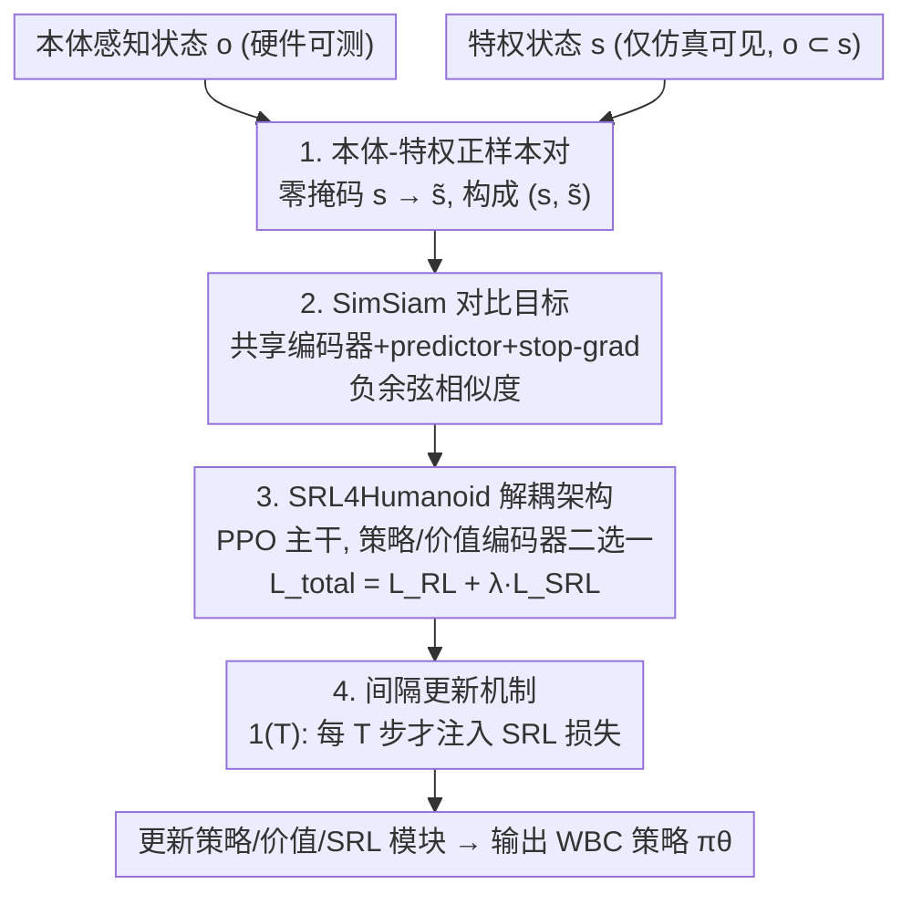

# PvP: Data-Efficient Humanoid Robot Learning with Proprioceptive-Privileged Contrastive Representations

**会议**: CVPR 2026  
**论文**: [CVF Open Access](https://openaccess.thecvf.com/content/CVPR2026/html/Yuan_PvP_Data-Efficient_Humanoid_Robot_Learning_with_Proprioceptive-Privileged_Contrastive_Representations_CVPR_2026_paper.html)  
**代码**: https://github.com/myismyname/SRL4Humanoid  
**领域**: 机器人 / 具身智能  
**关键词**: 人形机器人, 全身控制, 状态表示学习, 对比学习, 强化学习

## 一句话总结
PvP 把人形机器人训练时唯一可得的"特权状态"当成本体感知观测的"天然数据增强"，用 SimSiam 式对比学习把两者拉近，**不需要任何手工增强**就让策略编码器学到紧凑且任务相关的表示，从而显著提升强化学习（PPO）在全身控制任务上的样本效率与最终性能。

## 研究背景与动机

**领域现状**：人形机器人的全身控制（Whole-Body Control, WBC）是让机器人协调几十个关节、完成平衡—运动—操作的核心，近年主流做法是用强化学习（RL，尤其是 PPO）直接学一个从观测到关节动作的策略，例如 BeyondMimic 做大规模动作跟踪、HugWBC 做多步态统一控制。

**现有痛点**：RL 在 WBC 上**样本效率极低**。人形机器人动力学复杂、欠驱动、部分可观测（POMDP），加上奖励是跟踪精度、能耗、动作平滑度等一堆子项的加权和，导致采样复杂度居高不下，训练慢且不稳。

**核心矛盾**：业界用状态表示学习（State Representation Learning, SRL）把高维含噪声的感知输入压成紧凑表示来提效，但两类主流 SRL 都有硬伤——**重建式**（如预测根部线速度）为了重构完整状态会保留大量任务无关细节，表示质量与泛化都差；**单模态对比式**（如 PIM）只用本体感知一种模态，拿不到环境层面的全局信息。两者都没用上人形机器人训练时一个被白白浪费的资源：**特权状态**（privileged state，仅仿真器可见的根部位姿、接触、地形等）。

**本文目标**：在不引入手工数据增强、不破坏端到端训练的前提下，设计一种能同时利用本体感知与特权信息的 SRL，把它无缝嵌进 PPO 训练，既加速仿真训练又保证真机部署可靠。

**切入角度**：作者注意到一个关键的包含关系——本体感知状态 $o$ 是特权状态 $s$ 的子集（$o \subset s$）。于是特权状态可以被看作本体感知状态的"伪增强"（pseudo augmentation）：把 $s$ 里那部分多出来的特权信息抹掉，就退化成 $o$。这天然构成一对"同源、视角不同"的正样本，正好喂给对比学习——增强不用手工设计，物理上就存在。

**核心 idea**：在本体感知状态与特权状态之间做 SimSiam 式对比学习（Proprioceptive-**v**ersus-**P**rivileged，PvP），用特权状态对本体感知表示做"免费增强"，让策略编码器学到任务相关、抗噪的紧凑表示。

## 方法详解

### 整体框架

PvP 要解决的是"如何让策略编码器在不加手工增强、不改 RL 主干的情况下，学到更好的状态表示"。整体上它由两部分组成：**PvP 对比目标**（怎么造正样本、怎么算对比损失）和承载它的 **SRL4Humanoid 框架**（怎么把 SRL 损失插进 PPO、何时更新）。

数据流是这样转的：每个时间步同时拿到本体感知状态 $o_t\in\mathbb{R}^n$（关节位置/速度、基座角速度、重力方向，硬件可测）和特权状态 $s_t\in\mathbb{R}^m$（含根部位姿/速度、各连杆位姿、接触指示、地形特征，仅训练时可得，且满足 $o\subset s$）。对 $s_t$ 把"特权那一段"做零掩码得到 $\tilde s_t$，于是 $(s_t,\tilde s_t)$ 成为一对正样本，送进**共享权重**的策略编码器走 SimSiam 流程算对比损失；这个对比损失再以 $\lambda$ 加权、按"间隔更新"的节奏加到 PPO 的 RL 损失上联合优化。策略网络只吃本体感知状态产生动作，价值网络吃特权状态做价值估计，SRL 与 RL 完全解耦。

### 关键设计

**1. 本体-特权正样本对构建：把"特权状态"当免费数据增强**

对比学习的命门是怎么造正样本对。CURL、ATC 这类视觉对比方法靠手工增强（裁剪、加噪、随机掩码）造正样本，但机器人状态向量上做手工增强既不自然又难调；PIM 这类只用单模态，又拿不到环境信息。PvP 的巧思是利用 $o\subset s$ 这个物理事实——特权状态 $s$ 本身就"包含"了本体感知状态 $o$，外加一段仅训练时可见的特权信息（如根部线速度）。把特权那段做零掩码就得到 $\tilde s_t=\mathrm{ZeroMasking}(s_t)$，它实质上只保留本体感知观测。于是 $(s_t,\tilde s_t)$ 是一对"同一时刻、信息量不同"的正样本：一个携带全局特权信息、一个只有本体感知。让编码器把这对拉近，等价于逼策略编码器**从纯本体感知输入里反推出特权信息**，既给了策略一条间接访问特权信息的通道，又彻底省掉了手工增强。

**2. SimSiam 式对比目标：无负样本、靠 stop-gradient 防坍缩**

有了正样本对，怎么学而不坍缩（编码器把所有输入映射到同一常向量）是第二个问题。PvP 直接采用 SimSiam，不需要负样本、不需要动量编码器或大 batch。记策略编码器为 $f_\theta$、预测头为 $h_\psi$，对正样本对算
$$z=f_\theta(s),\quad \tilde z=f_\theta(\tilde s),\quad p=h_\psi(z),\quad \tilde p=h_\psi(\tilde z)$$
损失取对称的负余弦相似度并对其中一支做停梯度：
$$\mathcal{L}_{\mathrm{PvP}}=D_{ncs}\big(p,\ \mathrm{sg}(\tilde z)\big)+D_{ncs}\big(\tilde p,\ \mathrm{sg}(z)\big)$$
其中 $D_{ncs}(p,z)=-\dfrac{p}{\lVert p\rVert_2}\cdot\dfrac{z}{\lVert z\rVert_2}$ 是负余弦相似度，$\mathrm{sg}(\cdot)$ 是停梯度。停梯度是防坍缩的关键：它让一支当"目标"另一支去逼近，避免两支同时塌到平凡解。整套机制把"用特权信息增强本体感知表示"做成了一个轻量、稳定、即插即用的辅助目标，不依赖手工增强因而**对任务高度通用**。

**3. SRL4Humanoid 解耦架构：SRL 与 RL 分离，可挂策略或价值编码器**

要系统地研究 SRL 怎么帮 RL，需要一个统一可插拔的载体。SRL4Humanoid 以 PPO 为主干：策略网络输入本体感知状态产生动作，价值网络输入特权状态做价值估计，**SRL 与 RL 过程完全解耦**——SRL 损失既可挂到策略编码器、也可挂到价值编码器。联合优化目标为
$$\mathcal{L}_{\mathrm{Total}}=\mathcal{L}_{\mathrm{RL}}+\lambda\cdot\mathcal{L}_{\mathrm{SRL}}$$
$\lambda$ 是权重系数。这个框架同时实现了三种代表不同范式的 SRL（SimSiam 对比、SPR 动力学建模、VAE 重建），方便横向比较。实验进一步表明，把 SRL 挂在**策略编码器**比挂在价值编码器更稳：挂价值编码器时收敛更慢，速度跟踪任务甚至出现训练坍缩（动作平滑度骤降后才恢复）。

**4. 间隔更新机制：避免早期低质数据把 SRL 拖进局部最优**

默认设置里 SRL 与 RL 同步更新、共享同一批数据。但作者发现持续施加 SRL 损失并不总是正向，有时反而拖慢学习——原因是大规模并行 RL 在训练早期会产出大量重复、低质量的同质数据，让 SRL 模块**过早陷入局部最优**，后续就再难有效影响策略学习。为此 PvP 引入间隔更新：
$$\mathcal{L}_{\mathrm{Total}}=\mathcal{L}_{\mathrm{RL}}+\mathbb{1}(T)\cdot\lambda\cdot\mathcal{L}_{\mathrm{SRL}}$$
其中 $\mathbb{1}(T)$ 是指示函数，每隔 $T$ 个时间步才等于 1、否则为 0，即每 $T$ 步才注入一次 SRL 损失。这样既给早期数据"降权"、避免过早收敛，又顺带省了算力。实验里更新间隔取 50 在多数 SRL 方法上接近最优。

> ⚠️ 论文公式编号上联合目标先以 Eq.(5) 给出 $\mathcal{L}_{\mathrm{Total}}=\mathcal{L}_{\mathrm{RL}}+\lambda\mathcal{L}_{\mathrm{SRL}}$，随后 Eq.(6) 引入带指示函数的间隔更新版本；算法伪代码引用的"Eq.(6)"即指间隔更新版，**以原文为准**。

### 损失函数 / 训练策略
- **总目标**：$\mathcal{L}_{\mathrm{Total}}=\mathcal{L}_{\mathrm{RL}}+\mathbb{1}(T)\cdot\lambda\cdot\mathcal{L}_{\mathrm{SRL}}$，RL 主干为 PPO，优势用 GAE 估计。
- **PvP 损失**：对称负余弦相似度 + 停梯度（见关键设计 2）。
- **训练流程**（Algorithm 1）：每个 episode 先用当前策略采样 rollouts、做 GAE 得回报；内层每个 epoch 从 rollouts 采小批 $B$，用 $B$ 同时算策略/价值损失与 SRL 损失，按总目标更新策略网络、价值网络和 SRL 模块。
- **关键超参**：SRL 权重 $\lambda$、更新间隔 $T$（实验取 1/50/100，50 多数最优）、训练数据比例（10%/50%/100%，对本体感知段做随机掩码重采样）。

## 实验关键数据

实验平台为 LimX Oli 全尺寸人形机器人（31 自由度），跑在 IsaacLab 上、单张 RTX 4090（24GB）。两个任务：**LimX-Oli-31dof-Velocity**（平地速度跟踪，命令每 10 秒重采样，x 轴线速度 $(-0.5,1.0)$ m/s、y 轴 $(-0.3,0.3)$ m/s、z 轴角速度 $(-1.0,1.0)$ rad/s）与 **LimX-Oli-31dof-Mimic**（模仿 20 段预录人体动作，单段最长 43 秒/4300 帧）。对比 PPO、PPO+VAE、PPO+SPR、PPO+SimSiam、PPO+PvP 五种配置。

> ⚠️ 原文结果以学习曲线/柱状图（归一化得分 0–1，含均值±标准差）呈现，未给出精确数值表；下表为对原文图 5–10 趋势的归纳总结，**绝对数值以原文图为准**。

### 机器人平台规格（LimX Oli）

| 部件 | 规格 | 部件 | 规格 |
|------|------|------|------|
| 身高 | 165 cm | 体重 | 55 kg |
| 肩宽 | 55 cm | 臂长 | 70 cm |
| 主动自由度 | 31 | 头部自由度 | 2 |
| 单臂自由度 | 7 | 腰部自由度 | 3 |
| 单腿自由度 | 6 | — | — |

### 主实验：五种配置在两任务上的表现（趋势归纳，Q1）

| 方法 | 速度跟踪（学习速度/最终分） | 动作模仿（最终性能） | 关键观察 |
|------|------------------------------|----------------------|----------|
| PPO（vanilla） | 基线 | 基线 | 无 SRL，收敛最慢 |
| PPO+VAE | 提升有限 | **退化**（低于 PPO） | 纯重建保留无关细节，反而拖累 |
| PPO+SPR | 提升有限 | 优于 PPO | 动力学建模有一定增益 |
| PPO+SimSiam | 提升有限 | 优于 PPO | 单模态对比，增益中等 |
| **PPO+PvP** | **显著加速** | **最高** | 双模态对比，速度跟踪加速最明显、模仿任务三项 KPI 全面领先 |

补充观察：在速度跟踪的**动作平滑度**惩罚项上，PvP 收敛最快，意味着既能在仿真里加速学习、又能保证真机部署时动作不剧烈（更可靠）。动作模仿任务里 PvP 在腰部俯仰朝向、双脚间距、关节位置三项跟踪指标上均为最高。

### 消融：更新间隔与数据比例（Q2 / Q3）

| 消融维度 | 配置 | 速度跟踪 | 动作模仿 |
|----------|------|----------|----------|
| 更新间隔 $T$ | 1 / 50 / 100 | 影响很小 | 影响明显，**$T=50$ 多数最优** |
| 训练数据比例 | 10% / 50% / 100% | 曲线几乎重合 | 比例越高越好，**SimSiam 与 PvP 受益最大** |
| SRL 挂载位置 | 策略编码器 vs 价值编码器 | 价值编码器侧出现**训练坍缩** | 价值编码器侧收敛更慢 |

### 关键发现
- **特权信息是关键增益来源**：PvP 与单模态 SimSiam 的主要差别就是引入了特权状态做对比，这让它在速度跟踪上加速最明显、在模仿任务上拿到最高分——说明"用特权状态增强本体感知表示"确实有效。
- **重建式 SRL 可能帮倒忙**：VAE 在动作模仿任务上反而低于 vanilla PPO，验证了"重建完整状态会保留任务无关细节"的判断，单纯重建感知数据不足以提效。
- **SRL 该挂在策略编码器**：挂价值编码器收敛更慢，速度跟踪甚至训练坍缩；挂策略编码器更稳更好。
- **早期数据要降权**：间隔更新（$T=50$）在动作模仿这类对控制精度要求更高的任务上效果显著，印证了"早期低质数据会把 SRL 拖进局部最优"。
- **几乎零额外算力**：SRL 模块完全在 GPU 上运行，单卡 RTX 4090 即可，不影响整体训练效率。
- **真机可用**：先在 MuJoCo 做 Sim2Sim（比 IsaacLab 更接近真实），再在 LimX Oli 真机上完成速度跟踪与动作模仿。

## 亮点与洞察
- **把"特权状态"重新定义为免费数据增强**：以往特权信息只在 teacher-student 蒸馏或 critic 里用，PvP 发现 $o\subset s$ 的包含关系让特权状态天然是本体感知的"伪增强"，省掉了对比学习最难调的手工增强环节——这个视角很可迁移到任何"训练态可见、部署态不可见"的多源观测场景。
- **用 SimSiam 而非 InfoNCE，省负样本省工程**：状态向量上凑负样本很别扭，SimSiam 无负样本 + 停梯度的设计正好适配机器人状态对比，落地成本低。
- **间隔更新揭示了 SRL+RL 联训的隐患**：并行 RL 早期数据同质且低质，会让辅助 SRL 过早收敛，这个观察对所有"SRL 当辅助任务"的工作都有警示价值，简单的指示函数就能缓解。
- **SRL4Humanoid 把三种范式放进同一框架**做公平比较，本身是社区可复用的基础设施。

## 局限与展望
- **作者承认的局限**：目前只验证了几种 SRL 方法，未来可纳入更多 SRL 技术；当前只用本体感知 + 特权状态，未引入 RGB/深度等多模态感知，计划扩展到感知驱动的人形控制。
- **自己发现的局限**：结果几乎全以归一化得分的学习曲线呈现，**缺少精确数值与统计显著性检验**，跨任务"谁更好"只能定性判断，不同任务的归一化分不可直接比大小。
- **特权信息依赖仿真**：方法本质依赖仿真器才能拿到的特权状态，零掩码假定本体感知段在 $s$ 与 $o$ 中严格对齐，若 sim-to-real 下特权信息分布偏移，"反推特权"的表示是否仍稳健有待考察。
- **可改进方向**：把零掩码换成可学习的模态丢弃比例、或对不同特权分量分组掩码，可能进一步提升表示质量；间隔 $T$ 目前是固定超参，自适应调度（随训练进度衰减注入频率）可能更优。

## 相关工作与启发
- **vs 重建式 SRL（如世界模型重建 / 预测根部线速度）**：它们重建完整状态、保留任务无关细节，表示质量与泛化差；PvP 用对比学习直接学任务相关特征，实验中 VAE 在模仿任务上甚至退化。
- **vs PIM（单模态对比）**：PIM 只用本体感知一种模态，拿不到环境层面信息；PvP 引入特权状态做跨模态对比，信息更全。
- **vs CURL / ATC（视觉对比 SRL）**：它们靠手工图像增强造正样本，PvP 利用 $o\subset s$ 的物理包含关系做"免手工增强"的正样本对，更契合机器人状态向量。
- **vs Any2Track（SRL 增强动作跟踪）**：用动力学感知的世界模型预测提取特征以适应扰动；PvP 走对比表示路线、并把 SRL 与 RL 完全解耦做成可插拔框架。

## 评分
- 新颖性: ⭐⭐⭐⭐ "特权状态即免费增强"的视角简洁有洞察，但本质是 SimSiam 在新场景的迁移
- 实验充分度: ⭐⭐⭐⭐ 多任务+多消融+真机验证较完整，但缺精确数值表与显著性检验
- 写作质量: ⭐⭐⭐⭐ 动机—方法—实验链条清晰，公式与流程交代到位
- 价值: ⭐⭐⭐⭐ 提供可复用的 SRL4Humanoid 框架与若干联训实践经验，对数据高效人形学习有实用指导

<!-- RELATED:START -->

## 相关论文

- [\[CVPR 2026\] SIR: Structured Image Representations for Explainable Robot Learning](sir_structured_image_representations_for_explainable_robot_learning.md)
- [\[CVPR 2026\] IGen: Scalable Data Generation for Robot Learning from Open-World Images](igen_scalable_data_generation_for_robot_learning_from_open-world_images.md)
- [\[CVPR 2026\] Video2Robo: 3DGS-based Synthetic Data from One Video Enables Scalable Robot Learning](video2robo_3dgs-based_synthetic_data_from_one_video_enables_scalable_robot_learn.md)
- [\[AAAI 2026\] Coordinated Humanoid Robot Locomotion with Symmetry Equivariant Reinforcement Learning Policy](../../AAAI2026/robotics/coordinated_humanoid_robot_locomotion_with_symmetry_equivariant_reinforcement_le.md)
- [\[CVPR 2026\] Beyond Mimicry: Learning Whole-Body Human-Humanoid Interaction from Human-Human Demonstrations](beyond_mimicry_learning_whole-body_human-humanoid_interaction_from_human-human_d.md)

<!-- RELATED:END -->
