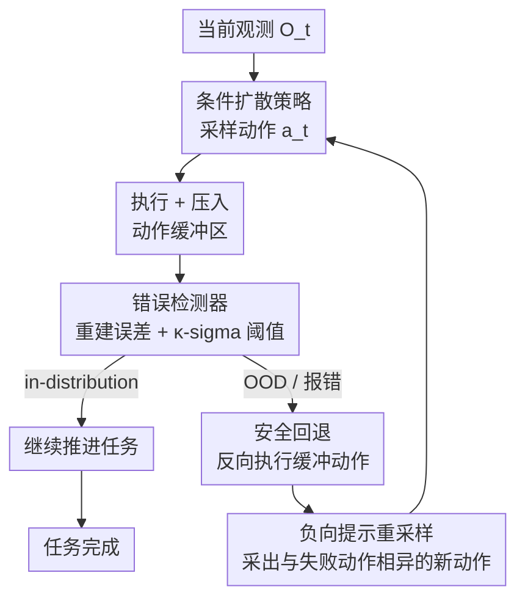

# REACH: Explicit Recovery Behavior for Diffusion Policies

**会议**: CVPR 2026  
**论文**: [CVF Open Access](https://openaccess.thecvf.com/content/CVPR2026/html/Ke_REACH_Explicit_Recovery_Behavior_for_Diffusion_Policies_CVPR_2026_paper.html)  
**代码**: 无  
**领域**: 机器人 / 具身智能 / 扩散策略  
**关键词**: 扩散策略, 负向提示, OOD检测, 错误恢复, 机器人操作

## 一句话总结
REACH 给扩散策略装上"自我纠错"能力：用一个自编码器错误检测器盯住执行过程，一旦发现机器人滑进 OOD（容易失败）的状态，就沿动作缓冲区**回退**到上一个安全状态，再把失败动作当成**负向提示**喂给扩散采样器，逼策略在同一决策点采出一个"明显不同"的更鲁棒动作，从而在仿真和真机操作任务上稳定提升成功率。

## 研究背景与动机
**领域现状**：扩散策略（Diffusion Policy）已经成为机器人模仿学习的主流范式，它能从演示数据里学到复杂、多模态的动作分布，对同一个观测可以生成多个"看上去都合理"的动作。

**现有痛点**：但"多模态"是一把双刃剑——对同一观测采样出的多个合理动作，**鲁棒性并不相等**。某个动作可能把机器人带进一个"鲁棒性盲区"（robustness blind spot）：当前看着没问题，执行下去却让后续状态落到策略没见过的分布外区域，最终任务失败。而这个缺陷只有动作执行**之后**才暴露出来，事前无法分辨。

**核心矛盾**：标准扩散策略是"一锤子买卖"——采样、执行、不回头。它既没有机制去判断某个动作会不会通向失败，也没有机制在踩进坑之后退回来重选，更没有机制保证退回原点后不会再次选中同一个坏动作。

**本文目标**：作者把问题拆成三个研究问题——① 怎么识别会通向鲁棒性盲区的动作？② 进入非鲁棒状态后怎么恢复？③ 回到原决策点后怎么引导策略避开同一个错误、采出更鲁棒的动作？

**切入角度**：作者从生成模型里的**负向提示（negative prompting）** 得到启发——文生图里可以用 negative prompt 把生成结果"推离"不想要的特征。既然扩散策略本质也是扩散模型，那失败的动作序列就可以当作 negative prompt，把采样器从"通向失败"的方向上推开。

**核心 idea**：用"错误检测 + 安全回退 + 负向提示重采样"三件套，把扩散策略从开环执行变成**带后见之明（hindsight）的闭环自纠错**——检测到错误就回退，回退时把刚才的失败动作作为负向条件，引导策略采出与之不同的更优动作。

## 方法详解

### 整体框架
REACH（Recovery through Error-Aware Corrective Hindsight）由三个部件协同：一个条件扩散策略 $\pi$、一个错误检测器（Error Detector）、一个存放"动作-提示"的缓冲区（buffer）。运行时是一个逐时间步的闭环：当前观测 $O_t$ 喂给扩散策略采样动作 $a_t$，执行后把动作压进缓冲区；同时观测过一遍自编码器算重建误差，判断当前状态是 in-distribution 还是 OOD。如果没报错，就沿"绿色路径"继续往任务目标推进；一旦检测到 OOD，就触发**安全回退**——沿缓冲区把最近几步动作反向执行，把机器人退回上一个已知的安全（in-distribution）状态，然后把刚才那段失败轨迹当作**负向提示**重新采样，逼策略采出一个与失败动作明显不同的新动作，反复尝试直到任务成功。整套机制对任意扩散策略都是即插即用的，不需要针对任务重训。

### 关键设计

**1. 自编码器错误检测器：用重建误差当 OOD 报警器**

要做闭环纠错，第一步得能在"事前还没失败"时判断当前状态危不危险，但训练数据里根本没有"失败/异常"的样本——这是一个典型的单类（one-class）分类问题。作者借鉴 Random Network Distillation 的思路，用一个前馈自编码器 $E_\phi, D_\phi$ 只在**成功执行的正常观测**上训练，优化逐像素重建误差。设 $i^k\in[0,1]$ 是图像第 $k$ 个像素归一化强度、$\hat i^k$ 是重建值，损失为

$$L_n(i,\hat i)=\frac{1}{K}\sum_{k=1}^{K}(i^k-\hat i^k)^2$$

直觉是：自编码器学到的是训练分布的核心特征，**像训练数据的输入重建误差小，没见过的新模式重建误差大**。运行时作者把每一步的历史误差建模成高斯分布 $s(\mathbf{x})\sim\mathcal{N}(\mu,\sigma^2)$，用 $\kappa$-sigma 阈值

$$\tau=\mu+\kappa\sigma$$

判定：当 $s(\mathbf{x}_t)>\tau$ 就报错触发回退，否则视为正常。这给了错误门控一个**标定过、推理时又轻量**的简单规则，不需要任何 OOD 样本。

**2. 安全回退机动：按动作空间类型生成"倒带"序列**

检测到错误后，得把机器人从坏状态退回上一个安全状态——但"怎么倒带"取决于动作是怎么定义的。作者把动作空间分成绝对动作（absolute action，指定全局坐标系下的目标状态）和相对动作（relative action，指定相对当前状态的增量），两者倒带方式不同。对**绝对动作空间**，回退序列就是把前向序列简单地按时间倒序：

$$\mathcal{W}_r=\{\mathbf{w}_f^T,\mathbf{w}_f^{T-1},\ldots,\mathbf{w}_f^1\}$$

因为每个动作本身就是一个绝对目标位姿，倒着走一遍即可。对**相对动作空间**，由于每步是 SE(3) 上的增量，不能简单倒序，要在李群上求逆：设初始位姿 $A^0$，第 $t$ 步累积位姿 $\mathbf{A}^t=A^0 a_f^1 a_f^2\cdots a_f^t$，回退序列 $\mathbf{A}_r^t$ 满足 $\mathbf{A}^t\mathbf{A}_r^t=A^0$，从而 $\mathbf{A}_r^t=a_r^t a_r^{t-1}\cdots a_r^1$——即每步增量取逆再倒序复合，保证退回到原始位姿。区分两种空间是关键，否则在相对动作下盲目倒序会把机器人带到完全错误的位置。

**3. 负向提示引导：把失败动作当 negative prompt 推开采样方向**

退回安全状态只解决了"逃离坏状态"，但如果在同一决策点再采一次、又采中那个坏动作，就会陷入死循环。这正是 negative prompting 发挥作用的地方。作者把扩散策略设计成**同时以观测和动作为条件**的条件扩散模型，于是可以像文生图那样做无分类器引导（CFG）的负向扩展：给定正向条件 $c$（想要的）和负向条件 $c_{neg}$（缓冲区里那段失败动作），引导后的噪声预测为

$$\tilde{\boldsymbol{\epsilon}}_\theta(\mathbf{x}_t,t,c,c_{neg})=\boldsymbol{\epsilon}_\theta(\mathbf{x}_t,t,c)+w\cdot\big(\boldsymbol{\epsilon}_\theta(\mathbf{x}_t,t,c)-\boldsymbol{\epsilon}_\theta(\mathbf{x}_t,t,c_{neg})\big)$$

它把生成过程往正向条件 $c$ 对齐的方向推、同时**远离**负向条件 $c_{neg}$ 对齐的方向，引导尺度 $w$ 控制"推开"的强度。提示（prompt）和策略输出动作同形，用 Fourier feature 编码进特征空间；训练时随机在 base-prompt 和 specific-prompt 间切换让策略学会"听懂"提示。这样回退后重采的新动作会被显式地推离上次失败的那个动作模式，从而探索到更鲁棒的解，而且这一切**不需要任务特定的重训**，对任意扩散策略都能加。

## 实验关键数据

实验围绕三个论断展开：①提示机制能有效操控策略动作；②错误检测器能可靠识别次优/OOD 行为；③完整系统相比标准扩散策略提升任务性能。在 Robomimic、MimicGen 仿真基准和 xArm 真机上验证。

### 主实验（仿真，成功率）

| 任务 | Diffusion Policy | Conditional DP | REACH (OOD-detect) | 说明 |
|------|------|------|------|------|
| Can (Paired) | 60.8±1.4 | 64.2±3.8 | **85.0±0** (S=4.5) | 用 PH 数据训检测器后大幅提升 |
| Can (MH) | — | — | **67.5±0** (S=4.5) | 相对基线持续提升 |
| Square (MH) | 0.98/0.84 | 0.96/0.86 | 0.97/0.88 | max/mean 成功率 |
| PushT | 0.91/0.84 | 0.93/0.88 | 0.93/0.89 | 接触密集推块任务 |

在 MimicGen 的 Coffee D2 / Hammer D1 / Three Pc. Assembly D2 / Threading D2 四个更难任务上（100/200 演示），REACH 同样普遍优于 BC-RNN、Diffusion Policy 和 Conditional DP。

### 真机实验（成功率）

| 任务 | Diffusion Policy | REACH (无检测器) | REACH (含检测器) | 提升 |
|------|------|------|------|------|
| Pick Cup | 58% | 66% | **74%** | +16% |
| Banana in Bowl | 48% | 57% | **68%** | +20% |
| Stack Bricks | 32% | 30% | **42%** | +10% |

### 关键发现
- **错误检测器是 pipeline 的关键**：检测器性能高度依赖训练数据来源。在 Can 任务上，用 PH（熟练人类）数据训练的检测器对 paired 数据训练的策略带来显著提升，说明检测器质量直接决定纠错收益。
- **引导尺度有甜区**：一般来说引导强度 $w$ 越大最终成功率越高（Can(Paired) 从 S=0 的 74% 一路升到 S=4.5 的 85%），但**过了饱和点反而会掉点**——过强的负向引导会损害性能。
- **固定 base prompt 在长程任务可能反受其害**：真机 Stack Bricks 上，只加条件提示（不带检测器）的变体反而略低于基线（30% vs 32%），说明对长程、高精度任务，固定提示可能提供不足甚至次优的引导，必须靠错误检测器闭环纠错才能稳住。
- **负向引导确实把动作"推开了"**：用同观测重复推理量化偏离角，加入负向引导后偏离角 $\theta_2$ 一致大于原始随机偏离角 $\theta_1$，且随引导尺度增大而增大，直接验证了负向提示的操控效果。

## 亮点与洞察
- **把文生图的 negative prompt 迁到动作空间**：最妙的一点是认识到"扩散策略也是扩散模型"，于是 CFG 负向引导这套现成机制可以零成本搬到机器人动作生成上——失败轨迹天然就是最好的 negative prompt，不需要人工设计。
- **闭环 hindsight 而非开环执行**：大多数扩散策略采完就执行不回头，REACH 引入"检测→回退→重采"的闭环，把"事后才暴露的失败"变成可纠正的信号，思路可迁移到任何带可逆动作的序列决策任务。
- **绝对/相对动作分开求逆**：回退看似简单，但作者点出相对动作必须在 SE(3) 上逐步求逆复合才能真正退回原位姿，这个工程细节是很多"回退"方案容易踩的坑。
- **即插即用、无需重训**：整套机制不改变底层策略训练，对任意扩散策略都能附加，部署成本低。

## 局限与展望
- **作者承认**：缺少复杂任务的真实 RGB 数据集，导致复杂场景的验证主要停在仿真，泛化性证据有限；当前自编码器检测器表征能力弱，在高度复杂的视觉条件下可能失效。
- **检测器是单点瓶颈**：错误检测器质量直接决定整体性能（实验已显示对训练数据来源极敏感），用简单前馈自编码器的重建误差当 OOD 信号，在视觉杂乱/光照变化大的真实环境里容易误报或漏报。
- **回退假设动作可逆**：安全回退依赖动作能精确"倒带"，对接触密集、不可逆的操作（如倒水、形变物体）回退到上一安全状态可能不现实。
- **改进思路**：作者计划用更强的视觉模型替换自编码器以捕捉更丰富的视觉线索，并在真机更难任务上评估；此外引导尺度的甜区目前靠手调，可考虑自适应调节。

## 相关工作与启发
- **vs 标准 Diffusion Policy**: 标准扩散策略开环采样执行、不判断动作鲁棒性也不回退；REACH 在其上加 OOD 检测 + 回退 + 负向重采，把多模态里的坏动作模式主动过滤掉，区别在于"有没有事后纠错闭环"。
- **vs 引导扩散 / RL 混合策略**: 那类方法在训练或推理时用奖励信号、目标条件或 Q-learning 来改善动作质量，往往需要任务特定训练；REACH 在动作空间直接做负向提示引导，不需重训就能在协变量漂移下提升安全性。
- **vs 传统失败检测与恢复（MPC / 重置策略 / 故障容错控制）**: 经典方法靠学到的动力学模型或运行时监控做 MPC 恢复，或学一个独立的恢复/重置策略；REACH 不学单独的恢复策略，而是复用同一个扩散策略 + 缓冲区倒带 + 负向条件，让恢复和重决策共用一套生成器。

## 评分
- 新颖性: ⭐⭐⭐⭐ 把文生图的负向提示首次系统地迁到扩散策略的动作纠错闭环，角度新颖。
- 实验充分度: ⭐⭐⭐ 仿真 + 真机都有，但真机任务偏短程简单、缺复杂 RGB 数据集，作者自己也承认验证有限。
- 写作质量: ⭐⭐ 思路清晰但 CVF 版本公式排版和表格 OCR 错乱较多、部分记号定义粗糙（如回退公式编号混乱）。
- 价值: ⭐⭐⭐⭐ 即插即用、无需重训地给任意扩散策略加纠错能力，对机器人操作落地有实用价值。

<!-- RELATED:START -->

## 相关论文

- [\[ICML 2026\] Lagrangian Perturbation Diffusion Steering: Latent Reinforcement Learning for Generative Policies](../../ICML2026/robotics/lagrangian_perturbation_diffusion_steering_latent_reinforcement_learning_for_gen.md)
- [\[ICML 2026\] Discrete Diffusion VLA: Bringing Discrete Diffusion to Action Decoding in Vision-Language-Action Policies](../../ICML2026/robotics/discrete_diffusion_vla_bringing_discrete_diffusion_to_action_decoding_in_vision-.md)
- [\[CVPR 2026\] DiffuView: Multi-View Diffusion Pretraining for 3D-Aware Robotic Manipulation](diffuview_multi-view_diffusion_pretraining_for_3d_aware_robotic_manipulation.md)
- [\[CVPR 2026\] FM-Steer: Enhance Generalist Policies with Value-Guided Cascaded Denoising](fm-steer_enhance_generalist_policies_with_value-guided_cascaded_denoising.md)
- [\[CVPR 2026\] SemanticVLA: Towards Semantic Reasoning over Action Memorization via Synergistic Explicit Trace and Latent Action Planning](semanticvla_towards_semantic_reasoning_over_action_memorization_via_synergistic_.md)

<!-- RELATED:END -->
