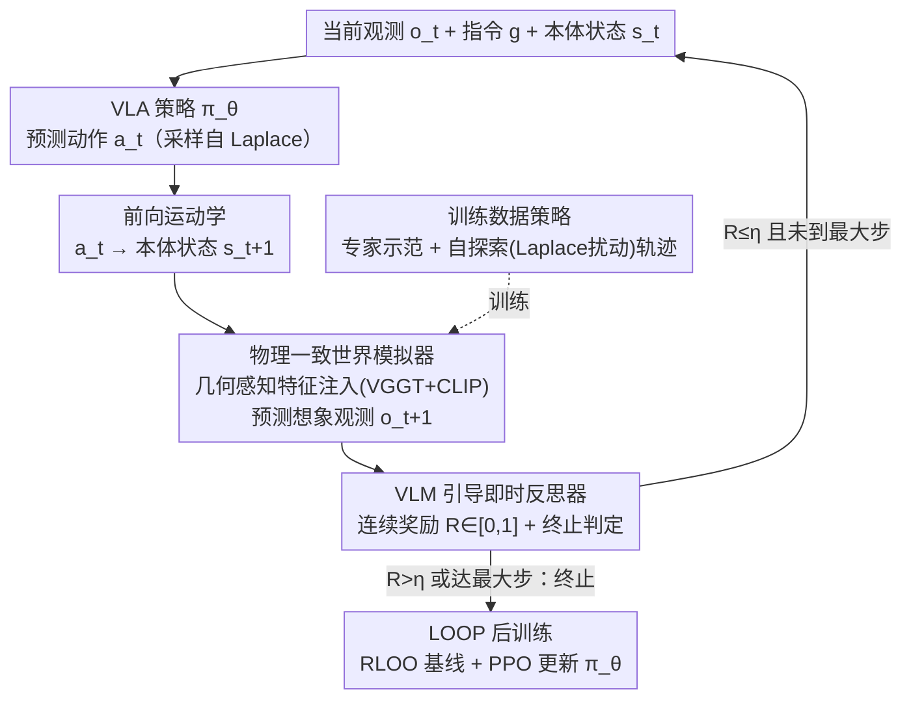

# RehearseVLA: Simulated Post-Training for VLAs with Physically-Consistent World Model

**会议**: CVPR 2026  
**arXiv**: [2509.24948](https://arxiv.org/abs/2509.24948)  
**论文**: [CVF Open Access](https://openaccess.thecvf.com/content/CVPR2026/html/Xiao_RehearseVLA_Simulated_Post-Training_for_VLAs_with_Physically-Consistent_World_Model_CVPR_2026_paper.html)  
**代码**: https://github.com/amap-cvlab/world-env  
**领域**: 机器人 / 具身智能  
**关键词**: VLA、世界模型、强化学习后训练、机器人操作、数据高效

> ⚠️ 命名说明：arXiv 版（2509.24948）的框架名为 **World-Env**，CVF 录用版改题为 **RehearseVLA**。两者为同一篇论文，正文沿用论文内部一直使用的框架名 World-Env。

## 一句话总结
RehearseVLA（World-Env）用一个「物理一致的视频世界模型」当虚拟训练场，让 VLA 策略在想象出来的未来观测里安全地做强化学习后训练，再配一个 VLM 反思器给连续奖励并实时判定任务完成，从而在每个任务只有 5 条专家示范的极端数据稀缺下把 LIBERO 平均成功率从 74.85% 提到 79.6%。

## 研究背景与动机
**领域现状**：Vision-Language-Action（VLA）模型把语言指令端到端映射成机器人动作，主流做法是基于预训练 VLM 用模仿学习（imitation learning / SFT）微调，如 OpenVLA、OpenVLA-OFT、π₀ 等。

**现有痛点**：模仿学习严重依赖大规模高质量示范，数据一稀缺性能就崩；而要靠强化学习（RL）补救又面临两难——真实世界 RL 交互**不可重置**（工业等高风险场景下一旦改变物体状态就难以或无法还原），试错代价高、不可复现；换成传统仿真器虽避开物理风险，却有巨大的搭建工作量、sim-to-real 鸿沟、难以适配新物体和动态场景。此外，现有 VLA **缺少可靠的任务完成检测**，任务已经成功了还在继续动作（如放好物体后还在「过度铲挖」），反而把已完成的状态破坏掉、拉低成功率。

**核心矛盾**：「想用 RL 解决数据稀缺」与「RL 需要一个可反复重置、足够真实、又能理解语义的交互环境」之间存在矛盾——真实世界够真但不可重置，传统仿真器可重置但不够通用/语义贫乏。

**本文目标**：找到一个「理想测试场」，既避开真实世界风险、又比传统仿真器更灵活、语义理解更丰富；同时给 RL 提供稠密、终止感知的奖励。

**切入角度**：作者观察到**视频世界模型**正好填这个空——它具备动作条件下的未来帧预测和持久的隐式场景表示，能生成视觉上可信的未来图像序列，相当于一个零成本、可无限重置、带语义的虚拟环境。

**核心 idea**：用「物理一致的世界模型」代替真实/仿真交互来 rollout，用「VLM 反思器」把二值成功信号换成连续奖励并实时终止，从而在极少示范下安全做 VLA 的 RL 后训练。

## 方法详解

### 整体框架
World-Env 把 VLA 的后训练完全搬进一个由世界模型构成的「虚拟排练场」里闭环运行。一次 rollout 是这样转的：给定当前 RGB 观测 $\mathbf{o}_t$、语言指令 $\mathbf{g}$、本体状态 $\mathbf{s}_t$（6D 末端位姿 + 1D 夹爪），VLA 策略 $\pi_\theta$ 预测连续动作 $\mathbf{a}_t$；动作经**前向运动学**确定性地算出下一本体状态 $\mathbf{s}_{t+1}$；**世界模拟器**以 $\mathbf{s}_{t+1}$ 为条件预测出下一帧想象观测 $\mathbf{o}_{t+1}$；这帧想象观测连同 $\mathbf{s}_{t+1}$ 回灌给策略预测下一动作。如此自回归滚动，直到达到最大步数或 **VLM 反思器**判定任务成功并发出终止信号。整条轨迹拿到的奖励再用于 RL 优化 $\pi_\theta$。世界模拟器训练好后**全程冻结**，只更新策略。

### 关键设计

**1. 物理一致世界模拟器 + 几何感知特征注入：让想象的未来帧「物理上站得住」**

RL rollout 全靠世界模型预测的未来观测，如果这些帧物理上不可信（物体穿模、几何错乱、长程漂移），策略就会在「幻觉环境」里学坏。模拟器以**动作图（action map）**作为像素级条件：把 $\mathbf{s}_{t+1}$ 投影到图像平面，用前景标记编码投影位姿（位置 + 朝向），背景统一涂黑以最大化视觉对比、最小化对场景内容的干扰；动作图再与从记忆库采样的历史观测一起注入一个 U-Net 去噪扩散网络。光有动作条件不够保证几何一致，作者提出**几何感知特征注入**：从两个预训练编码器抽互补特征——VGGT 擅长保留参考图的细粒度几何结构与空间布局、CLIP 捕捉高层语义与上下文——通过多分辨率 cross-attention 注入去噪 U-Net。这种双路注入让生成帧同时尊重局部几何保真和全局语义一致，从而提升长程预测的时序连贯与物理可信。

**2. 模拟器训练数据策略：用自探索 + Laplace 扰动把「失败/次优态」补进训练分布**

只用 LIBERO 的专家成功示范训练世界模型，会让它只见过「成功路径」，一旦 VLA 在 rollout 中预测出偏差动作、进入专家从未到过的状态，模拟器就无法正确建模随之而来的物体状态，导致跟踪崩坏。作者让 SFT 后的 OpenVLA-OFT 策略在 LIBERO 仿真器里**自主探索**收集数据，并额外训练一个**尺度头（scale head）**预测 Laplace 分布的对数尺度参数 $\boldsymbol{\beta}_t$、以 OpenVLA-OFT 的动作 $\boldsymbol{\mu}_t$ 为位置参数，从 $\mathbf{a}_t\sim\text{Laplace}(\boldsymbol{\mu}_t,\boldsymbol{\beta}_t)$ 采样扰动动作去执行，收集大量包含**成功与失败**的 $(\mathbf{o}_t,\mathbf{s}_t,\mathbf{a}_t,\mathbf{s}_{t+1},\mathbf{o}_{t+1})$ 转移对。把这些自探索轨迹和原始人类成功轨迹混合，世界模型才见过足够多的次优状态，在 VLA 预测出错时仍能稳健地建模机械臂跟踪与交互结果。

**3. VLM 引导的即时反思器：连续奖励 + 实时终止，根治稀疏二值奖励的优势塌缩**

以往方法靠仿真器给二值成功信号（成功 1 / 失败 0），有两个硬伤：一是**缺少终止感知**，任务完成后策略还在做冗余动作把已完成态破坏掉；二是当一个 batch 里 rollout **同质**（全成功或全失败）时，二值奖励算出的经验优势整体塌缩为零，没有任何学习信号、训练效率骤降。反思器用一个冻结视觉编码器 + 冻结 LLM + 轻量奖励头 $\mathcal{R}_\theta$，对想象观测视频 $\mathbf{o}_{1:t}$ 和指令 $\mathbf{g}$ 输出逐步连续奖励

$$R(\mathbf{o}_{1:t},\mathbf{g})=\sigma(\mathcal{R}_\theta(h_t))\in[0,1],$$

其中 $h_t$ 是 LLM 在第 $t$ 步池化得到的多模态嵌入，$R$ 估计「到 $t$ 步任务已完成」的概率。奖励头用逐帧二值标签以 BCE 损失训练：$\mathcal{L}=\text{BCE}(R(\mathbf{o}_{1:t},\mathbf{g}),y_t)$。当 $R>\eta$（阈值 $\eta=0.5$）即触发终止，立即停手避免成功后的冗余动作。连续奖励反映细粒度任务进度，保证优势估计非平凡，也免去了刻意平衡成功/失败 rollout 的数据采集负担。

**4. 基于 LOOP 的 VLA 后训练：稀疏轨迹级奖励 + RLOO 基线 + PPO 更新**

拿到反思器奖励后，作者用 **LOOP**（Leave-One-Out PPO，结合 RLOO 的优势估计与 PPO 的更新）做策略优化。RL 时奖励用得很稀疏：整条轨迹只在**终止步**（或没终止时的最后一步 $T$）赋一个标量奖励 $R_n=R(\mathbf{o}_{1:t_{\text{end}}},\mathbf{g})$。对同一初始状态生成 $N$ 条 rollout，RLOO 基线取其余轨迹的平均奖励、得到留一优势：

$$b_n=\frac{1}{N-1}\sum_{j\neq n}R_j,\qquad A_n=R_n-b_n.$$

策略与行为策略都把动作/尺度头视为诱导随机动作分布（各维独立 Laplace 的乘积），按时间步计算重要性比 $r_{t,n}=p_\theta/p_\phi$，用裁剪 PPO 目标更新（优势 $A_n$ 广播到所有时间步）：

$$\mathcal{L}_{\text{PPO}}=-\min\big(r_{t,n}A_n,\ \text{clip}(r_{t,n},1-\epsilon,1+\epsilon)A_n\big).$$

### 损失函数 / 训练策略
- **世界模拟器**：扩散去噪训练，几何感知特征注入（VGGT + CLIP cross-attention），训练后冻结。
- **反思器奖励头**：逐帧二值标签 + BCE 损失。
- **VLA 后训练**：LOOP（RLOO 基线 + 裁剪 PPO，$\epsilon=0.1$），每迭代 $N=8$ 条 rollout，稀疏轨迹级奖励。
- **超参/算力**：8×H20（96GB）训练约 48 小时；VLM 主干用 LoRA（rank 32，lr $1\times10^{-4}$），动作头/尺度头全参训练（lr $1\times10^{-5}$）；batch size 4。

## 实验关键数据

### 主实验
LIBERO 四个任务套件，每任务仅 **5 条**示范训练、全测试集评估。

| 方法 | Goal | Object | Spatial | Long | 平均 |
|------|------|--------|---------|------|------|
| π₀ | 67.6 | 68.4 | 80.2 | 28.2 | 61.1 |
| π₀+FAST | 59.2 | 76.8 | 59.2 | 24.8 | 55.0 |
| OpenVLA | 73.2 | 55.0 | 82.4 | 32.2 | 60.7 |
| UniVLA | 82.0 | 76.2 | 84.4 | 56.4 | 74.75 |
| OpenVLA-OFT | 84.0 | 74.2 | 84.2 | 57.0 | 74.85 |
| **OpenVLA-OFT + 本文后训练** | **86.4** | **86.6** | **87.6** | **57.8** | **79.6** |

对比仿真器 RL 方法 RIPT-VLA（86.2/83.4/88.6/58.4），本文成功率相当，但关键优势是**可直接部署到真实世界**（RIPT-VLA 局限于仿真）。真实世界 4 个任务（clean table / 放绿、红、橙玩具）本文全面优于 OpenVLA-OFT（如 clean table 30 vs 20、put green toy 50 vs 30）。

### 消融实验
表 5：世界模拟器额外训练数据 + 反思器奖励头的作用（LIBERO 成功率）。

| Extra Data | Reward Head | Goal | Object | Spatial | Long |
|:---:|:---:|------|--------|---------|------|
| ✗ | ✗ | 68.4 | 75.2 | 73.2 | 42.2 |
| ✓ | ✗ | 79.8 | 81.8 | 78.4 | 44.6 |
| ✗ | ✓ | 68.8 | 76.4 | 74.4 | 43.8 |
| ✓ | ✓ | **86.4** | **86.6** | **87.6** | **57.8** |

终止机制（表 4，所有方法都在「无真值终止反馈」下评测，到最大步才记成功率）：本文 74.9 平均 vs OpenVLA-OFT 63.05、UniVLA 65.4，验证实时终止能避免成功后冗余动作破坏已完成状态。

### 关键发现
- **额外数据是主力**：单开 Extra Data 平均涨幅最大（Goal 68.4→79.8），说明世界模型必须见过失败/次优态才能在 VLA 出错时稳住；单开 Reward Head 几乎无提升（68.4→68.8），但两者**协同**才爆发（→86.4）——奖励头要建立在高保真模拟之上才有意义。
- **连续奖励解决优势塌缩**：当 rollout 同质时二值奖励优势归零、无学习信号；连续 $[0,1]$ 奖励保证非平凡优势，也省去平衡成功/失败样本。
- **终止机制的真实价值**：图 8 展示「把酒瓶放到柜顶」成功后因延迟终止反而失败的案例，证明动态终止不是锦上添花而是必需。
- **收敛快**：多目标任务上 20 个训练步内即超过 SFT 基线。

## 亮点与洞察
- **把视频世界模型当「可重置的 RL 训练场」**：相比真实世界（不可重置）和传统仿真器（语义贫乏、sim-to-real 难），世界模型零成本、可无限 rollout、自带语义理解，是数据稀缺下做 VLA RL 的巧妙载体。
- **几何感知特征注入（VGGT+CLIP 双路）**：几何分支保物理可信、语义分支保上下文一致，专治世界模型长程预测漂移——这个「几何 + 语义」互补注入思路可迁移到任何动作条件视频生成。
- **连续奖励替二值奖励根治优势塌缩**：把「成功检测」从 0/1 硬判定变成 $[0,1]$ 概率，既给稠密学习信号又顺手实现实时终止，一举两得，可复用到其他稀疏奖励 RL 场景。
- **「失败也要喂给模拟器」**：用 Laplace 扰动主动采集次优/失败转移，让世界模型对 OOD 动作鲁棒——提醒我们训练动力学模型时不能只喂专家成功轨迹。

## 局限与展望
- **依赖高质量训练数据**：世界模拟器和反思器都需多样训练数据才能高保真模拟/准确评估，作者寄望未来通用世界模型缓解这一依赖。
- **训练慢**：模拟器逐帧生成轨迹的计算瓶颈使策略优化比并发方法慢，需更高效的模拟来解决。
- **自评补充**：实验主要在 LIBERO + 4 个真实任务，世界模型本身的几何保真度只有定性图（图 6）和间接的下游成功率支撑，缺少对预测帧物理一致性的定量度量；真实世界仅 10 条轨迹/任务、4 个任务，规模较小。
- **改进思路**：把昂贵的逐步扩散 rollout 换成隐空间一步/少步预测以提速；引入对预测帧的显式物理/几何一致性度量做闭环监督。

## 相关工作与启发
- **vs RIPT-VLA（仿真器 RL）**：两者都给 VLA 做 RL 后训练且 LIBERO 成绩相当，但 RIPT-VLA 靠传统仿真器、只能跑在仿真里；本文用世界模型 + VLM 连续奖励，可直接迁移真实世界，且无需仿真器搭建。
- **vs OpenVLA-OFT（SFT 基线）**：本文以它为初始策略，在其之上做世界模型内 RL 后训练，LIBERO 平均 +4.75、真实任务全面领先，证明「在想象环境里再排练一遍」能补 SFT 在数据稀缺下的不足。
- **vs 经典 model-based RL（Dreamer 系）**：早期 world model RL 多靠 on-policy 数据、泛化到特定环境受限；本文用扩散视频生成训练 offline 世界模型并冻结，服务于通用 VLA 操作任务。

## 评分
- 新颖性: ⭐⭐⭐⭐ 「世界模型当 VLA 的可重置 RL 训练场 + VLM 连续奖励实时终止」组合切中数据稀缺与安全两大痛点，几何感知注入与失败数据增广都有巧思。
- 实验充分度: ⭐⭐⭐⭐ LIBERO 全套 + 真实世界 + 三组消融（数据/奖励头/终止）齐全；但真实任务规模小、世界模型物理一致性缺定量度量。
- 写作质量: ⭐⭐⭐⭐ 动机—方法—实验逻辑清晰，公式与图示到位；arXiv/CVF 双名易混淆。
- 价值: ⭐⭐⭐⭐ 为资源受限场景的 VLA 后训练提供了实用、可落地真实世界的方案，几何+语义注入与连续奖励思路有迁移价值。

<!-- RELATED:START -->

## 相关论文

- [\[CVPR 2026\] Chain of World: World Model Thinking in Latent Motion (CoWVLA)](chain_of_world_world_model_thinking_in_latent_motion.md)
- [\[CVPR 2026\] QuantVLA: Scale-Calibrated Post-Training Quantization for Vision-Language-Action Models](quantvla_scale-calibrated_post-training_quantization_for_vision-language-action_.md)
- [\[CVPR 2026\] Learning to Control Physically-simulated 3D Characters via Generating and Mimicking 2D Motions](learning_to_control_physically-simulated_3d_characters_via_generating_and_mimick.md)
- [\[CVPR 2026\] Motus: A Unified Latent Action World Model](motus_a_unified_latent_action_world_model.md)
- [\[ICML 2026\] Dual-Stream Diffusion for World-Model Augmented Vision-Language-Action Model](../../ICML2026/robotics/dual-stream_diffusion_for_world-model_augmented_vision-language-action_model.md)

<!-- RELATED:END -->
