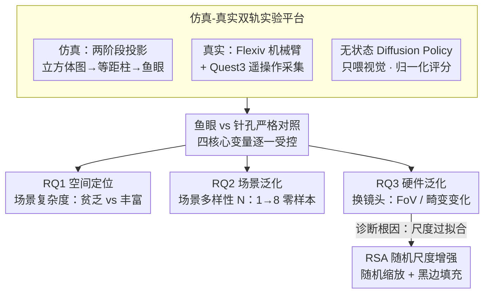

# Rethinking Camera Choice: An Empirical Study on Fisheye Camera Properties in Robotic Manipulation

**会议**: CVPR 2026  
**arXiv**: [2603.02139](https://arxiv.org/abs/2603.02139)  
**作者**: Han Xue, Min Nan, Xiaotong Liu, Wendi Chen, Yuan Fang, Jun Lv, Cewu Lu, Chuan Wen (上海交通大学, 东南大学, 中科大等)
**项目页**: [robo-fisheye.github.io](https://robo-fisheye.github.io/)
**领域**:机器人  
**关键词**: 鱼眼相机, 机器人操作, 模仿学习, 视场角, 泛化性

## 一句话总结

首次系统性地对腕部鱼眼相机在机器人操作模仿学习中的特性进行实证研究，围绕空间定位、场景泛化和硬件泛化三个核心问题揭示了宽视场角的优势与局限，并提出 Random Scale Augmentation (RSA) 策略解决跨相机迁移中的尺度过拟合问题。

## 研究背景与动机

鱼眼相机凭借超广视场角（FoV > 180°）在机器人操作中的应用快速增长，但学术界对鱼眼相机如何影响策略学习的理解远远落后于其实际部署。

**现有问题**：
- 鱼眼相机引入的强径向畸变对视觉编码器的影响尚不明确
- 宽 FoV 在不同场景复杂度下的实际收益缺乏量化分析
- 不同鱼眼镜头之间的策略迁移（硬件泛化）存在系统性失败，但根因不清
- 缺乏涵盖仿真和真实世界的系统性基准来指导鱼眼数据集的大规模采集

**核心动机**：建立首个系统性实证研究框架，回答三个关键研究问题：

**RQ1 - 空间定位**：宽 FoV 能否增强策略的空间定位能力？

**RQ2 - 场景泛化**：鱼眼相机如何影响对新背景的泛化？

**RQ3 - 硬件泛化**：策略能否在不同鱼眼镜头之间迁移？

## 方法详解

### 整体框架

这篇论文不是提一个新模型，而是把"腕部该用鱼眼还是针孔相机"这件被工程界默默选定、却没人系统验证过的事，拆成三个递进的研究问题逐一证伪/证实。作者搭了一套仿真+真实世界双轨平台，在同一批任务上把鱼眼和针孔放进严格对照下比较：先看宽视场角是否真能增强空间定位（RQ1），再看它如何影响对新场景的泛化（RQ2），最后追问策略能否跨不同鱼眼镜头迁移、失败的根因是什么（RQ3），并据此给出一个即插即用的修复手段 RSA。整套流程可概括为：先把平台（仿真两阶段鱼眼渲染 + 真实遥操作采集 + 无状态 Diffusion Policy）搭好，再把鱼眼/针孔放进"四核心变量逐一受控"的对照里，分头回答三个 RQ，其中 RQ3 暴露的失败追溯到尺度过拟合并用 RSA 修复。

### 关键设计

**1. 仿真-真实双轨实验平台：让"换相机"成为可严格控制的变量**

要回答"鱼眼到底带来什么"，难点在于换相机往往牵出一堆混杂变量。作者真实世界端用 Flexiv Rizon 4 七轴机械臂加 DH AG-160-95 自适应夹爪，通过 Meta Quest 3 头显遥操作采集示教；仿真端在 MuJoCo 里实现两阶段投影管线——先把六个朝向的虚拟相机拼成立方体图、展开成等距柱全景图，再投影成鱼眼视图，这样 FoV、畸变等镜头参数都能精确拨动。策略侧统一用只喂视觉、不带本体感觉的无状态 Diffusion Policy（仿真用 ResNet-18、真实用 CLIP ViT 编码器），把相机本身的影响从其他变量里剥离出来。任务上用 3 个真实任务（Pick Cup、Fold Towel、Hang Chinese Knot）加 6 个改编自 Robomimic/MimicGen 的仿真任务，评估不用粗糙的二元成功率，而用多阶段归一化评分（normalized score），能区分"差一点完成"和"完全失败"。

**2. RQ1 空间定位：把"鱼眼有用"绑定到场景复杂度**

针对"宽 FoV 能否增强定位"，作者的假设是：鱼眼的价值在于把更多静态环境特征收进画面当作视觉锚点，因此收益应强烈依赖场景的视觉复杂度。为验证，他们在特征贫乏（纯色背景）和特征丰富（纹理布/杂物）两种环境下对比，并刻意用无状态策略——不喂本体感觉，逼策略只能靠视觉定位。结果是鱼眼+丰富场景让策略仅凭视觉就能完成高精度操作，相当于把机器人与环境的空间关系隐式编码进了视觉特征，显式本体感觉（proprioception）反而变得冗余；而纯色背景下宽 FoV 没东西可锚定，优势随之消失。

**3. RQ2 场景泛化：宽视场角等价于一次隐式数据增强**

第二个问题问的是鱼眼如何影响对新背景的泛化。假设是鱼眼能更高效地利用场景多样性，随训练场景数 $N$ 增加，性能曲线更陡。实验把总数据量固定（如 200 条轨迹），只增加独立训练场景数 $N$（从 1 到 8，用 32 种背景纹理），在完全没见过的测试背景上零样本评估。关键在于腕部相机会随手臂移动，宽 FoV 天然带来更大的视角变化，等价于一次场景级的隐式数据增强——所以真实世界里鱼眼策略只要 8 个多样场景就逼近满分（0.988），而针孔在 $N=8$ 反而退化。

**4. RQ3 硬件泛化与 RSA：从绝对像素尺度过拟合到相对空间关系**

最后一个问题是策略能否换一只鱼眼镜头继续用。作者诊断出失败根因是尺度过拟合（Scale Overfitting）：策略记住了训练镜头下物体的绝对像素尺度，换镜头后同一物体在图像里变大变小，策略就把尺度误读成深度——放大被当成"更近"（undershoot），缩小被当成"更远"（overshoot）。修复手段 Random Scale Augmentation（RSA）极简：训练时从均匀分布随机采样缩放因子 $s$（如 $0.7\sim1.3$），$s>1$ 时缩小图像并用黑边填充（zoom-out 效果），逼网络去学"目标相对于夹爪"这类相对空间关系而非绝对像素大小。它不改网络结构、即插即用，却把广角镜头上几乎全崩（0.003）的迁移拉回到可用区间。

## 实验关键数据

### Table 1: RQ1 - 真实世界空间定位（归一化分数，无状态策略）

| 任务 | 相机类型 | 贫乏场景 | 丰富场景 | 增益 |
|---|---|---|---|---|
| Pick Cup | Fisheye (State-free) | 0.525 | 0.800 | **+0.275** |
| Fold Towel | Fisheye (State-free) | 0.100 | 0.700 | **+0.600** |
| Hang Chinese Knot | Fisheye (State-free) | 0.200 | 0.500 | **+0.300** |

鱼眼 + 丰富场景在所有任务上均大幅超越贫乏场景，Fold Towel 增益最大达 **+0.600**。仿真中鱼眼在丰富场景的 SR 为 0.66，较 Pinhole 的 0.34 提升 **+0.32**。

### Table 2: RQ3 - RSA 尺度敏感性分析（仿真，归一化分数）

| 缩放因子 $S$ | 效果 | Baseline | RSA |
|---|---|---|---|
| 0.70 | 强烈放大 | 0.000 | **0.900** |
| 0.85 | 适度放大 | 0.950 | **1.000** |
| 1.00 | 训练尺度 | 1.000 | 1.000 |
| 1.15 | 适度缩小 | 0.750 | **0.975** |
| 1.30 | 强烈缩小 | 0.650 | **1.000** |

Baseline 在尺度偏移时呈"倒 V 形"急剧衰减（$S=0.70$ 时直降为 0），RSA 在全尺度范围保持 0.9+ 稳健表现。

### 补充数据

**RQ2 场景泛化（真实世界 Pick Cup）**：

| 训练场景数 $N$ | Pinhole | Fisheye |
|---|---|---|
| 1 | 0.081 | 0.556 |
| 4 | 0.238 | 0.869 |
| 8 | 0.181 | **0.988** |

Fisheye 的 scaling 曲线远陡于 Pinhole，$N=8$ 时近乎完美；Pinhole 在 $N=8$ 时反而下降。

**RQ3 真实硬件跨相机迁移**：

| 镜头 | FoV | 尺度变化 | Baseline | RSA |
|---|---|---|---|---|
| 训练镜头 | 180° | 1.0x | 1.000 | 1.000 |
| 窄镜头 | 150° | ~1.2x (放大) | 0.500 | **0.950** |
| 广角镜头 | 220° | ~0.8x (缩小) | 0.003 | **0.600** |

Baseline 在广角镜头上几乎完全失败（0.003），RSA 将其提升至 0.600。

## 亮点与洞察

- **首个系统性实证研究**：填补了鱼眼相机在机器人操作策略学习中缺乏系统分析的空白，三个研究问题层层递进，结论具有实操指导意义
- **场景复杂度的关键作用**：揭示了"鱼眼有用"的前提条件——必须在视觉特征丰富的环境中才能充分发挥宽 FoV 的定位优势，纯色背景下改善有限
- **隐式数据增强效应**：鱼眼相机的宽 FoV 在腕部移动时天然引入更大的视角变化，等价于场景级数据增强，这是其泛化优势的根本来源
- **Scale Overfitting 的诊断与修复**：精准定位跨相机迁移失败的根因为尺度过拟合，提出的 RSA 策略极其简洁（仅需随机缩放+黑边填充），但效果显著
- **实用指南**：为大规模鱼眼数据集采集提供了三条明确建议——在丰富环境采集、最大化场景多样性、使用 RSA 训练

## 局限性

- **仅限腕部视角**：所有实验基于 wrist-mounted 鱼眼相机，未探索第三人称视角或多视角融合的场景
- **任务范围有限**：3 个真实世界任务 + 6 个仿真任务，未涵盖灵巧操作、长时序或高精度装配等更复杂场景
- **RSA 的局限**：广角镜头（220°）迁移仅达 0.600，距完美仍有差距；极端焦距变化下仿真表现仅 0.06，说明 RSA 不能完全解决所有硬件差异
- **未考虑畸变矫正**：未探索先做几何矫正再训练策略的方案，这可能是更直接的跨相机迁移路径
- **仅评估模仿学习**：未涉及强化学习或在线适应方案，RSA 在 RL 范式下的效果未知

## 相关工作

- **鱼眼相机在机器人中的应用**：FisheyeStereoNet（鱼眼深度估计）、BiFuse/OmniFusion（全景深度）→ 聚焦感知层面，缺乏对策略学习的系统分析
- **机器人操作中的相机选择**：UMI/ALOHA（腕部相机方案）、RoVi-Aug/MimicGen（视觉增强）→ 均使用针孔相机，未考虑 FoV 的影响
- **域适应与泛化**：Domain Randomization、Random Crop Augmentation → RSA 可视为尺度维度的域随机化，但针对性更强
- **本文定位**：首次从策略学习角度系统研究相机模型选择的影响，填补了"相机→感知→策略"链路中相机选择环节的研究空白

## 评分

- 新颖性: ⭐⭐⭐⭐ — 作为实证研究本身方法创新有限，但研究问题的提出和 RSA 的发现具有实际价值
- 实验充分度: ⭐⭐⭐⭐⭐ — 仿真+真实世界双轨验证，6+3 任务，消融实验设计严谨，控制变量清晰
- 写作质量: ⭐⭐⭐⭐ — 三个RQ结构清晰，假设-验证-结论的组织方式易于跟随
- 价值: ⭐⭐⭐⭐ — 为鱼眼数据集大规模采集提供了可直接执行的指南，RSA 策略简洁实用

<!-- RELATED:START -->

## 相关论文

- [\[CVPR 2026\] Rethinking Intermediate Representation for VLM-based Robot Manipulation](rethinking_intermediate_representation_for_vlm-based_robot_manipulation.md)
- [\[AAAI 2026\] Sim-to-Real: An Unsupervised Noise Layer for Screen-Camera Watermarking Robustness](../../AAAI2026/robotics/sim-to-real_an_unsupervised_noise_layer_for_screen-camera_watermarking_robustnes.md)
- [\[CVPR 2026\] INSIGHT Bench: Towards Grounded IN-SItu Guidance for Robotic Manipulation](insight_bench_towards_grounded_in-situ_guidance_for_robotic_manipulation.md)
- [\[CVPR 2026\] Learning Surgical Robotic Manipulation with 3D Spatial Priors](learning_surgical_robotic_manipulation_with_3d_spatial_priors.md)
- [\[CVPR 2026\] DiffuView: Multi-View Diffusion Pretraining for 3D-Aware Robotic Manipulation](diffuview_multi-view_diffusion_pretraining_for_3d_aware_robotic_manipulation.md)

<!-- RELATED:END -->
